# 1. 数理逻辑 

[TOC]

逻辑：研究推理的科学

数学方法：引进一套符号系统的方法

>   数理逻辑是**用数学方法研究形式逻辑的科学**，即使用符号化系统研究推理的方法。又称符号逻辑。

## 1.1 命题逻辑

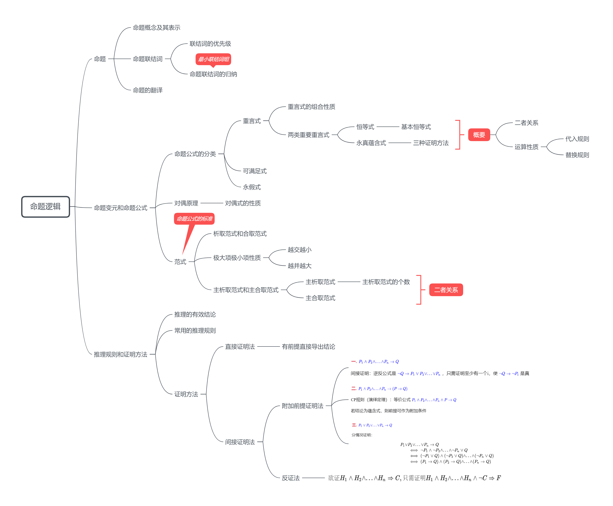

### 1.1.1 命题

>   命题：可以判断真假的断言

-   断言：一个 **陈述句**

-   真值：命题的结果为真，真值为真；命题结果为假，真值为假

>   悖论：真假无法确定的断言称为悖论

>   原子命题(本原命题)：一个不能分解成更简单的命题

#### 1. 命题联结词

>   命题演算中的运算符

-   命题和原子命题通过 **命题联结词** 构成新的 **复合命题**

##### 否定词¬

>   P表示命题，¬P(P的否定)表示P不真

| P    | ¬P   |
| ---- | ---- |
| 0    | 1    |
| 1    | 0    |

**注：**

P：都是... ；¬P：不都是 $$\neq$$ 都不是

##### 合取∧

>   若P和Q都是命题，则 “P并且Q” 这一命题表示为 P∧Q（P和Q的合取）

| P    | Q    | P∧Q  |
| ---- | ---- | ---- |
| 0    | 0    | 0    |
| 0    | 1    | 0    |
| 1    | 0    | 0    |
| 1    | 1    | 1    |

##### 析取∨

>   若P和Q命题，那么 “P或Q” 这一命题表示为 P∨Q（P和Q的析取）
>
>   -   可兼或：不排除P、Q都会发生

| P    | Q    | P∨Q  |
| ---- | ---- | ---- |
| 0    | 0    | 0    |
| 0    | 1    | 1    |
| 1    | 0    | 1    |
| 1    | 1    | 1    |

##### 蕴含词→

>   设P和Q是命题，新命题 “P蕴含Q” 表示为 P→Q（P蕴含Q）
>
>   -   P：前提、假设或前件
>   -   Q：结论、后件
>

>   蕴含式 P→Q 的多种陈述方式

-   若P，则Q
-   P是Q的充分条件；Q是P的必要条件
-   Q每当P
-   P仅当Q

| P    | Q    | P→Q  |
| ---- | ---- | ---- |
| 0    | 0    | 1    |
| 0    | 1    | 1    |
| 1    | 0    | 0    |
| 1    | 1    | 1    |

应用：P→Q为假，当且仅当P真Q假

-   以假的条件为前提，不管结论真假，新命题 P→Q 都是真的
-   以真的条件为前提，结论的真值就是新命题 P→Q 的真值

>   蕴含式 P→Q 的关联命题

**逆反命题：¬Q→¬P**

逆命题：Q→P

反命题：¬P→¬Q

>   蕴含式分类（不重要）

-   因果蕴含：用于断言前提和结论之间的因果或实质关系

    P：G是正方形，Q：G的四边相等

-   实质蕴含：前提和结论之间无因果或实质关系，这种蕴含式叫实质蕴含

    P：桔子是紫色的，Q：大地是不平的

##### 等值↔

>   设P和Q是命题，新命题 “P等值于Q” 表示为 P↔Q（P等值于Q）

>   多种陈述方式

-   P是Q的充要条件
-   P当且仅当Q

| P    | Q    | P↔Q  |
| ---- | ---- | ---- |
| 0    | 0    | 1    |
| 0    | 1    | 0    |
| 1    | 0    | 0    |
| 1    | 1    | 1    |

##### 与非

$$P\uparrow Q \iff ¬(P∧Q)$$ 

| P    | Q    | P$$\uparrow$$Q |
| ---- | ---- | -------------- |
| 0    | 0    | 1              |
| 0    | 1    | 1              |
| 1    | 0    | 1              |
| 1    | 1    | 0              |

$$
\begin{aligned}
1.& P\uparrow P\iff ¬(P∧P) \iff ¬P\\
2. &(P\uparrow Q) \uparrow(P\uparrow Q) \iff ¬(P\uparrow Q) \iff P∧Q\\
3.&(P\uparrow P)\uparrow(Q\uparrow Q) \iff ¬P\uparrow¬Q \iff P∨Q
\end{aligned}
$$

##### 或非

$$P\downarrow Q\iff ¬(P∨Q)$$

| P    | Q    | P$$\downarrow$$Q |
| ---- | ---- | ---------------- |
| 0    | 0    | 1                |
| 0    | 1    | 0                |
| 1    | 0    | 0                |
| 1    | 1    | 0                |

$$
\begin{aligned}
1.& P\downarrow P\iff ¬(P∨P) \iff ¬P\\
2. &(P\downarrow Q) \downarrow(P\downarrow Q) \iff ¬(P\downarrow Q) \iff P∨Q\\
3.&(P\downarrow P)\downarrow(Q\downarrow Q) \iff ¬P\downarrow¬Q \iff P∧Q
\end{aligned}
$$

#### 2. 联结词优先级

-   强弱顺序 ¬ > ∧ > ∨ > → > ↔
-   相同的运算符，按从左至右的顺序计算，括号可省略
-   最外层的圆括号可以省略

如：(¬((P∧¬Q)∨R)→((R∨P)∨Q)) 可写成 ¬(P∧¬Q∨R)→R∨P∨Q

#### 3. 命题翻译

1.  设P：明天下雨，Q：明天下雪，R：我去学校

    -   如果明天不是雨夹雪，则我去学校：¬(P∧Q)→R
    -   如果明天不下雨且不下雪，则我去学校：¬P∧¬Q→R
    -   如果明天下雨或下雪，则我不去学校：P∨Q→¬R
    -   明天，雨雪无阻，我一定去学校：P∧Q∧R∨¬P∧Q∧R∨P∧¬Q∧R∨¬P∧¬Q∧R
    -   当且仅当明天不下雪且不下雨时，我才去学校：¬P∧¬Q↔R

2.  说小学生编不了程序或说小学生使用不了个人计算机，那是不对的

    设P：小学生会变成，Q：小学生会用个人计算机

    ¬(¬P∨¬Q)

3.  若不是他生病或出差了，我是不会同意他不参加学习的

    设P：他生病了，Q：他出差了，R；我同意他不参加学习

    ¬(P∨Q)↔¬R 或 P∨Q↔R

#### 4. 联结词归纳

>   一个联结词集合，用其中联结词构成的式子足以把一切命题公式等价表达出来，则这个联结词集合称为全功能的

$$
\begin{aligned}
\{¬,∨\}、&\{¬,∧\}及其变形都是全功能集
\end{aligned}
$$

判断联结词集合A是不是全功能集，选全功能联结词集合B，若B中每一联结词都能用A中联结词表示，则A是全功能的

### 1.1.2 命题变元和命题公式

>   命题变元：以”真“、”假“为变域的变量

-   T和F称为命题常元

-   原子公式：单个命题变元或命题常元

>   命题公式定义
>
>   1.  单个原子公式是命题公式
>   2.  如果A和B是命题公式，则由命题联结词关联的A和B也是命题公式
>   3.  命题公式是有限的

>   指派：有 n 个命题变元的命题公式( $$P_1,P_2,...,P_n$$ )，命题变元的真值有 $$2^n$$ 种不同的组合。每种组合为一个指派

-   对应每一指派，命题公式得到确定的值，即命题公式成为命题。

#### 1. 重言式

>   重言式(永真式)：对所有指派，命题公式的取值均为 T
>
>   矛盾式(永假式)：对所有指派，命题公式的取值均为 F

-   偶然式：不是永真式及永假式
-   可满足的：一个公式至少存在一个指派使其值为真

-   非永真：一个命题公式至少存在一个指派使其值为假

##### 重言式性质

1.  重言式的否定是矛盾式，矛盾式的否定是重言式
2.  重言式的合取、析取、蕴含、等值等都是重言式

##### 两类重要的重言式

###### 恒等式

>   由相同命题公式组成的命题组 $$A(P_1,P_2,...,P_n)$$ 和 $$B(P_1,P_2,...,P_n)$$ ，如果 A↔B 是重言式，则队A与B的任何指派都有相同的真值(全0或全1)，则 A恒等于B 或 A等价于B。记为 $$A \iff B$$ (逻辑恒等式)

| 逻辑恒等式                                                   | 描述           |
| ------------------------------------------------------------ | -------------- |
| ¬¬p $$\iff$$ P                                               | 双否定         |
| P ∨ P $$\iff$$ P                                             | 等幂律         |
| P∧P $$\iff$$ P                                               | 等幂律         |
| P ∨ Q $$\iff$$ Q ∨ P                                         | 交换律         |
| P∧Q $$\iff$$ Q∧P                                             | 交换律         |
| (P∨Q)∨R $$\iff$$ P∨(Q∨R)                                     | 结合律         |
| (P∧Q)∧R $$\iff$$ P∧(Q∧R)                                     | 结合律         |
| P∨(Q∧R) $$\iff$$ (P∨Q)∧(P∨R)                                 | 分配律         |
| P∧(Q∨R) $$\iff$$ P∧Q∨ P∧R                                    | 分配律         |
| ¬(P∨Q) $$\iff$$ ¬P∧¬Q                                        | **德摩根律**   |
| ¬(P∧Q) $$\iff$$ ¬P∨¬Q                                        | **德摩根律**   |
| P∨(P∧Q) $$\iff$$ P                                           | 吸收律         |
| P∧(P∨Q) $$\iff$$ P                                           | 吸收律         |
| P→Q  $$\iff$$ ¬P∨Q                                           | **蕴含表达式** |
| P↔Q $$\iff$$ (P→Q)∧(Q→P)  $$\iff$$ (¬P∨Q)∧(¬Q∨P) $$\iff$$ ¬P∧¬Q ∨ Q∧P | **等值表达式** |
| P∨¬P $$\iff$$ T                                              | **排中律**     |
| P∧¬P $$\iff$$ F                                              | **矛盾律**     |
| P→Q $$\iff$$ ¬Q→¬P                                           | **逆反律**     |

###### 永真蕴含式

>   如果 A→B 是以永真式，则称为永真蕴含式，记为 A $$\Rightarrow$$ B(A永真蕴含B)

**证明蕴含式永真**：

方法一：真值表

方法二：命题演算

| 永真式                  | 推导                                                         |
| ----------------------- | ------------------------------------------------------------ |
| P$$\Rightarrow$$P∨Q     | ¬P∨P∨Q=T∨Q=T                                                 |
| P∧Q$$\Rightarrow$$P     | ¬(P∧Q)∨P=¬P∨¬Q∨P=T                                           |
| P∧(P→Q)$$\Rightarrow$$Q | ¬(P∧(P→Q)∨Q=¬P∨¬(¬P∨Q)∨Q =¬P∨P∧¬Q∨Q=¬(P∧¬P∨Q∧¬Q) =¬(F∨F)=T |

方法三：分情况讨论

-   假定前件真，若能推出后件真，则此蕴含式真

-   假定后件假，若能退出前件假，则此蕴含式真

例：证明 ¬Q∧(P->Q)$$\Rightarrow$$¬P

1.  真值表

    若前件真，则¬Q与P->Q为真，即Q为假，进而推出P是假，因而后件是真，满足蕴含式的定义

2.  分情况讨论

    设P是真，即后件假，若能证明前件假，则为永真蕴含式

    (1) 若Q为真，则¬Q为假，P$$\rightarrow$$Q为真，故 ¬Q∧(P->Q) 为假

    (2) 若Q为假，则¬Q为真，P$$\rightarrow$$Q为假，故 ¬Q∧(P->Q) 为假

    故等式为永真蕴含式

###### 恒等式与永真蕴含关系

$$A\iff B$$，就是 $$A\Rightarrow B$$ 和 $$B\Rightarrow A$$ 同时成立

###### 恒等式和永真蕴含式的性质

**传递性**

若 A$$\iff$$B、B$$\iff$$C，则 A$$\iff$$C

若 A$$\Rightarrow$$B、B$$\Rightarrow$$C，则 A$$\Rightarrow$$C

**永真蕴含结合律**

若A$$\Rightarrow$$B、A$$\Rightarrow$$C，则A$$\Rightarrow$$B∧C

**代入规则** (变形式)

>   用同一公式代替出现在重言式中的某个命题变元，所得的仍是重言式

-   代入后所得公式称为原公式的代入实例

对于非重言式，不做代入运算，因为所得的代入实例性质不确定

**替换规则** (真值不变)

若A$$\iff$$B，在公式C中出现A的地方可替换为B，得到公式D，则C$$\iff$$D

-   在公式C和D中，除替换部分外均相同，但对任一指派，A与B的真值相等，故C与D的真值也相等

>   代入规则和替换规则是命题演算的基础

#### 2. 对偶原理

>   对偶公式：设有公式A仅有联结词∧、∨、¬。将A中∧、∨、T、F分别换为∨、∧、F、T得到公式 $$A^*$$ ，则 $$A^*$$ 称为A的对偶公式

-   对偶是相互的

1.  设A与$$A^*$$是对偶式关系

    设$$P_1,P_2,...,P_n$$是出现于A和$$A^*$$的所有命题变元，则$$¬A(P_1,P_2,...,P_n)\iff A^*(¬P_1,¬P_2,...,¬P_n)$$

2.  等价命题公式的对偶式相互等价

    若$$A\iff B$$ ,且A、B为由命题变元$$P_1,P_2,...,P_n$$及联结词∧、∨、¬构成的公式，则$$A^*\iff B^*$$

3.  若$$A\Rightarrow B$$，且A、B为由命题变元$$P_1,P_2,...,P_n$$及联结词∧、∨、¬构成的公式，则$$B^*\Rightarrow A^*$$

#### 3. 范式

>   将命题公式转化为其逻辑等价的标准形式

##### 析取范式和合取范式

>   基本积：若干命题变元及其否定的合取式
>
>   基本和：若干命题变元及其否定的析取式

**例**：

-   P、P∧Q、¬P∧Q等都是基本积
-   P、P∨Q、¬P∨Q等都是基本和

**性质** ：

-   一个基本积是永假式，当且仅当他只含有P、¬P形式的两个因子

    ¬P∧P=F

-   一个基本和是永真式，当且仅当他含有P、¬P形式的两个因子

    ¬P∨P=T

>   析取范式：一个基本积之和的公式，如果与给定的命题公式A等价，则称它为A的析取范式

$$
A\iff A_1∨A_2∨...∨A_n,n\ge1,A_i是基本积
$$

任何一个命题公式的析取范式否是不唯一的，运算符最少的称为 **最简析取范式**
$$
\begin{aligned}
¬(P∨Q)&↔(P∧Q) \\
& \iff¬(¬(P∨Q))∧¬(P∧Q)∨¬(P∨Q)∧(P∧Q)\\
& \iff(P∨Q)∧(¬P∨¬Q)∨(¬P∧¬Q)∧(P∧Q)\\
& \iff Q∧¬P∨P∧¬Q
\end{aligned}
$$

>   合取范式：一个基本和之积组成的公式，如果与给定的命题公式A等价，则称它是A的合取范式

$$
A\iff A_1∧A_2∧...∧A_n,n\ge1,A_i是基本和
$$

任何一个命题公式的合取范式否是不唯一的，运算符最少的称为 **最简合取范式**

$$
\begin{aligned}
¬(P∨Q)&↔(P∧Q) \\
& \iff¬(¬(P∨Q))∧¬(P∧Q)∨¬(P∨Q)∧(P∧Q)\\
& \iff(P∨Q)∧(¬P∨¬Q)
\end{aligned}
$$

##### 极大项与极小项

>   极小项：在n个变元的基本积中，若每一个变元与其否定不同时存在，而两者之一必出现且仅出现一次

n个变元可构成 $$2^n$$ 个不同的极小项

$$
\begin{aligned}
m_0 &\iff ¬P_1∧¬P_2∧...∧¬P_n\\
m_1 &\iff ¬P_1∧¬P_2∧...∧P_n\\
\vdots\\
m_{2^n-1} &\iff P_1∧P_2∧...∧P_n
\end{aligned}
$$

-   极小项下标与指派真值关系：命题变元指派为1，命题变元的否定指派为0

>   极大项：在n个变元的基本和，每个变元与其否定不同时存在，而二者之一必出现且仅出现一次

n个变元可构成 $$2^n$$ 个不同的极大项

$$
\begin{aligned}
M_0 &\iff ¬P_1∨¬P_2∨...∨¬P_n\\
M_1 &\iff ¬P_1∨¬P_2∨...∨P_n\\
\vdots\\
M_{2^n-1} &\iff P_1∨P_2∨...∨P_n
\end{aligned}
$$

-   极大项下标与指派真值关系：命题变元指派为0，命题变元的否定指派为1

**极小项和极大项的性质**

1.  越交越小，(极大项)大交小(F)
    -   $$m_i∧m_j\iff F,(i\neq j)$$
    -   $$∧_{i=0}^{2^n-1}M_i\iff F$$
    -   $$¬m_i \iff M_i$$

2.  越并越大，（极小项）小交大(T)

    -   $$M_i∨M_j\iff T(i\neq j)$$

    -   $$∨_{i=0}^{2^n-1}m_i \iff T$$
    -   $$¬M_i \iff m_i$$

##### 主析取范式与主合取范式

>   主析取范式：一个由极小项之和组成的公式，且与给定的命题公式A等价

$$
P∧T=P\iff P∧(Q∨¬Q) \\ m_i∨m_k \iff \sum(i,k)
$$

-   一个命题公式的真值表是唯一的，因此一个命题公式的主析取范式是唯一的
-   具有相同的主析取范式的命题公式，二者逻辑等价

>   主合取范式：一个由极大项之积组成的公式，且与给定的命题公式A等价

$$
P∨F=P\iff P∨(Q∧¬Q)\\
M_i∧M_k \iff \pi(i,k)
$$

-   一个命题公式的真值表唯一，因此一个命题公式的主合取范式是唯一的
-   具有相同的主合取范式的命题公式，二者逻辑等价

###### 主析取范式与主合取范式关系

代表极小项和极大项的下标是互补的，即二者一起构成 $$1,2,...,2^n-1$$

###### 主析取范式的个数

n个命题变元的命题公式，其数量是无限的

两个命题公式有相同的主析取范式，那两个命题公式属于一个等价类
$$
n个命题变元可构造2^{2^n}个主析取范式或主合取范式
$$
当n=1,极小项有 $$2^1=2$$ ,即P、¬P，主析取范式有：
$$
\begin{aligned}
f_1\iff F & \\
f_2\iff P & \\
f_3 \iff ¬P &\\
f_4 \iff ¬P∨P
\end{aligned}
$$

### 1.1.3 推理规则和证明方法

#### 1. 推理基本概念

论证：列出的前提和结论（待证的结论）若是文字形式，则将论证转化为命题形式

证明：有效论证的展开，由一系列命题公式根据推理规则得出

>   若 $$H_1∧H_2∧...∧H_n\Rightarrow C$$ ，则称C是 $$H_1∧H_2∧...∧H_n$$ 的有效结论有效

-   **推理正确$$\neq$$结论正确** ：永真蕴含式为真不等价于结论是真；

    若再加上前提是真，则可得结论是真

    若前提是假，当结论为假时，蕴含式也可能为真

#### 2. 常用的推理规则

**假言推理(分离规则)**

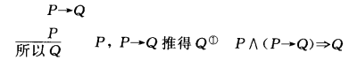

**析取三段论**

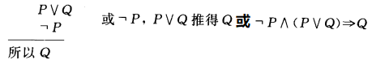

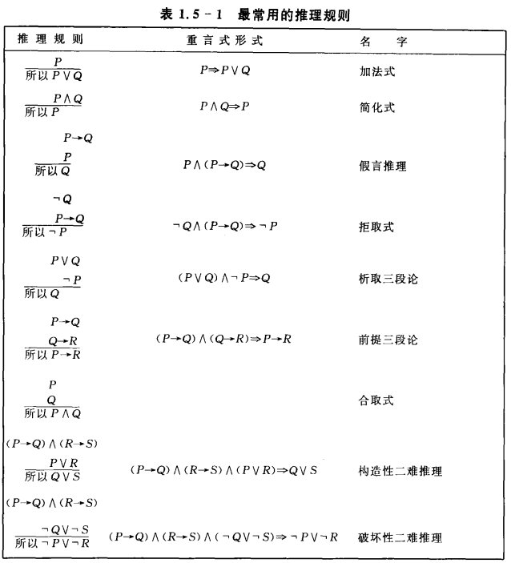

1.  规则P：在推导的任何步骤上都可以引入前提
2.  规则T：在推导中，如果前面有一个或多个公式永真蕴含 S，则可以把S引入推导过程

例：

1.  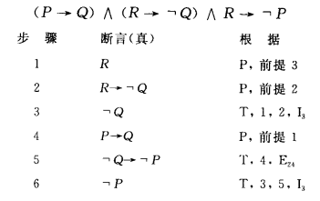

2.  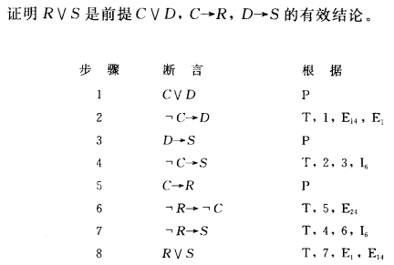

#### 3. 证明方法

**不常用方法**

1.  无义证明法：P是假，则蕴含式是真
2.  平凡证明法：Q是真，则蕴含式是真

##### **直接证明法**

假设P是真的，如果能推得Q是真，则 P→Q 是真

##### **间接证明法(逆反证明法)**

$$P→Q\iff ¬Q→¬P$$ ，若Q是假，且P是假，则 $$¬Q→¬P$$ 是真，也就是 $$P→Q$$ 是真

**一.** $$P_1∧P_2∧...∧P_n→Q$$

间接证明：逆反公式是 $$¬Q→P_1∨P_2∨...∨P_n$$ ，只需证明至少有一个i，使 $$¬Q→¬P_i$$ 是真

**二.** $$P_1∧P_2∧...∧P_n→(P→Q)$$

CP规则（演绎定理）：等价公式 $$P_1∧P_2∧...∧P_n∧P→Q$$

若结论为蕴含式，则前提可作为附加条件

**三.** $$P_1∨P_2∨...∨P_n→Q$$

分情况证明：
$$
\begin{aligned}
P_1∨&P_2∨...∨P_n→Q\\
&\iff ¬P_1∧¬P_2∧...∧¬P_n∨Q\\
&\iff (¬P_1∨Q)∧(¬P_2∨Q)∧...∧(¬P_n∨Q)\\
&\iff (P_1→Q)∧(P_2→Q)∧...∧(P_n→Q)
\end{aligned}
$$

##### **反证法(归谬法)**

-   一致性：若公式 $$H_1,H_2,...,H_n$$ 的原子命题变元 $$P_1,P_2,...,P_n$$ 存在某一指派，使得命题变元的积 $$P_1∧P_2∧...∧P_n$$ 具有真值T，则命题公式集合 $$\{H_1,H_2,...,H_n\}$$ 是一致的

>   反证法定理：设 $$\{H_1,H_2,...,H_n\}$$ 是一致的，C是一命题公式，如果 $$\{H_1,H_2,...,H_n,¬C\}$$ 是非一致的，则能从 $$H_1,H_2,...,H_n$$ 能退出 C。

$$
\begin{aligned}
欲证H_1∧H_2∧...∧H_n\Rightarrow C,只需证明H_1∧H_2∧...∧H_n∧¬C\Rightarrow F
\end{aligned}
$$

-   ¬C：假设前提

## 1.2 谓词演算

命题是谓词形式的一种特殊情况

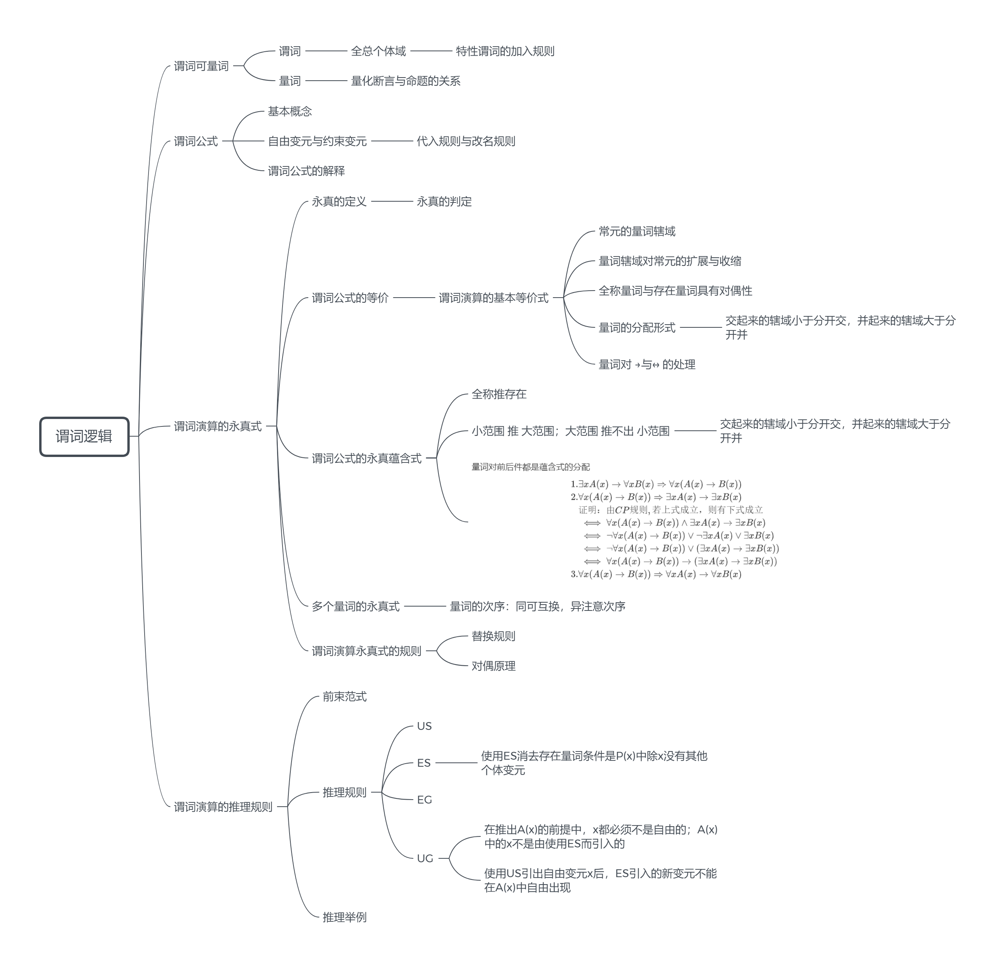

### 1.2.1 谓词和量词

#### 1. 谓词

-   个体：代表个体的变元叫个体变元

-   谓词：刻画个体的性质或个体间的关系的词
-   个体用小写字母表示；谓词用大写字母表示

个体与谓词不能构成命题

>   谓词（谓词命名式）：F(x)、G(x,y)等

-   F(x)：表示x是质数

>   n元谓词：表示n个个体间关系的谓词

-   谓词常元：一个字母代表一特定谓词

-   谓词变元：一个字母代表任意谓词

-   个体域(论述域)：谓词命名式中个体变元的取值范围

    每个论述域都至少有一个个体

##### 全总个体域

>   不同个体变元的论述域集合，可以理解为全体论述域大集合

-   不同的论述对象需用不同的 **特性谓词** 加以刻画

例子：设F(x)表示“x是不怕死的”，D(x)表示“x是要死的”,M(x)表示“x是人”

-   论述域是人类

    -   “人总是要死的”—— $$\forall xD(x)$$
    -   "有些人不怕死"——$$∃xF(x)$$

-   论述域：全总个体域

    -   由于论述域是全总个体与，故需要添加谓词M(x)
        $$
        人总是要怕死的——\forall x(M(x)\rightarrow D(x))\\\\
        有些人不怕死——∃ \ x(M(x)∧F(x))
        $$

##### ==**特性谓词的加入规则**==

-   全称量词，特性谓词作为蕴含式的前件加入
-   存在量词，特性谓词作为合取项加入

#### 2. 量词

**1. 全称量词**

>   $$\forall x$$ :“对一切x”、“对任一x”——变元的全称量化

**2. 存在量词**

>   ∃x ：存在一x、至少有一x——变元的存在量化

变元x的全称量化或存在量化，**量化的作用是约束变元**

-   量化后所得命题的真值与论述域有关

##### 量化断言和命题的关系

1.  论述域有限的
    $$
    \forall xP(x) \iff P(x_1)∧P(x_2)∧...∧P(x_n)\\
    ∃ xP(x) \iff P(x_1)∨P(x_2)∨...∨P(x_n)
    $$

2.  论述域可数无限
    $$
    \forall xP(x) \iff P(x_1)∧P(x_2)∧...∧P(x_n)∧ \dots \\
    ∃ xP(x) \iff P(x_1)∨P(x_2)∨...∨P(x_n)∨ \dots
    $$

3.  论述域不可数无限，无法表示

### 1.2.2 谓词公式

谓词演算的原子公式：不出现命题联结词和量词的谓词命名式 $$P(x_1,x_2,...,x_n) (n=0,1,2...)$$ 

-   $$P(x_1,x_2,...,x_n)$$ 是n元谓词公式，其中 $$x_1,x_2,...,x_n$$ 是个体变项

>   谓词演算的合式公式
>
>   1.  谓词演算的原子公式是谓词演算公式
>   2.  若A，B是谓词演算公式，则¬P、A∧B、A∨B、A→B、A↔B、$$\forall xA(x)、∃ xA(x)$$ 是谓词演算公式
>   3.  有限步骤的 1,2 构成的公式才是谓词演算公式

#### 1. 自由变元与约束变元

辖域：紧接于量词之后的最小的子公式叫量词的辖域

>   约束变元：在辖域内的变元出现叫约束出现，辖域内的变元叫约束变元
>
>   自由变元：在辖域外的变元出现叫自由出现，辖域外的变元叫自由变元

##### 代入规则与改名规则

>   对于谓词公式A(x)，x不出现在y的量词辖域中，则称A(x)对y是自由的

代入规则 $$\neq$$ 改名规则：代入规则——自由变元；改名规则——约束变元

**改名规则**

-   若要改名，则该变元在量词及其辖域中的所有出现均需一起更改

-   改名时，所选用的符号必须是量词辖域中未出现的符号，最好是公式中未出现的符号

**代入规则**

-   在一公式中，任一自由个体变元可用另一个体变元代替，需全部替换该公式中的变元。且不能用约束变元的符号替换

-   用以代入的变元与原公式中所有变元的名称都不能相同

#### 2. 谓词公式的解释

>   解释I：由非空区域D和对谓词公式G中常项符号、函数符号、谓词符号有下列规则进行的一组指定
>
>   1.  对每一个常项符号指定D中一个元素
>   2.  对每一个n元函数符号指定一个函数
>   3.  对每一个n元谓词符号，指定一个谓词
>
>   给定G的一个解释I，则G在解释I下有一个真值，记作 $$T_I(G)$$

若存在解释I，使得G在解释I下取值为真，则称G是可满足的，建成满足G

若G的所有解释I都满足I，则G为永真式（重言式）

### 1.2.3 谓词演算的永真式

#### 1. 永真的定义

给定任一谓词公式A，如果在论述域E上，对公式A的谓词和个体变元进行上述两种指派，所得命题：

1.  都真，则称 **A在E上有效** 或 **在E上永真**
2.  至少有一个是真，则称 **A在E上可满足**
3.  都假，则称 **A在E上永假** 或 **在E上不可满足**

给定任一谓词公式A，如果在任一论述域上，对上述两种指派

1.  A永真，则称 **A永真** 或 **有效**
2.  A至少在一个域上可满足，则称 **A可满足**

3.  A永假，则称 **A永假** 或 **不可满足**

##### 永真的判定

若谓词公式A的个体域和谓词的解释是有限的，则可用真值表判定谓词公式A是否永真

#### 2. 谓词公式的等价

>   两个任意谓词公式A和B，E是A、B公有的论述域，若对E上的任意解释所得的命题具有相同的真值，则称公式A和B **遍及E等价**，即为 **在E上$$A\iff B$$**
>

A和B等价定义：$$A\iff B$$ 在 **任一论述域** 上都等价

##### 谓词演算的基本等价式

命题演算的永真公式也是谓词演算的永真公式

含有量词的谓词演算的基本永真公式

1.  常元的量词辖域
  
    $$
    \forall xA \iff A\\
    ∃ xA \iff A
    $$

2.  量词辖域对命题常元的扩展和收缩
  
    $$
    \forall xA(x)∨P \iff \forall x(A(x)∨P) \\
    \forall xA(x)∧P \iff \forall x(A(x)∧P) \\
    ∃ xA(x)∨P \iff ∃ x(A(x)∨P) \\
    ∃ xA(x)∧P \iff ∃ x(A(x)∧P) \\
    \forall x(A(x)\rightarrow B)\iff ∃ xA(x)\rightarrow B\\
	\forall x(B\rightarrow A(x)) \iff B \rightarrow \forall xA(x)\\
∃ x(A(x)\rightarrow B)\iff \forall xA(x)\rightarrow B\\
	∃ x(B\rightarrow A(x)) \iff B \rightarrow ∃ xA(x)\\
	$$
	
3.  全称量词与存在量词具有对偶性
  
    $$
    ¬(\forall xP(x)) \iff ∃ x¬P(x)\\
     ¬(∃ xP(x)) \iff \forall x¬P(x)\\
    $$

4.  量词的分配形式

    交起来的辖域小于分开交，并起来的辖域大于分开并

    -   对一切x，A(x)∧B(x)是真。等价于。对一切x，A(x)是真并且对一切x，B(x)是真
        $$
        \forall x(A(x)∧B(x)) \iff \forall xA(x)∧\forall xB(x)  \\
        $$

    -   存在一个x，使A(x)∨B(x)是真。等价于。存在一个x使A(x)是真或存在一个x使B(x)是真
        
        $$
        ∃ x(A(x)∨B(x)) \iff ∃ xA(x)∨∃ xB(x) \\
        $$

5.  量词对 →与↔ 的处理

    只需用其对全功能集合{¬,∨,∧} 的恒等式即可推出

#### 3. 谓词公式的永真蕴含式

1.  全称推存在：$$\forall xP(x) \Rightarrow ∃ xP(x)$$
    $$
    \begin{aligned}
    \forall xP(x) \Rightarrow P(y)& 或 &\forall xP(x) \Rightarrow P(x)\\
    P(y)\Rightarrow ∃ xP(x)& &P(x)\Rightarrow ∃ xP(x)
    \end{aligned}
    $$
    上：如果断言“对一切x，P(x)是真”成立，那么 "对任一确定x,P(x)是真"

    下：如果对某一确定的x，P(x)是真，那么断言 “存在一x，使P(x)是真”成立

2.  小范围 $$\Rightarrow$$ 大范围；大范围 $$\nRightarrow$$ 小范围

    交起来的辖域小于分开交，并起来的辖域大于分开并

    -   $$∃ x(A(x)∧B(x)) \Rightarrow ∃ xA(x)∧∃ B(x) \\$$

        小范围中存在的元素 $$\Rightarrow$$ 大范围中存在该元素

        大范围中存在的元素 $$\nRightarrow$$ 小范围中存在的元素

    -   $$\forall xA(x)∨\forall xB(x) \Rightarrow \forall x(A(x)∨B(x)) \\$$

        小范围中的所有元素 一定全部 被包含在大范围中

        大范围中的所有元素 不一定全部 被包含在小范围

3.  量词对前后件都是蕴含式的分配

    $$
    \begin{aligned}
    1.&∃ xA(x)\rightarrow \forall xB(x) \Rightarrow \forall x(A(x)\rightarrow B(x))\\
    
    2.&\forall x(A(x)\rightarrow B(x)) \Rightarrow ∃ xA(x)\rightarrow ∃ xB(x)\\
    
    &证明：由CP规则,若上式成立，则有下式成立\\
    &\iff \forall x(A(x)\rightarrow B(x))∧∃ xA(x) \rightarrow ∃ xB(x)\\
    &\iff ¬\forall x(A(x)\rightarrow B(x))∨¬∃ xA(x) ∨ ∃ xB(x)\\
    &\iff ¬\forall x(A(x)\rightarrow B(x))∨(∃ xA(x) \rightarrow ∃ xB(x))\\
    &\iff \forall x(A(x)\rightarrow B(x))\rightarrow(∃ xA(x) \rightarrow ∃ xB(x))\\
    3.&\forall x(A(x)\rightarrow B(x)) \Rightarrow \forall xA(x)\rightarrow \forall xB(x)\\
    
    \end{aligned}
    $$

#### 4. 多个量词的永真式

量词的次序：同可互换，异注意次序

①对一切x和一切y，P(x,y)为真。等价于。对一切y和一切x，P(x,y)为真

$$
\forall x\forall yP(x,y) \iff \forall y\forall xP(x,y)
$$

②存在一个x和存在一个y，P(x,y)为真。等价于。存在一个y和存在一个x,P(x,y)为真

$$
∃ x∃ y P(x,y) \iff ∃ y ∃ xP(x,y)
$$

③全称=>存在，存在 $$\nRightarrow$$ 全称

$$
\forall x\forall yP(x,y) \Rightarrow ∃ y\forall xP(x,y)\\
\forall x∃ yP(x,y) \Rightarrow ∃ x∃ y P(x,y)
$$

④存在一切$$\Rightarrow$$一切存在，一切存在$$\nRightarrow$$存在一切

$$
∃ y\forall xP(x,y) \Rightarrow \forall x∃ yP(x,y)
$$

#### 5. 谓词演算永真式的规则

1.  替换规则

    设 $$A(x_1,x_2,...,x_n) \iff B(x_1,x_2,...,x_n)$$ ，而A是公式C中的子公式，用B替换C中之A得D，则 $$C \iff D$$

2.  对偶原理

    在公式 $$A\iff B$$ 或 $$A\Rightarrow B$$ 中，A、B仅含运算符∧、∨、¬，将上式中的全称量词与存在量词互换，∧、∨互换，TF互换，则

$$
A^* \iff B^*,B^*\Rightarrow A^*
$$

### 1.2.4 谓词演算的推理规则

#### 1. 前束范式

>   所有量词均在谓词公式开头，且辖域延伸到公式的末尾，则该公式称为前束范式

-   对任意一个谓词公式都可以化为与他等价的前束范式

**步骤**

1.  利用等价公式将谓词公式中的联结词 →与→去掉
2.  利用量词的对偶律，将量词前面的否定深入谓词前面
3.  利用改名和代入规则以及量词辖域扩张的公式将量词转移到全式前面

例：

$$
\begin{aligned}
&¬∀x(∃yP(x,y)→∃x∀y(Q(x,y)∧∀y(P(y,x)→Q(x,y))))\\\\
\iff& ¬∀x∃yP(x,y)→∃x∀y(Q(x,y)∧∀z(P(z,x)→Q(x,z)))\\\\
\iff &¬∀x∃yP(x,y)→∃u∀v(Q(u,v)∧∀z(P(z,u)→Q(u,z)))\\\\
\iff &∃x∀y¬(¬P(x,y)∨∃u∀v(Q(u,v)∧∀z(P(z,u)→Q(u,z)))\\\\
\iff &∃x∀y∃u∀v∀zP(x,y)∧¬(Q(u,v)∧P(z,u)→Q(u,z))\\\\
\iff &∃x∀y∃u∀v∀zP(x,y)∧(¬Q(u,v)∨¬(P(z,u)→Q(u,z))\\\\
\iff &∃x∀y∃u∀v∀zP(x,y)∧(¬Q(u,v)∨¬(¬P(z,u)∨Q(u,z))\\\\
\iff &∃x∀y∃u∀v∀zP(x,y)∧(¬Q(u,v)∨(P(z,u)∧¬Q(u,z))\\\\
\end{aligned}
$$

任何谓词公式都可转化为与其等价的前束析取范式和束合取范式

#### 2. 推理规则

XS——删X

-   转化为命题演算

XG——生X

-   使结论呈现为量化形式

##### 全称指定规则——全称量词可以删除(Universal Specification)

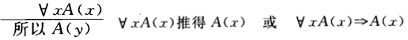

可以是个体变元A(y)，也可以是个体常元A(c)

##### 存在指定规则(Existential Specification)

假设某一确定个体y使A(y)为真

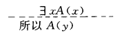

使用条件：

1.  使用ES消去存在量词条件是P(x)中除x没有其他个体变元

1.  y是A(x)中未出现的字母，表示个体常元
2.  A(x)对于y必须是自由的，A(y)是暂用前提，不能用作结论，所以在结束前，必须使用EG，使之称为约束变元

##### 存在推广原则(Existential Generalization)

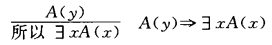

##### 全称推广(Universal Generalization)

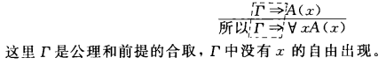

使用条件：

1.  在推出A(x)的前提中，x都必须不是自由的；A(x)中的x不是由使用ES而引入的
2.  使用US引出自由变元x后，ES引入的新变元不能在A(x)中自由出现

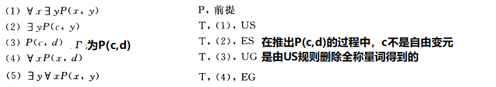

但上述推理中，(2)->(3)是错误的，违反UG规则的第二条，使用US后，ES引入的新变元d，不能是自由变元，违背UG的第二条，所以错误

**含义角度**

$$\forall x∃ yP(x,y)$$ 表示 “对所有x存在一个对应的y使得P(x,y)为真”，而经过推导变为P(c,d)表示"对于任一个体c,存在同一个体d使得P(c,d)"成立，显然不等价

#### 3. 推理举例

**1. **  $$\forall x(C(x) \rightarrow (W(x)∧R(x)))∧∃ xC(x)∧Q(x)\Rightarrow ∃ Q(x)∧∃ xQ(x)$$

$$
\begin{aligned}
1.\quad&∃ xC(x) \quad &P\\\\
2. \quad&C(y)	\quad &ES(1)\\\\
3. \quad&\forall x(C(x) \rightarrow (W(x)∧R(x))) \quad &P\\\\
4. \quad&C(y) \rightarrow (W(y)∧R(y)) \quad&US(3)\\\\
5. \quad& W(y)∧R(y) \\\\
6. \quad&R(y)\\\\
7. \quad&∃ xR(x)\quad &EG(6)\\\\
8. \quad& Q(x)\quad &P\\\\
9. \quad &∃ xQ(x)\quad &EG(8)\\\\
10. \quad &∃ xQ(x)∧∃ xQ(x)
\end{aligned}
$$
**2. ** 给定前提：
$$
\begin{aligned}
∃x(P(x)∧∀y(Q(y)→R(x,y)))\\
∀x(P(x)→∀y(S(y)→¬R(x,y)))
\end{aligned}
$$
证明：
$$
∀x(Q(x)→¬S(x))
$$

$$
\begin{aligned}
1. \quad &∃x(P(x)∧∀y(Q(y)→R(x,y)))\quad &P\\\\
2. \quad&P(a)∧∀y(Q(y)→R(a,y))\quad&ES(1)\\\\
3. \quad&P(a)\quad &T(2)\\\\
4. \quad&∀x(P(x)→∀y(S(y)→¬R(x,y)))\quad &P\\\\
5. \quad&P(a)→∀y(S(y)→¬R(a,y))\quad &US\\\\
6. \quad&∀y(S(y)→¬R(a,y))\quad &T(3)(5)\\\\
7. \quad&S(z)→¬R(a,z)\quad &US(6)\\\\
8. \quad&∀y(Q(y)→R(a,y))\quad &T(2)\\\\
9. \quad&Q(z)→R(a,z)\quad&US(8)\\\\
10.\quad&R(a,z)→¬S(z)\quad&逆反(7)\\\\
11.\quad&Q(z)→¬S(z)\quad&传递性(9)(10)\\\\
12.\quad&∀xQ(x)→¬S(x)\quad&UG(11)
\end{aligned}
$$

**3.** 所有的有理数都是实数，所有的无理数也是实数，任何虚数都不是实数，所以任何虚数既不是有理数，也不是无理数

设：

P(x):x是有理数

Q(x):x是无理数

R(x):x是实数

S(x):x是虚数∀∃¬↔→∨∧

本题符号化为:$$\forall x(P(x)\rightarrow R(x)),\forall x(Q(x)\rightarrow R(x)),\forall x(S(x)\rightarrow ¬R(x)) \Rightarrow \forall x(S(x)\rightarrow ¬P(x)∧¬R(x))$$
$$
\begin{aligned}
1. \quad &\forall x(S(x)\rightarrow ¬R(x)) \quad &P\\\\
2. \quad &S(y)\rightarrow ¬R(y) \quad &US(1)\\\\
3. \quad &\forall x(P(x)\rightarrow R(x))\quad &P\\\\
4. \quad &P(y)\rightarrow R(y)\quad &US(3)\\\\
5. \quad &\forall x(Q(x)\rightarrow R(x))\quad &P\\\\
6. \quad &Q(y)\rightarrow R(y)\quad&US(5)\\\\
7. \quad &¬R(y)\rightarrow ¬Q(y),¬R(y)\rightarrow ¬P(y)\quad&逆反(4)(6)\\\\
8. \quad &S(y)\rightarrow ¬Q(y),S(y)\rightarrow ¬P(y)\quad&传递性(2)(7)\\\\
9. \quad &(S(y)\rightarrow ¬Q(y))∧(S(y)\rightarrow ¬P(y))\\\\
10. \quad &(¬S(y)∨¬Q(y))∧(¬S(y)∨¬P(y))\quad &等价(9)\\\\
11. \quad &¬S(y)∨(¬Q(y)∧¬P(y))\quad&分配律(10)\\\\
12. \quad &S(y)\rightarrow (¬Q(y)∧¬P(y))\quad &等价(12)\\\\
13. \quad &\forall xS(x)\rightarrow (¬Q(x)∧¬P(x))\quad &UG(12)
\end{aligned}
$$

4.  反证法

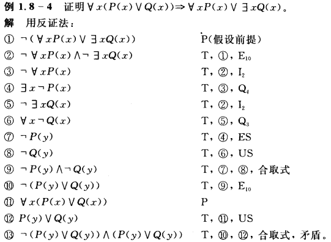