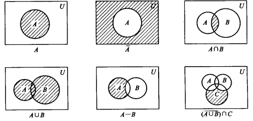
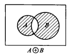
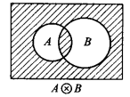

# 2. 集合

[TOC]

## 2.1 基本概念

>   一个集合是能作为整体论述的事物的集体，用大写字母表示

### 2.1.1 集合的表示方法

1.  列举法：将集合中的元素枚举

    $$
    \begin{aligned}
    &例1：所有小于5的正整数\\
    &A=\{1,2,3,4,5\}\\\\
    &例2：1...50的整数集\\
    &A=\{1,2,...,50\}\\\\
    &例3：偶数集合\\
    &A=\{...,-4,-2,0,2,4,...\}
    \end{aligned}
    $$

2.	描述法：用谓词描述出集合元素的公共特征来表示这个集合
形如：S={a|P(a)}，表示 $$a\in S$$当且仅当P(a)为真
$$
\begin{aligned}
&例1：所有小于5的正整数\\
&A=\{a| a\in I∧0<a∧a<5\}\\\\
&例2：1...50的整数集\\
&A=\{a|a\in I ∧1 \le a \le 50\}\\\\
&例3：偶数集合\\
&A=\{x|k\in I∧x=2k\}
\end{aligned}
$$

3.  归纳定义法

### 2.1.2 元素与集合的关系——从属关系

>   元素(成员)：组成这个集合的元素或成员，用小写字母表示
>
>   -   集合也可作为另一个集合的元素

-   元素属于集合：$$a\in A$$

-   元素不属于集合：$$a∉A$$

#### 1. 与元素相关的集合概念

单元素集合：仅含有一个元素的集合

有限集合：含有有限个元素的集合

-   无限集合（无穷集）：不是有限集合的集合

-   集合的基：有限集合的元素个数，即为 \|A\|
    
    $$
    A=\{a,b\},则\|A\|=2,又\|{A}\|=1
    $$
    

**记**：

1.  集合本身不能成为集合的元素，否则会导致罗素悖论
2.  n个元素的集合有 $$2^n$$ 个子集合

### 2.1.2 集合间的关系

#### 1. 相等

>   外延定理：两个集合A和B相等，即A=B，当且仅当他们有相同的成员(A中每个元素是B的一个元素而B中的每个元素也是A的有一个元素)

$$
\begin{aligned}
&A=B\iff \forall x(x \in A ↔x\in B)\\
&A=B\iff \forall x(x\in A \rightarrow x\in B)∧\forall x(x\in B \rightarrow x\in A)
\end{aligned}
$$

-   列举法中，元素的次序无关紧要
-   元素的重复出现无足轻重
-   集合的表示不是唯一的

#### 2. 集合间的包含关系

>   A⊆B：设A和B是集合，如果A中的每一元素是B的一个元素，则A是B的 **子集合** ，B是A的 **扩集**

逻辑符号表示为：

$$
A⊆B\iff \forall x\{x\in A\rightarrow x\in B\}
$$

>   真子集：如果A⊆ B且A $$\neq$$ B，则A是B的真子集，记为 A⊂B（A真包含于B）

逻辑符号表示为：

$$
\begin{aligned}
A⊂V&\iff (A⊆B)∧(A\neq B)\\
&\iff \forall x(x\in A\rightarrow x\in B)∧∃x(x\in B∧x\notin A)
\end{aligned}
$$

>   对任一集合A，有A⊆U，U表示全集合

>   对任何集合A，恒有A⊆A

-   集合与其自身只有包含关系，没有从属关系，即{A}可作为A的子集合，但A任何条件下不能作为集合A的元素

>   设A和B是集合，A=B当且仅当A⊆B和B⊆A

>   传递性：设A，B，C是集合，若A⊆B且B⊆C，则A⊆C

>   空集：没有任何元素的集合，记为∅

-   空集是任何集合的子集合，∅⊆A
-   空集是唯一的

## 2.2 集合上的运算

>   用给定的集合（运算对象）去指定一新的集合（运算结果）

### 2.2.1 并、交、差

#### 1. 定义

设A和B是集合

>   A∪B：A和B的并

$$
A∪B=\{x|A\in A∨x\in B\}
$$

>A∩B：A和B的交

$$
A∩B=\{x|x\in A ∧x \in B\}
$$

>A-B：A和B的差

$$
\begin{aligned}
A-B &= A∩\overline{B}\\
&= \{x|x\in A∧x\notin B\}
\end{aligned}
$$

>   不相交：A∩B=∅，则A和B是不相交的。

-   C是集合族，若C中任意两个不同元素不相交，则C是 _不相交集合的族_

例：

$$
C=\{\{0\},\{1\},...\}=\{\{i\}|i\in N\}
$$

#### 2. 定理

设A、B、C是集合

>   集合的交、并是可交换和可结合的

1.  A∪B = B∪A
2.  A∩B = B∩A
3.  C∪(A∪B) = (A∪B)∪C
4.  A∩(B∩C) = (B∩C)∩A

>   分配律

1.  A∪(B∩C) = (A∪B)∩(A∪C)
2.  A∩(B∪C) = A∩B∪A∩C

>   其他运算性质

1.  A∪A = A
2.  A∩A = A
3.  A∪∅ = A
4.  A∩∅ = ∅
5.  A-∅ = A
6.  A-B ⊆ A
7.  A⊆A∪B
8.  A∩B⊆A
9.  如果A⊆B且C⊆D，则 (A∪C)⊆(B∪D)
10.  如果A⊆B且C⊆D，则 (A∩C)⊆(B∩D)
11.  如果A⊆B，则 A∪B = B
12.  如果A⊆B，则 A∩B = A

### 2.2.2 补运算

设U是论述域，A是U的子集

>   A的补$$\overline{A}$$ ：
>   
>   $$
>   \overline{A} = U-A = \{x|x\in U∧ x\notin A\}
>   $$

显然：

-   $$A∪\overline{A}=U$$
-   $$A∩\overline{A}=∅$$

>   补的唯一性：A和B是U的子集，则 $$B=\overline{A}$$ 当且仅当 A∩B=∅ 和 A∪B=U

-   $$\overline{∅} = U$$
-   $$\overline{U}=∅$$

>   A的补的补是A：$$\overline{\overline{A}}=A$$

>   德·摩根定律

-   $$\overline{A∪B}=\overline{A}∩\overline{B}$$
-   $$\overline{A∩B}=\overline{A}∪\overline{B}$$

>   包含关系的逆反定律：若 $$A⊆B$$ ，则 $$\overline{B}⊆\overline{A}$$

### 2.2.3 文氏图

### 2.2.4 并和交运算的扩展

设C是某论述域的搜集

-   搜集：集合子集组成的族

>   C的成员的并，记为
>
>   $$
>   U_{S\in C}S = \{x|∃x(S\in C∧x\in S)\}
>   $$

-   如果 $$x\in U_{S\in C}$$ ，那么x至少是一个子集S的元素

>   若 $$C\neq∅$$ ，C的成员的交，记为
>   
>   $$
>   ∩_{S\in C}=\{x|\forall x(S\in C\rightarrow x\in S)\}
>   $$
>   

-   如果 $$x\in ∩_{S\in C}$$ ,那么x是每一个子集S的元素

>   加索引搜集：
>
>   设D是一集合， $$A_d$$ 为D的单元素子集，则d为 $$A_d$$ 的索引
>
>   $$
>   C=\{A_d|d\in D\}为加索引搜集,D为搜集的索引集合
>   $$

例：

1. $$C=P\{A_0,A_1,A_2,...,A_n\}$$ ，则 C的成员的并 $$U_{S\in C}S$$ 记为

$$
U_{i=0}^nA_i,\quad U_{0\le i\le n}A_i,\quad A_0UA_1U...UA_n
$$

2.  $$[0,a)表示集合\{x|0\le x<a\}$$:

$$
\begin{aligned}
如果S_a=[0,a),a\in R_+,&C=\{S_a|a\in R_+\}，那么\\\\
&U_{s\in C}S=[0,\infty),∩_{S\in C}s=\{0\}\\\\
如果S_a=[0,a),a\in I_+,&C=\{S_a|a\in I_+\},那么\\\\
&U_{i=1}^{\infty}S_i=[0,1)U[0,2)U...=[0,\infty)\\\\
&∩_{i=1}^{\infty}S_i=[0,1)∩[0,2)∩...=[0,1)
\end{aligned}
$$

### 2.2.5 环和与环积

#### 1.环和

>   环和(A⊕B)：对称差

$$
\begin{aligned}
A⊕B&=(A-B)U(B-A)\\
&=\{x|x\in A∧x\notin B∨x\in B∧x\notin A\}
\end{aligned}
$$

1. 定理

$$
\begin{aligned}
A⊕B&=(A-B)U(B-A)\\
&=(A∩\overline{B})U(B∩\overline{A})\\
&=(AUB)∩(\overline{A}U\overline{B})\\
&=(AUB)∩(\overline{A∩B})\\\\
&=(AUB)-(A∩B)
\end{aligned}
$$

2.  推论：
    
    $$
    \begin{aligned}
    &\overline{A}⊕\overline{B}=A⊕B\\
    &A⊕B=B⊕A\\
    &A⊕A=∅\\
    &(A⊕B)⊕C=A⊕(B⊕C)\\
    &C∩(A⊕B)=C∩A⊕C∩B
    \end{aligned}
    $$
    
3.  交环和可分配，其余不可分配

#### 2. 环积

>   环积(A⊗B)：

$$
\begin{aligned}
A⊗B&=\overline{A⊕B}\\\\
&=\overline{(AUB)∩(\overline{A∩B})}\\
&= A∩BU\overline{A}∩\overline{B}\\
&=\{x|x\in A∧x\in B∨x\notin A∧x\notin B\}
\end{aligned}
$$

1.  定理：
    
    $$
    \begin{aligned}
    &\overline{A}⊗\overline{B}=A⊗B\\
    &A⊗B=B⊗A\\
    &A⊗A=U\\
    &(A⊗B)⊗C=A⊗(B⊗C)\\
    &CU(A⊗B)=(CUA)⊗(CUB)
    \end{aligned}
    $$
    
2.  并环积可分配，其余不可分配

### 幂集合

## 2.3 归纳法、和自然数

## 2.4 集合的笛卡尔积