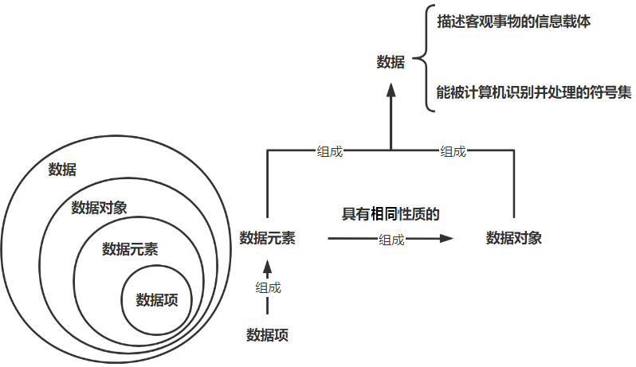
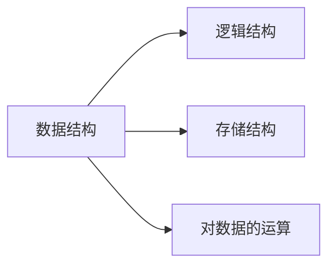
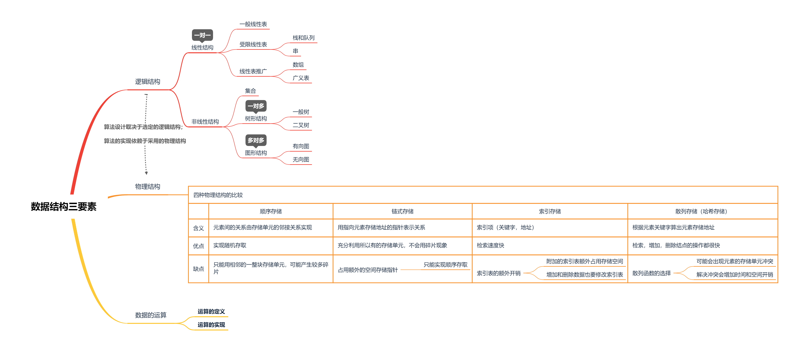

# 0-绪论

[TOC]

<div STYLE="page-break-after: always;"></div>

## 0.0 基本概念



### 0.0.1 数据类型

>   值+操作的集合

-   原子类型
-   结构类型
-   抽象数据类型(ADT)：可用于定义一个完整数据类型 、 数据结构

**ADT**

>   一个数学模型及定义在该模型上的一组操作

```
ADT{
	数据对象：<数据对象的定义> D
	数据关系：<数据关系的定义> S
	基本操作：<基本操作的定义> P
}
```

<div STYLE="page-break-after: always;"></div>

### 0.0.2 数据结构

>   存在一种或多种特定关系(==逻辑结构==)的数据元素集合

-   ==逻辑结构== 独立于 ==存储结构==



**四种逻辑结构**

-   集合
-   线性结构
-   树形结构
-   网状结构

**两种存储结构**

-   顺序存储
-   链式存储
-   (哈希)
-   (索引)



### 0.0.3 算法

>   特定问题的求解步骤

#### 特性

-   有穷性
    -   ==程序== $$\neq$$ ==算法==
        -   程序不一定有穷：死循环，操作系统
-   确定性
-   可行性
-   输入
-   (至少一个)输出

#### 目标

-   正确
-   可读
-   健壮
-   高效低存储
