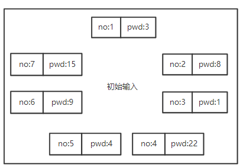

# 线性表

<span>{{ page.date}}</span>

[TOC]

<div STYLE="page-break-after: always;"></div>

## 2.1 概念

> **线性表**：具有相同数据类型的 n ($$n\ge0$$)个数据元素的有限序列
>
> $$n=0$$ 为 ==空表==

表示为：
> L = ($$a_1,a_2...,a_i,a_{i+1},...,a_n$$)

（1）存在唯一一个被称为 “第一个” 的数据元素—— $$a_1$$：==表头元素==

（2）存在唯一一个被称为 “最后一个” 的数据元素—— $$a_n$$：==表尾元素==

（3）除第一个之外，集合中的每个数据元素只有一个 ==直接前驱==

（4）除最后一个外，集合中每个数据元素只有一个 ==直接后继==

### 2.1.1 特点
1. 数据元素个数有限
2. 元素间有逻辑上的顺序性
3. 表中元素都是 ==数据元素==

	- 元素具有抽象性：只讨论元素间的逻辑关系，不考虑具体表示什么
4. 表中元素 ==数据类型相同==

	- 单个元素占用的存储空间相同

> 当数据元素由若干数据项组成：
> - 记录：数据元素
> - 文件：含有大量记录的线性表

<div STYLE="page-break-after: always;"></div>

### 2.1.2 **线性表是一种逻辑结构**

> 表示元素之间一对一的相邻关系

实现线性表的两种存储结构
- 顺序存储
- 链式存储

线性表基本操作的实现
- 存储结构不同，算法实现也不同
- &：C++引用
### 2.1.3 基本操作

-   InitList(&L);初始化线性表
-   Length(L);获取线性表中元素个数
-   LocateElem(L,e);获取元素e在线性表中的位置
-   GetElem(L,i);获取第i个元素
-   ListInsert(&L,i,e);将e插入到第i个位置
-   PrintList(L);输出线性表中元素
-   DetoryList(&L);销毁线性表

<div STYLE="page-break-after: always;"></div>

## 2.2 线性表的存储

### 2.2.1 线性表的顺序存储——顺序表

**位序与下标的区别**

- 位序：$$1\le i \le length$$
- 下标：$$0\le i \le length-1$$

**动态分配**

-   动态分配属于 ==顺序存储== 结构，分配 $$n$$ 个空间时仍需要 $$n$$ 个连续存储空间

#### 1. 特点
- 随机存取—— $$O(1)$$

    $$Loc(a_i)=Loc(a_0)+(i-1)*sizeof(ElemType)$$

- 存储密度高——只存数据元素

- 存储关系映射逻辑关系

- 插入删除效率低

#### 2. 结点定义

```cpp
# define MaxSize 20
typedef struct {/* 静态分配 */
	ElemType data[MaxSize];
	int length;
}SqList;
# define INITSIZE 10//初始空间容量
# define INCREMENT 10//增量
typedef struct {/* 动态分配 */
	ElemType *elem;	//存储空间基址
	int length;		//线性表当前长度
    int listSize;	//存储容量
}SqList;
```

<div STYLE="page-break-after: always;"></div>

#### 3. 基本操作实现

```c
//动态分配 初始化一个空表
Status ListInit_sq(SqList &L){
    L.elem = (ElemType *)malloc(INITSIZE*sizeof(ElemType));
    if(!L.elem)
        return OVERFLOW;
    L.length = 0;
    L.listSize = INITSIZE;
    return OK;
}

Status ListInsert_Sq(SqList &L, int i, ElemType x) {
    //1.判断输入是否正确 
	if (i < 1 || i > L.length + 1)
		return ERROR;
    //2.判断表空间是否充足
    if(L.length >= L.listSize){
		ElemType* newbase = (ElemType *)realloc(L.elem,(L.listSize+INCREMENT)*sizeof(ElemType));
        if(!newbase)
            exit(OVERFLOW);
        L.elem = newbase;
        L.listSize += INCREMENT;
    }
    //3.插入位置元素与之后元素要后移
	ElemType* p = &(L[i-1]);
    for(ElemType* p = &(L[length-1]);p>=q;)
        *(p+1) = *p;
    //4.插入数据
    *q = x;
    L.length++;
	return OK;
}
```
<div STYLE="page-break-after: always;"></div>

```c
Status ListDelete_Sq(SqList &L, int i, ElemType &x) {
	//1.判断输入是否合法
    if(i < 1 || i > L.length) 
		return ERROR;
	//2.找到删除位置
	ElemType* p = &(L[i-1]);
    x = L.data[i - 1];//返回待删除元素
    //3.删除元素
    while(p<&(L[L.length-1])){
        *p = *(p+1);//从第i个元素，将其后继元素前移一位
    	p++;
    }
	L.length--;
	return OK;
}
```

|                | 插入                                                 | 删除                                               | 按值查找         |
| -------------- | ---------------------------------------------------- | -------------------------------------------------- | ---------------- |
| 最好           | 表尾插入，不移动元素 $$O(1)$$                        | 表尾删除，不移动元素 $$O(1)$$                      | 遍历一次$$O(1)$$ |
| 最坏           | 表头插入，移动 $$n$$ 个元素 $$O(n)$$                 | 表头删除，移动 $$n-1$$ 各元素 $$O(n)$$             | 表尾，$$O(n)$$   |
| 期望           | $$\sum_{i=1}^n{p_i(n-i+1)}$$                         | $$\sum_{i=1}^nq_i{(n-i)}$$                         |                  |
| 平均移动次数   | $$\frac{1}{n+1}\sum_{i=1}^n{(n-i+1)} = \frac{n}{2}$$ | $$\frac{1}{n}\sum_{i=1}^n{(n-i)} = \frac{n-1}{2}$$ |                  |
| 平均时间复杂度 | $$O(n)$$                                             | $$O(n)$$                                           | $$O(n)$$         |
| 空间复杂度     | $$O(1)$$                                             | $$O(1)$$                                           |                  |

>   假设对每个元素访问的等概率,即期望中的概率为算数平均数

<div STYLE="page-break-after: always;"></div>

#### 4. 顺序表应用

-   辨别 ==顺序表== 和 ==有序表==
    -   顺序表 ：线性表的顺序 ==存储结构==
    -   有序表：表中元素按某一关键字递增或递减排序的 ==线性表==

- ==插入== 总是发生在 ==顺序表尾==
- 顺序表的修改操作，一定会涉及遍历元素
	- 只要是顺序遍历，时间复杂度不会低于 $$O(n)$$
	- 最短时间遍历一般要用 ==折半查找==

##### 两表合并
###### 顺序表合并返回顺序表
> ==思路==：短表的下标为结果表的下标
>
> 时间复杂度：$$O(n)$$

```cpp
bool Merge(SqList A, SqList B, SqList &C) {//合并两表
	if (A.length + B.length > C.MaxSize + 1)
		return false;//超长退出
	int i = 0, j = 0, k = 0;
	while (i < A.length && j < B.length) {
		if (A.data[i] <= B.data[j]) //两两比较，小者插入
			C.data[k++] = A.data[i++];
		else 
			C.data[k++] = B.data[j++];
	}
	//有一表为遍历完情况
	while (i < A.length) 
		C.data[k++] = A.data[i++];
	while (j < B.length) 
		C.data[k++] = B.data[j++];
	
	C.length = k;
	return true;
}
```

<div STYLE="page-break-after: always;"></div>

##### 快慢指针

###### 有序顺序表去重
> ==思路==：快慢指针，`i` 为慢指针，即结果表游标
>
> 时间复杂度：$$O(n)$$
>
> 空间复杂度：$$O(1)$$

```cpp
bool DeleteDuplicate(SqList &L) {//从有序顺序表删除重复值
	if (L.length == 0)
		return false;
	int i, j;//j为工作指针，遍历每个元素
	for (i = 0, j = 1; j < L.length; ++j)
		if (L.data[j] != L.data[i])
			L.data[++i] = L.data[j];
	L.length = i + 1;
	return true;
}
```

###### 删除指定元素
> ==思路==：`k` 为慢指针，即结果表游标；`i` 为快指针，即原表游标
>
> 时间复杂度：$$O(n)$$

```cpp
void DelX1(SqList &L,ElemType x) {
    //快慢指针，删除L中所有值为x的值
	int k = 0;
	int i;

	for (i = 0; i < L.length; ++i) {
		if (L.data[i] != x) {
			L.data[k++] = L.data[i];
		}
	}
	L.length = k;
}
```

<div STYLE="page-break-after: always;"></div>

> `i`​ ：快指针
>
> `cnt_x` ：记录 ==x== 的个数，将不为 ==x== 的值插入到表尾；
>
> `i-k`：慢指针

```cpp
void DelX2(SqList &L, ElemType x) {
	int cnt_x = 0; 
    int i = 0; //工作游标
	while(i < L.length) {
		if (L.data[i] == x)
			cnt_x++;
		else
			L.data[i-cnt_x] = L.data[i];
		i++;
	}
	L.length = L.length - cnt_x;
}
```

###### 删除有序表指定范围元素

```c
bool del_s_t(SqList &L,ElemType s,ElemType t){
    int i,j;
    
    if(s > t || L.length == 0)
        return false;
    //找下界对应的下标
    for(i=0;i < L.length && L.data[i] < s;i++);
    if(i >= L.length)
        return false;
    //找上界对应的下标
    for(j=i;j < L.length && L.data[j] <=t;j++);
    if(j >= L.length)
        return false;
    
    //前移
    while(j < L.length)
        L.data[i++] = L.data[j++];//i：慢指针；j：快指针
    
    L.length = i;
}
```

###### 删除无序表指定范围元素

>   `i`​ ：快指针
>
>   `cnt_x`​：记录范围内值的个数，将范围外的值插入表尾
>
>   `i-cnt_x`：慢指针

```c
bool del_s_t(SqList &L,ElemTtpe s,ElemType t){
    int i;
    int cnt_x = 0;
    
    if(L.length == 0 || s >= t)
        return false;
    
    for(i = 0;i < L.length;++i){
        if(L.data[i] >= s && L.data <= t)
            cnt_x++;
        else//慢指针跳过值为x的元素
            L.data[i-cnt_x] = L.data[i];
    }
    L.length = cnt_x;
    return true;
}
```

###### 无序表去重

>   排序：$$O(nlogn)$$     	遍历：$$O(n)$$
>

```c
int Partition(ElemType a[],int low,int high){
    ElemType pivot = a[low];
    while(low < high){
        while(low < high && a[high] > pivot)
            --high;//找到第一个比枢轴小的位置
       	a[low] = a[high];
        while(low < high && a[low] < pivot) 
            ++low;//找到第一个比枢轴大的位置
    }
    a[low] = pivot;
    return low;
}
void QuickSort(ElemType a[],int low,int high){
    if(low < high){
        int pivotpos = Partition(a,low,high);
        QucikSort(a,low,pivotpos-1);
        QucikSort(a,pivotpos+1,high);
    }
}
bool Union(SqList &L){
    QuickSort(L.data,0,L.length-1);
    for(int i = 1,j = 0;i < L.length;++i){
        //i为快指针，j为慢指针
        if(L.data[i] != L.data[j])
            L.data[++j] = L.data[i];
    }
}
```

##### 遍历

###### 删除最小值

>   ==思路== ：一次遍历，记录变量
>
>   时间复杂度：$$O(n^2)$$

```c
bool DelMin(SqList &L ,ElemType &e) {//删除最小值,并用最后一个元素填充
	if (L.length == 0)
		return false;
	e = L.data[0];

	int pos = 0;
	for (int i = 0; i < L.length; ++i) {
		if (L.data[i] < e) {
			e = L.data[i];
			pos = i;
		}
	}
	//已知元素不重复时，可以这么做
	L.data[pos] = L.data[L.length - 1];
	L.length--;
	return true;
}
```

###### 无序顺序表去重

> ==思路== ：`sum` 记录表长。逐个遍历，查找结果表中是否存在
>
> 时间复杂度：$$O(n^2)$$

```cpp
bool Union(SqList &L) {
	if (L.length == 0)
		return false;
    //sum 为结果串的长度，i为结果串下标,j为待和合并串下标
	int i, j, sum = 1;
	
	while (j < L.length) {
        //遍历结果串，看是否已存在当前值
		for (i = 0; i < sum; ++i) {
			if (L.data[i] == L.data[j])
				break;
		}
		if (i == sum)//如果不存在，则插入
			L.data[sum++] = L.data[j++];
		else//若存在则比较下一个
			j++;
	}
	L.length = sum;
    
	return true;
}
```


<div STYLE="page-break-after: always;"></div>

##### 折半查找

###### 折半查找

> ==要求== ：有序线性表，查找 `x` 
>
> - 若有，则与后继交换
> - 若无，则添加使仍为正序

```cpp
void BinarySearch(SqList L, ElemType x) {
	int low, high = L.length - 1,mid;

	while (low <= high) {
		mid = (low + high) / 2;
		if (L.data[mid] == x) 
			break;
		else if (L.data[mid] < x) 
			low = mid + 1;
		else
			high = mid - 1;
	}
	if (L.data[mid] == x && mid != L.length - 1) {
		ElemType t = L.data[mid];//与后继交换
		L.data[mid] = L.data[mid + 1];
		L.data[mid + 1] = t;
	}
	if (low > high) {//无，则插入
		int i;
		for (i = n - 1; i > high; i--) 
			L.data[i + 1] = L.data[i];
		L.data[i + 1] = x;
	}
}
```


<div STYLE="page-break-after: always;"></div>

###### 原地转置——[折半]
> 时间复杂度：$$O(n)$$				空间复杂度：$$O(1)$$
>

```cpp
void Reverse(SqList &L) {
	ElemType e;
	for (int i = 0; i < L.length / 2; ++i) {
		e = L.data[i];
		L.data[i] = L.data[L.length - 1 - i];
		L.data[L.length - 1 - i] = e;
	}
}
```
**转置应用**

> ==要求== ：`L.data[m+n]` 中存放的元素，将 `L.data` 转置，然后前m个转置，后n个转置
>
> ​	$$a_1,a_2,a_3...a_n,b_1,b_2...b_m$$					---> $$b_m,b_{m-1}...b_1,a_n,a_{n-1}...a_1$$
>
> ---> $$b_1,b_2...b_m,a_1,a_2,a_3...a_n$$
```cpp
bool ReverseApply(SqList &L, int left, int right) {
	//转置left->right内元素
	if (left >= right || right >= L.length)
		return false;
	int mid = (left + right) / 2;
	for (int i = 0; i <= mid - left; ++i) {
		ElemType e = L.data[left + i];
		L.data[left + i] = L.data[right - i];
		L.data[right - i] = e;
	}
}

bool Exchange(SqList &L, int m, int n) {
	//L.data[m+n]中存放的元素，前m个与后n个互换，然后m内互换，n内互换
	ReverseApply(L, 0, m - n + 1);
	ReverseApply(L, 0, n - 1);
	ReverseApply(L, n, m + n - 1);
}
```


<div STYLE="page-break-after: always;"></div>

### 2.2.2 线性表的链式存储
> 用一组未必连续的存储单元保存线性表的数据元素

- 结点：包含数据域和指针域
	- 指针域中存储的信息称作指针或链
- 头指针：指向头结点的位置
- 头结点：链表的第一个节点之前附设一个结点，称为头结点。
	- 若线性表为空表，头结点的指针域指为 `NULL`
	- 数据域不设具体数据信息

**引入头结点原因：**

-   空表和非空表统一
    -   无论是否为空，头指针指向都非空

- 链表的第一个位置上操作和表在其他位置的操作一致，无需特殊处理

#### 1. 特点
- 不要求连续存储空间，逻辑上相邻的元素通过 ==指针== 标识
- 链表同样可反映数据间的逻辑关系
- 不支持随机存取

#### 2. 单链表
##### 1. 结点定义
```cpp
typedef struct {
	ElemType data;
	struct LNode *next;
}LNode,*LinkList;
```

##### 2. 基本操作

###### 单链表的创建

>   1. 带不带头结点在代码实现中，区别在于对第一个结点的特殊处理
>       -   若不带头结点，==表名==  即指向第一个数据结点
>       
>       -   若带头结点，==表名== 指向头结点，`表名->next` 指向第一个数据结点
>       
>           
>   2. 必须将第一个头结点 `next` 设为 `NULL`，因为一直向后传递，且没有尾指针
>   3. 每个结点插入时间为 $$O(1)$$ ，插入n个结点时间为 $$O(n)$$
>   4. ==最后一个结点的 `next` 域为NULL==

**1. 头插法** 多用于原地逆置

==带头结点==

```cpp
void HeadInsert(LinkList &L,int n) {
	if(n < 0)	 
        return ERROR;  
	L = (LinkList)malloc(sizeof(LNode));//创建头结点
	if (!L)		
        exit(OVERFLOW);
	L->next = NULL;//初始为空链表
    L.length = 0;
    while(L.length < n){
    	LNode *p = (LNode *)malloc(sizeof(LNode));//创建新结点
		if (!p) 	
            exit(OVERFLOW);
        scanf_s("%d", &p->data);//输入结点的值
		p->next = L->next;
		L->next = p;//将结点插入到表头，L为头指针
        L.length++;
	}
}
```

==不带头结点==

```cpp
LinkList HeadInsert2(LinkList &L,int n) {
    if(n < 0)
        return ERROR;
	LNode *p;//游标
    L.length = 0;

    while(L.length < n){
        p = (LNode *)malloc(sizeof(LNode));
		if (!p) 
            exit(OVERFLOW);
        scanf("%d", &p->data);
        p->next = i==0 ? NULL : L-next;
        
		L = p;//将结点插入到表头
        L.length++;
    }

	return L;
}
```

**2. 尾插法**

-   表尾结点指针域为 `NULL`

==带头结点==

```cpp
LinkList TailInsert(LinkList &L,int n) {
	L = (LinkList)malloc(sizeof(LNode));//创建头结点
	if (!L)
		exit(OVERFLOW);
	LNode *r = NULL,*p = NULL;
	L.length = 0;
    
	while (L.length < n) {
		p = (LNode *)malloc(sizeof(LNode));
		if (!p)
			exit(-1);
		scanf("%d",&p->data);
        p->next = NULL;
		r->next = p;
		r = p;//tail指向新的表尾结点
	}
	
	return L;
}
```

==不带头结点==

```c
LinkList TailInsert(LinkList &L,int n) {
	LNode *r = NULL,*p = NULL;
	L.length = 0;
    
	while (L.length < n) {
		p = (LNode *)malloc(sizeof(LNode));
		if (!p)
			exit(OVERFLOW);
		scanf("%d",&p->data);
        p->next = NULL;
        if(!r){//第一个结点
            L = p;
        }else{
            r->next = p;
        }
        r = p;
	}
	
	return L;
}
```

<div STYLE="page-break-after: always;"></div>

###### 查找

**1. 按序号查找**

>   当第 `i` 个元素存在是，将钙元素的值赋给 `e` 并返回 `OK`，否则返回 `ERROR`

```cpp
Status GetElem_L(LinkList &L,int i,ElemType &e){
    //L是带头结点的单链表头的头指针
    LNode *p = L->next;//游标
    int k = 1;//计数器
    while(p && k < i){
        p = p->next;
        k++;
    }//循环退出的条件是游标指向第i个元素或者到达表尾
    //当i为小于0的违法输入是，不会进入while循环。此时k=1>i
    if(!p || k > i)
        return ERROR;
    
    e = p->data;
    return OK;
}
```

**2. 按值查找**

```cpp
LNode *LocateElem(LinkList L, ElemType e) {
	LNode *p = L->next;
	//从第一个结点开始查找data域为e的结点
	while (p != NULL && p->data != e)
		p = p->next;

	return p;//找到后返回该结点指针
}
```

<div STYLE="page-break-after: always;"></div>

###### 插入
==对第 `i​` 个结点前插 $$\iff$$ 对第 `i-1` 个结点后插==

**1. 插入到第 `i` 个位置**

>   只知道插入位序
>
>   - 查找位序时间 $$O(n)$$
>- 插入时间 $$O(1)$$

```cpp
//前一个后插
Status ListInsert_L(LinkList &L,int i, ElemType e) {
	LNode *p = L->next;
    k = 0;
    while(p && k < i-1){
        p = p->next;
        k++;
    }//结束：p到表尾或指向第i-1个元素
    
    if(!p || k > i-1)//违法输入或遍历到表尾
        return ERROR;
    
    LNode *s = (LNode *)malloc(sizeof(LNode));
    if(!s) return OVERFLOW;
    s->data = e;
    s->next = p->next;
    return OK;
}
```

**2. 后插&交换**

> 当已知插入结点p时
>
> -   时间复杂度 $$O(1)$$

```cpp
//后插后交换
bool InsBefore2(LinkList &L, LNode *p, LNode *s) {//在p之前插入s结点
	//将s插入到p后
    s->next = p->next;
	p->next = s;
	//交换数据域。使s换到p之前
	ElemType tmp = s->data;
	s->data = p->data;
	p->data = tmp;

	return true;
}
```

###### 删除
**1. 已知索引删除**

从链表头开始顺序查找到 `p` 的前驱结点，执行删除操作

> -  时间复杂度为 $$O(n)$$

```cpp
//已知索引删除
Status LinkListDelete_L(LinkList &L, int i, ElemType &e) {
	if (i < 1 || i > Length(L))
		return ERROR; 
	int j = 0;
	LNode *s, *p = L;
	while (p && j < i - 1) {//寻找第 i 个结点的前驱结点
		p = p->next;
		j++;
	}
	if (p && p->next) {
		s = p->next;
		p->next = s->next;
		e = s->data;
		free(s);//释放s结点
        
		return OK;
	}
}
```

**2. 已知结点删除**

> 删除结点 `p` 的后继结点实现
>
> -   时间复杂度为 $$O(1)$$
```cpp
//已知结点删除
bool Del2(LinkList &L, LNode *p) {
	LNode *q = p->next;//指向p后的结点
    
	p->data = p->next->data;
	p->next = q->next;
	free(q);

	return true;
}
```

###### 求长度
> 对不带头结点的单链表，表为空时，要单独处理

==不带头结点==

```cpp
int Length2(LinkList L) {//不带头结点
	if (L == NULL) {
		return 0;
	}
	int n = 0;
	LNode *p = L;
	while (p) {
		n++;
		p = p->next;
	}

	return n;
}
```

<div STYLE="page-break-after: always;"></div>

==带头结点==

```c
int Length(LinkList L) {
	int n = 0;
	LNode *p = L->next;
	while (p) {
		n++;
		p = p->next;
	}
	return n;
}
```

##### 公共序列

###### 找公共 **结点**

>   两个链表有公共结点，即从第一个公共结点开始，它们的 `next` 域都指向同一个结点。从第一个公共结点开始，之后它们的所有结点都是重合的，不可能出现分叉。即只能是 $$Y$$ ，不可能是 $$X$$。

**1. 暴力**

>   空间复杂度：$$O(len1*len2)$$

```c
LNode *Search(LinkList L1,LinkList2){
    LNode *pa = L1->next,*pb = L2->next;
    
    while(pa != NULL){
        pb = L2->next;
        while(pb != NULL){
            if(pa->data == pb->data)
                break;
        	pb = pb->next;
        }
        if(pb == NULL)//没有找到公共结点
            pa = pa->next;
    }
    
    return pa;
}
```

**2. 最优**

>   由于从公共结点开始到最后一个结点是相同的，所以从最后一个结点回溯，可以找到第一个公共结点。若截取长链表多出来部分，并不影响公共部分。
>
>   时间复杂度：$$O(len1+len2)$$

```c
LNode *Search(LinkList L1,LinkList L2){
	LinkList longList,shortList;
	int dist;
    if(L1.length > L2.length){
        longList = L1.length;
        shortList = L2.length;
        dist = L1.length-L2.length;
    }else{
		shortList = L1.length;
        longList = L2.length;
        dist = L2.length-L1.length;
    }
    
    while(dis--)
        longList = longList->next;
    
    while(!longList){
		if(longList == shortList)
            return longList;
        else{
            longList = longList->next;
            shortList = shortList->next;
        }
    }
    
    return NULL;
}
```

<div STYLE="page-break-after: always;"></div>

###### 找公共 **序列**

>   实质上是模式匹配，A为主串，B为模式串

**1. 暴力法**

>   时间复杂度：$$O(len1*len2)$$

```c
int pattern(LinkList A,LinkList B){
    LNode *p = A->next,*q = B->next;
    LNode *pre = p;//记录每轮比较A的起始点
    
    while(p && q){
        if(p->data==q->data){
            p = p->next;
            q = q->next;
        }else{
            pre = pre->next;
            p = pre;
            q = B->next;
        }
    }
    
    if(q == NULL)
        return 1;//表示匹配成功
    return 0;
}
```

**2. KMP算法**

##### 合并

>   实质是链表的遍历

###### 归并

>   两个递增链表，合并为一个递减链表

<div STYLE="page-break-after: always;"></div>

```c
void Merge(LinkList &La,LinkList &Lb){
	LNode *pa = La->next,*pb = Lb->next;
    LNode *q;
    La->next = NULL;//La为结果表
    
    while(pa && pb){
        if(pa->data <= pb->data){//La当前结点元素小于Lb
            q = pa->next;//暂存La的后继链，防止断链
            pa->next = La->next;
            La->next = pa;
            
            pa = q;
        }else{//Lb当前结点小于Lb
            q = Lb->next;
            pb->next = La->next;
            La->next = pb;
            
            pb = q;
        }
        free(q);
    }
    
   	//将剩余结点插入结果表
    if(pa)
        pb = pa;
    while(pb){
        q = pb->next;
        pb->next = La->next;
        La->next = pb;
        pb = q;
        free(q);
    }
    free(Lb);
}
```

###### 求两链表交集

>   只有同时出现在两链表中的元素才链接到新表
>
>   将 `L1` 作为新表，`L2` 释放

```c
LinkList Union(LinkList L1,LinkList L2){
    LNode *pa = L1->next,*pb = L2->next;
    LNode *r;//指向待释放结点
    LinkList pc = (LinkList)malloc(sizeof(LNode));
    pc = pa;//pc为结果表游标，指向表尾元素
    
    while(pa && pb){
		if(pa->data == pb->data){
            pc->next = pa;//pc指向L1中结点
            pc = pa;
            pa = pa->next;
            //释放L2中结点
            r = pb;
            pb = pb->next;
            free(r);
        }else if(pa->data < pb->data){
			r = pa;
            pa = pa->next;
            free(r);
        }else(pa->data > pb->data){
			r = pb;
            pb = pb->next;
            free(r);
        }
    }
    
    while(pa){
        r = pa;
        pa = pa->next;
        free(r);
    }
    while(pb){
        r = pb;
        pb = pb->next;
        free(r);
    }
    pc->next = NULL;
    free(L2);
    return L1;
}
```

<div STYLE="page-break-after: always;"></div>

###### 有序表找公共元素

>   要求不破坏原链表
>
>   值不等，则将值小的指针后移；值相等，创建一个新结点，尾插法到新表尾。

```c
LinkList getCommon(LinkList L1,LinkList2){
	LNode *pa = L1->next,*pb = L2->next;
    LinkList L3 = (LinkList)malloc(sizeof(LNode));
    if(!L3)
        exit(OVERFLOW);
    LNode *r = L3;//指向新结点表尾
    
    while(pa != NULL && pb != NULL){
        if(pa->data < pb->data)
            pa = pa->next;
        else if(pb->data < pa->data)
            pb = pb->next;
        else{
            LNode *s = (LNode *)malloc(sizeof(LNode));
            s->data = p->data;
            r-next = s;
            r = s;
            pa = pa->next;
            pb = pb->next;
        }
    }
    r->next = NULL;//表尾指针置为NULL
}
```

<div STYLE="page-break-after: always;"></div>

##### 3. 相关思路

###### 头插法

-   用于实现逆置

**1. 逆序输出**

```c
void RPrint(LinkList L){
    LinkList A = (LinkList)malloc(sizeof(LNode));
    A->next = NULL;
    LNode *p = L->next;
    
    while(!p){//头插法建立带头结点的A
        LNode *q = (LNode *)malloc(sizeof(LNode));
        q->data = p->data;
        q->next = A->next;
        A->next = q;
        
        p = p->next;
    }
    
    p = A->next;
    while(!p)//遍历A
        print(p->data);
}
```

**2. 就地逆置**

```c
void Reverse(LinkList &L){
    LNode *p,*q;
    p = L->next;
    L->next = NULL;
    
    while(!p){
        q = p->next;//暂存p的后继链
        p->next = L->next;
        L->next = p;
    }
}
```

###### 尾插法

**1. 删除指定值**

```c
void DelX(LinkList &L,ElemType e){
    LNode *p = L->next;//游标
    LNode *r = L;//指向尾结点
    LNode *q; //暂存待删除结点
    
    while(!p){
        if(p->data!=e){//p结点值不为x时将其链接到L表尾
            r->next = p;
            r = p;
            p = p->next;
        }else{
			q = p;
            p = p->next;
            free(p);
        }
    }
    r->next = NULL;//表尾结点指针域置NULL
}
```

**2. 删除最小值**

>   遍历：一趟简单选择排序
>
>   时间复杂度：$$O(n)$$

```c
void DelMin(LinkList &L){
	LNode *pre = L,*p = pre->next;//快慢指针
    //minpre 当前最小值结点的前驱
    LNode *minpre = pre,*minp = p;

    while(!p){
        if(p->data < minp->data){//更新
			minp = p;
            minpre = pre;
        }
        pre = p;
        p = p->next;
    }
    
    minpre->next = minp->next;//删除最小值结点
	free(minp);
}
```

**3. 有序表去重**

>   有序表，则前后结点数据不相等，则不重复
>
>   若为无序表，则遍历有序表后才可判断是否重复，时间复杂度为 $$O(n^2)$$

```c
void DelDuplicate(LinkList &L){
    LNode *p = L->next,*ra = p;
    LNode *r;
    p = p->next;
    
    while(p != NULL){
		if(p->data != ra->data){
			ra->next = p;
            ra = p;
            p = p->next;
        }else{//若相等，则释放该结点
            r = p;
            p = p->next;
            free(r);
        }       
    }
}
```

###### 快慢指针

>   去重

**1. 删除指定值**

>   `p` ：快指针
>
>   `pre`：慢指针
>
>   时间复杂度：$$O(n)$$
>
>   空间复杂度：$$O(1)$$

```c
void DelX(LinkList &L,ElemType e){
	LNode *q;//暂存待删除结点
    LNode *p = L->next, *pre = L;
    
    while(!p){
		if(p->data == e){
            q = p;
            p = p->next;
            pre->next = p;
            free(q);
        }else{//同时后移
			pre = p;
            p = p->next;
        }
    }
}
```

**2. 删除无序链表指定范围值**

```c
void RangeDel(LinkList &L,ElemType min,ElemType max){
    LNode *pre = L,*p = pre->next;//快慢指针
    while(!p){
        if(p->data > min && p->data < max){
			pre->next = p->next;
            p = p->next;
            free(p);
        }else{
            pre = p;
            p = p->next;
        }
    }
}
```

**3. 有序表去重**

>   时间复杂度：$$O(n)$$
>
>   空间复杂度：$$O(1)$$

```c
void DelDulplicate(LinkList &L){
    LNode *p = L->next,LNode *q;
    if(p == NULL)
        return ;
    while(p->next != NULL){
        q = p->next;
        if(p->data == q->data){
            p->next = q->next;
            free(q);
        }else
            p = p->next;
    }
}
```

###### 快慢指针实现指针反转

**1. 就地逆置**

>   `pre`：指向慢指针指向的前一个结点
>
>   `q`：慢指针，初始指向头结点
>
>   `p`：快指针，初始指向头结点的下一个结点

```c
void Reverse(LinkList &L){
	LNode *pre, *q = L->next,*p = q->next;
    q->next = NULL;
    while(!p){
        //指针后移
		pre = q;
        q = p;
        p = p->next;
        //修改指针指向
        q->next = pre;
    }
}
```

**1. 排序**

>   基于 ==直接插入排序== 思想，此时前后指针是为了不断链
>
>   时间复杂度：$$O(n^2)$$

```c
void sort(LinkList &L){
    LNode *p = L->next,*pre;//pre为有序表游标
    LNode *r = p->next;//r指向p的下一个结点
    p->next = NULL;//构建一个只有一个结点的链表
    
    p = r;
    while(!p){
        r = p->next;     
        pre = L;
        while(pre->next != NULL && pre->data < p->data)
            pre = pre->next;
        p->next = pre->next;
        pre->next = p;    
        p = r;
    }
}
```

**2. 递增输出**

>   简单选择排序思想，若不影响原链表，则需要进行复制：$$O(n^2)$$
>

```c
void AscPrint(LinkList L){
    LNode *r;//指向被每轮被释放结点
    while(L->next){
        LNode *pre = L;//最小值结点的前驱结点，确保不断链
        LNode *p = pre->next;
        
        while(p){
            if(p->next->data < pre->next-data)
                pre = p;
            p = p->next;
        }
        print(p->next-data);
        r = pre->next;
        pre->next = r->next;
        free(r);
    }
    
    free(L);
}
```

**3. 拆分**

指针赋值，会使他们指向同一个存储单元。对两个指针的操作会修改同一个结点的属性

>奇数位结点元素 `A` 尾，偶数位结点元素 `B` 尾 ，结果表中元素相对位置不变
>
>时间复杂度：$$O(n)$$			空间复杂度：$$O(1)$$
>

```c
LinkList DisCreate(LinkList &A){
    int cnt = 0;//计数
    B = (LinkList)malloc(sizeof(LNode));
    if(!B)
        exit(OVERFLOW);
  	LNode *ra = A,*rb = B;//结果表表尾指针
    LNode *p = ra;//游标
    A->next = NULL;
    
    while(p){
        cnt++;
        if(cnt%2==0){
			rb->next = p;
            rb = p;
        }else{
            ra->next = p;
            ra = p;
        }
        p = p->next;
    }
    ra->next = NULL;
    rb->next = NULL;
    
    return B;
}
```

```c
LinkList DisCreate(LinkList &A){
    B = (LinkList)malloc(sizeof(LNode));
    if(!B)
        exit(OVERFLOW);
    LNode *p = A;//游标
    A->next = NULL;
    B->next = NULL;
  	LNode *ra = A,*rb = B;//结果表表尾指针
    
    while(p){
        ra->next = p;
        ra = p;
        p = p->next;
        
        if(p != NULL){
         	rb->next = p;
            rb = p;
            p = p->next;
        }
    }
    ra->next = NULL;
    rb->next = NULL;
    
    return B;
}
```

>   奇数位结点元素入 `A` 尾，偶数位结点元素入 `B` 头 

```c
LinkList DisCreate(LinkList &A){
    LinkList B = (LinkList)malloc(sizeof(LNode));
    B->next = NULL;
    LNode *p = A->next,q;
    LNode *ra = A;//指向A尾结点
    
    while(p != NULL){
        ra->next = p;
        ra = p;//将p链接到A表尾
       	p = p->next;
        if(p != NULL)
            q = p->next;//暂存p的后续链，防止断链
        p->next = B->next;
        B->next = p;
        p = q;
    }
    
    ra->next = NULL;
    return B;
}
```

###### 空间换时间

**1. 逆序输出**

>   时间复杂度：$$O(n)$$
>
>   空间复杂度：$$O(n)$$

```c
void RPrint(LinkList L){
    Stack s;
    LNode * p = L->next;
    
    while(!p)
        Push(s,p->data);
    while(!EmptyStack(s)){
        ElemType e;
        Pop(s,e);
    	print(e);
    }
}
```

**2. 链表排序**

>   将链表数据复制到数组中，采用 $$O(nlonn)$$ 的排序算法排序，然后将数组元素插入到链表中
>
>   时间复杂度：$$O(n)$$

```c
void sort(LinkList &L){
    LNode *p = L->next;
    ElemType a[MaxSize];
    int i = 0;
    
    while(!p){
        a[i++] = p->data;
    	p = p->next;
    }
     
    QuickSort(a,0,L.length-1);
    //修改指针域
    p = L->next;
    for(i = 0;i < L.length;++i){
        p->data = a[i];
        p = p->next;
    }
}

int Partition(ElemType a[],int low,int high){
    ElemType pivot = a[low];
    while(low < high){
        while(low < high && a[high] > pivot)
            --high;//找到第一个比枢轴小的位置
       	a[low] = a[high];
        while(low < high && a[low] < pivot) 
            ++low;//找到第一个比枢轴大的位置
    }
    a[low] = pivot;
    return low;
}

void QuickSort(ElemType a[],int low,int high){
    if(low < high){
        int pivotpos = Partition(a,low,high);
        QucikSort(a,low,pivotpos-1);
        QucikSort(a,pivotpos+1,high);
    }
}
```

**3. 递增输出**

>   将链表中数据复制到数组中，排序后输出


###### 递归

-   递归 = ==出口== + ==调用==
-   为保证一致性：递归从第一个有数据的结点开始

**1. 删除指定值**

>   时间复杂度：$$O(n)$$
>
>   递归栈深度：$$O(n)$$

```c
void DelX(LinkList &L,ElemType e){
    //L不带头结点
    LNode *p = NULL;//暂存待删除结点
    if(L==NULL)// 递归出口
        return ;
    if(L->data == e){
		p = L;//p指向待删除结点
        L = L->next;
        free(p);//释放空间
        DelX(L,x);
    }else
        DelX(L->next,x);
}
```

**2. 逆序输出**

```c
void RPrint(LinkList L){
    if(!L->next)
        RPrint(L->next);
    
    if(!L)//递归出口
        print(L-data);
}

void IgnoreHead(LinkList){
	if(!L)
        RPrint(L->next);
}
```

#### 3. 双链表
- 优化：**访问前驱结点** —— $$O(1)$$ 单链表 --> $$O(n)$$ 

##### 1. 结点定义
```cpp
typedef struct DulNode{//定义双链表结点类型
	ElemType data;//数据域
	struct DulNode *prior,*next;//前驱和后继指针
}DulNode,*DulLinkList;
```

##### 2. 基本操作

###### 插入

```cpp
//s为待插入结点，p为其前驱结点
s->next = p->next;
p->next->prior = s;
s->prior = p;
p->next = s;
```

###### 删除
```cpp
//p为前驱，q为待删除结点
p->next = q->next;
q->next->prior = p;
free(q);
```

##### 最近最高频访问

>   双向链表中查找到值为 `x` 的结点，查找到后，将结点从链表摘下，然后顺着结点的前驱找到该结点的插入位置（频度递减，且排在同频度的第一个。即向前找到第一个比他大的结点，插在该结点位置之后）

```c
DLinkList Locate(DLinkList &L,ElemType e){
	DNode *p = L->next,*pre;
    while(p && p->data != x)
        p = p->next;
    if(!p){
		//结点不存在
        return NULL;
    }else{
		p->freq++;
        //修改结点的前驱后继
        if(p->next != NULL)
            p->next->pred = p->pred;
        p->pred->next = p->next;
        //寻找插入位置
        pre = p->pred;
        while(pre != L && pre->freq <= p->freq)
            pre = pre->pred;//最后一轮，pre指向插入位置的前驱
        //插入
        p->next = pre->next;
        pre->next->pred = p;
        p->pred = pre;
        pre->next = p;
    }
    
    return p;
}
```

#### 4. 循环链表
- 优化：对表尾操作—— $$O(1)$$
	- 单链表为 $$O(n)$$
	- ==单链表删除最后一个元素== 需要将最后一个元素空指 ——  $$O(n)$$

##### 1. 循环单链表
- 表尾 `r->next` 指向头指针（判空条件）
- 插入删除操作
	- 表尾 `next->L`

**应用**

> 若操作多为在表头和表尾 ==插入== 时，==设尾指针==
>
> - 头指针对表尾操作为 $$O(n)$$ 

**Note**

- 若对 ==表尾删除== 操作，单链表寻找其前驱结点为 $$O(n)$$
	- 需要采用 ==循环双链表==

<div STYLE="page-break-after: always;"></div>

###### 约瑟夫问题

```c
typedef struct LNode{
    int no;
    unsigned int pwd;
    struct LNode *next;
}LNode,*LinkList;

LinkList CreateLinkList(int n);
void playing(LinkList tail,int n,int m);

void main(){
    LinkList tail;
    int n,it;
    
    scanf("%d%d",&n,&it);//输入初始数量与初始密码
    tail = CreateLinkList(n);//创建不带头结点的单循环链表 
    if(tail)
        playing(tail,n,it);
}

LinkList CreateLinkList(int n){
	LNode *p,*r; 
	p = (LNode *)malloc(sizeof(LNode));
	if(!p)
		exit(-1);
	scanf("%d",&p->pwd);
	p->no = 1;
	p->next = p;
	r = p;
	for(int i = 2;i <= n;++i){
		p = (LNode *)malloc(sizeof(LNode));
		if(!p)
			exit(-1);
		scanf("%d",&p->pwd);
		p->no = i;
		p->next = r->next; 
		r->next = p;
		r = p;
	}
	return r;
}
```



```c
//7 5
//3 8 1 22 4 9 15
//===5 2 6 7 4 3 1
void playing(LinkList tail,int n,int m){
	//L为环， n为环中结点数量，m为初始密码
	LNode *pre,*p; 
	m = m%n ? m%n : n;//检验m为合法输入
	pre  = tail;
	p = pre->next;
	int k = 1;//计数器
	 
	while(n > 1){//环中人数多于1时 
		if(k==m){//数到需要出圈的人 
			printf("%4d",p->no);
			pre->next = p->next;
			n--;
			m = p->pwd%n ? p->pwd%n : n;
			free(p);
			p = pre->next;
			k = 1;
		}else{
			k++;
			pre = p;
			p = p->next;
		}
	}
	printf("%4d",p->no);
}
```

<div STYLE="page-break-after: always;"></div>


<div STYLE="page-break-after: always;"></div>

###### 将两个循环单链表连接

```c
LinkList link(LinkList &L1,LinkList &L2){
    LNode *p = L1,*q = L2;
    while(p->next != L1)
        p = p->next;//p指向L1表尾，连接到L2表头
    while(q->next != L2)
        q = q->next;//q指向L2表尾，连接到L1表头
    
    p->next = L2;
    q->next = L1;
    return L1;
}
```

###### 循环单链表选择排序

```c
void Del(LinkList &L){
	LNode *p,*pre,*minp,*minpre;
    while(L->next != L){
		p = L->next;
        pre = L;
        minp = p;
        minpre = pre;
        while(p!=L){//寻找最小元素
            if(p->data < minp->data){
				minp = p;
                minpre = pre;
            }
            pre = p;
            p = p->next;
        }
        print(minp->data);
        minpre-next = minp->next;
        free(minp);
    }
    free(L);
}
```

##### 2. 循环双链表

1.  空表条件
    -   头结点 `p->pre == p->next = L`

2.  便于进行各种修改操作，但占有较大指针域，存储密度不高 

###### 判断循环双链表是否对称

>   `p` 从左向右扫描，`q` 从右向左扫描，若相等，则一直比较下去，直到指向同一结点(`p == q`) 或者相邻(`p->next==q` 或 `q->prior ==p` )；否则，返回0。

```c
int Symmetry(DLinkList L){
    DNode *p = L->next,*q = L->prior;//两头工作指针
    while(p != q && q->next != p){
		if(p->data == q->data){
			p = p->next;
            q = q->prior;
            //当数据结点为偶数时，最后一轮遍历完q在p指针前，所以判断退出条件是q->next != p
        }else
            return 0;
    }
    
    return 1;
}
```

#### 5. 静态链表

> 预先分配连续的内存空间

- 指针 $$\iff$$ 游标
- `next == -1` 为表尾

**结点定义**

```cpp
# define MaxSize 50 //静态链表的最大长度
typedef struct{//静态链表结构类型定义
	ElemType data;//存储数据元素
	int next;//下一个元素的数组小标
}SLinkList[MaxSize];
```

<div STYLE="page-break-after: always;"></div>

### 2.2.3 顺序表与链表比较

<table>
  <tr>
    <th></th>
    <th>存取方式</th>
    <th>逻辑&物理结构</th>
	 <th>查找</th>
	 <th>插&删</th>
	 <th>空间分配</th>
  </tr>
  <tr display="table-cell">
    <td align="center" rowspan="2">顺序表</td>
    <td>顺序存取</td>
    <td rowspan="2">逻辑相邻<br>存储相邻</td>
	<td>无序：O(n)；<br/> 有序：O(logn)</td>
	<td rowspan="2"> O(n) </td>
	 <td>静态分配：<br/>过大：浪费；<br/>过小：内存溢出</td>
  </tr>
  <tr>
    <td>随机存取</td>
    <td>按序号：O(1)</td>
    <td>动态分配：<br/>效率低，需要移动大量元素</td>
  </tr>
     <tr display="table-cell">
    <td align="center" rowspan="2">链表</td>
    <td rowspan="2">顺序存取</td>
    <td rowspan="2">逻辑关系通过<br/>指针表示<br/>存储密度低</td>
	<td rowspan="2">O(n)</td>
	<td rowspan="2"> O(1) </td>
	 <td rowspan="2">按需分配，灵活高效</td>
  </tr>
  <tr>
  </tr>
</table>
### 2.2.4 存储结构的选择
-   较稳定——顺序存储

-   频繁修改——链式存储

| &nbsp; | 基于存储               | 基于运算             | 基于运算                   |
| :----- | :--------------------- | :------------------- | :------------------------- |
| 顺序表 | 适用于有存储密度的要求 | 常用操作为按序号访问 | 不支持指针的语言；易于实现 |
| 链表   | 适用于难以估计存储规模 | 常用操作为插入删除   | 基于指针                   |

**Note：插入删除**

> 链表按位序查找主要进行比较操作；顺序表主要操作是移动数据元素；
>
> 虽然时间复杂度同样为 $$O(n)$$ ，但显然比较操作相对优于移动操作

<div STYLE="page-break-after: always;"></div>

## 2.3 串

### 基本概念


-   串相等：等长+对应位置元素相等

#### 基本操作

-   StrAssign：串赋值
-   StrCompare：串比较
-   StrLength：串长度
-   Concat(&T,s1,s2)：串连接
-   SubStr(subStr,T,pos,len) 从pos开始的长度为len的子串在T中的位置

#### 串&线性表

**数据对象**

-   串限定数据对象为字符

**操作对象**

-   串：子串
-   线性表：单个元素

<div STYLE="page-break-after: always;"></div>

### 存储结构

#### 定长顺序存储

```c
# define MaxStrLen 256
typedef char SqString{
    char ch[MaxStrLen];
    int length;
}SqString;
```

#### 堆分配

```c
typedef char SqString{
    char *ch;
    int length;
}SqString;
```

-   堆：自由存储区，用 `malloc` 和 `free` 完成动态管理

### 模式匹配

#### 暴力法


**原理推导**

1.  主串游标 `i` 最大为 `n-m+1`

    主串第 `i` 个失配，模式串第 `j` 个适配，则有 `j-1` 个已匹配，故模式串第一个元素在主串的第 `i-(j-1)` 处，故失配后下一轮主串游标从 `i-j+2` 开始

2.  匹配成功标志 `j==子串长+1`

    -   `i>主串.len` 不能作为匹配失败标志

    >   若末尾匹配成功，则 `i>主串.len` 且 `j>子串.len`

**实现**

时间复杂度：$$O(m*n)$$

```c
int Index(SqString S,SqString P){
    //主串S，模式串P
    int i = 1,j=1;//i-主串游标，j-模式串游标
    while(i <= S.len && j <= P.len){
        if(S.ch[i] == P.ch[i]){
            i++;
            j++;
        }else{
            i = i-j+2;
            j = 1;
        }
    }
    
    if(j > P.len)
        return i-P.len;//匹配成功
    return -1;
}
```

<div STYLE="page-break-after: always;"></div>

#### KMP

##### 暴力法模式匹配可优化部分


失配原因是 $$S[k+4]\neq P[4]$$ ，但前缀


即可用 $$P[1,2,3] \iff S[k+1,k+2,k+2]$$ 。暴力法模式匹配效率低的原因是每次失配模式串游标都要回到起点。

若可以利用等价部分提前对模式串处理，使失配后，模式串游标无需回到起点，可减少比较次数。

为避免遗漏，要是失配后模式串开头移动距离最小，即 `next[j]` 最小

##### KMP过程


<div STYLE="page-break-after: always;"></div>

##### next[j]怎样应用算法实现

（1）若P[j] == P[next[j]]，则其next[j+1] = next[j]+1


（2）若P[j] $$\neq$$ P[next[j]]，则将P再后移
$$
\begin{cases}
至满足(1)&则next[j+1]=next[next[...]]+1 \\
至next[j]=0且P[1]\neq P[j] &则next[j+1]=1(表示主串后移1)
\end{cases}
$$
**例如**


---


<div STYLE="page-break-after: always;"></div>

##### 算法实现

```c
int Index(SqString S,SqString P,int pos){
    //返回子串P在主串中从第pos个字符开始的位置
    int i = pos;
    int j = 1;
    while(i <= S.len && j <= P.len){
        if(j == 0 || S[i] == P[j]){
            i++;
            j++;
        }else
            j = next[j];
    }
    if(j > P.len)
        return i-P.len;
}

//next数组计算
int GetIndex(SqSting P,int &next[]){
    int i = 1;//游标
    next[1] = 0;
    while(i <= P.len){
        if(j == 0 || P[i] == P[j]){
            i++;
            j++;
            next[i] = j;
        }else
            j = next[j];
    }
}
```

<div STYLE="page-break-after: always;"></div>

##### KMP优化


## 2.4 队列

### 1. 顺序链队列

#### 定义与基本操作

```c
typedef struct QNode{
    QElmeType data;
    struct QNode *next;
}QNode,*QueuePtr;

typedef struct{
    QueuePtr front;//队头指针
    QueuePtr rear;//队尾指针
}LinkQueue;

Status InitQueue(LinkQueue &Q){
    //构造一个空队列
    Q.front = Q.rear = (QueuePtr)malloc(sizeof(QNode));
    if(!Q.front)
        exit(OVERFLOW);
    Q.front->next = NULL;
    return OK;
}

Status EnQueue(LinkQueue &Q,QElemType e){
	p = (QueuePtr)malloc(sizeof(QNode));
    if(!p)
        exit(OVERFLOW);
    p->data = e;
    p->next = NULL;
    Q.rear->next = p;
    Q.rear = p;
    return OK;
}

Status DeQueue(LinkQueue &Q,QElemType &e){
    if(Q.rear == Q.front)
        return ERROR;//队列为空
    p = Q.front->next;//带头结点
    e = p->data;
    Q.front->next = p->next;
    if(Q.rear == p)//队尾结点需要特殊处理
        Q.rear = Q.front;
    free(p);
    return OK;
}
```

### 2. 循环链队列

#### 存储结构

```c
#define MAXSIZE 100
typedef struct {
    QElemType *base;
    int front;
    int rear;
}SqQueue;
```

#### 初始化

```c
Status InitQueue(SqQueue &Q){
    Q.base = (QElemType *)malloc(MAXSIZE*sizeof(QElemType));
    if(!Q.base)
        exit(OVERFLOW);
    Q.front = Q.rear = 0;
    return OK;
}
```

<div STYLE="page-break-after: always;"></div>

#### 入队

```c
Status EnQueue(SqQueue &Q){
    if((Q.rear + 1)%MAXSIZE == Q.rear)
        return ERROR;//队满，牺牲一个存储空间作为
    Q.base[Q.rear] = e;
    Q.rear = (Q.rear+1)%MAXSIZE；
    return OK;
}
```

#### 出队

```c
Status DeQueue(SqQueue &Q,QElemType &e){
    if(Q.front == Q.rear)
        return ERROR;//队空
    e = Q.base[Q.front];
    Q.front = (Q.front + 1)%MAXSIZE;
    
    return OK;
}
```

<div STYLE="page-break-after: always;"></div>

## 2.5 栈

### 1. 栈的定义

```c
#define STACK_INIT_SIZE 100;
#define STACKINCREMENT 10;

typedef struct {
    ElemType *base;//栈底指针,直线第一个元素所在的存储单元
    ElemType *top;//栈顶指针，此时指向的是存储单元
    //	int top;//栈顶指针，表示相对于基地址的偏移量
    int stackSize;//当前分配的栈的存储空间数
}SqStack;
```

### 2. 顺序栈基本操作

```c
StackEmpty()
	top == base;    
Push(e)
    *top++ = e;
Pop(e)
    e = *--p;
GetTop()
	e = *(top-1);
Status Push(SqStack &S,ElemType e){
    if(S.top -S.base == S.stacksize){//top指向数据存储单元
        S.base = (ElemType *)realloc(S.base,(S.stackSize+STACKINCREMENT)*sizeof(ElemType));
        if(!S)
            exit(OVERFLOW);
        S.top = S.base + S.stackSize;
        S.stackSize += STACKINCREMENT;
    }
    *S.top = e;
    S.top++;
    return OK;
}
```

### 3. 栈的应用

#### 进制转转换

>   除基取余，从下到上

```c
# define SYSTEM 2
# define STACKMAXSIZE 100

typedef struct Stack{
    int *base;
    int top;
    int size;
}Stack;

void decimal2binary(int n){
    InitSack(S);
   
    while(n!=0){
 		Push(S,n % SYSTEM);
        n /= SYSTEM;
    }
    
    int e;
    while(!StackEmpty(S)){//栈不空，一直出
        Pop(S,e);
        printf("%d",e);
    }
}
```

#### 括号匹配

```c
typedef struct Stack{
    char *base;
    int size;
    int top;
}Stack;

bool BracketsCheck(char *str){
	InitStack(S);
    int i = 0;
    
    while(str[i]!='\0'){
        switch(str[i]){
            case '(':
                Push(S,'(');
                break;
            case '[':
                Push(S,'[');
                break;
            case '{':
                Push(S,'{');
                break;
            case ')':
                Pop(S,e);
                if(e != '(')
                    return false;
                break;
            case ']':
                Pop(S,e);
                if(e != '[')
                    return false;
                break;
            case '}':
                Pop(S,e);
                if(e != '{')
                    return false;
                break;
            default:
                break;
        }
        i++;
    }
    
    if(!StackEmpty(S))
        return false;
    else
        return true;
}
```

#### 判断字符串是否中心对称

>   将串的前一半元素入栈。当串长度为奇数，跳过中间一个。
>
>   每从后一半串取到一个字符，都弹出栈顶一个字符，至栈为空，则中心对称。
>
>   若出现不相等，则不是中心对称

```c
bool dc(char *str){
    InitStack(S);
    int i;//串游标
    //求串长度
    int len = 0;
    for(len = 0;str[len] != '\0';len++);
    //前一半字符入栈
    for(i = 0;i < len/2;++i)
        Push(S,str[i]);
    //若长度是奇数，则跳过
    if(len%2==1)
        i++;
    //检测是否中心对称
    char e;//暂存待比较字符
    while(str[i] != '\0'){
        Pop(S,e);
        if(e != str[i])
            return false;
        i++;
    }
    return true;
}
```

<div STYLE="page-break-after: always;"></div>

#### 递归与迭代

##### 阶乘

```c
int fac(int n){
	if(n==0)
        return 1;
    return n*fac(n-1);
}
int fac(int n){
	int cnt = 1,product = 1;
    for(cnt = 1;cnt <= n;cnt++)
        product *= cnt;    
    return product;
}
```

##### 斐波那契数列

```c
//斐波拉切数列定义
unsigned long long fib0(int n){
	//时间复杂度来源于要重复计算 
	if(n <= 1)
		return n;
	return fib0(n-1)+fib0(n-2);
}
```

```c
//指数阶化函数阶 
long long fib2(int n){
	if(n <= 1)
		return 1;
	long long first = 0,second = 1,third = 0;
	for(int i = 2;i <= n;++i){
		third = first + second;
		first = second;
		second = third;
	 } 
	 return third;
}
```

##### 一个递归函数的非递归运算

$$
P_n(x) = 
\begin{cases} 
1 &,n=0 \\
2x &,n=1 \\
2xP_{n-1}(x)-2(n-1)P_{n-2}(x) &,n > 1
\end{cases}
$$

```c
//递归
long dp(int n,long x){
	if(n == 0)
		return 1;
	if(n == 1)
		return 2*x;
	return 2*x*dp(n-1,x)-x*(n-1)*dp(n-2,x);
}

//迭代
# define MAXSIZE 100
typedef struct ElemType{
    int no;
    long value;
}ElemType;
typedef struct Stack{
    ElemType *base;
    int size;
    int top;//栈顶指针 
}Stack;

bool InitStack(Stack &S){
	S.base = (ElemType *)malloc(MAXSIZE*sizeof(ElemType));
    if(!S.base)
    	exit(OVERFLOW);
	S.size = 0;
	S.top = -1; 
	
	return true;
}

long p(int n,long x){
	long fv1=1,fv2 = 2*x;//n=0,n=1的初始值
	if(n == 0)
		return fv1;
    Stack S;
    InitStack(S);
	
	for(int i = n;i >= 2;--i)
		S.base[++S.top].no = i;
	while(S.top >= 0){
		S.base[S.top].value 
            = 2*x*fv2-2*(S.base[S.top].no-1)*fv1;
		fv1 = fv2;
		fv2 = S.base[S.top].value;
		S.top--;//出栈 
	}
	return fv2;
}
```

#### 判断栈的操作序列是否合法

>   *I* 的数量是否等于 *O* 的数量，且过程中 *O* 的数量不能大于 *I* 的数量

```c
int Judge(Char A[]){
    int i = 0;
    int cnti = 0,cnto = 0;
    while(A[i] != '\0'){
        switch(A[i]){
        	case 'I':
        		cnti++;
        	break;
	        case 'O':
    			cnto++;
        		if(cnto > cnti){
                	printf("序列非法");
                    return 0;
                }
        	break;
        }
        i++;
    }
    if(cnti != cnto){
        printf("序列非法");
        return 0;
    }else{
        printf("序列非法");
        return 1;
    }
}
```

>   *I* 视为+1，*O* 视为-1，合法的栈操作序列过程中值不能小于0

```c
int Judge(char A[]){
    int i = 0;
    int sum = 0;
    
    while(A[i]!='\0'){
		switch(A[i]){
            case 'I':
                sum++;
                break;
            case 'O':
                sum--;
                if(sum < 0){
                    printf("非法操作序列!");
                    return false;
                }
                break;
        }
        i++;
    }
    
    if(sum != 0){
        printf("非法操作序列");
        return false;
    }else{
        printf("合法操作序列");
        return true;
    }
}
```

<div STYLE="page-break-after: always;"></div>

## 2.6 矩阵和广义表

### 1. 三元组存储稀疏矩阵

#### 定义

```c
#define MAXSIZE 10000
typedef int datatype;
typedef struct {
	int i,j;
    datatype v;
}triple;//三元组
typedef struct{
	triple data[MAXSIZE];
    int m,n,t;//存储矩阵的行、列——还原，t-三元组行数
}tripletable;
```

#### 三元组转置

```c
void transmatrix(tripletable A,tripletable &AT){
    AT.m = A.m;
    AT.n = A.n;
    AT.t = A.t;
    
    if(AT.t <= 0)
        return ;
    for(int p = 0;p <A.t;++p){
        AT.data[p].i = A.data[p].j;
        AT.data[p].j = A.data[p].i;
        AT.data[p].v = A.data[p].v;
    }
}
```

>   但此时 `AT` 不是按 `i` 递增排序的
>
>   设置向量 `num` ，`num[copt]` 表示 `A` 中第 `col` 列中非零元的个数

```c
for(col = 1;col < A.n;++col)
    num[col] = 0;
for(p = 1;p <= A;++p)//计算A中每列非零元的个数
    num[A.data[p].j]++;
```

>   设置向量 `cpot` ，`cpot[col]` 指示 `A` 中第 `col` 列的第一个非零元在转置矩阵 `AT.data` 中的位置

```c
cpot[1] = 1;
for(col = 2;col <= A.n;++col)
    cpot[col] = cpot[col-1]+num[col-1];
```

>   遍历 `A` 三元组表，`it` 表示 `A.data[p]` ，`it` 在 `AT` 中的位置由 `cpot[it]` 指示。 完成转置后，将该列的第一个空闲位置后移。

```c
for(p = 1;p <= A.t;++p){//转置
    col = A.data[p].j;
    q = copt[col];
    AT.data[q].i = A.data[p].j;
    AT.data[q].j = A.data[p].i;
    cpot[col]++;
}
```

<div STYLE="page-break-after: always;"></div>

### 2. 广义表

#### 定义

任何一个非空广义表 $$LS=(\alpha1,\alpha2,...\alpha n)$$ 可分解为表头和表尾两部分

**表头** ：第一个 **元素**

-   $$Head(LS) = \alpha1$$

**表尾**：除第一个元素外其余元素构成的 **表**

-   $$Tail(LS) = (\alpha2,...\alpha n)$$

>   $$D = (E,F) = ((a,(b,c),F)$$
>
>   -   Head(D) = E					 Tail(D) = (F)
>   -   Head(E) = a                   Tail(E) = ((b,c))
>   -   Head(((b,c))) = (b,c)        Tail(((b,c))) = ()
>   -   Head((b,c)) = b               Tail(b,c) = (c)

#### 特点

-   广义表的 *长度* 为表中元素个数
-   广义表的 *深度* 为表的嵌套层数
    -   *原子* 深度为0
    -   *空表* 深度为1

>   -   A = ()：A是一个空表，深度为1，长度为0
>   -   B = (e)：B中只有一个原子，深度为1，长度为1
>   -   C = (a,(b,c,d))：C中有一个原子和一个子表，深度为2，长度为2
>   -   D = (A,B,C)：D中有3个子表，深度为3，长度为3


