# 3. 树

[TOC]

<div STYLE="page-break-after: always;"></div>

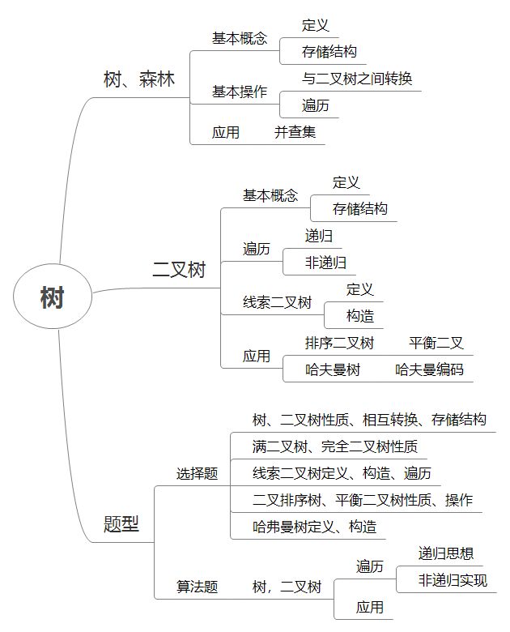

<div STYLE="page-break-after: always;"></div>

## 3.1 树

### 3.1.2 基本定义

>   n 个结点的有限集( $$n \ge 0$$ )
>
>   -   每棵树只有一个根结点
>   -   其余结点分为 m 个有限集，每个有限集都是树

#### 1. 定义

##### 逻辑结构

**一对多** ：除根结点外，其余节点有且仅有一个前驱，可以有多个后缀

##### 层次结构

树中某节点最多只和上一层的一个结点有直接关系 $$\Longrightarrow$$ n个结点 n-1 条边

#### 2. 术语

##### 结点间关系

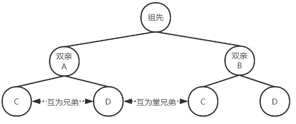

路径：==**从根到孩子结点**== 间经过的结点序列

-   树：==**无序有向**== 方向由双亲结点指向孩子结点

-   从根到某一结点的 ==路径== 只有一条

-   路径长度：序列中结点个数

<div STYLE="page-break-after: always;"></div>

##### 度

>   一个双亲结点有几个孩子结点

-   分支结点度 > 0

-   叶子结点的度 = 0

-   树的度指的是树中最大的结点度

**区分** 

| 度为m的树               | m叉树                   |
| ----------------------- | ----------------------- |
| 至少有一个结点的度等于m | 允许所有结点的度都小于m |
| 不允许为空树            | 可以为空树              |

##### 度的深度&高度

>   深度：自顶向下
>
>   高度：自底向上

-   树的高度/深度：从1开始，结点最大层数

##### 有序树&无序树

>   有序树：子树左右次序不能互换

##### 森林

>   m ($$m\ge 0$$) 个根，且结点不相交的有限结点集

### 3.1.3 性质

#### 1. 第i层结点树

度为m的树中第i层最多有 $$m^{i-1}$$ 个结点

高为h的树中最多有 $$1+m+m^2+...+m^{h-1}=\frac{m^h-1}{m-1}$$ 

#### 2. 树结点与度之间的关系

$$
\begin{aligned}
总结点数&=n_0+n_1+...+n_m\\
& =总分支数+1\\
又，总度数&=n_1+2n_2+mn_m=总分支数\\
故，总结点数&=总度数+1
\end{aligned}
$$

#### 3. 结点数与高度的关系

具有n个结点的m叉树

-   最大高度为n
-   最小高度为 $$\lceil log_m[(m-1)n+1] \rceil$$

**推导**

由第i层最多有 $$m^{i-1}$$ 个结点，故深度为h的树结点数范围为
$$
1+m+m^2+...+m^{h-1} <  \ n \le 1+m+m^2+...+m^h-1 \\
\frac{m^{h-1}-1}{m-1} <  \ n \le \frac{m^{h}-1}{m-1} \\
m^{h-1}-1 <  \ n(m-1) \le m^h-1 \\
m^{h-1} <  \ n(m-1)+1 \le m^h \\
故h-1< log_m[n(m-1)+1]且h \ge log_m[n(m-1)+1] \\
即h< \lceil log_m[n(m-1)+1] \rceil
$$

### 3.1.4 树的存储结构

>   能唯一反映树中各结点之间的逻辑关系

#### 1. 双亲表示法

>   ==**顺序存储**== ：利用结点只有唯一双亲结点，每个结点中增设伪指针指向双亲结点所在存储位置

-   便于得到双亲结点	$$O(1)$$
-   求结点的孩子结点需要遍历整个存储结构   $$O(n)$$

**表示** 

```c
typedef struct{
    ElemType data;
    int parent;
}PTNode;

typedef struct{
    PTNode nodes[MaxSize];
    int n;
}PTree;
```

-   根结点下标为0；其双亲域为-1

#### 2. 孩子表示法

>   ==**拉链法**== ：将每个结点的孩子用单链表链接
>
>   -   除叶结点，有多少个其余节点就有多少个链表

-   便于寻找孩子结点	$$O(1)$$
-   寻找双亲结点需要遍历整个存储结构  $$O(n)$$

#### 3. 孩子兄弟表示法

>   ==**二叉链表**== ：左子树根为其左孩子结点；右子树根为左孩子结点的第一个相邻兄弟结点

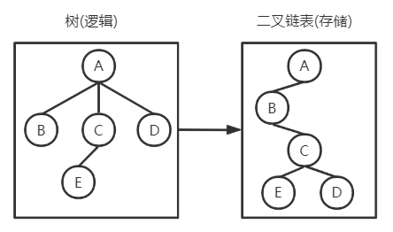

```c
struct CSNode{
    ElemType data;
    struct CSNode *firstChild,
        		  *nextSibling;
}CSNode;
```

-   利用树 $$\rightarrow$$ 二叉树转化的思想
-   从当前节点查找其双亲结点复杂
    -   可增设 `parent` 域

### 3.1.5 树的操作

#### 1. 树、森林与二叉树的转换

>   ==**左子右兄**== ：给定一棵树或者一个森林 都有唯一的二叉树与之对应
>
>   -   可以理解为对同一棵二叉树的解释方式不同。若两个孩子结点表示
>       -   左右孩子，则为二叉树
>       -   左子右兄，则为其对应的树或森林

##### 树 -> 二叉树

-   具有相同双亲的叶结点，转化后只剩一个叶结点 （最右叶结点）

-   每一层的最后一个结点转化为二叉树后其右指针域为空

-   叶结点个数 = 左指针域为空的结点数

##### 森林 -> 二叉树

1.  森林中每棵树 $$\rightarrow$$ 二叉树
2.  后一棵树为前一棵树的右子树

##### 二叉树 -> 森林

1.  根及左子树为第一棵树的二叉树形式
2.  二叉树右子树为森林除第一棵树的二叉树形式

<div STYLE="page-break-after: always;"></div>

#### 2. 树、森林遍历

##### 树遍历

先序

1.  访问根

2.  先序遍历左子树

3.  先序遍历右子树

后序

1.  后序遍历左子树

2.  后序遍历右子树

3.  访问根

##### 森林遍历

先序

1.  访问根

2.  先序遍历第一棵树的子树

3.  先序除第一棵树的森林

中序

1.  中序第一棵树的子树

2.  访问第一棵树的根

3.  中序除第一棵树的森林

| 树   | 森林 | 二叉树 |
| ---- | ---- | ------ |
| 先序 | 先序 | 先序   |
| 后序 | 中序 | 中序   |

-   可以理解为对一棵二叉树遍历序列的解释方式不同

<div STYLE="page-break-after: always;"></div>

### 3.1.6 树的应用——并查集

#### 1. 目标

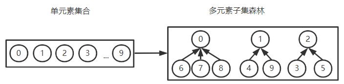

#### 2. 存储结构

**顺序存储**

-   子集根结点数据域：$$-|当前子集中元素个数|$$
-   孩子结点数据域：所在集合的根结点下标

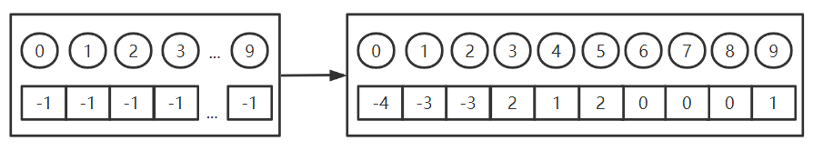

#### 3. 操作

-   Find(S,x); 查找集合S中x所在的子集，并返回子集名(子集根结点下标)

-   Union(S,root,root2); 将一个root2的双亲结点指针指向root

    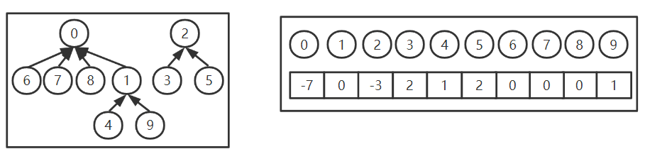

### 3.1.7 常用特例

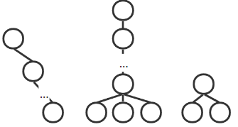

<div STYLE="page-break-after: always;"></div>

## 3.2 二叉树

### 3.2.1 基本概念

#### 1. 定义

>   n($$n\ge 0$$) 个结点组成的有序树

-   n=0，空二叉树
-   n > 0 左右子树互不相交且分别是一棵二叉树

#### 2. 特点

1.  每个结点至多只有2棵子树

    ==不是度为2的树==

    -   度为2的树至少有三个结点
    -   二叉树可以是空树

2.  二叉树是 ==**有序树**== ，区分左右

#### 3. 五种基本形态

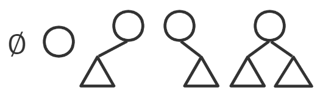

### 3.2.2 二叉树性质

-   $$n_0=n_2+1$$ 

    任一棵树，边数=结点树-1
    $$
    2n_2+n_1=n_2+n_1+n_0-1
    $$

-   第 k 层至多有 $$2^{k-1}$$ 个结点(k $$\ge$$ 1)

-   高为 h 的二叉树至多有 $$2^{h}-1$$ 个结点

#### 1. 满二叉树

>   除叶外，每个结点的度都为2

-   第 i 层结点数为第 i-1 层结点数的2倍

-   高为 h 的满二叉树，含有 $$2^h-1$$ 个结点
    -   树中总结点数n为奇数

#### 2. 完全二叉树

>   满二叉树连续缺失最下最右叶结点

-   编号与对应满二叉树相同

-   结点 i 与其双亲结点、孩子结点编号的关系
    $$
    \begin{aligned}
    \begin{cases}
    i>1 &,  其双亲结点编号为 \lceil \frac{i}{2}\rceil \\
    2i \le n &, 其左孩子为2i\\
    2i+1 \le n &,其右孩子为2i+1
    \end{cases}
    \end{aligned}
    $$

-   设编号为 i 的结点，若 $$i \le \lfloor \frac{n}{2} \rfloor$$ ，则结点 i 为分支结点，否则为叶子结点

-   设树的总结点数为n

    -   若 n 为奇数，则每个分支结点都有左右孩子

    -   若 n 为偶数，则编号为 $$\frac{n}{2}$$ 的结点只有左孩子

        度为1的结点有且只有一个左孩子

    -   树高为
        $$
        \lceil log_2(n+1) \rceil 或\lfloor log_2n \rfloor+1
        $$

-   编号为 i 的结点为叶结点或只有左孩子，则编号大于 i 的结点都是叶结点

##### 结点总数与叶结点数关系

**注**：重点是推导思路，式子不重要

1.  已知结点总数，求叶子结点数

    设完全二叉树结点总数为n，由完全二叉树的性质，前 h-1 层共有 $$2^{h-1}-1$$ 个结点，故叶子结点个数为 $$n-2^{h-1}+1$$ 。可知第 h-1 层有孩子结点的结点数为 $$\lceil \frac{n-2^{h-1}+1}{2} \rceil $$ ，而第 h-1 层有 $$2^{h-2}$$ 个结点，故第 h-1 层的叶子结点数为$$2^{h-2}-\lceil \frac{n-2^{h-1}+1}{2} \rceil $$ 。故含n个结点的完全二叉树，叶子结点个数为 $$n+1-2^{h-2}-\lceil \frac{n-2^{h-1}+1}{2} \rceil$$ 。

    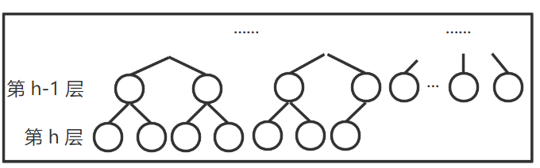

2.  已知第h层有k个叶结点，求树中总结点数

    -   树中结点数最多情况：第 h 层满，且第 h+1 层还有叶结点，如下图。

        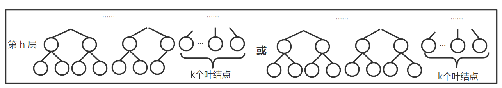

        第 h 层有孩子结点的分支结点数为 $$2^{h-1} - k$$ ，故树中结点总数为 $$2^h-1+2(2^{h-2}-k)=3*2^{h-1}-2k-1$$ 或 $$3*2^{h-1}-2k-2$$

    -   树中结点数最少情况：第 h 层有且仅有k个叶结点，前 h-1 层满

        -   求总结点数：

            前 h-1 层有 $$2^{h-1}-1$$ 个结点，故共有 $$2^{h-1}-1+k$$ 个结点

        -   求总叶结点数：

            第 h-1 层有叶子结点的结点数为 $$\lceil \frac{k}{2} \rceil$$ ，故第 h-1 层有 $$2^{h-2}-\lceil \frac{k}{2} \rceil$$ 个叶结点，故共有 $$2^{h-2}-\lceil \frac{k}{2} \rceil + k=2^{h-2}+\lceil \frac{k}{2} \rceil$$ 个叶结点

### 3.2.3 存储结构

1.  顺序存储

    自上而下，自左向右依次存入数组，最多占 $$2^h-1$$ 个连续存储单元

    适用于 ==满二叉树== 和 ==完全二叉树==

2. 链式存储

    数据域+左指针域+右指针域。

    但 n 个结点含有 n+1 个空指针域

<div STYLE="page-break-after: always;"></div>

### 3.2.4 二叉树的遍历

>   按某条搜索路径，使树中每个结点都被访问一次
>
>   -   二叉树结点 $$\stackrel{映射}{\longrightarrow}$$ 线性队列

#### 1. 递归框架

| 先序NLR              | 中序LNR             | 后序LRN               |
| -------------------- | ------------------- | --------------------- |
| visit(T);            | InOrder(T->lchild); | PostOrder(T->lchild); |
| PreOrder(T->lchild); | visit(T);           | PostOrder(T->rchild); |
| PreOrder(T->rchild); | InOrder(T->rchild); | visit(T);             |

-   时间复杂度：$$O(n)$$
-   空间复杂度：$$O(树高)$$ 最坏 $$O(n)$$

**注**

-   先序遍历，中序遍历，栈中保存的是栈顶元素的祖先结点

-   **遍历 $$\neq$$ 经过** ：每个非叶结点经过三次，但只被遍历一次

    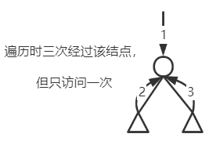

#### 2. 非递归遍历

##### 中序

1.  沿当前结点的左孩子依次入栈，直至为 `NULL`
2.  `pop` 一次，访问栈顶元素 `p` ，并检查其右孩子 `p.rchild`
    -   若为 `NULL`，则继续执行 2
    -   若不为 `NULL`，对其右孩子 `p.rchild` 执行 1

```c
InOrder(T){
    p = T;
    InitStack(S);
    
    while(p || !IsEmpty(S)){
        if(p){
            Push(S,p);
            p = p->lchild;
        }else{
            Pop(S,p);
            visit(p);
            p = p->rchild;
        }
    }
}
```

##### 先序

1.  访问当前结点，沿左孩子入栈，直至 `NULL`
2.  栈顶元素 `p` 出栈，检查其右孩子 `p.rchild`
    -   若为 `NULL`，继续执行 2
    -   若不为 `NULL`，则执行 1

```c
PreOrder(T){
    p = T;
    InitStack(S);
    
    while(p || !IsEmpty(S)){
        if(p){
            visit(p);
            Push(S,p);
            p = p->lchild;
        }else{
            Pop(S,p);
            p = p->rchild;
        }
    }
}
```

<div STYLE="page-break-after: always;"></div>

##### 后序

1.  沿当前结点的左孩子入栈，至 `NULL`
2.  读栈顶元素 `p`
    -   若其右孩子 `p.rchild` 不为 `NULL` ，且未被访问，则执行 1
    -   若其右孩子为空，则弹出栈顶元素，并访问该元素，继续执行 2

**注**

-   左子树全入栈后，还需要对右子树进行相同操作

-   栈顶元素出栈，要么其右孩子为 `NULL` ，要么已经访问完该结点的所有子树

    -   必须分清是从左子树返回该元素还是从右子树返回该元素

        增设辅助指针 `pre` ，记录最近访问的结点，若 `pre == p->rchild` 表示已经访问完全部子树

```c
PostOrder(T){
    p = T;
    pre = NULL;
    
    while(p || !IsEmpty(S)){
        if(p){//走到最左子树最右结点
            Push(S,p);
            p = p->lchild;
        }else{
            GetTop(S,p);//获取栈顶元素
            if(p->rchild && p->rchild!=pre)
                p = p->rchild;//右子树存在且未被访问
            else{
                Pop(S,p);
                visit(p->data);//访问根结点
                pre=p;//记录最近访问过的结点
                p=NULL;//结点访问完后重置
            }
        }
    }
}
```

<div STYLE="page-break-after: always;"></div>

#### 3. 层序遍历

1.  根入队

2.  出队，访问该结点

    -   有左孩子，将左孩子入队

    -   有右孩子，将右孩子入队

3.  返回 1 直至队空

```c
SeqOrder(T){
    InitQueue(Q);
    EnQueue(T);
    while(!IsEmpty(Q)){
        TNode p = DeQueue(Q);
        visit(p);
        if(p->lchild)
            EnQueue(p->lchild);
        if(p->rchild)
            EnQueue(p->rchild);
    }
}
```

#### 4. 遍历总结

##### 遍历序列->二叉树

只要有中序序列，一定可以唯一确定一棵二叉树

-   先序与中序遍历，相当于以先序入栈，中序出栈。不同的出栈序列对应不同的二叉树

##### 先序与后序相等

由题设 `NLR==LRN` ，故当 `L&R==∅` 时，才成立

-   只有根结点

<div STYLE="page-break-after: always;"></div>

##### 先序与后序相反

由题设 `NLR==LRN` ，故当 `L==NULL` 或 `R==NULL` 可得到先序与后序序列相反

-   即每层只有一个结点

-   结点数 == 二叉树高度

-   只有一个叶结点

-   每个结点所处的左右次序不确定

    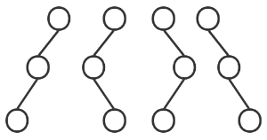

### 3.2.5 线索二叉树

>   线索二叉树为一种 ==**物理结构**== ：加上线索的链表结构

#### 1. 原理

1.  二叉树遍历实质上是将二叉树结点排列为 **线性序列** 

    除首尾结点，都有一个直接前驱和直接后继

2.  二叉树中有 `n+1` 个空指针

#### 2. 规则

1.  无左孩子，`lchild->前驱结点`

2.  无右孩子，`rchild->后继结点`

3.  `tag` 域，0表示孩子结点，1表示线索

>   存储结构：线索链表
>
>   线索：指针
>
>   线索化：将二叉链表中的空指针改为线索

#### 3. 中序线索二叉树代码

##### 结点定义

```c
typedef struct BiThrNode{
    ElemType data;
    struct BiThrNode *Lchild,*Rchild;
    PointerTag Ltag,Rtag;
}*BiThrTree;
```

##### 建立中序二叉线索树

```c
void InOrderThreading(BiThrTree &Thrt,BiThrTree root){
    if(!Thrt=(BiThrTree)malloc(sizeof(BiThrNode)))
        exit(OVERFLOW);//Thrt指向中序线索化链表的头结点
    Thrt->Rtag = Thread;//线索树的右指针域指向线索数的根结点
    Thrt->Rchild = Thrt;
    if(!root)//若该树为空树，则左右孩子为线索，分别指向根
        Thrt->Lchild = Thrt;
    else{
        Thrt->Ltag = Link;//线索树的前驱指向二叉树的根结点
        Thrt->Lchild = root;
        pre = Thrt;
        InThreading(root);//中序遍历进行中序线索化
        pre->Rchild = Thrt;//最后一个结点的右指针域指向线索树根结点
        pre->Rtag = Thread;
        Thrt->Rchild = pre;
    }
}
void InThreading(BiThrTree p){
    if(p){
        InThreading(p->Lchild);//左子树线索化
        if(!p->Lchild)	//前驱线索
            p->Ltag = Thread,p->Lchild = pre;
        if(!p->Rchild)	//后继线索
            pre->Rtag = Thred;	pre->Rchild = p;
        pre = p;
        InThreading(p->Rchild);//右子树线索化
    }
}
```

<div STYLE="page-break-after: always;"></div>

##### 中序线索二叉树找指定结点后继

```c
BiThrTree InorderNext(BiThrTree p){
    if(p->Rtag == Link)//有左孩子，则直接后继为右孩子
        return p->Rchild;
    else{//找右子树的最左结点
        q = p->Rchild;
        while(q->Ltag==Thread)
            q = q->Lchild;
        return q;
    }
}
```

#### 4. 先&后序线索二叉树

##### 构造

修改调用线索化递归函数的位置

##### 先序找后继

有左孩子，左孩子为后继；无左孩子但有右孩子，则右孩子为后继

若是叶子结点，则其右亲兄弟或最左堂兄弟为其后继

##### 后序找后继

-   若 `p` 为二叉树根，则其后继为空

-   若 `p` 为其双亲的右孩子，或为双亲无右孩子的左孩子，则后继为其双亲结点

-   若 `p` 为其双亲的左孩子，且其双亲有右孩子，则后继为其双亲的最左右子结点

==**后序线索二叉树不能有效解决后序找后继的问题**== 

-   从右孩子返回父节点，但右孩子的右指针域不一定是线索，故使用三叉链表，增设 `parent` 域
    -   而 ==先序线索二叉树与后序线索二叉树== 可遍历整棵树

<div STYLE="page-break-after: always;"></div>

```c
typedef struct BiThrNode{
    ElemType data;
    struct BiThrNode *Lchild,*Rchild,*parent;//三叉链表
    PointerTag Ltag,Rtag;
}

BiThrTree PostOrderNext(BiThrTree p){
    if(p->Rtag == Link)
        return p->Rchild;
    else{
        //查找p所指结点的父节点
        if(p == p->parent->Rchild) return p->parent;
        if(p == p->parent->Lchild && p->parent->Rtag == Thread)
            return p->parent;
        //查找双亲结点的右子树最左结点
        q = p->parent->Rchild;
        while(q->Ltag == Link || q->Rtag == Link){
            if(q->Ltag == Link)//左子结点优先级高
                q = q->Lchild;
            else
                q = q->Rchild;
        }
    }
}
```

<div STYLE="page-break-after: always;"></div>

### 3.2.6 二叉树的应用

#### 1. 二叉排序树

```c
typedef struct TreeNode{	
    ElementType key;	
    struct TreeNode *parent,*left,*right;
}Node, *BST;
```

`p->lchild->data < p->data < p->rchild->data;`

-   中序遍历可以得到有序序列

##### 查找

```c
while(!T && key != T->data){
	if(key < T->data)
        T = T->lchild;
    else
        T = T->rchild;
}
```

一棵二叉排序树上的查找序列，第 n,n+1 个数不能分居第 n-1 个数的两侧如

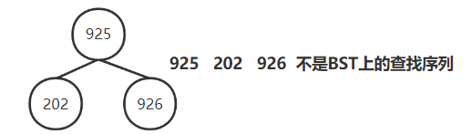

##### BST插入

查找过程中，不存在目标结点，再插入

新插入的结点一定是一个叶结点，且是查找失败时，查找路径上访问的最后一个结点的孩子

<div STYLE="page-break-after: always;"></div>

```c
void Insert(BST T,Node *p){	
    Node *x = T;
    Node *y = NULL;
    while(x != NULL){//查找目标结点		
        y = x;
        if(x->key > p->key)
            x = x->left;
        else
            x = x->right;
    }
    p->parent = y;
    if(y == NULL)//第一个结点	
        T = p;
    else if(y->key > p->key)//待插入结点值小于叶结点	
        y->left = p;	
    else//待插入结点值大于等于叶结点
        y->right = p;
}
```

##### BST删除

BST中元素间的相对位置与BST中序序列中元素间的相对位置相同

1.  若删除结点 `p` 是叶结点，则直接删除
2.  若删除结点 `p` 是某单支树，则用其孩子结点代替
3.  若删除结点 `p` 有左右孩子
    -   用直接后继 `next` 代替，`p` 的左孩子变为 `next` 的左孩子，`p` 的右孩子变为 `next` 的最右左子树
    -   用直接前驱 `pre` 代替，`p` 的右孩子变为 `pre` 的右孩子，`p` 的左孩子变为 `pre` 的最左右子树

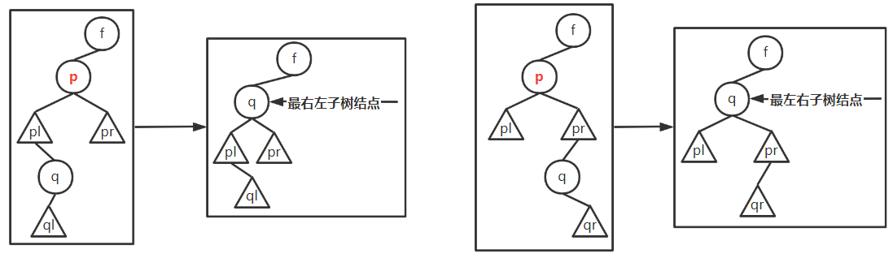

<div STYLE="page-break-after: always;"></div>

```c
void Transplant(BST T, Node *x, Node *y){// y替换x的位置
    if(x->parent == NULL)
        T = y;
    else if(x == x->parent->left)
        x->parent->left = y;
    else
        x->parent->right = y;
    if(y != NULL)
        y->parent = x->parent;
}

void Delete(BST T, Node *p){
    if(p->left == NULL)//p左子树空，则用其右孩子根结点代替p的位置
        Transplant(T, p, p->right);
    else if(p->right == NULL)//p的右子树为空，用其左孩子代替p的位置
        Transplant(T, p, p->left);
    else{//按上图第二种情况写，第一种类推
        Node *q = FindMin(p->right); //找p的最左右子树结点		
        if (q->parent != p){
            Transplant(T, q, q->right);
            q->right = p->right;
            q->right->parent = q;
        }
        Transplant(T, p, q);
        q->left = p->left;
        q->left->parent = q;
    }
}
```

##### BST平均查找长度

**计算**

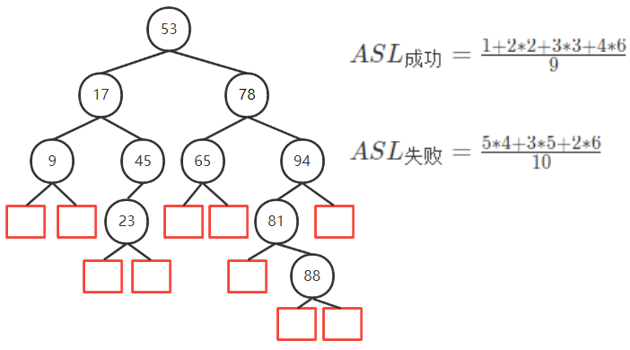

-   查找失败的情况相当于将 $$(-\infin,+\infin)$$ 用n个数分为 n+1 个区间

**最好情况** ASL = $$O(log_n)$$ 平衡二叉树

**最坏情况** ASL = $$O(n)$$ 单链表

##### 二分查找与二叉排序树

1.  ASL相同

    -   二分查找判定树唯一

    -   BST是动态树，不唯一

        插入顺序不同，生成的BST不同

2.  区别

    |          | 类型       | 存储结构   | 构建时间复杂度 |
    | -------- | ---------- | ---------- | -------------- |
    | 二分查找 | 静态查找表 | 有序顺序表 | $$O(n)$$       |
    | BST      | 动态查找表 | 修改指针   | $$O(log_2n)$$  |

#### 2. 平衡二叉树

>   平衡因子：$$h_L-h_R$$
>
>   平衡二叉树：
>
>   -   左右子树都是平衡二叉树
>   -   $$|h_L-h_R| \le 1$$ 

##### 平衡二叉树的插入

>   操作对象：==**最小不平衡子树**== 
>
>   -   距插入点最近的 平衡因子的绝对值为2 的子树

-   调整前，新插入的结点一定是叶结点

-   从下向上调整

<div STYLE="page-break-after: always;"></div>

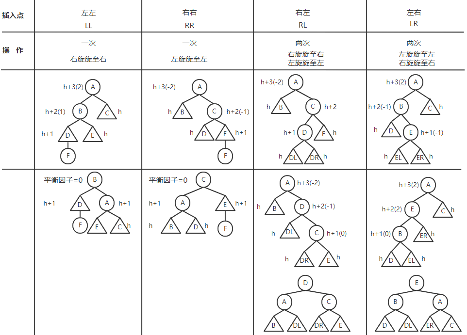

-   不平衡点位置字母相同，则旋转一次；不平衡点位置字母不同，则旋转两次

    LL / RR ：旋转一次

    LR / RL：旋转两次

-   字母不同，则逆向旋转；字母相同，则同向旋转

    LL，则右旋；RR则左旋

    RL，则先右旋再左旋；LR，则先左旋再右旋

**举例** ：{ 8 ， 3 ，7 ，10 ，9 ，15 ， 8 }

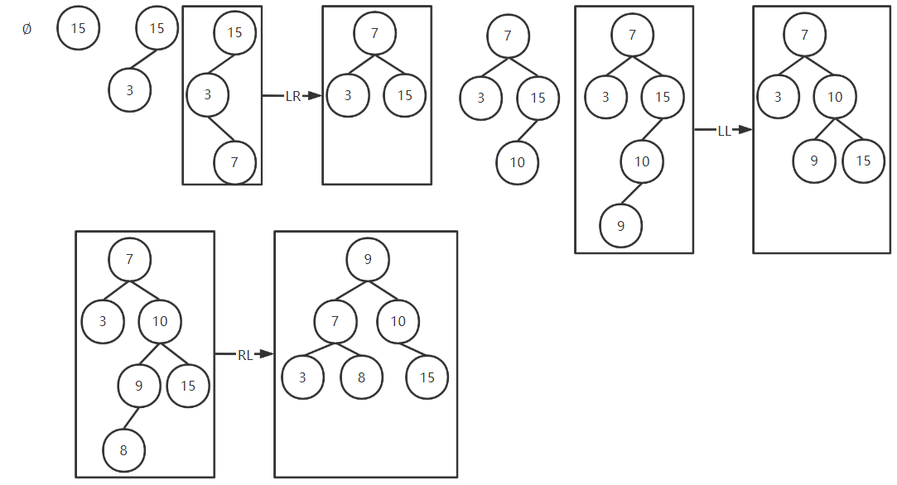

<div STYLE="page-break-after: always;"></div>

##### 平衡二叉树查找

1.  ASL： $$O(log_2n)$$

2.  比较次数不超过平衡二叉树树的深度，最大深度 $$h=log_\phi\sqrt5(n+1)-2$$，其中 $$\phi=\frac{1+\sqrt5}{2}$$

    深度为 $$h$$ 的平衡树有最少结点

3.  非叶结点平衡因子为1，结点与树高之间的关系： $$n_h=n_{h-1}+n_{h-2}+1$$ 

    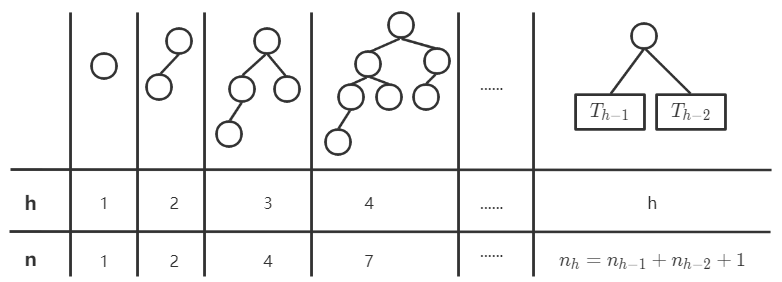

##### 删除后插入

$$T_1 \stackrel{删除}{\longrightarrow} T_2 \stackrel{插入}{\longrightarrow}T_3$$

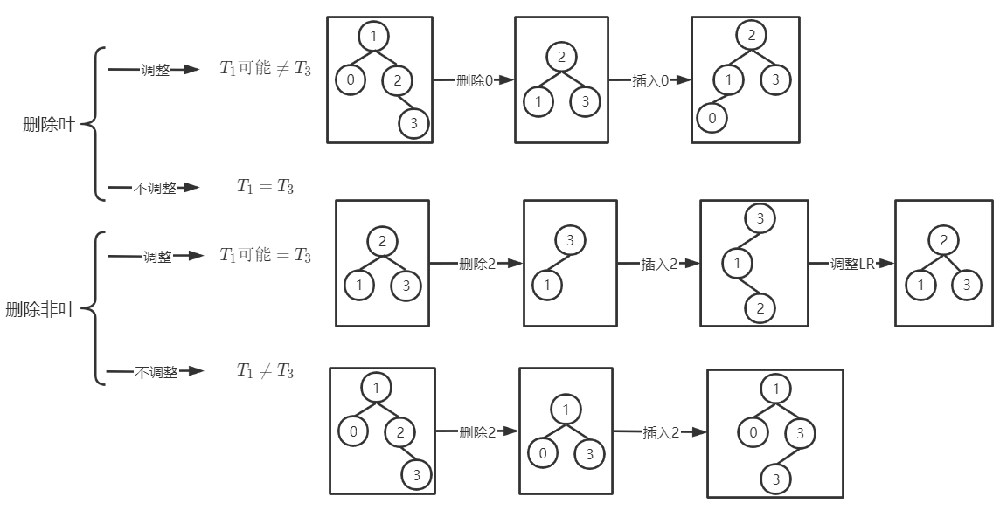

#### 3. 哈弗曼树

##### 定义

>   最优二叉树，其WPL最小

$$
带权路径长度WPL=\sum_{i=1}^{n}W_i(结点权值)*L_i(从根到叶结点路径长度)
$$

**原理**
$$
\begin{aligned}
&一棵Huffman树只有度为0和m的结点,由树的结点数与边数的关系n_m+n_0=mn_m+1.\\
&故n_m=\lceil \frac{n_0-1}{m-1}\rceil。所以总结点数已知，可以用顺序存储结构.

\end{aligned}
$$
**结点定义**

```c
typedef struct{
    char ch;
    unsigned int weight;
    unsigned int parent,lchild,rchild;
}HTNode,*HummanTree;
```

##### 构造哈弗曼树

0.  带权结点构成森林F

1.  从F中选择权最小的两个结点，求和形成新结点
2.  删除原先的两个结点，将新结点加入F
3.  反复执行 **1.** 直至F中只有一棵树

**初始状态**

|      | ch   | weight | parent | lchild | rchild |
| ---- | ---- | ------ | ------ | ------ | ------ |
| 1    | a    | 0.05   | 0      | 0      | 0      |
| 2    | b    | 0.29   | 0      | 0      | 0      |
| 3    | c    | 0.07   | 0      | 0      | 0      |
| 4    | d    | 0.08   | 0      | 0      | 0      |
| 5    | e    | 0.14   | 0      | 0      | 0      |
| 6    | f    | 0.23   | 0      | 0      | 0      |
| 7    | g    | 0.03   | 0      | 0      | 0      |
| 8    | h    | 0.11   | 0      | 0      | 0      |

<div STYLE="page-break-after: always;"></div>

1.  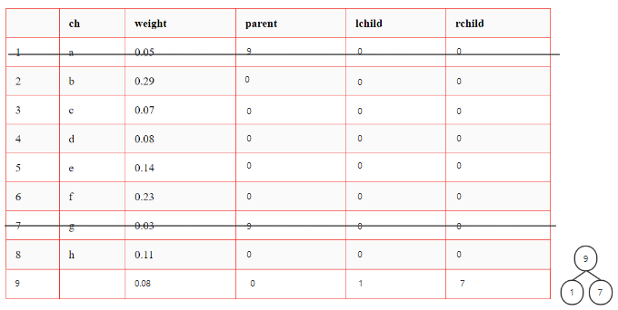

2.  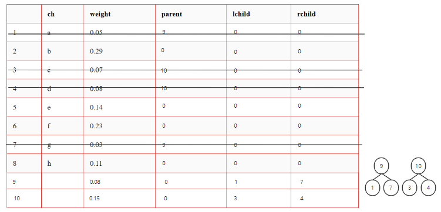

3.  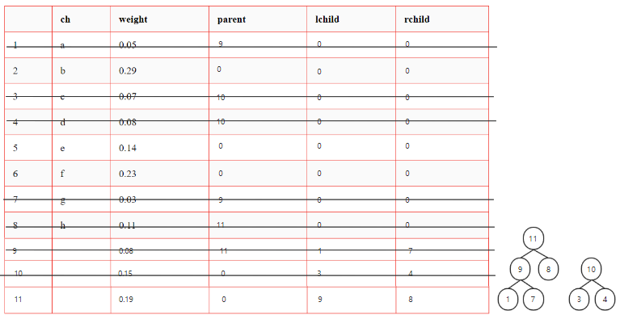
4.  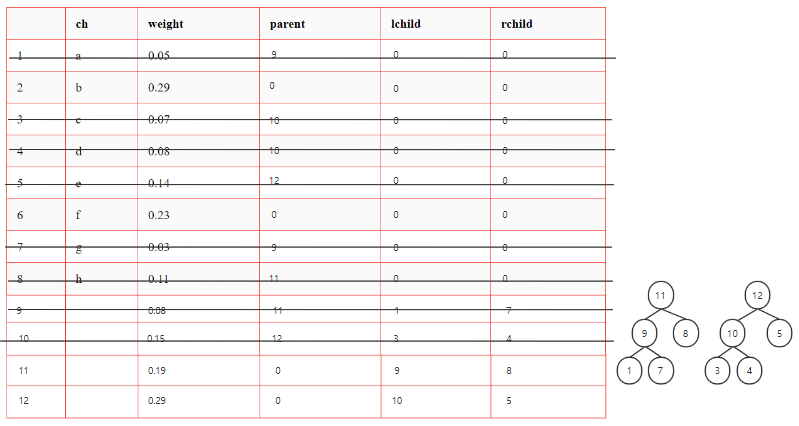

5.  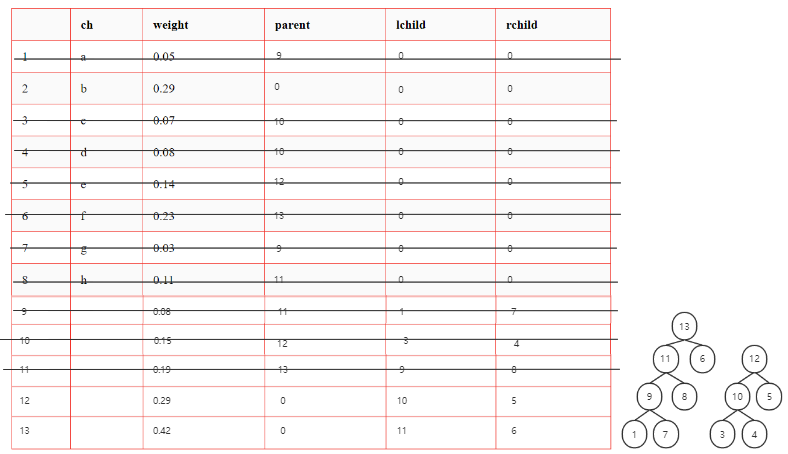
6.  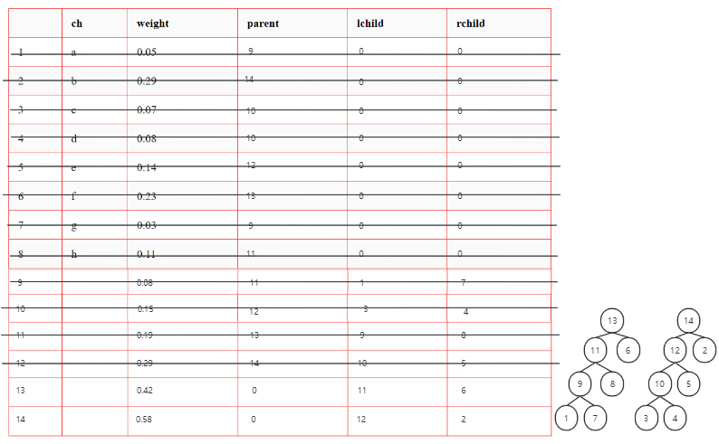

7.  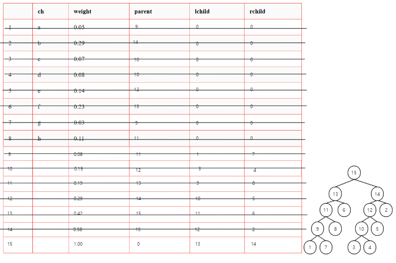

##### 二叉哈夫曼树特点

1.  所有初始结点都是叶结点

    结点权值越小，到根结点的路径长度越长

2.  不存在度为1的结点，在二叉树中 $$n_2=n_0-1$$，故哈弗曼树有 $$2n_0-1$$ 个结点，新建 $$n_0-1个结点$$

3.  任一非叶结点权值不小于下一层任意节点权

4.  二叉树为有序树 ，WPL唯一

##### Huffman编码

>   高频短编码；低频长编码

-   Huffman编码是数据压缩码
-   前缀码：没有一个编码是另一个编码的前缀

```c++
typedef struct{
    char ch;
    unsigned int weight;
    unsigned int parent,lchild,rchild;
}HTNode,*HummanTree;

HuffmanTree HT;

void HuffmanCoding(HuffmanTree &HT,HuffmanCode &HC
                    					,int *w,int n_0){
	//w存放个字符的权值，构造哈弗曼树，并求出字符的编码
    if(n_0 == 1)//只有一个结点
        return ;
    
    /* 初始化 */
    int n = 2*n_0-1;//总结点数
    HT = new HTNode[n+1];
    //初始化Huffman存储结构
    for(int i = 1;i <= n;++i){
        HT[i].weight = w[i-1];
        HT[i].parent = 0;
        HT[i].lchild = HT[i].rchild = 0;
    }
    //共需2n_0-1个存储单元
    for(;i <= m;i++){
        HT[i].parent = 0;
        HT[i].lchild = HT[i].rchild = 0;
    }
    
    /* 构造哈夫曼树 */
    int s1,s2;
    for(i=n_0+1;i <= m;i++)0{
        //从H[1...i-1]中选择parent为0且weight最小的两结点
        //其序号为s1,s2
        select(HT,i-1,s1,s2);
        HT[s1].parent = i;	HT[s2]
        HT[i].weight = HT[s1].weight+HT[s2].weight;
    }
```

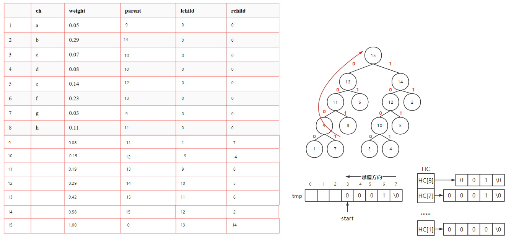

```c++
//从叶到根求每个字符的哈夫曼编码
    HC = new char*[n_0+1];
    //(char **)malloc((n+1)*sizeof(char *))
    tmp = new char[n_0];//树高不会超过n_0,故长度最大为n_0
    tmp[n_0-1]='\0';
    for(i=1;i <= n_0;++i){
        start = n_0-1;//start标记编码的起始坐标
        for(c=i,f=HT[i];f!=0;c=f,f=HT[f].parent){
            if(HT[f].lchild == c)
                tmp[--start]='0';//从叶到根，所以是逆序
            else
                tmp[--start]='1';
        }
        HC[i] = new char[n_0-start];
        strcpy(HC[i],&tmp[start]);
    }
    delete tmp[];
}
```
