# 4. 图

[TOC]

<div STYLE="page-break-after: always;"></div>

## 4.1 基本概念

>   不存在空图
>
>   -   顶点集一定非空
>
>   -   边集可以为空

图和树是逻辑上的区别，都是 **逻辑结构**

### 4.1.1 顶点的度

$$
\begin{cases}
无向图\\
&\sum_{i=1}^nTD(v_i)=2e \\
有向图\\ &\sum_{i=1}^nTD(v_i)=\sum_{i=1}^nID(v_i)+\sum_{i=1}^nOD(v_i)\\
&\sum_{i=1}^{n}ID(v_i)=\sum_{i=1}^nOD(v_i)=e
\end{cases}
$$

### 4.1.2 图的种类

#### 1. 简单图

-   $$v_i \rightarrow v_j$$ 间无重复边
-   任一顶点无自身到自身的顶点

#### 2. n个顶点的完全图

$$
\begin{cases}
无向图\\
&\frac{n(n-1)}{2}条边 \\
有向图\\ 
&n(n-1)条边
\end{cases}
$$

<div STYLE="page-break-after: always;"></div>

#### 3. 子图

>   顶点集为图G的子集

-   并非所有的顶点子集与边子集的组合都是图G的子图
-   任一条边及其两个端点都在的边集与顶点集的组合才构成子图

#### 4. 连通图[无向图]

无向图连通：顶点 $$v\rightarrow w$$ 直接有路径

>   图 G 中任两顶点间都连通
>
>   -   一点可以访问全部
>   -   若边数小于n-1，则一定是非连通图

1.  连通分量：**无向图**中极大连通子图
2.  生成树：**连通图** 的包含所有结点的极小连通子图
    -   包含n-1条边，n个顶点
    -   加一条边构成回路，减一条边为非连通图
3.  生成森林：**非连通图** 的多个连通分量生成的多个树构成的森林

#### 5. 路径&完全图

##### 路径

>   $$v_p \rightarrow v_q$$ 之间的顶点序列

-   路径长度：路径中的顶点个数
-   距离：$$v_p \rightarrow v_q$$ 的最短路径长度
-   简单路径：顶点不重复

>   回路、环：起点和终点 ($$v_p == v_q$$) 相同的路径

-   简单回路：除首尾顶点不重复的路径
-   有拓扑序列的图一定无环

##### 完全图

已知有n个顶点，确保连通的的最小边数为：n-1个顶点的完全图的边数+1,$$\frac{(n-1)(n-2)}{2}+1$$

已知有n条边，组成非连通图的顶点数为：k个顶点组成完全图+1,$$\frac{k(k-1)}{2}+1\Rightarrow \lceil \sqrt{2n} \rceil+1$$

#### 6. 强连通图[有向图]

有向图连通：$$v \rightleftarrows w $$ ，双向连通

>   每对顶点间有 **路径**

-   不是每对顶点间都有 **弧**

1.  强连通分量

    有向图中的极大强连通图

2.  _有向完全图一定是强连通图_

<div STYLE="page-break-after: always;"></div>

## 4.2 图的存储

### 4.2.1 邻接矩阵法

#### 1. 规则

1.  表示

$$
\begin{cases}
无权图 &取0或1 \\
带权图 &w_{ij}或0或\infty
\end{cases}
$$

2.  无向图

    -   邻接矩阵对称且唯一

    -   可进行压缩存储，只存放上(下)三角矩阵元素

        对称矩阵默认为无向图

    -   第i行(列)非零元素个数= $$v_i$$ 的出度OD( $$v_i$$ )或者入度ID( $$v_i$$ )

3.  有向图

    -   第i行非零且非 $$\infty$$ 的元素个数为顶点 $$v_i$$ 的出度
    -   第i列非零且非 $$\infty$$ 的元素个数为顶点 $$v_i$$ 的入度

#### 2. 特点

1.  适用于 _稠密图_ 存储

2.  空间复杂度为 $$O(\|v\|^2)$$ 

3.  确定两点之间是否有边 $$O(1)$$ ——数组的随机存取特性

    确定图中边数 $$O(\|v\|^2)$$ 

4.  某个顶点出度越大，则存储矩阵的行非零元素越多

5.  图G的邻接矩阵为A，则$$A^n[i][j]$$ 表示从 $$v_i \rightarrow v_j$$ 的长度为n的路径数量

<div STYLE="page-break-after: always;"></div>

#### 3. 表示

``` c++
typedef struct{
    VexType Vex[MaxVertexNum];//顶点集
    EdgeType Edge[MaxVertexNum][MaxVertexNum];//邻接矩阵表示边集
    int vexnum,arcnum;
}MGraph;
```

#### 4. 有向无环图的矩阵表示

>   有向无环图：非零元素集中在上三角或下三角区域，其对称区域全为0

-   图中比不存在环
-   一定存在拓扑序列但不唯一

上三角：出度大编号小

下三角：入度大编号小

### 4.2.2 邻接表法

邻接表法：只存出度

逆邻接表法：只存入度

>   邻接表：每个顶点 v 建立相应的边表
>
>   -   顶点头指针(**顺序存储**) ：顶点头指针为边链表的头指针，指向与 $$v_i$$ 关联的首条边
>
>   -   边信息(**单链表**)
>
>       无向图：依附于 $$v_i$$ 的边
>
>       有向图：以 $$v_i$$ 为尾的弧

<div STYLE="page-break-after: always;"></div>

#### 1. 特点

1.  适用于 _稀疏图_

2.  邻接表 _不唯一_ 

    同一顶点的边结点连接顺序不唯一，取决于建立边表的算法及边的输入序列

3.  存储空间

    无向图：$$O(\|v\|+2\|e\|)$$

    有向图：$$O(\|v\|+\|e\|)$$

4.  时间复杂度

    找所有邻边：读顶点的边表——$$O(n)$$

    确定边是否存在：扫一个端点的边表—— $$O(n)$$

5.  有向图某顶点的度

    出度：邻接表中结点个数

    入度：需遍历全部邻接表

#### 2. 表示

```c++
typedef struct{
    VexType data;
    ArcNode *firstArc;
}VNode,AdList[MaxVertexNum];//邻接表

typedef struct{
    int adjvex;//邻接点域
    double weigh;//边表权值
    struct ArcNode *nextArc;//邻接顶点
}ArcNode;//边表结点

typedef struct{
    int vexnum;
    int arcnum;
    AdList vertices;//顶点头指针
}AGraph;
```

<div STYLE="page-break-after: always;"></div>

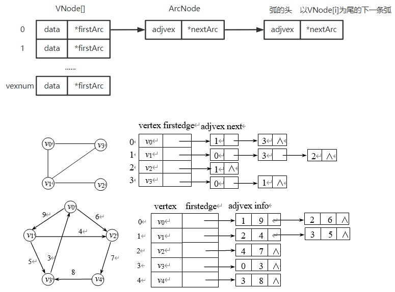

### 4.2.3 邻接多重表

>   **无向图的存储结构**

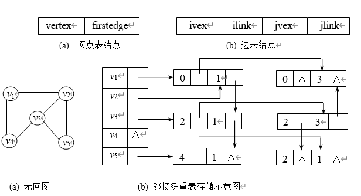

<div STYLE="page-break-after: always;"></div>

### 4.2.4 十字链表法

>   **有向图的存储结构**

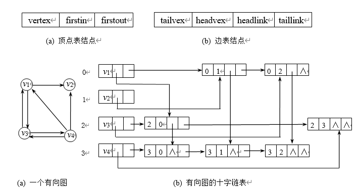

## 4.3 图的基本操作

>   独立于存储结构
>
>   参数相同；实现不同，性能不同

```c
Adjacent(G,x,y);//x与y之间是否存在边
Neighbors(G,x);//x的邻接边
FirstNeighbor(G,x);//G中x的第一个邻接点
NextNerghbor(G,x,y);//G中除x的下一个邻接点

InsertVertex(G,x);//插入点
DeleteVertex(G,x);//删除点

AddEdge(G,x,y);//新增边
RemoveEdge(G,x,y);//移除边
```

<div STYLE="page-break-after: always;"></div>

已知n个顶点的图，其邻接矩阵表示为MGraph，邻接表表示为LGraph

1.  判别图中边数 n(e)

    n(x)：表示x的个数

    |        | 无向图                      | 有向图        |
    | ------ | --------------------------- | ------------- |
    | MGraph | $$n(e)=\frac{n(1)}{2}$$     | $$n(e)=n(1)$$ |
    | LGraph | $$n(e)=\frac{n(eNode)}{2}$$ | $$n(eNode)$$  |

2.  判断两点是否连通

    | MGraph | $$MGraph[i][j] \overset{?}{=}1$$ | $$O(1)$$ |
    | ------ | -------------------------------- | -------- |
    | LGraph | 遍历顶点i的邻接表                | $$O(e)$$ |

3.  度的计算

    |        | 无向图                   | 有向图                                                       |
    | ------ | ------------------------ | ------------------------------------------------------------ |
    | MGraph | $$2*第 i 行 '1' 的个数$$ | 出度：第 i 行 '1' 的个数<br />入度：第 i 列 '1' 的个数       |
    | LGraph | n(eNode)                 | $$出度：表头为 i 的单链表中 eNode 的个数$$<br />$$入度：边表中 i 的个数$$ |

<div STYLE="page-break-after: always;"></div>

## 4.3 图的遍历

>   从某一顶点出发，沿图中的边对图中所有顶点访问且只访问一次

-   遍历与经过的区别

    从某一点出发经过图中所有结点 $$\neq$$ 遍历：每个结点不重复的访问一次

-   对每个顶点查找邻接点的过程取决于存储结构

    矩阵： $$O(\|v\|^2)$$

    邻接表：$$O(\|e\|)$$

-   树是一种特殊的图

### 4.3.1 广度优先搜索

>   从某一顶点 v 开始，由近到远访问和 v 有路径长度为1,2,3....的顶点
>
>   -   逐层访问，故需要借助队列

#### 1. 实现

```c++
bool visted[MAX_VERTEX_NUM];

bool BFSTraverse(Graph G){
    //初始化
    for(int i = 0;i < G.vernum;++i)
        visited[i] = FALSE;
    InitQueue(Q);
    
    //BFS
    for(int i = 0;i < G.vexnum;++i)
        if(!visited[i])
            BFS(G,i);//使用for循环确保每个连通分量都被访问
}

void BFS(Graph G,int v){//从顶点v出发，广度优先遍历图G
	visit(v);
    visited[v] = TRUE;
    EnQueue(Q,v);//顶点v入队
    
    while(!isEmpty(Q)){
        DeQueue(Q,v);
        for(w = FirstNeighbor(G,v);w >= 0;
            				w=NextNeighbor(G,v,w)){
            //检测v的所有邻接点w
            if(!visited[w]){//w为v尚未访问的邻接点
                visit(w);
                visited[w] = TRUE;
                EnQueue(Q,w);
            }
        }
    }
}
```

#### 2. 性能分析

1.  空间复杂度

    $$O(\|v\|)$$

2.  时间复杂度[与采取的存储方式有关]

    -   邻接矩阵	$$O(\|v\|^2)$$

    -   邻接表	$$O(\|v\|+\|e\|)$$ 

        顶点入队	$$O(\|v\|)$$

        搜索所有邻接点，访问边 $$O(\|e\|)$$

#### 3. 应用

1.  求 $$u \rightarrow v$$ 路径长度最小的路径

2.  无权图求单源点最短路径

    <div STYLE="page-break-after: always;"></div>

    ```c
    void BFS_Min_Distance(Graph G,int u){
        //d[i]表示从u到i的最短路径
        for(i = 0;i < G.vexnum;++i)
            d[i] = INFINITE;
        visited[u] = TRUE;
        d[u] = 0;
        EnQueue(Q,u);
        while(!isEmpty(Q)){
            DeQueue(Q,u);//BFS算法主过程
            for(w = FirstNeighbor(G,u);w >= 0;
               			w = NextNeighbor(G,u,w)){
                if(!visited[w]){
    				visited[w] = TRUE;//设已访问标记
                    d[w] = d[u]+1;
                    EnQueue(Q,w);
                }
            }
        }
    }
    ```

3.  广度优先生成树

    邻接矩阵：表示法唯一 $$\Longrightarrow$$ 生成树唯一

    邻接表：表示法不唯一 $$\Longrightarrow$$ 生成树不唯一

### 4.3.2 深度优先搜索

$$
\begin{cases}
& 图的邻接矩阵唯一 \Longrightarrow 基于邻接矩阵的DFS、BFS序列唯一 \\
& 图的邻接表不唯一\Longrightarrow 基于邻接表的DFS、BFS序列不唯一
\end{cases}
$$

DFS——递归算法，用一个递归工作栈，空间复杂度 $$O(\|v\|)$$ 

性能分析

-   时间复杂度

    邻接矩阵 $$O(\|v\|^2)$$

    邻接表 $$O(\|v\|+\|e\|)$$

-   空间复杂度

    $$O(\|v\|)$$

<div STYLE="page-break-after: always;"></div>

```c
bool visited[MAX_VERTEX_NUM];//访问标记数组

void DFSTraverse(Graph G){
    for(v = 0;v < G.vexnum;++v) //初始化
        visited[v] = FALSE;
    for(v = 0;v < G.vexnum;++v)//遍历所有连通分量
        if(!visited[v])
            DFS(G,v);
}

void DFS(Graph G,int v){
    visit(v);
    visited[v] = TRUE;//访问v并做标记
    for(w = FirstNeighbor(G,v);w >= 0;
        			w = NextNeighbor(G,v,w)){
        if(!visited[w])
            DFS(G,w);
    }
}
```

### 4.3.3 图的遍历与连通性

1.  连通
    -   无向图：从某一顶点 v 出发，一次遍历可访问图中所有顶点
    -   有向图：初始点到图中每个顶点都有路径

2.  连通分量个数
    
-   `DFSTraverse` / `BFSTraverse` 中调用 `DFS` / `BFS` 次数为连通分量数
    
3.  对一个有向无环图，`DFSTraverse` 的退栈序列就是一个拓扑序列

    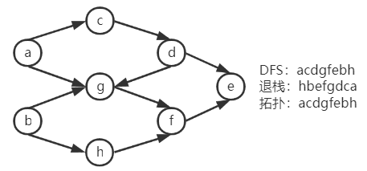

<div STYLE="page-break-after: always;"></div>

## 4.4 应用

### 4.4.1 最小生成树

>   1.  边数 = 顶点数 - 1
>
>   2.  带权连通图权值和最小
>
>       最小权值和唯一，但树形不唯一
>
>       若各边权值互不相等，则树形唯一

```c
Generate_MST(Graph G){
    T = NULL;
    while T未形成树
        do 找最小代价边(u,v)且加入T后不形成回路
    		T = T ∪ (u,v);
}
```

#### 1. 深度优先、广度优先生成树

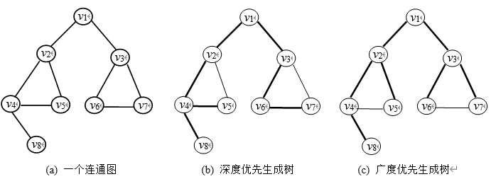

<div STYLE="page-break-after: always;"></div>

#### 2. Prim算法

>   选点：Prime——Point

**手动模拟**

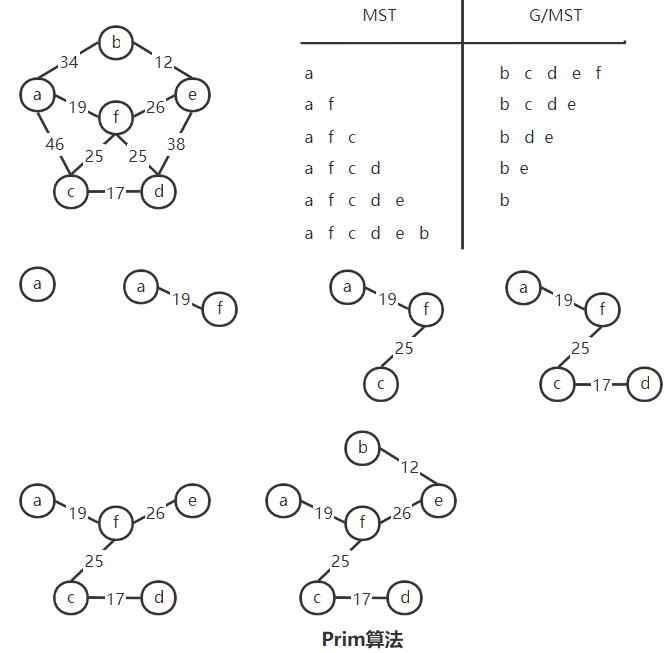

**实现**

```c++
void Prim(G,T){
    T = ∅;//初始化为空集
    U = {'a'};//MST的顶点集
    while((V-U) != ∅){
        设(u,v)是使 u∈U与v∈V，且权值最小的边;
        T = T∪{(u,v)};
        U = U∪{v};
    }
}
```

时间复杂度：$$O(\|v\|^2)$$ ，故不依赖于边集，适用于稠密图

<div STYLE="page-break-after: always;"></div>

#### 3. Kruskal算法

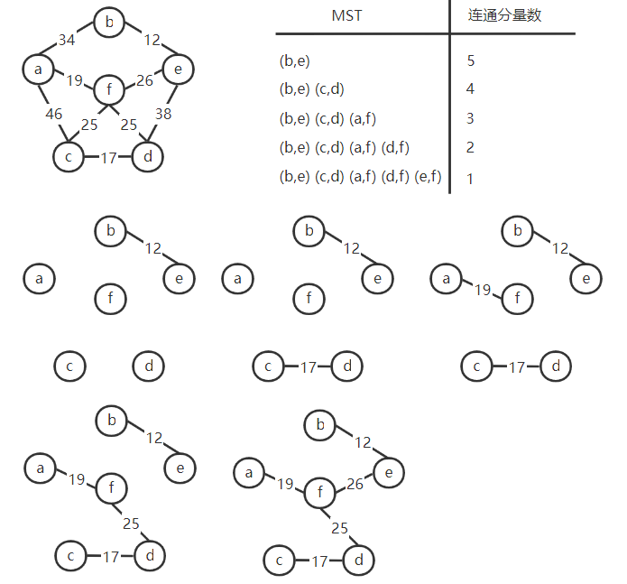

```c++
void Kruskal(G,T){
    T = V;//初始化树，仅含顶点
    numS = n;//连通分量数
    while(numS > 1){//若连通分量数大于1
        从E中取出权值最小的边(v,w);
        if(v和u属于不同连通分量){
            T = T∪{(v,u)};//将此边加入生成树中
            numS--;
        }
    }
}
```

时间复杂度：$$O(\|e\|log\|e\|)$$ ，适用于点多边少

<div STYLE="page-break-after: always;"></div>

### 4.4.2 最短路径

>   带权路径长度：路劲上权值的和
>
>   -   满足连通的 $$u \rightarrow v$$ 
>   -   找所有 $$u \rightarrow v$$ 中权值最小的路径

区别：

`Dijkstra` : 单源点最短路径

`Floyd` : 多源点最短路径

#### 1. Dijkstra

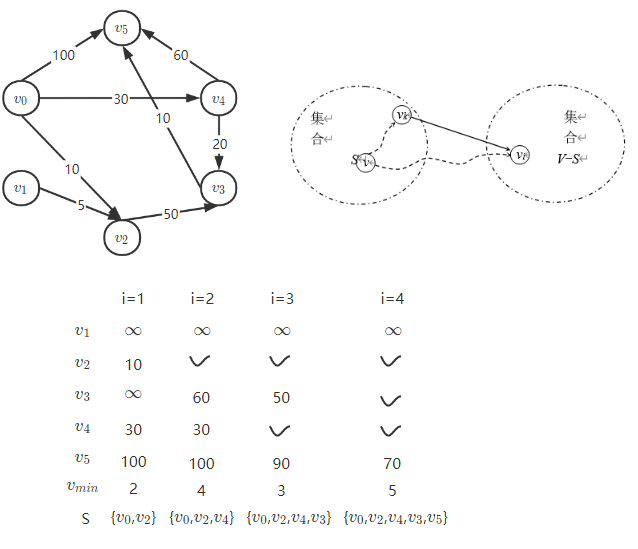

```c
void Dijkstra(MGraph G,int v0,Patharc P,ShortPathTable D){
	int flag[MAXVEX];//访问标记数组 0-未访问 1-已访问 
	for(int i = 0;i < G.numVertices;++i){
		flag[i] = 0;
		D[i] = G.arc[v0][i];//D[]为距离数组 
		P[i] = 0;//P[i]为到达vi的路径长度 
	} 
	D[v0] = 0,flag[v0] = 1,P[0] = 0;
	
	for(int i = 0;i < G.numVertices;++i){
		int min = INFINITY;//记录当前距离最小值 
		int idx;//记录距离最小值下标 
		for(int j = 0;j < G.numVertices;++j)//查找距离v0最近的点 
			if(!flag[j] && D[j] < min){//vj未被访问且距离最小 
				idx = j;
				min = D[j];
			}
		
		flag[idx] = 1;
		for(int w = 0;w < G.numVertices;++w)//更新各顶点最小距离 
			if(!flag[w] && (min + G.arc[idx][w] < D[w]))
				D[w] = min + G.arc[idx][w]; 
		P[i+1] = idx;
	} 
}
```

#### 2. Floyd

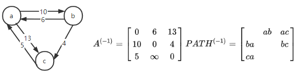
$$
\begin{gathered}
A^{(0)}=
\begin{bmatrix}
0 & 6 & 13 \\
10 & 0 & 4/19 \\
5 & 15/\infty & 0
\end{bmatrix}
=\begin{bmatrix}
0 & 6 & 13 \\
10 & 0 & 4 \\
5 & 15 & 0
\end{bmatrix}
PATH^{(0)}=
\begin{bmatrix}
 & ab & ac \\
ba &  & bac/bc \\
ca & cab/cb & 
\end{bmatrix}
=\begin{bmatrix}
 & ab & ac \\
ba &  & bc \\
ca & cab & 
\end{bmatrix}
\end{gathered}
$$

$$
\begin{gathered}
A^{(1)}=
\begin{bmatrix}
0 & 6 & 10/13 \\
10 & 0 & 4 \\
5/\infty & 15 & 0
\end{bmatrix}
=\begin{bmatrix}
0 & 6 & 13 \\
10 & 0 & 4 \\
5 & 15 & 0
\end{bmatrix}
PATH^{(1)}=
\begin{bmatrix}
 & ab & abc/ac \\
ba &  & bc \\
cba/ca & cab & 
\end{bmatrix}
=\begin{bmatrix}
 & ab & ac \\
ba &  & bc \\
ca & cab & 
\end{bmatrix}
\end{gathered}
$$

$$
\begin{gathered}
A^{(2)}
=\begin{bmatrix}
0 & \infty/6 & 13 \\
9/10 & 0 & 4 \\
5 & 15 & 0
\end{bmatrix}
=\begin{bmatrix}
0 & 6 & 13 \\
9 & 0 & 4 \\
5 & 15 & 0
\end{bmatrix}
PATH^{(2)}=
\begin{bmatrix}
 & acb/ab & ac \\
bca/ba &  & bc \\
ca & cab & 
\end{bmatrix}
= \begin{bmatrix}
 & ab & ac \\
bca &  & bc \\
ca & cab & 
\end{bmatrix}
\end{gathered}
$$

<div STYLE="page-break-after: always;"></div>

### 4.4.3 有向无环图

>   有向无环图：一个有向图中无环，简称DAG

用于描述公共子式

-   符号最多为二元运算符
-   出现多少种运算数就多少个叶结点

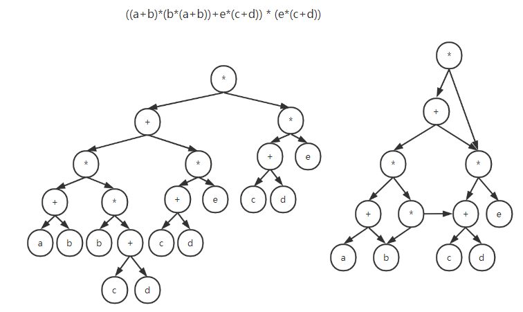

### 4.4.4 拓扑排序

>   在一个有向无环图的顶点组成的序列中
>
>   -   每个顶点出现且只出现一次
>   -   若顶点A在序列中排在顶点B前面，则在图中不存在B->A的路径

>   对有向无环图的一种排序，若存在一条顶点A到顶点B的路径，则在排序中顶点B出现在顶点A的后面。

#### 1. AOV

>   AOV(用顶点表示活动)：若用DAG表示一个工程，顶点表示活动，有向边 $$<v_i,v_j>$$ 表示活动 $$v_i$$ 必须先于活动 $$v_j$$ 发生的关系。

-   $$v_i$$ 是 $$v_j$$ 的直接前驱，$$v_j$$ 是 $$v_i$$ 的直接后继，具有传递性
-   任何活动 $$v_i$$ 都不能以自身作为前驱或者后继

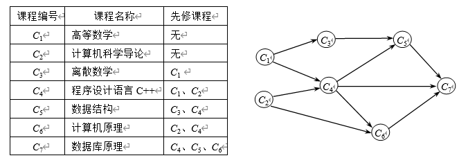

#### 2. 拓扑排序步骤

1.  每次从AOV中选一个没有前驱(入度=0)的顶点输出

2.  从AOV网中删除该顶点和以该顶点为起点的所有边

3.  重复 1. 2. 直至当前的AOV为空或当前网中不存在无前驱的顶点

    若AOV为空，则该图存在拓扑序列

    若AOV不空，则该图不存在拓扑序列

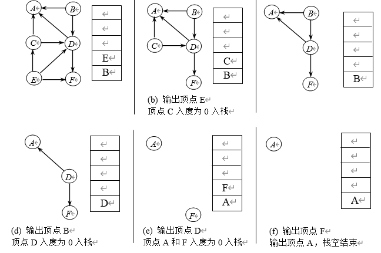

#### 3. 拓扑排序实现

```c
bool TopologicalSort(Graph G){
    InitStack(S);//初始化栈，存储入度为0的顶点
    for(int i = 0;i < G.vexnum;++i)
        if(indegree[i] == 0)
            Push(S,i);//将所有入度为0的顶点入栈
    
    int count = 0;//表示已经输出的顶点数
    while(!IsEmpty(S)){
        Pop(S,i);//栈顶元素出栈
        print[count++] = i;//输出顶点i
        for(p = G.vertices[i].firstarc;p;p = p->nextarc){
            //将所有i指向的顶点入度减1并将入度为0的顶点压栈
            v = p->adjvex;//v是p的邻接点
            if(!(--indegree[v]))
                Push(S,v);//入度为0则入栈
        }
    }
    if(count < G.vexnum)
        return false;//排序失败，有向图有回路
    else
        return true;//存在拓扑序列
}
```

-   时间复杂度：$$O(\|v\|+\|e\|)$$

-   入度为零的顶点，即没有前驱活动的或前驱活动全部完成的顶点，工程可以从这个顶点所代表的活动开始或继续
-   若一个顶点有多个直接后继，则拓扑序列不唯一
-   AOV网中各个顶点地位相同，故可重新编号，若是DAG则其邻接矩阵是三角矩阵

### 4.4.5 关键路径

#### 1. AOE

>   有向无环图中，顶点表示事件，有向边表示活动，边上权值表示完成该活动的开销。用边表示活动的图为AOE。

-   只有在顶点所代表的事件发生后，从该顶点出发的有向边代表的活动才能开始
-   只有在进入某顶点各有向边所代表的活动完成后，该顶点所代表的事件才能发生
-   AOE网中，只有一个入度为0的顶点（源点），表示整个工程开始；一个出度为0的顶点（汇点），表示整个工程结束

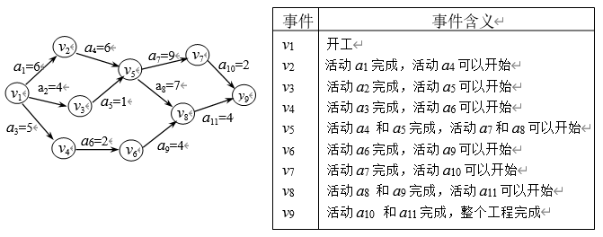

拓扑序列：$$v_1,v_2,v_3,v_4,v_5,v_5,v_6,v_7,v_8,v_9$$

#### 2. 关键路径

>   从源点到汇点的路径中，具有最大路径长度的路径；关键路径上的活动为关键活动

-   加快关键活动可以缩短整个工程的工期，但缩短到一定程度，关键活动会为非关键活动
-   若AOE网中关键路径不唯一，只有加快公共的关键路径上的关键活动，才能缩短工期

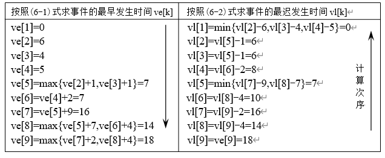

#### 3. 活动的最早开始时间最晚开始时间

活动最早开始时间 = 活动的起点事件最早开始时间

活动的最晚开始时间 = 活动的终点事件最晚开始时间-活动的时长

活动的最晚开始时间-活动的最早开始时间 = 0 的活动为关键活动

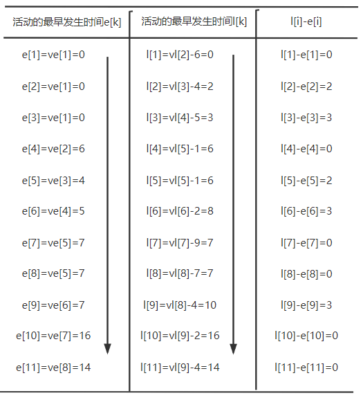

即关键路径为($$v_1,v_4,v_7,v_8,v_{10},v_{11}$$)

