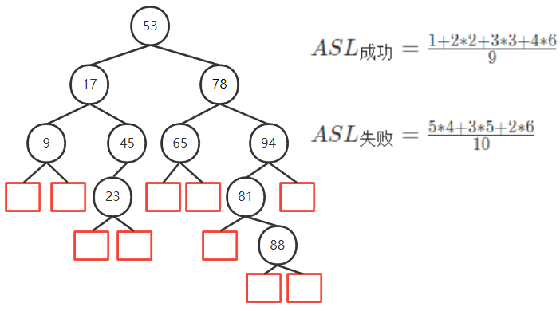

# 5. 查找

[TOC]

<div STYLE="page-break-after: always;"></div>


<div STYLE="page-break-after: always;"></div>

## 5.1 基本概念

>   关键字：表示待查找元素的某个数据项的值

-   基于关键字的查找，查找结果是唯一的

>   查找：在数据集合中寻找满足条件的元素过程

>   查找表（查找结构）：用于查找的数据集合

-   四种操作

    查找特定数据元素是否在表中；检索满足条件的某个特定数据元素的各属性；

    在查找表中插入一个数据元素；从查找表中删除某个数据元素

>   静态查找表：无需动态地插入或删除的查找表称为动态查找表

-   顺序查找表
-   折半查找表
-   散列查找

>   动态查找表：需要动态删除和查找的查找表

-   二叉排序树的查找
    -   二叉平衡树
    -   B树、B+树
-   散列查找

>   平均查找长度：所有查找过程中进行关键字的比较次数的平均值

$$
\begin{aligned}
p_i表示查找第i个元素的概率，&c_i表示查找第i个元素所需进行的比较次数\\
&ASL=\sum_{i=1}^{n}p_ic_i\\
\end{aligned}
$$

<div STYLE="page-break-after: always;"></div>

## 5.2 线性结构的查找

```c
typedef struct{
	ElemType *elem;//存储空间基址，0号单元留空
    int TableLen;//表的长度
}SSTable;
```

### 5.2.1 顺序查找

-   存储结构：顺序表；链表

-   扫描所有查找表每个元素的方式

    顺序表：下标递增

    链表：`next` 指针域
    
-   哨兵的作用：`SSTable.elem[0]` 设为哨兵，不必检查数组是否越界，`i=0` 一定会跳出循环

#### 1. 无序线性表的顺序查找

```c
int Search_Sq(SSTable ST,KeyType key){
    i = ST.TableLen;
    ST.elem[0] = key;//设置哨兵
    while(ST.elem[i] != key) i--;
    return i;
}
```


$$
\begin{aligned}
ASL_{成功}=\sum_{i=1}^{n}\frac{1}{n}(n-i-1)=\frac{n+1}{2}\\
ASL_{失败}=\sum_{i=1}^n\frac{n(n+1)}{n}=n+1
\end{aligned}
$$

**优点**

-   存储结构：顺序存储、链式存储
    -   链式结构只能顺序查找
-   对数据的有序性无要求

**缺点**

-   效率低

#### 2. 有序顺序表的顺序查找

```c
int Search_Sq(SSTable ST,KeyType key){
    i = ST.length;
    ST.elem[0] = key;
    while(ST.elem[i] < key)	i--;
    if(key == ST.elem[i])	return i;
    return 0;
}
```


$$
\begin{aligned}
ASL_{成功} = \sum_{i=1}^{n}\frac{1}{n}(n-i+1)=\frac{n+1}{2}\\
ASL_{不成功}=\sum_{i=1}^{n}q_il_i=\frac{1+2+...+n+n}{n+1}=\frac{n}{2}+\frac{n}{n+1}
\end{aligned}
$$

<div STYLE="page-break-after: always;"></div>

### 5.2.2 折半查找

适用情况：**有序的顺序表**


```c
int Binary_Search(SSTable L,ElemType key){
    int low,high = L.TableLen-1,mid;
    while(low < high){
        mid = (low+high)/2;
        if(L.elem[mid]==key)
            return mid;//查找成功则返回所在位置
        else if(L.elem[mid] > key)
            high = mid-1;//从前半部分继续查找
        else
            low = mid + 1;//从后半部分继续查找
    }
    return -1;//查找失败，返回-1
}
```

**查找失败**


$$
\begin{aligned}
ASL_{成功} = \frac{1*1+2*2+4*3+4*4}{11}=3\\
ASL_{失败}=\frac{3*4+4*8}{12}=\frac{11}{3}
\end{aligned}
$$

### 5.2.3 分块查找

>   将查找表分为若干块。**块内无序，块间有序**。
>
>   -   第一块最大关键字小于第二块最大关键字
>
>   索引表：索引表中存储每块的最大关键字和各块中的第一个关键字地址
>
>   -   索引表按关键字有序排列

**分块查找步骤**

1.  索引表中查找待查记录所在块

    顺序查找、折半查找索引表

2.  块内顺序查找


<div STYLE="page-break-after: always;"></div>

## 5.3 树型结构的查找

### 5.3.1 二叉排序树

```c
typedef struct TreeNode{	
    ElementType key;	
    struct TreeNode *parent,*left,*right;
}Node, *BST;
```

`p->lchild->data < p->data < p->rchild->data;`

-   中序遍历可以得到有序序列

#### 1. 构建


<div STYLE="page-break-after: always;"></div>

#### 2. 查找

```c
while(!T && key != T->data){
	if(key < T->data)
        T = T->lchild;
    else
        T = T->rchild;
}
```

一棵二叉排序树上的查找序列，第 n,n+1 个数不能分居第 n-1 个数的两侧如


#### 3. BST插入

查找过程中，不存在目标结点，再插入

新插入的结点一定是一个叶结点，且是查找失败时，查找路径上访问的最后一个结点的孩子

```c
void Insert(BST T,Node *p){	
    Node *x = T,*y = NULL;
    while(x != NULL){//查找目标结点		
        y = x;
        if(x->key > p->key)
            x = x->left;
        else
            x = x->right;
    }
    p->parent = y;
    if(y == NULL)//第一个结点	
        T = p;
    else if(y->key > p->key)//待插入结点值小于叶结点	
        y->left = p;	
    else//待插入结点值大于等于叶结点
        y->right = p;
}
```

#### 4. BST删除

BST中元素间的相对位置与BST中序序列中元素间的相对位置相同

1.  若删除结点 `p` 是叶结点，则直接删除
2.  若删除结点 `p` 是某单支树，则用其孩子结点代替
3.  若删除结点 `p` 有左右孩子
    -   用直接后继 `next` 代替，`p` 的左孩子变为 `next` 的左孩子，`p` 的右孩子变为 `next` 的最右左子树
    -   用直接前驱 `pre` 代替，`p` 的右孩子变为 `pre` 的右孩子，`p` 的左孩子变为 `pre` 的最左右子树


```c
void Transplant(BST T, Node *x, Node *y){// y替换x的位置
    if(x->parent == NULL)
        T = y;
    else if(x == x->parent->left)
        x->parent->left = y;
    else
        x->parent->right = y;
    if(y != NULL)
        y->parent = x->parent;
}

void Delete(BST T, Node *p){
    if(p->left == NULL)//p左子树空，则用其右孩子根结点代替p的位置
        Transplant(T, p, p->right);
    else if(p->right == NULL)//p的右子树为空，用其左孩子代替p的位置
        Transplant(T, p, p->left);
    else{//按上图第二种情况写，第一种类推
        Node *q = FindMin(p->right); //找p的最左右子树结点		
        
        
        if (q->parent != p){
            Transplant(T, q, q->right);
            q->right = p->right;
            q->right->parent = q;
        }
        Transplant(T, p, q);
        q->left = p->left;
        q->left->parent = q;
    }
}
```

#### 5. BST平均查找长度

**计算**



-   查找失败的情况相当于将 $$(-\infty,+\infty)$$ 用n个数分为 n+1 个区间

**最好情况** ASL = $$O(log_n)$$ 平衡二叉树

**最坏情况** ASL = $$O(n)$$ 单链表

#### 6. 二分查找与二叉排序树

1.  ASL相同

    -   二分查找判定树唯一

    -   BST是动态树，不唯一

        插入顺序不同，生成的BST不同


<div STYLE="page-break-after: always;"></div>

2.  区别

|          | 类型       | 存储结构   | 构建时间复杂度 |
| -------- | ---------- | ---------- | -------------- |
| 二分查找 | 静态查找表 | 有序顺序表 | $$O(n)$$       |
| BST      | 动态查找表 | 修改指针   | $$O(log_2n)$$  |

### 5.3.2 平衡二叉树

>   见 3-树.pdf   \3.2.6 二叉树的应用\2. 平衡二叉树

### 5.3.3 B树

>   多路平衡查找树

#### 1. 特点

1.  每个结点最多 $$m-1$$ 个关键字，最少 $$\lceil \frac{m}{2} \rceil-1 $$ 个关键字，即每个结点最少$$\lceil \frac{m}{2} \rceil$$ 个分叉

    m阶B树为m叉树

    如：5叉B树，每个结点最多有4个关键字，最少有2个关键字

2.  任一结点，其子树高度必须相等

    -   所有查找失败结点作为叶子结点出现在同一层，并且不带任何信息

    -   n个关键字必有 n+1 个叶子结点

        在区间 $$(-\infty,+\infty)$$ 间插入 n 个数据，分为 n+1 个查找失败区间，即有 n+1 个叶子结点

3.  非叶结点关键字有序 $$k_1<k_2<...<k_n$$ ，结点内可使用折半查找关键字

4.  若关键字 $$k_{i-1}$$ 与关键字 $$k_{i+1}$$ 间有一分叉，则该分叉子树数据值区间为 $$(k_{i-1},k_{i+1})$$

<div STYLE="page-break-after: always;"></div>


**n个结点的B树高度**

1.  最小高度

    每个结点尽可能满 m-1 个关键字，m个分叉

    $$(m-1)(1+m+m^2+...+m^{h-1})=(m-1)\frac{1-m^h}{1-m}=m^h-1 \Longrightarrow h\ge log_m(n+1)$$

2.  最大高度

    各层分叉尽可能少，除第一二层其他层结点 $$\lceil \frac{m}{2} \rceil$$
    
    $$
    \begin{cases}
    &第一层 &1\\
    &第二层&2\\
    &第三层&2\lceil \frac{m}{2} \rceil\\
    &...\\
    &第h层&2\lceil \frac{m}{2} \rceil^{h-2} \\
    &叶子层&2\lceil \frac{m}{2} \rceil^{h-1}\\
    &第h+1层&n+1 \ge 2\lceil \frac{m}{2} \rceil^{h-1} \Longrightarrow h\le log_{\lceil \frac{m}{2} \rceil} \frac{n+1}{2}+1
    \end{cases}
    $$

#### 2. 基本操作

##### 插入

**要求**

1.  除根结点，每个结点关键字个数 $$\lceil \frac{m}{2} \rceil -1 \le n \le m-1$$ 
2.  $$子树0上的关键字 <k_1 < k_2 < ... < k_{m-1}<子树1上的关键字$$ 

**步骤**

1.  新元素插入后在最底层 “终端结点”，动态确定插入位置

2.  插入结点后，若 $$结点关键字个数 > m-1$$ ，则从中间位置 $$\lceil \frac{m}{2} \rceil$$ 处分裂为两部分

    $$\lceil \frac{m}{2} \rceil$$ 右面部分形成一个新结点

    $$\lceil \frac{m}{2} \rceil$$ 处关键字加入父结点的关键字，若此行为造成父结点关键字个数 > m-1，则父结点继续分裂，B树高度加一


##### 删除

1.  对非终端结点关键字删除必可转化为对终端结点的删除
    
    $$
    替换原关键字
    \begin{cases}
    直接前驱:左子树最右下\\
    直接后继:右子树最左下
    \end{cases}
    $$

2.  删除后，本结点关键字个数不够 $$\lceil \frac{m}{2} \rceil$$ 
    
    $$
    \begin{cases}
    借右兄弟&用直接后继填补空缺\\
    借左兄弟&用直接前驱填补空缺
    \end{cases}
    $$
    
    

3.  兄弟不够借
    
    $$
    当前结点与左(或右)兄弟及夹在中间的双亲结点关键字合并
    $$
    
    

<div STYLE="page-break-after: always;"></div>

### 5.3.4 B+树

>   m叉B+树最多m个子树，m个结点最多m+1个


#### 1. 特点

1.  每个分支结点最多 m 个子树

    m叉B+树m个子树，每个结点有m个关键字

2.  非叶根结点，至少有两棵子树，其余分支结点有 $$\lceil \frac{m}{2} \rceil$$ 个子树

3.  所有叶结点包含全部关键字及指向相应记录的指针

    相邻叶结点按关键字大小顺序排列

4.  所有非叶分支结点仅包含其子结点的最大关键字值及指针(指向叶结点)

#### 2. 查找

>   无论查找成功失败，都走到最下一层叶结点

1.  分块查找
2.  按叶结点顺序查找

#### 3. B+树与文件系统关系

-   索引块以块为单位存放在磁盘，内存每次以块为单位读写

-   树越高，读/写 IO次数越多，速度越慢

    尽可能使文件系统的树矮，使每个结点包含更多结点

### 5.3.5 B树与B+树的对比

| B树                                                          | B+树[分块查找]                                               |
| ------------------------------------------------------------ | ------------------------------------------------------------ |
| m个关键字m+1棵子树                                           | m个关键字m棵子树                                             |
| 根结点关键字数 $$n\in [1,m-1]$$<br />其他结点 $$n \in [\lceil \frac{m}{2} \rceil-1,m-1]$$ | 根结点关键字数 $$n \in [1,m]$$<br />其他结点 $$n \in [\lceil \frac{m}{2} \rceil ,m ]$$ |
| 叶结点都在同一层，表示查找失败结点                           | 叶包含所有关键字                                             |
| 各结点关键字不重复，每个结点都含记录存储地址                 | 非叶结点关键字是叶结点关键字副本，非叶结点仅起索引作用，指针指向含该最大值的子树 |

<div STYLE="page-break-after: always;"></div>

## 5.4 散列结构的查找

### 5.4.1 基本概念

散列表：建立关键字和存储地址之间的一种直接映射关系

散列函数：把查找表中的关键字映射为该关键字逻辑地址的函数

-   Addr = Hash(key)

冲突：一个散列函数会把多个关键字映射到同一地址上

-   同义词：发生碰撞的不同关键字为同义词

### 5.4.2 散列函数的构造

#### 1. 直接定址法

$$H(key) = key $$ 或 $$H(key) = a*key+b$$

适用于关键字基本连续

#### 2. 除留取余法

$$H(key)=key\%p$$ 

>   m 为散列表长，p为不大于m的最大质数

#### 3. 数字分析法

>   关键字是r进制数，r个数码在各数位上出现的频率不同，故选取数码分布较均匀的位作为散列地址

适合已知的关键字集合

#### 4. 平方取中法

>   取关键字的平方值的中间几位作为散列地址

散列地址与关键字的每位都有关，因此散列地址分布比较均匀

### 5.4.3 处理冲突的方法

#### 1. 开放定址法

$$
H_i=(H(key)+d_i)\%m
$$

1.  线性探测法

    $$d_i=1,2,...,k(k \le m-1)$$

    造成同义词 ==聚集== 在相邻的散列地址，大大降低查找效率

    

2.  平方探测法

    $$d_i=0^2,1^2,-1^2,2^2,-2^2,...,k^2,-k^2(k\le \frac{m}{2})$$

    m必须是一个可以表示为 4k+3 的素数

    -   避免出现 ==堆积问题== 
    -   不能探测散列表所有单元，但至少探测一半

    

3.  再散列法

    $$H_i = (H(key)+i*Hash_2(key))\%m$$

    $$初始探测位置H_0=H(key)\%m$$ ，i是冲突次数，初始为0

    最多经历 m-1 次探测就会遍历表中所有位置，回到 $$H_0$$ 

4.  伪随机数法

    $$d_i=伪随机数序列$$

#### 2. 拉链法

同义词以链表形式链接到同一单元后


### 5.4.4 散列查找和性能分析

#### 1. 平均查找长度

1.  开放定址法

$$
\begin{cases}
& ASL_{成功}=\frac{1}{元素个数n}\sum_{i=1}^n查找a_i的长度\\
&ASL_{失败}=\frac{1}{除数+1}\sum_{i=1}^{n}a_i距其右方第一个空位长度
\end{cases}
$$


2.  拉链法

$$
\begin{cases}
ASL_{成功}=\frac{1}{元素个数n}\sum_{i=1}^{n}a_i到表头距离\\
ASL_{失败}=\frac{1}{除数+1}\sum_{i=1}^{n}a_i到表尾距离
\end{cases}
$$


#### 2. 性能分析

>   装填因子

$$
\begin{aligned}
装填因子\alpha=\frac{n}{m}=\frac{已装入元素个数}{哈希表长}\\
ASL=\frac{1}{2}(1+\frac{1}{1-\alpha})
\end{aligned}
$$

-   装填因子相关因素：散列函数、冲突解决策略、装填因子
-   平均查找长度与 $$\alpha$$ 直接相关，不与表中元素数相关

#### 3. 散列表删除某个元素

拉链法：物理删除

开放定址法：待删除位置打标记

-   查找时遇到标记为删除的地址，表示查找失败