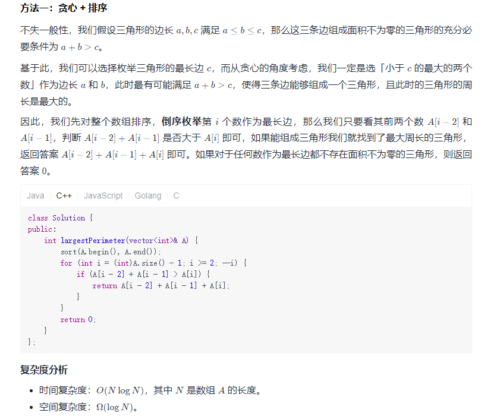

# 0. 编程能力

## 0.1 基本数据类型

### 1523.在区间范围内统计奇数数目

奇数，第一反应是 `n%2==1` ,所以直接写成下面代码，结果超时。计算除法的代价显然比加减法大得多

```c++
class Solution {
public:
    int countOdds(int low, int high) {
        int cnt=0;
        for(int i=low;i <= high;++i)
            if(i % 2==1)
                cnt++;

    return cnt;
    }
};
```

又想整数，一定是 **奇、偶、...** 或 **偶、奇...**

所以已经给定区间范围，[左,右]，右-左= (左,右] 或 [左,右) 包含的整数个数，折半则为奇数个数

且分为以下情况

1.  [奇,奇]
2.  [奇,偶]
3.  [偶,奇]
4.  [偶,偶]

故需判断一侧边界是否为奇数，若其为奇数，则个数加1。由于闭区间的对称性，两侧都要判断，且左右判别式间关系为或。

```c++
class Solution {
public:
    int countOdds(int low, int high) {
        int cnt=0;
        if(low % 2==1  || high%2==1)
            cnt=1;
        cnt += (high-low)/2;

        return cnt;
    }
};
```

#### 前缀和思想

pre(x)为区间 $$[0,x]$$ 内奇数个数，显然 $$pre(x)=\lfloor \frac{x+1}{2} \rfloor$$ ,故区间[low,high]内奇数个数为 pre(high)-pre(low-1)

**计算机中乘除法运算没有移位运算快**

```c++
class Solution {
public:
    int pre(int x) {
        return (x + 1) >> 1;
    }
    
    int countOdds(int low, int high) {
        return pre(high) - pre(low - 1);
    }
};
```

**判断奇偶的方法**：`x&1` 

### 1491. 去掉最低工资和最高工资后的工资平均值

第一想法，简单选择，一轮遍历，以为会超时竟然过了。

```c++
class Solution {
public:
    double average(vector<int>& salary) {
        double min = salary[0];
        double max = salary[0];
        double sum = 0;
        for(int i = 0;i < salary.size();++i){
            if(min > salary[i])
                min = salary[i];
            if(max < salary[i])
                max = salary[i];
            sum += salary[i];
        }
        return (sum-min-max)/(salary.size()-2);
    }
};
```

-   因为是新手村的入门题，甚至连数据都是唯一的，非常友好了。

答案想法类似，只是用了 **容器** 的内置方法寻找最值

-   `algorithm` 库的 `max_element()、min_element()` 返回容器中最小值和最大值的 **指针**
-   `numeric` 库的 `accumulate(起点,终点,权值)` ：直接计算数组或者容器中C++内置数据类型

```c++
#include<algorithm>//max_element()、min_element()
# include<numeric>

class Solution {
public:
    double average(vector<int>& salary) {
        double maxValue = *max_element(salary.begin(), salary.end());
        double minValue = *min_element(salary.begin(), salary.end());
        double sum = accumulate(salary.begin(), salary.end(), - maxValue - minValue);
        return sum / int(salary.size() - 2);
    }
};

作者：LeetCode-Solution
链接：https://leetcode-cn.com/problems/average-salary-excluding-the-minimum-and-maximum-salary/solution/qu-diao-zui-di-gong-zi-he-zui-gao-gong-zi-hou-de-4/
来源：力扣（LeetCode）
著作权归作者所有。商业转载请联系作者获得授权，非商业转载请注明出处。
```

## 0.2 运算符

### 191. 位1的个数

第一想法是位运算，结合上面奇数的判断方法 `n&1==1` ，则当前位为1，故1的个数加1。因为输入的二进制字符串长度不变呢，所以右移位数确定，循环判断条件也可是 `for(int i = 0;i < 32;++i)` 

```c++
class Solution {
public:
    int hammingWeight(uint32_t n) {
        int cnt = 0;
        while(n){
            if(n&1)
                cnt++;
            n>>=1;//右移一位
        }

        return cnt;
    }
};
```

-   本题一开始卡在右移， `n>>1` 忘写赋值符号 `n>>=1` 导致死循环，判别为超时

答案的第一种做法和上述类似，只是移位方向不同，第一想法是1不动，数字右移，答案第一种是数字不动，用1左移。

```c++
class Solution {
public:
    int hammingWeight(uint32_t n) {
        int ret = 0;
        for (int i = 0; i < 32; i++) {
            if (n & (1 << i)) {
                ret++;
            }
        }
        return ret;
    }
};

作者：LeetCode-Solution
链接：https://leetcode-cn.com/problems/number-of-1-bits/solution/wei-1de-ge-shu-by-leetcode-solution-jnwf/
来源：力扣（LeetCode）
著作权归作者所有。商业转载请联系作者获得授权，非商业转载请注明出处。
```

方法二：

这个真想不出来：n&(n - 1)，其运算结果恰为把 n 的二进制位中的最低位的 1 变为 0 之后的结果

 就是说 

11111111111111111111111111111111 & 11111111111111111111111111111110 变为 11111111111111111111111111111110

11111111111111111111111111111110 & 11111111111111111111111111111101 变为 11111111111111111111111111111100

```c++
class Solution {
public:
    int hammingWeight(uint32_t n) {
        int ret = 0;
        while (n) {
            n &= n - 1;
            ret++;
        }
        return ret;
    }
};

作者：LeetCode-Solution
链接：https://leetcode-cn.com/problems/number-of-1-bits/solution/wei-1de-ge-shu-by-leetcode-solution-jnwf/
来源：力扣（LeetCode）
著作权归作者所有。商业转载请联系作者获得授权，非商业转载请注明出处。
```

-   真值的二进制为logn,故时间复杂度为logn

### 1281. 整数的各位积和之差

求每个数位上的数字

```c++
class Solution {
public:
    int subtractProductAndSum(int n) {
        int product = 1;
        int sum = 0;
        while(n){
            int a = n%10;
            sum += a;
            product *= a;
            n/=10;
        }
        return product-sum;
    }
};
```

时间复杂度：$$O(logN)$$ 由于整数N的位数为 $$\lceil log_{10}N = \frac{log_2{N}}{log_210} \rceil$$ 即相差常数，故数量级为O(logN)

空间复杂度：O(1)

## 0.3 条件语句

### 976. 三角形的最大周长

最初考虑只有三个元素

```c++
class Solution {
public:
    int largestPerimeter(vector<int>& nums) {
        sort(nums.begin(),nums.end());//122 112
        if(nums[0]+nums[1] <= nums[2] || nums[2]-nums[0] >= nums[1])
            return 0;
        return accumulate(nums.begin(),nums.end(),0);
    }
};
```


显然想简单了

**排序+贪心**，从数组尾部开始逆序遍历，若找到可以构成三角形的，则直接输出其周长，若迭代器回到 `nums.begin()+1` 都不能构成三角形，则返回0

```c++
class Solution {
public:
    int largestPerimeter(vector<int>& nums) {
        sort(nums.begin(),nums.end()); 
        vector<int>::iterator it = nums.end()-1;
        
        while(it != nums.begin()+1){
            if(*it-*(it-2) < *(it-1) && *(it-2)+*(it-1) > *it)
                return accumulate(it-2,it+1,0);
            it--;
        }    
        return 0;
    }
};
```


显然效率不够高。还是看答案



这么一看咱思想还是跟的上的。

### 1779. 找到最近的有相同 X 或 Y 坐标的点

就一些数学库函数的运用，在设置 `min` 时，一开始用 $$10^4$$ 不对，以下示例会出错


```c++
class Solution {
public:
    int nearestValidPoint(int x, int y, vector<vector<int>>& points) {
        int min = INT_MAX;
        int idx=-1;
        for(int i = 0;i < points.size();++i){
            if(points[i][0]==x || points[i][1]==y){
                if(min > abs(x-points[i][0])+abs(y-points[i][1])){
                    min = abs(x-points[i][0])+abs(y-points[i][1]);
                    idx = i;
                }
            }
        }
        return idx;
    }
};
```

## 0.4 循环

### 1822. 数组元素积的符号

看完题，发现其返回只有 `-1/0/1` 三种，那就分三种情况

-   有0，一定是0
-   负数个数是偶数，则1
-   负数个数是奇数，则-1

```c++
class Solution {
public:
    int arraySign(vector<int>& nums) {
        if(find(nums.begin(),nums.end(),0) != nums.end())
            return 0;//如果有0，则product与符号一定是0
        vector<int>::iterator it = nums.begin();
        int negative = 0;
        while(it != nums.end()){
            if(*it<0)
                negative++;
            it++;
        }
            
        if(negative&1)
            return -1;
        else
            return 1;
    }
};
```

另一种思路是逢-1变号

```c++
class Solution {
 public:
     int arraySign(vector<int>& nums) {
         int sign = 1;
         for (int n : nums) {
             if (n == 0) return 0;
             if (n < 0) {
                sign *= -1;
             }
         }
         return sign;
     }
 };
```

### 1502. 判断能否形成等差数列

等差数列，就是每两个之间步长是相等的，排序后遍历一次，若发现有不相等的步长，则返回 `false` ，若可遍历到尾部，则返回 `true`

```c++
class Solution {
public:
    bool canMakeArithmeticProgression(vector<int>& arr) {
        sort(arr.begin(),arr.end());
        int step = arr[1]-arr[0];
        for(int i = 1;i < arr.size()-1;++i)
            if(arr[i+1]-arr[i]!=step)
                return false;
        return true;
    }
};
```

答案是利用等差数列相邻三项间的和的性质，但。。。加减法效率不应该比乘法效率高吗

```c++
class Solution {
public:
    bool canMakeArithmeticProgression(vector<int>& arr) {
        sort(arr.begin(), arr.end());
        for (int i = 1; i < arr.size() - 1; ++i) {
            if (arr[i] * 2 != arr[i - 1] + arr[i + 1]) {
                return false;
            }
        }
        return true;
    }
};
```

### 202. 快乐数

**递归+归纳**

-   终止条件

递归思想要解决的第一个问题是终止条件是什么，即什么情况下不是快乐数

我的做法是已知1一定是快乐数，返回`true`

最开始想法是 `n<10` ，将1剔除出去，剩下的返回 `false`。但是运行后，有实例没通过(7)

故将10以内的数挨个计算，最后只有 1 和 7 满足快乐数的要求

-   递归内运算  

求出各位数字后平方求和，再调用递归函数

```c++
class Solution {
public:
    bool isHappy(int n) {
        if(n==1 || n==7)
            return true;
        if(n < 10)
            return false;
        int sum = 0;
        while(n){
            sum += pow(n%10,2);
            n /= 10;
        }

        return isHappy(sum);
    }
};
```

#### 参考答案

##### 集合元素的唯一性

若元素是快乐数，则经过运算，最后都会变为1

若元素不是快乐数，则经过运算，会进入循环，即运算过程中的数字会再次出现。

所以利用集合中元素的唯一性，将运算过程中的数字放入一个集合，若无法放入，说明已经有循环，则返回 `false`。若出现1，则返回 `true`

```c++
class Solution {
    int getNext(int n) {
        int totalSum = 0;
        while (n > 0) {
            int d = n % 10;
            n = n / 10;
            totalSum += d * d;
        }
        return totalSum;
    }
public:
    bool isHappy(int n) {
        set<int> s;
        while (n != 1 && s.find(n) == s.end()) {
            s.insert(n);
            n = getNext(n);
        }
        return n == 1;
    }
};
```

##### 快慢指针法

>   思想：将运算过程中的数，抽象为单链表的结点。若单链表有环，则说明运算过程重复，不是快乐数；若无环，说明是快乐数

判断单链表是否有环的方法：**快慢指针**

-   初始化快慢指针
-   快指针转换两次，慢指针转换一次
-   当快指针==慢指针时，说明有环
    -   此时，当慢指针==1，说明是1的无限环，是快乐数
    -   而慢指针!=1，说明不是快乐数

```c++
class Solution {
    int getNext(int n) {
        int totalSum = 0;
        while (n > 0) {
            int d = n % 10;
            n = n / 10;
            totalSum += d * d;
        }
        return totalSum;
    }

public:
    bool isHappy(int n) {
        int slowRunner = n;
        int fastRunner = getNext(n);
        while (fastRunner != 1 && slowRunner != fastRunner) {
            slowRunner = getNext(slowRunner);
            fastRunner = getNext(getNext(fastRunner));
        }
        return fastRunner == 1;
    }
};

作者：LeetCode-Solution
链接：https://leetcode-cn.com/problems/happy-number/solution/kuai-le-shu-by-leetcode-solution/
来源：力扣（LeetCode）
著作权归作者所有。商业转载请联系作者获得授权，非商业转载请注明出处。
```

### 1790. 仅执行一次字符串交换能否使两个字符串相等

-   长度不同，则交换一次必不能相等

-   若本来相等，则返回 `true`

-   长度相等且字符串不等，字符串逐字符遍历

    -   字符第一次不等，记录

        **漏掉的情况**：只有第一次不等，也需返回 `false` 

        -   aa 与 ac 就是上面的情况

    -   字符第二次不等，若与第一个不等位置交换后相等，则返回 `true`

    -   若字符第三次不等，则返回 `false`

```c++
class Solution {
public:
    bool areAlmostEqual(string s1, string s2) {
        if(s1.size()!=s2.size())
            return false;//长度不等必不成立
        if(s1==s2)
            return true;
        
        int beg=-1,end=s2.size();
        for(int i = 0;i < s2.size();++i){
            if(beg==-1 && s2[i]!=s1[i]){
                beg = i;//第一次不等
            }
            else if(end==s2.size() && s2[i]!=s1[i]){
                end=i;
                if(s2[end]==s1[beg]&&s2[beg]==s1[end])
                    continue;
                else
                    return false;
            }//第二次不等
            else if(beg != -1 && end != s2.size()  && s2[i]!= s1[i])
                return false;//还有不等
        }

        if(beg != -1 && end == s2.size())
            return false;//"aa"与"ac"的情况

        return true;
    }
};
```

其他思路：

>   构成两个字符串的字符即其出现的次数应该相同，并且最多只会出现两个位置的字符不同

涉及到**频次**相关的问题，考虑采用**哈希表**去做。由于题目已提示 s1 和 s2 **仅由小写英文字母**组成，因此可以采用**长度为 26 的整型数组模拟哈希表**。

```c++
class Solution {
public:
    bool areAlmostEqual(string s1, string s2) {
        int cnt = 0;
        int hash[26] = {0};
        int len = s1.size();
        for (int i = 0; i < len; ++i) {//记录字符串中各字符出现的频次
            hash[s1[i] - 'a']++;
        }

        for (int i = 0; i < len; ++i) {//如果某个字符出现次数是1，则不成立
            if (hash[s2[i] - 'a'] == 1) {
                return false;
            }
        }   

        for (int i = 0; i < len; ++i) {
            if (s1[i] != s2[i]) {
                cnt++;//只有两个字符不等，则一次交换就可成功。才是true
            }
        }
		//若超过两个字符不相等，则必不成立
        return cnt == 2 || cnt == 0;
    }
};
```

## 0.5 函数

### 1232. 缀点成线

基本思路：找出一个线性关系，若所有点都满足该线性关系，则返回 `true` ,否则返回 `false`

```c++
class Solution {
public:
    bool checkStraightLine(vector<vector<int>>& coordinates) {
        //求直线方程
        double k = (coordinates[0][1]-coordinates[1][1])/(coordinates[0][0]-coordinates[1][0]);
        double b = coordinates[0][1] - k*coordinates[0][0];

        //遍历，是否中间有点不在直线上
        for(int i = 1;i < coordinates.size();++i){
            if(coordinates[i][1] != k*coordinates[i][0]+b)
                return false;
        }

        return true;
    }
};
```

报错原因：除零错误 

[[0,0],[0,1],[0,-1]]

```c++
class Solution {
public:
    bool checkStraightLine(vector<vector<int>>& coordinates) {
        //当斜率无穷大时
        if(coordinates[0][0]-coordinates[1][0]==0){
            //若某一点横坐标值不相等，则不是一条直线
            for(int i = 2;i < coordinates.size();++i){
                if(coordinates[i][0] != coordinates[0][0])
                    return false;
            }
        }else{
            //求直线方程
            double k = (coordinates[0][1]-coordinates[1][1])/(coordinates[0][0]-coordinates[1][0]);
            double b = coordinates[0][1] - k*coordinates[0][0];

            //遍历，是否中间有点不在直线上
            for(int i = 1;i < coordinates.size();++i){
                if(coordinates[i][1] != k*coordinates[i][0]+b)
                    return false;
            }
        }

        return true;
    }
};
```

还是有错

[[2,1],[4,2],[6,3]] 预期结果 `true`

原因：整型除法会截取整数结果，最后在转化为double

比如 `(double)(1/2)=double(0) = 0` 显然是错误的，正确做法是给分母或分子强制转化为浮点数类型，这样二元运算过程中，会将另一小范围数值转化为浮点数类型，使得最后结果为浮点数类型

如 `(double)1/2=1.0/2.0=0.5` 

```c++
class Solution {
public:
    bool checkStraightLine(vector<vector<int>>& coordinates) {
        //当斜率无穷大时
        if(coordinates[0][0]-coordinates[1][0]==0){
            //若某一点横坐标值不相等，则不是一条直线
            for(int i = 2;i < coordinates.size();++i){
                if(coordinates[i][0] != coordinates[0][0])
                    return false;
            }
        }else{
            //求直线方程
            double k = (double)(coordinates[0][1]-coordinates[1][1])/(coordinates[0][0]-coordinates[1][0]);
            double b = coordinates[0][1] - k*coordinates[0][0];
            //遍历，是否中间有点不在直线上
            for(int i = 1;i < coordinates.size();++i){
                if(coordinates[i][1] != k*coordinates[i][0]+b)
                    return false;
            }
        }

        return true;
    }
};
```

为避免 **除0问题** 和 **精度问题** 。将除法转化为乘法
$$
将判别式 \frac{y-y_0}{x-x_0}==\frac{y_1-y_0}{x_1-x_0}，变为(y_1-y_0)*(x-x_0)==(x_1-x_0)(y-y_0)
$$

```c++
class Solution {
public:
    bool checkStraightLine(vector<vector<int>>& coordinates) {
        int len=coordinates.size();

        double dy=coordinates[0][1]-coordinates[1][1];
        double dx=coordinates[0][0]-coordinates[1][0];
        for(int i=2;i<len;i++)
        {
            double x=coordinates[i][0]-coordinates[0][0];
            double y=coordinates[i][1]-coordinates[0][1];
           if(x*dy!=y*dx)      
               return false;
        }
        return true;
    }
};

作者：sui-yi-fan-che
链接：https://leetcode-cn.com/problems/check-if-it-is-a-straight-line/solution/cxie-lu-zhuan-hua-wei-cheng-fa-de-jian-d-4qlr/
来源：力扣（LeetCode）
著作权归作者所有。商业转载请联系作者获得授权，非商业转载请注明出处。
```

### 496. 下一个更大元素 I

二重循环，暴力破解

```c++
class Solution {
public:
    vector<int> nextGreaterElement(vector<int>& nums1, vector<int>& nums2) {
        vector<int> hash(nums1.size(),-1);

        for(int i=0;i < nums1.size();++i){
            vector<int>::iterator it = find(nums2.begin(),nums2.end(),nums1[i]);
            
            if(it != nums2.end()-1){
                for(vector<int>::iterator ij = it+1;ij != nums2.end() ;++ij){
                    if(*(ij) > nums1[i]){
                        hash[i] = *ij;
                        break;
                    }  
                }
            }
        }
        
        return hash;
    }
};
```

时间复杂度：O(m*n)

乘法阶的时间复杂度来源于每一轮都要查找nums2中的每个元素，若提前对nums2中元素进行O(m)处理，得到nums2中每个元素的目标元素，则整个算法的时间复杂度变为两轮遍历的时间复杂度O(m+n)

#### 求下一个更大的元素(单调栈+哈希表)

-   从右向左遍历：因要求的是从左到右的第一个，所以预处理时，从右向左处理，最后处理的元素即为最左元素

-   用单调栈中维护当前位置右边的更大的元素列表
-   每次我们移动到数组中一个新的位置 ii，就将当前单调栈中所有小于 nums2[i] 的元素弹出单调栈，当前位置右边的第一个更大的元素即为栈顶元素

凡是求最近最XX的元素都可以用单调栈+哈希表实现

```c++
class Solution {
public:
    vector<int> nextGreaterElement(vector<int>& nums1, vector<int>& nums2) {
        /*单调栈+哈希表预处理*/
        unordered_map<int,int> hashmap;
        stack<int> st;
        for (int i = nums2.size() - 1; i >= 0; --i) {
            int num = nums2[i];
            while (!st.empty() && num >= st.top()) {
                st.pop();
            }
            hashmap[num] = st.empty() ? -1 : st.top();
            st.push(num);
        }

        //运算过程
        vector<int> res(nums1.size());
        for (int i = 0; i < nums1.size(); ++i) {
            res[i] = hashmap[nums1[i]];
        }
        return res;
    }
};
```

#### Next Greater Element模板

给你一个数组 [2,1,2,4,3]，你返回数组 [4,2,4,-1,-1]


这个问题可以这样抽象思考：把数组的元素想象成并列站立的人，元素大小想象成人的身高。这些人面对你站成一列，如何求元素「2」的 Next Greater Number 呢？很简单，如果能够看到元素「2」，那么他后面可见的第一个人就是「2」的 Next Greater Number，因为比「2」小的元素身高不够，都被「2」挡住了，第一个露出来的就是答案。

```c++
vector<int> nextGreaterElement(vector<int>& nums) {
    vector<int> ans(nums.size()); // 存放答案的数组
    stack<int> s;
    for (int i = nums.size() - 1; i >= 0; i--) { // 倒着往栈里放
        while (!s.empty() && s.top() <= nums[i]) { // 判定个子高矮
            s.pop(); // 矮个起开，反正也被挡着了。。。
        }
        ans[i] = s.empty() ? -1 : s.top(); // 这个元素身后的第一个高个
        s.push(nums[i]); // 进队，接受之后的身高判定吧！
    }
    return ans;
}
```

### 589. N 叉树的前序遍历

一开始以为要建树，想复杂了,所以直接看了答案，就是先序遍历的非递归实现

```c++
/*
// Definition for a Node.
class Node {
public:
    int val;
    vector<Node*> children;

    Node() {}

    Node(int _val) {
        val = _val;
    }

    Node(int _val, vector<Node*> _children) {
        val = _val;
        children = _children;
    }
};
*/

class Solution {
public:
    vector<int> preorder(Node* root) {
        vector<int> ans;
        if(root == NULL)
            return ans;

        stack<Node *> s;
        s.push(root);
        
        while(!s.empty()){
            Node *p = s.top();
            ans.push_back(p->val);
            s.pop();
            reverse(p->children.begin(),p->children.end());
            for(int i = 0;i < p->children.size();++i)
                s.push(p->children[i]);
        }

        return ans;
    }
};
```

附上递归做法

```c++
/*
// Definition for a Node.
class Node {
public:
    int val;
    vector<Node*> children;

    Node() {}

    Node(int _val) {
        val = _val;
    }

    Node(int _val, vector<Node*> _children) {
        val = _val;
        children = _children;
    }
};
*/

class Solution {
public:
    void Traverse(Node *root,vector<int> &ans){
        ans.push_back(root->val);
        for(Node *p:root->children)
            Traverse(p,ans);
    }

    vector<int> preorder(Node* root) {
        vector<int> ans;
        if(root == NULL)
            return ans;
        Traverse(root,ans);
        
        return ans;
    }
};
```

