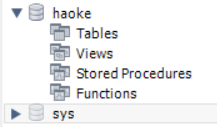
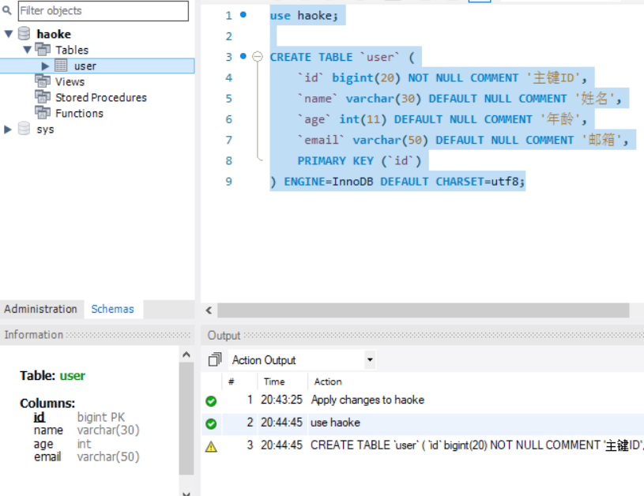
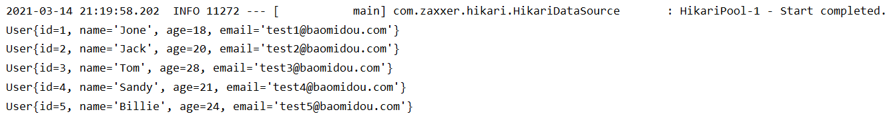
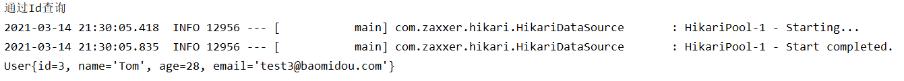
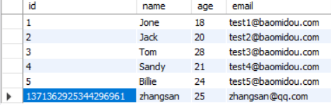
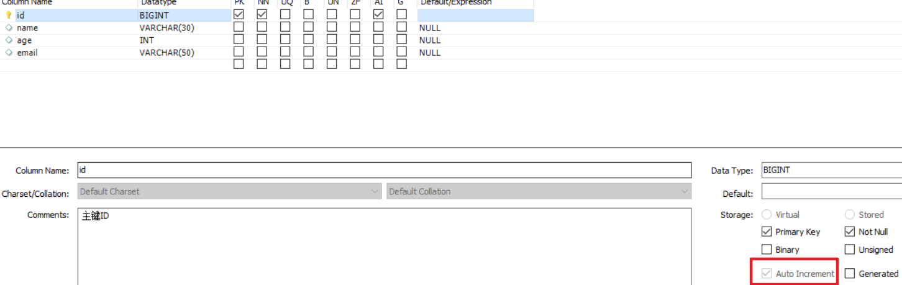

# MyBatisPlus

ORM层使用MyBatis框架作为持久层框架

使用MyBatisPlus作为Mybatis插件

## 简介

在MyBatis基础上，只做增强不做改变，为简化开发、提高效率而生

**特性：**

-   无侵入
-   损耗小：启动即会自动注入基本 CURD，性能基本无损耗，直接面向对象操作  
-   CRUD：内置通用 Mapper、通用 Service  
-   支持主键自动生成 
-   支持 XML 热加载  ：Mapper 对应的 XML 支持热加载，对于简单的 CRUD 操作，甚至可以无 XML 启动  
-   支持 ActiveRecord 模式
-   支持自定义全局通用操作：支持全局通用方法注入  
-   内置代码生成器  ：采用代码或者 Maven 插件可快速生成 Mapper 、 Model 、 Service 、 Controller 层代码，支持模板引擎
-   内置分页插件 、性能分析插件
-   全局拦截(提供全表 delete 、 update 操作智能分析阻断，也可自定义拦截规则，预防误操作)
-   内置 Sql 注入剥离器：支持 Sql 注入剥离，有效预防 Sql 注入攻击  

## 架构


通过简单语句，生成SQL语句，交给MyBatis执行

## 快速入门

### 创建表

创建数据库 haoke



```sql
use haoke;

CREATE TABLE `user` (
	`id` bigint(20) NOT NULL AUTO_INCREMENT COMMENT '主键ID',
	`name` varchar(30) DEFAULT NULL COMMENT '姓名',
	`age` int(11) DEFAULT NULL COMMENT '年龄',
	`email` varchar(50) DEFAULT NULL COMMENT '邮箱',
	PRIMARY KEY (`id`)
) ENGINE=InnoDB DEFAULT CHARSET=utf8;

-- 插入数据
INSERT INTO `user` (`id`, `name`, `age`, `email`) VALUES ('1', 'Jone', '18','test1@baomidou.com');
INSERT INTO `user` (`id`, `name`, `age`, `email`) VALUES ('2', 'Jack', '20','test2@baomidou.com');
INSERT INTO `user` (`id`, `name`, `age`, `email`) VALUES ('3', 'Tom', '28','test3@baomidou.com');
INSERT INTO `user` (`id`, `name`, `age`, `email`) VALUES ('4', 'Sandy', '21','test4@baomidou.com');
INSERT INTO `user` (`id`, `name`, `age`, `email`) VALUES ('5', 'Billie', '24','test5@baomidou.com');
```




### 创建工程及导入依赖

```xml
<parent>
    <groupId>org.springframework.boot</groupId>
    <artifactId>spring-boot-starter-parent</artifactId>
    <version>2.4.3</version>
</parent>

<dependencies>
    <dependency>
        <groupId>org.springframework.boot</groupId>
        <artifactId>spring-boot-starter</artifactId>
    </dependency>
    <dependency>
        <groupId>org.springframework.boot</groupId>
        <artifactId>spring-boot-starter-test</artifactId>
        <scope>test</scope>
    </dependency>

    <!--mybatis-plus的springboot支持-->
    <dependency>
        <groupId>com.baomidou</groupId>
        <artifactId>mybatis-plus-boot-starter</artifactId>
        <version>3.4.2</version>
    </dependency>
    <!--mysql驱动-->
    <dependency>
        <groupId>mysql</groupId>
        <artifactId>mysql-connector-java</artifactId>
        <version>8.0.16</version>
    </dependency>
</dependencies>

<build>
    <plugins>
        <plugin>
            <groupId>org.springframework.boot</groupId>
            <artifactId>spring-boot-maven-plugin</artifactId>
        </plugin>
    </plugins>
</build>
```

#### 编写application.properties文件

```properties
spring.application.name = mybatis-plus
spring.datasource.driver-class-name=com.mysql.cj.jdbc.Driver
spring.datasource.url=jdbc:mysql://8.140.130.91:3306/haoke?characterEncoding=utf8&useSSL=false&serverTimezone=UTC
spring.datasource.username=root
spring.datasource.password=root
```

#### 创建User对象

```java
package com.mybatisplus.pojo;

public class User {
    private Long id;
    private String name;
    private Integer age;
    private String email;

    public User() {
    }

    public User(Long id, String name, Integer age, String email) {
        this.id = id;
        this.name = name;
        this.age = age;
        this.email = email;
    }

    public Long getId() {
        return id;
    }

    public void setId(Long id) {
        this.id = id;
    }

    public String getName() {
        return name;
    }

    public void setName(String name) {
        this.name = name;
    }

    public Integer getAge() {
        return age;
    }

    public void setAge(Integer age) {
        this.age = age;
    }

    public String getEmail() {
        return email;
    }

    public void setEmail(String email) {
        this.email = email;
    }
}
```

#### 编写UserMapper

```java
package com.mybatisplus.mapper;

import com.baomidou.mybatisplus.core.mapper.BaseMapper;

public interface UserMapper extends BaseMapper<User> {

}

```

#### 编写SpringBoot启动类

```java
package com.mybatisplus;

import org.mybatis.spring.annotation.MapperScan;
import org.springframework.boot.SpringApplication;
import org.springframework.boot.autoconfigure.SpringBootApplication;

@MapperScan("com.mybatisplus.mapper") //设置mapper接口的扫描包
@SpringBootApplication
public class Myapplication {
    public static void main(String[] args) {
        SpringApplication.run(Myapplication.class,args);
    }
}
```

#### 编写单元测试用例

```java
package com.mybatisplus;

import com.mybatisplus.mapper.UserMapper;
import com.mybatisplus.pojo.User;
import org.junit.jupiter.api.Test;
import org.junit.runner.RunWith;
import org.springframework.beans.factory.annotation.Autowired;
import org.springframework.boot.test.context.SpringBootTest;

import java.util.List;

@SpringBootTest
public class UserMapperTest {
    @Autowired
    private UserMapper userMapper;

    @Test
    public void test(){
        System.out.println("-------selectAll method test-------");

        List<User> users = userMapper.selectList(null);

        for (User user : users) {
            System.out.println(user);
        }
    }
}

```



### 通用Mapper

在MybatisPlus中，BaseMapper中定义了一些常用的CRUD方法，当我们自定义的Mapper接口继承BaseMapper后即可拥有了这些方法 【这些方法仅适合单表操作  】

```java
/**
 * Mapper 继承该接口后，无需编写 mapper.xml 文件，即可获得CRUD功能
 */
public interface BaseMapper<T> extends Mapper<T> {

    /**
     * 插入一条记录
     *
     * @param entity 实体对象
     */
    int insert(T entity);

    /**
     * 根据 ID 删除
     *
     * @param id 主键ID
     */
    int deleteById(Serializable id);

    /**
     * 根据 columnMap 条件，删除记录
     *
     * @param columnMap 表字段 map 对象
     */
    int deleteByMap(@Param(Constants.COLUMN_MAP) Map<String, Object> columnMap);

    /**
     * 根据 entity 条件，删除记录
     *
     * @param queryWrapper 实体对象封装操作类（可以为 null,里面的 entity 用于生成 where 语句）
     */
    int delete(@Param(Constants.WRAPPER) Wrapper<T> queryWrapper);

    /**
     * 删除（根据ID 批量删除）
     *
     * @param idList 主键ID列表(不能为 null 以及 empty)
     */
    int deleteBatchIds(@Param(Constants.COLLECTION) Collection<? extends Serializable> idList);

    /**
     * 根据 ID 修改
     *
     * @param entity 实体对象
     */
    int updateById(@Param(Constants.ENTITY) T entity);

    /**
     * 根据 whereEntity 条件，更新记录
     *
     * @param entity        实体对象 (set 条件值,可以为 null)
     * @param updateWrapper 实体对象封装操作类（可以为 null,里面的 entity 用于生成 where 语句）
     */
    int update(@Param(Constants.ENTITY) T entity, @Param(Constants.WRAPPER) Wrapper<T> updateWrapper);

    /**
     * 根据 ID 查询
     *
     * @param id 主键ID
     */
    T selectById(Serializable id);

    /**
     * 查询（根据ID 批量查询）
     *
     * @param idList 主键ID列表(不能为 null 以及 empty)
     */
    List<T> selectBatchIds(@Param(Constants.COLLECTION) Collection<? extends Serializable> idList);

    /**
     * 查询（根据 columnMap 条件）
     *
     * @param columnMap 表字段 map 对象
     */
    List<T> selectByMap(@Param(Constants.COLUMN_MAP) Map<String, Object> columnMap);

    /**
     * 根据 entity 条件，查询一条记录
     *
     * @param queryWrapper 实体对象封装操作类（可以为 null）
     */
    T selectOne(@Param(Constants.WRAPPER) Wrapper<T> queryWrapper);

    /**
     * 根据 Wrapper 条件，查询总记录数
     *
     * @param queryWrapper 实体对象封装操作类（可以为 null）
     */
    Integer selectCount(@Param(Constants.WRAPPER) Wrapper<T> queryWrapper);

    /**
     * 根据 entity 条件，查询全部记录
     *
     * @param queryWrapper 实体对象封装操作类（可以为 null）
     */
    List<T> selectList(@Param(Constants.WRAPPER) Wrapper<T> queryWrapper);

    /**
     * 根据 Wrapper 条件，查询全部记录
     *
     * @param queryWrapper 实体对象封装操作类（可以为 null）
     */
    List<Map<String, Object>> selectMaps(@Param(Constants.WRAPPER) Wrapper<T> queryWrapper);

    /**
     * 根据 Wrapper 条件，查询全部记录
     * <p>注意： 只返回第一个字段的值</p>
     *
     * @param queryWrapper 实体对象封装操作类（可以为 null）
     */
    List<Object> selectObjs(@Param(Constants.WRAPPER) Wrapper<T> queryWrapper);

    /**
     * 根据 entity 条件，查询全部记录（并翻页）
     *
     * @param page         分页查询条件（可以为 RowBounds.DEFAULT）
     * @param queryWrapper 实体对象封装操作类（可以为 null）
     */
    <E extends IPage<T>> E selectPage(E page, @Param(Constants.WRAPPER) Wrapper<T> queryWrapper);

    /**
     * 根据 Wrapper 条件，查询全部记录（并翻页）
     *
     * @param page         分页查询条件
     * @param queryWrapper 实体对象封装操作类
     */
    <E extends IPage<Map<String, Object>>> E selectMapsPage(E page, @Param(Constants.WRAPPER) Wrapper<T> queryWrapper);
}

```

#### 通过id查询——selectById

```java
@Test
public void testSelectById(){
    System.out.println("通过Id查询");
    User user = userMapper.selectById(3L);//数据类型为Long，id为3

    System.out.println(user);
}
```



#### 模糊查询——like


#### 条件查询


https://mp.baomidou.com/guide/wrapper.html#abstractwrapper

#### 插入数据

```java
@Test
public void testSave(){
    User user = new User();
    user.setAge(25);
    user.setEmail("zhangsan@qq.com");
    user.setName("zhangsan");
    int count = userMapper.insert(user);
    System.out.println("新增数据成功! count=>"+count);
}
```

##### id自增问题






所以自增问题出现在java参数传递中

```java
public class User {
    
    @TableId(value = "ID", type = IdType.AUTO)
    private Long id;
    private String name;
    private Integer age;
    private String email;
}
```


#### 删除数据


#### 修改数据

根据id修改，只修改指定的字段


#### 分页查询

```java
/**
 * 分页插件
 */
@Bean
public MybatisPlusInterceptor mybatisPlusInterceptor() {
    MybatisPlusInterceptor interceptor = new MybatisPlusInterceptor();
    // 设置请求的页面大于最大页后操作， true调回到首页，false 继续请求  默认false
    // paginationInterceptor.setOverflow(false);
    // 设置最大单页限制数量，默认 500 条，-1 不受限制
    // paginationInterceptor.setLimit(500);

    PaginationInnerInterceptor paginationInnerInterceptor = new PaginationInnerInterceptor();
    paginationInnerInterceptor.setDbType(DbType.MYSQL);

    interceptor.addInnerInterceptor(paginationInnerInterceptor);
    return interceptor;
}
```


### 配置

**使用MyBatis原生配置文件**

```properties
# 指定全局配置文件
mybatis-plus.config-location = classpath:mybatis-config.xml
# 指定mapper.xml文件
mybatis-plus.mapper-locations = classpath*:mybatis/*.xml
```

若指定配置文件，无需配置环境，只需要

```xml
<?xml version="1.0" encoding="UTF-8" ?>
<!DOCTYPE configuration
        PUBLIC "-//mybatis.org//DTD Config 3.0//EN"
        "http://mybatis.org/dtd/mybatis-3-config.dtd">
<!-- configuration的核心配置 -->
<configuration>
    <!-- 每一个Mapper.xml都需要在MyBatis核心配置文件中注册 -->
</configuration>
```

https://mp.baomidou.com/guide/config.html#%E5%9F%BA%E6%9C%AC%E9%85%8D%E7%BD%AE

### Lombok

-   @Data：注解在类上；提供类所有属性的 getting 和 setting 方法，此外还提供了equals、canEqual、hashCode、toString 方法
-   @Setter：注解在属性上；为属性提供 setting 方法
-   @Getter：注解在属性上；为属性提供 getting 方法
-   @Slf4j：注解在类上；为类提供一个 属性名为log 的 slf4j日志对象
-   @NoArgsConstructor:注解在类上；为类提供一个无参的构造方法  
-   @AllArgsConstructor  ：注解在类上；为类提供一个全参的构造方法  
-   @Builder  ：使用Builder模式构建对象  


