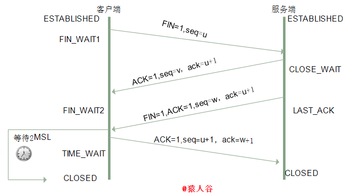

# 常问的计算机基础

## 计网

### 七层协议有哪些

### TCP与UDP区别

### TCP三次握手四次挥手

#### 三次握手过程

0.  初始状态：客户端处于 `CLOSED` 状态，服务端处于 `监听` 状态

1.  客户端给服务端发一个 ==SYN报文(同步标志位置1，初始序号seq=x)== ，并指明客户端的初始序列号。此时客户端处于 `SYN_SEND(SYN发送状态)` 状态
2.  服务端接收到客户端的 ==SYN报文== 后，会以自己的 ==SYN报文(SYN=1,ACK=1,ack=x+1,seq=y)== 作为应答，将确认位ACK置1，指定了自己的初始化序列号。表明自己接收到了客户端的SYN同步报文。此时服务器处于 `SYN_RCVD` 状态。
3.  客户端接收到 ==SYN报文== 后，会发送一个 ==ACK报文(SYN=1,ACK=1,seq=x+1,ack=y+1)== ，表示收到了服务端的SYN报文。客户端处于 `ESTABLISHED` 状态，服务端收到 ==ACK报文== 后也处于 ==ESTABLISHED== 状态。

>   在第三次握手时，客户端可以携带数据。若不携带数据则不消耗序列号。

>   [两张动图-彻底明白TCP的三次握手与四次挥手_qzcsu的博客-CSDN博客_三次握手四次挥手详解](https://blog.csdn.net/qzcsu/article/details/72861891)
>
>   

##### 半连接队列

服务器第一次收到客户端SYN报文，处于 `SYN_RCVD` 状态，此时双方还没有完全建立连接，服务器会把这种状态的请求连接放在一个队列里。称为半连接队列。

#### 为什么要三次握手

TCP其实就是指建立一个TCP连接时，需要客户端和服务器总共发送3个包。客户端先发送同步报文(SYN)，服务端接收到后发送确认报文ACK,客户端接收到服务端的确认报文后，发送确认报文对服务端的ACK报文进行确认。

三次握手有两个目的：

1.  三次握手，能使双方确认自己和对方的发送和接收能力都正常。

    >    第一次握手：
    >
    >   ​	服务端确认对方正常发送，自己接收正常
    >
    >    第二次握手：
    >
    >   ​	客户端确认自己发送、接收正常，对方发送、接收正常；
    >
    >    第三次握手：
    >
    >   ​	客户端确认自己发送、接收正常，对方发送、接收正常；服务端确认了自己发送、接收正常，对方发送、接收正常

2.  指定初始序列号和确认号，交换 `TCP窗口大小` 信息，为后面可靠传输做准备，

#### 四次挥手

假设客户端先发起关闭请求

1.  客户端发送 ==FIN报文== ，报文中指定序列号。客户端处于 `FIN_WAIT1` 状态

    发出  ==连接释放报文段(FIN=1,seq=u)==  后，客户端停止发送数据，主动关闭TCP连接，进入 `FIN_WAIT1(终止等待1) ` 状态，等待服务端确认

2.  服务端接收到 ==FIN报文== 后，发送 ==ACK确认报文段 (ACK=1，确认号ack=u+1，序号seq=v)==，表明已经接收到客户端的报文

    此时，服务端进入 `CLOSE_WAIT(关闭等待)` 状态。

    客户端接收到服务端的确认后，进入 `FIN_WAIN2(终止等待2)` 状态，等待服务端发送的 ==FIN报文段==。

    TCP处于半关闭状态，客户端到服务端的连接释放。

3.  如果服务端也要断开连接，发送 ==FIN 报文(FIN=1,ACK=1 ,seq=w,ack=u+1)== 。服务器处于 `LAST_ACK(最后确认)` 状态,等待客户端的确认

4.  客户端收到 ==FIN报文== 后，发送一个 ==确认报文段(ACK=1,seq=u+1,ack=w+1)== 作为应答，此时客户端处于 `TIME_WAIT(时间等待)` 状态。过一段时间确保服务端收到自己的ACK报文后，才真正关闭连接。客户端才进入 `CLOSED` 状态。

#### 为什么四次挥手

**ACK报文是用来应答的，SYN报文是用来同步的，FIN报文是用来释放连接的** 

连接关闭时，当服务端收到 ==FIN报文== ，很可能不会立即关闭连接，所以先回复一个ACK报文，使客户端确认服务端已经收到 ==FIN报文== 。客户端进入 `终止等待FIN_WAIT2` 状态。

若服务端需要关闭连接，则由服务端发送 ==FIN报文== 。

>   [ 两张动图-彻底明白TCP的三次握手与四次挥手_qzcsu的博客-CSDN博客_三次握手四次挥手详解](https://blog.csdn.net/qzcsu/article/details/72861891)
>
>   

#### 时间等待TIME_WAIT意义

>    等待的时间为 **2MSL(maximum Segment Lifetime)** 最长报文段寿命。任何报文在网络上存在的最长时间。

1.  保证客户端发送的最后一个ACK报文段能到达服务端

    为了保证客户端最后发送的ACK段能够到达服务器。若这个ACK丢失，处于 `LAST_ACK` 状态的服务器接收不到对==FIN报文段== 的确认报文。服务器会超时重传这个 ==FIN报文段== ，接着客户端在重新传一次 ==ACK报文段== ，重新启动 时间等待计时器，最后客户端与服务端都会进入 `CLOSED` 状态。若客户端收到 ==FIN报文== 直接释放，则可能使服务端无法进入 `CLOSED` 状态

2.  消耗这次连接内产生的所有报文

    客户端在发送完最后一个ACK报文段后，在经过2MSL，就可以使本连接持续的时间内产生的所有报文段都从网络中消失。

 [(2条消息) 面试官，不要再问我三次握手和四次挥手_猿人谷-CSDN博客](https://yuanrengu.blog.csdn.net/article/details/102366854?utm_medium=distribute.pc_relevant.none-task-blog-2~default~BlogCommendFromMachineLearnPai2~default-1.control&depth_1-utm_source=distribute.pc_relevant.none-task-blog-2~default~BlogCommendFromMachineLearnPai2~default-1.control)

>   TCP半连接状态

TCP的半关闭状态，连接的一端在结束发送后还可以接收另一端的数据。

任何一方都可以在数据传送结束后发出连接释放的通知，待对方确认后进入半关闭状态。当另一方也没有数据发送时，发出连接释放通知，对方确认后完全关闭了TCP连接。

### HTTP协议

超文本传输协议，是用于超媒体信息系统的应用层协议。

HTTP协议定义了Web客户端如何从Web服务器请求Web页面，以及服务器如何把Web页面传给客户端。

HTTP协议采用了 请求头/响应 模型。

>   过程

1.  浏览器向 DNS 服务器请求解析该 URL 中的域名所对应的 IP 地址;
2.  解析出 IP 地址后，根据该 IP 地址和默认端口 80，和服务器建立TCP连接;
3.  浏览器发出读取文件(URL 中域名后面部分对应的文件)的HTTP 请求，该请求报文作为 TCP 三次握手的第三个报文的数据发送给服务器;
4.  服务器对浏览器请求作出响应，并把对应的 html 文本发送给浏览器;
5.  释放 TCP连接;
6.  浏览器将该 html 文本并显示内容; 　

### DNS协议

#### 域名服务器

| 分类           | 作用                                                         |
| -------------- | ------------------------------------------------------------ |
| 根域名服务区   | 最高层次的域名服务器，本地域名服务器解析不了的域名就会向其求助 |
| 顶级域名服务器 | 负责管理该顶级域名服务器下注册的二级域名                     |
| 权限域名服务器 | 负责一个区的域名解析工作                                     |
| 本地域名服务区 | 当一个主机发出DNS查询请求时，这个查询请求首先会发送给本地域名服务器 |

-   每一级域名服务器都知道下级域名服务器的ip地址

#### DNS解析过程

1.  输入域名后，先向本地域名服务器进行递归查询
2.  本地域名服务器采用迭代查询，向每一个根服务器进行查询
3.  根域名服务器告诉本地域名服务器，下一次查询的顶级域名服务器的IP地址
4.  本地服务器向顶级域名服务器进行查询
5.  顶级域名服务器告诉下次查询的权限域名服务器IP地址
6.  本地域名服务器向权限域名服务器进行查询
7.  权限域名服务器告诉本地域名服务器所查询的主机的IP地址
8.  本地域名服务器将结果告诉主机

>   迭代查询与递归查询

递归查询：

DNS服务器接收到客户机请求，必须使用一个准确的查询结果回复客户机。如果DNS服务器本地没有存储查询DNS信息，那么该服务器会询问其他服务器，并将返回的查询结果提交给客户机。
迭代查询：

DNS服务器会向客户机提供其他能够查询请求的DNS服务器地址，当客户机发送查询请求时，DNS服务器并不直接回复查询结果，而是告诉客户机另一台DNS服务器的地址，客户机再向这台DNS服务器提交请求。

##  操作系统

### 并行和并发的区别

并发是一段时间内宏观上多个程序同时运行；

并行是在同一时刻，真正有多个程序在同时运行

并发是一个时间段内同一处理机上有多个程序处于启动状态

并行是CPU的多个核心同时运行多个不同的进程

