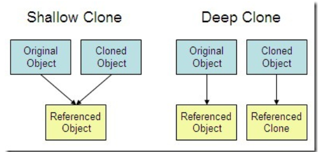
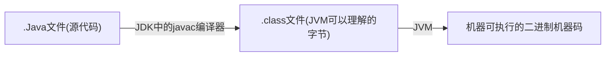
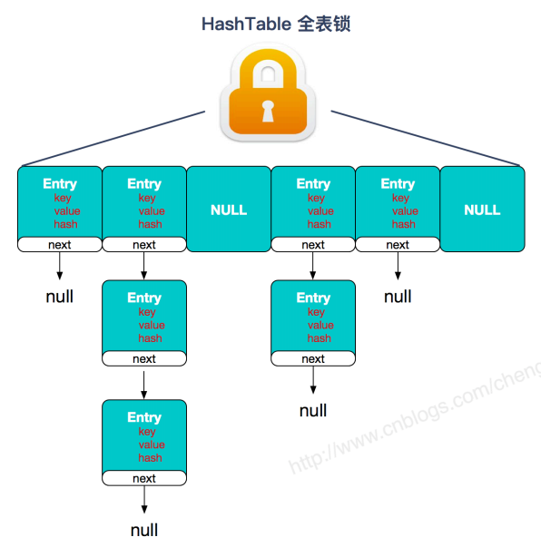
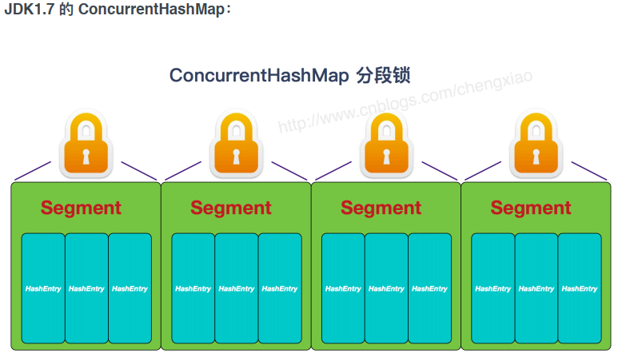
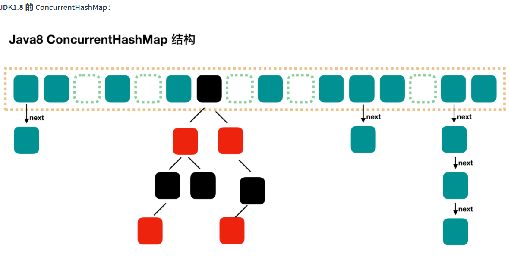

# Java基础

## 基础

### 面向对象相关

#### Java特点

-   简单易学
-   面向对象（封装、继承、多态）
-   平台无关性（JVM虚拟机实现平台无关性）
-   可靠性
-   安全性
-   支持多线程
-   支持网络编程
-   编译与解释并存

#### Java和C++的区别

-   都是支持面向对象编程，支持封装、继承和多态
-   Java不提供指针来直接访问内存，程序内存更加安全
-   Java是单继承的，但是接口可以多继承；C++支持多重继承；
-   Java有自动内存管理机制，不需要手动释放无用内存
-   C语言中，字符串和字符数组的最后都会有一个额外的 `\0` 来表示结束。但是，Java语言没有结束符这一概念。（[原因](https://blog.csdn.net/sszgg2006/article/details/49148189)）

#### 面向对象与面向过程的区别

-   面向过程：**面向过程的性能比面向对象的性能高**。因为类调用需要实例化，开销较大，比较消耗资源，所以当性能是最重要的考量因素时，一般采用面向过程开发（比如单片机，嵌入式开发，Linux/Unix等）。**但是面向过程没有面向对象易维护、易复用、易扩展**。
-   面向对象：面向对象易维护、易扩展、易复用。**因为面向对象有封装、继承、多态性的特性，所以可以设计出低耦合的系统，使系统更加灵活、易于维护**。但是面向对象性能比面向过程低。

>   为什么过程比面向对象性能高？

面向过程也需要分配内存，计算内存偏移量。Java性能差的主要原因并不是因为它面向对象语言，而Java是半编译语言，最终的执行代码并不是可以直接被CPU执行的二进制代码。

面向过程语言大多数都是直接编译成机器码在电脑上执行，并且一些面向过程的脚本语言性能并不一定比Java性能好。

##### 面向对象三大特性

1.  封装：封装把一个对象的属性私有化，同时提供 `getter` 和 `setter` 方法访问这些属性。

    封装可以隐藏实现细节，使代码模块化。

2.  继承：继承是在现有类的定义基础上建立新类的，新类的定义可以增加新的数据或新的功能，也可以用父类功能，但不能选择性继承父类。**继承可以扩展已存在的代码块，实现代码复用**
    -   子类拥有父类的所有属性和方法，包括私有属性和私有方法，但是父类中的私有属性和方法子类是无法访问的
    -   子类可以拥有自己的属性和方法，即子类可以对父类进行扩展
    -   子类可以用自己的方式实现父类的方法

3.  多态：同一操作作用于不同的对象，可以有不同的执行结果

##### 多态的实现方式

**编译时多态（静态多态）**

重载是编译时多态，编译时多态在编译时就确定，运行时调用的是确定的方法

**运行时多态（动态多态）**

>   The primary usage of polymorphism in industry (object-oriented programming theory) is the ability of objects belonging to different types to respond to method, field, or property calls of the same name, each one according to an appropriate type-specific behavior.

对父类方法的改写或对接口方法的实现，达到运行时的不同执行效果。

多态的使用：声明的总是父类类型或接口类型，创建的是实际类型

如：

```java
//正确
List list = new ArrayList();

//错误
ArrayList list = new ArrayList();
```

增加了代码的灵活性。加入ArrayList无法满足需求，改为LinkedList，只需要改变为 `new LinkedList` 即可。其他代码不需要改动。

1.  子类继承父类(extends)
2.  类实现接口(implements)

>   Java中，实现多态的两种形式：**继承**（多个类对同一方法的重写）和 **接口**（实现接口并覆盖接口的同一方法）
>
>   **对多态的理解有问题**——深圳中电电力

#### 重写和重载的区别

>   重载就是同一个类中多个同名方法根据不同的传参执行不同的逻辑处理
>
>   
>
>   重写是当子类继承父类的相同方法，输入数据一样，但要有别于父类的响应时，要覆盖父类的方法。

##### 重载

发生在同一个类中，方法名必须相同，参数类型不同、个数不同、顺序不同，方法返回值和返回修饰符可以不同。

>   Java中，任何方法都

##### 重写

重写发生在运行期，是子类对父类的允许访问的方法的实现过程重新编写。

1.  返回值类型、方法名、参数列表必须相同（引用类型可以返回子类），抛出的异常范围小于等于父类，访问修饰符范围大于父类。
2.  如果父类方法访问修饰权限为 `private/final/static` ,则子类不能重写该方法，但是被 `static` 修饰的方法能够被再次声明。
3.  构造方法无法被重写

综上：重写就是子类对父类方法的重新改造，外部样子不能变，内部逻辑可以改变。

##### 表格对比

| 区别点     | 重载       | 重写                                                         |
| ---------- | ---------- | ------------------------------------------------------------ |
| 发生范围   | 同一个类中 | 子类                                                         |
| 参数列表   | 必须要改   | 一定不能修改                                                 |
| 返回类型   | 可修改     | 子类方法返回值类型比父类返回值类型更小或相等                 |
| 异常       | 可修改     | 子类方法声明抛出的异常类应比父类方法声明抛出的异常类更小或相等 |
| 访问修饰符 | 可修改     | 一定不能做更严格的限制（可以降低限制）                       |
| 发生阶段   | 编译器     | 运行期                                                       |

##### Constructor不可被重写

构造器不能被重写(override)，但可以被重载(overload)，所以一个类中可以有多个构造函数

#### 抽象类和接口的区别

1.  从语言的设计角度讲，Java是单继承的，一个类只能 _继承一个抽象类(C++与Java的区别)_ ，但可以实现多个接口。接口本身可以通过 `extends` 扩展多个接口

2.  语法上的区别
    -   成员变量：接口中只能有常量变量，必须用 `static` 或 `final` 修饰变量；抽象类不做限制
    -   成员方法类型：接口中都是抽象方法，都不能有实现；抽象类中可以有非抽象方法。
    -   成员方法访问权限：接口中的方法默认是 `public` 修饰的；抽象方法可以有 `public`、`protected`、`default` 修饰（不能用 `private` 原因是抽象类中方法本身就是用于重写的）

3.  从使用场景角度讲，抽象是对象的抽象，是一种模板设计，为了复用而生（联系继承概念）；

接口是对行为的规范。

##### Java中的访问控制修饰符

-   **public** : 对所有类可见。使用对象：类、接口、变量、方法
-   **default** (即默认，什么也不写）: 在同一包内可见。使用对象：类、接口、变量、方法。
-   **protected** : 对同一包内的类和所有子类可见。使用对象：变量、方法。 **注意：不能修饰类（外部类）**
-   **private** : 在同一类内可见。使用对象：变量、方法。 **注意：不能修饰类（外部类）**

##### JDK7~JDK9 中Java 接口概念的变化

1.  JDK7或更早的版本中，接口只能有常量变量和抽象方法。这些接口方法必须由选择实现该接口的类实现。

2.  JDK8中，接口可以有默认方法和静态方法。

    接口中的静态方法，可以直接用接口名调用。实现类和实现是不可以调用的。

    如果同时实现的两个接口定义了一样的默认方法，则必须重写

3.  JDK9在接口中引入了私有方法和私有静态方法

#### ==和equals的区别

>   ==

判断两个对象的地址是否相等，即两个对象是否为同一对象（基本数据类型比较的是值，引用数据类型比较的是内存地址）

>   equals()

-   情况1：类没有覆盖 `equals()` 方法。此时等价于通过 `==` 比较两个对象
-   情况2：类覆盖了 `equals()` 方法。一般，我们都覆盖 `euqals()` 方法来比较两个对象的内容是否相等；若内容相等，则返回true

**String中的euqlas()**

-   String中的 euqals 方法是被重写过的，因为 Object的 equals 方法是比较的对象的内存地址，而String 的euqals方法比较的是对象的值。
-   当创建String类型的对象时，虚拟机会在常量池

#### 成员变量和局部变量的区别

##### 语法上

-   归属：成员变量属于类；局部变量是在方法中定义的变量或者方法的参数

-   访问权限：成员变量可以被访问控制修饰符 `public` 、`private`  、`static` 等修饰

    局部变量不能被访问控制修饰符修饰

    二者都能被 `final` 修饰

##### 生命周期

-   成员变量属于对象的一部分，随着对象的创建而存在
-   局部变量随着作用域的结束而消失

##### 初值

-   成员变量没有赋初值，则会自动以类型的默认值赋值

    例外：被 `final` 修饰必须显式赋值

-   局部变量不会自动赋值

##### 存储

-   局部变量：基本数据类型，存储在栈内存中的值；引用数据类型，存放的是指向堆内存对象的引用或指向常量池中的地址

-   成员变量：被 `static` 修饰，属于类

    没有 `static` 修饰，属于实例

    都存于堆内存


#### 静态方法和实例方法的区别

1.  调用方式

    静态方法：“类名.方法名”、“对象名.方法名”

    实例方法：“对象名.方法名”

2.  静态方法只能访问静态成员（静态成员变量与静态方法）

##### 在一个静态方法中调用非静态成员是非法的

由于静态方法可以不通过对象调用，所以在静态方法中，不能调用其他非静态变量，也不可以访问非静态成员变量。

#### 创建对象的方法

##### new

##### 反射机制创建

使用每个类对应的Class类的newInstance方法

```java
Class heroClass = Class.forName("yunche.test.Hello");
Hello h =(Hello) heroClass.newInstance();
```

使用Constructor类的newInstance方法

```java
//获取类对象
Class heroClass = Class.forName("yunche.test.Hello");
//获取构造器
Constructor constructor = heroClass.getConstructor();
Hello h =(Hello) constructor.newInstance();
```

##### 使用clone方法

无论何时我们调用一个对象的clone方法，jvm就会创建一个新的对象，将前面对象的内容全部拷贝进去。

**用clone方法创建对象并不会调用任何构造函数**

```java
Employee emp4 = (Employee) emp3.clone();
```

##### 使用反序列化方法

当我们序列化和反序列化一个对象，jvm会给我们创建一个单独的对象。

**在反序列化时，jvm创建对象并不会调用任何构造函数**

```java
// Serialization
ObjectOutputStream out 
    = new ObjectOutputStream(new FileOutputStream("data.obj"));
out.writeObject(emp4);
out.close();

//Deserialization
ObjectInputStream in 
    = new ObjectInputStream(new FileInputStream("data.obj"));
Employee emp5 = (Employee) in.readObject();
in.close();
```

#### 对象实体与对象引用区别

new 运算符创建实例（对象实例在堆内存中），对象引用指向对象实例

#### 没有构造方法的类可以正确执行吗

构造方法完成对类对象的初始化工作。类中有默认的不带参数的构造方法，所以可以正确执行。

##### Java中无参构造器的作用

Java程序在执行子类的构造方法之前，如果没有使用 `super()` 来调用父类特定的构造方法，则会调用父类中 `无参构造器` 。若不定义无参构造器会编译报错。


### 数据类型相关

#### 八种基本数据类型

| 基本类型 | 大小  | 最小值    | 最大值             | 包装器类型  |
| -------- | ----- | --------- | ------------------ | ----------- |
| byte     | 1字节 | -128      | +127               | Byte        |
| char     | 2字节 | Unicode 0 | Unicode $2^{16}-1$ | _Character_ |
| short    | 2字节 | $-2^{15}$ | $+2^{15}-1$        | Short       |
| int      | 4字节 | $-2^{31}$ | $+2^{31}-1$        | _Integer_   |
| long     | 8字节 | $-2^{63}$ | $+2^{63}-1$        | Long        |
| float    | 4字节 | IEEE754   | IEEE754            | Float       |
| double   | 8字节 | IEEE754   | IEEE754            | Double      |
| boolean  | -     | -         | -                  | Boolean     |
| void     | -     | -         | -                  | Void        |

#### 引用数据类型

##### 类

-   Object：Object是类层次结构的根类，每个类都适用Object作为超类，所有对象（包括数组）都实现这个类的方法

    ```java
    Object obj = new Integer(1);
    Integeter i = (Integer)obj;//将Object强制转换成Integer
    ```

-   String：String类代表字符串，Java程序中的所有字符串字面值都作为此类的实例来实现

-   Date：特定的瞬间，精确到毫秒

-   Void：Void类是一个不可实例化的占位符类，保持一个对代表Java关键字void的Class对象的引用

##### 接口

##### 数组

>   存储在 **一个连续的** 内存块中的 **相同数据类型** 的元素集合

**定义**

```java
类型[] 数组名;==> int[] nums;
类型 数组名[];==> int nums[];
```

**初始化**

>   Java中数组必须先初始化后才能使用

-   给数组元素分配内存

-   为每个元素赋初始值

两种初始化方式

-   静态初始化

    ``` java
    类型[] 数组名 = new 数组类型[]{元素1,元素2......}
    
    //简化写法
    类型[] 数组名 = {元素1,元素2......};
    ```

-   动态初始化

    ```java
    类型[] 数组名 = new 数组类型[数组长度];
    ```

**数组是定长的** ：无论哪种方式初始化数组，一旦初始化完成，数组长度就固定了。

#### 为什么提供包装器类型

>   **让基本数据类型具备对象的特征，实现更多功能**

Java是一个面向对象的语言，基本数据类型并不具有对象的性质。

| 基本数据类型             | 包装器类型(基本数据类的类类型)                     |
| ------------------------ | -------------------------------------------------- |
| 作为参数传递             | 用于类型转换的场景                                 |
| int是基本数据类型        | Integer是对象，引用数据类型                        |
| 直接存储在栈内存中       | “引用”(内存位置)存储在栈内存，对象的值存储在堆内存 |
| 默认值为0，不能赋null    |                                                    |
| 集合中不能用基本数据类型 |                                                    |

>   [堆、栈的区别](https://www.cnblogs.com/whgw/archive/2011/09/29/2194997.html)：栈是用来执行程序的，堆是用来存放对象的。

**栈内存**

_基本数据类型的变量_ 和 _对象的引用变量_ 都是在函数的栈内存中分配

定义一个变量后，Java会在栈中为这个变量分配内存空间，当超过变量的作用域后，Java会自动释放调这片内存空间，另作他用。

**堆内存**

用于存放 `new` 创建的对象和数组

在堆中分配内存，由Java虚拟机自动垃圾回收器来管理。在堆中产生一个数组或对象后，栈中会保存一个引用变量，其值为这个对象在堆内存中的首地址。

引用变量在定义时，在栈中分配内存，运行到作用域外释放引用变量占用的栈内存。


数组和对象在没有引用变量指向的时候，会变成垃圾。但仍占用内存，在随后一个不确定时间被垃圾回器释放掉。

#### 自动拆箱与装箱

[深入剖析Java中的装箱和拆箱 - Matrix海子 - 博客园 (cnblogs.com)](https://www.cnblogs.com/dolphin0520/p/3780005.html)

>   装箱：将基本数据类型用他们的引用类型包装起来
>
>   拆箱：将包装类型转换为基本数据类型

```java
Integer i = new Integer(10);

Integer i = 10;//装箱
int n = i;//拆箱
```

这个过程会自动根据数值创建对应的Integer对象。这就是装箱。

##### 实现过程

装箱过程是调用包装器的 `valueOf` 方法，

拆箱过程是调用包装器的 `xxxValue` 方法。

##### 包装类最重要的特性就是数据缓存

Integer会将 -128~127 区间的数缓存，当类加载的时候就创建这256个数对应的对象，并放到名为cache的数组中，调用 `valueOf()` 方法时会先判断该数是否在 -128~127 区间。如果在，则直接获取数组中的该对象引用，如果不在，则创建对象。 

```java
public static Integer valueOf(int i) {
	if (i >= IntegerCache.low && i <= IntegerCache.high)
        //low=-127,high=128   移码
		return IntegerCache.cache[i + (-IntegerCache.low)];
	return new Integer(i);
}
```

-   Boolean：使用静态 final 定义；
-   Byte：缓存区 -128~127
-   Short：缓存区 -128~127；
-   Long：缓存区 -128~127；
-   Integer：缓存区 -128~127。
-   Character：缓存区 0~127； ASCII值
-   Float 和 Double 不会有缓存。//浮点数是无限的

##### 常见面试题

>   1.

```java
public static void main(String[] args) {
	Integer num1 = 4;
	Integer num2 = 4;
	System.out.println(num1==num2);//true
	System.out.println(num1.equals(num2));//true
    # 并未发生自动装箱
    
	Integer num3 = 145;
	Integer num4 = 145;
	System.out.println(num3==num4); //false
	System.out.println(num3.equals(num4)); //true
    # 发生了自动装箱
}
```

>   2.

```java
public class Main {
    public static void main(String[] args) {
         
        Boolean i1 = false;
        Boolean i2 = false;
        Boolean i3 = true;
        Boolean i4 = true;
         
        System.out.println(i1==i2);
        System.out.println(i3==i4);
    }
}
```

Boolean的valueOf()方法

```java
public static final Boolean TRUE = new Boolean(true);
public static final Boolean FALSE = new Boolean(false);

public static Boolean valueOf(boolean b) {
    return (b ? TRUE : FALSE);
}
```

#### 深拷贝与浅拷贝

-   浅拷贝：对基本数据类型进行值传递，对引用数据类型进行引用传递
-   深拷贝：对基本数据类型进行值传递，对引用数据类型，创建一个新的对象，并复制其内容



#### Java是值传递的


### 字符串

#### 字符型常量和字符串常量的区别

1.  形式上：字符常量是单引号引起的一个字符；字符串常量是双引号引起的若干字符

2.  含义上：字符常量相当于一个整数值(ASCII值)，可以参加表达式运算；字符串常量代表一个地址值（该字符串在内存中的位置）

3.  存储上：字符常量只占2个字节；字符串常量占用若干字节。

    >     char在Java中占用两个字节

#### String、StringBuffer和StringBuilder的区别

##### 可变性

>   String是不可变的

String的源码中，Java9 之前使用字符数组(`char[]` )来保存字符串，Java9之后使用 `byte` 数组保存字符，但他们的访问修饰符都是 `private final`。所以String对象是不可变的。

>   StringBuilder与StringBuffer都是可变的

 `StringBuilder` 与 `StringBuffer` 都继承自StringBuilder抽象类( `AbstractStringBuilder`) ，在 `AbstractStringBuilder` 中，也是使用字符数组 `char[] value` 保存字符串，但是没有用 `finale` 关键字修饰，所以这两种对象都是可变的。

##### 线程安全性

String中对象是不可变的，可以理解为常量，线程安全。

`AbstractBuilder` 是 `StringBuilder` 与 `StringBuffer` 的公共父类，定义了一些字符串基本操作的公共方法。

```java
abstract class AbstractStringBuilder implements Appendable, CharSequence {
    /**
    * The value is used for character storage.
    */
	char[] value;
    /**
    * The count is the number of characters used.
    */
	int count;
	AbstractStringBuilder(int capacity) {
		value = new char[capacity];
	}
}
```

-   `StringBuffer` 对方法加了同步锁或者对调用的方法加了同步锁，所以是线程安全的；
-   `StringBuilder` 并没有对方法进行加同步锁，所以是非线程安全的。

##### 性能

每次对String类型进行改变时，都会生成一个新的String对象，然后将指针指向新的String对象。

`StringBuffer` 每次都会对 `StringBuffer` 本身进行操作，而不是生成新的对象并改变对象的引用。

相同情况下使用 `StringBuilder` 相比使用 `StringBuffer` 仅能获得10%~15%左右的性能提升，却要冒多线程不安全的风险。

##### 总结

-   操作少量数据：使用String
-   单线程操作字符串缓存区下的大量数据：适用 `StringBuilder`
-   多线程操作字符串缓存区下的大量数据：适用 `StringBuffer` 


### JVM

#### JDK和JRE

-   JRE是Java运行时环境：运行已编译Java程序所需的所有内容的集合，包括Java虚拟机(JVM)，Java类库，Java命令和一些其他基础构件。但不能用于创建新程序。
-   JDK(Java Development Kit)，Java开发工具包。拥有JRE拥有的一切，还有编译器(javac)和工具(javadoc和jdb)。**能够创建和编译程序** 。

>   如果只运行Java程序，只需要安装JRE即可。如果需要运行一些Java编程方面的工作，需要安装JDK。
>
>   如：使用JSP部署Web应用程序时，应用程序服务器会将JSP转化为Java Servlet，并且需要用JDK编译servlet。

#### 对JVM的理解

>   Java虚拟机（JVM）是运行Java字节码的虚拟机。JVM针对不同系统有不同的实现方式，目的是为了使用相同的字节码，都会给出相同的结果。

##### 字节码

在Java中，JVM可以识别的代码叫 _字节码_ （扩展名为 _.class_的文件），不面向任何特定的处理器，**只面向虚拟机**。Java语言通过字节码的方式，在一定程度上解决了传统解释型语言执行效率低的问题，同时保留了解释型语言可移植的特点。所以Java程序运行时比较高效。

字节码不针对特定的机器，因此，字节码无须重新编译就可以在不同操作系统上运行。

##### Java编译过程



在字节码 _.class_ 到二进制机器码转化过程中。JVM类加载器首先加载字节码文件，然后通过解释器逐行解释执行，这种方式的执行速度会相对较慢。而且有些方法和代码块是经常需要被调用的（所谓的热点代码），所以后面引进了JIT编译器。而JIT属于运行时编译，当JIT编译器完成第一次编译后，会将其字节码对应的机器码保存下来，下次可直接使用。

所以说Java是 **编译与解释共存的语言**。

>   根据二八定律，消耗大部分系统资源的只有一小部分代码（热点代码），这就是JIT需要编译的部分。
>
>   JVM会根据代码每次被执行的情况收集信息并相应地做出一些优化，因此执行次数越多，执行速度越快。
>
>   JDK9引入了一种新的编译模式AOT(Ahead of Time Compliation)，它是直接将字节码编译成机器码，避免了JIT预热等各方面开销。
>
>   JDK支持分层编译和AOT编译协作使用。但是AOT编译器的编译质量肯定比不上JIT

##### 总结

Java虚拟机(JVM)是运行Java字节码（就是.class文件）的虚拟机。JVM针对不同操作系统有不同的实现方式。目的是使用相同的字节码，都会给出相同的结果。字节码和不同系统的JVM实现是Java **一次编译，随处可以运行** 的关键所在。


## 集合框架

### List，Set，Map的区别

-   `List` (顺序存储)：存储的元素是有序的、可重复的
-   `Set` (不可重复)：存储元素无需，不可重复
-   `Map` (通过ket搜索)：使用键值对(key-value)存储

---

>   底层数据结构总结

#### Collection下的集合

##### List

-   `ArrayList` : Object[] 数组
-   `Vector` : Object[] 数组
-   `LinkedList` : 双向链表（1.6之前为循环链表，1.7之后取消了循环）

##### Set

-   `HashSet` (无序，唯一) : `Set` 接口的主要实现类，底层采用 `HashMap` 保存元素
-   `LinkedHashSet` : 是 `HashSet` 的子类，并且其内部通过 `LinkedHashMap` 实现。
-   `TreeSet` （有序，唯一）: 红黑树（自平衡的排序二叉树） 

#### Map下的集合

##### HashMap

JDK1.8之前， `HashMap` 由数组+链表组成，数组是 `HashMap` 的主体，链表是为了解决哈希冲突而存在的(拉链法解决冲突)

JDK1.8后，解决哈希冲突的方法为：当链表长度大于阈值（默认为8），若当前数组长度小于64，则先进行数组扩容。若已经数组长度大于等于64，将链表转换为红黑树

##### LinkedHashMap

继承自 `HashMap` ，所以底层仍然是基于拉链的散列结构

LinkedHashMap 在此基础上，增加了双向链表，使得上述结构可以保持键值对的插入顺序。

##### Hashtable

数组+链表

##### TreeMap

红黑树（自平衡的排序二叉树）

---

#### 如何选用集合

需要存储键值对，选用 `Map` 接口下的集合

-   需要排序，使用 `TreeMap`
-   不需要排序，使用 `HashMap`
-   需要保证线程安全，使用 `ConcurrentHashMap`

只需要存放元素，选择 `Collection` 下的接口集合

-   需要保证元素唯一，选择实现 `Set` 接口的集合，如：`TreeSet` 和 `HashSet`
-   不需要保证元素唯一，选择实现 `List` 接口的，如 `ArrayList` 和 `LinkedList` 


### List集合

#### ArrayList与LinkedList的区别

1.  线程安全：都不保证线程安全

2.  底层数据结构：ArrayList是对象数组  `Object[]` ,LinkedList 采用双向链表

3.  内存占用：ArrayList 在 list 列表结尾会预留一定的容量，LinkedList的空间花费体现在每个元素占用更多空间（存直接前驱和后继）

4.  随机访问：ArrayList支持随机访问；LinkedList不支持随机访问 (`get(int index)`)

5.  插入和删除

    `ArrayList` 采用数组存储，插入和删除元素的时间复杂度受元素位置影响

    `LinkedList`采用链表存储，插入和删除元素时间复杂度不受元素的位置影响。

#### ArrayList与Vector的区别

-   `ArrayList` 是 `List` 的主要实现类，底层采用 `Object[]` 存储，线程不安全
-   `Vector` 是 `List` 接口的古老实现，底层采用 `Object` 存储，线程安全

#### ArrayList的扩容机制


### Map集合

#### HashMap与HashTable的区别

1.  线程安全：

    `HashMap` 是非线程安全的，`HashTable` 是线程安全的。

    `HashTable` 内部的方法基本都经过 `synchronized` 修饰。

2.  `HashMap` 比 `HashTable` 效率高一点。另外 `HashTable` 基本被淘汰，不在代码中使用，现在使用 `ConcurrentHashMap`。

3.  null键null值

    `HashMap` 可以存储null的key和value，但null作为键只能有一个，null作为值可以有多个；

    `HashTable` 不允许有 null键和null 值，否则抛出 `NullPointerException`

4.  底层数据结构

    Hashtable底层采用 _数组+链表_ ，数组为存储主体，链表为解决哈希冲突。主要用拉链法解决哈希冲突

    HashMap在JDK1.8之前，与Hashtable底层原理一样。

    JDK1.8后，当链表长度大于阈值，先对数组长度判断，小于64，对数组扩容。

    若数组长度大于等于64，则将链表转化为红黑树。

5.  初始容量大小和每次扩容容量

    -   创建时无初始值

        `Hashtable` 默认的初始化大小为11，之后每次扩容，容量变为2n+1

        `HashMap` 默认的初始化大小为 **16**，之后每次扩容，容量变为原来2倍

    -   创建时有初始值

        `Hashtable`直接采用指定的大小

        `HashMap` 需要扩充为2的幂次方

#### ConcurrentHashMap和HashTable的区别

`ConcurrentHashMap` 和 `HashTable` 区别体现在实现线程的安全方式上。

1.  底层数据结构

    -   `HashTable` 采用 **数组+链表** 的形式，数组是HashMap的主体，链表是为了解决哈希冲突而存在。
    -   `ConcurrentHashMap` ：JDK1.7底层采用 **分段数组+链表** 实现。JDK1.8采用 **数组+链表/红黑树** 。

2.  实现线程安全的方式

    -   `ConcurrentHashMap`:分段锁

        JDK1.7：对整个桶数组进行了分割分段(`Segment`)，每一把锁只锁容器中的一部分数据，多线程访问容器里不同数据段的数据，就不会存在锁竞争，提高并发效率。

        JDK1.8：抛弃 `Segment` 概念，采用 `Node` 数组+链表+红黑树的数据结构实现，并发控制使用 `Synchronied` 和 CAS操作

        `synchronized` 只锁定当前链表或红⿊⼆叉树的⾸节点，这样只要 hash 不冲突，就不会产⽣并发，效率⼜提升 N 倍
    
    -   `HashTable`：同一把锁
    
        使用 `synchronized` 来保证线程安全，效率低下。当一个线程访问同步方法时，其他线程也访问同步方法，可能会进入阻塞或者轮询状态。
    
        如使用 put 添加元素，另一个线程就不能使用put添加元素，也不能使用get，竞争会越来越激烈，效率越来越低。
    

[参考链接](http://www.cnblogs.com/chengxiao/p/6842045.html )








### Set集合

#### HashSet、LinkedHashSet和TreeSet三者区别

`HashSet` 是 `Set` 接口的主要实现类，`HashSet` 的底层是 `HashMap` ，线程不安全，可以存储null值。

`LinkedHashSet` 是 `HashSet` 的子类，能够按照添加的顺序遍历。

`TreeSet` 底层使用红黑树，能够按照添加元素的顺序遍历，排序方式有自然排序和定制排序。

#### HashMap和HashSet区别

`HashSet` 底层是基于 `HashMap` 实现的。除非自己不得不实现，其他方法都是直接调用 `HashMap` 中的方法。

| HashMap                      | HashSet                                                      |
| ---------------------------- | ------------------------------------------------------------ |
| 实现了 `Map` 接口            | 实现了 `Set` 接口                                            |
| 存储键值对                   | 仅存储对象                                                   |
| 调用 `put()` 向map中添加元素 | 调用 `add()` 方法向 `Set` 中添加元素                         |
| 使用键(key) 计算 `hashcode`  | HashSet使用成员对象计算 `hashcode` 值，对于两个对象来说， `hashcode` 可能相同，所以 `equaals()` 方法用来判断对象的相等性 |

#### HashSet如何检查重复

>   `hashCode()` 和 `equals` 的相关规定

1.  两个对象有相同的 `hashcode` 值，他们不一定是相等的
2.  `hashCode()` 默认的行为是对堆上的对象产生独特值。如果没有重写过 `hashCode()` ,则该类的两个对象无论如何都不会相等。
3.  如果两个对象相等(值相等)，则 `hashcode` 一定相同，`equals()` 方法返回的是 true
4.  综上， `equals()` 被覆盖过，则 `hashCode()` 也必须被覆盖

当把对象加入 `HashSet` 时，`HashSet` 会先计算对象的 `hashcode` 值来判断对象加入的位置，同时会与已经加入元素的 `hashcode` 值比较。如果没有相符的 `hashcode` ，`HashSet` 会假设对象没有重复出现。如果发现有相同的 `hashcode` ，则会调用 `equals()` 方法来检查 `hashcode` 相等的对象真的相同。如果两者相同，则不会加入。


