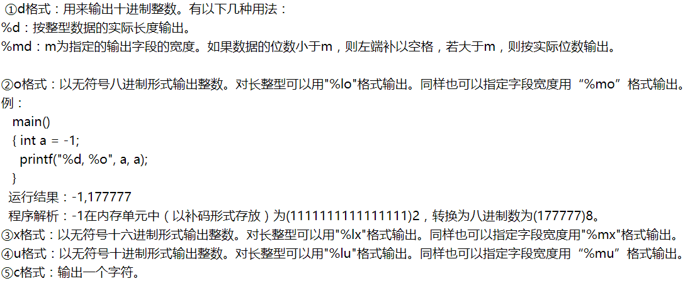
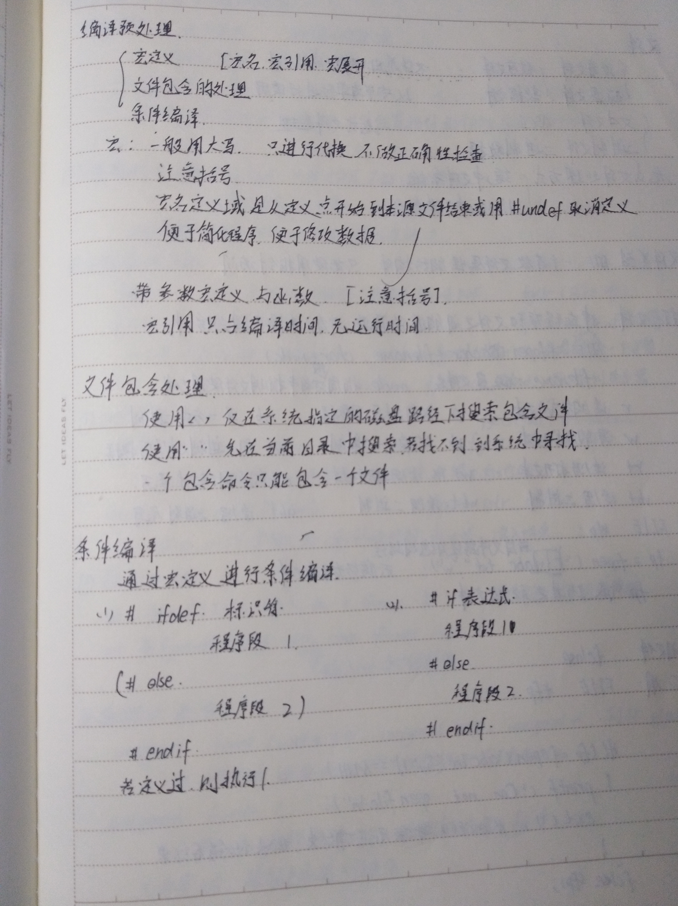
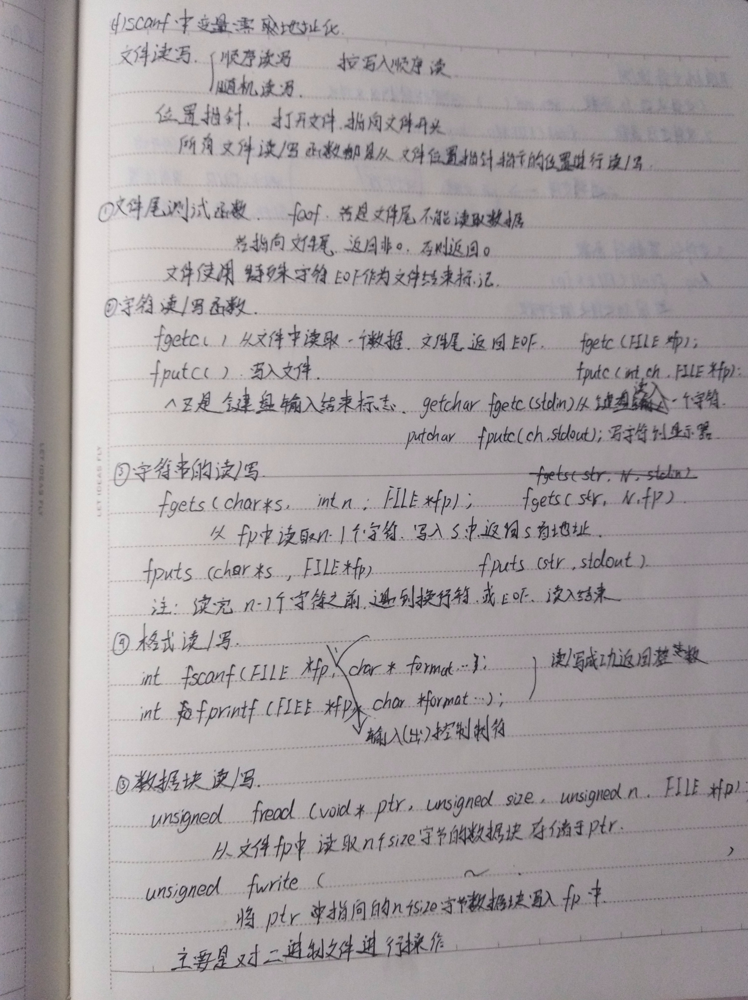
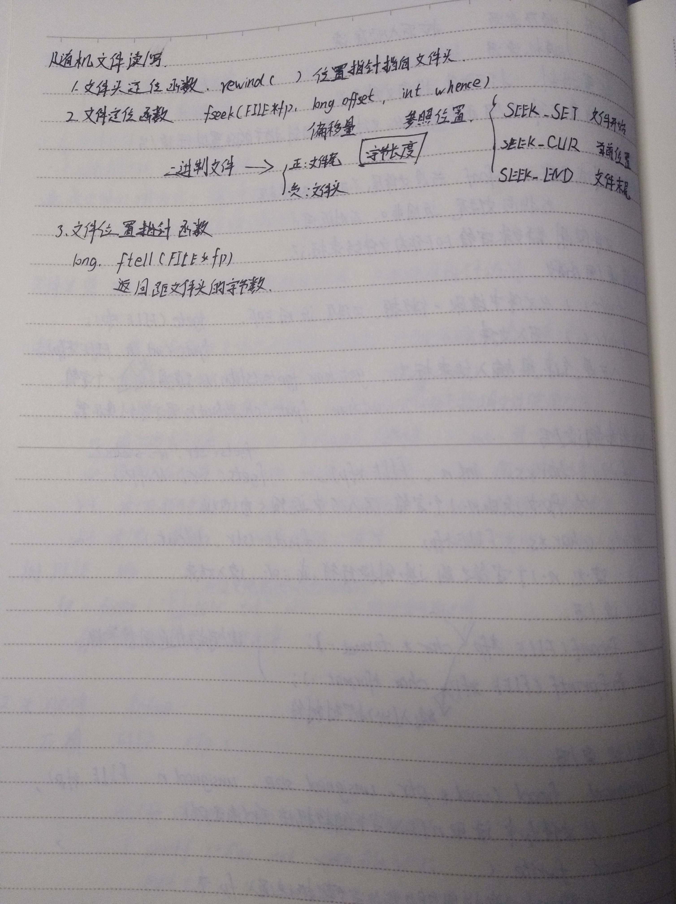

# C

## 1. 简介

### 1.1 优点

+ 简洁性：核心内容少，只有 **32** 个关键字，**9** 种控制语句、**44** 种运算符

+ 丰富的数据类型

+ 具有低级语言的特点：

    具有与汇编语相近的功能和描述方法，如地址运算和二进制数位 

    可以对硬件端口进行直接操作

+ 结构化语言，适用于大型程序**模块化设计**

+ 可移植性好

+ 代码效率高

+ 语法限制不严，程序设计自由度大


### 1.2 C语言缺点
+ 错误更隐蔽
+ 难以理解
+ 难以修改

### 算法
> 通过有限步骤，明确的操作产生问题答案

**`算法表示`**
自然语言，传统流程图，N-S流程图，伪代码

**`常用算法`**：枚举，递推，递归

### 三种基本程序结构
> 顺序、循环、选择

## 变量

### 变量命名规则

+ 首字母必须是 字母或下划线
+ 只能包含字母、数字、下划线
+ 标识符不能是关键字
+ 不能跨行书写 

### 变量的作用域及存储类别

**作用域**

>当局部变量与全局变量发生冲突时，以局部变量为主
>**全局变量任意函数都可访问、修改**
>若要扩充作用域使用`extern`

**存储类别**

>   执行C语言程序，可用的存储区有
>
>   1.  程序区
>
>   2.  静态存储区：编译时分配内存；包括`static,extern`
>
>   3.  动态存储区：运行时分配内存；包括`static,auto`

- **static**

    静态局部变量

    >    - 仅在本函数中使用，调用后不清零
    >    - 只能赋一次初值，若不初始化 自动赋0或空字符
    >    - 可使用静态局部变量跟踪调用次数

     静态全局变量

    >     仅限在定义的文件中使用，可使不同源文件中的静态全局变量独立

- **register**

	整型，字符变量，指针类型

-   **extern**

    >    在函数外部引用变量使用`extern`
    >    扩充已定义的全局变量作用域
    >    *一个C语言程序包含多个源程序，若使用同一外部变量，在一个源文件中定义，在另一个中用extern加以说明*
    >    引用外部函数时，被引用函数需添加extern

## 运算符

**算数运算符**


**`单算移关与，异或逻条赋`**

> ■ “单”表示单目运算符：逻辑非(!),按位取反(~),自增(++),自减(--),取地址(&),取值(* )；
> ■ “算”表示算术运算符：乘、除和求余(* ,/,%)级别高于加减(+,-)；
> ■“移”表示按位左移(<<)和位右移(>>)；
> ■“关”表示关系运算符：大小关系(>,>=,<,<=)级别高于相等不相等关系(==,!=)；
> ■“与”表示按位与(&)；
> ■“异”表示按位异或(^)；
> ■“或”表示按位或(|)；
> ■“逻”表示逻辑运算符：逻辑与(&&)级别高于逻辑或(||)；
> ■“条”表示条件运算符(? :)；
> ■“赋”表示赋值运算符(=,+=,-=,*=,/=,%=,>>=,<<=,&=,^=, |=,!=)；

**`结合性`**

> 单目运算符，赋值运算符，三目运算符为右结合性；
> 其余为左结合性

```cpp
x = 2;
x+=x+=x-=1; //=> x = 4

y = x&1 == x%2; //=> y = 1
/*
 *设x = 0 0&1 = 0 , x % 2 = 0   y = 1
 *  x = 1 1&1 = 1 , x%2 = 1 y = 1
 */
 
a = b = c = 1;
++a||++b&&++c;
//a = 2,b = 1,c = 1;
```

## 数据类型
**基本数据类型**

>整数类型，浮点类型，字符类型
>`转义字符`
>
>`有符号和无符号`：有符号整数范围-1
>`进制表示`
>十六进制：0X/0x、八进制：0

**构造类型**
**指针类型**
**空类型**

### 数组

`注意数组越界`
**数组赋值**

>最低维长度必须指出

```cpp
/*逆序输出*/
# include<stdio.h>
# define N 10

void main()
{
	int i,j,a[N];

	for(i = 0;i < N;++i)
	{
		scanf("%d",&a[i]);
	}

	printf("输出交换前的数组：");
	for(i = 0;i < N;++i)
	{
		printf("%d ",a[i]);
	}

	for(i = 0;i < N/2;++i)
	{
		t = a[i];
		a[i] = a[N - i - 1];
		a[N - i - 1] = t;
	}
	printf("输出交换后的数组：");
	for(i = 0;i < N;++i)
	{
		printf("%d ",a[i]);
	}
	
}
```


```cpp
/*冒泡排序*/
 
# include<stdio.h>
# define N 10

int main()
{
	int a[N],i,j,t;
	
	for(i = 0;i < N;++i)
	{
		scanf("%d",&a[i]);
	}
	
	for(i = 1;i < N;++i)
	{
		for(j = 0;j < N - i;++j)
		if(a[j + 1] < a[j])
		{
			t = a[j];
			a[j] = a[j + 1];
			a[j + 1] = t;
		}
	}

	for(i = 0;i < N;++i)
	{
		printf("%d",a[i]);
	}
		
	return 0;
}
```


```cpp
# include<stdio.h>
# define N 10

int main()
{
	int i,j,k,a[N];

	for(i = 0;i < N;++i)
	{
		scanf("%d",&a[i]);
	}
	
	for(i = 0;i < N - 1;++i)
	{
		j = i;
		for(k = i + 1;k < N;++k)
			if(a[k] < a[j])
				j = k;
		if(j != i)
		{
			t = a[j];
			a[j] = a[i];
			a[i] = t;
		}
	}

	for(i = 0;i < N;++i)
	{
		printf("%d",a[i]);
	}

	return 0;
}
```


### 字符串

>以'\0'结尾的数组

**初始化**

>单个字符初始化:`字符--单引号`
>字符串常量初始化:`字符串 -- 双引号`

**字符串处理函数**

-   strcat(字符串1,字符串2); 连接
-   strcpy(字符串1,字符串2); 复制
-   strcmp(字符串1,字符串2);比较
-   strstr(字符串1，字符串2)：查找
-   strlen(字符串)：计算长度
-   strlwr():转换为小写
-   strupr():转换为大写
    `char *strtok(char *str1, char *str2);`:查找由在第二个串中指定的分界符分隔开的单词

**ctype头文件包含的字符处理函数**

-   extern int isalpha(int c);
-   int toupper(int c);
-   int tolower(int c);
-   int isalnum(int c);
-   int isdigit(int c);十进制

```cpp
/*删除指定字符*/
# include<stdio.h>
# include<string.h>

int main()
{
	char a[100],ch;
	int i,j;
	
	gets(a);
	scanf("%c",&ch);
	
	for(i = 0,j = 0;str[i] != '\0';++i)
	{
		if(str[i] != ch)
		{
			str[j++] = str[i];
		}
	}
	str[j] = '\0';
	
	return 0;
}
```

```cpp
/*指定位置 增加字符 */
# include<stdio.h>
# include<string.h>

int main()
{
	char a[100],ch;
	int i,s;
	
	gets(a);
	scanf("%c",&ch);
	scanf("%d",&s);
	
	for(i = strlen(a);i >= s;--i)
	{
		a[i + 1] = a[i];
	}
	a[i + 1] = a[i];
	a[i] = ch;
	
	return 0;
}
```

### 指针

>**指针就是内存地址**

**指针访问数组**

-   `下标法`

    >    使用数组下标访问

-   `指针法`

    >    获取元素地址，使用取内容（地址）符【视为一维数组】

-   `地址法`

    >    限制向所在行首的地址，再通过加法得到地址

**指针数组**

>   `数据类型 *数组名[数组长度]`
>
>   存储的是首地址

```cpp
char *str[3] = {"one","two","program"}
/=>
/*
*char *str[3];
*char str[0] = "one";
*char str[1] = "two";
*char str[2] = "program";
*/
```

### 结构体

-   当结构体成员是其本身时，只能用指针
-   初始化数量少于成员个数时，其余成员自动赋0
-   对结构体成员操作，实质上是对其所在地址进行操作

**位域**

>特殊的结构体，以二进制位单位，指定所占的二进制位数
>只能使用unsigned,int,signed int
>当存储单元剩下的空间不够存放一个位域时，从跳到下个存储单元，从低位开始存储

### 数据类型转换

**三种转换方式**

`自动类型转换`

>将字节少的转换为字节多的

`赋值类型转换`

>   右侧表达式自动转换为左侧表达式类型，并存储在左侧变量中

`强制类型转换`

## 函数

### 函数

`指向函数的指针变量`

> 函数类型  (*指针变量名)(参数类型);

```cpp
/*函数指针可指向多个函数*/
int add(int x,int y)
{
	return x+y;
}
int max(int x,int y)
{
	return x > y ? x : y;
}
int min(int x,int y)
{
	return x < y ? x : y;
}
int main()
{
	int (*p)(int,int),c,a,b;
	p = add;
	
	c = add(a,b);//=>c = (*p)(a,b);
	p = max;
	c = (*p)(a,b);
	p = min;
	c = (*p)(a,b);
}
```

---

`指向函数的指针做函数参数`

```cpp
/*函数指针可指向多个函数*/
int add(int x,int y)
{
	return x+y;
}
int max(int x,int y)
{
	return x > y ? x : y;
}
int min(int x,int y)
{
	return x < y ? x : y;
}
int func(int (*p)(int,int),int x,int y)
{
	return (*p)(x,y);
}
int main()
{
	int (*p)(int,int),c,a,b;

	c = func(max,x,y);
	c = func(min,x,y);
}
```

### printf()函数格式


**精度格式符以“.”开头，后跟十进制整数。本项的意义是：如果输出数字，则表示小数的位数；如果输出的是字符，则表示输出字符的个数；若实际位数大于所定义的精度数，则截去超过的部分。**
**浮点数默认输出精度为6**


### switch语句
>程序自动执行case后的每一个语句，直至遇到break
```cpp
switch(表达式)
{
  case 常量表达式1：
  语句组1;
  break;
  case 常量表达式2:
  语句组2;
  break;
  ...
  default:
  语句组n;
}
```

### 动态分配内存
```cpp
calloc(unsigned long,unsigned long) <==>
malloc(unsigned long * (unsigned long))

realloc(p,unsigned long)//扩充数组
free()//释放内存，使用完后必须释放内存，错误返回值为NULL
```

## 文件





---

