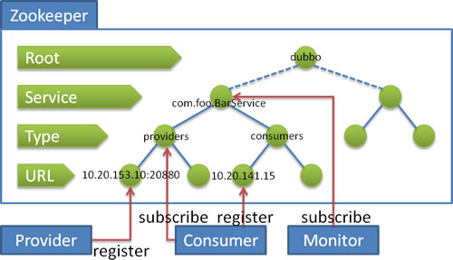

# Dubbo

高性能RPC框架，[官网](https://dubbo.apache.org/zh/)

>   Dubbo 是一个分布式服务框架，致力于提供**高性能和透明化的RPC远程服务调用方案**，是阿里巴巴SOA服务化治理方案的核心框架  
>
>   最大的特点是按照分层的方式来 **架构** ，使用这种方式可以使各个层之间解耦合（或者最大限度地松耦合）  
>
>   从 **服务模型** 的角度来看，Dubbo采用的是一种非常简单的模型，要么是提供方提供服务，要么是消费方消费服务，所以基于这一点可以抽象出服务提供方（Provider）和服务消费方（Consumer）两个角色  

RPC(Remote Procedure Call Protocal)——远程过程调用协议

-   通过网络从远程计算机程序请求服务，

-   采用 **客户机/服务器** 模式。

    -   客户机：请求程序
    -   服务器：服务提供程序

1.  客户机调用进程发送一个有参数的调用信息到服务进程，然后等待应答信息

2.  服务端，进程保持睡眠状态直到调用信息到达为止。当一个调用信息到达，服务器获得进程参数，计算结果，发送答复信息，等待下一个调用信息

3.  客户端调用进程接收答复信息，获得进程结果，调用执行继续进行

## 框架说明

[文档地址](https://dubbo.apache.org/zh/docs/v2.7/user/preface/)

### 背景——网站应用的演进


>   单一应用架构

当网站流量很小，只需 ==一个应用将所有功能部署在一起== ，减少部署节点和成本。此时，*用于简化CRUD的数据访问框架(ORM)是关键*

>   垂直应用架构

当 ==访问量逐渐增大== ，单一应用通过增加机器带来的加速度越来越小，==提高效率的方法之一是将应用拆成互不相干的几个应用==。此时，*用于加速前端页面开发的 Web框架(MVC)是关键*

>   分布式服务架构

当垂直应用越来越多，==应用之间交互不可避免==，将==核心业务抽取出来作为独立的服务，逐渐形成稳定的服务中心==，使前端应用能更快速的响应多变的市场需求。此时 *用于提高业务复用及整合的分布式服务框架(RPC)是关键*

>   流动计算框架

当服务越来越多，==容量的评估、小服务资源的浪费等问题逐渐显现==。此时，需增加一个==调度中心基于访问中心压力，实时管理集群容量==，提高集群利用率。此时*用于提高机器利用率的资源调度和治理中心(SOA) 是关键*

### Dubbo解决的需求


在大规模服务化之前，应用可能只是通过 RMI 或 Hessian 等工具，简单的暴露和引用远程服务，通过配置服务的URL地址进行调用，通过 F5 等硬件进行负载均衡。

==当服务越来越多时，服务 URL 配置管理变得非常困难，F5 硬件负载均衡器的单点压力也越来越大。==此时需要一个 `服务注册中心` ，*动态地注册和发现服务*，使服务的位置透明。并通过在消费方获取服务提供方地址列表，实现软负载均衡和 Failover，降低对 F5 硬件负载均衡器的依赖，也能减少部分成本。

当进一步发展，==服务间依赖关系变得错踪复杂，甚至分不清哪个应用要在哪个应用之前启动==，架构师都不能完整的描述应用的架构关系。 这时，需要 `治理中心` 自动画出*应用间的依赖关系图*，以帮助架构师理清关系。

接着，==服务的调用量越来越大，服务的容量问题就暴露出来==，这个服务需要多少机器支撑？什么时候该加机器？ 为了解决这些问题，第一步，`监控中心` 要将服务现在每天的调用量，响应时间，都 *统计* 出来，*作为容量规划的参考指标*。其次 ，`调度中心` 要可以*动态调整权重*，在线上，将某台机器的权重一直加大，并在加大的过程中记录响应时间的变化，直到响应时间到达阈值，记录此时的访问量，再以此访问量乘以机器数反推总容量。

### Dubbo架构


| 节点        | 角色说明                               |
| ----------- | -------------------------------------- |
| `Provider`  | 暴露服务的服务提供方                   |
| `Consumer`  | 调用远程服务的服务消费方               |
| `Registry`  | 服务注册与发现的注册中心               |
| `Monitor`   | 统计服务的调用次数和调用时间的监控中心 |
| `Container` | 服务运行容器                           |

0.  服务容器负责启动，加载，运行服务提供者
1.  服务提供者在启动时，向注册中心注册自己提供的服务
2.  服务消费者在启动时，向注册中心订阅自己所需的服务
3.  注册中心返回服务提供者地址列表给消费者，如果有变更，注册中心将基于长连接推送变更数据给消费者。
4.  服务消费者，从提供者地址列表中，基于软负载均衡算法，选一台提供者进行调用，如果调用失败，再选另一台调用。
5.  服务消费者和提供者，在内存中累计调用次数和调用时间，定时每分钟发送一次统计数据到监控中心。

## 注册中心

[注册中心文档](https://dubbo.apache.org/zh/docs/v2.7/user/references/registry/)



### 流程说明

-   服务提供者启动时：向 `/dubbo/packageName/providers` 目录下写入自己的URL地址
-   服务消费者启动时：订阅 `/dubbo/packageName/providers` 目录下的提供者的URL地址，并向 `/dubbo/packageName/consumers` 目录下写入自己的URL地址
-   监控中心启动时：订阅 `/dubbo/packageName` 目录下的所有提供者和消费者URL地址

### 功能

-   当 `注册中心` 重启时，能自动恢复注册数据，以及订阅请求
-   当提供者出现断电等异常停机时，注册中心能自动删除提供者信息
-   当会话过期时，能自动恢复注册数据，以及订阅请求
-   当设置 `<dubbo:registry check="false" />` 时，记录失败注册和订阅请求，后台定时重试
-   可通过 `<dubbo:registry username="admin" password="1234" />` 设置 zookeeper 登录信息
-   可通过 `<dubbo:registry group="dubbo" />` 设置 zookeeper 的根节点，不配置将使用默认的根节点
-   支持 `*` 号通配符 `<dubbo:reference group="*" version="*" />`，可订阅服务的所有分组和所有版本的提供者

### docker——Zookeeper

```shell
#拉取zk镜像
docker pull zookeeper:3.4

#创建并启动容器
docker run -d --name zk -p 2181:2181 zookeeper:3.4
```


## 服务提供方

### 1. 创建Maven工程

**父工程**


**服务提供方子模块**


### 2. 导入依赖

**父工程的配置**

```xml
<!--添加SpringBoot parent支持-->
<parent>
    <groupId>org.springframework.boot</groupId>
    <artifactId>spring-boot-starter-parent</artifactId>
    <version>2.1.0.RELEASE</version>
</parent>

<dependencies>
    <!--添加SpringBoot测试-->
    <dependency>
        <groupId>org.springframework.boot</groupId>
        <artifactId>spring-boot-starter-test</artifactId>
        <scope>test</scope>
    </dependency>
    <!--添加dubbo的springboot依赖-->
    <dependency>
        <groupId>com.alibaba.boot</groupId>
        <artifactId>dubbo-spring-boot-starter</artifactId>
        <version>0.2.0</version>
    </dependency>
    <!--添加dubbo依赖-->
    <dependency>
        <groupId>com.alibaba</groupId>
        <artifactId>dubbo</artifactId>
        <version>2.6.4</version>
    </dependency>
</dependencies>

<build>
    <plugins>
        <!--添加springboot的maven插件-->
        <plugin>
            <groupId>org.springframework.boot</groupId>
            <artifactId>spring-boot-maven-plugin</artifactId>
        </plugin>
    </plugins>
</build>
```

**服务提供方的配置**

```xml
<dependencies>
    <!--添加springboot依赖，非web项目-->
    <dependency>
        <groupId>org.springframework.boot</groupId>
        <artifactId>spring-boot-starter</artifactId>
    </dependency>
    <!--添加注册中心-->
    <dependency>
        <groupId>org.apache.zookeeper</groupId>
        <artifactId>zookeeper</artifactId>
        <version>3.4.13</version>
    </dependency>
    <dependency>
        <groupId>com.github.sgroschupf</groupId>
        <artifactId>zkclient</artifactId>
        <version>0.1</version>
    </dependency>
</dependencies>
```

### 3. 创建POJO——User对象

```java
package com.mydubbo.pojo;

// 使用dubbo要求传输的对象必须实现序列化接口
public class User implements java.io.Serializable {

    private static final long serialVersionUID = -7341603933521593227L;

    private Long id;

    private String username;

    private String password;

    private Integer age;

    public Long getId() {
        return id;
    }

    public void setId(Long id) {
        this.id = id;
    }

    public String getUsername() {
        return username;
    }

    public void setUsername(String username) {
        this.username = username;
    }

    public String getPassword() {
        return password;
    }

    public void setPassword(String password) {
        this.password = password;
    }

    public Integer getAge() {
        return age;
    }

    public void setAge(Integer age) {
        this.age = age;
    }
}
```

### 4. 创建Service——UserService接口提供查询服务

```java
package com.mydubbo.service;

import com.mydubbo.pojo.User;

import java.util.List;

public interface UserService {

    /**
     * 查询所有的用户数据
     *
     * @return
     */
    List<User> queryAll();
}
```

### 5. 编写 application.properties

服务端 resources下

```properties
# Spring boot application
spring.application.name = mydubbo-service
server.port = 9090

# Service version
dubbo.service.version = 1.0.0

# 服务扫描包
dubbo.scan.basePackages  = com.mydubbo.service

# 应用名称
dubbo.application.name = dubbo-provider-demo

# 协议及端口
dubbo.protocol.name = dubbo
dubbo.protocol.port = 20882

# zk注册中心
dubbo.registry.address = zookeeper://8.140.130.91:2181
dubbo.registry.client = zkclient
```

### 6. 创建ServiceImpl——UserServiceImpl实现类

```java
package com.mydubbo.service.impl;

import java.util.ArrayList;
import java.util.List;

import com.alibaba.dubbo.config.annotation.Service;
import com.mydubbo.pojo.User;
import com.mydubbo.service.UserService;


@Service(version = "${dubbo.service.version}") //声明这是一个dubbo服务
public class UserServiceImpl implements UserService {

    /**
     * 实现查询，这里做模拟实现，不做具体的数据库查询
     */
    public List<User> queryAll() {
        List<User> list = new ArrayList<User>();
        for (int i = 0; i < 10; i++) {
            User user = new User();
            user.setAge(10 + i);
            user.setId(Long.valueOf(i + 1));
            user.setPassword("123456");
            user.setUsername("username_" + i);
            list.add(user);
        }
        System.out.println("---------Service 3------------");
        return list;
    }
}
```

### 7. 编写启动类

POJO,Service包与启动类同级

```java
package com.mydubbo;

import org.springframework.boot.WebApplicationType;
import org.springframework.boot.autoconfigure.SpringBootApplication;
import org.springframework.boot.builder.SpringApplicationBuilder;

@SpringBootApplication
public class DubboProvider {
    public static void main(String[] args) {
        new SpringApplicationBuilder(DubboProvider.class)
            .web(WebApplicationType.NONE) // 非 Web 应用
            .run(args);
    }
}
```


## 服务消费方

### 1. 创建工程


### 2. 导入依赖

```xml
<dependencies>
    <!--添加springboot依赖，非web项目-->
    <dependency>
        <groupId>org.springframework.boot</groupId>
        <artifactId>spring-boot-starter</artifactId>
    </dependency>
    <dependency>
        <groupId>org.apache.zookeeper</groupId>
        <artifactId>zookeeper</artifactId>
        <version>3.4.13</version>
    </dependency>
    <dependency>
        <groupId>com.github.sgroschupf</groupId>
        <artifactId>zkclient</artifactId>
        <version>0.1</version>
    </dependency>
    
    <!--引入服务提供方的依赖-->
    <dependency>
        <groupId>com.mydubbo</groupId>
        <artifactId>dubbo-service</artifactId>
        <version>1.0-SNAPSHOT</version>
    </dependency>
</dependencies>
```

### 3. application.properties配置文件

```properties
# Spring boot application
spring.application.name = mydubbo-consumer
server.port = 9091

# 应用名称
dubbo.application.name = dubbo-consumer-demo

# zk注册中心
dubbo.registry.address = zookeeper://8.140.130.91:2181
dubbo.registry.client = zkclient
```

### 4. 编写测试用例


```java
package com.mydubbo;

import com.alibaba.dubbo.config.annotation.Reference;
import com.mydubbo.pojo.User;
import com.mydubbo.service.UserService;
import org.junit.Test;
import org.junit.runner.RunWith;
import org.springframework.boot.test.context.SpringBootTest;
import org.springframework.test.context.junit4.SpringRunner;

import java.util.List;

@RunWith(SpringRunner.class)
@SpringBootTest
public class TestUserService {
    @Reference(version = "1.0.0")
    private UserService userService;

    @Test
    public void testQueryAll(){
        List<User> users = this.userService.queryAll();

        for (User user : users) {
            System.out.println(user);
        }
    }
}
```

### 5. 测试


## Dubbo admin&monitor

Dubbo提供了可视化的界面管理工具，方便我们对服务进行管理  

[官网链接](https://github.com/apache/dubbo-admin)


### 1. 配置jdk+docker镜像

#### 不配置 docker 镜像

##### 1. 本地下载 `tar.gz`

[华为镜像](https://repo.huaweicloud.com/java/jdk/)

[OpenJDK镜像](http://www.sousou88.com/spec/java_openjdk.html)

##### 2. 解压到/opt/java/jdk8

```shell
tar -xzvf jdk-8u151-linux-x64.tar.gz -C /opt/java/jdk8
```

##### 3. 配置环境变量

```shell
vim /etc/profile

export JAVA_HOME=/opt/java/jdk8/jdk1.8.0_151  #jdk安装目录
export JRE_HOME=${JAVA_HOME}/jre
export CLASSPATH=.:${JAVA_HOME}/lib:${JRE_HOME}/lib:$CLASSPATH
export JAVA_PATH=${JAVA_HOME}/bin:${JRE_HOME}/bin
export PATH=$PATH:${JAVA_PATH}
```

##### 4. 测试


#### 构建docker镜像

##### 1. 新建 `/dc/jdk8`

##### 2. 将JDK tar 包放入


##### 3. 创建并编写 `Dockerfile` 配置文件

```
FROM docker.io/jeanblanchard/alpine-glibc
MAINTAINER zoe
RUN mkdir -p /usr/local/java/jdk
WORKDIR /usr/local/java/jdk
ADD jdk-8u151-linux-x64.tar.gz /usr/local/java/jdk
ENV JAVA_HOME /usr/local/java/jdk/jdk1.8.0_151
ENV PATH ${PATH}:${JAVA_HOME}/bin
```


##### 4. 构建镜像

```shell
docker build -t jdk8 .
```


##### 5. 查看镜像

```shell
docker image list
```


##### 6. 运行jdk8镜像

```shell
docker run -di --name=jdk8 jdk8

#查看jdk在容器内部是否生效，需进入容器内部执行。
docker exec -it jdk8 /bin/sh
```

此时在宿主机上执行“java -version”发现jdk并未生效，因为jdk只运行在容器内，这也说明了容器内的环境与外界环境无关联

### 2. 使用maven构建项目

#### 解压maven安装包

```shell
yum -y install wget

wget http://mirrors.cnnic.cn/apache/maven/maven-3/3.6.3/binaries/apache-maven-3.6.3-bin.tar.gz

tar -zxvf apache-maven-3.6.3-bin.tar.gz -C /opt
```

#### 配置环境变量

```shell
vim /etc/profile
# 写入以下内容
export MVN_HOME=/root/apache-maven-3.6.3
export PATH=$VN_HOME/bin:$PATH
```

#### 编译

```shell
source /etc/profile
```

#### 查看mvn版本

```shell
mvn -version
```


### 3. 克隆dubbo-admin项目到主机

```shell
git clone https://github.com/apache/dubbo-admin.git

# 国内镜像
git clone https://github.com.cnpmjs.org/apache/dubbo-admin.git
```

### 4. 配置注册中心

在 `dubbo-admin-server/src/main/resources/application.properties` 中指定注册中心地址

```properties
dubbo.registry.address=zookeeper://8.140.130.91:2181
```

#### 5. mvn构建

```shell
# 进入项目录
cd /opt/incubator-dubbo-ops/

# 清理包
mvn clean package -Dmaven.test.skip=true
```

#### 6. 通过mvn插件启动程序

```shell
mvn --projects dubbo-admin-server spring-boot:run
```

#### 7. 访问dubbo-admin

```shell
8.140.130.91:8080

# Default username and password is root
```


### 服务的负载均衡

在集群负载均衡时，Dubbo 提供了多种均衡策略，缺省为 random 随机调用  

[文档](https://dubbo.apache.org/zh/docs/v2.7/user/examples/loadbalance/)

#### 负载均衡策略

##### Random LoadBalance

-   **随机**，按权重设置随机概率。
-   在一个截面上碰撞的概率高，但调用量越大分布越均匀，而且按概率使用权重后也比较均匀，有利于动态调整提供者权重。

##### RoundRobin LoadBalance

-   **轮询**，按公约后的权重设置轮询比率。
-   存在慢的提供者累积请求的问题，比如：第二台机器很慢，但没挂，当请求调到第二台时就卡在那，久而久之，所有请求都卡在调到第二台上。

##### LeastActive LoadBalance

-   **最少活跃调用数**，相同活跃数的随机，活跃数指调用前后计数差。
-   使慢的提供者收到更少请求，因为越慢的提供者的调用前后计数差会越大。

##### ConsistentHash LoadBalance

-   **一致性 Hash**，相同参数的请求总是发到同一提供者。
-   当某一台提供者挂时，原本发往该提供者的请求，基于虚拟节点，平摊到其它提供者，不会引起剧烈变动。
-   算法参见：http://en.wikipedia.org/wiki/Consistent_hashing
-   缺省只对第一个参数 Hash，如果要修改，请配置 `<dubbo:parameter key="hash.arguments" value="0,1" />`
-   缺省用 160 份虚拟节点，如果要修改，请配置 `<dubbo:parameter key="hash.nodes" value="320" />`

#### 指定负载均衡策略

消费者注解

```java
@Reference(version = "1.0.0", loadbalance = "roundrobin")
```

#### 测试

##### 修改线程接口配置


##### 将项目设置为多线程模式

idea默认的是单例模式


##### 跑一下 看控制台输出


##### dubbo-admin查看


### 协议

[链接](https://dubbo.apache.org/zh/docs/v2.7/user/references/protocol/)

#### dubbo协议【推荐】

Dubbo 缺省协议采用 `单一长连接` 和 `NIO 异步通讯`，**适合**

-   小数据量大并发的服务调用
-   服务消费者机器数远大于服务提供者机器数的情况。

反之，Dubbo 缺省协议 **不适合**

-   传送大数据量的服务,比如传文件，传视频等


-   Transporter(传输): mina, netty, grizzy
-   Serialization(序列化): dubbo, hessian2, java, json
-   Dispatcher(分发调度): all, direct, message, execution, connection
-   ThreadPool(线程池): fixed, cached