# AntD

## AntDesign

### 简介

Ant Design是阿里蚂蚁金服 **基于React开发的UI组件** ，主要用于中后台系统的使用

[官网](https://ant.design/components/overview-cn/)

**特性**

-   🌈 提炼自企业级中后台产品的交互语言和视觉风格。
-   📦 开箱即用的高质量 React 组件。
-   🛡 使用 TypeScript 开发，提供完整的类型定义文件。
-   ⚙️ 全链路开发和设计工具体系。
-   🌍 数十个国际化语言支持。
-   🎨 深入每个细节的主题定制能力。

### React应用配置开启antd

```js
export default {
    dva: {
        immer: true,
        hmr: false,
    },
    antd: {
		
    }
};
```

### Tabs

```js
import React from "react";
import { Tabs } from 'antd';

const { TabPane } = Tabs;

function callback(key) {
    console.log(key);
}

class TabsTest extends React.Component{
    render() {
        return (
            <Tabs defaultActiveKey="1" onChange={callback}>
                <TabPane tab="Tab 1" key="1">
                    Content of Tab Pane 1
                </TabPane>
                <TabPane tab="Tab 2" key="2">
                    Content of Tab Pane 2
                </TabPane>
                <TabPane tab="Tab 3" key="3">
                    Content of Tab Pane 3
                </TabPane>
            </Tabs>
        )
    }
}

export default TabsTest;
```

### 布局

-   Layout:	布局容器，其下可嵌套 `Header` `Sider` `Content` `Footer` 或 `Layout` 本身，可以放在任何父容器中。
-   Header:   顶部布局，自带默认样式，其下可嵌套任何元素，只能放在 `Layout` 中
-   Sider   :   侧边栏，自带默认样式及基本功能，其下可嵌套任何元素，只能放在 `Layout` 中
-   Content:   内容部分，自带默认样式，其下可嵌套任何元素，只能放在 `Layout`中
-   Footer ：  底部布局，自带默认样式，其下可嵌套任何元素，只能放在 `Layout` 中  

#### 搭建整体框架+子页面使用布局

在 **src目录** 下创建layouts目录，并且在 **layouts目录** 下创建 **index.js** 文件  

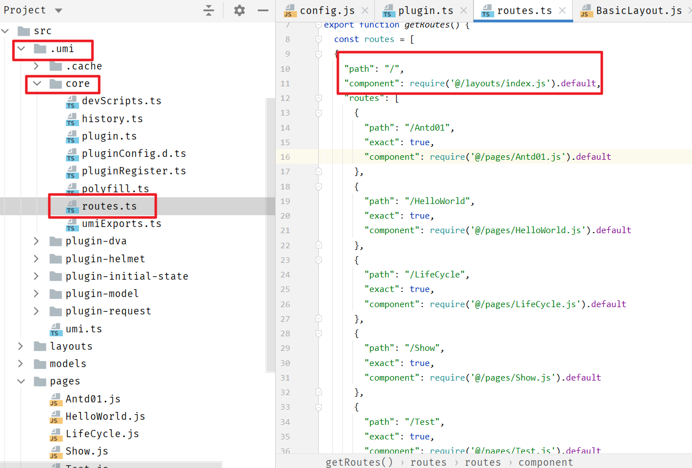

默认的全局路径由 **/umi/core/routes.ts ** 配置

```js
import React from 'react'
import { Layout } from 'antd';

const { Header, Footer, Sider, Content } = Layout;

class BasicLayout extends React.Component{
    render(){
        return (
            <Layout>
                <Sider>Sider</Sider>
                <Layout>
                    <Header>Header</Header>
                    <Content>{this.props.children}</Content>
                    <Footer>Footer</Footer>
                </Layout>
            </Layout>
        );
    }
}

export default BasicLayout;
```

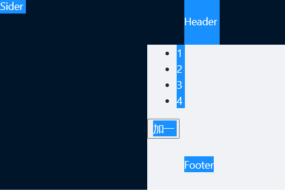

#### 自定义配置布局路由

>   若进行路由配置，表明通过 **手动配置** 的方式进行访问页面，不采用umi默认的路由方式
>
>   -   `routes` 以 **src/pages** 为根目录
>   -   采用手动配置则所有的页面路由均需要手动配置

**config.js**

```js
export default {
    dva: {
        immer: true,
        hmr: false,
    },
    antd: {

    },
    routes: [{
        path: '/',
        component: '../../BasicLayout.js', //配置布局路由
        routes:[
            {
                path: '/test',
                component:'./test'
            },
            {
                path: './tabstest',
                component:'./tabstest'
            }
        ]
    }]
};
```

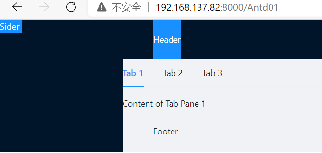


#### 页面美化

```js
import React from 'react'
import { Layout } from 'antd';

const { Header, Footer, Sider, Content } = Layout;

class BasicLayout extends React.Component{
    render(){
        return (
            <Layout>
                <Sider width={256} style={{ minHeight: '100vh', color: 'white' }}>
                    Sider
                </Sider>
                <Layout>
                    <Header style={{ background: '#fff', textAlign: 'center', padding: 0 }}>Header</Header>
                    <Content style={{ margin: '24px 16px 0' }}>
                        <div style={{ padding: 24, background: '#fff', minHeight: 360 }}>
                            {this.props.children}
                        </div>
                    </Content>
                    <Footer style={{ textAlign: 'center' }}>后台系统 ©2018 Created by 黑马程序员</Footer>
                </Layout>
            </Layout>
        );
    }
}

export default BasicLayout;
```

### 导航菜单

#### 安装图标组件包

```shell
npm install --save @ant-design/icons
```

```jsx
import React from 'react'
import { Layout, Menu} from 'antd';
import {PieChartOutlined, DesktopOutlined, InboxOutlined, AppstoreOutlined, MailOutlined} from '@ant-design/icons'

const { Header, Footer, Sider, Content } = Layout;
const SubMenu = Menu.SubMenu;

class BasicLayout extends React.Component{
    constructor(props){
        super(props);
        this.state = {
            collapsed: false,
        }
    }
    render(){
        return (
            <Layout>
                <Sider width={256} style={{ minHeight: '100vh', color: 'white' }}>
                    <div style={{ height: '32px', background: 'rgba(255,255,255,.2)', margin: '16px'}}/>
                    <Menu
                        defaultSelectedKeys={['2']}
                        defaultOpenKeys={['sub1']}
                        mode="inline"
                        theme="dark"
                        inlineCollapsed={this.state.collapsed}
                    >
                        <Menu.Item key="1">
                            <PieChartOutlined />
                            <span>Option 1</span>
                        </Menu.Item>
                        <Menu.Item key="2">
                            <DesktopOutlined />
                            <span>Option 2</span>
                        </Menu.Item>
                        <Menu.Item key="3">
                            <InboxOutlined />
                            <span>Option 3</span>
                            传智播客
                        </Menu.Item>
                        <SubMenu key="sub1" title={<span><MailOutlined /><span>Navigation One</span></span>}>
                            <Menu.Item key="5">Option 5</Menu.Item>
                            <Menu.Item key="6">Option 6</Menu.Item>
                            <Menu.Item key="7">Option 7</Menu.Item>
                            <Menu.Item key="8">Option 8</Menu.Item>
                        </SubMenu>
                        <SubMenu key="sub2" title={<span><AppstoreOutlined /><span>Navigation Two</span></span>}>
                            <Menu.Item key="9">Option 9</Menu.Item>
                            <Menu.Item key="10">Option 10</Menu.Item>
                            <SubMenu key="sub3" title="Submenu">
                                <Menu.Item key="11">Option 11</Menu.Item>
                                <Menu.Item key="12">Option 12</Menu.Item>
                            </SubMenu>
                        </SubMenu>
                    </Menu>
                </Sider>

                <Layout>
                    <Header style={{ background: '#fff', textAlign: 'center', padding: 0 }}>Header</Header>
                    <Content style={{ margin: '24px 16px 0' }}>
                        <div style={{ padding: 24, background: '#fff', minHeight: 360 }}>
                            {this.props.children}
                        </div>
                    </Content>
                    <Footer style={{ textAlign: 'center' }}>后台系统 ©2018 Created by 黑马程序员</Footer>
                </Layout>
            </Layout>
        );
    }
}

export default BasicLayout;
```

#### 导航添加链接

 在 **src/pages/user** 下创建 **UserAdd.js** 和 **UserList.js** 文件，用于模拟实现新增用户和查询用户列表功能

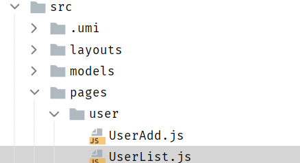

```jsx
import React from 'react';

//UserAdd.js
class UserAdd extends React.Component{
    render() {
        return (
            <div>新增用户</div>
        )
    }
}

export default UserAdd;

import React from 'react';

* ./utils in ./node_modules/jest-config/build/ts3.4/index.d.ts
UserList.js
class UserList extends React.Component{
    render() {
        return (
            <div>用户列表</div>
        )
    }
}

export default UserList;
```

**若是手动配置路由，则需要修改路由配置**

```js
export default {
    dva: {
        immer: true,
        hmr: false,
    },
    antd: {

    },
    routes: [{
        path: '/',
        component: '../../BasicLayout.js', //配置布局路由
        routes:[
            {
                path: '/test',
                component:'./test'
            },
            {
                path: '/tabstest',
                component:'./tabstest'
            },
            {
                path: '/user',
                routes: [
                    {
                        path: '/user/add',
                        component: './user/UserAdd'
                    },
                    {
                        path: '/user/list',
                        component: './user/UserList'
                    }
                ]
            }
        ]
    }]
};
```

**注意**

>   使用了umi的link标签，目的是出现记录点击的菜单 

```jsx
import React from 'react'
import { Layout, Menu} from 'antd';
import {UserOutlined} from '@ant-design/icons';
import {Link} from 'umi';

const { Header, Footer, Sider, Content } = Layout;
const SubMenu = Menu.SubMenu;

class BasicLayout extends React.Component{
    constructor(props){
        super(props);
        this.state = {
            collapsed: false,
        }
    }
    render(){
        return (
            <Layout>
                <Sider width={256} style={{ minHeight: '100vh', color: 'white' }}>
                    <div style={{ height: '32px', background: 'rgba(255,255,255,.2)', margin: '16px'}}/>
                    <Menu
                        defaultSelectedKeys={['2']}
                        defaultOpenKeys={['sub1']}
                        mode="inline"
                        theme="dark"
                        inlineCollapsed={this.state.collapsed}
                    >
                        <SubMenu key="sub1" title={<span><UserOutlined /><span>用户管理</span></span>}>
                            <Menu.Item key="1"><Link to={"/user/add"}>新增用户</Link></Menu.Item>
                            <Menu.Item key="2"><Link to={"/user/list"}>用户列表</Link></Menu.Item>
                        </SubMenu>
                    </Menu>
                </Sider>

                <Layout>
                    <Header style={{ background: '#fff', textAlign: 'center', padding: 0 }}>Header</Header>
                    <Content style={{ margin: '24px 16px 0' }}>
                        <div style={{ padding: 24, background: '#fff', minHeight: 360 }}>
                            {this.props.children}
                        </div>
                    </Content>
                    <Footer style={{ textAlign: 'center' }}>后台系统 ©2018 Created by 黑马程序员</Footer>
                </Layout>
            </Layout>
        );
    }
}

export default BasicLayout;
```


### 表格

[表格文档](https://ant.design/components/table-cn/)

#### 基本用法

```jsx
import React from 'react'
import {Table, Divider, Tag, Pagination } from 'antd';

const {Column} = Table;

const data = [
    {
        key: '1',
        name: '张三',
        age: 32,
        address: '上海市',
        tags: ['程序员', '帅气'],
    }, {
        key: '2',
        name: '李四',
        age: 42,
        address: '北京市',
        tags: ['屌丝'],
    }, {
        key: '3',
        name: '王五',
        age: 32,
        address: '杭州市',
        tags: ['高富帅', '富二代'],
    }];

class UserList extends React.Component {
    render() {
        return (
            <div>
                <Table dataSource={data} pagination= {{position:"bottom",total:500,pageSize:10, defaultCurrent:3}}>
                    <Column title="姓名" dataIndex="name" key="name" />
                    <Column title="年龄" dataIndex="age" key="age" />
                    <Column title="地址" dataIndex="address" key="address" />
                    <Column title="标签" dataIndex="tags" key="tags"
                        render={tags => (
                            <span>{tags.map(tag => <Tag color="blue" key= {tag}>{tag}</Tag>)} </span>
                        )}
                    />
                    <Column  title="操作" key="action"
                        render={(text, record) => (
                            <span>
                                <a href="javascript:;">编辑</a>
                                <Divider type="vertical"/>
                                <a href="javascript:;">删除</a>
                            </span>
                        )}
                    />
                </Table>
            </div>
        );
    }
}

export default UserList;
```


#### 数据分离到model

##### 1. 新建model层

```js
import request from "../utils/request";

export default {
    namespace: 'userList',
    state: {
        list: []
    },
    reducers: {
        queryList(state, result) {
            let data = [...result.data];
            return { //更新状态值
                list: data
            }
        }
    },
    effects: {
        *initData(params, sagaEffects) {
            const {call, put} = sagaEffects;
            const url = "/ds/user/list";
            let data = yield call(request, url);
            yield put({
                type : "queryList",
                data : data
            });
        }
    }
}
```

##### 2. mock数据

```js
export default {
    'GET /ds/user/list': function (req, res) {
        res.json([{
            key: '1',
            name: '张三1',
            age: 32,
            address: '上海市',
            tags: ['程序员', '帅气'],
        }, {
            key: '2',
            name: '李四',
            age: 42,
            address: '北京市',
            tags: ['屌丝'],
        }, {
            key: '3',
            name: '王五',
            age: 32,
            address: '杭州市',
            tags: ['高富帅', '富二代'],
        }]);
    }
}
```

##### 3. 修改UserList.jsx逻辑

```jsx
import request from "../utils/request";

export default {
    namespace: 'userList',
    state: {
        list: []
    },
    reducers: {
        queryList(state, result) {
            let data = [...result.data];
            return { //更新状态值
                list: data
            }
        }
    },
    effects: {
        *initData(params, sagaEffects) {
            const {call, put} = sagaEffects;
            const url = "/ds/user/list";
            let data = yield call(request, url);
            yield put({
                type : "queryList",
                data : data
            });
        }
    }
}
```


##### 4. 新增请求

```jsx
import React from 'react'
import {Table, Divider, Tag, Pagination } from 'antd';
import {connect} from 'dva';

const {Column} = Table;
const namespace = 'userList'

@connect(
    (state)=>{
        return {
            data: state[namespace].list
        }
    },
    (dispatch=>{
        return{
            initData: ()=>{
                dispatch({
                    type: namespace+'/initData'
                })
            }
        }
    })
)
class UserList extends React.Component {

    componentDidMount() {
        this.props.initData();
    }

    render() {
        return (
            <div>
                <Table dataSource={this.props.data} pagination= {{position:"bottom",total:500,pageSize:10, defaultCurrent:3}}>
                    <Column title="姓名" dataIndex="name" key="name" />
                    <Column title="年龄" dataIndex="age" key="age" />
                    <Column title="地址" dataIndex="address" key="address" />
                    <Column title="标签" dataIndex="tags" key="tags"
                        render={tags => (
                            <span>{tags.map(tag => <Tag color="blue" key= {tag}>{tag}</Tag>)} </span>
                        )}
                    />
                    <Column  title="操作" key="action"
                        render={(text, record) => (
                            <span>
                                <a href="javascript:;">编辑</a>
                                <Divider type="vertical"/>
                                <a href="javascript:;">删除</a>
                            </span>
                        )}
                    />
                </Table>
            </div>
        );
    }
}

export default UserList;
```

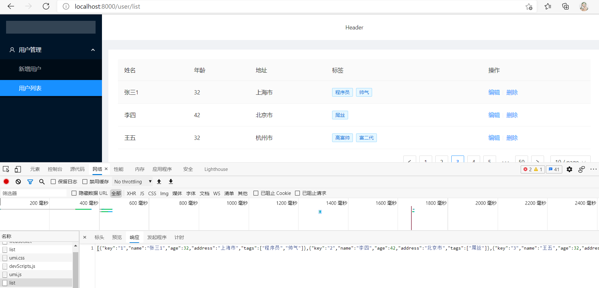

<div style="page-break-after:always" />

## Ant Design Pro

### 简介

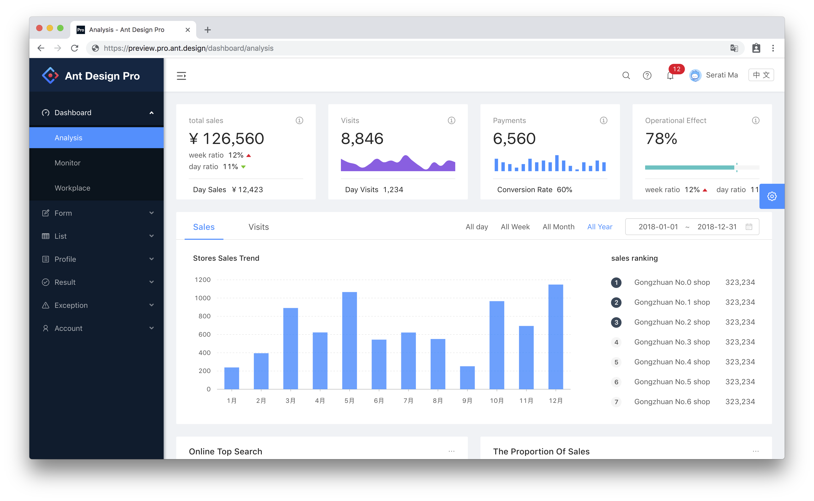

[源码地址](https://github.com/ant-design/ant-design-pro)

Ant Design Pro 是基于 Ant Design 和 umi 的封装的一整套企业级中后台前端/设计解决方案，致力于在设计规范和基础组件的基础上，继续向上构建，提炼出典型模板/业务组件/配套设计资源，进一步提升企业级中后台产品设计研发过程中的『用户』和『设计者』的体验。

### 部署和安装

#### 1. 下载源码&解压


**AntDesign Pro目录**

```
├── config 			#umi 配置，包含路由，构建等配置
├── mock 			#本地模拟数据
├── public
│ └── favicon.png 	# Favicon
├── src
│ ├── assets 		# 本地静态资源
│ ├── components 	# 业务通用组件
│ ├── e2e 			# 集成测试用例
│ ├── layouts 		# 通用布局
│ ├── models 		# 全局 dva model
│ ├── pages 		# 业务页面入口和常用模板
│ ├── services 		# 后台接口服务
│ ├── utils 		# 工具库
│ ├── locales 		# 国际化资源
│ ├── global.less 	# 全局样式
│ └── global.js 	# 全局 JS
├── tests 			# 测试工具
├── README.md
└──package.json
```

#### 2. 导入


#### 3. 初始化及启动

```shell
tyarn install #安装相关依赖
tyarn start #启动服务
```

### 菜单和路由

在 pro 中，菜单和路由，在 `config/router.config.js` 中进行管理

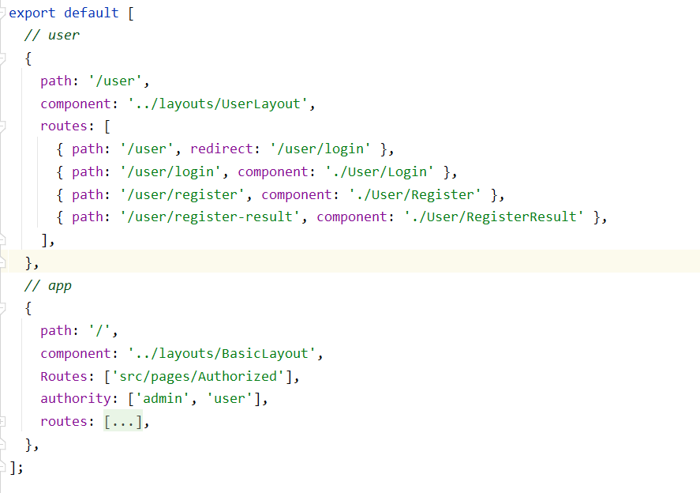

可见， pro 提供两套路由，分别是 `/user` 和 `/app` 


由路由配置可见，登录成功后，会跳转到 `/dashboard`


#### **菜单是由路由的配置生成的**

>   验证

```js
// new
{
    path: '/new',
        name: 'new',
            icon: 'user',
                routes: [
                    {
                        path: '/new/analysis',
                        name: 'analysis',
                        component: './Dashboard/Analysis',
                    },
                    {
                        path: '/new/monitor',
                        name: 'monitor',
                        component: './Dashboard/Monitor',
                    },
                    {
                        path: '/new/workplace',
                        name: 'workplace',
                        component: './Dashboard/Workplace',
                    },
                ],
},
```


#### 在国际化文件中配置文字

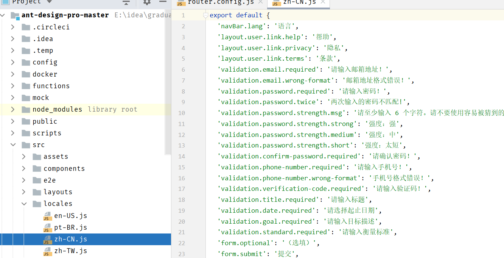

```js
'menu.new': 'New Dashboard',
    'menu.new.analysis': 'New 分析页',
    'menu.new.monitor': 'New 监控页',
    'menu.new.workplace': 'New 工作台',
```

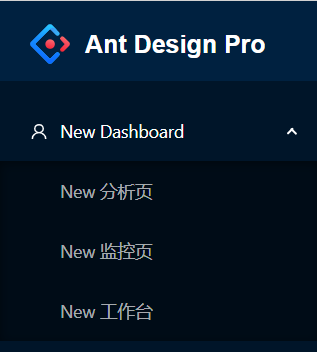

### 新增页面

在 `src/pages` 中，以功能为单元创建目录

```jsx
import React from "react";

// eslint-disable-next-line react/prefer-stateless-function
class NewAnalysis extends React.Component{
  render() {
    return(
      <div>New Analysis</div>
    )
  }
}

export default NewAnalysis;
```

修改路由配置

```js
// new
      {
        path: '/new',
        name: 'new',
        icon: 'user',
        routes: [
          {
            path: '/new/analysis',
            name: 'analysis',
            component: './New/NewAnalysis',
          },
          {
            path: '/new/monitor',
            name: 'monitor',
            component: './Dashboard/Monitor',
          },
          {
            path: '/new/workplace',
            name: 'workplace',
            component: './Dashboard/Workplace',
          },
        ],
      },
```

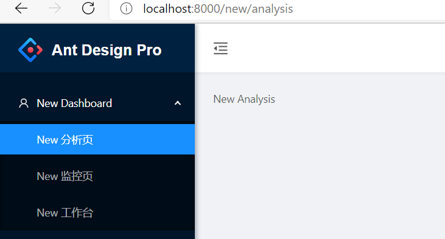

### Pro中model执行流程

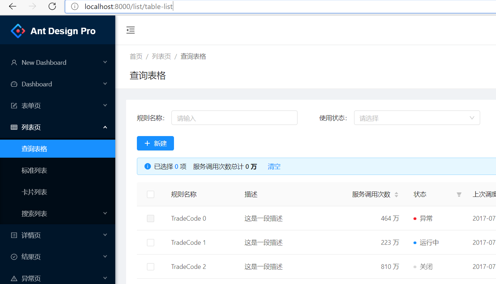

#### 路由即菜单

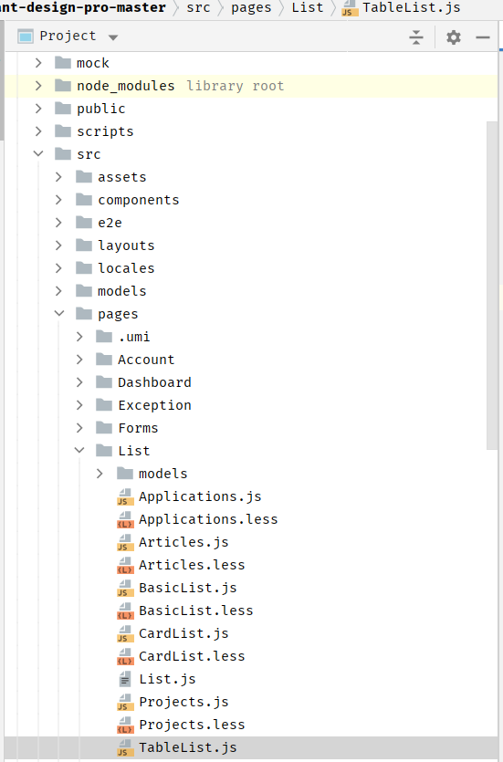


-   在TableList.js中，组件加载完成后进行加载数据 
-   在 `StandardTable` 中，使用Table组件生成表格，其中数据源是 `data` 
-   TableList.js中，data数据从 `构造方法` 中获取到  
-   this.props中的 `rule` 数据，是通过 `@connect` 修饰器获取  
-   数据从 `models/rule.js` 中获取
-   `queryRule` 是在 `/services/api` 中进行了定义 
-   数据的mock是在 `mock/rule.js` 中完成  

## <span id="haoke">AntdPro应用</span>

### 创建工程

### 导入依赖

```shell
tyarn install #安装相关依赖
tyarn start #启动服务
```

#### 修改logo和footer信息


可见，布局是由layout常量定义

##### logo

可见，左侧的菜单是自定义组件

```jsx
{isTop && !isMobile ? null : (
    <SiderMenu
        logo={logo}
        Authorized={Authorized}
        theme={navTheme}
        onCollapse={this.handleMenuCollapse}
        menuData={menuData}
        isMobile={isMobile}
        {...this.props}
        />
)}

//导入
import SiderMenu from '@/components/SiderMenu';
```

打开/components/SideMenu文件

```jsx
return (
      <Sider
        trigger={null}
        collapsible
        collapsed={collapsed}
        breakpoint="lg"
        onCollapse={onCollapse}
        width={256}
        theme={theme}
        className={siderClassName}
      >
        <div className={styles.logo} id="logo">
          <Link to="/">
          	//设置logo的位置
          	<h1>好客租房 · 后台</h1>
          </Link>
        </div>
        <BaseMenu
          {...this.props}
          mode="inline"
          handleOpenChange={this.handleOpenChange}
          onOpenChange={this.handleOpenChange}
          style={{ padding: '16px 0', width: '100%', overflowX: 'hidden' }}
          {...defaultProps}
        />
      </Sider>
    );
```

##### footer

在Footer.js文件中修改版权信息

```jsx
import React, { Fragment } from 'react';
import { Layout, Icon } from 'antd';
import GlobalFooter from '@/components/GlobalFooter';

const { Footer } = Layout;
const FooterView = () => (
  <Footer style={{ padding: 0 }}>
    <GlobalFooter
      copyright={
        <Fragment>
          Copyright <Icon type="copyright" /> 2021 Auspice Tian
        </Fragment>
      }
    />
  </Footer>
);
export default FooterView;
```

### 左侧菜单

**路由即菜单**

修改默认页 `router.config.js`


修改locale `locales=>zh-CN=>settings.js`

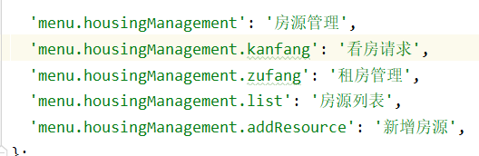

**只有在路由中的命名空间才会被注册** **命名空间名唯一**

### 新增房源

#### 房源表单字段

##### 楼盘数据（estate）

| 字段            |   类型   |   备注   |
| :-------------- | :------: | :------: |
| id              |   Long   |  楼盘id  |
| name            |  String  | 楼盘名称 |
| province        |  String  |  所在省  |
| city            |  String  |  所在市  |
| area            |  String  |  所在区  |
| address         |  String  | 具体地址 |
| year            |  String  | 建筑年代 |
| type            |  String  | 建筑类型 |
| propertyCost    |  String  |  物业费  |
| propertyCompany |  String  | 物业公司 |
| developers      |  String  |  开发商  |
| created         | datetime | 创建时间 |
| updated         | datetime | 更新时间 |

##### 房源数据（houseResources）

| 字段             | 类型     | 备注                                                         |
| ---------------- | -------- | ------------------------------------------------------------ |
| id               | Long     | 房源id                                                       |
| title            | String   | 房源标题，如：南北通透，两室朝南，主卧带阳台                 |
| estateId         | Long     | 楼盘id                                                       |
| buildingNum      | String   | 楼号（栋）                                                   |
| buildingUnit     | String   | 单元号                                                       |
| buildingFloorNum | String   | 门牌号                                                       |
| rent             | int      | 租金                                                         |
| rentMethod       | int      | 租赁方式，1-整租，2-合租                                     |
| paymentMethod    | int      | 支付方式，1-付一押一，2-付三押一，3-付六押一，4-年付押一，5-其它 |
| houseType        | String   | 户型，如：2室1厅1卫                                          |
| coveredArea      | String   | 建筑面积                                                     |
| useArea          | String   | 使用面积                                                     |
| floor            | String   | 楼层，如：8/26                                               |
| orientation      | int      | 朝向：东、南、西、北                                         |
| decoration       | String   | 装修，1-精装，2-简装，3-毛坯                                 |
| facilities       | String   | 配套设施， 如：1,2,3                                         |
| pic              | String   | 图片，最多5张                                                |
| desc             | String   | 房源描述，如：出小区门，门口有时代联华超市，餐饮有川菜馆，淮南牛肉汤，黄焖鸡沙县小吃等；可到达亲水湾城市生活广场，里面有儿童乐园，台球室和康桥健身等休闲娱乐；生活广场往北沿御水路往北步行一公里就是御桥路，旁边就是御桥地铁站，地铁站商场... |
| contact          | String   | 联系人                                                       |
| mobile           | String   | 手机号                                                       |
| time             | int      | 看房时间，1-上午，2-中午，3-下午，4-晚上，5-全天             |
| propertyCost     | String   | 物业费                                                       |
| created          | datetime | 创建时间                                                     |
| updated          | datetime | 更新时间                                                     |

#### antd表单组件

[官网链接](https://ant.design/components/form-cn/#%E4%BD%95%E6%97%B6%E4%BD%BF%E7%94%A8)

高性能表单控件，自带数据域管理。包含`数据录入`、`校验` 以及对应 `样式` 与 `API` 。

[API](https://ant.design/components/form-cn/#API)

被设置了 `name` 属性的 `Form.Item` 包装的控件，表单控件会自动添加 `value`（或 `valuePropName` 指定的其他属性） `onChange`（或 `trigger` 指定的其他属性），数据同步将被 Form 接管，这会导致以下结果：

1.  你**不再需要也不应该**用 `onChange` 来做数据收集同步（你可以使用 Form 的 `onValuesChange`），但还是可以继续监听 `onChange` 事件。
2.  你不能用控件的 `value` 或 `defaultValue` 等属性来设置表单域的值，默认值可以用 Form 里的 `initialValues` 来设置。注意 `initialValues` 不能被 `setState` 动态更新，你需要用 `setFieldsValue` 来更新。
3.  你不应该用 `setState`，可以使用 `form.setFieldsValue` 来动态改变表单值。

在 rules的参数中，可以增加校验规则

```
{
	initialValue:'1',
	rules:[{ 
		required: true, 
		message:"此项为必填项" 
	}]
}
```

#### 表单提交

表单的提交通过submit按钮完成，通过onSubmit方法进行拦截处理  

```jsx
<FormItem {...submitFormLayout} style={{ marginTop: 32 }}>
    <Button type="primary" htmlType="submit" loading={submitting}>
        <FormattedMessage id="form.submit" />
    </Button>
    <Button style={{ marginLeft: 8 }}>
        <FormattedMessage id="form.save" />
    </Button>
</FormItem>
```

```jsx
<Form onSubmit={this.handleSubmit} hideRequiredMark style={{ marginTop: 8 }}>
```

```js
handleSubmit = e => {
    const { dispatch, form } = this.props;
    e.preventDefault();
    console.log(this.state.fileList);
    form.validateFieldsAndScroll((err, values) => {
        
        if (!err) {
            //对设施进行处理
            //1,2,3,4
            //水,电,煤气/天然气,暖气
            if(values.facilities){
                values.facilities = values.facilities.join(",");
            }
            // 3/20
            // 第三层、总共20层
            if(values.floor_1 && values.floor_2){
                values.floor = values.floor_1 + "/" + values.floor_2;
            }
		
            //3室1厅2卫1厨有阳台
            values.houseType = values.houseType_1 + "室" + values.houseType_2 + "厅"
                + values.houseType_3 + "卫" + values.houseType_4 + "厨"
                + values.houseType_2 + "阳台";
            delete values.floor_1;
            delete values.floor_2;
            delete values.houseType_1;
            delete values.houseType_2;
            delete values.houseType_3;
            delete values.houseType_4;
            delete values.houseType_5;

            dispatch({
                type: 'form/submitRegularForm',
                payload: values,
            });
        }
    });
};
```

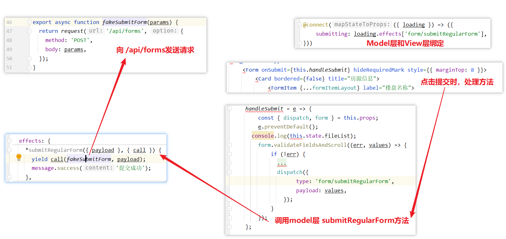

#### 自动完成

[文档](https://ant.design/components/auto-complete-cn/)

**效果**

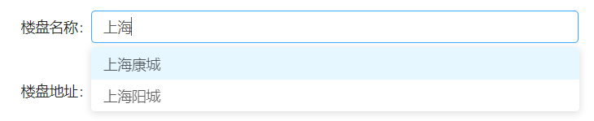


**实现**

```jsx
<AutoComplete
    style={{ width: '100%' }}
    dataSource={this.state.estateDataSource}
    placeholder="搜索楼盘"
    onSelect={(value, option)=>{
        let v = estateMap.get(value);
        this.setState({
            estateAddress: v.substring(v.indexOf('|')+1),
            estateId : v.substring(0,v.indexOf('|'))
        });
    }}
    onSearch={this.handleSearch}
    filterOption={(inputValue, option) => option.props.children.toUpperCase().indexOf(inputValue.toUpperCase()) !== -1}
    />

const estateMap = new Map([
  ['中远两湾城','1001|上海市,上海市,普陀区,远景路97弄'],
  ['上海康城','1002|上海市,上海市,闵行区,莘松路958弄'],
  ['保利西子湾','1003|上海市,上海市,松江区,广富林路1188弄'],
  ['万科城市花园','1004|上海市,上海市,闵行区,七莘路3333弄2区-15区'],
  ['上海阳城','1005|上海市,上海市,闵行区,罗锦路888弄']
]);

// 通过onSearch进行动态设置数据源，这里使用的数据是静态数据
handleSearch = (value)=>{
	let arr = new Array();
	if(value.length > 0 ){
		estateMap.forEach((v, k) => {
			if(k.startsWith(value)){
                arr.push(k);
            }
        });
	}
    this.setState({
        estateDataSource: arr
    });
} ;

// 通过onSelect设置，选择中楼盘数据后，在楼盘地址中填写地址数据
onSelect={(value, option)=>{
	let v = estateMap.get(value);
	this.setState({
        estateAddress: v.substring(v.indexOf('|')+1),
        estateId : v.substring(0,v.indexOf('|'))
	});
}}
```

### 上传图片

图片上传通过自定义组件 `PicturesWall` 完成，在PictureWall中，通过 antd 的 `Upload` 组件实现

**如何解决子组件的值传递到父组件**


-   bind方法可以将子组件(PicturesWall)中的this指向父组件(HousingAdd)的this
    -   在子组件中调用父组件的方法相当于在父组件的上下文中调用该方法，所以该函数的参数在父组件的上下文中也可以获取到
-   父组件通过属性的方式进行引用子组件  ，在子组件中，通过 `this.props` 获取传入的函数，进行调用，即可将数据传递到父组件中

#### this——函数执行时上下文

>    this 的值是在执行的时候才能确认，定义的时候不能确认！

**this 是执行上下文环境的一部分**，而执行上下文需要在代码执行之前确定，而不是定义的时候

```js
var obj = {
    getThis: function() {
        console.log(this);
    }
};

obj.getThis();

var getThisCopy = obj.getThis;

getThisCopy();
```


#### bind

绑定函数，使其无论怎么样调用都用相同的上下文环境

fun.bind(thisArgument, argument1, argument2, ...)

-   thisArgument：在 fun 函数运行时的 this 值，如果绑定函数时使用 new 运算符构造的，则该值将被忽略。

```js
var obj = {
    num: 100,
    numFun: function() {
        console.log(this.num);
    }
};

var numFunCopy = obj.numFun;

numFunCopy();
```


在 `Window` 上下文中，没有 num 值，num的值是在 `obj` 中定义的

所以引入 `bind()` 解决 this 不能够指向原来的问题

```js
var obj = {
    num: 100,
    numFun: function(){
        console.log(this.num);
    }

}

var numFunCopy = obj.numFun;

obj.numFun();

numFunCopy.bind(obj)();
```

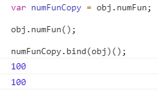