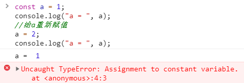
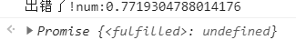
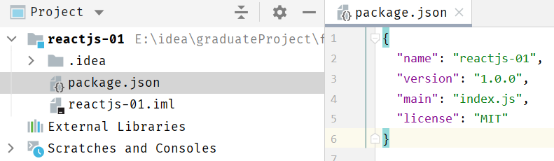
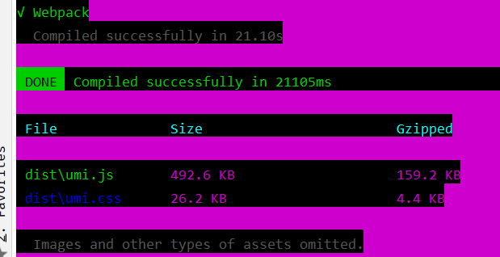
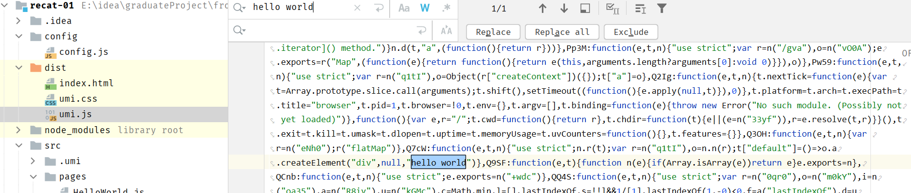
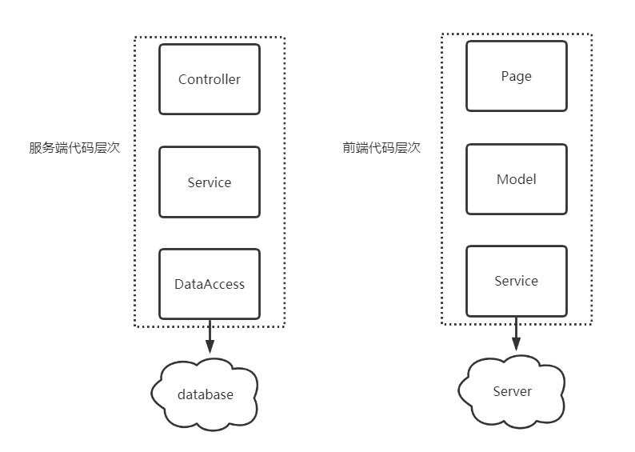
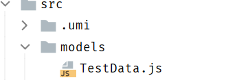
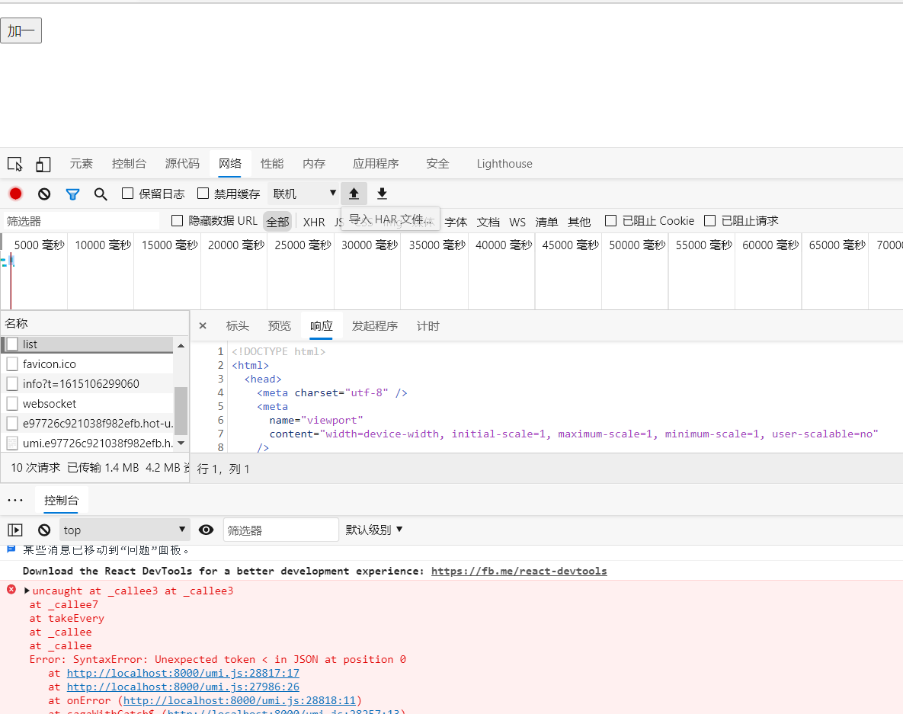
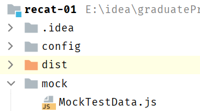

# ReactJS

## ES6新特性

ES6，是ECMAScript 6的简称,JavaScript 的下一代标准，2015 年发布。目标是使JavaScript可用于编写复杂的大型应用程序，称为企业级开发语言。

### ECMAScript

前端的发展历程

>   Web1.0

最初的网页以HTML为主，是纯静态的网页。网页是只读的，信息流只能从服务的到客户端单向流通。**开发人员也只关心页面的样式和内容**即可。

>   Web2.0

-   1995年，网景工程师Brendan Eich 花了10天时间设计了JavaScript语言。

-   1996年，微软发布了JScript，其实是JavaScript的逆向工程实现。

-   1997年，为了统一各种不同script脚本语言，ECMA（欧洲计算机制造商协会）以JavaScript为基础，制定了ECMAscript 标准规范。

    JavaScript和JScript都是 ECMAScript 的标准实现者，随后各大浏览器厂商纷纷实现了ECMAScript 标准。

所以，**ECMAScript是浏览器脚本语言的规范**，而各种我们熟知的js语言，如**JavaScript则是规范的具体实现**

#### ECMAScript的发展历程

-   1998年6月，ECMAScript 2.0 发布

-   1999年12月，ECMAScript 3.0 发布。这时，ECMAScript 规范本身也相对比较完善和稳定了，但是接下来的事情，就比较悲剧了。

-   2007年10月，ECMAScript 4.0 草案发布。

    这次的新规范，历时颇久，规范的新内容也有了很多争议。在制定ES4的时候，是分成了两个工作组同时工作的。  

    -   一边是以 Adobe, Mozilla, Opera 和 Google为主的 ECMAScript 4 工作组
    -   一边是以 Microsoft 和 Yahoo 为主的 ECMAScript 3.1 工作组

    ECMAScript 4 的很多主张比较激进，改动较大。而 ECMAScript 3.1 则主张小幅更新。最终经过 TC39 的会议，决定将一部分不那么激进的改动保留发布为 ECMAScript 3.1，而ES4的内容，则延续到了后来的ECMAScript5和6版本中

-   2009年12月，ECMAScript 5 发布。

-   2011年6月，ECMAScript 5.1 发布。

-   2015年6月，ECMAScript 6，也就是 ECMAScript 2015 发布了。 并且从 ECMAScript 6 开始，开始采用年号来做版本。即 ECMAScript 2015，就是ECMAScript6。  

-   2016年 6月，小幅修订的《ECMAScript 2016标准》 (简称 ES2016)如期发布， 这个版本可以看作是 ES6.1版，因为两者的差异非常小(只新增了数组实例的 includes 方法 和指数运算符)，基本上可以认为是同 一个标准

-   2017 年 6 月发布了ES2017 标准 

因此， ES6 既是一个历史名词，也是一个泛指，含义是 5.1 版本以后的 JavaScript 的下一代 标准，涵盖了 ES2015、ES2016、 ES2017 等，而 ES2015 则是正式名称，特指当年发布的正式版本的语言标准

### let 和 const 命令

>   var

之前，我们写js定义变量的时候，只有一个关键字： `var`
var 有一个问题，就是定义的变量有时会莫名奇妙的成为全局变量  

例如这样的一段代码：

```js
for(var i = 0; i < 5; i++){
	console.log(i);
}
console.log("循环外：" + i)
```

运行结果:


可以看出，在循环外部也可以获取到变量i的值，显然变量i的作用域范围太大了，在做复杂页面时，会带来很大的问题。

>   let

`let` 所声明的变量，只在 let 命令所在的代码块内有效

```js
for(let i = 0; i < 5; i++){
	console.log(i);
}
console.log("循环外：" + i)
```

结果:


这样就把变量的作用域控制在了循环内部

>   const

`const` 声明的变量是常量，不能被修改，类似与java中的 `final` 关键字

```js
const a = 1;
console.log("a = ", a);
//给a重新赋值
a = 2;
console.log("a = ", a);
```



可以看到，变量a的值是不能修改的。  

### 字符串扩展

-   `include()`:返回 boolean，表示是否找到参数字符串

-   `startWith()`：返回 boolean,表示参数字符串是否在原字符串的头部
-   `endWith()`:返回 boolean,表示参数字符串是否在原字符串的尾部

```js
let str = "hello heima";
console.log(str, " 中是否包含了heima => ", str.includes("heima"));
console.log(str, " 中是否包含了baima => ", str.includes("baima"));
console.log(str, " 中是否以h开头 => ", str.startsWith("h"));
console.log(str, " 中是否以a开头 => ", str.startsWith("a"));
console.log(str, " 中是否以a结束 => ", str.endsWith("a"));
console.log(str, " 中是否以h结束 => ", str.endsWith("h"));
```


>   字符串模板

ES6中提供了 ` 来作为字符串模板标记 

```js
let str = `
hello
itheima
itcast
`;
console.log(str);
```


在两个 **`** 之间的部分都会被作为字符串的值，可以任意换行  

### _解构表达式_

什么是解构？

>   ES6中允许按照一定模式从数组和对象中提取值，然后对变量进行赋值，这被称为解构 (Destructuring)  

#### 数组结构

```js
let arr = [1,2,3]
```

之前，获取其中的值，只能通过下标

```js
let arr = [1,2,3]
const [x,y,z] = arr;// x，y，z将与arr中的每个位置对应来取值
// 然后打印
console.log(x,y,z);

const [a] = arr; //只匹配1个参数
console.log(a)
```

结果：


#### 对象解构

```js
const person = {
    name: "jack",
    age: 21,
    language: ['java','js','css']
}

//解构表达式获取值
const {name,age,language} = person;

//打印
console.log(name)
console.log(age)
console.log(language)
```

结果：


如果想要用其他变量接收，需要额外指定别名：


-   `{name:n}`:name是person中的属性名，冒号后面的n是解构要赋值给的变量。

### 函数优化

#### 函数参数默认值

```js
//ES6以前无法给一个函数参数设置默认值，只能采用变通写法
function add(a,b){
    //判断b是否为空，为空就赋默认值1
    b = b || 1;
    
    return a+b;
}

console.log(add(10));
```

ES6

```js
function add(a,b=1){
    return a+b;
}

//传一个参数
console.log(add(10))
```

#### 箭头函数

一个参数时：

```js
var print = function(obj){
    console.log(obj)
}

//简写为：
var print2 = obj ==> console.log(obj)
```

多个参数：

```js
//两个参数情况:
var sum = function(a,b){
    return a+b;
}

//简写为：
var sum2 = (a,b) ==> a+b;
```

没有参数：

```js
// 没有参数时，需要通过()进行占位，代表参数部分
let sayHello = () => console.log("hello!");
sayHello();
```

代码不止一行，可以用 `{}` 括起来

```js
var sum3 = (a,b) => {
	return a + b;
} 

// 多行，没有返回值
let sayHello = () => {
    console.log("hello!");
    console.log("world!");
}

sayHello();
```

#### 对象的函数属性简写

比如一个Person对象，里面有eat方法：

```js
let person = {
    name: "jack",
    // 以前：
    eat: function (food) {
    	console.log(this.name + "在吃" + food);
	},
    // 箭头函数版：
    eat2: food => console.log(person.name + "在吃" + food),
    // 这里拿不到this
    // 简写版：
    eat3(food){
    	console.log(this.name + "在吃" + food);
    }
}
```

#### 箭头函数结合解构表达式

比如有一个函数

```js
const person = {
    name: "jack",
    age: 21,
    language: ['java','js','css']
}

function hello(person){
    console.log("hello," + person.name)
}
```

箭头函数和解构表达式

```js
var hi = ({name}) => console.log("hello"+name);

hi(person)
```

### _map和reduce_

ES6中，数组新增了map和reduce方法

#### map

`map()`：接受一个函数，将原数据中的所有元素用这个函数处理后放入新数组返回

```js
let arr = ['1','20','-5','3'];
console.log(arr)

let newArr = arr.map(s => parseInt(s));

console.log(newArr)
```


#### reduce

`reduce()`：接收一个函数(必须)和一个初始值(可选)，该函数接收两个参数：

-   第一个参数为上一次 reduce() 处理的结果
-   第二个参数是数组中要处理的下一个元素

`reduce()`会从左到右依此把数组中的元素用reduce处理，并把处理的结果作为下次reduce的第一个参数。如果是第一次，会把前两个元素作为计算参数，或者把用户指定的参数值作为起始参数

```js
const arr = [1,20,-5,3]
```

没有初始值:


指定初始值：


### _扩展运算符_

(spread)是三个点(...)，将一个数组转为用逗号分隔的参数序列

```js
console.log (...[1, 2, 3]); //1 2 3
console.log(1, ...[2, 3, 4], 5); // 1 2 3 4 5

function add(x, y) {
	return x + y;
} 
var numbers = [1, 2];
console.log(add(...numbers)); // 3

//数组合并
let arr = [...[1,2,3]...[4,5,6]];
console.log(arr);//[1,2,3,4,5,6]

//与解构表达式结合
const [first,...,rest] = [1,2,3,4,5];
console.log(first,rest)//1 [2,3,4,5]

//将字符串转成数组
console.log([...'hello'])//["h","e","l","l","o"]
```

### _Promise_

所谓Promise，简单说就是一个容器，里面保存着某个未来才会结束的事件（**通常是一个异步操作**）的结果。从语法上说，Promise 是一个对象，从它可以获取异步操作的消息。Promise 提供统一的 API，各种异步操作都可以用同样的方法进行处理  

我们可以通过Promise的构造函数来创建Promise对象，并在内部封装一个异步执行的结果 

如果我们想要等待异步执行完成，做一些事情，我们可以通过promise的then方法来实现 

如果想要处理promise异步执行失败的事件，还可以跟上catch：  

```js
const promise = new Promise(function(resolve, reject) {
    // ... 执行异步操作
    if (/* 异步操作成功 */){
    	resolve(value);// 调用resolve，代表Promise将返回成功的结果
    } else {
    	reject(error);// 调用reject，代表Promise会返回失败结果
    }
});

promise.then(function(value){
	// 异步执行成功后的回调
}).catch(function(error){
	// 异步执行失败后的回调
})
```

示例：

```js
const p = new Promise(function(resolve,reject){
    //这里使用定时任务模拟异步
    setTimeout(()=>{
        const num = Math.random();
        //随机返回成功或失败
        if(num<0.5){
            resolve("成功!num:"+num)
        }else{
            reject("出错了!num:"+num)
        }
    },300)

})

// 调用promise
p.then(function (msg) {
    console.log(msg);
}).catch( function (msg) {
    console.log(msg);
})
```



### set 和 map

#### Set

本质与数组类似。不同在于Set中只能保存不同元素，如果元素相同会被忽略。和Java中的Set集合相似。

构造函数：

```js
//Set构造可以接收一个数组或空
let set = new Set();
set.add(1);//[1]
//接收数组
let set2 = new Set([2,3,4,5]);//得到[2,3,4,5]
```

方法：

```java
set.add(1);//添加
set.clear();//清空
set.delete(2);//删除指定元素
set.has(2);//判断是否存在
set.forEach(function())//遍历元素
set.size;//元素个数。是属性不是方法
```

#### Map

本质是与Object类似的结构。不同在于Object强制规定key只能是字符串。而Map结构的ket可以是任意对象，即：

-   Object是 `<String,Object>` 集合
-   Map是`<Object,Object>`集合

构造函数：

```js
//map接收一个数组，数组中的元素是键值对数组
const map = new Map([
    ['key1','value1'],
    ['key2','value2']
])
//或者接收一个set
const set = new Set({
    ['key1','value1'],
    ['key2','value2']
})
const map2 = new Map(set)
//或者其他map
const map3 = new Map(map)

//方法
map.set(key,value);//添加
map.clear();//清空
map.delete(key);//删除指定元素
map.has(key);//判断是否存在
map.forEach(function(key,value){})//遍历元素
map.size;//元素个数。是属性不是方法

map.values()//获取value的迭代器
map.keys()//获取key迭代器
map.entries()//获取entry迭代器

用法
for(let key of map.keys()){
    console.log(key)
}
等价于：
console.log(...map.values());//通过扩展运算符展开
```

### Class的基本语法

JS传统方法是通过构造函数定义并生成新对象。ES6中引入class，通过`class`关键字自定义类

```js
class User{
	constructor(name, age = 20){ // 构造方法
		this.name = name; // 添加属性并且赋值
		this.age = age;
	} 
    sayHello(){ // 定义方法
		return "hello";
	}
    
    static isAdult(age){ //静态方法
        if(age >= 18){
            return "成年人";
        } 
        return "未成年人";
	}
}

let user = new User("张三");

// 测试
console.log(user); // User {name: "张三", age: 20}
console.log(user.sayHello()); // hello
console.log(User.isAdult(20)); // 成年人
```

类的继承：

```js
class User{
	constructor(name, age = 20){ // 构造方法
		this.name = name; // 添加属性并且赋值
		this.age = age;
	} 
    sayHello(){ // 定义方法
		return "hello";
	}
    
    static isAdult(age){ //静态方法
        if(age >= 18){
            return "成年人";
        } 
        return "未成年人";
	}
}

class zhangsan extends User{
	constructor(){
        super("张三",30);
        //如果父类中构造方法有参数，那么子类必须通过super调用父类的构造方法
    	this.address = "上海"；//设置子类中的属性，位置必须位于super之下
    }
}

// 测试
let zs = new ZhangSan();
console.log(zs.name, zs.address);//张三上海
console.log(zs.sayHello());//hello
console.log(ZhangSan.isAdult(20));//成年人
```

### _Generator函数_

Generator 函数是 ES6 提供的 一种 **异步** 编程解决方案 。

两个特征：

-   function命令与函数名之间有一个 `*`
-   函数体内部使用 `yield` 语句定义不同的内部状态

```js
function* hello () {
    yield "hello";
    yield "world";
    return "done";
} 

let h = hello();

console.log(h.next()); //{value: "hello", done: false}
console.log(h.next()); //{value: "world", done: false}
console.log(h.next()); //{value: "done", done: true}
console.log(h.next()); //{value: undefined, done: true}
```

可以看到，通过hello()返回的h对象，每调用一次next()方法返回一个对象，该对象包含了value值和done状态。直到遇到return关键字或者函数执行完毕，这个时候返回的状态为ture，表示已经执行结束了 .

#### for...of 循环

通过for...of可以循环遍历Generator函数返回的迭代器  

```js
function* hello () {
    yield "hello";
    yield "world";
    return "done";
} 

let h = hello();
for (let obj of h) {
	console.log(obj);
}

// 输出：
hello
world
```

### _修饰器_

修饰器(Decorator)是一个函数， 用来修改类的行为。 ES2017 引入了这项功能， 目前 Babel 转码器己经支持

```js
@T //通过@符号进行引用该方法，类似java中的注解
class User {
    constructor(name, age = 20){
    this.name = name;
    this.age = age;
    }
} 

function T(target) { //定义一个普通的方法
    console.log(target); //target对象为修饰的目标对象，这里是User对象
    target.country = "中国"; //为User类添加一个静态属性country
}

console.log(User.country); //打印出country属性值
```

运行报错：


原因是，在ES6中，并没有支持该用法，在ES2017中才有，所以我们不能直接运行了，需要进行编码后再运行。
转码的意思是：将ES6或ES2017转为ES5执行。类似这样：  

```js
//转码前
input.map(item =>item + 1);

//转码后
input.map(function (item) {
	return item + 1;
})
```

### 转码器

-   Babel (babeljs.io)是一个广为使用的 ES6 转码器，可以将 ES6 代码转为 ES5 代码，从而在浏览器或其他环境执行  
-   Google 公司的 Traceur 转码器 Cgithub.com/google/traceur-compiler)， 也可 以将 ES6 代码转为ES5的代码

### UmiJS

[官网](https://umijs.org/zh-CN)

**零配置前端构建工具**

特点：

-   插件化
    -   umi的整个生命周期都是插件化的，甚至其内部实现就是由大量插件组成，比如pwa,按需加载，一键切换preact一键兼容ie9等
-   开箱即用
    -   只需安装umi依赖
-   约定式路由
    -   类 next.js 的约定式路由，无需再维护一份冗余的路由配置，支持权限，动态路由，嵌套路由等

#### _安装部署_

```properties
#首先，需要安装Node.js
#在资料中，找到node-v8.12.0-x64.msi，一路下一步安装
#安装完成后，通过node -v 命令查看其版本号
>node -v
v8.12.0

#接下来，开始安装yarn，其中tyarn使用的是npm.taobao.org的源，速度要快一些
#可以把yarn看做了优化了的npm
#-g 是指全局安装
npm i yarn tyarn -g
#进行测试，如果能够正常输出版本信息则说明安装成功了
tyarn -v 

#如果安装失败，是由于将yarn添加到环境变量中导致

#下面开始安装umi
tyarn global add umi
umi #进行测试
```

#### 快速入门

```js
#通过初始化命令将生成package.json文件，它是 NodeJS 约定的用来存放项目的信息和配置等信息的文件。
tyarn init -y

#通过umi命令创建index.js文件
#可以看到在pages下创建好了index.js和index.css文件
umi g page index 

#将下面内存拷贝到index.js文件中进行测试
@T //通过@符号进行引用该方法，类似java中的注解
class User {
    constructor(name, age = 20){
        this.name = name;
        this.age = age;
	}
}

function T(target) { //定义一个普通的方法
	console.log(target); //target对象为修饰的目标对象，这里是User对象
	target.country = "中国"; //为User类添加一个静态属性country
} 
console.log(User.country); //打印出country属性值

#通过命令行启动umi的后台服务,用于本地开发
umi dev
#通过浏览器进行访问：http://localhost:8000/，查看效果
#值得注意的是，这里访问的是umi的后台服务，不是idea提供服务
```


编译后的目录如下：


运行结果如下：


查看编码后的JS文件：


### 模块化

将代码进行拆分，方便重复利用。类似java中的导包：要使用一个包，必须先导包

模块： `export` 和 `import`

-   `export` ：用于规定模块的对外接口
-   `import`：用于导入其他模块提供的功能

#### export

```js
class Util {
	static sum = (a, b) => a + b;
} 

//导出该类
export default Util;
```

#### import

使用 `export` 定义了模块的对外接口后，其他js文件就可以通过 `import` 命令来加载这个模块

```js
//Index.js
//导入Util类
import Util from './Util'

//使用Util中的sum方法
console.log(Util.sum(1, 2));
```

<div style="page-break-after:always" />

## ReactJS

### 前端开发四个阶段

>   1.  静态页面阶段

在第一个阶段中前端页面都是静态的，所有前端代码和前端数据都是后端生成的，前端纯粹只是增加一些特殊效果。

后端MVC模式

-   Model(模型层)：提供/保持数据
-   Controller(控制层)：数据处理，实现业务逻辑
-   View（视图层）：展示数据，提供用户界面

此时的前端只是后端MVC中的V

>   2.  ajax阶段

2004年AJAX诞生，改变了前端开发。Gmail和Google地图这样革命性产品出现，使前端的作用不再是展示页面，还可以管理数据并与用户互动

>   3.  前端MVC阶段

把MVC模式照搬到了前端，只有 M(读写数据)和V(展示数据)，没有C(处理数据)

有些框架提出 MVVM模式，用View Model代替Controller。Model拿到数据后，View Model将数据处理成视图层(View)需要的格式

>   4.  SPA阶段

前端可以做到读写数据，切换视图，用户交互。网页其实是一个应用程序，而不是信息的纯展示。这种单张网页的应用程序称为SPA

2010年后，前端工程师从开发页面(切模板)，逐渐变成了开发“前端应用”，跑在浏览器里面的应用


目前，流行的前端框架 `Vue`,`React`都属于SPA开发框架

### ReactJS简介


[官网](https://reactjs.org/)

>   **用于构建用户界面的JavaScript框架**，由Facebook开发
>
>   ReactJS把复杂的页面，拆分成一个个的组件，将这些组件拼装起来，就会呈现一个页面

ReactJS可用于MVC、MVVM等架构

#### React框架分类

-   Flux
    -   利用一个单向的数据流补充了React的组合视图组件，更像一种模式而非框架
-   Redux
    -   JS状态容器，提供可预测的状态管理，Redux使**组件状态共享**变得简单
-   Ant Design of React
    -   阿里开源的基于React的企业级后台产品，继承了多种React框架
    -   Ant Design提供了丰富的组件，包括：按钮、表单、表格、布局、分页、树组件、日历等

### Helloworld

#### 1. 新建static web项目


#### ==2. 初始化项目,添加umi依赖==

```shell
tyarn init -y
```




```shell
tyarn add umi --dev
```


#### 3. 编写HelloWorld程序

##### 1. ==在工程的根目录下新建`config/config.js`==

在UmiJS的约定中，config/config.js将作为UmiJS的全局配置文件


在Umi中，约定的目录结构如下:


在config.js文件中输入，以便后面使用：

```js
//导出一个对象，暂时设置为空对象，后面再填充内容
export default{};
```

##### 2. 创建HelloWorld.js页面文件

在Umi中，约定存放页面代码的文件夹在 `src/pages` ，可以通过 `singular:false`来设置单数的命名方式


在HelloWorld.js中输入如下内容：

```js
export default () => {
	return <div>hello world</div>;
}
```

##### 3. ==构建和部署==

我们写的js，必须通过umi先转码后才能正常执行。

```shell
umi build
```





可见打包成功

##### 4. 启动服务，查看页面效果

```shell
# 启动服务
umi dev
```

可以看到，通过 `/HelloWorld` 即可访问到刚写的HelloWorld.js文件

在umi中，可以使用约定式的路由，将在pages下的JS文件都会按照文件名映射到一个路由


##### ==5. 添加 `umi-plugin-react` 插件==

>   umi-plugin-react插件是umi官方基于react封装的插件 

[链接](https://umijs.org/zh-CN/docs/upgrade-to-umi-3)

```shell
#添加插件
tyarn add @umijs/preset-react --dev
```


在config.js中引入该插件

```js
export default{
    dva: {},
    antd: {}
};
```

### 1. JSX语法

>   JSX语法就是，可以在js文件中插入html片段，是React自创的一种语法 
>
>   JSX语法会被Babel等转码工具进行转码，得到正常的js代码再执行

**注意**

1.  所有的html标签必须是闭合的  

2.  在JSX语法中，只能有一个根标签，不能有多个

    ```jsx
    const div1 = <div><div>hello</div> <div>world</div></div>//正确
    const div2 = <div>hello</div> <div>world</div> //错误
    ```

3.  在JSX语法中，如果想要在html标签中插入js脚本，需要通过 `{}` 插入js脚本

    ```jsx
    export default()=>{
        const fun = () =>"黑马程序"
    
        return (
            <div><div>{fun()}</div> <div>hello world</div></div>
        );
    }
    ```

### 2. 组件

#### 自定义组件

```jsx
import React from "react";
//1. 导入React

class HelloWorld extends React.Component{
//2. 继承React.Component
    render(){//3. 重写render()方法，用于渲染页面
        return <div>Hello World</div>
    }
}

//4. 导出该类
export default HelloWorld;
```

#### 导入自定义组件

```jsx
import React from "react";
import HelloWorld from "./HelloWorld";

class Show extends React.Component{
    render() {
        return (
            <div>
                <HelloWorld></HelloWorld>
            </div>
        );
    }
}

export default Show;
```

#### 组件参数

```jsx
import React from "react";
//1. 导入React

class HelloWorld extends React.Component{
//2. 继承React.Component
    render(){//3. 重写render()方法，用于渲染页面
        return (
            <div>
                <div>Hello World</div>
                <div>lastName={this.props.lastName}</div>
                <div>{this.props.children}</div>
            </div>
        );
    }
}

//4. 导出该类
export default HelloWorld;
```


```jsx
import React from "react";
import HelloWorld from "./HelloWorld";

class Show extends React.Component{
    render() {
        return (
            <div>
                <HelloWorld lastName={"Auspice"}>Tian</HelloWorld>
            </div>
        );
    }
}

export default Show;
```


-   属性名：属性传递通过 `this.prop.[]`
-   内容传递：内容传递通过 `this.props.children`

#### 组件的状态

每一个 **页面组件** 都有一个状态，其保存在 `this.state` 中，当状态值发生变化时，React框架会自动调用 `render()` 方法，重新渲染画面

**注意**

-   this.state值的设置要在构造参数中完成，不能直接对 `this.state` 修改
-   要修改this.state的值，需要调用 `this.setState()` 完成

案例：用过点击按钮，不断更新this.state，从而反映到页面

```jsx
import React from "react";

class Test extends React.Component{
    constructor(props) {//构造函数中必须有props参数
        super(props);//调用父类构造方法
        this.state = {//初始化state
            dataList:[1,2,3],
            maxItem:3
        }
    }

    render() {
        return (
            <div>
                <ul>
                    {//遍历值
                        this.state.dataList.map((value, index) => {
                            return <li key={index}>{value}</li>
                        })
                    }
                </ul>
                <button onClick={()=>{//为按钮添加点击事件
                    let maxItem = this.state.maxItem+1;
                    let newArr = [...this.state.dataList,maxItem]
                    this.setState({
                        dataList:newArr,
                        maxItem:maxItem
                    })

                }}>加一</button>
            </div>
        );
    }
}

export default Test;
```


#### 生命周期

组件运行过程中，存在不同的阶段。React为这些阶段提供了钩子方法(生命周期方法lifestyle methods)，允许开发者自定义每个阶段自动执行的函数。


```jsx
import React from 'react'; //第一步，导入React
class LifeCycle extends React.Component {
	constructor(props) {
    super(props);
    //构造方法
    console.log("constructor()");
	} 
    
    componentDidMount() {
        //组件挂载后调用
        console.log("componentDidMount()");
	} 
    
    componentWillUnmount() {
        //在组件从 DOM 中移除之前立刻被调用。
        console.log("componentWillUnmount()");
    } 
    
    componentDidUpdate() {
        //在组件完成更新后立即调用。在初始化时不会被调用。
        console.log("componentDidUpdate()");
    } 
    shouldComponentUpdate(nextProps, nextState){
        // 每当this.props或this.state有变化，在render方法执行之前，就会调用这个方法。
        // 该方法返回一个布尔值，表示是否应该继续执行render方法，即如果返回false，UI 就不会更新，默认返回true。
        // 组件挂载时，render方法的第一次执行，不会调用这个方法。
    	console.log("shouldComponentUpdate()");
    }
    
    render() {
        return (
        <div>
        <h1>React Life Cycle!</h1>
        </div>
        );
	}
} 

export default LifeCycle;
```


### 3. Model

**分层**



服务端系统：

-   Controller负责与用户直接打交道，渲染页面、提供接口等，侧重于展示型逻辑
-   Service负责处理业务逻辑，供Controller层调用
-   DataAccess 层负责与数据源对接，进行纯粹的数据读写，供Service层调用

前端代码结构：

-   Page负责与用户直接打交道：侧重于展示型交互逻辑
    -   渲染页面
    -   接受用户的操作输入
-   Model负责处理业务逻辑，为Page做数据、状态的读写、变换、暂存等
-   Service负责与HTTP接口对接，进行纯粹的数据读写

#### 使用dva进行数据分层管理

[dva官网](https://dvajs.com/)

[umi-dva插件](https://umijs.org/zh-CN/plugins/plugin-dva)

`@Connect(mapModelToProps,mapDispatcherToProps)`

>   将model层中数据及函数绑定到page层

1.  mapModelToProps：
    -   将page层和model层进行连接
    -   返回model中的数据
    -   将返回的数据绑定到this.props中
2.  mapDispatcherToProps
    -   将定义的函数绑定到this.props中
    -   调用model层(reducers)中定义的函数

##### 1. _引入dva框架_

umi对dva进行了整合，在 **config.js** 中进行配置：

```js
export default {
    dva: {
        immer: true,
        hmr: false,
    },
};
```

##### 2. _创建model文件_

umi中，约定 `src/models` 文件夹中定义model



```js
export default {
    namespace:'TestData',
    state:{
        dataList:[1,2,3],
        maxItem:3
    }
}
```

##### 3. _将model层数据导入page层_

```jsx
import React from "react";
import {connect} from "umi";

const namespace = "TestData";

// connect第一个回调函数，作用：将page层和model层进行链接，返回model中的数据
//并将返回到数据绑定到 this.props
@connect((dvaState)=>{
    return {
        dataList:dvaState[namespace].dataList,
        maxItem: dvaState[namespace].maxItem
    }
})
class Test extends React.Component{
    render() {
        return (
            <div>
                <ul>
                    {//遍历值
                        this.props.dataList.map((value, index) => {
                            return <li key={index}>{value}</li>
                        })
                    }
                </ul>
            </div>
            ...
            );
    }
}

export default Test;
```

**流程**

1.  umi框架启动，会自动读取**models**目录下文件
2.  `@Connect`修饰符的第一个参数，接受一个方法，该方法必须返回 `{}(对象)`，将接收到model数据
3.  全局model中，通过 `namespace` 进行区分，所以通过 `state[namespace]` 进行数据获取
4.  返回的数据会被封装到 `this.props` 中，所以通过 `this.props.data` 获取到model中的数据

##### 4. _更新model中定义的数据_

```js
export default {
    namespace:'TestData',
    state:{
        dataList:[1,2,3],
        maxItem:3
    },
    reducers:{//定义一些函数
        addNewData:function (state){//state为修改前state
            let maxItem = state.maxItem+1;
            let newArr = [...state.dataList,maxItem]
            return {//通过return返回更新后的数据
                dataList:newArr,
                maxItem:maxItem
            }
        }
    }
}
```

```jsx
import React from "react";
import {connect} from "umi";

const namespace = "TestData";

@connect(
    (dvaState)=>{
        return {
            dataList:dvaState[namespace].dataList,
            maxItem: dvaState[namespace].maxItem
        }
    },
    (dvaDispatch)=>{
        //dvaDispatch : 可以调用model层定义的函数
        return{
            add:function(){
                dvaDispatch({
                //通过dvaDispatcher调用model层定义的函数
                //@param : type——指定函数名 
                    //namespace/函数名
                    type:namespace+"/addNewData"
                })
            }
        }
    }
)
class Test extends React.Component{

    render() {
        return (
            <div>
                <ul>{//遍历值
                     this.props.dataList.map((value, index) => {
                         return <li key={index}>{value}</li>
                     })
                }
                </ul>
                <button onClick={()=>{
                    this.props.add();
                }}>加一</button>
            </div>
        );
    }
}

export default Test;
```

**流程**

1.  page层绑定的事件触发 `dvaDispatcher()` 方法执行
2.  调用 `model` 层 `reducers` 中的方法
3.  返回更新后的 `state`
4.  触发 ui更新，调用 `render` 方法

#### Model中异步请求数据

##### 1. 请求工具类

`src/utils` 目录下创建 `request.js` ，用于异步请求数据

```js
function checkStatus(response) {
    if (response.status >= 200 && response.status < 300) {
        return response;
    }

    const error = new Error(response.statusText);
    error.response = response;
    throw error;
}

/**
* Requests a URL, returning a promise.
* @param {string} url The URL we want to request
* @param {object} [options] The options we want to pass to "fetch"
* @return {object} An object containing either "data" or "err"
*/
export default async function request(url, options) {
    const response = await fetch(url, options);
    checkStatus(response);
    return await response.json();
}
```

##### 2. model层中调用异步请求

```js
import request from '../utils/request';

export default {
    namespace:'TestData',
    state:{
        dataList:[],
        maxItem:0
    },
    reducers:{//定义一些函数
        addNewData:function (state,result){
            //state为修改前state,result就是拿到的结果数据
            if(result.data){
            //如果data存在，说明是初始化数据，直接返回
                return result.data;
            }

            let maxItem = state.maxItem+1;
            let newArr = [...state.dataList,maxItem]
            return {//通过return返回更新后的数据
                dataList:newArr,
                maxItem:maxItem
            }
        }
    },
    effects: { //新增effects配置，用于异步加载数据
        *initData(params, sagaEffects) { 
            //*表示 定义异步方法
            const {call, put} = sagaEffects; 
            //获取到call、put方法
            const url = "/ds/list"; // 定义请求的url
            let data = yield call(request, url); //执行请求
            yield put({ // 调用reducers中的方法
                type : "addNewData", //指定方法名
                data : data //传递ajax回来的数据
            });
        }
    }
}
```

##### 3. 修改页面逻辑

```jsx
import React from "react";
import {connect} from "umi";

const namespace = "TestData";

@connect(
    (dvaState)=>{
        return {
            dataList:dvaState[namespace].dataList,
            maxItem: dvaState[namespace].maxItem
        }
    },
    (dvaDispatch)=>{
        return{
            add:function(){
                dvaDispatch({
                    type:namespace+"/addNewData"
                })
            },
            initData:()=>{
                dvaDispatch({
                    type:namespace+"/initData"
                })
            }
        }
    }
)
class Test extends React.Component{
    componentDidMount() {//组件加载完后进行初始化操作
        this.props.initData();
    }

    render() {
        return (
            <div>
                <ul>
                    {//遍历值
                        this.props.dataList.map((value, index) => {
                            return <li key={index}>{value}</li>
                        })
                    }
                </ul>
                <button onClick={()=>{
                    this.props.add();
                }}>加一</button>
            </div>
        );
    }
}

export default Test;
```

测试:



原因：

返回的数据不是json格式，解析出错

##### 4. moke数据

>   Mock 数据是前端开发过程中必不可少的一环，是分离前后端开发的关键链路。通过预先跟服务器端约定好的接口，模拟请求数据甚至逻辑，能够让前端开发独立自主，不会被服务端的开发所阻塞。

umi中支持对请求的模拟

在项目根目录下创建 `mock` 目录，创建 `MockTestData.js` 文件



```js
export default {
    'GET /ds/test': function (req, res) { //模拟请求返回数据
        res.json({//返回
            dataList: [1, 2, 3, 4],
            maxItem: 4
        });
    }
}
```

```js
import request from '../utils/request';

export default {
    namespace:'TestData',
    state:{
        dataList:[],
        maxItem:0
    },
    reducers:{
        addNewData:function (state,result){
            if(result.data){//判断result中的data是否存在，如果存在，说明是初始化数据，直接返回
                /*
                mock: 若响应中的字段名与page层的属性不一致，需要做映射
                return {
                    dataList:result.data.data,
                    maxItem:result.data.maxNum
                }
                */
                return result.data;
            }

            let maxItem = state.maxItem+1;
            let newArr = [...state.dataList,maxItem]
            return {
                dataList:newArr,
                maxItem:maxItem
            }
        }
    },
    effects: { 
        *initData(params, sagaEffects) { 
            const {call, put} = sagaEffects;
            const url = "/ds/test"; 

            let data = yield call(request, url); 
            yield put({ 
                type : "addNewData", 
                data : data 
            });
        }
    }
}
```

#### umi - model 注册

##### model示例

```js
export default {
  namespace: '', // 表示在全局 state 上的 key
  state: {}, // 状态数据
  reducers: {}, // 管理同步方法，必须是纯函数
  effects: {}, // 管理异步操作，采用了 generator 的相关概念
  subscriptions: {}, // 订阅数据源
};
```

##### umi model注册

>   umi中，按照约定的目录 `src/models` 文件夹中被注册为model

model 分两类，一是全局 model，二是页面 model。全局 model 存于 `/src/models/` 目录，所有页面都可引用；页面 model 不能被其他页面所引用。

-   `src/models/**/*.js` 为 global model
-   `src/pages/**/models/**/*.js` 为 page model
-   global model 全量载入，page model 在 production 时按需载入，在 development 时全量载入
-   page model 为 page js 所在路径下 `models/**/*.js` 的文件
-   page model 会向上查找，比如 page js 为 `pages/a/b.js`，他的 page model 为 `pages/a/b/models/**/*.js` + `pages/a/models/**/*.js`，依次类推
-   约定 model.js 为单文件 model，解决只有一个 model 时不需要建 models 目录的问题，有 model.js 则不去找 `models/**/*.js`

## AntD后台前端

[见前端模板](../1-前端模板/2-AntD.md#haoke)

