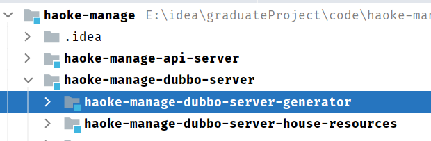

# 后台系统

## 后台系统结构图


>   后台系统采用的是前后端分离开发模式，前端使用LayUI系统作为模板进行改造，后端采用的是SpringBoot+Dubbo+Mybatis的架构进行开发

## 图像存储

在 `haoke-manage-api-server` 中实现图片上传功能，以供其他服务使用

-   图片存储解决方案的分析
-   阿里云OSS存储方案的实现
-   本地存储方案的实现

>    图片存储解决方案选择

开发一个图片上传服务，需要有存储的支持，那么我们的解决方案有以下几种 ：

-   直接将图片保存到服务的硬盘
    -   优点：开发便捷，成本低
    -   缺点：扩容困难
-   使用分布式文件系统进行存储
    -   优点：容器实现扩容
    -   缺点：开发复杂度大
-   使用第三方的存储服务
    -   优点：开发简单，免维护
    -   缺点：付费

### VO——PicUploadResult

https://ant.design/components/upload-cn/#components-upload-demo-picture-card


vo：用于返回给前端的数据结构定义

```java
package com.haoke.api.vo;
import lombok.Data;

@Data
public class PicUploadResult {
    // 文件唯一标识
    private String uid;
    // 文件名
    private String name;
    // 状态有：uploading done error removed
    private String status;
    // 服务端响应内容，如：'{"status": "success"}'
    private String response;
}
```

### 本地文件系统存储

#### 1. 编写Service

`PicUploadFileSystemService`

```java
package com.haoke.api.service;

@Service
public class PicUploadFileSystemService {
    // 允许上传的格式
    private static final String[] IMAGE_TYPE 
        = new String[]{ ".bmp", ".jpg",".jpeg", ".gif", ".png"};

    public PicUploadResult upload(MultipartFile uploadFile) {
        // 校验图片格式,属于图片，则允许上传
        boolean isLegal = false;
        for (String type : IMAGE_TYPE) {
            if(StringUtils.endsWithIgnoreCase(
                	uploadFile.getOriginalFilename(),
                    type)) {
                isLegal = true;
                break;
            }
        }
		
        // 封装Result对象，并且将文件的byte数组放置到result对象中
        PicUploadResult fileUploadResult = new PicUploadResult();
        
        //不允许上传，返回结果设置设为 error
        if (!isLegal) {
            fileUploadResult.setStatus("error");
            return fileUploadResult;
        }
        
        String fileName = uploadFile.getOriginalFilename();
        // 文件新路径
        String filePath = getFilePath(fileName);
        // 生成图片的绝对引用地址
        String picUrl = StringUtils.replace(
            StringUtils.substringAfter(
                filePath,"F:\\code\\haoke\\haoke-upload"),
     	        "\\", "/");
        fileUploadResult.setName("http://image.haoke.com" + picUrl);
        
        File newFile = new File(filePath);
        // 写文件到磁盘
        try {
            uploadFile.transferTo(newFile);
        } catch (IOException e) {
            e.printStackTrace();
            //上传失败
            fileUploadResult.setStatus("error");
            return fileUploadResult;
        } 
        fileUploadResult.setStatus("done");
        fileUploadResult.setUid(String.valueOf(System.currentTimeMillis()));
        return fileUploadResult;
    } 

    private String getFilePath(String sourceFileName) {
        String baseFolder = 
            "F:\\code\\haoke\\haoke-upload" + 
            File.separator + 
            "images";

        Date nowDate = new Date();
        // yyyy/MM/dd
        String fileFolder = baseFolder + 
            File.separator + 
            new DateTime(nowDate).toString("yyyy") + 
            File.separator + 
            new DateTime(nowDate).toString("MM") +
            File.separator + 
            new DateTime(nowDate).toString("dd");

        File file = new File(fileFolder);
        if (!file.isDirectory()) {
            // 如果目录不存在，则创建目录
            file.mkdirs();
        } 
        // 生成新的文件名
        String fileName = 
            new DateTime(nowDate).toString("yyyyMMddhhmmssSSSS") + 
            RandomUtils.nextInt(100, 9999) + 
            "." + 
            StringUtils.substringAfterLast(sourceFileName, ".");
        return fileFolder + File.separator + fileName;
    }
}
```

#### 2. 修改Controller中的引用

```java
package com.haoke.api.controller;

@RequestMapping("pic/upload")
@Controller
public class PicUploadController {
    @Autowired
    private PicUploadFileSystemService picUploadService;
    
    /**
    * @param uploadFile
    * @return
    * @throws Exception
    */
    @PostMapping
    @ResponseBody
    public PicUploadResult upload(@RequestParam("file") MultipartFile uploadFile)
        throws Exception {
        return this.picUploadService.upload(uploadFile);
    }
}
```

#### 3. 启动服务，测试接口


生成的链接是url链接，需要通过nginx进行访问映射

#### 4. 搭建nginx进行访问图片

##### 修改nginx配置文件

nginx目录/conf/nginx.conf

```conf
server {
        listen       80;
        server_name  image.haoke.com;

        #charset koi8-r;

        #access_log  logs/host.access.log  main;

        proxy_set_header X-Forwarded-Host $host;
        proxy_set_header X-Forwarded-Server $host;
        proxy_set_header X-Forwarded-For $proxy_add_x_forwarded_for;

        location / {
        root  E:\idea\graduateProject\code\upload;
        }
        
    }
```

##### 修改本机hosts环境

**没有修改C:\Windows\System32\drivers\etc\hosts的权限**

1.  打开C:\Windows\System32\drivers\etc\文件，找到hosts,然后分配所有权限。

2.  找到上面提的hosts文件，打开文件直接再保存原来路径下

3.  SwitchHosts!文件右击鼠标，点击管理员启动。

```conf
# 开发环境
127.0.0.1 manage.haoke.com
127.0.0.1 image.haoke.com
```


##### 启动nginx

```shell
cd nginx目录

start nginx.exe

# 停止nginx
nginx -s stop
```

#### 5. 访问链接，测试


### 腾讯云COS

1.  在腾讯云 [对象存储控制台](https://console.cloud.tencent.com/cos5) 开通腾讯云对象存储（COS）服务。
2.  在腾讯云 [对象存储控制台](https://console.cloud.tencent.com/cos5) 创建一个 Bucket。
3.  在访问管理控制台中的 [API 密钥管理](https://console.cloud.tencent.com/cam/capi) 页面里获取 APPID，并创建 SecretId、SecretKey。


#### 1. 导入依赖

```xml
<!--导入腾讯云COS依赖-->
<dependency>
    <groupId>com.qcloud</groupId>
    <artifactId>cos_api</artifactId>
    <version>5.6.37</version>
</dependency>
<!--引入配置自动注入-->
<dependency>
    <groupId> org.springframework.boot </groupId>
    <artifactId> spring-boot-configuration-processor </artifactId>
    <optional> true </optional>
</dependency>
```

#### 2. 编写配置文件

```properties
# 子用户id
tencent.cos.appid=100018187662

#子用户key:id,key
tencent.cos.secret-id=AKIDlNkW6P8TLwNZXExxg9MIcaQMSKwHn32l
tencent.cos.secret-key=b3YEbhkX5MNK2VhfNULXZKG3cwzrW2HH

# 容器名
tencent.cos.bucket-name=haoke-1257323542

# 容器所属区
tencent.cos.region-id=ap-beijing

# 文件前缀
tencent.cos.base-url=https://haoke-1257323542.cos.ap-beijing.myqcloud.com
```

#### 3. CosConfig

```java
package com.haoke.api.config;

import com.qcloud.cos.COSClient;
import com.qcloud.cos.ClientConfig;
import com.qcloud.cos.auth.BasicCOSCredentials;
import com.qcloud.cos.auth.COSCredentials;
import com.qcloud.cos.region.Region;
import lombok.Data;
import org.springframework.boot.context.properties.ConfigurationProperties;
import org.springframework.context.annotation.Bean;
import org.springframework.context.annotation.Configuration;
import org.springframework.context.annotation.PropertySource;

@Data
@Configuration
@PropertySource(value = {"classpath:tencent.properties"})
@ConfigurationProperties(prefix = "tencent.cos")
public class CosConfig {
    private String appId;
    private String secretId;
    private String secretKey;
    private String bucketName;
    private String regionId;
    private String baseUrl;

    @Bean
    public COSClient cosClient() {
        //1. 初始化用户身份信息
        COSCredentials cred = new BasicCOSCredentials(this.secretId, this.secretKey);

        //2. 设置 bucket 的地域, COS 地域的简称请参照 https://cloud.tencent.com/document/product/436/6224
        ClientConfig clientConfig = new ClientConfig(new Region(this.regionId));

        //3. 生成cos客户端
        COSClient cosClient = new COSClient(cred,clientConfig);

        return  cosClient;
    }
}
```

#### 4. 编写Service

`PicUploadTencentService`

```java
package com.haoke.api.service;

@Service
public class PicUploadTencentService {

    // 允许上传的格式
    private static final String[] IMAGE_TYPE
            = new String[] {".bmp", ".jpg",".jpeg", ".gif", ".png"};

    @Autowired
    private COSClient cosClient;//OSS客户端

    @Autowired
    private CosConfig cosConfig;

    public PicUploadResult upload(MultipartFile uploadFile) {
        // 校验图片格式
        boolean isLegal = false;
        for (String type : IMAGE_TYPE) {
            if (StringUtils.endsWithIgnoreCase(
                    uploadFile.getOriginalFilename(),type)) {
                //如果文件名的后缀为上述图片类型，则为合法文件，可以上传
                isLegal = true;
                break;
            }
        }

        // 封装Result对象，并且将文件的byte数组放置到result对象中
        PicUploadResult fileUploadResult = new PicUploadResult();
        if(!isLegal){
            fileUploadResult.setStatus("error");
            return fileUploadResult;
        }

        // 文件新路径
        String fileName = uploadFile.getOriginalFilename();
        String filePath = getFilePath(fileName);
        String[] filename = filePath.split("\\.");
        File localFile = null;

        // 以字节流上传到腾讯云COS
        try {
            localFile=File.createTempFile(filename[0], filename[1]);
            uploadFile.transferTo(localFile);
            localFile.deleteOnExit();

            cosClient.putObject(
                    cosConfig.getBucketName(),
                    filePath,
                    localFile
            );
        } catch (Exception e) {
            e.printStackTrace();
            //上传失败
            fileUploadResult.setStatus("error");
            return fileUploadResult;
        }

        cosClient.shutdown();
        //返回给umi的对象
        fileUploadResult.setStatus("done");
        fileUploadResult.setName(this.cosConfig.getBaseUrl() + filePath);
        fileUploadResult.setUid(String.valueOf(System.currentTimeMillis()));

        return fileUploadResult;
    }

    private String getFilePath(String fileName) {
        DateTime dateTime = new DateTime();

        return "images/" +
                dateTime.toString("yyyy")+
                "/" + dateTime.toString("MM") + "/" +
                dateTime.toString("dd") + "/" +
                System.currentTimeMillis() +
                RandomUtils.nextInt(100, 9999) + "." +
                StringUtils.substringAfterLast(fileName, ".");
    }
}
```

#### 5. Controller

```java
package com.haoke.api.controller;

@RequestMapping("pic/upload")
@Controller
public class PicUploadController {

    @Autowired
    private PicUploadTencentService picUploadTencentService;

    /*@Autowired
    private PicUploadFileSystemService picUploadService;
*/
    /**
     * @param uploadFile
     * @return
     * @throws Exception
     */
    @PostMapping
    @ResponseBody
    public PicUploadResult upload(@RequestParam("file") MultipartFile uploadFile)
            throws Exception {
        //return this.picUploadService.upload(uploadFile);

        return this.picUploadTencentService.upload(uploadFile);
    }
}
```


<div style="page-break-after:always" />

## 房源服务的构建

后台服务系统采用SOA的架构思想，使用Dubbo作为服务治理框架进行搭建。


### 创建工程&添加依赖


#### 父工程

```xml
<?xml version="1.0" encoding="UTF-8"?>
<project xmlns="http://maven.apache.org/POM/4.0.0"
         xmlns:xsi="http://www.w3.org/2001/XMLSchema-instance"
         xsi:schemaLocation="http://maven.apache.org/POM/4.0.0
         http://maven.apache.org/xsd/maven-4.0.0.xsd">
    <modelVersion>4.0.0</modelVersion>

    <groupId>com.haoke.manage</groupId>
    <artifactId>haoke-manage</artifactId>
    <packaging>pom</packaging>
    <version>1.0-SNAPSHOT</version>
    <modules>
        <module>haoke-manage-dubbo-server</module>
        <module>haoke-manage-api-server</module>
    </modules>

    <!--添加SpringBoot支持-->
    <parent>
        <artifactId>spring-boot-starter-parent</artifactId>
        <groupId>org.springframework.boot</groupId>
        <version>2.4.3</version>
    </parent>

    <dependencies>
        <!--springboot的测试支持-->
        <dependency>
            <groupId>org.springframework.boot</groupId>
            <artifactId>spring-boot-starter-test</artifactId>
            <version>2.4.3</version>
        </dependency>
        <dependency>
            <groupId>org.apache.commons</groupId>
            <artifactId>commons-lang3</artifactId>
        </dependency>

        <!--dubbo的springbboot支持-->
        <dependency>
            <groupId>com.alibaba.boot</groupId>
            <artifactId>dubbo-spring-boot-starter</artifactId>
            <version>0.2.0</version>
        </dependency>
        <!--dubbo框架-->
        <dependency>
            <groupId>com.alibaba</groupId>
            <artifactId>dubbo</artifactId>
            <version>2.6.4</version>
        </dependency>

        <!--zk依赖-->
        <dependency>
            <groupId>org.apache.zookeeper</groupId>
            <artifactId>zookeeper</artifactId>
            <version>3.4.13</version>
        </dependency>
        <dependency>
            <groupId>com.github.sgroschupf</groupId>
            <artifactId>zkclient</artifactId>
            <version>0.1</version>
        </dependency>
    </dependencies>

    <build>
        <plugins>
            <!--springboot的maven框架-->
            <plugin>
                <groupId>org.springframework.boot</groupId>
                <artifactId>spring-boot-maven-plugin</artifactId>
            </plugin>
        </plugins>
    </build>
</project>
```

#### 子工程

##### haoke-manage-api-server

>    服务提供方依赖

```xml
<?xml version="1.0" encoding="UTF-8"?>
<project xmlns="http://maven.apache.org/POM/4.0.0"
         xmlns:xsi="http://www.w3.org/2001/XMLSchema-instance"
         xsi:schemaLocation="http://maven.apache.org/POM/4.0.0 http://maven.apache.org/xsd/maven-4.0.0.xsd">
    <parent>
        <artifactId>haoke-manage</artifactId>
        <groupId>com.haoke.manage</groupId>
        <version>1.0-SNAPSHOT</version>
    </parent>
    <modelVersion>4.0.0</modelVersion>

    <artifactId>haoke-manage-api-server</artifactId>

    <dependencies>
        <!--springboot的web支持-->
        <dependency>
            <groupId>org.springframework.boot</groupId>
            <artifactId>spring-boot-starter-web</artifactId>
        </dependency>
        <!--
            api模块———本模块，对外提供接口，作为dubbo的服务消费方
            interface模块————当前依赖，dubbo的服务提供方
        -->
        <dependency>
            <groupId>com.haoke.manage</groupId>
            <artifactId>haoke-manage-dubbo-server-house-resources-interface</artifactId>
            <version>1.0-SNAPSHOT</version>
        </dependency>
    </dependencies>
</project>
```

##### haoke-manage-dubbo-server

>   服务消费方依赖

```xml
<?xml version="1.0" encoding="UTF-8"?>
<project xmlns="http://maven.apache.org/POM/4.0.0"
         xmlns:xsi="http://www.w3.org/2001/XMLSchema-instance"
         xsi:schemaLocation="http://maven.apache.org/POM/4.0.0 http://maven.apache.org/xsd/maven-4.0.0.xsd">
    <parent>
        <artifactId>haoke-manage</artifactId>
        <groupId>com.haoke.manage</groupId>
        <version>1.0-SNAPSHOT</version>
    </parent>
    <modelVersion>4.0.0</modelVersion>

    <packaging>pom</packaging>
    <modules>
        <module>haoke-manage-dubbo-server-house-resources</module>
        <module>haoke-manage-dubbo-server-generator</module>
    </modules>

    <artifactId>haoke-manage-dubbo-server</artifactId>

    <dependencies>
        <dependency>
            <groupId>org.springframework.boot</groupId>
            <artifactId>spring-boot-starter</artifactId>
        </dependency>

        <!--lombok-->
        <dependency>
            <groupId>org.projectlombok</groupId>
            <artifactId>lombok</artifactId>
        </dependency>
    </dependencies>

</project>
```

### 新增房源

#### 创建数据表

```sql
use haoke;

DROP TABLE IF EXISTS `tb_estate`;

CREATE TABLE `tb_estate` (
  `id` bigint NOT NULL AUTO_INCREMENT,
  `name` varchar(100) DEFAULT NULL COMMENT '楼盘名称',
  `province` varchar(10) DEFAULT NULL COMMENT '所在省',
  `city` varchar(10) DEFAULT NULL COMMENT '所在市',
  `area` varchar(10) DEFAULT NULL COMMENT '所在区',
  `address` varchar(100) DEFAULT NULL COMMENT '具体地址',
  `year` varchar(10) DEFAULT NULL COMMENT '建筑年代',
  `type` varchar(10) DEFAULT NULL COMMENT '建筑类型',
  `property_cost` varchar(10) DEFAULT NULL COMMENT '物业费',
  `property_company` varchar(20) DEFAULT NULL COMMENT '物业公司',
  `developers` varchar(20) DEFAULT NULL COMMENT '开发商',
  `created` datetime DEFAULT NULL COMMENT '创建时间',
  `updated` datetime DEFAULT NULL COMMENT '更新时间',
  PRIMARY KEY (`id`)
) ENGINE=InnoDB AUTO_INCREMENT=1006 DEFAULT CHARSET=utf8 COMMENT='楼盘表';

INSERT INTO `tb_estate` VALUES 
(1001,'中远两湾城','上海市','上海市','普陀区','远景路97弄','2001','塔楼/板楼','1.5','上海中远物业管理发展有限公司','上海万业企业股份有限公司','2021-03-16 23:00:20','2021-03-16 23:00:20'),
(1002,'上海康城','上海市','上海市','闵行区','莘松路958弄','2001','塔楼/板楼','1.5','盛孚物业','闵行房地产','2021-03-16 23:00:20','2021-03-16 23:00:20'),
(1003,'保利西子湾','上海市','上海市','松江区','广富林路1188弄','2008','塔楼/板楼','1.75','上海保利物业管理','上海城乾房地产开发有限公司','2021-03-16 23:00:20','2021-03-16 23:00:20'),
(1004,'万科城市花园','上海市','上海市','松江区','广富林路1188弄','2002','塔楼/板楼','1.5','上海保利物业管理','上海城乾房地产开发有限公司','2021-03-16 23:00:20','2021-03-16 23:00:20'),
(1005,'上海阳城','上海市','上海市','闵行区','罗锦路888弄','2002','塔楼/板楼','1.5','上海莲阳物业管理有限公司','上海莲城房地产开发有限公司','2021-03-16 23:00:20','2021-03-16 23:00:20');


CREATE TABLE `tb_house_resources` (
  `id` bigint(20) NOT NULL AUTO_INCREMENT,
  `title` varchar(100) DEFAULT NULL COMMENT '房源标题',
  `estate_id` bigint(20) DEFAULT NULL COMMENT '楼盘id',
  `building_num` varchar(5) DEFAULT NULL COMMENT '楼号（栋）',
  `building_unit` varchar(5) DEFAULT NULL COMMENT '单元号',
  `building_floor_num` varchar(5) DEFAULT NULL COMMENT '门牌号',
  `rent` int(10) DEFAULT NULL COMMENT '租金',
  `rent_method` tinyint(1) DEFAULT NULL COMMENT '租赁方式，1-整租，2-合租',
  `payment_method` tinyint(1) DEFAULT NULL COMMENT '支付方式，1-付一押一，2-付三押一，3-付六押一，4-年付押一，5-其它',
  `house_type` varchar(255) DEFAULT NULL COMMENT '户型，如：2室1厅1卫',
  `covered_area` varchar(10) DEFAULT NULL COMMENT '建筑面积',
  `use_area` varchar(10) DEFAULT NULL COMMENT '使用面积',
  `floor` varchar(10) DEFAULT NULL COMMENT '楼层，如：8/26',
  `orientation` varchar(2) DEFAULT NULL COMMENT '朝向：东、南、西、北',
  `decoration` tinyint(1) DEFAULT NULL COMMENT '装修，1-精装，2-简装，3-毛坯',
  `facilities` varchar(50) DEFAULT NULL COMMENT '配套设施， 如：1,2,3',
  `pic` varchar(200) DEFAULT NULL COMMENT '图片，最多5张',
  `house_desc` varchar(200) DEFAULT NULL COMMENT '描述',
  `contact` varchar(10) DEFAULT NULL COMMENT '联系人',
  `mobile` varchar(11) DEFAULT NULL COMMENT '手机号',
  `time` tinyint(1) DEFAULT NULL COMMENT '看房时间，1-上午，2-中午，3-下午，4-晚上，5-全天',
  `property_cost` varchar(10) DEFAULT NULL COMMENT '物业费',
  `created` datetime DEFAULT NULL,
  `updated` datetime DEFAULT NULL,
  PRIMARY KEY (`id`)
) ENGINE=InnoDB AUTO_INCREMENT=1 DEFAULT CHARSET=utf8 COMMENT='房源表';
```

#### 项目结构


-   haoke-manage-dubbo-server-house-resources-interface
    -   对外提供的SDK包
    -   只提供pojo实体类以及接口
-   haoke-manage-dubbo-server-house-resources-service
    -   具体实现

##### haoke-manage-server-house-resources

```xml
<?xml version="1.0" encoding="UTF-8"?>
<project xmlns="http://maven.apache.org/POM/4.0.0"
         xmlns:xsi="http://www.w3.org/2001/XMLSchema-instance"
         xsi:schemaLocation="http://maven.apache.org/POM/4.0.0 http://maven.apache.org/xsd/maven-4.0.0.xsd">
    <parent>
        <artifactId>haoke-manage-dubbo-server</artifactId>
        <groupId>com.haoke.manage</groupId>
        <version>1.0-SNAPSHOT</version>
    </parent>
    <modelVersion>4.0.0</modelVersion>

    <artifactId>haoke-manage-dubbo-server-house-resources</artifactId>
    <packaging>pom</packaging>
    <modules>
        <module>haoke-manage-dubbo-server-house-resources-interface</module>
        <module>haoke-manage-dubbo-server-house-resources-service</module>
    </modules>

    <dependencies>
        <dependency>
            <groupId>com.baomidou</groupId>
            <artifactId>mybatis-plus-boot-starter</artifactId>
            <version>3.4.2</version>
        </dependency>
        <dependency>
            <groupId>mysql</groupId>
            <artifactId>mysql-connector-java</artifactId>
            <version>8.0.16</version>
        </dependency>
    </dependencies>
</project>
```

###### haoke-manage-server-house-resources-interface

```xml
<?xml version="1.0" encoding="UTF-8"?>
<project xmlns="http://maven.apache.org/POM/4.0.0"
         xmlns:xsi="http://www.w3.org/2001/XMLSchema-instance"
         xsi:schemaLocation="http://maven.apache.org/POM/4.0.0 http://maven.apache.org/xsd/maven-4.0.0.xsd">
    <parent>
        <artifactId>haoke-manage-dubbo-server-house-resources</artifactId>
        <groupId>com.haoke.manage</groupId>
        <version>1.0-SNAPSHOT</version>
    </parent>
    <modelVersion>4.0.0</modelVersion>

    <artifactId>haoke-manage-dubbo-server-house-resources-interface</artifactId>

</project>
```

###### haoke-manage-server-house-resources-service

```xml
<?xml version="1.0" encoding="UTF-8"?>
<project xmlns="http://maven.apache.org/POM/4.0.0"
         xmlns:xsi="http://www.w3.org/2001/XMLSchema-instance"
         xsi:schemaLocation="http://maven.apache.org/POM/4.0.0 http://maven.apache.org/xsd/maven-4.0.0.xsd">
    <parent>
        <artifactId>haoke-manage-dubbo-server-house-resources</artifactId>
        <groupId>com.haoke.manage</groupId>
        <version>1.0-SNAPSHOT</version>
    </parent>
    <modelVersion>4.0.0</modelVersion>

    <artifactId>haoke-manage-dubbo-server-house-resources-service</artifactId>

    <dependencies>
        <dependency>
            <groupId>org.springframework.boot</groupId>
            <artifactId>spring-boot-starter-jdbc</artifactId>
        </dependency>
        <dependency>
            <groupId>com.haoke.manage</groupId>
            <artifactId>haoke-manage-dubbo-server-house-resources-interface</artifactId>
            <version>1.0-SNAPSHOT</version>
        </dependency>
    </dependencies>
</project>
```

#### 使用MybatisPlus逆向工程

>   mybatis-plus的AutoGenerator插件根据 数据库中的表结构 生成相应的POJO类

##### BasePOJO

编写BasePojo，所有的pojo类都要继承该类，在该类中定义了created、updated字段，表明在每一个表中都需要有这2个字段 

```java
package com.haoke.dubbo.server.pojo;

import lombok.Data;

import java.io.Serializable;
import java.util.Date;

@Data
public abstract class BasePojo implements Serializable {
    private Date created;
    private Date updated;
}
```

##### POJO—HouseResources

###### 创建haoke-manage-dubbo-server-generator工程



```xml
<?xml version="1.0" encoding="UTF-8"?>
<project xmlns="http://maven.apache.org/POM/4.0.0"
         xmlns:xsi="http://www.w3.org/2001/XMLSchema-instance"
         xsi:schemaLocation="http://maven.apache.org/POM/4.0.0 http://maven.apache.org/xsd/maven-4.0.0.xsd">
    <parent>
        <artifactId>haoke-manage-dubbo-server</artifactId>
        <groupId>com.haoke.manage</groupId>
        <version>1.0-SNAPSHOT</version>
    </parent>
    <modelVersion>4.0.0</modelVersion>

    <artifactId>haoke-manage-dubbo-server-generator</artifactId>

    <dependencies>
        <!--代码生成引擎 freemarker-->
        <dependency>
            <groupId>org.freemarker</groupId>
            <artifactId>freemarker</artifactId>
        </dependency>

        <!-- mybatis-plus插件 -->
        <dependency>
            <groupId>com.baomidou</groupId>
            <artifactId>mybatis-plus-core</artifactId>
            <version>3.4.2</version>
        </dependency>
        <dependency>
            <groupId>com.baomidou</groupId>
            <artifactId>mybatis-plus-generator</artifactId>
            <version>3.4.1</version>
        </dependency>
    </dependencies>
</project>
```

###### 编写CodeGenerator

```java
package com.haoke.generator;

import com.alibaba.dubbo.common.utils.StringUtils;
import com.baomidou.mybatisplus.core.exceptions.MybatisPlusException;
import com.baomidou.mybatisplus.core.toolkit.StringPool;
import com.baomidou.mybatisplus.generator.AutoGenerator;
import com.baomidou.mybatisplus.generator.InjectionConfig;
import com.baomidou.mybatisplus.generator.config.*;
import com.baomidou.mybatisplus.generator.config.rules.NamingStrategy;
import com.baomidou.mybatisplus.generator.engine.FreemarkerTemplateEngine;
import com.baomidou.mybatisplus.generator.config.po.TableInfo;

import java.util.ArrayList;
import java.util.List;
import java.util.Scanner;

public class CodeGenerator {
    /**
     * 读取控制台内容
     */
    public static String scanner(String tip) {
        Scanner scanner = new Scanner(System.in);
        StringBuilder help = new StringBuilder();
        help.append("请输入" + tip + "：");
        System.out.println(help.toString());
        if (scanner.hasNext()) {
            String ipt = scanner.next();
            if (StringUtils.isNotEmpty(ipt)) {
                return ipt;
            }
        }
        throw new MybatisPlusException("请输入正确的" + tip + "！");
    }

    public static void main(String[] args) {
        // 代码生成器
        AutoGenerator mpg = new AutoGenerator();

        // 全局配置
        GlobalConfig gc = new GlobalConfig();
        String projectPath = System.getProperty("user.dir");
        gc.setOutputDir(projectPath + "/src/main/java");
        gc.setAuthor("AuspiceTian");
        gc.setOpen(false);
        mpg.setGlobalConfig(gc);

        // 数据源配置
        DataSourceConfig dsc = new DataSourceConfig();
        dsc.setUrl("jdbc:mysql://8.140.130.91:3306/haoke?characterEncoding=utf8&useSSL=false&serverTimezone=UTC");
        // dsc.setSchemaName("public");
        dsc.setDriverName("com.mysql.cj.jdbc.Driver");
        dsc.setUsername("root");
        dsc.setPassword("root");
        mpg.setDataSource(dsc);

        // 目标包配置
        PackageConfig pc = new PackageConfig();
        pc.setModuleName(scanner("模块名"));
        pc.setParent("com.haoke.dubbo.server");
        mpg.setPackageInfo(pc);

        // 自定义配置
        InjectionConfig cfg = new InjectionConfig(){
            @Override
            public void initMap() {

            }
        };
        List<FileOutConfig> focList = new ArrayList<>();
        focList.add(new FileOutConfig("/templates/mapper.xml.ftl") {
            @Override
            public String outputFile(TableInfo tableInfo) {
                // 自定义输入文件名称
                return projectPath + "/src/main/resources/mapper/" +
                    pc.getModuleName()
                    + "/" + tableInfo.getEntityName() + "Mapper" +
                    StringPool.DOT_XML;
            }
        });
        cfg.setFileOutConfigList(focList);
        mpg.setCfg(cfg);
        mpg.setTemplate(new TemplateConfig().setXml(null));

        // 策略配置
        StrategyConfig strategy = new StrategyConfig();
        strategy.setNaming(NamingStrategy.underline_to_camel);
        strategy.setColumnNaming(NamingStrategy.underline_to_camel);
        strategy.setSuperEntityClass("com.haoke.dubbo.server.pojo.BasePojo");
        strategy.setEntityLombokModel(true);
        strategy.setRestControllerStyle(true);
        strategy.setInclude(scanner("表名"));
        strategy.setSuperEntityColumns("id");
        strategy.setControllerMappingHyphenStyle(true);
        strategy.setTablePrefix(pc.getModuleName() + "_");
        mpg.setStrategy(strategy);
        mpg.setTemplateEngine(new FreemarkerTemplateEngine());
        mpg.execute();
    }
}
```

```java
public static void main(String[] args) {
    // 代码生成器
    AutoGenerator mpg = new AutoGenerator();

    // 全局配置
    GlobalConfig gc = new GlobalConfig();
    String projectPath = System.getProperty("user.dir");
    gc.setOutputDir(projectPath + "/src/main/java");
    gc.setAuthor("AuspiceTian");
    gc.setOpen(false);
    mpg.setGlobalConfig(gc);

    // 数据源配置
    DataSourceConfig dsc = new DataSourceConfig();
    dsc.setUrl("jdbc:mysql://8.140.130.91:3306/haoke?characterEncoding=utf8&useSSL=false&serverTimezone=UTC");
    // dsc.setSchemaName("public");
    dsc.setDriverName("com.mysql.cj.jdbc.Driver");
    dsc.setUsername("root");
    dsc.setPassword("root");
    mpg.setDataSource(dsc);

    // 目标包配置
    PackageConfig pc = new PackageConfig();
    pc.setModuleName(scanner("模块名"));
    pc.setParent("com.haoke.dubbo.server");
    mpg.setPackageInfo(pc);

    // 自定义配置
    InjectionConfig cfg = new InjectionConfig(){
        @Override
        public void initMap() {

        }
    };
    List<FileOutConfig> focList = new ArrayList<>();
    focList.add(new FileOutConfig("/templates/mapper.xml.ftl") {
        @Override
        public String outputFile(TableInfo tableInfo) {
            // 自定义输入文件名称
            return projectPath + "/src/main/resources/mapper/" +
                pc.getModuleName()
                + "/" + tableInfo.getEntityName() + "Mapper" +
                StringPool.DOT_XML;
        }
    });
    cfg.setFileOutConfigList(focList);
    mpg.setCfg(cfg);
    mpg.setTemplate(new TemplateConfig().setXml(null));
}
```

###### 运行代码


只需要entity (pojo)

-   @EqualsAndHashCode(callSuper = true)
    -   自动生成equals和 hashcode 方法，一般不需要，所以去掉
-   @Accessors(chain = true)
    -   表示，生成的set方法将采用链式编程方式

###### 将生成的entity放到com.haoke.dubbo.server.pojo下

```java
package com.haoke.dubbo.server.pojo;

import com.baomidou.mybatisplus.annotation.TableName;
import lombok.Data;
import lombok.EqualsAndHashCode;

@Data
@EqualsAndHashCode(callSuper = true)
@TableName("tb_house_resources")
public class HouseResources extends BasePojo {
    
    private static final long serialVersionUID = -2471649692631014216L;
    
    /**
     * 房源标题
     */
    private String title;

    /**
     * 楼盘id
     */
    @TableId(value = "ID", type = IdType.AUTO)
    private Long estateId;

    /**
     * 楼号（栋）
     */
    private String buildingNum;

    /**
     * 单元号
     */
    private String buildingUnit;

    /**
     * 门牌号
     */
    private String buildingFloorNum;

    /**
     * 租金
     */
    private Integer rent;

    /**
     * 租赁方式，1-整租，2-合租
     */
    private Integer rentMethod;

    /**
     * 支付方式，1-付一押一，2-付三押一，3-付六押一，4-年付押一，5-其它
     */
    private Integer paymentMethod;

    /**
     * 户型，如：2室1厅1卫
     */
    private String houseType;

    /**
     * 建筑面积
     */
    private String coveredArea;

    /**
     * 使用面积
     */
    private String useArea;

    /**
     * 楼层，如：8/26
     */
    private String floor;

    /**
     * 朝向：东、南、西、北
     */
    private String orientation;

    /**
     * 装修，1-精装，2-简装，3-毛坯
     */
    private Integer decoration;

    /**
     * 配套设施， 如：1,2,3
     */
    private String facilities;

    /**
     * 图片，最多5张
     */
    private String pic;

    /**
     * 描述
     */
    private String houseDesc;

    /**
     * 联系人
     */
    private String contact;

    /**
     * 手机号
     */
    private String mobile;

    /**
     * 看房时间，1-上午，2-中午，3-下午，4-晚上，5-全天
     */
    private Integer time;

    /**
     * 物业费
     */
    private String propertyCost;
}
```

#### 定义服务提供方接口

```java
//haoke-manage-dubbo-server-house-resources-interface
package com.haoke.server.api;

import com.haoke.server.pojo.HouseResources;

public interface ApiHouseResourcesService {

    /**
     * @param houseResources
     *
     * @return -1:输入的参数不符合要求，0：数据插入数据库失败，1：成功
     */
    int saveHouseResources(HouseResources houseResources);
}
```

#### 实现新增房源服务

>   创建SpringBoot应用，实现新增房源服务


##### 编写application.preperties

```properties
# Spring boot application
spring.application.name = haoke-manage-dubbo-server-house-resources

# 数据库
spring.datasource.driver-class-name=com.mysql.cj.jdbc.Driver
spring.datasource.url=jdbc:mysql://8.140.130.91:3306/haoke?characterEncoding=utf8&useSSL=false&serverTimezone=UTC
spring.datasource.username=root
spring.datasource.password=root

# 服务的扫描包
dubbo.scan.basePackages = com.haoke.server.api

# 应用名称
dubbo.application.name = dubbo-provider-house-resources
dubbo.service.version = 1.0.0

# 协议以及端口
dubbo.protocol.name = dubbo
dubbo.protocol.port = 20880

# zk注册中心
dubbo.registry.address = zookeeper://8.140.130.91:2181
dubbo.registry.client = zkclient
```

##### 编写HouseResourcesMapper接口

```java
package com.haoke.server.mapper;

import com.baomidou.mybatisplus.core.mapper.BaseMapper;
import com.haoke.dubbo.server.pojo.HouseResources;

public interface HouseResourcesMapper extends BaseMapper<HouseResources> {}
```

##### 编写MybatisPlus配置类

```java
package com.haoke.server.config;

import org.mybatis.spring.annotation.MapperScan;
import org.springframework.context.annotation.Configuration;

@MapperScan("com.haoke.server.mapper")
@Configuration
public class MybatisPlusConfig {}
```

##### 编写Service

**此处实现的是spring的服务，为dubbo服务的具体实现细节，无需对外暴露，同时需要进行事务控制和其他判断逻辑**

###### 定义接口

```java
package com.haoke.server.service;

import com.haoke.server.pojo.HouseResources;

public interface HouseResourcesService {
    /**
     *
     * @param houseResources
     * @return -1:输入的参数不符合要求，0：数据插入数据库失败，1：成功
     */
    int saveHouseResources(HouseResources houseResources);
}
```

###### 编写实现类

-   通用CRUD实现

```java
package com.haoke.server.service.impl;

import com.baomidou.mybatisplus.core.conditions.query.QueryWrapper;
import com.baomidou.mybatisplus.core.mapper.BaseMapper;
import com.baomidou.mybatisplus.core.metadata.IPage;
import com.baomidou.mybatisplus.extension.plugins.pagination.Page;
import com.haoke.dubbo.server.pojo.BasePojo;
import org.springframework.beans.factory.annotation.Autowired;

import java.util.Date;
import java.util.List;

public class BaseServiceImpl<T extends BasePojo>{

    @Autowired
    private BaseMapper<T> mapper;

    /**
     * 根据id查询数据
     * @param id
     * @return
     */
    public T queryById(Long id) {
        return this.mapper.selectById(id);
    }

    /**
     * 查询所有数据
     *
     * @return
     */
    public List<T> queryAll() {
        return this.mapper.selectList(null);
    }

    /**
     * 根据条件查询一条数据
     *
     * @param record
     * @return
     */
    public T queryOne(T record) {
        return this.mapper.selectOne(new QueryWrapper<>(record));
    }

    /**
     * 根据条件查询数据列表
     * @param record
     * @return
     */
    public List<T> queryListByWhere(T record) {
        return this.mapper.selectList(new QueryWrapper<>(record));
    }

    /**
     * 根据条件分页查询数据列表
     * @param record
     * @param page
     * @param rows
     * @return
     * */
    public IPage<T> queryPageListByWhere(T record, Integer page, Integer rows) {
    // 获取分页数据
        return this.mapper.selectPage(new Page<T>(page, rows), new QueryWrapper<>
                (record));
    }

    /**
     * 保存数据
     *
     * @param record
     * @return
     */
    public Integer save(T record) {
        record.setCreated(new Date());
        record.setUpdated(record.getCreated());
        return this.mapper.insert(record);
    }
    /**
     * 更新数据
     * @param record
     * @return
     */
    public Integer update(T record) {
        record.setUpdated(new Date());
        return this.mapper.updateById(record);
    }
    /**
     * 根据id删除数据
     * @param id
     * @return
     */
    public Integer deleteById(Long id) {
        return this.mapper.deleteById(id);
    }

    /**
     * 根据ids批量删除数据
     * @param ids
     * @return
     */
    public Integer deleteByIds(List<Long> ids) {
        return this.mapper.deleteBatchIds(ids);
    }

    /**
     * 根据条件删除数据
     * @param record
     * @return
     */
    public Integer deleteByWhere(T record){
        return this.mapper.delete(new QueryWrapper<>(record));
    }
}
```

-   房源相关实现类——HouseResourcesImpl

```java
package com.haoke.server.service.impl;

import com.alibaba.dubbo.common.utils.StringUtils;
import com.haoke.server.pojo.HouseResources;
import com.haoke.server.service.HouseResourcesService;
import org.springframework.stereotype.Service;
import org.springframework.transaction.annotation.Transactional;

@Transactional//这是Spring的服务
@Service//开启事务
public class HouseResourcesServiceImpl
        extends BaseServiceImpl
        implements HouseResourcesService {
    @Override
    public int saveHouseResources(HouseResources houseResources) {
        // 编写校验逻辑，如果校验不通过，返回-1
        if (StringUtils.isBlank(houseResources.getTitle())) {
            return -1;
        }

        //其他校验以及逻辑省略 ……

        return super.save(houseResources);
    }
}
```

#### 服务提供方实现

暴露新增房源的dubbo服务

```java
package com.haoke.server.api;

import com.alibaba.dubbo.config.annotation.Service;
import com.haoke.server.pojo.HouseResources;
import com.haoke.server.service.HouseResourcesService;
import org.springframework.beans.factory.annotation.Autowired;

//实现Dubbo，对外暴露服务
@Service(version = "${dubbo.service.version}")
public class ApiHoukeResourcesImpl implements ApiHouseResourcesService{

    @Autowired
    private HouseResourcesService resourcesService;

    @Override
    public int saveHouseResources(HouseResources houseResources) {
        return this.resourcesService.saveHouseResources(houseResources);
    }
}
```

##### Dubbo启动类

```java
package com.haoke.server;

import org.springframework.boot.WebApplicationType;
import org.springframework.boot.autoconfigure.SpringBootApplication;
import org.springframework.boot.builder.SpringApplicationBuilder;

@SpringBootApplication
public class DubboProvider {

    public static void main(String[] args) {
        new SpringApplicationBuilder(DubboProvider.class)
                .web(WebApplicationType.NONE)//不是web应用
                .run(args);
    }
}
```

##### 启用DubboAdmin

```shell
cd /opt/incubator-dubbo-ops/

mvn --projects dubbo-admin-server spring-boot:run
```

##### 查询dubbo服务提供方


dubbo-provider-house-resources,端口为20880

#### 服务消费方——RESTful接口

haoke-manage-api-server工程

-   为前端系统提供接口服务
-   dubbo的消费方


##### 添加依赖

因为dubbo是消费方，需要添加dubbo提供方提供的接口、pojo的依赖

```xml
<dependencies>
    <!--springboot的web支持-->
    <dependency>
        <groupId>org.springframework.boot</groupId>
        <artifactId>spring-boot-starter-web</artifactId>
    </dependency>
    <!--
		api模块———本模块，对外提供接口，作为dubbo的服务消费方
        interface模块————当前依赖，dubbo的服务提供方
	-->
    <dependency>
        <groupId>com.haoke.manage</groupId>
        <artifactId>haoke-manage-dubbo-server-house-resources-interface</artifactId>
        <version>1.0-SNAPSHOT</version>
    </dependency>
</dependencies>
```

##### 编写service

HouseResourceService用于调用dubbo服务

```java
package com.haoke.api.service;

import com.alibaba.dubbo.config.annotation.Reference;
import com.haoke.server.api.ApiHouseResourcesService;
import com.haoke.server.pojo.HouseResources;
import org.springframework.stereotype.Service;

@Service//服务消费方
public class HouseResourceService {

    @Reference(version = "${dubbo.service.version}")
    private ApiHouseResourcesService apiHouseResourcesService;

    public boolean save(HouseResources houseResources){
        int result = this.apiHouseResourcesService.saveHouseResources(houseResources);

        return result==1;
    }
}
```

##### 控制层

```java
package com.haoke.api.controller;

import com.haoke.api.service.HouseResourceService;
import com.haoke.server.pojo.HouseResources;
import org.springframework.beans.factory.annotation.Autowired;
import org.springframework.http.HttpStatus;
import org.springframework.http.ResponseEntity;
import org.springframework.stereotype.Controller;
import org.springframework.web.bind.annotation.*;

@RequestMapping("house/resources")
@Controller
public class HouseResourcesController {

    @Autowired
    private HouseResourceService houseResourceService;

    /**
     * 新增房源
     *
     * @param houseResources json数据
     * @return
     */
    @PostMapping
    @ResponseBody
    public ResponseEntity<Void> save(@RequestBody HouseResources houseResources){
        try {
            boolean bool = this.houseResourceService.save(houseResources);
            if(bool){
                return ResponseEntity.status(HttpStatus.CREATED).build();
            }
        } catch (Exception e) {
            e.printStackTrace();
        }
        return ResponseEntity.status(HttpStatus.INTERNAL_SERVER_ERROR).build();
    }

    /**
     * test
     * @return
     */
    @GetMapping
    @ResponseBody
    public ResponseEntity<String> get(){
        System.out.println("get House Resources");
        return ResponseEntity.ok("ok");
    }
}
```

##### 测试程序

```java
package com.haoke.api;

import org.springframework.boot.SpringApplication;
import org.springframework.boot.autoconfigure.SpringBootApplication;

@SpringBootApplication(exclude = {DataSourceAutoConfiguration.class})
public class DubboApiApplication {
    public static void main(String[] args) {
        SpringApplication.run(DubboApiApplication.class, args);
    }
}
```

##### 消费方配置文件

```properties
# Spring boot application
spring.application.name = haoke-manage-api-server
server.port = 9091

#logging.level.root=DEBUG

# 应用名称
dubbo.application.name = dubbo-consumer-haoke-manage

# zk注册中心
dubbo.registry.address = zookeeper://8.140.130.91:2181
dubbo.registry.client = zkclient

dubbo.service.version = 1.0.0
```

##### 测试接口


#### 新增接口前后端整合

##### 增加model

新建 **models** 文件夹


```js
import { routerRedux } from 'dva/router';
import { message } from 'antd';
import { addHouseResource } from '@/services/haoke/haoke';

export default {
  namespace: 'house',

  state: {
  },

  effects: {
    *submitHouseForm({ payload }, { call }) {
      console.log("page model")
      yield call(addHouseResource, payload);
      message.success('提交成功');
    }
  },

  reducers: {

  },
};
```

##### 增加services

```js
import request from '@/utils/request';

export async function addHouseResource(params) {
  return request('/haoke/house/resources', {
    method: 'POST',
    body: params
  });
}
```

##### 修改表单提交地址

```jsx
handleSubmit = e => {
    const { dispatch, form } = this.props;
    e.preventDefault();
    form.validateFieldsAndScroll((err, values) => {
        if (!err) {
            if(values.facilities){
                values.facilities = values.facilities.join(",");
            }
            if(values.floor_1 && values.floor_2){
                values.floor = `${values.floor_1  }/${  values.floor_2}`;

            }

            values.houseType = `${values.houseType_1  }室${  values.houseType_2  }厅${
            values.houseType_3  }卫${  values.houseType_4  }厨${
            values.houseType_2  }阳台`;
            delete values.floor_1;
            delete values.floor_2;
            delete values.houseType_1;
            delete values.houseType_2;
            delete values.houseType_3;
            delete values.houseType_4;
            delete values.houseType_5;
            dispatch({
                type: 'house/submitHouseForm',
                payload: values,
            });
        }
    });
};
```

##### 通过反向代理解决跨域问题

https://umijs.org/zh-CN/config#proxy

```json
proxy: {
    '/haoke/': {
        target: 'http://127.0.0.1:9091',//目标地址
        changeOrigin: true,
        pathRewrite: { '^/haoke/': '' },//路径覆盖
    },
},
```

代理效果：

请求：http://localhost:8000/haoke/house/resources  

实际：http://127.0.0.1:9091/house/resources  

#### 图像上传前后端整合

##### 1. 修改PicturesWall.js

```jsx
<Upload
    action="/haoke/pic/upload"
    listType="picture-card"
    fileList={fileList}
    onPreview={this.handlePreview}
    onChange={this.handleChange}
    >
```

##### 2. 修改AddResources.js

```js
handleFileList = (obj)=>{
    const pics = new Set();
    obj.forEach((v, k) => {
        if(v.response){
            pics.add(v.response.name);
        }
    });
    this.setState({
        pics
    })
}
```

##### 修改表单提交逻辑中的图片数据

```js
values.pic = [...this.state.pics].join(',');
```

##### 测试


### 房源列表


-   PageInfo：返回给服务消费方的数据
-   ApiHouseResourcesService:暴露==dubbo==服务提供方接口
-   ApiHaoKeResourcesImpl：==dubbo==服务提供方的实现
-   HouseResourcesService：==Spring==服务层定义
-   HouseResourcesServiceImpl：==Spring==业务的实现
-   BaseServiceImpl：==Mybatisplus== 层访问数据库

#### 1. 定义dubbo服务

**haoke-manage-server-house-resources-dubbo-interface**

`com.haoke.server.vo.PageInfo`

```java
package com.haoke.server.vo;

import lombok.AllArgsConstructor;
import lombok.Data;
import java.util.Collections;
import java.util.List;

@Data
@AllArgsConstructor
public class PageInfo<T> implements java.io.Serializable{
    /**
     * 总条数
     */
    private Integer total;
    /**
     * 当前页
     */
    private Integer pageNum;
    /**
     * 一页显示的大小
     */
    private Integer pageSize;
    /**
     * 数据列表
     */
    private List<T> records = Collections.emptyList();
}
```

`package com.haoke.server.api`

```java
package com.haoke.server.api;

import com.haoke.server.pojo.HouseResources;
import com.haoke.server.vo.PageInfo;

public interface ApiHouseResourcesService {

    /**
     * @param houseResources
     *
     * @return -1:输入的参数不符合要求，0：数据插入数据库失败，1：成功
     */
    int saveHouseResources(HouseResources houseResources);

    /**
     * 分页查询房源列表
     *
     * @param page 当前页
     * @param pageSize 页面大小
     * @param queryCondition 查询条件
     * @return
     */
    PageInfo<HouseResources> queryHouseResourcesList(int page, int pageSize, HouseResources queryCondition);
}
```

#### 2. 实现dubbo服务

**haoke-manage-dubbo-server-house-resources-service**

dubbo服务的实现实际上为调用Spring的服务层业务

```java
package com.haoke.server.api;

import com.alibaba.dubbo.config.annotation.Service;
import com.haoke.server.pojo.HouseResources;
import com.haoke.server.service.HouseResourcesService;
import com.haoke.server.vo.PageInfo;
import org.springframework.beans.factory.annotation.Autowired;

//实现Dubbo，对外暴露服务
@Service(version = "${dubbo.service.version}")
public class ApiHaokeResourcesImpl implements ApiHouseResourcesService{

    @Autowired
    private HouseResourcesService houseResourcesService;

    @Override
    public int saveHouseResources(HouseResources houseResources) {
        return this.houseResourcesService.saveHouseResources(houseResources);
    }

    @Override
    public PageInfo<HouseResources> queryHouseResourcesList(int page, int pageSize, HouseResources queryCondition) {
        return this.houseResourcesService.queryHouseResourcesList(page, pageSize, queryCondition);
    }
}
```

==Spring的服务层实现查询列表业务==

`Spring服务层定义`

```java
package com.haoke.server.service;

import com.haoke.server.pojo.HouseResources;
import com.haoke.server.vo.PageInfo;

public interface HouseResourcesService {
    /**
     *
     * @param houseResources
     * @return -1:输入的参数不符合要求，0：数据插入数据库失败，1：成功
     */
    int saveHouseResources(HouseResources houseResources);

    public PageInfo<HouseResources> queryHouseResourcesList(int page, int pageSize, HouseResources queryCondition);
}
```

`Spring服务层实现`

```java
package com.haoke.server.service.impl;

import com.alibaba.dubbo.common.utils.StringUtils;
import com.baomidou.mybatisplus.core.conditions.query.QueryWrapper;
import com.baomidou.mybatisplus.core.metadata.IPage;
import com.haoke.server.pojo.HouseResources;
import com.haoke.server.service.HouseResourcesService;
import com.haoke.server.vo.PageInfo;
import org.springframework.stereotype.Service;
import org.springframework.transaction.annotation.Transactional;

@Transactional//这是Spring的服务
@Service//开启事务
public class HouseResourcesServiceImpl
        extends BaseServiceImpl
        implements HouseResourcesService {
    @Override
    public int saveHouseResources(HouseResources houseResources) {
        // 编写校验逻辑，如果校验不通过，返回-1
        if (StringUtils.isBlank(houseResources.getTitle())) {
            return -1;
        }

        //其他校验以及逻辑省略 ……

        return super.save(houseResources);
    }

    @Override
    public PageInfo<HouseResources> queryHouseResourcesList(int page, int pageSize, HouseResources queryCondition) {
        QueryWrapper<Object> queryWrapper = new QueryWrapper<>(queryCondition);
        queryWrapper.orderByDesc("updated");
        IPage iPage = super.queryPageList(queryWrapper, page, pageSize);
        return new PageInfo<HouseResources>(Long.valueOf(iPage.getTotal()).intValue() , page, pageSize, iPage.getRecords());
    }
}
```

`mybatisplus从数据库获取数据`

```java
@Override
public PageInfo<HouseResources> queryHouseResourcesList(int page, int pageSize, HouseResources queryCondition) {
    QueryWrapper<HouseResources> queryWrapper = new QueryWrapper<HouseResources>(queryCondition);
    queryWrapper.orderByDesc("updated");//按更新时间降序排列

    IPage iPage = super.queryPageList(queryWrapper, page, pageSize);
    return new PageInfo<HouseResources>(Long.valueOf(iPage.getTotal()).intValue() , page, pageSize, iPage.getRecords());
}
```

#### 3. 实现RESTful接口


-    TableResult：返回给前端的vo
-    Pagination：分页信息
-    HouseResourceService：调用服务提供方提供的接口
-    HouseResourcesController：服务消费方提供接口给前端调用

##### 1. 定义vo

```java
@Data
@AllArgsConstructor
public class TableResult<T> {
    private List<T> list;
    private Pagination pagination;
}

@Data
@AllArgsConstructor
public class Pagination {
    private Integer current;
    private Integer pageSize;
    private Integer total;
}
```

##### 2. 调用服务提供方

```java
public TableResult queryList(HouseResources houseResources, Integer currentPage, Integer pageSize) {
    PageInfo<HouseResources> pageInfo
        = this.apiHouseResourcesService.queryHouseResourcesList(currentPage, pageSize, houseResources);

    return new TableResult(
        pageInfo.getRecords(),
        new Pagination(currentPage, pageSize, pageInfo.getTotal()));
}
```

##### 3. 服务消费方提供给前端接口

```java
/**
 * 查询房源列表
 * @param houseResources
 * @param currentPage
 * @param pageSize
 * @return
 */
@GetMapping("/list")//完整请求路径是/house/resource/list
@ResponseBody
public ResponseEntity<TableResult> list(HouseResources houseResources,
                                        @RequestParam(name = "currentPage", defaultValue = "1") Integer currentPage,
                                        @RequestParam(name = "pageSize",defaultValue = "10") Integer pageSize) {

    return ResponseEntity.ok(this.houseResourceService.queryList(houseResources, currentPage, pageSize));
}
```

##### 4. 测试接口


#### 4. 前后端整合


##### 1. 修改前端表结构

```jsx
  columns = [
    {
      title: '房源编号',
      dataIndex: 'id',
    },
    {
      title: '房源信息',
      dataIndex: 'title',
    },
    {
      title: '图',
      dataIndex: 'pic',
      render : (text, record, index) => <ShowPics pics={text} />
    },
    {
      title: '楼栋',
      render : (text, record, index) => `${record.buildingFloorNum  }栋${record.buildingNum}单元${record.buildingUnit}号`
    },
    {
      title: '户型',
      dataIndex: 'houseType'
    },
    {
      title: '面积',
      dataIndex: 'useArea',
      render : (text, record, index) => `${text}平方`
    },
    {
      title: '楼层',
      dataIndex: 'floor'
    },
    {
      title: '操作',
      render: (text, record) => (
        <Fragment>
          <a onClick={() => this.handleUpdateModalVisible(true, record)}>查看</a>
          <Divider type="vertical" />
          <a href="">删除</a>
        </Fragment>
      ),
    },
  ];
```

##### 2. 自定义图片展示组件

```jsx
import React from 'react';
import { Modal, Button, Carousel } from 'antd';

class ShowPics extends React.Component{
  info = () => {
    Modal.info({
      title: '',
      iconType:'false',
      width: '800px',
      okText: "ok",
      content: (
        <div style={{width:650, height: 400, lineHeight:400, textAlign:"center"}}>
          <Carousel autoplay>
            {
              this.props.pics.split(',').map((value,index) => <div>
                
              </div>)
            }
          </Carousel>
        </div>
      ),
      onOk() {},
    });
  };

  constructor(props){
      super(props);
      this.state={
        btnDisabled: !this.props.pics
    }
  }

  render() {
    return (
      <div>
        <Button disabled={this.state.btnDisabled} icon="picture" shape="circle" onClick={()=>{this.info()}} />
      </div>
    )
  }
}

export default ShowPics;
```

##### 3. model层

```jsx
import { queryResource } from '@/services/haoke/houseResource';

export default {
  namespace: 'houseResource',

  state: {
    data: {
      list: [],
      pagination: {},
    },
  },

  effects: {
    *fetch({ payload }, { call, put }) {
      console.log("houseResource fetch")

      const response = yield call(queryResource, payload);
      yield put({
        type: 'save',
        payload: response,
      });
    }
  },

  reducers: {
    save(state, action) {// state表示当前model的数据，action表示异步函数 put ，put()中的payload为封装了回调数据的属性
      return {
        ...state,
        data: action.payload,
      };
    },
  },
};
```

##### 4. 修改数据请求地址

```jsx
import request from '@/utils/request';
import { stringify } from 'qs';

export async function queryResource(params) {
  return request(`/haoke/house/resources/list?${stringify(params)}`);
}
```

## 一些配置

### HikariPool-1 - Connection is not available, request timed out after

JDBC超时，Hikari设置了最长请求时间为30s，涉及多线程问题，原因还不清楚

```yaml
spring:
  datasource:
  	hikari:
      maximum-pool-size: 60
      data-source-properties:
        setIdleTimeout: 60000
        setConnectionTimeout: 60000
        setValidationTimeout: 3000
        setLoginTimeout: 5
        setMaxLifetime: 60000
```

### 抽取common工程

分析：

-   多个dubbo服务，需要抽取公共的类、方法到common工程中
-   实现独立的dubbo服务，便于后期的扩展和维护

在dubbo服务提供方的工程中(`haoke-manage-dubbo-server`)，将BasePOJO、BaseServiceImpl、vo.PageInfo移至该工程；导入公有依赖

其他工程，依赖此工程，并将自己工程中的相关类删除


```xml
<?xml version="1.0" encoding="UTF-8"?>
<project xmlns="http://maven.apache.org/POM/4.0.0"
         xmlns:xsi="http://www.w3.org/2001/XMLSchema-instance"
         xsi:schemaLocation="http://maven.apache.org/POM/4.0.0 http://maven.apache.org/xsd/maven-4.0.0.xsd">
    <parent>
        <artifactId>haoke-manage-dubbo-server</artifactId>
        <groupId>com.haoke.manage</groupId>
        <version>1.0-SNAPSHOT</version>
    </parent>
    <modelVersion>4.0.0</modelVersion>

    <artifactId>haoke-manage-dubbo-server-common</artifactId>

    <dependencies>
        <dependency>
            <groupId>com.baomidou</groupId>
            <artifactId>mybatis-plus-boot-starter</artifactId>
            <version>3.4.2</version>
        </dependency>
        <dependency>
            <groupId>mysql</groupId>
            <artifactId>mysql-connector-java</artifactId>
            <version>8.0.16</version>
        </dependency>
        <dependency>
            <groupId>org.springframework.boot</groupId>
            <artifactId>spring-boot-starter-jdbc</artifactId>
        </dependency>
    </dependencies>
</project>
```


