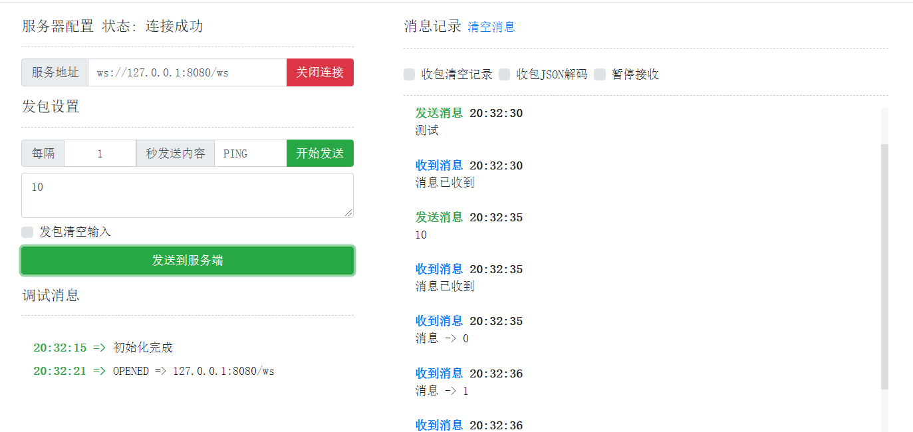
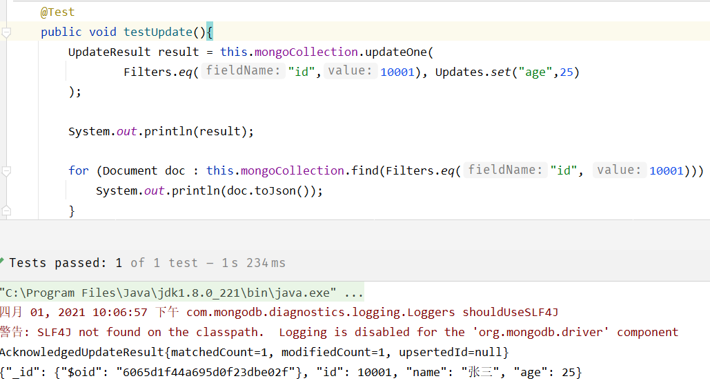
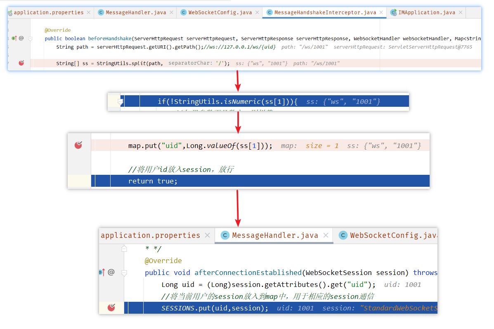
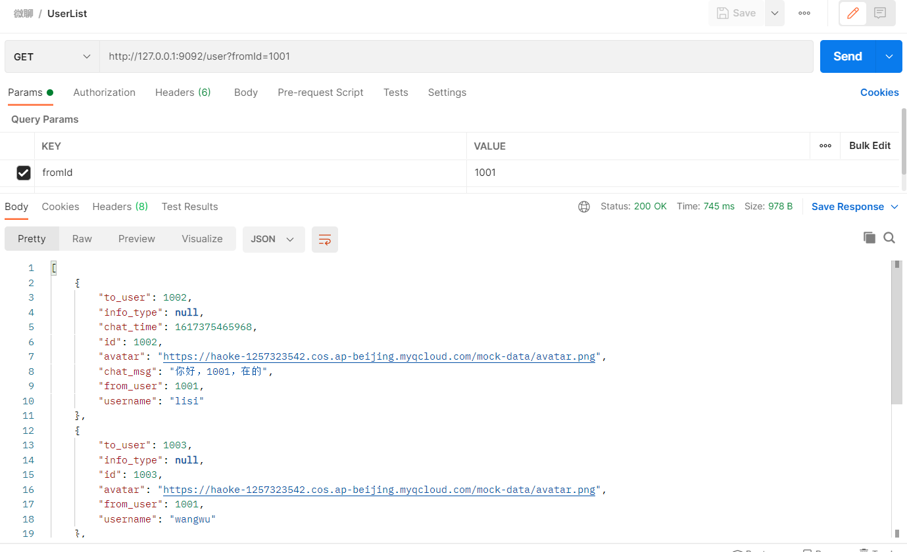
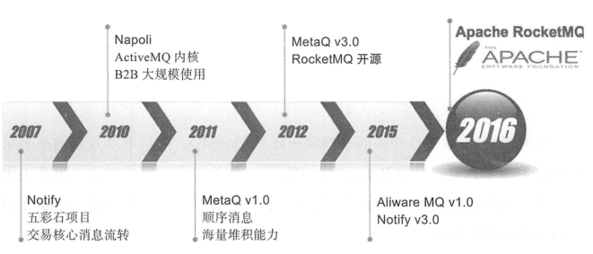
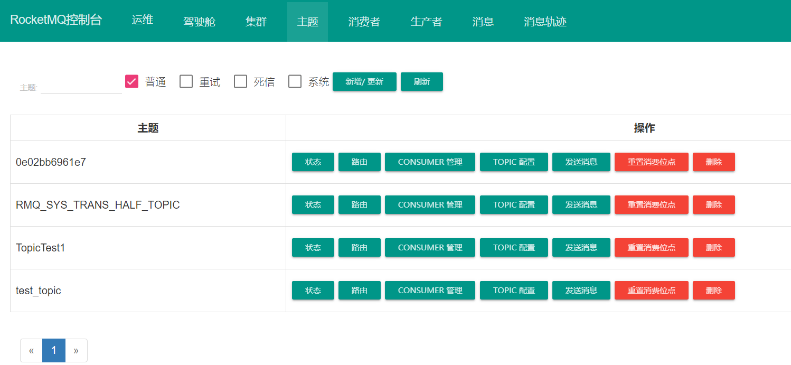
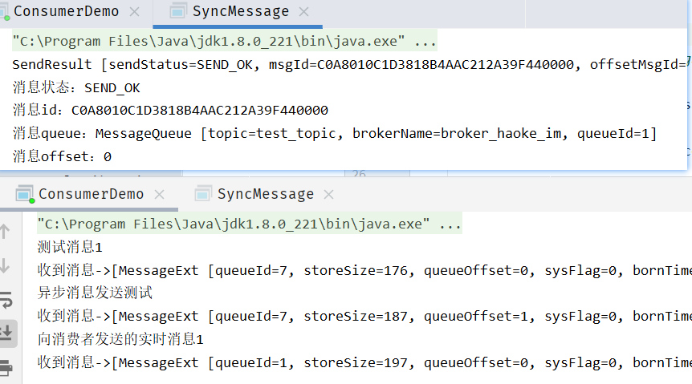
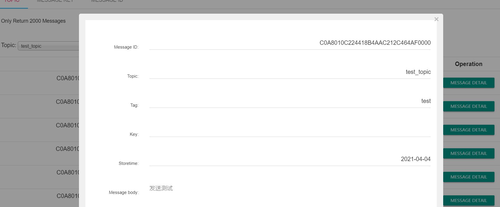
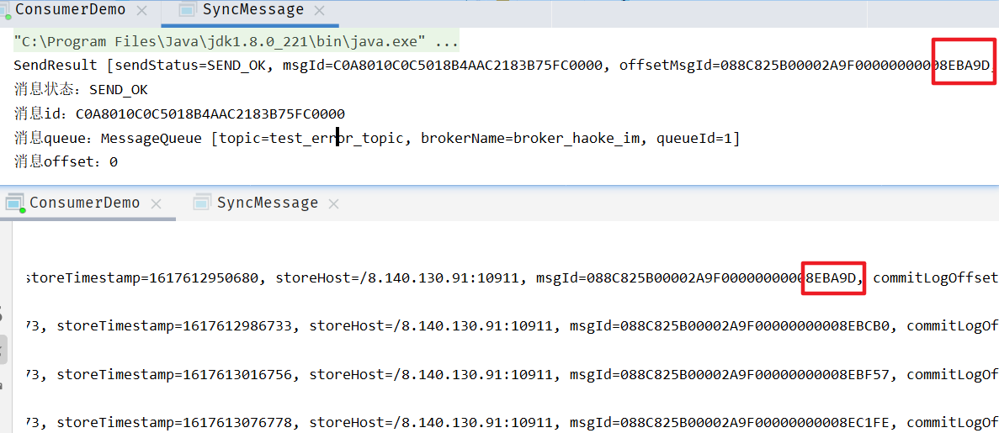

# 微聊功能

-   WebSocket
    -   简介
    -   WebSocket模拟
    -   SpringBoot整合WebSocket
-   MongoDB
    -   简介
    -   基本使用
    -   JavaAPI
    -   SpringBoot整合
-   WebSocket和MongoDB搭建微聊系统
-   RocketMQ
    -   简介及相关概念
    -   JavaAPI
    -   SpringBoot整合RocketMQ
    -   消息的顺序收发
    -   消息系统的事务、存储、重试策略
    -   消息系统的集群


## WebSocket

>   网站中的消息功能

**服务端消息实时推送到前端**？

解决方案：采用轮询方式，即：通过js不断的请求服务器，查看是否有新数据

**弊端**：

资源浪费

### 简介

使用WebSocket技术解决

WebSocket 是HTML5一种新的协议。它实现了浏览器与服务器**全双工通信**。它是一种在单个TCP连接上进行全双工通讯协议。

>   全双工和单工的区别？
>
>   -   全双工（Full Duplex）。通信传输时允许数据在两个方向上同时传输，它在能力上相当于两个单工通信方式的结合。全双工指可以同时（瞬时）进行信号的双向传输（A→B且B→A）。
>   -   单工、半双工（Half Duplex），所谓半双工就是指一个时间段内只有一个动作发生。

#### http与WebSocket区别

http协议是短连接，因为请求之后，都会关闭连接，下次重新请求数据，需要再次打开链接


WebSocket协议是一种长链接，只需要通过一次请求来初始化链接，然后所有的请求和响应都是通过这个TCP链接进行通讯。


#### 浏览器支持情况

https://caniuse.com/?search=websocket


#### Spring相关注解说明

>   @ServerEndpoint("/websocket/{uid}")

-   声明这是一个websocket服务
-   在地址中可以指定参数，需要通过{}进行占位

>    @OnOpen

-   该方法将在建立连接后执行，会传入session对象，就是客户端与服务端建立的长连接通道
-   public void onOpen(Session session, @PathParam("uid") String uid) throws IOException{}
-   通过@PathParam获取url申明中的参数

>   @OnClose

-   该方法是在连接关闭后执行
-   用法：public void onClose() {}

>    @OnMessage

-   该方法用于接收客户端发来的消息
-   用法：public void onMessage(String message, Session session) throws IOException {}
-   message：发来的消息数据
    session：会话对象（也是通道）

-   发送消息到客户端
    -   通过session进行发送
    -   用法：session.getBasicRemote().sendText("你好");

### WebSocketDemo

#### pom.xml

```xml
<?xml version="1.0" encoding="UTF-8"?>
<project xmlns="http://maven.apache.org/POM/4.0.0"
         xmlns:xsi="http://www.w3.org/2001/XMLSchema-instance"
         xsi:schemaLocation="http://maven.apache.org/POM/4.0.0 http://maven.apache.org/xsd/maven-4.0.0.xsd">
    <modelVersion>4.0.0</modelVersion>

    <groupId>org.example</groupId>
    <artifactId>websocket</artifactId>
    <version>1.0-SNAPSHOT</version>

    <packaging>war</packaging>

    <dependencies>
        <dependency>
            <groupId>javax</groupId>
            <artifactId>javaee-api</artifactId>
            <version>7.0</version>
            <scope>provided</scope>
        </dependency>
    </dependencies>

    <build>
        <plugins>
            <plugin>
                <groupId>org.apache.maven.plugins</groupId>
                <artifactId>maven-compiler-plugin</artifactId>
                <version>3.2</version>
                <configuration>
                    <source>1.8</source>
                    <target>1.8</target>
                    <encoding>UTF-8</encoding>
                </configuration>
            </plugin>

            <!-- 配置Tomcat插件 -->
            <plugin>
                <groupId>org.apache.tomcat.maven</groupId>
                <artifactId>tomcat7-maven-plugin</artifactId>
                <version>2.2</version>
                <configuration>
                    <port>8082</port>
                    <path>/</path>
                </configuration>
            </plugin>
        </plugins>
    </build>
</project>
```

#### 实现websocket服务

```java
package com.websocket;

import javax.websocket.*;
import javax.websocket.server.PathParam;
import javax.websocket.server.ServerEndpoint;
import java.io.IOException;

@ServerEndpoint("/websocket/{uid}")
public class MyWebSocket {
    @OnOpen
    public void onOpen(Session session, @PathParam("uid")String uid) throws IOException {
        session.getBasicRemote().sendText("你好, "+ uid + "，欢迎连接到websocket!");
    }

    @OnClose
    public void onClose(){
        System.out.println(this + "关闭连接");
    }

    @OnError
    public void onError(Session session,Throwable error){
        System.out.println("发生错误！");
        error.printStackTrace();
    }

    @OnMessage
    public void onMessage(String message,Session session) throws IOException {
        System.out.println("接收到消息 " + message);
        session.getBasicRemote().sendText("消息已收到");
    }
}
```

编写完成后，无需额外的配置，直接启动tomcat即可


**测试**

http://wstool.js.org/


#### 编写js客户端

```html
<!DOCTYPE html>
<html lang="en">
<head>
    <meta charset="UTF-8">
    <title>TestWebSocket</title>
</head>
<body>
<script>
    const socket = new WebSocket("ws://127.0.0.1:8082/websocket/uuu");

    socket.onopen = (ws) =>{
        console.log("建立连接",ws)
    }

    socket.onmessage =(ws)=>{
        console.log("接收到消息 >> ",ws.data);
    }

    socket.onclose = (ws) =>{
        console.log("连接已断开！", ws);
    }

    socket.onerror = (ws) => {
        console.log("发送错误！", ws);
    }

    // 2秒后向服务端发送消息
    setTimeout(()=>{
        socket.send("js客户端发送一条测试消息");
    },2000);
    // 5秒后断开连接
    setTimeout(()=>{
        socket.close();
    },5000);
</script>
</body>
</html>
```


### SpringBoot整合WebSocket

#### 导入依赖

```xml
<!--spring boot的支持-->
<parent>
    <groupId>org.springframework.boot</groupId>
    <artifactId>spring-boot-starter-parent</artifactId>
    <version>2.4.3</version>
</parent>

<dependencies>
    <!--<dependency>
            <groupId>javax</groupId>
            <artifactId>javaee-api</artifactId>
            <version>7.0</version>
            <scope>provided</scope>
        </dependency>-->
    <!--springboot的websocket与javaee-api有冲突-->
    <dependency>
        <groupId>org.springframework.boot</groupId>
        <artifactId>spring-boot-starter-websocket</artifactId>
    </dependency>
</dependencies>
```

#### 编写WebsocketHandler

```java
package com.websocket.spring;

@Component
public class MyHandler extends TextWebSocketHandler {
    @Override
    public void handleTextMessage(WebSocketSession session, TextMessage message)
            throws IOException {
        System.out.println("获取到消息 >> " + message.getPayload());
        session.sendMessage(new TextMessage("消息已收到"));
        if(message.getPayload().equals("10")){
            for (int i = 0; i < 10; i++) {
                session.sendMessage(new TextMessage("消息 -> " + i));
                try {
                    Thread.sleep(100);
                } catch (InterruptedException e) {
                    e.printStackTrace();
                }
            }
        }
    }

    @Override
    public void afterConnectionEstablished(WebSocketSession session) throws Exception {
        session.sendMessage(new TextMessage("你好，"+session.getAttributes().get("uid")+"欢迎连接到ws服务"));
    }

    @Override
    public void afterConnectionClosed(WebSocketSession session, CloseStatus status)
            throws Exception {
        System.out.println("断开连接！");
    }
}
```

#### 编写配置

```java
package com.websocket.spring;

@Configuration
@EnableWebSocket
public class WebSocketConfig implements WebSocketConfigurer {

    @Autowired
    private MyHandler myHandler;

    @Autowired
    private MyHandshakeInterceptor myHandshakeInterceptor;

    @Override
    public void registerWebSocketHandlers(WebSocketHandlerRegistry microChatHandlerRegistry) {
        microChatHandlerRegistry.addHandler(myHandler,"/ws")
                .setAllowedOrigins("*");//跨域支持
    }
}
```

#### 编写启动类

```java
package com.websocket;

@SpringBootApplication
public class MyApplication {
    public static void main(String[] args) {
        SpringApplication.run(MyApplication.class, args);
    }
}
```

#### 测试



## MongoDB

MongoDB是一个基于分布式（海量数据存储）文件存储的数据库。旨在为WEB应用提供可扩展的高性能数据存储解决方案。

MongoDB是一个介于关系数据库和非关系数据库之间的产品，是非关系数据库当中功能最丰富，最像关系数据库的，它支持的数据结构非常松散，是类似json的bson格式，因此可以存储比较复杂的数据类型。  

实现类似关系数据库单表查询的绝大部分功能，而且还支持对数据建立索引。

官网：https://www.mongodb.com/

### 基本概念

| SQL术语/概念 | MongoDB术语/概念 | 解释/说明                           |
| ------------ | ---------------- | ----------------------------------- |
| database     | database         | 数据库                              |
| table        | collection       | 数据库表/集合                       |
| row          | document         | 数据记录行/文档                     |
| column       | field            | 数据字段/域                         |
| index        | index            | 索引                                |
| table joins  |                  | 表连接,MongoDB不支持                |
| primary key  | primary key      | 主键,MongoDB自动将_id字段设置为主键 |

### 基本使用

#### docker安装MongoDB

```shell
#拉取镜像
docker pull mongo

#创建容器
docker create --name mongodb -p 27017:27017 -v /data/mongodb-data:/data/db mongo

#启动容器
docker start mongodb

#进入容器
docker exec -it mongodb /bin/bash
#使用MongoDB客户端进行操作
mongo

#查询所有的数据库
show dbs
```

#### 表操作

```shell
#查看所有的数据库
> show dbs
admin 0.000GB
config 0.000GB
local 0.000GB

#通过use关键字切换数据库
> use admin
switched to db admin

#创建数据库
#说明：在MongoDB中，数据库是自动创建的，通过use切换到新数据库中，进行插入数据即可自动创建数据库
> use testdb
switched to db testdb
> show dbs #并没有创建数据库
admin 0.000GB
config 0.000GB
local 0.000GB

> db.user.insert({id:1,name:'zhangsan'}) #插入数据
WriteResult({ "nInserted" : 1 })
> show dbs
admin 0.000GB
config 0.000GB
local 0.000GB
testdb 0.000GB #数据库自动创建

#查看表
> show tables
user
> show collections
user

#删除集合（表）
> db.user.drop()
true #如果成功删除选定集合，则 drop() 方法返回 true，否则返回 false。

#删除数据库
> use testdb #先切换到要删除的数据中
switched to db testdb

> db.dropDatabase() #删除数据库
{ "dropped" : "testdb", "ok" : 1 }
> show dbs
admin 0.000GB
config 0.000GB
local 0.000G
```

#### 新增数据

在MongoDB中，存储的文档结构是一种类似于json的结构，称之为bson（全称为：Binary JSON）

>   语法：db.COLLECTION_NAME.insert(document)  

```shell
> db.user.insert({id:1,username:'zhangsan',age:20})
WriteResult({ "nInserted" : 1 })
> db.user.save({id:2,username:'lisi',age:25})
WriteResult({ "nInserted" : 1 })

> db.user.find() #查询数据
{ "_id" : ObjectId("5c08c0024b318926e0c1f6dc"), "id" : 1, "username" : "zhangsan",
"age" : 20 }
{ "_id" : ObjectId("5c08c0134b318926e0c1f6dd"), "id" : 2, "username" : "lisi",
"age" : 25 }
```

#### 查询数据

>   db.user.find([query],[fields])

query ：可选，使用查询操作符指定查询条件
fields ：可选，使用投影操作符指定返回的键。查询时返回文档中所有键值， 只需省略该参数即可（默认省略）

>   db.col.find().pretty()  以格式化的方式来显示所有文档

| 操作        | 格式                    | 范例                                       |
| ----------- | ----------------------- | ------------------------------------------ |
| 等于        | {<key>:<value> }        | db.col.find({"by":"黑马程序 员"}).pretty() |
| 小于        | {<key>:{$lt: <value>}}  | db.col.find({"likes": {$lt:50}}).pretty()  |
| 小于或 等于 | {<key>:{$lte: <value>}} | db.col.find({"likes": {$lte:50}}).pretty() |
| 大于        | {<key>:{$gt: <value>}}  | db.col.find({"likes": {$gt:50}}).pretty()  |
| 大于或 等于 | {<key>:{$gte: <value>}} | db.col.find({"likes": {$gte:50}}).pretty() |
| 不等于      | {<key>:{$ne: <value>}}  | db.col.find({"likes": {$ne:50}}).pretty()  |

```shell
#查询全部数据
db.user.find() 

#只查询id与username字段
db.user.find({},{id:1,username:1})

#查询数据条数
db.user.find().count() 

#查询id为1的数据
db.user.find({id:1}) 

#查询小于等于21的数据
db.user.find({age:{$lte:21}})

#and查询，age小于等于21并且id大于等于2
db.user.find({age:{$lte:21}, id:{$gte:2}})

#查询id=1 or id=2
db.user.find({$or:[{id:1},{id:2}]}) 

#分页查询：Skip()跳过几条，limit()查询条数
db.user.find().limit(2).skip(1) #跳过1条数据，查询2条数据

db.user.find().sort({id:-1}) #按照age倒序排序，-1为倒序，1为正序
```

#### 更新数据

update() 方法用于更新已存在的文档

>   db.collection.update(
>   	<query>,
>   	<update>,
>   	[
>   		upsert: <boolean>,
>   		multi: <boolean>,
>   		writeConcern: <document>
>   	]
>   )  

-   query : update的查询条件
-   update : update的对象和一些更新的操作符（如 inc...）等，
-   upsert : 可选，这个参数的意思是，如果不存在update的记录，是否插入objNew,true为插入，默认是false，不插入。
-   multi : 可选，mongodb 默认是false,只更新找到的第一条记录，如果这个参数为true,就把按条件查出来多条
    记录全部更新。
-   writeConcern :可选，抛出异常的级别  

```shell
> db.user.update({id:1},{$set:{age:22}}) #更新数据
WriteResult({ "nMatched" : 1, "nUpserted" : 0, "nModified" : 1 })
WriteResult({ "nMatched" : 1, "nUpserted" : 0, "nModified" : 1 })
```

-   nMatched：数据匹配数量
-   nUpserted：匹配不存在时更新数量
-   nModified：修改数量

```shell
#注意：如果这样写，会删除掉其他的字段
> db.user.update({id:1},{age:25})
WriteResult({ "nMatched" : 1, "nUpserted" : 0, "nModified" : 1 })

> db.user.find()
{ "_id" : ObjectId("5c08c0024b318926e0c1f6dc"), "age" : 25 }
{ "_id" : ObjectId("5c08c0134b318926e0c1f6dd"), "id" : 2, "username" : "lisi",
"age" : 25 }
```

```shell
#更新不存在的字段，会新增字段
> db.user.update({id:2},{$set:{sex:1}}) #更新数据
> db.user.find()
{ "_id" : ObjectId("5c08c0024b318926e0c1f6dc"), "age" : 25 }
{ "_id" : ObjectId("5c08c0134b318926e0c1f6dd"), "id" : 2, "username" : "lisi",
"age" : 25, "sex" : 1 }
```

```shell
#更新不存在的数据，默认不会新增数据
> db.user.update({id:3},{$set:{sex:1}})
WriteResult({ "nMatched" : 0, "nUpserted" : 0, "nModified" : 0 })

> db.user.find()
{ "_id" : ObjectId("5c08c0024b318926e0c1f6dc"), "age" : 25 }
{ "_id" : ObjectId("5c08c0134b318926e0c1f6dd"), "id" : 2, "username" : "lisi",
"age" : 25, "sex" : 1 }

#如果设置第一个参数为true，就是新增数据
> db.user.update({id:3},{$set:{sex:1}},true)
WriteResult({
"nMatched" : 0,
"nUpserted" : 1,
"nModified" : 0,
"_id" : ObjectId("5c08cb281418d073246bc642")
})
```

#### 删除数据

>   db.collection.remove(
>   	<query>,
>   	{
>   		justOne: <boolean>,
>   		writeConcern: <document>
>   	}
>   )  

-   query :（可选）删除的文档的条件。
-   justOne : （可选）如果设为 true 或 1，则只删除一个文档，如果不设置该参数，或使用默认值 false，则删除所有匹配条件的文档。
-   writeConcern :（可选）抛出异常的级别。  

```shell
> db.user.remove({age:25})
WriteResult({ "nRemoved" : 2 }) #删除了2条数据

#插入4条测试数据
db.user.insert({id:1,username:'zhangsan',age:20})
db.user.insert({id:2,username:'lisi',age:21})
db.user.insert({id:3,username:'wangwu',age:22})
db.user.insert({id:4,username:'zhaoliu',age:22})

> db.user.remove({age:22},true)
WriteResult({ "nRemoved" : 1 }) #删除了1条数据

#删除所有数据
> db.user.remove({})
```

```shell
#说明：为了简化操作，官方推荐使用deleteOne()与deleteMany()进行删除数据操作。
db.user.deleteOne({id:1})
db.user.deleteMany({}) #删除所有数据
```

#### 索引

MongoDB在读取数据时必须扫描集合中的每个文件并选取
那些符合查询条件的记录。这种扫描全集合的查询效率是非常低的，特别在处理大量的数据时，查询可以要花费几十秒甚至几分钟，这对网站的性能是非常致命的。  

索引是特殊的数据结构，索引存储在一个易于遍历读取的数据集合中，索引是对数据库表中一列或多列的值进行排序的一种结构  ，索引通常能够极大的提高查询的效率  

##### 查看索引

```shell
#查看索引
> db.user.getIndexes()
[
    {
        "v" : 2,#索引版本
        "key" : {#索引字段
        	"_id" : 1 #正序还是倒序
    	},
    	"name" : "_id_",#索引名
    	"ns" : "testdb.user" #命名空间
    }
]
#说明：1表示升序创建索引，-1表示降序创建索引
```

##### 创建索引

```shell
#创建索引
> db.user.createIndex({'age':1})
{
    "createdCollectionAutomatically" : false,
    "numIndexesBefore" : 1,
    "numIndexesAfter" : 2,
    "ok" : 1
}
```

##### 删除索引

```shell
#删除索引
db.user.dropIndex("age_1")
#或者，删除除了_id之外的索引
db.user.dropIndexes()
```

##### 创建联合索引

```shell
#创建联合索引
db.user.createIndex({'age':1, 'id':-1})
```

##### 查看索引大小

```shell
#查看索引大小，单位：字节
db.user.totalIndexSize()
```

#### 执行详情

MongoDB 查询分析可以确保我们建议的索引是否有效，是查询语句性能分析的重要工具 

MongoDB内部使用的是JS引擎，编写JS脚本执行循环语句

```
#插入1000条数据
for(var i=1;i<1000;i++)db.users.insert({id:100+i,username:'name_'+i,age:10+i})
```

```shell
#查看执行计划
> db.user.find({age:{$gt:100},id:{$lt:200}}).explain()
    {
    "queryPlanner" : {
        "plannerVersion" : 1,
        "namespace" : "testdb.user",
        "indexFilterSet" : false,
        "parsedQuery" : {
            "$and" : [
                {
                    "id" : {
                        "$lt" : 200
                    }
                },
                {
                    "age" : {
                        "$gt" : 100
                    }
                }
        	]
    	},
    	"winningPlan" : { #最佳执行计划
        	"stage" : "FETCH", #查询方式，
#COLLSCAN/全表扫描 < IXSCAN/索引扫描 < FETCH/根据索引去检索文档 < SHARD_MERGE/合并分片结果 < IDHACK/针对_id进行查询
        	"inputStage" : {
            	"stage" : "IXSCAN",
            	"keyPattern" : {
                    "age" : 1,
                    "id" : -1
            	},
            	"indexName" : "age_1_id_-1",
            	"isMultiKey" : false,
            	"multiKeyPaths" : {
                    "age" : [ ],
                    "id" : [ ]
                },
                "isUnique" : false,
                "isSparse" : false,
                "isPartial" : false,
                "indexVersion" : 2,
                "direction" : "forward",
                "indexBounds" : {
                    "age" : [
                        "(100.0, inf.0]"
                    ],
                    "id" : [
                        "(200.0, -inf.0]"
                    ]
                }
        	}
    	},
		"rejectedPlans" : [ ]
    },
    
    "serverInfo" : {
        "host" : "c493d5ff750a",
        "port" : 27017,
        "version" : "4.0.3",
        "gitVersion" : "7ea530946fa7880364d88c8d8b6026bbc9ffa48c"
    },
	"ok" : 1
}
```

#### GUI——robo 3T

### 通过javaApi操作

#### 创建工程

com-mongodb

`pom.xml`

```xml
<dependencies>
    <dependency>
        <groupId>org.mongodb</groupId>
        <artifactId>mongodb-driver-sync</artifactId>
        <version>3.9.1</version>
    </dependency>
    
    <dependency>
        <groupId>junit</groupId>
        <artifactId>junit</artifactId>
        <version>4.12</version>
        <scope>test</scope>
    </dependency>
    <dependency>
    	<groupId>org.projectlombok</groupId>
        <artifactId>lombok</artifactId>
    	<version>1.18.4</version>
    </dependency>
</dependencies>

<build>
    <plugins>
    	<!-- java编译插件 -->
        <plugin>
            <groupId>org.apache.maven.plugins</groupId>
            <artifactId>maven-compiler-plugin</artifactId>
            <version>3.2</version>
            <configuration>
                <source>1.8</source>
                <target>1.8</target>
                <encoding>UTF-8</encoding>
            </configuration>
        </plugin>
    </plugins>
</build>
```

#### Demo

如何连接到MongoDB，如何选择数据库、表，进行查询的操作 

```java
package com.mongodb;

import com.mongodb.client.MongoClient;
import com.mongodb.client.MongoClients;
import com.mongodb.client.MongoCollection;
import com.mongodb.client.MongoDatabase;
import org.bson.Document;

public class MongodbDemo {

    public static void main(String[] args) {
        //建立连接
        MongoClient mongoClient = MongoClients.create("mongodb://8.140.130.91:27017");

        //选择数据库
        MongoDatabase mongoDatabase = mongoClient.getDatabase("testdb");

        //选择表
        MongoCollection<Document> userCollection = mongoDatabase.getCollection("user");

        //查询表
        for (Document document : userCollection.find().limit(10)) {
            System.out.println(document.toJson());
        }

        mongoClient.close();
    }
}
```

#### CRUD操作

##### 初始化建立连接

```java
package com.mongodb;

import com.mongodb.client.MongoClient;
import com.mongodb.client.MongoClients;
import com.mongodb.client.MongoCollection;
import com.mongodb.client.MongoDatabase;
import com.mongodb.client.model.Filters;
import org.bson.Document;
import org.junit.Before;
import org.junit.Test;

public class TestCRUD {

    private MongoCollection<Document> mongoCollection;

    @Before
    public void init(){
        //建立连接
        MongoClient mongoClient = MongoClients.create("mongodb://8.140.130.91:27017");

        //选择数据库
        MongoDatabase mongoDatabase = mongoClient.getDatabase("testdb");

        //选择表
        this.mongoCollection = mongoDatabase.getCollection("users");
    }
}
```

##### 查询

-   组合查询

```java
// 复杂查询age<=50并且id>=100的用户信息，并且按照id倒序排序，只返回id，age字段，不返回_id字段
@Test
public void testQuery(){
    for (Document document : 
         this.mongoCollection.find(
            Filters.and(
                    Filters.lte("age",50),
                    Filters.gte("id",100)
            )
    	 )
    ) {
        System.out.println(document);
    }
}
```


-   排序

```java
// 复杂查询age<=50并且id>=100的用户信息，并且按照id倒序排序，只返回id，age字段，不返回_id字段
@Test
public void testQuery(){
    for (Document document : 
        this.mongoCollection.find(
            Filters.and(
                Filters.lte("age",50),
                Filters.gte("id",100)
         	)
    	).sort(Sorts.descending("id"))//降序
    ) {
        System.out.println(document);
    }
}
```


-   指定属性

```java
// 复杂查询age<=50并且id>=100的用户信息，并且按照id倒序排序，只返回id，age字段，不返回_id字段
@Test
public void testQuery(){
    for (Document document : this.mongoCollection.find(
        Filters.and(
            Filters.lte("age",50),
            Filters.gte("id",100)
        )
    ).sort(Sorts.descending("id"))//降序
         .projection(
             Projections.fields(
                 Projections.include("id","age"),
                 Projections.excludeId()//排除ObjectID
             )
         )
        ) {
        System.out.println(document);
    }
}
```


##### 新增数据

```java
@Test
public void testInsert(){
    Document document = new Document("id",10002)
        .append("name", "张三")
        .append("age", 30);
    this.mongoCollection.insertOne(document);
    System.out.println("插入数据");

    for (Document document1 : this.mongoCollection.find(Filters.eq("id",10002))) {
        System.out.println(document1.toJson());
    }
}
```


##### 测试删除

```java
@Test
public void testDelete(){
    DeleteResult result = this.mongoCollection.deleteOne(Filters.eq("id",10002));

    System.out.println(result);
}
```


##### 测试更新

```java
@Test
public void testUpdate(){
    UpdateResult result = this.mongoCollection.updateOne(
        Filters.eq("id",10001), Updates.set("age",25)
    );

    System.out.println(result);

    for (Document doc : this.mongoCollection.find(Filters.eq("id", 10001))) {
        System.out.println(doc.toJson());
    }
}
```



#### 面向对象操作

前面对MongoDB的操作都是基于Document对象操作，操作略显繁琐 

创建Person、Address

```java
@Data
@AllArgsConstructor
@NoArgsConstructor
public class Person {
    private ObjectId id;
    private String name;
    private int age;
    private Address address;
}
```

```java
@Data
@AllArgsConstructor
@NoArgsConstructor
public class Address {
    private String street;
    private String city;
    private String zip;
}
```

##### 建立连接

```java
MongoCollection<Person> personCollection;

@Before
public void init(){
    //定义对象的解码注册器
    CodecRegistry pojoCodecRegistry = CodecRegistries.fromRegistries(
        MongoClientSettings.getDefaultCodecRegistry(),
        CodecRegistries.fromProviders(PojoCodecProvider.builder().automatic(true).build())
    );

    //建立连接
    MongoClient mongoClient = MongoClients.create("mongodb://8.140.130.91:27017");

    //选择数据库 并且 注册解码器
    MongoDatabase mongoDatabase = mongoClient.getDatabase("testdb").withCodecRegistry(pojoCodecRegistry);
    //选择表
    this.personCollection = mongoDatabase.getCollection("person",Person.class);
}
```

##### 新增一条数据

```java
@Test
public void testInsert(){
    Person person = new Person(ObjectId.get(), "张三", 20,new Address("人民路", "上海市", "666666"));

    this.personCollection.insertOne(person);
    System.out.println("插入数据成功");

    System.out.println("======");
    for (Person person1 : this.personCollection.find(Filters.eq("name", "张三"))) {
        System.out.println(person1);
    }
}
```


##### 新增很多数据

```java
@Test
public void testInserts() {
    List<Person> personList = Arrays.asList(
        new Person(ObjectId.get(), "张三", 20, new Address("人民路", "上海市", "666666")),
        new Person(ObjectId.get(), "李四", 21, new Address("北京西路", "上海市", "666666")),
        new Person(ObjectId.get(), "王五", 22, new Address("南京东路", "上海市", "666666")),
        new Person(ObjectId.get(), "赵六", 23, new Address("陕西南路", "上海市", "666666")),
        new Person(ObjectId.get(), "孙七", 24, new Address("南京西路", "上海市", "666666"))
    );

    this.personCollection.insertMany(personList);
    System.out.println("插入数据成功");

    System.out.println("=====");
    testQuery();
}
```


##### 删除单条数据

```java
@Test
public void testDelete(){
    DeleteResult result = this.personCollection.deleteOne(Filters.eq("name","张三"));
    System.out.println(result);
}
```


### SpringBoot整合MongoDB

spring-data对MongoDB做了支持，使用spring-data-mongodb可以简化MongoDB的操作

https://spring.io/projects/spring-data-mongodb

#### 导入依赖

```xml
<parent>
    <groupId>org.springframework.boot</groupId>
    <artifactId>spring-boot-starter-parent</artifactId>
    <version>2.4.3</version>
</parent>

<dependency>
    <groupId>org.springframework.boot</groupId>
    <artifactId>spring-boot-starter-data-mongodb</artifactId>
</dependency>
<dependency>
    <groupId>org.springframework.boot</groupId>
    <artifactId>spring-boot-starter-test</artifactId>
    <scope>test</scope>
</dependency>
```

#### 配置文件

```properties
# Spring boot application
spring.application.name = example-mongodb
spring.data.mongodb.uri=mongodb://8.140.130.91:27017/testdb
```

#### PersonDao

```java
package com.mongodb.spring.dao;

import com.mongodb.client.result.DeleteResult;
import com.mongodb.client.result.UpdateResult;
import com.mongodb.pojo.Person;
import org.springframework.beans.factory.annotation.Autowired;
import org.springframework.data.mongodb.core.MongoTemplate;
import org.springframework.data.mongodb.core.query.Criteria;
import org.springframework.data.mongodb.core.query.Update;
import org.springframework.stereotype.Component;
import org.springframework.data.mongodb.core.query.Query;

import java.util.List;

@Component
public class PersonDao {

    @Autowired
    MongoTemplate mongoTemplate;

    public Person savePerson(Person person){
        //默认集合名与实体名同名
        Person savedPerson = this.mongoTemplate.save(person);
        return savedPerson;
    }

    public List<Person> queryPersonListByName(String name) {
        Query query = Query.query(Criteria.where("name").is(name));

        return this.mongoTemplate.find(query,Person.class);
    }


    /*
    * 分页查询
    * */
    public List<Person> queryPersonListByPage(Integer page, Integer rows) {
        Query query = new Query().limit(rows).skip((page - 1) * rows);
        return this.mongoTemplate.find(query, Person.class);
    }

    /*
    * 更新数据
    * */
    public UpdateResult update(Person person){
        Query query = Query.query(Criteria.where("id").is(person.getId()));

        Update update = Update.update("age",person.getAge());

        return this.mongoTemplate.updateMulti(query,update,Person.class);
    }

    /*
    * 删除数据
    * */
    public DeleteResult deleteResultById(String id){
        Query query = Query.query(Criteria.where("id").is(id));

        return this.mongoTemplate.remove(query,Person.class);
    }
}
```

#### 编写启动类

```java
package com.mongodb.spring;

import org.springframework.boot.SpringApplication;
import org.springframework.boot.autoconfigure.SpringBootApplication;

@SpringBootApplication
public class MongoApplication {

    public static void main(String[] args) {
        SpringApplication.run(MongoApplication.class,args);
    }
}
```

#### 测试单元

```java
package com.mongodb.spring;

import com.mongodb.client.result.UpdateResult;
import com.mongodb.spring.dao.PersonDao;
import com.mongodb.pojo.Address;
import com.mongodb.pojo.Person;
import org.bson.types.ObjectId;
import org.junit.Test;
import org.junit.runner.RunWith;
import org.springframework.beans.factory.annotation.Autowired;
import org.springframework.boot.test.context.SpringBootTest;
import org.springframework.test.context.junit4.SpringRunner;

import java.util.List;

@RunWith(SpringRunner.class)
@SpringBootTest
public class TestPersonDao {

    @Autowired
    private PersonDao personDao;

    /*
     * 新增
     * */
    @Test
    public void testSave(){
        Person person =new Person(ObjectId.get(), "张三", 20, new Address("人民路", "上海市", "666666"));
        System.out.println(this.personDao.savePerson(person));;
    }

    @Test
    public void testQuery() {
        List<Person> personList = this.personDao.queryPersonListByName("张三");
        for (Person person : personList) {
            System.out.println(person);
        }
    }

    @Test
    public void testQueryByPage(){
        List<Person> personList = this.personDao.queryPersonListByPage(1,3);

        for (Person person : personList) {
            System.out.println(person);
        }
    }

    @Test
    public void testUpdate() {
        Person person = new Person();
        person.setId(new ObjectId("60667404d8d68907198c10f3"));
        person.setAge(30);
        UpdateResult updateResult = this.personDao.update(person);

        System.out.println(updateResult);
    }

    @Test
    public void testDelete(){
        System.out.println(this.personDao.deleteResultById("6065d8edaccf9851f047b2d3"));
    }
}
```

## 搭建微聊系统

-   Spring WebSocket
-   Spring-data-MongoDB

### 创建工程

```xml
<!--springboot启动器-->
<parent>
    <artifactId>spring-boot-starter-parent</artifactId>
    <groupId>org.springframework.boot</groupId>
    <version>2.4.3</version>
</parent>

<dependencies>
    <!--web依赖-->
    <dependency>
        <groupId>org.springframework.boot</groupId>
        <artifactId>spring-boot-starter-web</artifactId>
    </dependency>
    <!--mongodb依赖-->
    <dependency>
        <groupId>org.springframework.data</groupId>
        <artifactId>spring-data-mongodb</artifactId>
    </dependency>
    <!--mongo驱动-->
    <dependency>
        <groupId>org.mongodb</groupId>
        <artifactId>mongodb-driver-sync</artifactId>
    </dependency>
    <!--websocket-->
    <dependency>
        <groupId>org.springframework.boot</groupId>
        <artifactId>spring-boot-starter-websocket</artifactId>
    </dependency>
    <dependency>
        <groupId>org.springframework.boot</groupId>
        <artifactId>spring-boot-starter-test</artifactId>
    </dependency>
    <dependency>
        <groupId>junit</groupId>
        <artifactId>junit</artifactId>
        <scope>test</scope>
    </dependency>
    <dependency>
        <groupId>org.projectlombok</groupId>
        <artifactId>lombok</artifactId>
    </dependency>
    <dependency>
        <groupId>commons-lang</groupId>
        <artifactId>commons-lang</artifactId>
        <version>2.6</version>
    </dependency>
</dependencies>

<!--java编译插件-->
<build>
    <plugins>
        <plugin>
            <groupId>org.apache.maven.plugins</groupId>
            <artifactId>maven-compiler-plugin</artifactId>
            <version>3.8.1</version>
            <configuration>
                <source>1.8</source>
                <target>1.8</target>
                <encoding>UTF-8</encoding>
            </configuration>
        </plugin>
    </plugins>
</build>
```

### 配置文件

```properties
# Spring boot application
spring.application.name = com-haoke-mongodb
server.port=9092

spring.data.mongodb.uri=mongodb://8.140.130.91:27017/haoke
```

### Dao——Mongo

#### 编写pojo对象

##### Message

```java
package com.haoke.im.pojo;

import lombok.AllArgsConstructor;
import lombok.Builder;
import lombok.Data;
import lombok.NoArgsConstructor;
import org.bson.types.ObjectId;
import org.springframework.data.annotation.Id;
import org.springframework.data.mongodb.core.index.Indexed;
import org.springframework.data.mongodb.core.mapping.Document;
import org.springframework.data.mongodb.core.mapping.Field;

import java.util.Date;

@Data
@AllArgsConstructor
@NoArgsConstructor
@Builder
@Document(collection = "message")//Mongo默认会将实体名作为集合名
public class Message {
    @Id
    private ObjectId id;

    /*
    * 消息
    * */
    private String msg;
    /*
    * 消息状态 1-未读 ，2-已读
    * */
    @Indexed
    private Integer status;

    /*
    * 发送时间
    * */
    @Indexed
    @Field("send_date")
    private Date sendDate;

    /*
    * 读取时间
    * */
    @Field("read_date")
    private Date readDate;

    /*
    * 发送方
    * */
    private User from;

    /*
    * 接收方
    * */
    private User to;
}
```

##### User

```java
package com.haoke.im.pojo;

import lombok.AllArgsConstructor;
import lombok.Builder;
import lombok.Data;
import lombok.NoArgsConstructor;

@Data
@AllArgsConstructor
@NoArgsConstructor
@Builder
public class User {
    private Long id;
    private String username;
}
```

##### mock UserData

```java
package com.haoke.im.pojo;

import java.util.HashMap;
import java.util.Map;

public class UserData {
    public static final Map<Long,User> USER_MAP = new HashMap<>();

    static {
        USER_MAP.put(1001L, User.builder().id(1001L).username("zhangsan").build());
        USER_MAP.put(1002L, User.builder().id(1002L).username("lisi").build());
        USER_MAP.put(1003L, User.builder().id(1003L).username("wangwu").build());
        USER_MAP.put(1004L, User.builder().id(1004L).username("zhaoliu").build());
        USER_MAP.put(1005L, User.builder().id(1005L).username("sunqi").build());
    }
}
```

#### MessageDao

##### 定义接口

```java
package com.haoke.im.dao;

import com.haoke.im.pojo.Message;
import com.mongodb.client.result.DeleteResult;
import com.mongodb.client.result.UpdateResult;
import org.bson.types.ObjectId;

import java.util.List;

public interface MessageDao {

    /**
     * 查询点对点聊天记录
     * @param fromId
     * @param toId
     * @param page
     * @param rows
     * @return
     */
    List<Message> findListByFromAndTo(Long fromId,Long toId,Integer page,Integer rows);

    /**
     * 根据id查询数据
     * @param id
     * @return
     */
    Message findMessageById(String id);

    /**
     * 更新消息状态
     * @param id
     * @param status
     * @return
     */
    UpdateResult updateMessageState(ObjectId id, Integer status);

    /*
    * 新增消息数据
    * @param message
    * @return
    * */
    Message saveMessage(Message message);

    /**
     * 根据消息id删除数据
     * @param id
     * @return
     */
    DeleteResult deleteMessage(String id);
}
```

##### 实现接口

```java
package com.haoke.im.dao.impl;

import com.haoke.im.dao.MessageDao;
import com.haoke.im.pojo.Message;
import com.mongodb.client.result.DeleteResult;
import com.mongodb.client.result.UpdateResult;
import org.bson.types.ObjectId;
import org.springframework.beans.factory.annotation.Autowired;
import org.springframework.data.domain.PageRequest;
import org.springframework.data.domain.Sort;
import org.springframework.data.mongodb.core.MongoTemplate;

import java.util.Date;
import java.util.List;

import org.springframework.data.mongodb.core.query.Criteria;
import org.springframework.data.mongodb.core.query.Query;
import org.springframework.data.mongodb.core.query.Update;
import org.springframework.stereotype.Component;

@Component
public class MessageDaoImpl implements MessageDao {
    @Autowired
    private MongoTemplate mongoTemplate;

    /*
    * 查询点对点消息记录，双向通信，A->B与B->A都要查询
    * 1.设置查询
    * 2.分页
    * */
    @Override
    public List<Message> findListByFromAndTo(Long fromId, Long toId, Integer page, Integer rows) {

        //A->B的消息
        Criteria fromList = Criteria.where("from.id").is(fromId).and("to.id").is(toId);
        //B->A的消息
        Criteria toList = Criteria.where("from.id").is(toId).and("to.id").is(fromId);
        Criteria criteria = new Criteria().orOperator(fromList,toList);

        //实现分页
        PageRequest pageRequest = PageRequest.of(page-1,rows, Sort.by(Sort.Direction.ASC,"send_date"));

        Query query = Query.query(criteria).with(pageRequest);

        return this.mongoTemplate.find(query,Message.class);
    }

    @Override
    public Message findMessageById(String id) {
        return this.mongoTemplate.findById(new ObjectId(id),Message.class);
    }

    @Override
    public UpdateResult updateMessageState(ObjectId id, Integer status) {
        Query query = Query.query(Criteria.where("id").is(id));

        Update update = Update.update("status",status);
        if(status.intValue() == 1){
            update.set("send_date",new Date());
        }else if(status.intValue() == 2){
            update.set("read_state",new Date());
        }
        return this.mongoTemplate.updateFirst(query,update,Message.class);
    }

    @Override
    public Message saveMessage(Message message) {
        message.setId(ObjectId.get());//若id不自行设置，则由mongo自动生成
        message.setSendDate(new Date());
        message.setStatus(1);
        return this.mongoTemplate.save(message);
    }

    @Override
    public DeleteResult deleteMessage(String id) {
        Query query = Query.query(Criteria.where("id").is(id));

        return this.mongoTemplate.remove(query,Message.class);
    }
}
```

#### 启动类

```java
package com.haoke.im;

import org.springframework.boot.SpringApplication;
import org.springframework.boot.autoconfigure.SpringBootApplication;

@SpringBootApplication
public class IMApplication {
    public static void main(String[] args) {
        SpringApplication.run(IMApplication.class,args);
    }
}
```

#### Dao测试单元

```java
package com.haoke.im;

import com.haoke.im.dao.MessageDao;
import com.haoke.im.pojo.Message;
import com.haoke.im.pojo.User;
import org.bson.types.ObjectId;
import org.junit.Test;
import org.junit.runner.RunWith;
import org.springframework.beans.factory.annotation.Autowired;
import org.springframework.boot.test.context.SpringBootTest;
import org.springframework.test.context.junit4.SpringRunner;

import java.util.Date;
import java.util.List;

@SpringBootTest
@RunWith(SpringRunner.class)
public class TestImDao {
    @Autowired
    private MessageDao messageDao;

    @Test
    public void testSave(){
        Message message = Message.builder()
                .id(ObjectId.get())
                .msg("你好")
                .sendDate(new Date())
                .status(1)
                .from(new User(1001L, "zhangsan"))
                .to(new User(1002L,"lisi"))
                .build();
        this.messageDao.saveMessage(message);

        message = Message.builder()
                .id(ObjectId.get())
                .msg("你也好")
                .sendDate(new Date())
                .status(1)
                .to(new User(1001L, "zhangsan"))
                .from(new User(1002L,"lisi"))
                .build();
        this.messageDao.saveMessage(message);
        message = Message.builder()
                .id(ObjectId.get())
                .msg("我在学习开发IM")
                .sendDate(new Date())
                .status(1)
                .from(new User(1001L, "zhangsan"))
                .to(new User(1002L,"lisi"))
                .build();
        this.messageDao.saveMessage(message);

        message = Message.builder()
                .id(ObjectId.get())
                .msg("那很好啊！")
                .sendDate(new Date())
                .status(1)
                .to(new User(1001L, "zhangsan"))
                .from(new User(1002L,"lisi"))
                .build();
        this.messageDao.saveMessage(message);
        System.out.println("ok");
    }


    @Test
    public void testQueryList(){
        List<Message> list = this.messageDao.findListByFromAndTo(1001L, 1002L, 1, 8);
        for (Message message : list) {
            System.out.println(message);
        }
    }

    @Test
    public void testQueryById(){
        Message message = this.messageDao.findMessageById("6066f94a33930e32ad8ac991");
        System.out.println(message);
    }
}
```

### websocke——实时通信

#### 发送消息流程


#### 接收消息流程


#### 发送实现

##### 拦截器获取用户的Id

```java
package com.haoke.im.Interceptor;

import org.apache.commons.lang.StringUtils;
import org.springframework.http.server.ServerHttpRequest;
import org.springframework.http.server.ServerHttpResponse;
import org.springframework.stereotype.Component;
import org.springframework.web.socket.WebSocketHandler;
import org.springframework.web.socket.server.HandshakeInterceptor;

import java.util.Map;

/*
* 消息拦截器
* */
@Component
public class MessageHandshakeInterceptor implements HandshakeInterceptor {

    @Override
    public boolean beforeHandshake(ServerHttpRequest serverHttpRequest, ServerHttpResponse serverHttpResponse, WebSocketHandler webSocketHandler, Map<String, Object> map) throws Exception {
        String path = serverHttpRequest.getURI().getPath();//ws://127.0.0.1/ws/{uid}

        String[] ss = StringUtils.split(path, '/');

        if(ss.length != 2){
            //若请求格式不对，则拦截
            return false;
        }

        if(!StringUtils.isNumeric(ss[1])){
            //如果参数不是数字，则拦截
            return false;
        }

        map.put("uid",Long.valueOf(ss[1]));

        //将用户id放入session，放行
        return true;
    }

    @Override
    public void afterHandshake(ServerHttpRequest serverHttpRequest, ServerHttpResponse serverHttpResponse, WebSocketHandler webSocketHandler, Exception e) {

    }
}
```

##### 消息处理器

```java
package com.haoke.im.webSocket;

import com.fasterxml.jackson.databind.JsonNode;
import com.fasterxml.jackson.databind.ObjectMapper;
import com.haoke.im.dao.MessageDao;
import com.haoke.im.pojo.Message;
import com.haoke.im.pojo.UserData;
import org.springframework.beans.factory.annotation.Autowired;
import org.springframework.stereotype.Component;
import org.springframework.web.socket.CloseStatus;
import org.springframework.web.socket.TextMessage;
import org.springframework.web.socket.WebSocketSession;
import org.springframework.web.socket.handler.TextWebSocketHandler;

import java.util.HashMap;
import java.util.Map;

@Component
public class MessageHandler extends TextWebSocketHandler {

    @Autowired
    private MessageDao messageDao;

    private static final ObjectMapper MAPPER = new ObjectMapper();

    /*
    * SESSIONS中记录登录用户的WebSession
    * */
    private static final Map<Long,WebSocketSession> SESSIONS = new HashMap<>();

    /*
    * 连接建立，将用户的id加入到map中
    * */
    @Override
    public void afterConnectionEstablished(WebSocketSession session) throws Exception {
        Long uid = (Long)session.getAttributes().get("uid");
        //将当前用户的session放入到map中，用于相应的session通信
        SESSIONS.put(uid,session);
    }

   /*
    * 处理message
    * 双方在线，则发送，并将读取状态改为已读
    * 若接收方不咋线，则不做处理
    * */
    @Override
    protected void handleTextMessage(WebSocketSession session, TextMessage textMessage) throws Exception {
        //解析参数
        Long uid = (Long)session.getAttributes().get("uid");
        JsonNode jsonNode = MAPPER.readTree(textMessage.getPayload());
        Long toId = jsonNode.get("toId").asLong();
        String msg = jsonNode.get("msg").asText();

        //提取message
        Message message = Message.builder()
                .from(UserData.USER_MAP.get(uid))
                .to(UserData.USER_MAP.get(toId))
                .msg(msg)
                .build();

        // 将消息保存到MongoDB
        message = this.messageDao.saveMessage(message);

        // 判断to用户是否在线
        WebSocketSession toSession = SESSIONS.get(toId);
        if(toSession != null && toSession.isOpen()){
            //TODO 具体格式需要和前端对接
            toSession.sendMessage(new TextMessage(MAPPER.writeValueAsString(message)));
            // 更新消息状态为已读
            this.messageDao.updateMessageState(message.getId(), 2);
        }
    }

    /*
    * 连接关闭，将用户的id从记录已登录用户的SESSION移除
    * */
    @Override
    public void afterConnectionClosed(WebSocketSession session, CloseStatus status) throws Exception {
        SESSIONS.remove(session.getAttributes().get("uid"));
    }
}
```

##### 将拦截器添加到容器中

```java
package com.haoke.im.Interceptor;

import com.haoke.im.webSocket.MessageHandler;
import org.springframework.beans.factory.annotation.Autowired;
import org.springframework.context.annotation.Configuration;
import org.springframework.web.socket.config.annotation.EnableWebSocket;
import org.springframework.web.socket.config.annotation.WebSocketConfigurer;
import org.springframework.web.socket.config.annotation.WebSocketHandlerRegistry;

@Configuration
@EnableWebSocket
public class WebSocketConfig implements WebSocketConfigurer {

    @Autowired
    private MessageHandler messageHandler;

    @Autowired
    private MessageHandshakeInterceptor handshakeInterceptor;

    @Override
    public void registerWebSocketHandlers(WebSocketHandlerRegistry webSocketHandlerRegistry) {
        webSocketHandlerRegistry.addHandler(messageHandler,"/ws/{uid}")
                .setAllowedOrigins("*")//支持跨域
                .addInterceptors(handshakeInterceptor);//添加拦截器
    }
}
```

#### 连接实现流程

模拟用户1001登录，发送消息



#### 发送及接收实现流程


#### 测试

##### 双方在线，实时消息


##### 一方离线


### 查询历史消息服务

#### Service

```java
package com.haoke.im.service;

import com.haoke.im.dao.MessageDao;
import com.haoke.im.pojo.Message;
import org.springframework.beans.factory.annotation.Autowired;
import org.springframework.stereotype.Service;

import java.util.List;

@Service
public class MessageService {

    @Autowired
    MessageDao messageDao;

    public List<Message> queryMessageList(Long fromId, Long toId, Integer page, Integer rows,Integer flag){
        List<Message> list = this.messageDao.findListByFromAndTo(fromId, toId, page, rows,flag);

        for (Message message : list) {
            if(message.getStatus().intValue() == 1){
                //修改消息状态为已读
                this.messageDao.updateMessageState(message.getId(),2);
            }
        }

        return list;
    }
}
```

#### Controller

```java
package com.haoke.im.controller;

import com.haoke.im.pojo.Message;
import com.haoke.im.service.MessageService;
import org.springframework.beans.factory.annotation.Autowired;
import org.springframework.web.bind.annotation.*;

import java.util.List;

@RestController
@RequestMapping("message")
@CrossOrigin
public class MessageController {

    @Autowired
    private MessageService messageService;

    /**
     * 拉取消息列表
     * @param fromId
     * @param toId
     * @param page
     * @param rows
     * @return
     */
    @GetMapping
    public List<Message> queryMessageList(@RequestParam("fromId") Long fromId,
                                          @RequestParam("toId") Long toId,
                                          @RequestParam(value = "page",defaultValue = "1") Integer page,
                                          @RequestParam(value = "rows",defaultValue = "10") Integer rows
                                          ){
        return this.messageService.queryMessageList(fromId, toId, page, rows,1);
    }
}
```


### 查询用户列表服务

```java
package com.haoke.im.controller;

import com.haoke.im.pojo.Message;
import com.haoke.im.pojo.User;
import com.haoke.im.pojo.UserData;
import com.haoke.im.service.MessageService;
import org.springframework.beans.factory.annotation.Autowired;
import org.springframework.web.bind.annotation.*;

import java.util.ArrayList;
import java.util.HashMap;
import java.util.List;
import java.util.Map;

@RequestMapping("user")
@CrossOrigin
@RestController
public class UserController {

    @Autowired
    private MessageService messageService;

    //拉取用户列表
    @GetMapping
    public List<Map<String,Object>> queryUserList(@RequestParam("fromId")Long fromId){
        List<Map<String,Object>> result = new ArrayList<>();

        //找出跟当前用户有关的所有message
        for(Map.Entry<Long, User> user : UserData.USER_MAP.entrySet()) {
           //排除当前用户
            Long id = user.getValue().getId();
            if(id.equals(fromId))
                continue;
            Map<String,Object> map = new HashMap<>();
            map.put("id",id);
            map.put("avatar","https://haoke-1257323542.cos.ap-beijing.myqcloud.com/mock-data/avatar.png");
            map.put("from_user", fromId);
            map.put("info_type", null);
            map.put("to_user", id);
            map.put("username", user.getValue().getUsername());

            // 获取最新一条消息
            List<Message> messages = this.messageService.queryMessageList(fromId, user.getValue().getId(), 1, 1,-1);
            if (messages != null && !messages.isEmpty()) {
                Message message = messages.get(0);
                map.put("chat_msg", message.getMsg());
                map.put("chat_time", message.getSendDate().getTime());
            }
            result.add(map);
        }
        return result;
    }
}
```



### 整合前端

#### 查询好友列表

```java
componentDidMount = () => {
    axios.get('http://127.0.0.1:9092/user?fromId=1001').then((data)=>{
        this.setState({
            list: data,
            isLoading: true
        })
    })
}

if (isLoading) {
    list = this.state.list.map(item => {
        return (
            <li key={item.id} onClick={(e) => this.toChat(e,{item})}>
                <div className="avarter">
                    
                    <span className="name">{item.username}</span>
                    <span className="info">{item.chat_msg}</span>
                    <span className="time">{item.ctime}</span>
                </div>
            </li>
        )
    })
}
```


#### 好友单聊

```java
componentDidMount = () => {
    let {to_user,from_user} = this.props.chatInfo;
    axios.get('http://127.0.0.1:9092/message',{params:{
        toId: to_user,
        fromId: from_user
    }
                                              }).then(data=>{
        this.setState({
            infos: data,
            isLoading: true,
            client: handle(localStorage.getItem('uid'),(data)=>{
                let newList = [...this.state.infos];
                newList.push(JSON.parse(data.content));
                this.setState({
                    infos: newList
                })
            })
        });
    })
}

let {username,from_user} = this.props.chatInfo;
let infoList = null;
if(this.state.isLoading) {
    let currentUser = parseInt(from_user,10);
    infoList = this.state.infos.map(item=>{
        return (
            <li key={item.id} className={currentUser===item.to.id? 'chat-info-left':'chat-info-right'}>
                
                <span>{item.msg}</span>
            </li>
        )
    })
}
```


#### 发送消息

提交逻辑

`char-window.js`

```java
sendMsg = () => {
    let {to_user,from_user,avatar} = this.props.chatInfo;
    let pdata = {
        id: this.guid(),
        fromId: from_user,
        to:{
            id:this.state.toId
        },
        toId:to_user,
        avatar: avatar,
        msg: this.state.msgContent
    }
    let newList = [...this.state.infos];
    newList.push(pdata);
    this.setState({
        infos: newList
    })
    this.state.client.emitEvent(IMEvent.MSG_TEXT_SEND,JSON.stringify(pdata));
}
```

修改IMClient的创建

`wsmain.js`

```java
const handle = (currentUser, handleMsg) => {
    //  wsBaseUrl: 'ws://127.0.0.1:9092/ws/'
    const client = new IMClient(config.wsBaseUrl + currentUser);
    // 发送消息
    client.addEventListener(IMEvent.MSG_TEXT_SEND, data => {
        client.sendDataPacket(data)
    })

    client.connect();
    return client;
}
```

修改IMClient.js，不包装，直接发送数据

```java
// 向服务器发送数据包
sendDataPacket(dataPacket) {
    // if (this._isOpened) {
    //   this._socket.send(dataPacket.rawMessage);
    // } else {
    //   this._DataPacketQueue.push(dataPacket);
    // }
    // 直接发送，不包装
    this._socket.send(dataPacket);
}
```


#### 接收消息

chat-window.js  注册接收消息后的处理逻辑

```java
this.setState({
    infos: data,
    isLoading: true,
    client: handle(from_user,(data)=>{//等待接收 data-接收到的实时
        let newList = [...this.state.infos];
        newList.push(JSON.parse(data));
        this.setState({
            infos: newList
        })
        console.log(this.state.infos)
    })
});
```

在新建 IMClient 时，添加接收实时消息功能

```java
const client = new IMClient(config.wsBaseUrl + currentUser,handleMsg);
```

修改IMClient的实时消息处理

```java
constructor(url, onMyMessage) {
    this._url = url;
    this._autoConnect = true;
    this._handlers = {};
    this._DataPacketQueue = [];
    this._isOpened = false;
    this.onMyMessage = onMyMessage;

    this.addEventListener(IMEvent.CONNECTED, () => {
        this.serverOnConnected();
    })
    
    this.addEventListener(IMEvent.DISCONNECTED, () => {
        this.serverOnDisconnected();
    })
}

/**
   * 底层通讯函数回调
   */
// 连接
connect() {
    if (!this._socket) {
        this._socket = new WebSocket(this._url);

        this._socket.onmessage = (evt) => {
            this.onMessage(evt.data);

            if(this.onMyMessage){
                this.onMyMessage(evt.data);
            }
        }
        this._socket.onopen = (ws) => {
            this.onOpen(ws);
        }
        this._socket.onclose = ws => {
            this.onClose(ws);
        }
        this._socket.onerror = ws => {
            this.onError(ws);
        };
    }
}
```

**测试**


### WebSocket性能瓶颈

```java
private static final Map<Long,WebSocketSession> SESSIONS = new HashMap<>();

//所有的用户都放入一个对象中，会存在并发问题
```

WebSocketSession是在线的，不能做序列化存储到Redis中

#### 分布式Socket解决方案

采用 `消息系统RocketMQ` 进行解决


## RocketMQ

>   分布式消息系统

-   RocketMQ概念，用途，特性
-   安装RocketMQ
-   掌握RocketMQ的api使用
-   对producer、consumer进行详解
-   了解RocketMQ的存储特点

### RocketMQ简介

采用java开发的**分布式消息系统**，由阿里开发

地址：http://rocketmq.apache.org/


#### 历史发展

-   阿里中间件，Notify用于交易核心信息的流转
-   2010年，B2B开始大规模使用ActiveMQ作为消息内核，急需支持**顺序消息**、**拥有海量消息堆积能力**的**消息中间件**——MetaQ 1.0  2011诞生
-   2012 年MetaQ发展到了3.0版本，抽象除了通用的消息引擎RorcketMQ
-   2015年，RocketMQ进过双十一，在可用性，可靠性和稳定性等方面都有出色表现。阿里消息中间件基于RocketMQ退出Aliware MQ1.0，开始为阿里云上的企业提供消息服务
-   2016年，RocketMQ进入Apache孵化



#### 概念


1.  Producer
    -   消息生产者：生产消息，一般由业务系统负责产生消息
    -   Producer Group：一类Producer的集合名称，这类Producer通常发送同一类消息，且发送逻辑一致

2.  Consumer

    -   消费者：负责消费消息，一般由后台系统负责异步消费
    -   分类：
        -   Push Consumer：消费端被动接收由服务端Push的消息
        -   Pull Consumer：消费端主动向服务端定时拉取消息

    -   Consmer Group：一类Consumer的集合名称，这类Producer通常发送同一类消息，且发送逻辑一致

3.  NameServer
    -   集群中的组织协调员
    -   收集broker的工作情况
    -   不负责消息的处理
4.  Broker
    -   RocketMQ的核心消息的发送、接收、高可用等
    -   需要定时发送自身情况到NameServer,默认10s发送一次，超过2分钟会认为该broker失效
5.  Topic【逻辑概念】
    -   不同类型的消息以不同的Topic名称进行区分，如User、Order等
    -   Message Queue
        -   消息队列，用于存储消息

### 下载部署

#### 非docker

下载地址：https://archive.apache.org/dist/rocketmq/4.3.2/rocketmq-all-4.3.2-bin-release.zip

```shell
cd /opt
unzip rocketmq-all-4.3.2-bin-release.zip
cd rocketmq-all-4.3.2-bin-release/

# 启动nameserver
bin/mqnamesrv
#The Name Server boot success. serializeType=JSON
# 看到这个说明nameserver启动成功

#启动broker
bin/mqbroker -n 8.140.130.91:9876 #-n指定nameserver地址和端口
Java HotSpot(TM) 64-Bit Server VM warning: INFO: os::commit_memory(0x00000005c0000000, 8589934592, 0) failed; error='Cannot allocate memory' (errno=12)
```

启动错误，因为内存不够，导致启动失败

RocketMQ的配置默认是生产环境的配置，设置jvm的内存值比较大，需要调整默认值

```java
#调整默认的内存大小参数
cd bin/
JAVA_OPT="${JAVA_OPT} -server -Xms128m -Xmx128m -Xmn128m -XX:MetaspaceSize=128m -XX:MaxMetaspaceSize=128m"

vim runbroker.sh
JAVA_OPT="${JAVA_OPT} -server -Xms128m -Xmx128m -Xmn128m"

#重新启动测试
bin/mqbroker -n 8.140.130.91:9876
The broker[iZ2zeg4pktzjhp9h7wt6doZ, 172.17.0.1:10911] boot success. serializeType=JSON and name server is 8.140.130.91:9876#启动成功
```

发送消息测试：

```shell
export NAMESRV_ADDR=127.0.0.1:9876
cd /opt/rocketmq-all-4.3.2-bin-release/bin
sh tools.sh org.apache.rocketmq.example.quickstart.Producer
```

接收消息测试：

```shell
sh tools.sh org.apache.rocketmq.example.quickstart.Consumer
```

#### java api测试

**依赖**

```xml
<dependencies>
    <dependency>
        <groupId>org.apache.rocketmq</groupId>
        <artifactId>rocketmq-client</artifactId>
        <version>4.3.2</version>
    </dependency>
</dependencies>

<build>
    <plugins>
        <plugin>
            <groupId>org.apache.maven.plugins</groupId>
            <artifactId>maven-compiler-plugin</artifactId>
            <version>3.2</version>
            <configuration>
                <source>1.8</source>
                <target>1.8</target>
                <encoding>UTF-8</encoding>
            </configuration>
        </plugin>
    </plugins>
</build>
```

**测试代码**

```java
package com.rocketmq;

import org.apache.rocketmq.client.exception.MQBrokerException;
import org.apache.rocketmq.client.exception.MQClientException;
import org.apache.rocketmq.client.producer.DefaultMQProducer;
import org.apache.rocketmq.client.producer.SendResult;
import org.apache.rocketmq.common.message.Message;
import org.apache.rocketmq.remoting.common.RemotingHelper;
import org.apache.rocketmq.remoting.exception.RemotingException;

import java.io.UnsupportedEncodingException;

public class SyncProducer {
    public static void main(String[] args) throws Exception {
        //Instantiate with a producer group name.
        DefaultMQProducer producer = new DefaultMQProducer("test-group");
        //specify name server address
        producer.setNamesrvAddr("8.140.130.91:9876");
        //Lanuch the instance
        producer.start();

        for (int i = 0; i < 100; i++) {
            //create message instance ,specify topic,tag and message body
            Message msg = new Message("TopicTest1",/*topic*/
                    "TAGA",/*tag*/
                    ("Hello RocketMQ" + i).getBytes(RemotingHelper.DEFAULT_CHARSET)/*message body*/
                    );
            //Call send message to deliver message to one of brokers.
            SendResult sendResult = producer.send(msg);
            System.out.printf("%s%n", sendResult);
        }

        //Shut down once the producer instance is not longer in use.
        producer.shutdown();
    }
}
```

发现报错


原因：

broker的ip地址是172.17.0.1,为私有ip，所以不可访问


解决：修改broker配置文件,指定broker 的ip地址

```shell
cd /opt/rocketmq-all-4.3.2-bin-release/conf
vim broker.conf

brokerIP1=8.140.130.91
namesrvAddr=8.140.130.91:9876
brokerName=broker_haoke_im

#启动broker，通过 -c 指定配置文件
cd /opt/rocketmq-all-4.3.2-bin-release/
bin/mqbroker -c /opt/rocketmq-all-4.3.2-bin-release/conf/broker.conf
```


API测试成功


#### 通过docker部署

```shell
#拉取镜像
docker pull foxiswho/rocketmq:server-4.3.2
docker pull foxiswho/rocketmq:broker-4.3.2

#创建nameserver容器
docker create -p 9876:9876 --name rmqserver \
-e "JAVA_OPT_EXT=-server -Xms128m -Xmx128m -Xmn128m" \
-e "JAVA_OPTS=-Duser.home=/opt" \
-v /data/rmq-data/rmqserver/logs:/opt/logs \
-v /data/rmq-data/rmqserver/store:/opt/store \
foxiswho/rocketmq:server-4.3.2

#创建broker容器
#10911 生产者，消费者端口
#10909 搭建集群主从端口
docker create -p 10911:10911 -p 10909:10909 --name rmqbroker \
-e "JAVA_OPTS=-Duser.home=/opt" \
-e "JAVA_OPT_EXT=-server -Xms128m -Xmx128m -Xmn128m" \
-v /data/rmq-data/rmqbroker/conf/broker.conf:/etc/rocketmq/broker.conf \
-v /data/rmq-data/rmqbroker/logs:/opt/logs \
-v /data/rmq-data/rmqbroker/store:/opt/store \
foxiswho/rocketmq:broker-4.3.2

#启动容器
docker start rmqserver rmqbroker

#停止删除容器
docker stop rmqbroker rmqserver
docker rm rmqbroker rmqserver
```

##### broker配置文件

```shell
#broker名
brokerName=broker_haoke_im
#broker IP
brokerIP1=8.140.130.91
#当前broker托管的NameServer地址
namesrvAddr=8.140.130.91:9876
#开启自定义属性支持
enablePropertyFilter=true
```


#### 部署RocketMQ的管理工具

UI管理工具，rocketmq-console,项目地址https://github.com/apache/rocketmq-externals/tree/master/rocketmq-console

```shell
#拉取镜像
docker pull apacherocketmq/rocketmq-console:2.0.0

#创建并启动容器
docker run -e "JAVA_OPTS=-Drocketmq.config.namesrvAddr=8.140.130.91:9876 -Drocketmq.config.isVIPChannel=false" -p 8082:8080 -t apacherocketmq/rocketmq-console:2.0.0
```

访问：http://8.140.130.91:8082/




### java api基本使用 

#### 创建topic

```java
package com.rocketmq;

import org.apache.rocketmq.client.producer.DefaultMQProducer;

public class TopicDemo {

    public static void main(String[] args) throws Exception{
        //设置NameServer地址
        DefaultMQProducer producer = new DefaultMQProducer("test-group");
        //设置producer 的NameServerAddress
        producer.setNamesrvAddr("8.140.130.91:9876");

        //启动NameServer
        producer.start();

        /*
        * 创建topic
        * @param key broker name
        * @param newTopic topic name
        * @param queueNum topic's queue number
        * */
        producer.createTopic("broker_haoke_im","test_topic",8);

        System.out.println("topic创建成功");

        producer.shutdown();

    }
}
```


#### 发送消息

##### 消息的属性

| 字段名         | 默认 值 | 说明                                                         |
| -------------- | ------- | ------------------------------------------------------------ |
| Topic          | null    | 必填，线下环境不需要申请，线上环境需要申请后才能使用         |
| Body           | null    | 必填，二进制形式，序列化由应用决定，Producer 与 Consumer 要协商好 序列化形式。 |
| Tags           | null    | 选填，类似于 Gmail 为每封邮件设置的标签，方便服务器过滤使用。目前只 支持每个消息设置一个 tag，所以也可以类比为 Notify 的 MessageType 概 念 |
| Keys           | null    | 选填，代表这条消息的业务关键词，服务器会根据 keys 创建哈希索引，设置 后，可以在 Console 系统根据 Topic、Keys 来查询消息，由于是哈希索引， 请尽可能保证 key 唯一，例如订单号，商品 Id 等。 |
| Flag           | 0       | 选填，完全由应用来设置，RocketMQ 不做干预                    |
| DelayTimeLevel | 0       | 选填，消息延时级别，0 表示不延时，大于 0 会延时特定的时间才会被消费 |
| WaitStoreMsgOK | TRUE    | 选填，表示消息是否在服务器落盘后才返回应答。                 |

##### 同步

```java
package com.rocketmq.message;

import org.apache.rocketmq.client.producer.DefaultMQProducer;
import org.apache.rocketmq.client.producer.SendResult;
import org.apache.rocketmq.common.message.Message;

public class SyncMessage {
    public static void main(String[] args) throws Exception{
        DefaultMQProducer producer = new DefaultMQProducer("test-group");
        producer.setNamesrvAddr("8.140.130.91:9876");
        producer.start();

        String msgStr = "测试消息1";

        /*
        * String topic, String tags, byte[] body
        * */
        Message message = new Message("test_topic","test",msgStr.getBytes("UTF-8"));

        SendResult result = producer.send(message);

        System.out.println(result);

        System.out.println("消息状态：" + result.getSendStatus());
        System.out.println("消息id：" + result.getMsgId());
        System.out.println("消息queue：" + result.getMessageQueue());
        System.out.println("消息offset：" + result.getQueueOffset());

        producer.shutdown();
    }
}
```


##### 异步

与同步区别在于，回调函数的执行是滞后的，主程序是顺序执行的

```java
package com.rocketmq.message;

import org.apache.rocketmq.client.producer.DefaultMQProducer;
import org.apache.rocketmq.client.producer.SendCallback;
import org.apache.rocketmq.client.producer.SendResult;
import org.apache.rocketmq.common.message.Message;

public class AsyncMessage {
    public static void main(String[] args) throws Exception{
        DefaultMQProducer producer = new DefaultMQProducer("test-group");
        producer.setNamesrvAddr("8.140.130.91:9876");
        producer.start();

        String msgStr = "异步消息发送测试";

        /*
         * String topic, String tags, byte[] body
         * */
        Message message = new Message("test_topic","test",msgStr.getBytes("UTF-8"));

        producer.send(message, new SendCallback() {
            @Override
            public void onSuccess(SendResult result) {
                System.out.println(result);

                System.out.println("消息状态：" + result.getSendStatus());
                System.out.println("消息id：" + result.getMsgId());
                System.out.println("消息queue：" + result.getMessageQueue());
                System.out.println("消息offset：" + result.getQueueOffset());
            }

            @Override
            public void onException(Throwable e) {
                System.out.println("消息发送失败");
            }
        });

        // producer.shutdown()要注释掉，否则发送失败。原因是，异步发送，还未来得及发送就被关闭了
        //producer.shutdown();
    }
}
```


#### 消费信息

```java
package com.rocketmq.consumer;

import org.apache.rocketmq.client.consumer.DefaultMQPushConsumer;
import org.apache.rocketmq.client.consumer.listener.ConsumeConcurrentlyContext;
import org.apache.rocketmq.client.consumer.listener.ConsumeConcurrentlyStatus;
import org.apache.rocketmq.client.consumer.listener.MessageListenerConcurrently;
import org.apache.rocketmq.common.message.MessageExt;

import java.io.UnsupportedEncodingException;
import java.util.List;

public class ConsumerDemo {
    public static void main(String[] args) throws Exception{
        /*
        * push类型的消费者，被动接收从broker推送的消息
        * */
        DefaultMQPushConsumer consumer = new DefaultMQPushConsumer("test-group");
        consumer.setNamesrvAddr("8.140.130.91:9876");

        //订阅topopic，接收此topic下的所有消息
        consumer.subscribe("test_topic","*");

        consumer.registerMessageListener(new MessageListenerConcurrently() {//并发读取消息
            @Override
            public ConsumeConcurrentlyStatus consumeMessage(List<MessageExt> msgs, ConsumeConcurrentlyContext context) {

                for (MessageExt msg : msgs) {
                    try {
                        System.out.println(new String(msg.getBody(),"UTF-8"));
                    } catch (UnsupportedEncodingException e) {
                        e.printStackTrace();
                    }
                }
                System.out.println("收到消息->"+msgs);

                /*
                * 返回给broker消费者的接收情况
                * CONSUME_SUCCESS  接收成功
                * RECONSUME_LATER  延时重发
                * */
                return ConsumeConcurrentlyStatus.CONSUME_SUCCESS;
            }
        });

        consumer.start();
    }
}
```

测试接收历史消息：


测试接收实时消息：



##### 消息的订阅方式

**可以通过tag区分不同类型**

```java
#生产者
Message message = new Message("test_topic","add",msgStr.getBytes("UTF-8"));

#消费者
//完整匹配
consumer.subscribe("test_topic","add");
//或匹配
consumer.subscribe("test_topic","add || delete");
```

#### 消息过滤器

RocketMQ支持根据用户自定义属性进行过滤 ，类似与SQL

>   MessageSelector.bySql("age>=20 AND sex='女'"));

**消息发送方**：

```java
package com.rocketmq.filter;

import org.apache.rocketmq.client.producer.DefaultMQProducer;
import org.apache.rocketmq.client.producer.SendResult;
import org.apache.rocketmq.common.message.Message;

/**
 * @author Auspice Tian
 * @time 2021-04-04 15:10
 * @current example-roketmq-com.rocketmq.filter
 */
public class SyncProducer {
    public static void main(String[] args) throws Exception{
        DefaultMQProducer producer = new DefaultMQProducer("test-group");
        producer.setNamesrvAddr("8.140.130.91:9876");
        producer.start();

        String msgStr = "发送测试";
        Message msg = new Message("test_topic","test",msgStr.getBytes("UTF-8"));
        msg.putUserProperty("age","18");
        msg.putUserProperty("sex","女");

        SendResult result = producer.send(msg);

        System.out.println("消息状态"+result.getSendStatus());
        System.out.println("消息id"+ result.getMsgId());
        System.out.println("消息queue"+result.getMessageQueue());
        System.out.println("消息offset"+result.getQueueOffset());

        producer.shutdown();
    }
}
```

**消息接收方**：

```java
package com.rocketmq.filter;

import org.apache.rocketmq.client.consumer.DefaultMQPushConsumer;
import org.apache.rocketmq.client.consumer.MessageSelector;
import org.apache.rocketmq.client.consumer.listener.ConsumeConcurrentlyContext;
import org.apache.rocketmq.client.consumer.listener.ConsumeConcurrentlyStatus;
import org.apache.rocketmq.client.consumer.listener.MessageListenerConcurrently;
import org.apache.rocketmq.client.exception.MQClientException;
import org.apache.rocketmq.common.message.MessageExt;

import java.io.UnsupportedEncodingException;
import java.util.List;

public class ConsumerFilter {
    public static void main(String[] args) throws MQClientException {
        DefaultMQPushConsumer consumer = new DefaultMQPushConsumer("test-group");
        consumer.setNamesrvAddr("8.140.130.91:9876");

        consumer.subscribe("test_topic", MessageSelector.bySql("age>=20 AND sex='女'"));

        consumer.registerMessageListener(new MessageListenerConcurrently() {//并发读取消息
            @Override
            public ConsumeConcurrentlyStatus consumeMessage(List<MessageExt> msgs, ConsumeConcurrentlyContext context) {

                for (MessageExt msg : msgs) {
                    try {
                        System.out.println(new String(msg.getBody(),"UTF-8"));
                    } catch (UnsupportedEncodingException e) {
                        e.printStackTrace();
                    }
                }

                System.out.println("收到消息->"+msgs);
                return ConsumeConcurrentlyStatus.CONSUME_SUCCESS;
            }
        });

        consumer.start();
    }
}
```


**测试**：

消息发送成功，但是由于不满足条件，被过滤器过滤，消费者未接收到



修改生产者自定义属性

```java
Message msg = new Message("test_topic","test",msgStr.getBytes("UTF-8"));
msg.putUserProperty("age","21");
msg.putUserProperty("sex","女");
```

可以接收到消息


### 消息的顺序发送与接收

#### 原理

>   消息的顺序收发，需要消费者与生产者二者配合

-   生产者发送的顺序消息都要放在同一消息队列中，才能保证被顺序取出 
-   消费者接收的顺序消息，需要从同一队列中获取

#### 生产者

```java
package com.rocketmq.order;

import org.apache.rocketmq.client.producer.DefaultMQProducer;
import org.apache.rocketmq.client.producer.SendResult;
import org.apache.rocketmq.common.message.Message;

public class OrderProducer {

    public static void main(String[] args) throws Exception{
        DefaultMQProducer producer = new DefaultMQProducer("test-group");
        producer.setNamesrvAddr("8.140.130.91:9876");
        producer.start();

        for (int i = 0; i < 100; i++) {

            int orderId = i % 10;
            //生产10个订单的消息,每个订单10条消息
            String msgStr = "order-->"+i + " orderId-->" + orderId;

            Message message = new Message("test_topic","ORDER_MSG",msgStr.getBytes("UTF-8"));
            /*
            * public SendResult send(Message msg, MessageQueueSelector selector, Object arg)
            * MessageQueue select(final List<MessageQueue> mqs, final Message msg, final Object arg);
            * */
            SendResult sendResult = producer.send(
                    message,
                    (mqs,msg,arg)->{//匿名函数的作用为选择消息队列的id
                        Integer id = (Integer) arg;
                        int index = id % mqs.size();
                        return mqs.get(index);
                    },//arg与orderId对应，
                    orderId);
            System.out.println(sendResult);
        }
        producer.shutdown();
    }
}
```

#### 消费者

```java
public class OrderConsumer {
    public static void main(String[] args) throws Exception{
        DefaultMQPushConsumer consumer = new DefaultMQPushConsumer("test-order-group");
        consumer.setNamesrvAddr("8.140.130.91:9876");

        consumer.subscribe("test_order_topic","*");

        consumer.registerMessageListener(new MessageListenerOrderly() {//顺序读取消息
            @Override
            public ConsumeOrderlyStatus consumeMessage(List<MessageExt> msgs, ConsumeOrderlyContext context) {
                for (MessageExt msg : msgs) {
                    try {
                        System.out.println(
                                Thread.currentThread().getName() + " "
                                + msg.getQueueId() + " "
                                + new String(msg.getBody(),"UTF-8"));
                    } catch (UnsupportedEncodingException e) {
                        e.printStackTrace();
                    }
                }
                return ConsumeOrderlyStatus.SUCCESS;
            }
        });
        consumer.start();
    }
}
```


可见，订单id为3的消息，会存入同一消息队列，故**在同一消息队列的消息可被同一消费线程监听**

### 消息系统的事务

分布式事务分类：

-   基于单个JVM，数据库分库分表
-   基于多个JVM，服务拆分
-   基于多JVM，服务拆分且数据库分库分表

#### 原理

>   Half(Prepare) Message

消息系统暂时不能投递的消息：发送方将消息发送到了MQ服务端。MQ服务端未收到生产者对消息的二次确认，此时该消息被标记为  **暂不能投递状态**处于该状态的消息称为 **半消息**

>   Message Status Check

由于网络闪断、生产者应用重启等原因，导致某条事务消息的二次确认丢失，MQ服务端发现某条消息长期处于 **半消息**，需要主动向消息生产者询问该消息的状态


1.  发送方向MQ服务端发送消息

2.  MQ Server将消息持久化成功后，向发送方ACK确认消息已经发送成功，此时消息为 **半消息**

3.  发送方开始执行本地事务逻辑

    

4.  发送方根据本地事务执行结果向MQ Server提交二次确认（Commit或Rollback），MQ Server 收到 **Commit** 则将半消息标记为 **可投递**，订阅方最终收到该消息；MQ Server收到 **Rollback** ，则删除该半消息，订阅方不会收到该消息

5.  在断网或应用重启情况下，上述4提交的二次确认最终未到达MQ Server，经过固定时间后，MQ Server将对该消息发起消息回查

6.  发送方收到消息回查，需要检查对应消息的本地事务执行的最终结果

7.  发送方根据检查得到的本地事务的最终状态再次提交二次确认，MQ Server仍按4对半消息进行确认

#### 生产者

```java
package com.rocketmq.trancation;

public class TrancationProducer {
    public static void main(String[] args) throws Exception{
        TransactionMQProducer producer = new TransactionMQProducer("test_transaction_producer");
        producer.setNamesrvAddr("8.140.130.91:9876");

        //设置事务监听器
        producer.setTransactionListener(new TransactionImpl());

        producer.start();

        //发送消息
        Message message = new Message("pay_topic","用户A给用户B转钱".getBytes("UTF-8"));
        producer.sendMessageInTransaction(message,null);

        Thread.sleep(99999);
        producer.shutdown();
    }
}
```

#### 本地事务处理

```java
package com.rocketmq.trancation;

public class TransactionImpl implements TransactionListener {

    private static Map<String, LocalTransactionState> STATE_MAP = new HashMap<>();

    /**
     * 本地执行业务具体的逻辑
     * @param msg
     * @param arg
     * @return
     */
    @Override
    public LocalTransactionState executeLocalTransaction(Message msg, Object arg) {

        try {
            Thread.sleep(500);
            System.out.println("用户A账户减500");

            // System.out.println(1/0);

            System.out.println("用户B账户加500元.");
            Thread.sleep(800);

            //二次提交确认
            STATE_MAP.put(msg.getTransactionId(),LocalTransactionState.COMMIT_MESSAGE);
            return LocalTransactionState.COMMIT_MESSAGE;
        } catch (InterruptedException e) {
            e.printStackTrace();
        }

        //回滚
        STATE_MAP.put(msg.getTransactionId(), LocalTransactionState.ROLLBACK_MESSAGE);
        return LocalTransactionState.ROLLBACK_MESSAGE;
    }

    /**
     * 消息回查
     * @param msg
     * @return
     */
    @Override
    public LocalTransactionState checkLocalTransaction(MessageExt msg) {

        return STATE_MAP.get(msg.getTransactionId());

    }
}
```

#### 消费者

```java
package com.rocketmq.trancation;

public class TransactionConsumer {
    public static void main(String[] args) throws MQClientException {
        DefaultMQPushConsumer consumer = new DefaultMQPushConsumer("test_transaction_consumer");
        consumer.setNamesrvAddr("8.140.130.91:9876");

        //订阅topic，接收消息
        consumer.subscribe("pay_topic","*");

        consumer.registerMessageListener(new MessageListenerConcurrently() {
            @Override
            public ConsumeConcurrentlyStatus consumeMessage(List<MessageExt> msgs, ConsumeConcurrentlyContext context) {
                for (MessageExt msg : msgs) {
                    try {
                        System.out.println(new String(msg.getBody(),"UTF-8"));
                    } catch (UnsupportedEncodingException e) {
                        e.printStackTrace();
                    }
                }

                return ConsumeConcurrentlyStatus.CONSUME_SUCCESS;
            }
        });

        consumer.start();
    }
}
```

#### 测试

-   返回 **commit** 状态时，消费者能够接收消息 

    

-   返回 **rollback** 状态时，消费者接收不到消息

    

    

-   消息回查测试

    ```java
    public class TransactionImpl implements TransactionListener {
    
        private static Map<String, LocalTransactionState> STATE_MAP = new HashMap<>();
    
        /**
         * 本地执行业务具体的逻辑
         * @param msg
         * @param arg
         * @return
         */
        @Override
        public LocalTransactionState executeLocalTransaction(Message msg, Object arg) {
    
            try {
                System.out.println("用户A账户减500");
                Thread.sleep(500);
    
    //            System.out.println(1/0);
    
                System.out.println("用户B账户加500元.");
                Thread.sleep(800);
    
                //二次提交确认
                STATE_MAP.put(msg.getTransactionId(),LocalTransactionState.COMMIT_MESSAGE);
                return LocalTransactionState.UNKNOW;
    //            return LocalTransactionState.COMMIT_MESSAGE;
            } catch (Exception e) {
                e.printStackTrace();
            }
    
            //回滚
            STATE_MAP.put(msg.getTransactionId(), LocalTransactionState.ROLLBACK_MESSAGE);
            return LocalTransactionState.ROLLBACK_MESSAGE;
        }
    
        /**
         * 消息回查
         * @param msg
         * @return
         */
        @Override
        public LocalTransactionState checkLocalTransaction(MessageExt msg) {
    
            System.out.println("状态回查-->"+ msg.getTransactionId() + " "+ STATE_MAP.get(msg.getTransactionId()));
    
            return STATE_MAP.get(msg.getTransactionId());
    
        }
    }
    ```

    

### Consumer

#### Push和Pull模式

-   push模式：客户端与服务端建立连接后，当服务端有消息，将消息推送到客户端 
-   pull模式：客户端不断的轮询请求服务端，来获取新的而消息

push模式需要消息系统与消费端之间建立长连接，对消息系统是很大的负担，所以在具体实现时，都采用消费端主动拉取的方式，即consumer轮询从broker拉取消息 

**在RocketMQ中，push与pull的区别**

>   Push：`DefaultPushConsumer` 将轮询过程都封装了，并注册MessageListener监听器，取到消息后，唤醒MessageListener监听器的consumeMessage()来消费，对用户而言，感觉消息是被推送来的。
>
>   
>
>   Pull：取消息过程需要自己写：首先从目标topic中拿到MessageQueue集合并遍历，然后针对每个MessageQueue批量取消息。一次Pull，都要记录该队列的offset,知道去完MessageQueue，再换另一个

#### 长轮询保证Pull的实时性

>   长轮询（长连接+轮询），客户端像传统轮询一样从服务端请求数据，服务端会阻塞请求不会立刻返回，直到有数据或超时才返回给客户端，然后关闭连接，客户端处理完响应信息后再向服务器发送新的请求


#### 消息模式

DefaultMQPushConsumer实现了自动保存offset值及多个consumer的负载均衡

```java
//设置组名
DefaultMQPushConsumer consumer = new DefaultMQPushConsumer("HAOKE_IM");
```

通过 `groupname` 将多个consumer组合在一起，会存在消息的分配问题（消息是发送到组还是每个消费者）

-   集群模式（默认）

    同一个ConsumerGroup里的每个Consumer只消费所订阅消息的一部分内容，同一个ConsumerGroup里所有消费的内容合起来才是所订阅Topic内容的整体，从而达到负载均衡的目的

-   广播模式

    同一个ConsumerGroup里的每个Consumer都能消费到所订阅Topic的全部消息，一个消息会被分发多次，被多个Consumer消费

```java
// 集群模式
consumer.setMessageModel(MessageModel.CLUSTERING);
// 广播模式
consumer.setMessageModel(MessageModel.BROADCASTING);
```

#### 重复消息的解决方案

重复消息的产生情况： 

-   生产者不断发送重复消息到消息系统

-   网络不可达 ：只要通过网络交换数据，就无法避免这个问题

由于接收到重复消息不可避免，问题变为 **消费端收到重复消息，怎么处理**

1.  消费端处理消息的业务逻辑保持幂等性

    幂等性：无论执行多少次，结果都一样

    eg：while s!=1；在执行sql语句

2.  保证每条消息都有唯一编号且保证消息处理成功与去重的日志同时出现

    利用一张日志表来记录已经处理成功的消息的ID，如果新到的消息ID已经在日志表中，那么就不再处理这条消息  

    如果由消息系统来实现的话，肯定会对消息系统的吞吐量和高可用有影响，所以最好还是由业务端自己处理消息重复的问题，这也是 **RocketMQ不解决消息重复的问题** 的原因 

### RocketMQ存储

RocketMQ中的消息数据存储，采用了零拷贝技术（mmap + write方式），文件系统采用 Linux Ext4文件系统进行存储。

#### 消息数据的存储

在RocketMQ中，消息数据是保存在磁盘文件中的，使用RocketMQ尽可能保证顺序写入，比随机写入效率高很多

-   ConsumeQueue：索引文件，存储数据指向物理文件的位置

-   CommitLog是真正存储数据的文件

    

-   消息主体及元数据都存储在CommitLog中
-   Consume Queue 是一个逻辑队列，存储了这个Queue在CommitLog中的其实offset、log大小和MessageTag的hashcode
-   每次读取消息队列先读取ConsumerQueue，然后再通过consumerQueue中拿到消息主体


#### 同步刷盘和异步刷盘

RocketMQ为提高性能，会尽可能保证磁盘的顺序读写。消息通过Producer写入RocketMQ的时候，有两种写磁盘方式，分别是同步刷盘与异步刷盘

-   同步刷盘——安全性
    -   在返回写成功状态时，消息已经写入磁盘
    -   执行流程：消息写入内存的PAGECACHE后，立刻通知刷盘线程刷盘，等待刷盘完成，刷盘线程执行完成后唤醒等待的线程，返回消息写成功的状态
-   异步刷盘——效率
    -   在返回写成功状态时，消息可能只是被写入内存的PAGECACHE，写操作的返回快，吞吐量大
    -   当内存里的消息积累到一定程度，统一触发写磁盘动作，快速写入

修改刷盘方式

`broker.conf`

flushDiskType=ASYNC_FLUSH——异步

flushDiskType=SYNC_FLUSH——同步


### 重试策略

#### 重试情况分析

在消息的发送和消费过程中，都有可能出现错误，如网络异常等，出现了错误就需要进行错误重试，这种消息的重试分为 **producer端的重试** 和 **consumer端重试**


#### producer端重试

-   指定重试次数
-   指定超时时间

```java
//消息发送失败时，重试3次
producer.setRetryTimesWhenSendFailed(3);

// 发送消息,并且指定超时时间
SendResult sendResult = producer.send(msg, 1000);
```

-   只有同步生产者才会进行错误重试。
-   只有特定异常才会重试；
-   设置的超时时间小于实际执行时间，则不会进行重试 

```java
#DefaultMQProducerImpl
//设置发送总次数    
int timesTotal = communicationMode == CommunicationMode.SYNC ? 1 + this.defaultMQProducer.getRetryTimesWhenSendFailed() : 1;
   
for (; times < timesTotal; times++) {
    try{
        if (timeout < costTime) {
            callTimeout = true;
            break;
        }
    }catch (RemotingException e) {
        ...
        continue;
    }catch (MQClientException e) {
    	...
        continue;
    }catch (MQBrokerException e){
        switch (e.getResponseCode()) {
            case ResponseCode.TOPIC_NOT_EXIST:
            case ResponseCode.SERVICE_NOT_AVAILABLE:
            case ResponseCode.SYSTEM_ERROR:
            case ResponseCode.NO_PERMISSION:
            case ResponseCode.NO_BUYER_ID:
            case ResponseCode.NOT_IN_CURRENT_UNIT:
            continue;
    	}
    }
}
```

#### consumer端重试

-   消息处理的异常失败
-   消息超时接收的超时失败

##### 异常重试

消息正常到了消费者端，处理失败，发生异常。eg：反序列化失败，消息数据本身无法处理

消息状态

```java
package org.apache.rocketmq.client.consumer.listener;

public enum ConsumeConcurrentlyStatus {
    /**
    * Success consumption
    */
    CONSUME_SUCCESS,
    /**
    * Failure consumption,later try to consume
    */
    RECONSUME_LATER;
}
```

broker的启动日志

```shell
INFO main - messageDelayLevel=1s 5s 10s 30s 1m 2m 3m 4m 5m 6m 7m 8m 9m 10m 20m 30m 1h 2h
```

如果消息消费失败即broker收到 RECONSUME_LATER ，则broker会对消息进行重试发送，直至2h

演示：

```java
public class ConsumerDemo {
    public static void main(String[] args) throws MQClientException {
        DefaultMQPushConsumer consumer = new DefaultMQPushConsumer("test_consumer_group");
        consumer.setNamesrvAddr("8.140.130.91:9876");

        // 订阅topic，接收此Topic下的所有消息
        consumer.subscribe("test_error_topic", "*");
        consumer.registerMessageListener(new MessageListenerConcurrently() {
            @Override
            public ConsumeConcurrentlyStatus consumeMessage(List<MessageExt> msgs,
                                                            ConsumeConcurrentlyContext context) {
                for (MessageExt msg : msgs) {
                    try {
                        System.out.println(new String(msg.getBody(), "UTF-8"));
                    } catch (UnsupportedEncodingException e) {
                        e.printStackTrace();
                    }
                }
                System.out.println("收到消息->" + msgs);
                if(msgs.get(0).getReconsumeTimes() >= 3){
                    // 重试3次后，不再进行重试
                    return ConsumeConcurrentlyStatus.CONSUME_SUCCESS;
                }

                return ConsumeConcurrentlyStatus.RECONSUME_LATER;
            }
        });
        consumer.start();
    }
}
```

重试消息和原始发送消息不是同一条



##### timeout

由于消息没有从MQ发送到消费者上，那么在MQ Server内部会不断的尝试发送这条消息，直至发送成功位置

也就是，服务端没有接收到消费端发来的消息的反馈，定义为超时

### RocketMQ的集群

#### 集群模式

>   单个Master

-   风险较大，一旦Broker重启或者宕机，会导致整个服务不可用，只做开发环境

>   多Master

-   一个集群无Slave，全是Master，例如2个Master或者3个Master
-   单台机器宕机，这台机器上未被消费的消息在机器恢复之前不可订阅，消息的实时性受到影响

>   多Master多Slave，异步复制

-   每个Master配置一个Slave，有多个Master-Slave对，HA（双机集群系统）采用异步复制方式，主备有短暂消息延迟，毫秒级
-   优点：即使磁盘损坏，丢失的消息非常少，实时性不会收到影响，消费者仍可从Slave消费，此过程对应用透明，不需人工干预，性能同多Master模式一样
-   缺点：Master宕机或磁盘损坏，会丢失少量消息

>   多Master多Slave,同步双写

-   每个Master配置一个Slave，有多个Master-Slave对，HA（双机集群系统）采用同步双写方式，主备都写成功，向应用返回成功
-   优点：数据与服务无单点，Master宕机情况下，消息无延迟，服务可用性和数据可用性非常高
-   缺点：性能比异步复制模式低

#### 搭建2m2s集群

>   创建2个NameServer(master)

```shell
#nameserver1
docker create -p 9876:9876 --name rmqserver01 \
-e "JAVA_OPT_EXT=-server -Xms128m -Xmx128m -Xmn128m" \
-e "JAVA_OPTS=-Duser.home=/opt" \
-v /data/rmq-data/rmqserver01/logs:/opt/logs \
-v /data/rmq-data/rmqserver01/store:/opt/store \
foxiswho/rocketmq:server-4.3.2

#nameserver2
docker create -p 9877:9876 --name rmqserver02 \
-e "JAVA_OPT_EXT=-server -Xms128m -Xmx128m -Xmn128m" \
-e "JAVA_OPTS=-Duser.home=/opt" \
-v /data/rmq-data/rmqserver02/logs:/opt/logs \
-v /data/rmq-data/rmqserver02/store:/opt/store \
foxiswho/rocketmq:server-4.3.2
```

>   搭建broker(2master)

```shell
#broker01配置文件 
namesrvAddr=8.140.130.91:9876;8.140.130.91:9877
brokerClusterName=HaokeCluster
brokerName=broker01
brokerId=0
deleteWhen=04
fileReservedTime=48
brokerRole=SYNC_MASTER
flushDiskType=ASYNC_FLUSH
brokerIP1=8.140.130.91
brokerIp2=8.140.130.91
listenPort=11911

#master broker01
docker create --net host --name rmqbroker01 \
-e "JAVA_OPTS=-Duser.home=/opt" \
-e "JAVA_OPT_EXT=-server -Xms128m -Xmx128m -Xmn128m" \
-v /data/rmq-data/rmqbroker01/conf/broker.conf:/etc/rocketmq/broker.conf \
-v /data/rmq-data/rmqbroker01/logs:/opt/logs \
-v /data/rmq-data/rmqbroker01/store:/opt/store \
foxiswho/rocketmq:broker-4.3.2
```

-   brokerId：0表示主，>0表示Slave

-   fileReservedTime：消息保存时间 单位——h

-   deleteWhen：什么是时候对过期消息清理 24小时制

-   brokerRole：[同步双写|异步双写]_[主] | [从] 

    [SYNC|ASYNC\_MASTER] | [SLAVE]

-   flushDiskType：刷盘方式  [同步|异步]_FLUSH

    [SYNC|ASYNC_FLUSH]

-   brokerIP1：访问broker的ip地址

-   brokerIP2：主从同步的ip

-   listenPort：与客户端交互的端口(+1，-2)


```shell
#broker02配置文件
namesrvAddr=8.140.130.91:9876;8.140.130.91:9877
brokerClusterName=HaokeCluster
brokerName=broker02
brokerId=0
deleteWhen=04
fileReservedTime=48
brokerRole=SYNC_MASTER
flushDiskType=ASYNC_FLUSH
brokerIP1=8.140.130.91
brokerIp2=8.140.130.91
listenPort=11811

#master broker02
docker create --net host --name rmqbroker02 \
-e "JAVA_OPTS=-Duser.home=/opt" \
-e "JAVA_OPT_EXT=-server -Xms128m -Xmx128m -Xmn128m" \
-v /data/rmq-data/rmqbroker02/conf/broker.conf:/etc/rocketmq/broker.conf \
-v /data/rmq-data/rmqbroker02/logs:/opt/logs \
-v /data/rmq-data/rmqbroker02/store:/opt/store \
foxiswho/rocketmq:broker-4.3.2
```

>   搭建从broker(slave)

```shell
#slave broker01配置文件 
namesrvAddr=8.140.130.91:9876;8.140.130.91:9877
brokerClusterName=HaokeCluster
brokerName=broker01
brokerId=1
deleteWhen=04
fileReservedTime=48
brokerRole=SLAVE
flushDiskType=ASYNC_FLUSH
brokerIP1=8.140.130.91
brokerIp2=8.140.130.91
listenPort=11711

#slave broker01
docker create --net host --name rmqbroker03 \
-e "JAVA_OPTS=-Duser.home=/opt" \
-e "JAVA_OPT_EXT=-server -Xms128m -Xmx128m -Xmn128m" \
-v /data/rmq-data/rmqbroker03/conf/broker.conf:/etc/rocketmq/broker.conf \
-v /data/rmq-data/rmqbroker03/logs:/opt/logs \
-v /data/rmq-data/rmqbroker03/store:/opt/store \
foxiswho/rocketmq:broker-4.3.2
```

```shell
#slave broker02配置文件 
namesrvAddr=8.140.130.91:9876;8.140.130.91:9877
brokerClusterName=HaokeCluster
brokerName=broker02
brokerId=1
deleteWhen=04
fileReservedTime=48
brokerRole=SLAVE
flushDiskType=ASYNC_FLUSH
brokerIP1=8.140.130.91
brokerIp2=8.140.130.91
listenPort=11611

#slave broker02
docker create --net host --name rmqbroker04 \
-e "JAVA_OPTS=-Duser.home=/opt" \
-e "JAVA_OPT_EXT=-server -Xms128m -Xmx128m -Xmn128m" \
-v /data/rmq-data/rmqbroker04/conf/broker.conf:/etc/rocketmq/broker.conf \
-v /data/rmq-data/rmqbroker04/logs:/opt/logs \
-v /data/rmq-data/rmqbroker04/store:/opt/store \
foxiswho/rocketmq:broker-4.3.2
```

```shell
#启动容器
docker start rmqserver01 rmqserver02
docker start rmqbroker01 rmqbroker02 rmqbroker03 rmqbroker04
```

#### 测试

生产者

```java
public class SyncMessage {
    public static void main(String[] args) throws Exception{
        DefaultMQProducer producer = new DefaultMQProducer("test_cluster_group");
        producer.setNamesrvAddr("8.140.130.91:9876;8.140.130.91:9877");
        producer.start();

        String msgStr = "Cluster测试消息";

        /*
        * String topic, String tags, byte[] body
        * */
        Message message = new Message("test_cluster_topic","CLUSTER",msgStr.getBytes("UTF-8"));
        
        SendResult result = producer.send(message);

        System.out.println(result);

        System.out.println("消息状态：" + result.getSendStatus());
        System.out.println("消息id：" + result.getMsgId());
        System.out.println("消息queue：" + result.getMessageQueue());
        System.out.println("消息offset：" + result.getQueueOffset());

        producer.shutdown();
    }
}
```

消费者

```java
public class ConsumerDemo {
    public static void main(String[] args) throws Exception{
        /*
        * push类型的消费者，被动接收从broker推送的消息
        * */
        DefaultMQPushConsumer consumer = new DefaultMQPushConsumer("test_cluster_group");
        consumer.setNamesrvAddr("8.140.130.91:9876;8.140.130.91:9877");

        //订阅topopic，接收此topic下的所有消息
        consumer.subscribe("test_cluster_topic","*");

        consumer.registerMessageListener(new MessageListenerConcurrently() {//并发读取消息
            @Override
            public ConsumeConcurrentlyStatus consumeMessage(List<MessageExt> msgs, ConsumeConcurrentlyContext context) {

                for (MessageExt msg : msgs) {
                    try {
                        System.out.println(new String(msg.getBody(),"UTF-8"));
                    } catch (UnsupportedEncodingException e) {
                        e.printStackTrace();
                    }
                }
                System.out.println("收到消息->"+msgs);

                /*
                * 返回给broker消费者的接收情况
                * CONSUME_SUCCESS  接收成功
                * RECONSUME_LATER  延时重发
                * */
                return ConsumeConcurrentlyStatus.CONSUME_SUCCESS;
            }
        });

        consumer.start();
    }
}
```


### SpringBoot整合RocketMQ

#### 下载依赖

由于rocketMQ没有发布到Mven中央仓库，需要自行下载源码，并载入到本地Maven仓库

```
#源码地址
https://hub.fastgit.org/apache/rocketmq-spring

#进入源码目录，执行
mvn clean install
```

#### 导入依赖

```xml
<parent>
    <groupId>org.springframework.boot</groupId>
    <artifactId>spring-boot-starter-parent</artifactId>
    <version>2.4.3</version>
</parent>

<dependencies>
    <dependency>
        <groupId>org.springframework.boot</groupId>
        <artifactId>spring-boot-starter</artifactId>
    </dependency>
    <dependency>
        <groupId>org.springframework.boot</groupId>
        <artifactId>spring-boot-starter-test</artifactId>
        <scope>test</scope>
    </dependency>
    <dependency>
        <groupId>org.apache.rocketmq</groupId>
        <artifactId>rocketmq-spring-boot-starter</artifactId>
        <version>2.0.0</version>
    </dependency>
    <dependency>
        <groupId>org.apache.rocketmq</groupId>
        <artifactId>rocketmq-client</artifactId>
        <version>4.3.2</version>
    </dependency>
    <dependency>
        <groupId>junit</groupId>
        <artifactId>junit</artifactId>
        <scope>test</scope>
    </dependency>
</dependencies>

<build>
    <plugins>
        <plugin>
            <groupId>org.apache.maven.plugins</groupId>
            <artifactId>maven-compiler-plugin</artifactId>
            <version>3.2</version>
            <configuration>
                <source>1.8</source>
                <target>1.8</target>
                <encoding>UTF-8</encoding>
            </configuration>
        </plugin>
    </plugins>
</build>
```

#### application.properties

```properties
#Spring boot application
spring.application.name = test-rocketmq
spring.rocketmq.nameServer=8.140.130.91:9876
spring.rocketmq.producer.group=test_spring_producer_group
```

#### 基本使用

##### 生产者发送消息

```java
package com.rocketmq.spring;

@Component
public class SpringProducer {
    //注入rocketmq模板
    @Autowired
    private RocketMQTemplate rocketMQTemplate;

    /**
     * 发送消息
     *
     * @param topic
     * @param msg
     */
    public void sendMsg(String topic,String msg){
        this.rocketMQTemplate.convertAndSend(topic,msg);
    }
}
```

##### 启动类

```java
package com.rocketmq;

@SpringBootApplication
public class MyApplication {
    public static void main(String[] args) {
        SpringApplication.run(MyApplication.class,args);
    }
}
```

##### 测试生产消息

```java
package com.rocketmq.spring;

import org.junit.Test;
import org.junit.runner.RunWith;
import org.springframework.beans.factory.annotation.Autowired;
import org.springframework.boot.test.context.SpringBootTest;
import org.springframework.test.context.junit4.SpringRunner;

@RunWith(SpringRunner.class)
@SpringBootTest
public class TestSpringRocketMQ {

    @Autowired
    SpringProducer producer;

    @Test
    public void testSendMsg(){
        String msg = "第二个Spring RocketMq 消息";

        this.producer.sendMsg("test_spring_topic",msg);
        System.out.println("发送成功!");
    }

}
```


##### 消费者消费消息

```java
package com.rocketmq.spring;

import org.apache.rocketmq.spring.annotation.ConsumeMode;
import org.apache.rocketmq.spring.annotation.RocketMQMessageListener;
import org.apache.rocketmq.spring.core.RocketMQListener;
import org.springframework.stereotype.Component;

@Component
@RocketMQMessageListener(
        topic = "test_spring_topic",
        consumerGroup = "test_spring_consumer_group",
        selectorExpression = "*",
        consumeMode = ConsumeMode.CONCURRENTLY
)
public class SpringConsumer implements RocketMQListener<String> {

    @Override
    public void onMessage(String msg) {
        System.out.println("收到消息->"+msg);
    }
}
```


#### 事务消息

##### 生产者

```java
package com.rocketmq.spring.transaction;

@Component
public class TransactionProducer {

    @Autowired
    private RocketMQTemplate rocketMQTemplate;


    /**
     * 发送消息
     *
     * @param topic
     * @param msg
     */
    public void sendMsg(String topic,String msg){
        Message message = (Message) MessageBuilder.withPayload(msg).build();

        //此处的txProducerGroup与事务监听器的@RocketMQTransactionListener(txProducerGroup = "")一致
        this.rocketMQTemplate.sendMessageInTransaction(
                "test_tx_producer_group",
                topic,
                message,
                null
        );

        System.out.println("消息发送成功");
    }
}
```

##### 生产者监听器

```java
package com.rocketmq.spring.transaction;

@RocketMQTransactionListener(txProducerGroup = "test_tx_producer_group")
public class TransactionListenerImpl implements RocketMQLocalTransactionListener {

    private static Map<String,RocketMQLocalTransactionState> STATE_MAP = new HashMap<>();

    /**
     * 执行本地事务
     *
     * @param message
     * @param o
     * @return
     */
    @Override
    public RocketMQLocalTransactionState executeLocalTransaction(Message message, Object o) {

        String transactionId = (String) message.getHeaders().get(RocketMQHeaders.TRANSACTION_ID);

        try {
            System.out.println("执行操作1");
            Thread.sleep(500L);

            System.out.println("执行操作2");
            Thread.sleep(500L);

            STATE_MAP.put(transactionId,RocketMQLocalTransactionState.COMMIT);
            return RocketMQLocalTransactionState.COMMIT;
        }catch (Exception e){
            e.printStackTrace();
        }

        STATE_MAP.put(transactionId,RocketMQLocalTransactionState.ROLLBACK);
        return RocketMQLocalTransactionState.ROLLBACK;
    }

    /**
     * 消息回查
     *
     * @param message
     * @return
     */
    @Override
    public RocketMQLocalTransactionState checkLocalTransaction(Message message) {
        String transactionId = (String) message.getHeaders().get(RocketMQHeaders.TRANSACTION_ID);

        System.out.println("回查消息->transactionId = "+transactionId+",state = "+STATE_MAP.get(transactionId));

        return STATE_MAP.get(transactionId);
    }
}
```

##### 消息生产测试

```java
@Test
public void testSendTransactionMsg(){
    String msg = "事务消息测试!";

        this.transactionProducer.sendMsg("test_spring_transaction_topic",msg);
        System.out.println("发送成功");
}
```


##### 消费者测试

```javascript
package com.rocketmq.spring.transaction;

@Component
@RocketMQMessageListener(
        topic = "test_spring_transaction_topic",
        consumeMode = ConsumeMode.CONCURRENTLY,
        selectorExpression = "*",
        consumerGroup = "test_tx_consumer_group"
)
public class TransactionConsumer implements RocketMQListener<String> {

    @Override
    public void onMessage(String s) {
        System.out.println("收到消息->"+s);
    }
}
```


##### 消息回查测试

```java
@Override
public RocketMQLocalTransactionState executeLocalTransaction(Message message, Object o) {

    String transactionId = (String) message.getHeaders().get(RocketMQHeaders.TRANSACTION_ID);

    try {
        System.out.println("执行操作1");
        Thread.sleep(500L);

        System.out.println("执行操作2");
        Thread.sleep(500L);

        STATE_MAP.put(transactionId,RocketMQLocalTransactionState.COMMIT);
        return RocketMQLocalTransactionState.UNKNOWN;
    }catch (Exception e){
        e.printStackTrace();
    }

    STATE_MAP.put(transactionId,RocketMQLocalTransactionState.ROLLBACK);
    return RocketMQLocalTransactionState.ROLLBACK;
}
```


## 实现分布式WebSocket

### 实现方案


-   源Session与目标Session在同一JVM（同一socket服务器），则直接转发给目标Session

-   源Session与目标Session不在同一JVM（不同的socket服务器），则将消息发到消息系统，各个节点都将收到RMQ Server推来的消息，目标Session所在的JVM（socket服务器）将消息转发到目标用户

各个节点发送消息时为MQ的生产者，在接收消息时为RMQ的消费者

### 实现

#### 依赖

```xml
<!--RocketMQ相关依赖-->
<dependency>
    <groupId>org.apache.rocketmq</groupId>
    <artifactId>rocketmq-spring-boot-starter</artifactId>
    <version>2.0.0</version>
</dependency>
<dependency>
    <groupId>org.apache.rocketmq</groupId>
    <artifactId>rocketmq-client</artifactId>
    <version>4.3.2</version>
</dependency>
```

#### 配置文件

```properties
# Spring boot application
spring.application.name = com-haoke-mongodb
#WebSocket Server1
server.port=9092
##WebSocket Server2
#server.port=9093

spring.data.mongodb.uri=mongodb://8.140.130.91:27017/haoke

spring.rocketmq.nameServer=8.140.130.91:9876
spring.rocketmq.producer.group=haoke-im-websocket-group
```

#### 实现

##### JSON序列化只将其转为字符串

Message对象添加ObjectId的注解 

```java
import com.fasterxml.jackson.databind.annotation.JsonSerialize;
import com.fasterxml.jackson.databind.ser.std.ToStringSerializer;

@Id
@JsonSerialize(using = ToStringSerializer.class)
private ObjectId id;
```

##### 发送到MQ Server

```java
package com.haoke.im.webSocket;

@Component
public class MessageHandler extends TextWebSocketHandler {

    @Autowired
    private MessageDao messageDao;

    @Autowired
    private RocketMQTemplate rocketMQTemplate;

    private static final ObjectMapper MAPPER = new ObjectMapper();

    /*
    * 记录已经登录的用户id的map
    * */
    private static final Map<Long,WebSocketSession> SESSIONS = new HashMap<>();

    /*
    * 连接建立，将用户的id加入到map中
    * */
    @Override
    public void afterConnectionEstablished(WebSocketSession session) throws Exception {
        Long uid = (Long)session.getAttributes().get("uid");
        //将当前用户的session放入到map中，用于相应的session通信
        SESSIONS.put(uid,session);
    }

    /*
    * 处理message
    * 双方在线，则发送，并将读取状态改为已读
    * 若接收方不咋线，则不做处理
    * */
    @Override
    protected void handleTextMessage(WebSocketSession session, TextMessage textMessage) throws Exception {
        //解析参数
        Long uid = (Long)session.getAttributes().get("uid");
        JsonNode jsonNode = MAPPER.readTree(textMessage.getPayload());
        Long toId = jsonNode.get("toId").asLong();
        String msg = jsonNode.get("msg").asText();

        //提取message
        Message message = Message.builder()
                .from(UserData.USER_MAP.get(uid))
                .to(UserData.USER_MAP.get(toId))
                .msg(msg)
                .build();

        // 将消息保存到MongoDB
        message = this.messageDao.saveMessage(message);
        String msgStr = MAPPER.writeValueAsString(message);
        // 判断to用户是否在线
        WebSocketSession toSession = SESSIONS.get(toId);
        if(toSession != null && toSession.isOpen()){
            //TODO 具体格式需要和前端对接
            toSession.sendMessage(new TextMessage(msgStr));
            // 更新消息状态为已读
            this.messageDao.updateMessageState(message.getId(), 2);
        }else{//用户不在线，也可能在其他节点中，发送消息到MQ Server
            org.springframework.messaging.Message mqMessage = MessageBuilder.withPayload(msgStr).build();

            /*
            * D destination, Message<?> message
            * destination:topic:tag 设置主题和标签
            * */
            this.rocketMQTemplate.send("haoke-im-send-message-topic:SEND_MSG",mqMessage);
        }
    }

    /*
    * 连接关闭，将用户的id从记录已登录用户的SESSION移除
    * */
    @Override
    public void afterConnectionClosed(WebSocketSession session, CloseStatus status) throws Exception {
        SESSIONS.remove(session.getAttributes().get("uid"));
    }
}
```


##### 从MQ Server接收消息

```java
@Override
public void onMessage(String msg) {
    try {
        JsonNode jsonNode = MAPPER.readTree(msg);

        Long toId = jsonNode.get("to").get("id").longValue();
        //判断to用户的Session是否在本socker服务器上
        WebSocketSession toSession = SESSIONS.get(toId);
        if (toSession != null && toSession.isOpen()) {
            toSession.sendMessage(new TextMessage(msg));
            //更新消息状态为已读
            this.messageDao.updateMessageState(new ObjectId(jsonNode.get("id").asText()),2);
        }

    }catch (Exception e){
        e.printStackTrace();
    }
}
```

#### 测试

##### 不同Socket服务器（目标不在线）


##### 不同Socket服务器（目标在线）


