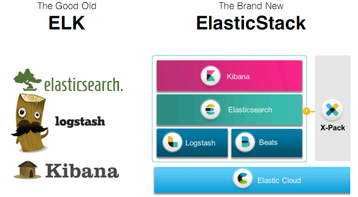
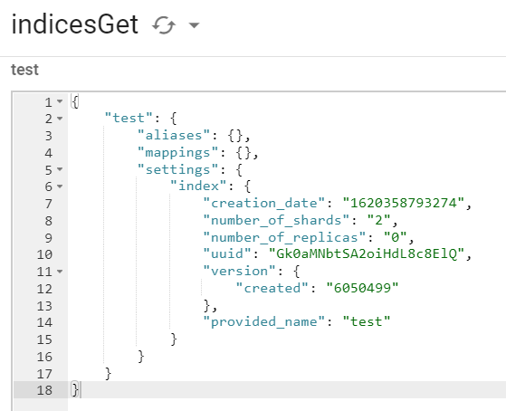

# 前台功能

## 地图查房

文档：http://lbsyun.baidu.com/index.php?title=jspopular3.0

### 导入BMap

```html
<script type="text/javascript" src="https://api.map.baidu.com/api?v=3.0&ak=q60ejYQeO2qZO6dYhWPOHea4aY0bhrqG&s=1"></script>
    <script type="text/javascript" src="http://api.map.baidu.com/library/TextIconOverlay/1.2/src/TextIconOverlay_min.js"></script>
    <script type="text/javascript" src="http://api.map.baidu.com/library/MarkerClusterer/1.2/src/MarkerClusterer_min.js"></script>
```

若在子模块直接使用BMap,会出现未定义的错误，原因是组件未加载

需要在 public/index.html 中，先将BMap和BMapLib载入到window

```html
<script type="text/javascript">
    window.BMap = BMap;
    window.BMapLib = BMapLib;
</script>
```


### 使用自定义OverFlowIcon


### 修改数据加载逻辑

#### graphql接口

```graphql
schema {
    query: HaokeQuery
}

type HaokeQuery{
    #分页查询房源信息-应用于前台房源信息
    HouseResourcesList(page:Int, pageSize:Int):TableResult
    # 通过Id查询房源信息
    HouseResources(id:ID): HouseResources

    #首页广告图-应用于前台首页
    IndexAdList: IndexAdResult

    #地图查房房源数据
    MapHouseData:MapHouseDataResult
}

type MapHouseDataResult{
    list:[MapHouseXY]
}

type MapHouseXY{
    x:Float
    y:Float
}
```

#### 编写MapHouseDataResult、MapHouseXY

```java
package com.haoke.api.vo.map;

@Data
@AllArgsConstructor
@NoArgsConstructor
public class MapHouseDataResult {
    private List<MapHouseXY> list;
}
```

```java
package com.haoke.api.vo.map;

@Data
@AllArgsConstructor
@NoArgsConstructor
public class MapHouseXY {
    private Float x;
    private Float y;
}
```

#### MapHouseDataFetcher Graphql接口

```java
package com.haoke.api.graphql.myDataFetcherImpl;

@Component
public class MapHouseDataFetcher implements MyDataFetcher {
    @Override
    public String fieldName() {
        return "MapHouseData";
    }

    @Override
    public Object dataFetcher(DataFetchingEnvironment environment) {
        List<MapHouseXY> list = new ArrayList<>();
        list.add(new MapHouseXY(116.43244f,39.929986f));
        list.add(new MapHouseXY(116.424355f,39.92982f));
        list.add(new MapHouseXY(116.423349f,39.935214f));
        list.add(new MapHouseXY(116.350444f,39.931645f));
        list.add(new MapHouseXY(116.351684f,39.91867f));
        list.add(new MapHouseXY(116.353983f,39.913855f));
        list.add(new MapHouseXY(116.357253f,39.923152f));
        list.add(new MapHouseXY(116.349168f,39.923152f));
        list.add(new MapHouseXY(116.36232f,39.938339f));
        list.add(new MapHouseXY(116.374249f,39.94625f));
        list.add(new MapHouseXY(116.380178f,39.953053f));
        return new MapHouseDataResult(list);
    }
}
```

#### 测试Graphql接口


#### 整合前端

```jsx
import { ApolloClient, gql , InMemoryCache} from '@apollo/client';

const client = new ApolloClient({
  uri: "http://127.0.0.1:9091/graphql",
  cache: new InMemoryCache()
});

//定义查询
const GET_MAP_HOUSE = gql`
  {
    MapHouseData {
      list {
        x 
        y
      }
    }
  }
`;

client.query({query: GET_MAP_HOUSE}).then(result =>{
    let xys = result.data.MapHouseData.list;
    var markers = [];
    var pt = null;
    for (var i in xys) {
        pt = new BMap.Point(xys[i].x, xys[i].y);
        markers.push(new BMap.Marker(pt));
    }

    // 地图上覆盖物的聚合效果
    var markerClusterer = new BMapLib.MarkerClusterer(map, {
        markers: markers,
        girdSize: 100,
        styles: [{
            background: 'rgba(12,181,106,0.9)',
            size: new BMap.Size(92, 92),
            textSize: '16',
            textColor: '#fff',
            borderRadius: 'true'
        }],
    });
    markerClusterer.setMaxZoom(50);
    markerClusterer.setGridSize(50);
});
```

#### 整合前端测试

测试后，数据是从后端传来的，则数据加载逻辑修改成功


### 增加拖动事件

在地图拖动后，增加事件，获取中心位置的坐标，以便后续的查询

```java
map.addEventListener("dragend", function showInfo(){
    let cp = map.getCenter();
    let zoom = map.getZoom(); //缩放级别
    console.log(cp.lng + "," + cp.lat+" --> " + zoom);
});
```

百度地图缩放比例：

| 级别 | 比例尺  |
| ---- | ------- |
| 19级 | 20m     |
| 18级 | 50m     |
| 17级 | 100m    |
| 16级 | 200m    |
| 15级 | 500m    |
| 14级 | 1km     |
| 13级 | 2km     |
| 12级 | 5km     |
| 11级 | 10km    |
| 10级 | 20km    |
| 9级  | 25km    |
| 8级  | 50km    |
| 7级  | 100km   |
| 6级  | 200km   |
| 5级  | 500km   |
| 4级  | 1000km  |
| 3级  | 2000km  |
| 2级  | 5000km  |
| 1级  | 10000km |

### 传递经纬度和缩放比例参数


#### 实现目标

拖动地图，更新范围内的房源数据

#### 原理

1.  拖动地图
2.  获取地图中心点
3.  将当前中心点的经纬度传及缩放比传递到后台
4.  后台根据计算出的搜索范围，查询数据

#### 实现

##### 定义graphql接口

```graphql
type HaokeQuery{
    #分页查询房源信息-应用于前台房源信息
    HouseResourcesList(page:Int, pageSize:Int):TableResult
    # 通过Id查询房源信息
    HouseResources(id:ID): HouseResources

    #首页广告图-应用于前台首页
    IndexAdList: IndexAdResult

    #地图查房房源数据
    MapHouseData(lng:Float,lat:Float,zoom:Int):MapHouseDataResult
}

---
query queryMapHouseData($lng:Float,$lat:Float,$zoom:Int){
  MapHouseData(lng:$lng,lat:$lat,zoom:$zoom){
    list{
      x
      y
    }
  }
}
---
{
	"lng":116.54461241348382,
	"lat":39.91201079295558,
	"zoom":12
}
```

##### 后台接口接收参数

```java
package com.haoke.api.graphql.myDataFetcherImpl;

@Component
public class MapHouseDataFetcher implements MyDataFetcher {
    @Override
    public String fieldName() {
        return "MapHouseData";
    }

    @Override
    public Object dataFetcher(DataFetchingEnvironment environment) {
        Float lat = environment.getArgument("lat");
        Float lng = environment.getArgument("lng");
        Integer zoom = environment.getArgument("zoom");

        System.out.println("lat -> "+ lat);
        ...
    }
}
```


**修改为**

```java
Float lat = ((Double)environment.getArgument("lat")).floatValue();
Float lng = ((Double)environment.getArgument("lng")).floatValue();
Integer zoom = environment.getArgument("zoom");

System.out.println("lat -> "+ lat);
```


##### 前端代码修改

```jsx
import React from 'react';
import { Icon} from 'semantic-ui-react'
import { ApolloClient, gql , InMemoryCache} from '@apollo/client';

const client = new ApolloClient({
  uri: "http://127.0.0.1:9091/graphql",
  cache: new InMemoryCache()
});

//定义查询
const GET_MAP_HOUSE = gql`
  query queryMapHouseData($lng:Float,$lat:Float,$zoom:Int){
    MapHouseData(lng:$lng,lat:$lat,zoom:$zoom){
      list{
        x
        y
      }
    }
  }
`;

// 百度地图API功能
const BMap = window.BMap;
const BMapLib = window.BMapLib;

const showMapMarker =(xys,map)=>{
  let markers = [];
  let pt = null;
  for (let i in xys) {
    pt = new BMap.Point(xys[i].x, xys[i].y);
    markers.push(new BMap.Marker(pt));
  }

  // 地图上覆盖物的聚合效果
  var markerClusterer = new BMapLib.MarkerClusterer(map, {
    markers: markers,
    girdSize: 100,
    styles: [{
      background: 'rgba(12,181,106,0.9)',
      size: new BMap.Size(92, 92),
      textSize: '16',
      textColor: '#fff',
      borderRadius: 'true'
    }],
  });
  markerClusterer.setMaxZoom(50);
  markerClusterer.setGridSize(50);
}

class MapHouse extends React.Component {
  constructor(props) {
    super(props);
  }
  componentDidMount() {

    //设置初始中心点
    let defaultX = 121.48130241985999;
    let defaultY = 31.235156971414239;
    let defaultZoom = 12;

    // 创建Map实例
    let map = new BMap.Map("allmap");
    // 初始化地图,设置中心点坐标和地图级别
    map.centerAndZoom(new BMap.Point(defaultX,defaultY), defaultZoom);

    // 开启鼠标滚轮缩放
    map.enableScrollWheelZoom(true);

    // 添加地图类型控件
    map.addControl(new BMap.MapTypeControl());
    // 设置地图缩放比例尺控件
    map.addControl(new BMap.ScaleControl({
      anchor: window.BMAP_NAVIGATION_CONTROL_ZOOM
    }));
    // 设置地图导航
    map.addControl(new BMap.NavigationControl({
      enableGeolocation: true
    }));
    // 设置缩略图控件。
    map.addControl(new BMap.OverviewMapControl());
    // 设置地图显示的城市 此项是必须设置的
    map.setCurrentCity("上海");


    /*拖拽事件，更新范围内房源
    * 获取中心点，取数据，更新地图
    * */
    let showInfo = () => {
      let cp = map.getCenter();
      let zoom = map.getZoom(); //缩放级别
      // console.log(cp.lng + "," + cp.lat+" --> " + zoom);
      client.query({query: GET_MAP_HOUSE, variables: {"lng":cp.lng,"lat":cp.lat,"zoom":zoom}}).then(
          result =>{
            let xys = result.data.MapHouseData.list;
            showMapMarker(xys,map);
      });
    }

    map.addEventListener("dragstart",()=>{map.clearOverlays();}); //拖动开始事件
    map.addEventListener("dragend",showInfo); //拖动结束事件
    map.addEventListener("zoomstart", ()=>{map.clearOverlays();}); //缩放开始事件
    map.addEventListener("zoomend",showInfo); //缩放结束事件

    /*初始化*/
    client.query({query: GET_MAP_HOUSE,variables: {"lng":defaultX,"lat":defaultY,"zoom":defaultZoom}}).then(
        result =>{
      let xys = result.data.MapHouseData.list;
      showMapMarker(xys,map)
    });
  }
  render() {
    return ( 
      <div className = 'map-house' >
        <div className = "map-house-title">
          <Icon onClick = {this.props.hideMap} name = 'angle left' size = 'large'/> 地图找房 
        </div> 
        <div className = "map-house-content" id='allmap'></div>
      </div>
    );
  }
}
export default MapHouse;
```

### MongoDB的地理位置索引

在MongoDB中，支持存储位置的经纬度，可以对其索引，通过算子操作，进行查找附近的数据，如：查找附近的人，附近的建筑

**将房源数据导入到MongoDB**

```shell
###进入容器
docker exec -it mongodb /bin/bash

###进入mongo
mongo

###切换数据库
use haoke

###创建索引
db.house.createIndex({loc:'2d'}) #为house表的loc字段创建地理2d索引
db.house.createIndex({estate:1},{unique:true}) #为house表的hid字段创建唯一索引

#通过百度api查询地址的经纬度
http://api.map.baidu.com/geocoding/v3/?address=上海&output=json&ak=q60ejYQeO2qZO6dYhWPOHea4aY0bhrqG&callback=showLocation

###插入数据
db.house.insert({hid:1,title:'整租 · 南丹大楼 1居室 7500',loc:[121.4482236974557,31.196523937504549]})
db.house.insert({hid:2,title:'陆家嘴板块，精装设计一室一厅，可拎包入住诚意租。',loc:[121.51804613891443,31.238878702131506]})
db.house.insert({hid:3,title:'整租 · 健安坊 1居室 4050',loc:[121.4148310693774,31.16507733043528]})
db.house.insert({hid:4,title:'整租 · 中凯城市之光+视野开阔+景色秀丽+拎包入住',loc:[121.43528282056717,31.198687949417815]})
db.house.insert({hid:5,title:'整租 · 南京西路品质小区 21213三轨交汇 配套齐* 拎包入住',loc:[121.43528282056717,31.198687949417815]})
db.house.insert({hid:6,title:'祥康里 简约风格 *南户型 拎包入住 看房随时',loc:[121.47521508401232,31.23859308719981]})
db.house.insert({hid:7,title:'整租 · 桃源新村 1室0厅 5500元',loc:[121.488377804633,31.23113867155927]})
db.house.insert({hid:8,title:'整租 · 中山公园品质小区，两房朝南厅朝南，家电家具精装*配',loc:[121.42038642151562,31.225078800208654]})
db.house.insert({hid:9,title:'整租 · 近地铁2号线，精装1房1厅，高区朝南，享受阳光好房',loc:[121.42933310871683,31.221943586471036]})
db.house.insert({hid:10,title:'整租 · 2.3.4号中山公园地铁，背靠来福士，采光好，诚意出租',loc:[121.42063977421182,31.221023374982044]})
```

**mongodb地理位置的索引**

注意距离要除以111.2（1度=111.2km），跟普通查找的区别仅仅是多了两个算子 `\$near` 和 `\$maxDistance`  

```shell
#查询上海人民广场附近5公里的房源，人民广场的坐标为：121.48130241985999,31.235156971414239

> db.house.find({loc:{$near:[121.48130241985999,31.235156971414239],$maxDistance:5/111.12 }})
{ "_id" : ObjectId("606e6eb7c34903ae9b73d0dd"), "hid" : 6, "title" : "祥康里 简约风格 *南户型 拎包入住 看房随时", "loc" : [ 121.47521508401232, 31.23859308719981 ] }
{ "_id" : ObjectId("606e6ebfc34903ae9b73d0de"), "hid" : 7, "title" : "整租 · 桃源新村 1室0厅 5500元", "loc" : [ 121.488377804633, 31.23113867155927 ] }
{ "_id" : ObjectId("606e6e95c34903ae9b73d0d9"), "hid" : 2, "title" : "陆家嘴板块，精装设计一室一厅，可拎包入住诚意租。", "loc" : [ 121.51804613891443, 31.238878702131505 ] }

#查询上海中山公园附近2公里的房源，中山公园的坐标为：121.42261657004589,31.229111410235285
> db.house.find({loc:{$near:[121.42261657004589,31.229111410235285],$maxDistance:2/111.12 }})
{ "_id" : ObjectId("606e6ec3c34903ae9b73d0df"), "hid" : 8, "title" : "整租 · 中山公园品质小区，两房朝南厅朝南，家电家具精装*配", "loc" : [ 121.42038642151562, 31.225078800208653 ] }
{ "_id" : ObjectId("606e6ecdc34903ae9b73d0e1"), "hid" : 10, "title" : "整租 · 2.3.4号中山公园地铁，背靠来福士，采光好，诚意出租", "loc" : [ 121.42063977421182, 31.221023374982042 ] }
{ "_id" : ObjectId("606e6ec8c34903ae9b73d0e0"), "hid" : 9, "title" : "整租 · 近地铁2号线，精装1房1厅，高区朝南，享受阳光好房", "loc" : [ 121.42933310871683, 31.221943586471035 ] }
```


### 实现基于MongoDB的查询

#### mongo依赖

```xml
<!--mongo依赖-->
<dependency>
    <groupId>org.springframework.boot</groupId>
    <artifactId>spring-boot-starter-data-mongodb</artifactId>
</dependency>
```

#### 配置文件

```properties
#mongodb配置
spring.data.mongodb.uri=mongodb://8.140.130.91:6379:27017/haoke
```

#### Mapper层代码

##### pojo

```java
package com.haoke.api.pojo;

@Data
@AllArgsConstructor
@NoArgsConstructor
@Document(collection = "house")//指定表名称
@Builder
public class MongoHouse {

    @Id
    @JsonSerialize(using = ToStringSerializer.class)
    private ObjectId id;

    private Long hid;
    private String title;
    private Float[] loc;
}
```

##### service

```java
package com.haoke.api.service;

@Service
public class MongoHouseService {
    public static final Map<Integer, Double> BAIDU_ZOOM = new HashMap<>();
    static {
        BAIDU_ZOOM.put(19, 20d / 1000); //单位为km
        BAIDU_ZOOM.put(18, 50d / 1000);
        BAIDU_ZOOM.put(17, 100d / 1000);
        BAIDU_ZOOM.put(16, 200d / 1000);
        BAIDU_ZOOM.put(15, 500d / 1000);
        BAIDU_ZOOM.put(14, 1d);
        BAIDU_ZOOM.put(13, 2d);
        BAIDU_ZOOM.put(12, 5d);
        BAIDU_ZOOM.put(11, 10d);
        BAIDU_ZOOM.put(10, 20d);
        BAIDU_ZOOM.put(9, 25d);
        BAIDU_ZOOM.put(8, 50d);
        BAIDU_ZOOM.put(7, 100d);
        BAIDU_ZOOM.put(6, 200d);
        BAIDU_ZOOM.put(5, 500d);
        BAIDU_ZOOM.put(4, 1000d);
        BAIDU_ZOOM.put(3, 2000d);
        BAIDU_ZOOM.put(2, 5000d);
        BAIDU_ZOOM.put(1, 10000d);
    }

    @Autowired
    private MongoTemplate mongoTemplate;

    /*
    * 从mongo中产讯数据，返回地图房源数据
    * */
    public MapHouseDataResult queryHouseData(Float lng,Float lat,Integer zoom){

        double distance = BAIDU_ZOOM.get(zoom)*1.5/111.12;

        Query query = Query.query(Criteria.where("loc").near(new Point(lng,lat)).maxDistance(distance));

        //查询数据
        List<MongoHouse> mongoHouses = this.mongoTemplate.find(query, MongoHouse.class);

        List<MapHouseXY> list = new ArrayList<>();

        for (MongoHouse mongoHouse : mongoHouses) {
            list.add(new MapHouseXY(mongoHouse.getLoc()[0], mongoHouse.getLoc()[1]));
        }

        return new MapHouseDataResult(list);
    }
}
```

#### 接口实现

```java
package com.haoke.api.graphql.myDataFetcherImpl;

@Component
public class MapHouseDataFetcher implements MyDataFetcher {
    @Autowired
    private MongoHouseService mongoHouseService;

    @Override
    public String fieldName() {
        return "MapHouseData";
    }

    @Override
    public Object dataFetcher(DataFetchingEnvironment environment) {
        Float lat = ((Double)environment.getArgument("lat")).floatValue();
        Float lng = ((Double)environment.getArgument("lng")).floatValue();
        Integer zoom = environment.getArgument("zoom");

        System.out.println("lat -> "+ lat);

        return this.mongoHouseService.queryHouseData(lng,lat,zoom);
    }
}
```

## 小程序用户登录


1.  调用 `wx.login()` 获取 **临时登录凭证code** ,并回传到开发者服务器

    wx.login()[https://developers.weixin.qq.com/miniprogram/dev/api/open-api/login/wx.login.html]

2.   调用 `code2Session` 接口，换取 **用户唯一标识 OpenId**  和 **会话密钥 session_key**

     -   用户在当前小程序的唯一标识（openid）

     -   微信开放平台帐号下的唯一标识（unionid，若当前小程序已绑定到微信开放平台帐号）
     -   本次登录的会话密钥（session_key）

**注意**

>   1.  会话密钥 `session_key` 是对用户数据进行 [加密签名][https://developers.weixin.qq.com/miniprogram/dev/framework/open-ability/signature.html] 的密钥。为了应用自身的数据安全，开发者服务器 **不应该把会话密钥下发到小程序，也不应该对外提供这个密钥**
>   2.  临时登录凭证 code 只能使用一次

### 编写登录服务

####  1. wx.login()获取code

```js
<view class="container">
  <button bindtap="login">登录</button>
</view>


Page({
  login(){
    wx.login({
      success(res){
        if(res.code){
          console.log(res.code)
        }
      }
    })
  }
})
```

#### 2.  从微信服务器获取用户相关信息

请求微信的API地址[https://developers.weixin.qq.com/miniprogram/dev/api-backend/open-api/login/auth.code2Session.html]

```
GET https://api.weixin.qq.com/sns/jscode2session?
appid=APPID&secret=SECRET&js_code=JSCODE&grant_type=authorization_code
```

**返回值示例**

```json
{
    "session_key": "y/tucPVvjeLvKwayZqE8cA==",
    "openid": "o4Grc5fzn_KKpmOXZeQ-E2bMboLg"
}

---
{
    "errcode": 40163,
    "errmsg": "code been used, hints: [ req_id: ZEmBy24ce-iV.NGA ]"
}

---
{
    "errcode": 40029,
    "errmsg": "invalid code, hints: [ req_id: ZEmBN.iCe-yFGI4a ]"
}
```

#### 3. Bean——RestTemplate、JAVA的HTTP工具类

```java
package com.haoke.api.config;

import org.springframework.context.annotation.Bean;
import org.springframework.context.annotation.Configuration;
import org.springframework.web.client.RestTemplate;

/*
* 杂配置
* */
@Configuration
public class HaokeConfig {

    @Bean
    public RestTemplate restTemplate(){
        return new RestTemplate();
    }
}
```

#### 4. Controller

```java
package com.haoke.api.controller;

import org.apache.commons.codec.digest.DigestUtils;
import org.apache.commons.lang3.StringUtils;
import org.springframework.beans.factory.annotation.Autowired;
import org.springframework.data.redis.core.RedisTemplate;

import org.springframework.web.bind.annotation.*;
import org.springframework.web.client.RestTemplate;

import java.time.Duration;
import java.util.HashMap;
import java.util.Map;

@RequestMapping("wx")
@RestController
public class WxLoginController {

    @Autowired
    private RestTemplate restTemplate;

    @Autowired
    private RedisTemplate<String ,String > redisTemplate;

    @PostMapping("login")
    public Map<String,Object> wxLogin(@RequestBody HashMap<String, String> param){
        Map<String,Object> result = new HashMap<>();
        result.put("status","200");

        String appid = "wx47b56adca7411314";
        String secret = "2b68f0eb4c8ecfcbec4929f3eee5aee8";

        String url = "https://api.weixin.qq.com/sns/jscode2session?" +
                "appid="+ appid +
                "&secret="+ secret +
                "&js_code="+param.get("code")+
                "&grant_type=authorization_code";

        String resData = this.restTemplate.getForObject(url,String.class);

        if(StringUtils.contains(resData,"errcode")){
            //登录失败
            result.put("status","500");
            result.put("msg","登录失败");

            return result;
        }

        String ticket = DigestUtils.md5Hex(resData);
        String redisKey = "WX_MINIPRO_LOGIN"+ticket;
        //保存七天
        this.redisTemplate.opsForValue().set(redisKey,resData, Duration.ofDays(7));
        result.put("data",ticket);

        return result;
    }
}
```

#### 5. session是否失效

[wx.checkSession(Object object)](https://developers.weixin.qq.com/miniprogram/dev/api/open-api/login/wx.checkSession.html)

用户越久未使用小程序，用户登录态越有可能失效。反之如果用户一直在使用小程序，则用户登录态一直保持有效。

```js
checkLogin(){
    const _this = this
    wx.checkSession({
        success: (res) => {
            // session_key 未过期，并且在本生命周期一直有效
            wx.showToast({
                title: '处于登录状态',
                icon: 'success',
                duration: 2000
            });
        },
        fail() {
            wx.showToast({
                title: '登录已失效!',
                icon: 'none',
                duration: 2000
            });
            _this.login() // 重新登录
        }
    })
},
```

#### 6. 登录测试

```js
login(){
    wx.login({
        success(res){
            console.log(res)
            if(res.code){
                //发送临时凭证code，向服务端请求用户标识
                wx.request({
                    url: 'http://127.0.0.1:9091/wx/login',
                    method:"POST",
                    header:{
                        "content-type":"application/json"
                    },
                    data: {
                        code: res.code
                    },
                    success(res){
                        console.log(res)
                        if(res.data.status == 200){
                            wx.setStorage({
                                key: 'TICKET',
                                data: res.data.data
                            });
                            wx.showToast({
                                title: '登录成功',
                                icon: 'success',
                                duration: 2000
                            });
                        }else{
                            wx.removeStorage({
                                key: 'TICKET'
                            });
                            wx.showToast({
                                title: '登录失败!',
                                icon: 'none',
                                duration: 2000
                            })
                        }
                    }
                })
            }
        }
    })
}
```


### 插件

[wx-jq: wx-jq一套完全原创的微信小程序插件集合库,微信小程序插件,wx-jq (gitee.com)](https://gitee.com/dgx/wx-jq)

## Elastic Search

### Elastci Stack

ELK(旧称呼),由ElasticSearch、Logstash、Kibana组成，及新加入的Beats




**ElasticSearch**

基于Java，是开源分布式搜索引擎，特点有：分布式、零配置、自动发现，索引自动分片、索引副本机制、restful风格接口，多数据源、自动搜索负载

**Logstash**

基于Java，可以用于手机，分析和存储日志的工具

由于与Beats功能部分重叠，现用于数据处理

**Kibana**

基于nodejs，开源免费工具，Kibana可以为Logstash和ElasticSearch提供的日志分析友好的web界面，可以汇总、分析和搜索重要数据日志

**Beats**

采集系统监控数据的代理agent，是在被监控服务器上以客户端形式运行的数据收集器的统称。可以直接把数据发送给ElasticSearch或者通过LogStash发送给ElasticSearch，然后进行后续的数据分析活动

Beats组成

-   PacketBeat：网络数据分析器，用于监控、收集网络流量信息、Packetbeat嗅探服务器之间的流
    量，解析应用层协议，并关联到消息的处理，其支 持ICMP (v4 and v6)、DNS、HTTP、Mysql、PostgreSQL、Redis、MongoDB、Memcache等协议；
-   Filebeat：用于监控、收集服务器日志文件，其已取代 logstash forwarder  
-   Metricbeat：可定期获取外部系统的监控指标信息，其可以监控、收集 Apache、HAProxy、MongoDB 、MySQL、Nginx、PostgreSQL、Redis、System、Zookeeper等服务；  
-   Winlogbeat：用于监控、收集Windows系统的日志信息；

### ES简介

ElasticSearch是一个基于Lucene的搜索服务器。提供了一个分布式多用户能力的全文搜索引擎，基于RESTful web接口

ElasticSearch是用JAVA开发的。达到实时搜索，稳定可靠，快速，安装方便

**搜索方案的目标**

-   运行速度快，实时搜索
-   零配置和完全免费的搜索模式
-   能够简单地使用JSON通过HTTP来索引数据
-   搜索服务器可靠性
-   搜索服务器易于扩展
-   简单的多租户
-   建立云解决方案

[Elasticsearch：官方分布式搜索和分析引擎 | Elastic](https://www.elastic.co/cn/elasticsearch/)

### 安装

#### 单机安装

##### 版本说明

ElasticSearch的发展非常快速，在ES5.0之前，ELK各个版本不同意出现了版本号的混乱状态，所以从5.0开始，所有的Elastic Stack中的项目全部同一版本号。

##### 下载

[Download Elasticsearch Free | Get Started Now | Elastic | Elastic](https://www.elastic.co/cn/downloads/elasticsearch)

##### 单机版安装

```shell
#解压安装包
cd /opt
tar -xvf elasticsearch-7.12.0-linux-x86_64.tar.gz  -C /opt
cd elasticsearch-7.12.0/config

# 修改配置文件
vim elasticsearch.yml

#通过指定相同网段的其他节点会加入该集群中 0.0.0.0任意IP都可以访问elasticsearch
network.host: 0.0.0.0
http.port: 9200
discovery.zen.ping.unicast.hosts: ["192.168.182.130"]
bootstrap.memory_lock: false
bootstrap.system_call_filter: false

#说明：在Elasticsearch中如果，network.host不是localhost或者127.0.0.1的话，就会认为是生产环境，会对环境的要求比较高，我们的测试环境不一定能够满足，一般情况下需要修改2处配置，如下：
#1：修改jvm启动参数
vim jvm.options
-Xms64m
-Xmx64m
#2：单个进程中的最大线程数
vm.max_map_count=655360

# 创建elsearch用户，ElasticSearch不支持root用户运行
useradd elsearch

#切换程序所有者
chown elsearch:elsearch elasticsearch-7.12.0 -R

#启动ES服务
su - elsearch
cd /opt/elasticsearch-7.12.0/bin
./elasticsearch 或 ./elasticsearch -d #后台系统

# 通过访问看到一下信息，则ES启动成功
##http://8.140.130.91:9200/
{
  "name" : "iZ2zeg4pktzjhp9h7wt6doZ",
  "cluster_name" : "elasticsearch",
  "cluster_uuid" : "_na_",
  "version" : {
    "number" : "7.12.0",
    "build_flavor" : "default",
    "build_type" : "tar",
    "build_hash" : "78722783c38caa25a70982b5b042074cde5d3b3a",
    "build_date" : "2021-03-18T06:17:15.410153305Z",
    "build_snapshot" : false,
    "lucene_version" : "8.8.0",
    "minimum_wire_compatibility_version" : "6.8.0",
    "minimum_index_compatibility_version" : "6.0.0-beta1"
  },
  "tagline" : "You Know, for Search"
}
```

#### 通过docker安装

```shell
# 拉取镜像 elasticsearch必须带标签
docker pull elasticsearch:6.5.4

# 创建容器
docker create --name elasticsearch --net host -e "discovery.type=single-node" -e "network.host=0.0.0.0" elasticsearch:6.5.4

{
  "name" : "_JPw0-e",
  "cluster_name" : "docker-cluster",
  "cluster_uuid" : "Ax65AN3LQrybZIFeM_IiIg",
  "version" : {
    "number" : "6.5.4",
    "build_flavor" : "default",
    "build_type" : "tar",
    "build_hash" : "d2ef93d",
    "build_date" : "2018-12-17T21:17:40.758843Z",
    "build_snapshot" : false,
    "lucene_version" : "7.5.0",
    "minimum_wire_compatibility_version" : "5.6.0",
    "minimum_index_compatibility_version" : "5.0.0"
  },
  "tagline" : "You Know, for Search"
}
```

#### ES可视化工具

Edge：Elasticvue


### 基本概念

>   映射

-   关系数据库中的表结构(schema)
-   所有文档写进索引之前都会先进性分析，然后将输入的文本分割为词条，哪些词条会被过滤，这种信息为叫映射。由 **用户自定义规则**

>   索引

-   Elasticsearch对逻辑数据的逻辑存储，所以它可以分为更小的部分
-   看做关系型数据库的表，索引的结构是为快速有效的全文索引准备的，特别是它 **不存储原始值** ，原始数据应该存储在数据库中
-   ElasticSearch的索引可看做MongoDB的一个集合， 存储的数据结构为 **json**
-   ElasticSearch 可以把索引存放在一台机器或者 **分布** 在多台服务器，每个索引有一个或 **多个分片** （shard），每个分片可以有  **多个副本**（replica）

>   文档

-   存储在ElasticSearch中的主要实体叫文档（document）,相当于关系数据库中的一行记录

-   ElasticSearch和MongoDB中的文档相似，都可以有不同的结构，但ElasticSearch的文档中，**相同字段必须有相同类型**

-   文档由多个字段组成，每个字段可能多次出现在一个文档中，称为多值字段（multivalued）

-   每个字段的类型，可以是文本，数值，日期等，字段类型也可以是复杂类型，一个字段包含其他子文档或者数组

-   只要 `_id` 不同,ES将会判断为不同文档，即使两个文档内容相同


>   文档类型

-   在ElasticSearch中，一个索引对象可以存储多种不同用途的对象，eg:一个博客应用程序可以保存文章和评论
-   每个文档可以有不同结构
-   **同一索引中同一属性名必须有相同数据类型**

### RESTfulAPI

#### 创建非结构化索引

在Lucene中，创建索引是需要定义字段名称以及字段的类型的 (ES底层为Lucene)

在Elasticsearch中提供了非结构化的索引，就是不需要创建索引结构，即可写入数据到索引中——在Elasticsearch底层会进行结构化操作，此操作对用户是透明的

##### 可视化工具创建


```json
The index 'test' was successfully created.
{
    "acknowledged":true,
    "shards_acknowledged":true,
    "index":"test"
}
```



##### API创建

```json
/*请求*/
PUT http://8.140.130.91:9200/haoke

/*请求体*/
{
    "settings": {
        "index": {
            "number_of_shards": "2",
            "number_of_replicas": "0"
        }
    }
}
```


#### 删除索引


#### 插入数据

>   POST http://8.140.130.91/{索引}/{类型}/{id}

**关于id的生成**

-   指定id ，用PUT请求也可插入数据
-   ES生成id，必须使用POST请求插入数据

```json
请求：
POST http://8.140.130.91:9200/haoke/user/1001

/* 请求体 */
{
    "id":1001,
    "name":"张三",
    "age":20,
    "sex":"男"
}
```


```json
# 请求：
POST http://8.140.130.91:9200/haoke/user

# 请求体
{
    "id":1001,
    "name":"张三",
    "age":20,
    "sex":"男"
}

# 返回
{
    "_index": "haoke",
    "_type": "user",
    "_id": "hgAlRXkB81AnlYu4wXU-",
    "_version": 1,
    "result": "created",
    "_shards": {
        "total": 1,
        "successful": 1,
        "failed": 0
    },
    "_seq_no": 1,
    "_primary_term": 1
}
```


#### 更新数据

在Elasticsearch中，文档数据是不为修改的，但是可以通过覆盖的方式进行更新

---

**全部更新**

```json
#请求
PUT http://8.140.130.91:9200/haoke/user/1001

#请求体
{
    "id":1001,
    "name":"张三",
    "age":21,
    "sex":"女"
}

#返回
{
    "_index": "haoke",
    "_type": "user",
    "_id": "1001",
    "_version": 2,# 版本号已加一
    "result": "updated",
    "_shards": {
        "total": 1,
        "successful": 1,
        "failed": 0
    },
    "_seq_no": 2,
    "_primary_term": 1
}
```

可见分片中数据已更新


---

**局部更新**

1.  修改它
2.  删除旧文档
3.  索引新文档

```json
# 请求
# 注意：这里多了_update标识
POST http://8.140.130.91:9200/haoke/user/1001/_update

# 请求体
{
    "doc":{
        "age":23
    }
}

# 返回
{
    "_index": "haoke",
    "_type": "user",
    "_id": "1001",
    "_version": 3,# 版本号已变成3
    "result": "updated",
    "_shards": {
        "total": 1,
        "successful": 1,
        "failed": 0
    },
    "_seq_no": 3,
    "_primary_term": 1
}
```


#### 删除数据

在Elasticsearch中，删除文档数据，只需要发起DELETE请求即可

```json
# 请求
DELETE http://8.140.130.91:9200/haoke/user/1001

#返回
{
    "_index": "haoke",
    "_type": "user",
    "_id": "1001",
    "_version": 4,# 版本已变成4
    "result": "deleted",
    "_shards": {
        "total": 1,
        "successful": 1,
        "failed": 0
    },
    "_seq_no": 4,
    "_primary_term": 1
}
```

如果删除一条不存在的数据，会响应404


>   删除一个文档，数据不会立即从磁盘上移除，只是被标记为已删除。
>
>   ES将在添加更多索引时，才会在后台进行删除内容的清理

#### 搜索数据


---

**条件搜索**

>   根据id搜索

```json
# 请求
GET http://8.140.130.91:9200/haoke/user/hwAyRXkB81AnlYu4wXUb

#返回
{
    "_index": "haoke",
    "_type": "user",
    "_id": "hwAyRXkB81AnlYu4wXUb",
    "_version": 1,
    "found": true,
    "_source": {
        "id": 1001,
        "name": "张三",
        "age": 20,
        "sex": "男"
    }
}
```

---

**搜索全部数据**

```json
# 请求
GET http://8.140.130.91:9200/haoke/user/_search

# 返回
{
    "took": 8,
    "timed_out": false,
    "_shards": {
        "total": 2,
        "successful": 2,
        "skipped": 0,
        "failed": 0
    },
    "hits": {
        "total": 4,
        "max_score": 1.0,
        "hits": [
            {
                "_index": "haoke",
                "_type": "user",
                "_id": "iAA3RXkB81AnlYu4GXV6",
                "_score": 1.0,
                "_source": {
                    "id": 1002,
                    "name": "李四",
                    "age": 40,
                    "sex": "男"
                }
            },
            {
                "_index": "haoke",
                "_type": "user",
                "_id": "iQA3RXkB81AnlYu4TXV1",
                "_score": 1.0,
                "_source": {
                    "id": 1003,
                    "name": "王五",
                    "age": 30,
                    "sex": "男"
                }
            },
            {
                "_index": "haoke",
                "_type": "user",
                "_id": "igA3RXkB81AnlYu4dXWa",
                "_score": 1.0,
                "_source": {
                    "id": 1003,
                    "name": "王五",
                    "age": 30,
                    "sex": "男"
                }
            },
            {
                "_index": "haoke",
                "_type": "user",
                "_id": "hwAyRXkB81AnlYu4wXUb",
                "_score": 1.0,
                "_source": {
                    "id": 1001,
                    "name": "张三",
                    "age": 20,
                    "sex": "男"
                }
            }
        ]
    }
}
```

>   默认返回10条数据

---

**关键字查询**

```json
# 请求
GET http://8.140.130.91:9200/haoke/user/_search?q=age:20

#返回
{
    "took": 16,
    "timed_out": false,
    "_shards": {
        "total": 2,
        "successful": 2,
        "skipped": 0,
        "failed": 0
    },
    "hits": {
        "total": 1,
        "max_score": 1.0,
        "hits": [
            {
                "_index": "haoke",
                "_type": "user",
                "_id": "hwAyRXkB81AnlYu4wXUb",
                "_score": 1.0,
                "_source": {
                    "id": 1001,
                    "name": "张三",
                    "age": 20,
                    "sex": "男"
                }
            }
        ]
    }
}
```

#### DSL搜索

Elasticsearch提供丰富且灵活的查询语言叫做**DSL查询(Query DSL)**  

用于复杂查询，组合查询

DSL(Domain Specific Language特定领域语言)以 **JSON请求体** 的形式出现,所以请求方式为POST

---

==match==

```json
# 请求
POST http://8.140.130.91:9200/haoke/user/_search

# 请求体
{
    "query" : {
        "match" : { # 相当于==
            "age" : 20
        }
    }
}

# 返回
{
    "took": 2,
    "timed_out": false,
    "_shards": {
        "total": 2,
        "successful": 2,
        "skipped": 0,
        "failed": 0
    },
    "hits": {
        "total": 1,
        "max_score": 1.0,
        "hits": [
            {
                "_index": "haoke",
                "_type": "user",
                "_id": "hwAyRXkB81AnlYu4wXUb",
                "_score": 1.0,
                "_source": {
                    "id": 1001,
                    "name": "张三",
                    "age": 20,
                    "sex": "男"
                }
            }
        ]
    }
}
```

---

查询年龄大于30岁的男性用户  

==must==

filter if

```json
# 请求
POST http://8.140.130.91:9200/haoke/user/_search

# 请求体
{
	"query": {
		"bool": {
			"filter": {
                "range": {
                    "age": {
                        "gt": 30
                    }
                }
            },
            "must": {
                "match": {
                    "sex": "男"
                }
			}
		}
	}
}

# 返回
{
    "took": 29,
    "timed_out": false,
    "_shards": {
        "total": 2,
        "successful": 2,
        "skipped": 0,
        "failed": 0
    },
    "hits": {
        "total": 1,
        "max_score": 0.13353139,
        "hits": [
            {
                "_index": "haoke",
                "_type": "user",
                "_id": "iAA3RXkB81AnlYu4GXV6",
                "_score": 0.13353139,
                "_source": {
                    "id": 1002,
                    "name": "李四",
                    "age": 40,
                    "sex": "男"
                }
            }
        ]
    }
}
```

---

全文搜索

```json
# 请求
POST http://8.140.130.91:9200/haoke/user/_search

# 请求体
{
    "query": {
        "match": {
        	"name": "张三 李四"
        }
    }
}

#请求
{
    "took": 6,
    "timed_out": false,
    "_shards": {
        "total": 2,
        "successful": 2,
        "skipped": 0,
        "failed": 0
    },
    "hits": {
        "total": 2,
        "max_score": 1.9616584,
        "hits": [
            {
                "_index": "haoke",
                "_type": "user",
                "_id": "iAA3RXkB81AnlYu4GXV6",
                "_score": 1.9616584,
                "_source": {
                    "id": 1002,
                    "name": "李四",
                    "age": 40,
                    "sex": "男"
                }
            },
            {
                "_index": "haoke",
                "_type": "user",
                "_id": "hwAyRXkB81AnlYu4wXUb",
                "_score": 0.5753642,
                "_source": {
                    "id": 1001,
                    "name": "张三",
                    "age": 20,
                    "sex": "男"
                }
            }
        ]
    }
}
```

#### 高亮显示

```json
# 请求
POST http://8.140.130.91:9200/haoke/user/_search

# 请求体
{
    "query": {
        "match": {
            "name": "张三 李四"
        }
    },
    "highlight": {
        "fields": {
            "name": {}
        }
    }
}

# 返回
{
    "took": 54,
    "timed_out": false,
    "_shards": {
        "total": 2,
        "successful": 2,
        "skipped": 0,
        "failed": 0
    },
    "hits": {
        "total": 2,
        "max_score": 1.9616584,
        "hits": [
            {
                "_index": "haoke",
                "_type": "user",
                "_id": "iAA3RXkB81AnlYu4GXV6",
                "_score": 1.9616584,
                "_source": {
                    "id": 1002,
                    "name": "李四",
                    "age": 40,
                    "sex": "男"
                },
                "highlight": {
                    "name": [
                        "<em>李</em><em>四</em>"
                    ]
                }
            },
            {
                "_index": "haoke",
                "_type": "user",
                "_id": "hwAyRXkB81AnlYu4wXUb",
                "_score": 0.5753642,
                "_source": {
                    "id": 1001,
                    "name": "张三",
                    "age": 20,
                    "sex": "男"
                },
                "highlight": {
                    "name": [
                        "<em>张</em><em>三</em>"
                    ]
                }
            }
        ]
    }
}
```

#### 聚合

类似SQL中的group by操作

```json
#请求
POST http://8.140.130.91:9200/haoke/user/_search

# 请求体
{
    "aggs": {
        "all_interests": {
            "terms": {
                "field": "age"
            }
        }
    }
}

# 返回
{
    "took": 29,
    "timed_out": false,
    "_shards": {
        "total": 2,
        "successful": 2,
        "skipped": 0,
        "failed": 0
    },
    "hits": {
        "total": 4,
        "max_score": 1.0,
        "hits": [
            {
                "_index": "haoke",
                "_type": "user",
                "_id": "iAA3RXkB81AnlYu4GXV6",
                "_score": 1.0,
                "_source": {
                    "id": 1002,
                    "name": "李四",
                    "age": 40,
                    "sex": "男"
                }
            },
            {
                "_index": "haoke",
                "_type": "user",
                "_id": "iQA3RXkB81AnlYu4TXV1",
                "_score": 1.0,
                "_source": {
                    "id": 1003,
                    "name": "王五",
                    "age": 30,
                    "sex": "男"
                }
            },
            {
                "_index": "haoke",
                "_type": "user",
                "_id": "igA3RXkB81AnlYu4dXWa",
                "_score": 1.0,
                "_source": {
                    "id": 1003,
                    "name": "王五",
                    "age": 30,
                    "sex": "男"
                }
            },
            {
                "_index": "haoke",
                "_type": "user",
                "_id": "hwAyRXkB81AnlYu4wXUb",
                "_score": 1.0,
                "_source": {
                    "id": 1001,
                    "name": "张三",
                    "age": 20,
                    "sex": "男"
                }
            }
        ]
    },
    "aggregations": {
        "all_interests": {
            "doc_count_error_upper_bound": 0,
            "sum_other_doc_count": 0,
            "buckets": [
                {
                    "key": 30,
                    "doc_count": 2
                },
                {
                    "key": 20,
                    "doc_count": 1
                },
                {
                    "key": 40,
                    "doc_count": 1
                }
            ]
        }
    }
}
```

### ES核心

#### 文档

文档以JSON格式进行存储，可以是复杂的结构

##### 元数据(metadata)

一个文档不只是数据。它还包括了元数据(metadata)——关于文档的信息。三个必须的元数据结点是

| 节点   | 说明               |
| ------ | ------------------ |
| _index | 文档存储的索引     |
| _type  | 文档代表的对象的类 |
| _id    | 文档的唯一标识     |

>    _index

索引(index)类似于关系数据库中的数据库 ——存储和索引关联数据的地方

事实上，数据被存储和索引在 **分片(shards)** 中，索引只是一个把一个或多个分片分组在一起的逻辑空间。只需要记住，文档存储在 **索引(index)** 中，剩下的细节交给ES处理。

>    _type

每个对象都属于一个**类**(class)，这个类定义了属性或与对象关联的数据

 在关系数据库中，我们经常将相同类的对象存储在一个表里，因为它们有着相同的结构；同理在ES中，我们使用相同 **类型(type)** 的文档表示相同的 事物，因为他们的结构是相同的

每个 **类型(type)** 都有自己的 **映射(mapping)** 或者结构定义，就像传统数据库表中的列一样。所有 **类型(type)** 下的文档被存储在同一个索引下，但是类型的 **映射(mapping)** 会告诉ES不同的文档如何被索引

`_type` 可以是大写或小写，不能包含下划线或逗号

>   _id

id :字符串 与 `_index` 和 `_type` 组合时，就可以在ES中唯一标识一个文档。当创建一个文档，你可以自定义 `_id` （支持PUT方式），也可以让ES自动生成32位长度（只能POST方式）

#### 查询响应

##### 格式化JSON结果——pretty

在查询url后添加pretty参数

```json
# 请求
http://8.140.130.91:9200/haoke/user/1005?pretty
```

##### 指定查询字段

在响应的数据中，可以指定某些需要的字段进行返回

```json
# 请求
GET http://8.140.130.91:9200/haoke/user/iAA3RXkB81AnlYu4GXV6?_source=id,name

# 返回
{
    "_index": "haoke",
    "_type": "user",
    "_id": "iAA3RXkB81AnlYu4GXV6",
    "_version": 1,
    "found": true,
    "_source": {
        "name": "李四",
        "id": 1002
    }
}
```

---

只返回数据

```json
# 请求
GET http://8.140.130.91:9200/haoke/user/iAA3RXkB81AnlYu4GXV6/_source

# 返回
{
    "id": 1002,
    "name": "李四",
    "age": 40,
    "sex": "男"
}
```

---

只返回数据且指定字段

```json
# 请求
GET http://8.140.130.91:9200/haoke/user/iAA3RXkB81AnlYu4GXV6/_source?_source=id,name

# 返回
{
    "name": "李四",
    "id": 1002
}
```

#### 判断文档是否存在

只是判断文档是否存在，不查询文档内容

```json
HEAD http://8.140.130.91:9200/haoke/user/iAA3RXkB81AnlYu4GXV6
```


```json
HEAD http://8.140.130.91:9200/haoke/user/1
```


>   查询结果只是表示查询时刻存在与否，并不代表之后是否存在

#### 批量操作

减少网络请求

##### 批量查询

```json
# 请求
POST http://8.140.130.91:9200/haoke/user/_mget

# 请求体
{
    "ids": [
        "iAA3RXkB81AnlYu4GXV6",
        "iQA3RXkB81AnlYu4TXV1"
    ]
}

# 返回
{
    "docs": [
        {
            "_index": "haoke",
            "_type": "user",
            "_id": "iAA3RXkB81AnlYu4GXV6",
            "_version": 1,
            "found": true,
            "_source": {
                "id": 1002,
                "name": "李四",
                "age": 40,
                "sex": "男"
            }
        },
        {
            "_index": "haoke",
            "_type": "user",
            "_id": "iQA3RXkB81AnlYu4TXV1",
            "_version": 1,
            "found": true,
            "_source": {
                "id": 1003,
                "name": "王五",
                "age": 30,
                "sex": "男"
            }
        }
    ]
}
```

---

如果，某一条数据不存在，不影响整体响应，需要通过 `found` 的值进行判断是否查询到数据

```json
# 请求体
{
    "ids": [
        "iAA3RXkB81AnlYu4GXV6",
        "1"
    ]
}

# 返回
{
    "docs": [
        {
            "_index": "haoke",
            "_type": "user",
            "_id": "iAA3RXkB81AnlYu4GXV6",
            "_version": 1,
            "found": true,
            "_source": {
                "id": 1002,
                "name": "李四",
                "age": 40,
                "sex": "男"
            }
        },
        {
            "_index": "haoke",
            "_type": "user",
            "_id": "2",
            "found": false
        }
    ]
}
```

##### _bulk 操作

在ES中，支持批量修改，都是通过 `_bulk` 的api完成

请求格式

```json
{ action: { metadata }}\n
{ request body }\n
{ action: { metadata }}\n
{ request body }\n
# 最后一行是需要回车的
```

---

>   批量插入数据

```json
# 请求
POST http://8.140.130.91:9200/haoke/user/_bulk

# 请求体
{"create":{"_index":"haoke","_type":"user","_id":2001}}
{"id":2001,"name":"name1","age": 20,"sex": "男"}
{"create":{"_index":"haoke","_type":"user","_id":2002}}
{"id":2002,"name":"name2","age": 20,"sex": "男"}
{"create":{"_index":"haoke","_type":"user","_id":2003}}
{"id":2003,"name":"name3","age": 20,"sex": "男"}


# 返回
{
    "took": 12,
    "errors": false,
    "items": [
        {
            "create": {
                "_index": "haoke",
                "_type": "user",
                "_id": "2001",
                "_version": 1,
                "result": "created",
                "_shards": {
                    "total": 1,
                    "successful": 1,
                    "failed": 0
                },
                "_seq_no": 9,
                "_primary_term": 1,
                "status": 201
            }
        },
        {
            "create": {
                "_index": "haoke",
                "_type": "user",
                "_id": "2002",
                "_version": 1,
                "result": "created",
                "_shards": {
                    "total": 1,
                    "successful": 1,
                    "failed": 0
                },
                "_seq_no": 3,
                "_primary_term": 1,
                "status": 201
            }
        },
        {
            "create": {
                "_index": "haoke",
                "_type": "user",
                "_id": "2003",
                "_version": 1,
                "result": "created",
                "_shards": {
                    "total": 1,
                    "successful": 1,
                    "failed": 0
                },
                "_seq_no": 4,
                "_primary_term": 1,
                "status": 201
            }
        }
    ]
}
```


>   批量删除

```json
# 请求
POST http://8.140.130.91:9200/haoke/user/_bulk

#请求体
{"delete":{"_index":"haoke","_type":"user","_id":2001}}
{"delete":{"_index":"haoke","_type":"user","_id":2002}}
{"delete":{"_index":"haoke","_type":"user","_id":2003}}


# 返回
{
    "took": 4,
    "errors": false,
    "items": [
        {
            "delete": {
                "_index": "haoke",
                "_type": "user",
                "_id": "2001",
                "_version": 2,
                "result": "deleted",
                "_shards": {
                    "total": 1,
                    "successful": 1,
                    "failed": 0
                },
                "_seq_no": 10,
                "_primary_term": 1,
                "status": 200
            }
        },
        {
            "delete": {
                "_index": "haoke",
                "_type": "user",
                "_id": "2002",
                "_version": 2,
                "result": "deleted",
                "_shards": {
                    "total": 1,
                    "successful": 1,
                    "failed": 0
                },
                "_seq_no": 5,
                "_primary_term": 1,
                "status": 200
            }
        },
        {
            "delete": {
                "_index": "haoke",
                "_type": "user",
                "_id": "2003",
                "_version": 2,
                "result": "deleted",
                "_shards": {
                    "total": 1,
                    "successful": 1,
                    "failed": 0
                },
                "_seq_no": 6,
                "_primary_term": 1,
                "status": 200
            }
        }
    ]
}
```

---

>   批量操作的性能

-   整个批量请求需要被加载到接受我们请求节点的内存里，所以请求越大，给其它请求可用的内存就越小。有一个最佳的bulk请求大小。超过这个大小，性能不再提升而且可能降低。
-   最佳大小，当然并不是一个固定的数字。它完全取决于你的硬件、你文档的大小和复杂度以及索引和搜索的负载。
-   幸运的是，这个最佳点(sweetspot)还是容易找到的：试着批量索引标准的文档，随着大小的增长，当性能开始降低，说明你每个批次的大小太大了。开始的数量可以在1000~5000个文档之间，如果你的文档非常大，可以使用较小的批次。
-   通常着眼于你请求批次的物理大小是非常有用的。一千个1kB的文档和一千个1MB的文档大不相同。一个好的批次最好保持在5-15MB大小间

#### 分页

和sql使用 `limit` 关键字返回只有一页的结果一样，ES接收 `from` 和 `size` 参数

```
size: 结果数，默认10
from：跳过开始的结果数，默认0
```

**避免分页太深或者一次请求太多结果**

结果在返回前会被排序，一个搜索请求常常涉及多个分片。每个分片生成自己排好序的结果，它们接着需要集中起来排序以确保整体排序正确。

---

eg:每页查询5个结果，页码从1到3

```
GET /_search?size=5
GET /_search?size=5&from=5
GET /_search?size=5&from=10
```


---

在集群系统中分页是有问题的

假设在一个有5个主分片的索引中搜索。当我们请求结果的第一页（结果1到10）时，每个分片产生自己最顶端10个结果然后返回它们给**请求节点(requesting node)**，它再排序这所有的50个结果以选出顶端的10个结果。
假设请求第1000页（结果10001到10010）。工作方式都相同，不同的是每个分片都必须产生顶端的10010个结果。然后请求节点排序这50050个结果并丢弃50040个  

可以看到在分布式系统中，排序结果的花费随着分页的深入而成倍增长。这也是为什么网络搜索引擎中任何语句不能返回多于1000个结果的原因  

#### 映射

我们创建的索引以及插入数据，都是由Elasticsearch进行自动判断类型，有些时候我们是需要进行明确字段类型的，否则，自动判断的类型和实际需求是不相符的。

##### 自动判断的规则

| JSON type                        | Field type |
| -------------------------------- | ---------- |
| Boolean: true or false           | "boolean"  |
| Whole number: 123                | "long"     |
| Floating point: 123.45           | "double"   |
| String, valid date: "2014-09-15" | "date"     |
| String: "foo bar"                | "string"   |

##### ES中文支持

| 类型           | 表示的数据类型                |
| -------------- | ----------------------------- |
| String         | string , text , keyword       |
| Whole number   | byte , short , integer , long |
| Floating point | float , double                |
| Boolean        | boolean                       |
| Date           | date                          |

-   string类型在ElasticSearch 旧版本中使用较多，从ElasticSearch 5.x开始不再支持string，由 `text` 和 `keyword` 类型替代  
-   `text` 类型，当一个字段是要被全文搜索的，比如Email内容、产品描述，应该使用text类型。**设置text类型以后，字段内容会被分析**，在生成倒排索引以前，字符串会被分析器分成一个一个**词项**。**text类型的字段不用于排序，很少用于聚合**
-   `keyword` 类型，适用于索引结构化的字段，比如email地址、主机名、状态码和标签。如果字段需要进行过滤(比如查找已发布博客中status属性为published的文章)、排序、聚合。**keyword类型的字段只能通过精确值搜索到**。  

##### 创建明确的索引

```json
# 请求
PUT http://8.140.130.91:9200/test

# 请求体
{
    "settings": {
        "index": {
            "number_of_shards": "2",
            "number_of_replicas": "0"
        }
    },
    "mappings": {
        "person": {
            "properties": {
                "name": {
                    "type": "text"
                },
                "age": {
                    "type": "integer"
                },
                "mail": {
                    "type": "keyword"
                },
                "hobby": {
                    "type": "text"
                }
            }
        }
    }
}

# 返回
{
    "acknowledged": true,
    "shards_acknowledged": true,
    "index": "test"
}
```

##### 查看索引

```
GET http://8.140.130.91:9200/test/_mapping
```


##### 插入数据

```json
# 请求
POST http://8.140.130.91:9200/test/_bulk

# 请求体
{"index":{"_index":"test","_type":"person"}}
{"name":"张三","age": 20,"mail": "111@qq.com","hobby":"羽毛球、乒乓球、足球"}
{"index":{"_index":"test","_type":"person"}}
{"name":"李四","age": 21,"mail": "222@qq.com","hobby":"羽毛球、乒乓球、足球、篮球"}
{"index":{"_index":"test","_type":"person"}}
{"name":"王五","age": 22,"mail": "333@qq.com","hobby":"羽毛球、篮球、游泳、听音乐"}
{"index":{"_index":"test","_type":"person"}}
{"name":"赵六","age": 23,"mail": "444@qq.com","hobby":"跑步、游泳"}
{"index":{"_index":"test","_type":"person"}}
{"name":"孙七","age": 24,"mail": "555@qq.com","hobby":"听音乐、看电影"}

```


#### 结构化查询

##### 给定值查询

###### term查询

`term` 主要用于**精确匹配值**，比如数字，日期，布尔值或 `not_analyzed` 的字符串（未经分析的文本数据类型）

```json
{ "term": { "age": 26 }}
{ "term": { "date": "2014-09-01" }}
{ "term": { "public": true }}
{ "term": { "tag": "full_text" }}

```

---

```json
# 请求
POST http://8.140.130.91:9200/test/person/_search

# 请求体
{
    "query": {
        "term": {
            "age": 20
        }
    }
}

# 返回
{
    "took": 2,
    "timed_out": false,
    "_shards": {
        "total": 2,
        "successful": 2,
        "skipped": 0,
        "failed": 0
    },
    "hits": {
        "total": 1,
        "max_score": 1.0,
        "hits": [
            {
                "_index": "test",
                "_type": "person",
                "_id": "lgAZR3kB81AnlYu4xnXV",
                "_score": 1.0,
                "_source": {
                    "name": "张三",
                    "age": 20,
                    "mail": "111@qq.com",
                    "hobby": "羽毛球、乒乓球、足球"
                }
            }
        ]
    }
}
```

##### 同一字段多值查询

`terms` 跟 `term` 类似，但 `term` 允许指定多个匹配条件。如果某个字段指定了多个值，那么文档需要一起去做匹配

```json
# 请求
POST http://8.140.130.91:9200/test/person/_search

# 请求体
{
    "query": {
        "terms": {
            "age": [20,21]
        }
    }
}

# 返回
{
    "took": 3,
    "timed_out": false,
    "_shards": {
        "total": 2,
        "successful": 2,
        "skipped": 0,
        "failed": 0
    },
    "hits": {
        "total": 2,
        "max_score": 1.0,
        "hits": [
            {
                "_index": "test",
                "_type": "person",
                "_id": "lgAZR3kB81AnlYu4xnXV",
                "_score": 1.0,
                "_source": {
                    "name": "张三",
                    "age": 20,
                    "mail": "111@qq.com",
                    "hobby": "羽毛球、乒乓球、足球"
                }
            },
            {
                "_index": "test",
                "_type": "person",
                "_id": "lwAZR3kB81AnlYu4xnXV",
                "_score": 1.0,
                "_source": {
                    "name": "李四",
                    "age": 21,
                    "mail": "222@qq.com",
                    "hobby": "羽毛球、乒乓球、足球、篮球"
                }
            }
        ]
    }
}
```

##### 给定范围查询

`range` 过滤允许我们按照指定范围查找一批数据

```json
{
    "range": {
        "age": {
            "gte": 20,
            "lt": 30
        }
    }
}
```

**操作符**

gt :: 大于
gte :: 大于等于
lt :: 小于
lte :: 小于等于 

---

eg:  20 <= age < 22

```json
# 请求
POST http://8.140.130.91:9200/test/person/_search

# 请求体
{
    "query": {
        "range": {
            "age": {
                "gte": 20,
                "lt": 22
            }
        }
    }
}

# 返回
{
    "took": 6,
    "timed_out": false,
    "_shards": {
        "total": 2,
        "successful": 2,
        "skipped": 0,
        "failed": 0
    },
    "hits": {
        "total": 2,
        "max_score": 1.0,
        "hits": [
            {
                "_index": "test",
                "_type": "person",
                "_id": "lgAZR3kB81AnlYu4xnXV",
                "_score": 1.0,
                "_source": {
                    "name": "张三",
                    "age": 20,#
                    "mail": "111@qq.com",
                    "hobby": "羽毛球、乒乓球、足球"
                }
            },
            {
                "_index": "test",
                "_type": "person",
                "_id": "lwAZR3kB81AnlYu4xnXV",
                "_score": 1.0,
                "_source": {
                    "name": "李四",
                    "age": 21,#
                    "mail": "222@qq.com",
                    "hobby": "羽毛球、乒乓球、足球、篮球"
                }
            }
        ]
    }
}
```

##### exists查询

`exists` 查询可用于查找文档中是否包含指定字段或没有某个字段，类似与SQL语句中的 `IS_NULL`

```json
# 请求
POST http://8.140.130.91:9200/test/person/_search

{
    "query": {
        "exists": { #必须包含card属性
        	"field": "card"
        }
    }
}
```


##### match查询

>   `match` 查询是一个标准查询，不管你需要 **全文本查询** 还是 **精确查询** 基本上都要用到它

-   如果你使用 `match` 查询一个全文本字段(text类型)，它会在真正查询之前用分析器先分析 match 一下查询字符  
-   如果用 match 下指定了一个确切值，在遇到数字，日期，布尔值或者 not_analyzed 的字符串时，它将为你搜索你给定的值

```json
{ "match": { "age": 26 }}
{ "match": { "date": "2014-09-01" }}
{ "match": { "public": true }}
{ "match": { "tag": "full_text" }}
```

##### bool查询——查询组合

`bool` 查询可以用来合并多个条件查询结果的布尔逻辑，它包含一下操作符：  

-   `must` :: 多个查询条件的完全匹配,相当于 and 。
-   `must_not` :: 多个查询条件的相反匹配，相当于 not 。
-   `should` :: 至少有一个查询条件匹配, 相当于 or 。  

```json
{
    "bool": {
        "must": { "term": { "folder": "inbox" }},
        "must_not": { "term": { "tag": "spam" }},
        "should": [
            { "term": { "starred": true }},
            { "term": { "unread": true }}
        ]
    }
}
```

#### 过滤查询

ES支持过滤查询，如term、range、match等

```json
# 请求
POST http://8.140.130.91:9200/test/person/_search

# 请求体
{
    "query": {
        "bool": {
            "filter":{
                "term":{
                    "age":20
                }
            }
        }
    }
}

# 返回
{
    "took": 4,
    "timed_out": false,
    "_shards": {
        "total": 2,
        "successful": 2,
        "skipped": 0,
        "failed": 0
    },
    "hits": {
        "total": 1,
        "max_score": 0.0,
        "hits": [
            {
                "_index": "test",
                "_type": "person",
                "_id": "lgAZR3kB81AnlYu4xnXV",
                "_score": 0.0,
                "_source": {
                    "name": "张三",
                    "age": 20,
                    "mail": "111@qq.com",
                    "hobby": "羽毛球、乒乓球、足球"
                }
            }
        ]
    }
}
```

>   查询和过滤的比较：

-   一条过滤语句会询问每个文档的字段值是否包含着特定值
-   查询语句会询问每个文档的字段值与特定值的匹配程度如何  
    -   一条查询语句会计算每个文档与查询语句的相关性，会给出一个相关性评分  `_score` ，并且 按照相关性对匹配到的文档进行排序。 这种评分方式非常适用于一个没有完全配置结果的全文本搜索  
-   一个简单的文档列表，快速匹配运算并存入内存是十分方便的， 每个文档仅需要1个字节。这些**缓存的过滤结果集与后续请求的结合使用是非常高效的**  
-   查询语句不仅要查找相匹配的文档，还需要计算每个文档的相关性，所以一般来说查询语句要比 过滤语句更耗时，并且查询结果也不可缓存  

**做精确匹配搜索时，最好用过滤语句，因为过滤语句可以缓存数据**

### 分词器

#### Standard

>   标准分词器，按照单词切分，结果转化为小写，**英文**

```json
# 请求
POST http://8.140.130.91:9200/_analyze

# 请求体
{
    "analyzer": "standard",
    "text": "A man becomes learned by asking questions."
}

# 返回
{
    "tokens": [
        {
            "token": "a",# 词汇
            "start_offset": 0,# 开始下标
            "end_offset": 1,# 结束下标+1
            "type": "<ALPHANUM>",
            "position": 0
        },
        {
            "token": "man",
            "start_offset": 2,
            "end_offset": 5,
            "type": "<ALPHANUM>",
            "position": 1
        }
        ...
    ]
}
```

#### Simple

>   按照非单词切分，并且做小写处理 **英文 空格或特殊符号**

```json
# 请求 
POST http://8.140.130.91:9200/_analyze

# 请求体
{
    "analyzer": "simple",
    "text": "If the document doesn't already exist"
}

# 返回
{
    "tokens": [
        {
            "token": "if",
            "start_offset": 0,
            "end_offset": 2,
            "type": "word",
            "position": 0
        },
        {
            "token": "the",
            "start_offset": 3,
            "end_offset": 6,
            "type": "word",
            "position": 1
        },
        {
            "token": "document",
            "start_offset": 7,
            "end_offset": 15,
            "type": "word",
            "position": 2
        },
        {
            "token": "doesn",# 与Standard分词器区别
            "start_offset": 16,
            "end_offset": 21,
            "type": "word",
            "position": 3
        },
        {
            "token": "t",# 与Standard分词器区别
            "start_offset": 22,
            "end_offset": 23,
            "type": "word",
            "position": 4
        }
        ...
    ]
}
```

#### Whitespace

>   Whitespace按照空格切分

```json
# 请求 
POST http://8.140.130.91:9200/_analyze

# 请求体
{
    "analyzer": "whitespace",
    "text": "If the document doesn't already exist"
}

# 返回
==>结果与Standard返回一致，
{
    "tokens": [
        {
            "token": "If",
            "start_offset": 0,
            "end_offset": 2,
            "type": "word",
            "position": 0
        },
        {
            "token": "the",
            "start_offset": 3,
            "end_offset": 6,
            "type": "word",
            "position": 1
        }
        ...
    ]
}
```

#### Stop

>   去除语气助词，空格+simple

```json
# 请求 
POST http://8.140.130.91:9200/_analyze

# 请求体
{
    "analyzer": "stop",
    "text": "If the document doesn't already exist"
}

# 返回
{
    "tokens": [
        {
            "token": "document",
            "start_offset": 7,
            "end_offset": 15,
            "type": "word",
            "position": 2
        },
        {
            "token": "doesn",
            "start_offset": 16,
            "end_offset": 21,
            "type": "word",
            "position": 3
        },
        {
            "token": "t",
            "start_offset": 22,
            "end_offset": 23,
            "type": "word",
            "position": 4
        },
        {
            "token": "already",
            "start_offset": 24,
            "end_offset": 31,
            "type": "word",
            "position": 5
        },
        {
            "token": "exist",
            "start_offset": 32,
            "end_offset": 37,
            "type": "word",
            "position": 6
        }
    ]
}
```

#### keyword

>   Keyword分词器，意思是传入就是关键词，不做分词处理 

```json
# 请求 
POST http://8.140.130.91:9200/_analyze

# 请求体
{
    "analyzer": "keyword",
    "text": "If the document doesn't already exist"
}

# 返回
{
    "tokens": [
        {
            "token": "If the document doesn't already exist",
            "start_offset": 0,
            "end_offset": 37,
            "type": "word",
            "position": 0
        }
    ]
}
```

#### 中文分词

常用中文分词器，IK、jieba（python）、THULAC

>   IK Analyzer是一个开源的，基于java语言开发的轻量级的中文分词工具包。从2006年12月推出1.0版开始，IKAnalyzer已经推出了3个大版本。最初，它是以开源项目Luence为应用主体的，结合词典分词和文法分析算法的中文分词组件。新版本的IK Analyzer 3.0则发展为面向Java的公用分词组件，独立于Lucene项目，同
>   时提供了对Lucene的默认优化实现。  
>
>   采用了特有的“正向迭代最细粒度切分算法“，具有80万字/秒的高速处理能力 采用了多子处理器分析模式，支持：英文字母（IP地址、Email、URL）、数字（日期，常用中文数量词，罗马数字，科学计数法），中文词汇（姓名、地名处理）等分词处理。 优化的词典存储，更小的内存占用

IK分词器 ElasticSearch 插件地址：

```shell
# 安装方法：将下载到的 elasticsearch-analysis-ik-6.5.4.zip 解压到 /elasticsearch/plugins/ik 目录下即可

#进入容器
docker exec -it elasticsearch /bin/bash
#创建ik插件目录
mkdir /usr/share/elasticsearch/plugins/ik
cd /usr/share/elasticsearch/plugins/ik
# 退出容器
exit

# 使用docker运行 将压缩包复制到docker的elasticsearch目录
docker cp /tmp/elasticsearch-analysis-ik-6.5.4.zip elasticsearch:/usr/share/elasticsearch/plugins/ik
# 解压
unzip elasticsearch-analysis-ik-6.5.4.zip

# 重启容器即可
docker restart elasticsearch
```

测试：

```json
# 请求
POST http://8.140.130.91:9200/_analyze

# 请求体
{
    "analyzer": "ik_max_word",
    "text": "我是中国人"
}

# 返回
{
    "tokens": [
        {
            "token": "我",
            "start_offset": 0,
            "end_offset": 1,
            "type": "CN_CHAR",
            "position": 0
        },
        {
            "token": "是",
            "start_offset": 1,
            "end_offset": 2,
            "type": "CN_CHAR",
            "position": 1
        },
        {
            "token": "中国人",
            "start_offset": 2,
            "end_offset": 5,
            "type": "CN_WORD",
            "position": 2
        },
        {
            "token": "中国",
            "start_offset": 2,
            "end_offset": 4,
            "type": "CN_WORD",
            "position": 3
        },
        {
            "token": "国人",
            "start_offset": 3,
            "end_offset": 5,
            "type": "CN_WORD",
            "position": 4
        }
    ]
}
```

##### IK分词器冷更新

```shell
# 进入容器
docker exec -it elasticsearch /bin/bash
# 进入插件配置目录
cd plugins/ik/config
# 查看配置文件
cat IKAnalyzer.cfg.xml
---
<?xml version="1.0" encoding="UTF-8"?>
<!DOCTYPE properties SYSTEM "http://java.sun.com/dtd/properties.dtd">
<properties>
	<comment>IK Analyzer 扩展配置</comment>
	<!--用户可以在这里配置自己的扩展字典 -->
	<entry key="ext_dict"></entry>
	 <!--用户可以在这里配置自己的扩展停止词字典-->
	<entry key="ext_stopwords"></entry>
	<!--用户可以在这里配置远程扩展字典 -->
	<!-- <entry key="remote_ext_dict">words_location</entry> -->
	<!--用户可以在这里配置远程扩展停止词字典-->
	<!-- <entry key="remote_ext_stopwords">words_location</entry> -->
</properties>
---

# 新建字典
vi my.dic
---
传智播客
黑马程序员
抖音
蓝瘦香菇
---

# 自定义字典
vi IKAnalyzer.cfg.xml 
---
<?xml version="1.0" encoding="UTF-8"?>
<!DOCTYPE properties SYSTEM "http://java.sun.com/dtd/properties.dtd">
<properties>
	<comment>IK Analyzer 扩展配置</comment>
	<!--用户可以在这里配置自己的扩展字典 -->
	<entry key="ext_dict">my.dic</entry>
	 <!--用户可以在这里配置自己的扩展停止词字典-->
	<entry key="ext_stopwords"></entry>
	<!--用户可以在这里配置远程扩展字典 -->
	<!-- <entry key="remote_ext_dict">words_location</entry> -->
	<!--用户可以在这里配置远程扩展停止词字典-->
	<!-- <entry key="remote_ext_stopwords">words_location</entry> -->
</properties>
---
```

测试：

未配置前：

```json
#请求
POST http://8.140.130.91:9200/_analyze

# 请求体
{
    "analyzer": "ik_max_word",
    "text": "我在传智播客学习，黑马程序员，抖音上蓝瘦香菇"
}

# 返回
{
    "tokens": [
        {
            "token": "我",
            "start_offset": 0,
            "end_offset": 1,
            "type": "CN_CHAR",
            "position": 0
        },
        {
            "token": "在",
            "start_offset": 1,
            "end_offset": 2,
            "type": "CN_CHAR",
            "position": 1
        },
        {
            "token": "传",
            "start_offset": 2,
            "end_offset": 3,
            "type": "CN_CHAR",
            "position": 2
        },
        {
            "token": "智",
            "start_offset": 3,
            "end_offset": 4,
            "type": "CN_CHAR",
            "position": 3
        },
        {
            "token": "播",
            "start_offset": 4,
            "end_offset": 5,
            "type": "CN_CHAR",
            "position": 4
        },
        {
            "token": "客",
            "start_offset": 5,
            "end_offset": 6,
            "type": "CN_CHAR",
            "position": 5
        },
        {
            "token": "学习",
            "start_offset": 6,
            "end_offset": 8,
            "type": "CN_WORD",
            "position": 6
        },
        {
            "token": "黑马",
            "start_offset": 9,
            "end_offset": 11,
            "type": "CN_WORD",
            "position": 7
        },
        {
            "token": "程序员",
            "start_offset": 11,
            "end_offset": 14,
            "type": "CN_WORD",
            "position": 8
        },
        {
            "token": "程序",
            "start_offset": 11,
            "end_offset": 13,
            "type": "CN_WORD",
            "position": 9
        },
        {
            "token": "员",
            "start_offset": 13,
            "end_offset": 14,
            "type": "CN_CHAR",
            "position": 10
        },
        {
            "token": "抖",
            "start_offset": 15,
            "end_offset": 16,
            "type": "CN_CHAR",
            "position": 11
        },
        {
            "token": "音",
            "start_offset": 16,
            "end_offset": 17,
            "type": "CN_CHAR",
            "position": 12
        },
        {
            "token": "上",
            "start_offset": 17,
            "end_offset": 18,
            "type": "CN_CHAR",
            "position": 13
        },
        {
            "token": "蓝",
            "start_offset": 18,
            "end_offset": 19,
            "type": "CN_CHAR",
            "position": 14
        },
        {
            "token": "瘦",
            "start_offset": 19,
            "end_offset": 20,
            "type": "CN_CHAR",
            "position": 15
        },
        {
            "token": "香菇",
            "start_offset": 20,
            "end_offset": 22,
            "type": "CN_WORD",
            "position": 16
        }
    ]
}
```

修改词典后：

```json
# 返回
{
    "tokens": [
        {
            "token": "我",
            "start_offset": 0,
            "end_offset": 1,
            "type": "CN_CHAR",
            "position": 0
        },
        {
            "token": "在",
            "start_offset": 1,
            "end_offset": 2,
            "type": "CN_CHAR",
            "position": 1
        },
        {
            "token": "传智播客",
            "start_offset": 2,
            "end_offset": 6,
            "type": "CN_WORD",
            "position": 2
        },
        {
            "token": "学习",
            "start_offset": 6,
            "end_offset": 8,
            "type": "CN_WORD",
            "position": 3
        },
        {
            "token": "黑马程序员",
            "start_offset": 9,
            "end_offset": 14,
            "type": "CN_WORD",
            "position": 4
        },
        {
            "token": "黑马",
            "start_offset": 9,
            "end_offset": 11,
            "type": "CN_WORD",
            "position": 5
        },
        {
            "token": "程序员",
            "start_offset": 11,
            "end_offset": 14,
            "type": "CN_WORD",
            "position": 6
        },
        {
            "token": "程序",
            "start_offset": 11,
            "end_offset": 13,
            "type": "CN_WORD",
            "position": 7
        },
        {
            "token": "员",
            "start_offset": 13,
            "end_offset": 14,
            "type": "CN_CHAR",
            "position": 8
        },
        {
            "token": "抖音",
            "start_offset": 15,
            "end_offset": 17,
            "type": "CN_WORD",
            "position": 9
        },
        {
            "token": "上",
            "start_offset": 17,
            "end_offset": 18,
            "type": "CN_CHAR",
            "position": 10
        },
        {
            "token": "蓝瘦香菇",
            "start_offset": 18,
            "end_offset": 22,
            "type": "CN_WORD",
            "position": 11
        },
        {
            "token": "香菇",
            "start_offset": 20,
            "end_offset": 22,
            "type": "CN_WORD",
            "position": 12
        }
    ]
}
```

### 全文搜索

#### 倒排索引

>   正排索引

根据 **文档标识** 定位文档内容，根据文档编号正排

| 文档编号 | 文档内容                                   |
| -------- | ------------------------------------------ |
| 1        | 谷歌地图之父跳槽Facebook                   |
| 2        | 谷歌地图之父加盟Facebook                   |
| 3        | 谷歌地图创始人拉斯离开谷歌加盟Facebook     |
| 4        | 谷歌地图之父跳槽Facebook与Wave项目取消有关 |
| 5        | 谷歌地图之父拉斯加盟社交网站Facebook       |

>   倒排索引

应用场景：根据属性值查找记录

索引表中的每一项都包括一个属性值和具有该属性值的各记录的地址

由于不是由记录来确定属性值，而是根据属性值确定记录的位置，称为倒排索引

待倒排索引的文件称为倒排索引文件，简称倒排文件

| 单词ID | 单词     | 倒排列表(DocID;TF)            |
| ------ | -------- | ----------------------------- |
| 1      | 谷歌     | (1,1),(2,1),(3;2),(4,1),(5,1) |
| 2      | 地图     | (1,1),(2;1),(3;1),(4,1),(5,1) |
| 3      | 之父     | (1,1),(2;1),(4,1),(5,1)       |
| 4      | 跳槽     | (1,1),(4,1)                   |
| 5      | Facebook | (1,1),(2;1),(3;1),(4,1),(5,1) |
| 6      | 加盟     | (2;1),(3;1),(5,1)             |
| 7      | 创始人   | (3;1)                         |
| 8      | 拉斯     | (3;1),(5,1)                   |
| 9      | 离开     | (3;1)                         |
| 10     | 与       | (4,1)                         |
| 11     | Wave     | (4,1)                         |
| 12     | 项目     | (4,1)                         |
| 13     | 取消     | (4,1)                         |
| 14     | 有关     | (4,1)                         |
| 15     | 社交     | (5,1)                         |
| 16     | 网站     | (5,1)                         |

实际上，索引系统还可以记录更多的信息，在单词对应的倒排列表不仅记录了文档编号，还记载了词频（TF）。词频用于计算查询和文档相似度是很重要的一个计算因子

#### 全文搜索

-   相关性（Relevance）：评价查询与其结果间的相关程度，并根据这种相关程度对结果排名的一种能力。这种计算方式可以是TF/IDF方法、地理位置邻近、模糊相似、或其他算法
-   分析（Analysis）：他是将文本块转换为有区别的、规范化的token的过程，目的是为了创建倒排索引以及查询倒排索引

---

**构造数据**

```json
# 请求
PUT http://8.140.130.91:9200/test1

# 请求体
{
    "settings": {
        "index": {
            "number_of_shards": "1",
            "number_of_replicas": "0"
        }
    },
    "mappings": {
        "person": {
            "properties": {
                "name": {
                    "type": "text"
                },
                "age": {
                    "type": "integer"
                },
                "mail": {
                    "type": "keyword"
                },
                "hobby": {
                    "type": "text",
                    "analyzer": "ik_max_word"
                }
            }
        }
    }
}

#返回
{
    "acknowledged": true,
    "shards_acknowledged": true,
    "index": "test1"
}
```

批量插入数据

```json
POST http://8.140.130.91:9200/test1/_bulk

{"index":{"_index":"test1","_type":"person"}}
{"name":"张三","age": 20,"mail": "111@qq.com","hobby":"羽毛球、乒乓球、足球"}
{"index":{"_index":"test1","_type":"person"}}
{"name":"李四","age": 21,"mail": "222@qq.com","hobby":"羽毛球、乒乓球、足球、篮球"}
{"index":{"_index":"test1","_type":"person"}}
{"name":"王五","age": 22,"mail": "333@qq.com","hobby":"羽毛球、篮球、游泳、听音乐"}
{"index":{"_index":"test1","_type":"person"}}
{"name":"赵六","age": 23,"mail": "444@qq.com","hobby":"跑步、游泳、篮球"}
{"index":{"_index":"test1","_type":"person"}}
{"name":"孙七","age": 24,"mail": "555@qq.com","hobby":"听音乐、看电影、羽毛球"}

```


##### 单词搜索

```json
POST http://8.140.130.91:9200/test/person/_search

{
    "query": {
        "match": {
            "hobby": "音乐"
        }
    },
    "highlight": {
        "fields": {
            "hobby": {}
        }
    }
}

{
    "took": 53,
    "timed_out": false,
    "_shards": {
        "total": 2,
        "successful": 2,
        "skipped": 0,
        "failed": 0
    },
    "hits": {
        "total": 2,
        "max_score": 0.98010236,
        "hits": [
            {
                "_index": "test",
                "_type": "person",
                "_id": "mgAZR3kB81AnlYu4xnXV",
                "_score": 0.98010236,
                "_source": {
                    "name": "孙七",
                    "age": 24,
                    "mail": "555@qq.com",
                    "hobby": "听音乐、看电影"
                },
                "highlight": {
                    "hobby": [
                        "听<em>音</em><em>乐</em>、看电影"
                    ]
                }
            },
            {
                "_index": "test",
                "_type": "person",
                "_id": "mAAZR3kB81AnlYu4xnXV",
                "_score": 0.7803834,
                "_source": {
                    "name": "王五",
                    "age": 22,
                    "mail": "333@qq.com",
                    "hobby": "羽毛球、篮球、游泳、听音乐"
                },
                "highlight": {
                    "hobby": [
                        "羽毛球、篮球、游泳、听<em>音</em><em>乐</em>"
                    ]
                }
            }
        ]
    }
}
```

搜索过程

1.  检查字段类型

    hobby字段是一个 `text` 类型（指定了 `IK分词器` ），意味着查询字符串本身也会被分词

2.  分析查询字符串

    将查询的字符串 “音乐” 传入 `IK分词器` 中，输出的结果是单个项 音乐。因为只有一个单词项，所以 `match查询` 底层执行的是单个 `term查询`

3.  查找匹配文档

    用 `term查询` 在倒排索引中查找 “音乐” ，然后获取一组包含该项的文档、

4.  为每个文档评分

    用 `term查询` 计算每个文档相关度评分 `_score` ，这是种将 `词频(term frequency，词“音乐”在相关文档的hobby字段中出现的频率)` 和 `反向文档频率(inverse document frequency，词 “音乐” 在所有文档的hobby字段中出现的频率)` 

##### 多词搜索

```json
POST http://8.140.130.91:9200/test/person/_search

{
    "query": {
        "match": {
            "hobby": "音乐 篮球"
        }
    },
    "highlight": {
        "fields": {
            "hobby": {}
        }
    }
}

{
    "took": 8,
    "timed_out": false,
    "_shards": {
        "total": 2,
        "successful": 2,
        "skipped": 0,
        "failed": 0
    },
    "hits": {
        "total": 4,
        "max_score": 2.7770262,
        "hits": [
            {
                "_index": "test",
                "_type": "person",
                "_id": "mAAZR3kB81AnlYu4xnXV",
                "_score": 2.7770262,
                "_source": {
                    "name": "王五",
                    "age": 22,
                    "mail": "333@qq.com",
                    "hobby": "羽毛球、篮球、游泳、听音乐"
                },
                "highlight": {
                    "hobby": [
                        "羽毛<em>球</em>、<em>篮</em><em>球</em>、游泳、听<em>音</em><em>乐</em>"
                    ]
                }
            },
            {
                "_index": "test",
                "_type": "person",
                "_id": "mgAZR3kB81AnlYu4xnXV",
                "_score": 0.98010236,
                "_source": {
                    "name": "孙七",
                    "age": 24,
                    "mail": "555@qq.com",
                    "hobby": "听音乐、看电影"
                },
                "highlight": {
                    "hobby": [
                        "听<em>音</em><em>乐</em>、看电影"
                    ]
                }
            },
            {
                "_index": "test",
                "_type": "person",
                "_id": "lwAZR3kB81AnlYu4xnXV",
                "_score": 0.96573293,
                "_source": {
                    "name": "李四",
                    "age": 21,
                    "mail": "222@qq.com",
                    "hobby": "羽毛球、乒乓球、足球、篮球"
                },
                "highlight": {
                    "hobby": [
                        "羽毛<em>球</em>、乒乓<em>球</em>、足<em>球</em>、<em>篮</em><em>球</em>"
                    ]
                }
            },
            {
                "_index": "test",
                "_type": "person",
                "_id": "lgAZR3kB81AnlYu4xnXV",
                "_score": 0.29349327,
                "_source": {
                    "name": "张三",
                    "age": 20,
                    "mail": "111@qq.com",
                    "hobby": "羽毛球、乒乓球、足球"
                },
                "highlight": {
                    "hobby": [
                        "羽毛<em>球</em>、乒乓<em>球</em>、足<em>球</em>"
                    ]
                }
            }
        ]
    }
}
```

###### 关键词之间的逻辑关系——operator

```json
POST http://8.140.130.91:9200/test/person/_search

{
    "query": {
        "match": {
            "hobby": "音乐 篮球"
        }
    },
    "highlight": {
        "fields": {
            "hobby": {}
        }
    }
}

结果
{
    "took": 17,
    "timed_out": false,
    "_shards": {
        "total": 2,
        "successful": 2,
        "skipped": 0,
        "failed": 0
    },
    "hits": {
        "total": 1,
        "max_score": 2.7770262,
        "hits": [
            {
                "_index": "test",
                "_type": "person",
                "_id": "mAAZR3kB81AnlYu4xnXV",
                "_score": 2.7770262,
                "_source": {
                    "name": "王五",
                    "age": 22,
                    "mail": "333@qq.com",
                    "hobby": "羽毛球、篮球、游泳、听音乐"
                },
                "highlight": {
                    "hobby": [
                        "羽毛<em>球</em>、<em>篮</em><em>球</em>、游泳、听<em>音</em><em>乐</em>"
                    ]
                }
            }
        ]
    }
}
```

前面我们测试了“OR” 和 “AND”搜索，这是两个极端，其实在实际场景中，并不会选取这2个极端，更有可能是选取，只需要符合一定的相似度就可以查询到数据，在Elasticsearch中也支持这样的查询，通过 `minimum_should_match` 来指定匹配度，如：70%；  

```json
{
    "query": {
        "match": {
            "hobby": {
                "query": "游泳 羽毛球",
                "minimum_should_match":"80%"# 指定相似度
            }
        }
    },
    "highlight": {
        "fields": {
            "hobby": {}
        }
    }
}

{
    "took": 7,
    "timed_out": false,
    "_shards": {
        "total": 2,
        "successful": 2,
        "skipped": 0,
        "failed": 0
    },
    "hits": {
        "total": 1,
        "max_score": 3.5912995,
        "hits": [
            {
                "_index": "test",
                "_type": "person",
                "_id": "mAAZR3kB81AnlYu4xnXV",
                "_score": 3.5912995,
                "_source": {
                    "name": "王五",
                    "age": 22,
                    "mail": "333@qq.com",
                    "hobby": "羽毛球、篮球、游泳、听音乐"
                },
                "highlight": {
                    "hobby": [
                        "<em>羽</em><em>毛</em><em>球</em>、篮<em>球</em>、<em>游</em><em>泳</em>、听音乐"
                    ]
                }
            }
        ]
    }
}

#40%
{
    "took": 6,
    "timed_out": false,
    "_shards": {
        "total": 2,
        "successful": 2,
        "skipped": 0,
        "failed": 0
    },
    "hits": {
        "total": 4,
        "max_score": 3.5912995,
        "hits": [
            {
                "_index": "test",
                "_type": "person",
                "_id": "mAAZR3kB81AnlYu4xnXV",
                "_score": 3.5912995,
                "_source": {
                    "name": "王五",
                    "age": 22,
                    "mail": "333@qq.com",
                    "hobby": "羽毛球、篮球、游泳、听音乐"
                },
                "highlight": {
                    "hobby": [
                        "<em>羽</em><em>毛</em><em>球</em>、篮<em>球</em>、<em>游</em><em>泳</em>、听音乐"
                    ]
                }
            },
            {
                "_index": "test",
                "_type": "person",
                "_id": "mQAZR3kB81AnlYu4xnXV",
                "_score": 1.1239216,
                "_source": {
                    "name": "赵六",
                    "age": 23,
                    "mail": "444@qq.com",
                    "hobby": "跑步、游泳"
                },
                "highlight": {
                    "hobby": [
                        "跑步、<em>游</em><em>泳</em>"
                    ]
                }
            },
            {
                "_index": "test",
                "_type": "person",
                "_id": "lgAZR3kB81AnlYu4xnXV",
                "_score": 0.6755004,
                "_source": {
                    "name": "张三",
                    "age": 20,
                    "mail": "111@qq.com",
                    "hobby": "羽毛球、乒乓球、足球"
                },
                "highlight": {
                    "hobby": [
                        "<em>羽</em><em>毛</em><em>球</em>、乒乓<em>球</em>、足<em>球</em>"
                    ]
                }
            },
            {
                "_index": "test",
                "_type": "person",
                "_id": "lwAZR3kB81AnlYu4xnXV",
                "_score": 0.65151167,
                "_source": {
                    "name": "李四",
                    "age": 21,
                    "mail": "222@qq.com",
                    "hobby": "羽毛球、乒乓球、足球、篮球"
                },
                "highlight": {
                    "hobby": [
                        "<em>羽</em><em>毛</em><em>球</em>、乒乓<em>球</em>、足<em>球</em>、篮<em>球</em>"
                    ]
                }
            }
        ]
    }
}
```

##### 组合搜索

使用 `bool组合查询` 

```json
POST http://8.140.130.91:9200/test/person/_search

{
    "query": {
        "bool": {
            "must": {
                "match": {
                    "hobby": "篮球"
                }
            },
            "must_not": {
                "match": {
                    "hobby": "音乐"
                }
            },
            "should": [
                {
                    "match": {
                        "hobby": "游泳"
                    }
                }
            ]
        }
    },
    "highlight": {
        "fields": {
            "hobby": {}
        }
    }
}
```

>   搜索结果必须包含篮球，不能包含音乐，如果包含了游泳，相似度更高

```json
{
    "took": 12,
    "timed_out": false,
    "_shards": {
        "total": 2,
        "successful": 2,
        "skipped": 0,
        "failed": 0
    },
    "hits": {
        "total": 2,
        "max_score": 0.96573293,
        "hits": [
            {
                "_index": "test",
                "_type": "person",
                "_id": "lwAZR3kB81AnlYu4xnXV",
                "_score": 0.96573293,
                "_source": {
                    "name": "李四",
                    "age": 21,
                    "mail": "222@qq.com",
                    "hobby": "羽毛球、乒乓球、足球、篮球"
                },
                "highlight": {
                    "hobby": [
                        "羽毛<em>球</em>、乒乓<em>球</em>、足<em>球</em>、<em>篮</em><em>球</em>"
                    ]
                }
            },
            {
                "_index": "test",
                "_type": "person",
                "_id": "lgAZR3kB81AnlYu4xnXV",
                "_score": 0.29349327,
                "_source": {
                    "name": "张三",
                    "age": 20,
                    "mail": "111@qq.com",
                    "hobby": "羽毛球、乒乓球、足球"
                },
                "highlight": {
                    "hobby": [
                        "羽毛<em>球</em>、乒乓<em>球</em>、足<em>球</em>"
                    ]
                }
            }
        ]
    }
}
```

>   评分计算规则
>
>   bool查询会为每个文档计算相关度评分 `_score` ,在将所有匹配的 `must` 和 `should` 语句的分数 `_score` 求和，最后除以 `must` 和 `should` 语句的总数
>
>   `must_not` 语句不会影响评分，只是将不相关文档排除

默认情况下 `should` 中的内容不是必须匹配的，如果查询语句中没有 `must` ,则至少匹配其中一个；

---

也可以通过 `minimum_should_match` 参数控制

```json
POST http://8.140.130.91:9200/test/person/_search

{
    "query": {
        "bool": {
            "should": [
                {
                    "match": {
                        "hobby": "游泳"
                    }
                },
                {
                    "match": {
                        "hobby": "篮球"
                    }
                },
                {
                    "match": {
                        "hobby": "音乐"
                    }
                }
            ],
            "minimum_should_match": 2
        }
    },
    "highlight": {
        "fields": {
            "hobby": {}
        }
    }
}

#结果
{
    "took": 4,
    "timed_out": false,
    "_shards": {
        "total": 2,
        "successful": 2,
        "skipped": 0,
        "failed": 0
    },
    "hits": {
        "total": 1,
        "max_score": 3.5574098,
        "hits": [
            {
                "_index": "test",
                "_type": "person",
                "_id": "mAAZR3kB81AnlYu4xnXV",
                "_score": 3.5574098,
                "_source": {
                    "name": "王五",
                    "age": 22,
                    "mail": "333@qq.com",
                    "hobby": "羽毛球、篮球、游泳、听音乐"
                },
                "highlight": {
                    "hobby": [
                        "羽毛<em>球</em>、<em>篮</em><em>球</em>、<em>游</em><em>泳</em>、听<em>音</em><em>乐</em>"
                    ]
                }
            }
        ]
    }
}
```

**可见单词顺序也是会影响查询结果的**


##### 权重

我们可能需要对某些词增加权重来影响该条数据的得分

>   搜索关键字为“游泳篮球”，如果结果中包含了“音乐”权重为10，包含了“跑步”权重为2。

```json
POST http://8.140.130.91:9200/test/person/_search

{
    "query": {
        "bool": {
            "must": {
                "match": {
                    "hobby": {
                        "query": "游泳篮球",
                        "operator": "and"
                    }
                }
            },
            "should": [
                {
                    "match": {
                        "hobby": {
                            "query": "音乐",
                            "boost": 10
                        }
                    }
                },
                {
                    "match": {
                        "hobby": {
                            "query": "跑步",
                            "boost": 2
                        }
                    }
                }
            ]
        }
    },
    "highlight": {
        "fields": {
            "hobby": {}
        }
    }
}

###
{
    "took": 5,
    "timed_out": false,
    "_shards": {
        "total": 2,
        "successful": 2,
        "skipped": 0,
        "failed": 0
    },
    "hits": {
        "total": 1,
        "max_score": 10.58086,
        "hits": [
            {
                "_index": "test",
                "_type": "person",
                "_id": "mAAZR3kB81AnlYu4xnXV",
                "_score": 10.58086,#
                "_source": {
                    "name": "王五",
                    "age": 22,
                    "mail": "333@qq.com",
                    "hobby": "羽毛球、篮球、游泳、听音乐"
                },
                "highlight": {
                    "hobby": [
                        "羽毛<em>球</em>、<em>篮</em><em>球</em>、<em>游</em><em>泳</em>、听<em>音</em><em>乐</em>"
                    ]
                }
            }
        ]
    }
}
# 对比不设置权重
{
    "took": 5,
    "timed_out": false,
    "_shards": {
        "total": 2,
        "successful": 2,
        "skipped": 0,
        "failed": 0
    },
    "hits": {
        "total": 1,
        "max_score": 3.5574095,#
        "hits": [
            {
                "_index": "test",
                "_type": "person",
                "_id": "mAAZR3kB81AnlYu4xnXV",
                "_score": 3.5574095,
                "_source": {
                    "name": "王五",
                    "age": 22,
                    "mail": "333@qq.com",
                    "hobby": "羽毛球、篮球、游泳、听音乐"
                },
                "highlight": {
                    "hobby": [
                        "羽毛<em>球</em>、<em>篮</em><em>球</em>、<em>游</em><em>泳</em>、听<em>音</em><em>乐</em>"
                    ]
                }
            }
        ]
    }
}
```

由于受权重影响，评分不同

#### 短语匹配

在ES中，短语匹配意味着不仅仅是词要匹配，并且词的顺序也要一致

```json
POST http://8.140.130.91:9200/test/person/_search

{
    "query": {
        "match_phrase": {
            "hobby": {
                "query": "羽毛球篮球"
            }
        }
    },
    "highlight": {
        "fields": {
            "hobby": {}
        }
    }
}

## 返回
{
    "took": 16,
    "timed_out": false,
    "_shards": {
        "total": 2,
        "successful": 2,
        "skipped": 0,
        "failed": 0
    },
    "hits": {
        "total": 1,
        "max_score": 4.0713663,
        "hits": [
            {
                "_index": "test",
                "_type": "person",
                "_id": "mAAZR3kB81AnlYu4xnXV",
                "_score": 4.0713663,
                "_source": {
                    "name": "王五",
                    "age": 22,
                    "mail": "333@qq.com",
                    "hobby": "羽毛球、篮球、游泳、听音乐"
                },
                "highlight": {
                    "hobby": [
                        "<em>羽</em><em>毛</em><em>球</em>、<em>篮</em><em>球</em>、游泳、听音乐"
                    ]
                }
            }
        ]
    }
}
```

---

可以增加 `slop` 参数，允许跳过N个词进行匹配

```json
POST http://8.140.130.91:9200/test/person/_search

{
    "query": {
        "match_phrase": {
            "hobby": {
                "query": "羽毛球足球"
            }
        }
    },
    "highlight": {
        "fields": {
            "hobby": {}
        }
    }
}

#没有匹配到数据
{
    "took": 2,
    "timed_out": false,
    "_shards": {
        "total": 2,
        "successful": 2,
        "skipped": 0,
        "failed": 0
    },
    "hits": {
        "total": 0,
        "max_score": null,
        "hits": []
    }
}

# 增加slop参数
{
    "query": {
        "match_phrase": {
            "hobby": {
                "query": "羽毛球足球",
                "slop": 3
            }
        }
    },
    "highlight": {
        "fields": {
            "hobby": {}
        }
    }
}
#返回
{
    "took": 12,
    "timed_out": false,
    "_shards": {
        "total": 2,
        "successful": 2,
        "skipped": 0,
        "failed": 0
    },
    "hits": {
        "total": 2,
        "max_score": 0.3713958,
        "hits": [
            {
                "_index": "test",
                "_type": "person",
                "_id": "lgAZR3kB81AnlYu4xnXV",
                "_score": 0.3713958,
                "_source": {
                    "name": "张三",
                    "age": 20,
                    "mail": "111@qq.com",
                    "hobby": "羽毛球、乒乓球、足球"
                },
                "highlight": {
                    "hobby": [
                        "<em>羽</em><em>毛</em><em>球</em>、乒乓球、<em>足</em>球"
                    ]
                }
            },
            {
                "_index": "test",
                "_type": "person",
                "_id": "lwAZR3kB81AnlYu4xnXV",
                "_score": 0.32347375,
                "_source": {
                    "name": "李四",
                    "age": 21,
                    "mail": "222@qq.com",
                    "hobby": "羽毛球、乒乓球、足球、篮球"
                },
                "highlight": {
                    "hobby": [
                        "<em>羽</em><em>毛</em><em>球</em>、乒乓球、<em>足</em>球、篮球"
                    ]
                }
            }
        ]
    }
}
```

### ES集群

#### 集群&节点

ES的集群是由多个节点组成的，同一 `cluster.name` 的节点同属一个集群，并可用于区分其他集群

节点，通过修改节点配置文件 `elasticsearch.yml` 的 `nde.name` 指定节点名

在ES中，节点主要有四种

-   matser节点
    -   配置文件中 `node.master` 属性为true(默认)，就有资格被选为master节点
    -   master节点可用于控制整个集群的操作，比如创建、删除索引，管理其他非master节点等
-   data 节点
    -   配置文件中的 `node.data` 属性为true(默认)，就有资格被设置成data节点
    -   data 节点主要用于执行数据相关的操作，比如文档的CRUD
-   客户端节点
    -   配置文件中 node.master 和 node.data 属性均为false
    -   该节点不能作为 master 节点，也不能作为data节点
    -   可以作为客户端节点，用于响应用户的请求，把请求转发到其他节点

-   部落节点
    -   当一个结点配置 `tribe.*` 时，可以链接多个集群，在所有连接的集群上执行搜索和其他操作

#### 使用 docker 搭建集群

```shell
# 创建节点配置文件目录
mkdir /data/es-cluster-data
cd /haoke/es-cluster-data
mkdir node01
mkdir node02

# 将安装目录下的elasticsearch.yml jvm.options文件到节点配置目录
#进入es安装目录
cd /opt/elasticsearch-7.12.0/config
# 将配置文件复制到结点文件中
cp elasticsearch.yml jvm.options /data/es-cluster-data/node01

# node01的配置
## elasticsearch.yml
cluster.name: es-haoke-cluster
node.name: node01
node.master: true
node.data: true
network.host: 0.0.0.0
http.port: 9200
discovery.zen.ping.unicast.hosts: ["8.140.130.91"]
discovery.zen.minimum_master_nodes: 1
http.cors.enabled: true
http.cors.allow-origin: "*"
## jvm.options
-Xms128m
-Xmx128m

# node02的配置
## elasticsearch.yml
cluster.name: es-haoke-cluster
node.name: node02
node.master: false
node.data: true
network.host:0.0.0.0
http.port: 9201
discovery.zen.ping.unicast.hosts: ["8.140.130.91"]
discovery.zen.minimum_master_nodes: 1
http.cors.enabled: true
http.cors.allow-origin: "*"

# 去掉注释查看文件
grep -v '#' elasticsearch.yml 

# 创建容器
docker create --name es-node01 --net host -v /data/es-cluster-data/node01/elasticsearch.yml:/usr/share/elasticsearch/config/elasticsearch.yml -v /data/es-cluster-data/node01/jvm.options:/usr/share/elasticsearch/config/jvm.options -v /data/es-cluster-data/node01/data:/usr/share/elasticsearch/data elasticsearch:6.5.4

docker create --name es-node02 --net host -v /data/es-cluster-data/node02/elasticsearch.yml:/usr/share/elasticsearch/config/elasticsearch.yml -v /data/es-cluster-data/node02/jvm.options:/usr/share/elasticsearch/config/jvm.options -v /data/es-cluster-data/node02/data:/usr/share/elasticsearch/data elasticsearch:6.5.4

# 启动容器报错
docker start es-node01
```


```shell
# 修改配置目录下的data目录的读写权限
cd /data/es-cluster-data/node01/
chmod 777 data/ -R
ll
    total 8
    drwxrwxrwx 2 root root    6 May  9 11:21 data
    -rw-r----- 1 root root 2925 May  9 11:08 elasticsearch.yml
    -rw-r----- 1 root root 3108 May  9 11:09 jvm.options
```

```shell
# 再次启动
docker start es-node01 && docker logs -f es-node01
docker start es-node02 && docker logs -f es-node02
```


查看集群状况


新建索引


查看集群状态：

```json
GET http://8.140.130.91:9200/_cluster/health

{
    "cluster_name": "es-haoke-cluster",
    "status": "green",
    "timed_out": false,
    "number_of_nodes": 2,
    "number_of_data_nodes": 2,
    "active_primary_shards": 5,
    "active_shards": 10,
    "relocating_shards": 0,
    "initializing_shards": 0,
    "unassigned_shards": 0,
    "delayed_unassigned_shards": 0,
    "number_of_pending_tasks": 0,
    "number_of_in_flight_fetch": 0,
    "task_max_waiting_in_queue_millis": 0,
    "active_shards_percent_as_number": 100.0
}
```

集群状态的三种颜色： 

| 颜色   | 意义                                       |
| ------ | ------------------------------------------ |
| green  | 所有主要分片和复制分片都可用               |
| yellow | 所有主要分片可用，但不是所有复制分片都可用 |
| red    | 不是所有的主要分片都可用                   |

##### Exception BindTransportException[Failed to bind to

```yml
cluster.name: es-haoke-cluster

node.name: node01
node.master: true
node.data: true

#设置可以访问的ip,默认为0.0.0.0，这里全部设置通过
network.bind_host: 0.0.0.0
# 当前节点的私网ip
network.host: 0.0.0.0
# 当前节点的公网ip
network.publish_host: 8.140.130.91
#启用该物理机器所有网卡网络可访问
http.host: 0.0.0.0

# 当前节点的http访问端口
http.port: 9200
# 节点之间通信端口
transport.tcp.port: 9300
# 节点地址
discovery.zen.ping.unicast.hosts: ["8.140.130.91:9300","8.140.130.91:9301","82.157.25.57:9302"]
discovery.zen.minimum_master_nodes: 2
http.cors.enabled: true
http.cors.allow-origin: "*"
```

#### 分片和副本

为了将数据添加到Elasticsearch，我们需要**索引(index)**——一个存储关联数据的地方。实际上，索引只是一个用来指向一个或多个**分片(shards)**的**逻辑命名空间(logical namespace)**

-   一个 **分片(shard)** 是一个最小级别“工作单元(work unit)”，他只是保存了索引中所有数据的一部分
-   分片就是一个 **Lucene实例** ，并且他本身就是一个完整的搜索引擎。应用程序不会和他直接通信
-   分片可以是 **主分片(primary shard)** 或者 **复制分片(replica shard)**
-   索引中的每个文档属于一个单独的主分片（**数据存储在主分片**），所以主分片的数量决定了索引能存储多少数据
-   复制分片只是主分片的一个副本，可以防止硬件故障造成的数据丢失，同时可以提供读请求，比如搜索或者从别的shard取回文档
-   当索引创建完成，主分片数量就已经确定，复制分片可随时调整

#### 故障转移

1.  所有结点的 `node.master` 设置为 true
2.  创建新结点

```shell
# node03配置文件
cluster.name: es-haoke-cluster
node.name: node03
node.master: true
node.data: true
network.host: 0.0.0.0
http.port: 9202
discovery.zen.ping.unicast.hosts: ["8.140.130.91"]
discovery.zen.minimum_master_nodes: 1
http.cors.enabled: true
http.cors.allow-origin: "*"

docker create --name es-node01 --net host -v /data/es-cluster-data/node01/elasticsearch.yml:/usr/share/elasticsearch/config/elasticsearch.yml -v /data/es-cluster-data/node01/jvm.options:/usr/share/elasticsearch/config/jvm.options -v /data/es-cluster-data/node01/data:/usr/share/elasticsearch/data elasticsearch:6.5.4

docker create --name es-node02 --net host -v /data/es-cluster-data/node02/elasticsearch.yml:/usr/share/elasticsearch/config/elasticsearch.yml -v /data/es-cluster-data/node02/jvm.options:/usr/share/elasticsearch/config/jvm.options -v /data/es-cluster-data/node03/data:/usr/share/elasticsearch/data elasticsearch:6.5.4

docker create --name es-node03 --net host -v /data/es-cluster-data/node03/elasticsearch.yml:/usr/share/elasticsearch/config/elasticsearch.yml -v /data/es-cluster-data/node03/jvm.options:/usr/share/elasticsearch/config/jvm.options -v /data/es-cluster-data/node03/data:/usr/share/elasticsearch/data elasticsearch:6.5.4

# 修改data/ 目录权限
chmod 777 /data/es-cluster-data/node03/data/ -R
```


可见 node02被选为主节点

---

创建haoke 索引


##### 停止data节点

```shell
docker stop es-node01
```


说明：

-   需要连接到node02的端口9201查看状态
-   当前集群状态为黄色，表示主节点可用，副本节点不完全可用

过一段时间，发现节点列表中没有node01，副本节点分配到了node02和node03，集群状态回复到绿色


##### data节点重新启动

```shell
docker start es-node01
```


数据节点重启后，重新加入了集群，并且重新分配了节点信息

##### 停止master节点

```shell
docker stop es-node02
```


可见，集群对master进行了重新选举，选择node01作为master，集群状态变为黄色


一段时间后，es-node02节点从es节点中移除，集群状态变为绿色

##### 恢复 master节点

```shell
docker start es-node02
```


发现 node02 已经加入不到原集群，这就是集群中的 ==脑裂问题==

###### 脑裂问题


解决方案：

-   思路：不能让节点很容易变成 master节点，必须有多个节点认可才可以
-   设置 `minimum_master_nodes` 的大小为2
    -   官方推荐 ： `(N/2)+1` N为集群中节点数

###### 测试

```yml
cluster.name: es-haoke-cluster
node.name: node01
node.master: true
node.data: true
network.host: 0.0.0.0
http.port: 9200
discovery.zen.ping.unicast.hosts: ["8.140.130.91"]
discovery.zen.minimum_master_nodes: 2
http.cors.enabled: true
http.cors.allow-origin: "*"
```


让node03宕机


恢复节点node03


此时node03被作为数据节点加入集群

#### 分布式文档

在ES中，会采用计算的方式来决定文档存储到哪个节点，计算公式

```
shard = hash(routing) % number_of_primary_shards
```

>   -   routing 是一个任意字符串，它默认是 _id 但也可以定义
>   -   这个routing 字符串通过哈希函数生成一个数字，然后除以主切片的数量得到一个余数，余数的范围永远是 0 到 number_of_primary_shards-1，这个数字就是特定文档所在的分片号
>
>   因为主节点数会参与到文档存储分片号的运算过程，所以索引创建后主分片数便不能修改

##### 文档的写操作

写操作：新建、索引和删除请求都是**写**(write)操作，它们必须在主分片上成功完成才能复制到相关的复制分片上


1.  客户端给 `node1(master节点)` 发送新建、索引或删除请求
2.  节点使用文档的 `_id` 确定文档属于分片 `0` ，master节点转发请求到 `node3`,分片 `0` 的主分片位于这个节点上
3.  `node3` 在主分片 `p0` 上执行请求，如果成功，转发请求到相应的位于 `node 1` 和 `node2` 的复制节点上。当所有的复制节点报告成功，`node3` 报告成功到请求的结点，请求的结点再报告给客户端

客户端接收到成功响应时，文档的修改已经被应用于主分片和所有的复制分片

##### 搜索文档（单个文档）

文档能够从主分片或任意一个分片检索


1.  客户端给 `主节点Node 1` 发送 get请求
2.  节点使用文档的 `_id` 确定文档属于分片 `0` 。轮询查找节点，分片 `0` 对应的复制分片在三个节点上都有。此时转发请求到 `node 2`
3.  `node 2` 返回文档(document) 给 `node1` ，然后返回给客户端

对于读请求，为了平衡负载，请求节点会为每个请求选择不同的分片——它会循环所有分片副本

##### 全文搜索

分布式文档分散在各个节点上，这是就是全文搜索

搜索，分为2个阶段，搜索（query）+取回（fetch）

>   搜索(query)


1.  客户端 发送一个 `search` 请求给 `node3` ,`node3` 创建了一个长度为 `from+size` 的空优先级队列
2.  `node3` 转发这个搜索请求到索引中每个分片的原或副本。每个分片在本地执行这个查询并且将结果返回到一个大小为 `from+size` 的有序本地优先队列中
3.  每个分片返回 document 的ID和他优先队列里的所有document的排序值(得分)给协调节点 `node3` ，node3把这些值合并到自己的优先队列并产生全局排序结果

**查询阶段只是返回相关文档的id 和得分**，并没有返回文档真正的内容

>   取回


1.  协调节点辨别出哪个document需要取回，并且向相关分片发出 GET 请求。
2.  每个分片加载document并且根据需要丰富（*enrich*）它们，然后再将document返回协调节点。
3.  一旦所有的document都被取回，协调节点会将结果返回给客户端。  

### Java客户端

在ES中，为java提供了两种客户端，一种是REST风格的客户端，一种是JAVA API的客户端


-   java low level REST Client

    官方提供的低级客户端。该客户端通过 `http` 来连接ES集群。用户在使用该客户端时，需将请求数据手动拼接成ES所需的JSON格式进行发送，收到响应时也需要将返回的JSON数据手动封装成对象。**兼容所有ES版本**

-   Java high Level REST Client

    官方提供的高级客户端，该客户端基于低级客户端实现，提供了很多便捷API来解决低级客户端需要手动转换数据格式的问题

---

**构造数据**

```json
PUT  http://8.140.130.91:9200/haoke/house/_bulk

{"index":{"_index":"haoke","_type":"house"}}
{"id":"1001","title":"整租 · 南丹大楼 1居室 7500","price":"7500"}
{"index":{"_index":"haoke","_type":"house"}}
{"id":"1002","title":"陆家嘴板块，精装设计一室一厅，可拎包入住诚意租。","price":"8500"}
{"index":{"_index":"haoke","_type":"house"}}
{"id":"1003","title":"整租 · 健安坊 1居室 4050","price":"7500"}
{"index":{"_index":"haoke","_type":"house"}}
{"id":"1004","title":"整租 · 中凯城市之光+视野开阔+景色秀丽+拎包入住","price":"6500"}
{"index":{"_index":"haoke","_type":"house"}}
{"id":"1005","title":"整租 · 南京西路品质小区 21213三轨交汇 配套齐* 拎包入
住","price":"6000"}
{"index":{"_index":"haoke","_type":"house"}}
 {"id":"1006","title":"祥康里 简约风格 *南户型 拎包入住 看房随时","price":"7000"}

```

##### REST低级客户端

###### 1. 创建工程

```xml
<?xml version="1.0" encoding="UTF-8"?>
<project xmlns="http://maven.apache.org/POM/4.0.0"
         xmlns:xsi="http://www.w3.org/2001/XMLSchema-instance"
         xsi:schemaLocation="http://maven.apache.org/POM/4.0.0 http://maven.apache.org/xsd/maven-4.0.0.xsd">
    <modelVersion>4.0.0</modelVersion>

    <groupId>org.example</groupId>
    <artifactId>es-restapi</artifactId>
    <version>1.0-SNAPSHOT</version>

    <dependencies>
        <dependency>
            <groupId>org.elasticsearch.client</groupId>
            <artifactId>elasticsearch-rest-client</artifactId>
            <version>6.5.4</version>
        </dependency>

        <dependency>
            <groupId>junit</groupId>
            <artifactId>junit</artifactId>
            <version>4.12</version>
        </dependency>
        <dependency>
            <groupId>com.fasterxml.jackson.core</groupId>
            <artifactId>jackson-databind</artifactId>
            <version>2.9.4</version>
        </dependency>
    </dependencies>

    <build>
    <plugins>
    <!-- java编译插件 -->
    <plugin>
        <groupId>org.apache.maven.plugins</groupId>
        <artifactId>maven-compiler-plugin</artifactId>
        <version>3.2</version>
        <configuration>
            <source>1.8</source>
            <target>1.8</target>
            <encoding>UTF-8</encoding>
        </configuration>
    </plugin>
    </plugins>
    </build>
</project>
```

###### 2. 编写测试用例 

```java
package com.es.rest;

import com.fasterxml.jackson.core.JsonProcessingException;
import com.fasterxml.jackson.databind.ObjectMapper;
import com.sun.scenario.effect.impl.sw.sse.SSEBlend_SRC_OUTPeer;
import org.apache.http.HttpHost;
import org.apache.http.util.EntityUtils;
import org.elasticsearch.client.*;
import org.junit.After;
import org.junit.Before;
import org.junit.Test;

import java.io.IOException;
import java.util.HashMap;
import java.util.Map;

public class TestRest {
    private static final ObjectMapper MAPPER = new ObjectMapper();

    private RestClient restClient;

    @Before
    public void init(){
        RestClientBuilder builder = RestClient.builder(
                new HttpHost("8.140.130.91",9200,"http"),
                new HttpHost("8.140.130.91",9201,"http"),
                new HttpHost("8.140.130.91",9202,"http")
        );

        //创建失败
        builder.setFailureListener(new RestClient.FailureListener(){
            @Override
            public void onFailure(Node node) {
                System.out.println("出错了=>"+node);
            }
        });

        this.restClient = builder.build();
    }

    @After
    public void after() throws IOException {
        //应用关闭，客户端关闭
        restClient.close();
    }

    // 测试集群状态
    @Test
    public void getInfo() throws IOException {
        Request request = new Request("GET","/_cluster/health");
        request.addParameter("pretty","true");

        Response response = this.restClient.performRequest(request);

        System.out.println(response.getStatusLine());
        System.out.println(EntityUtils.toString(response.getEntity()));

        /*
        * HTTP/1.1 200 OK
        {
          "cluster_name" : "es-haoke-cluster",
          "status" : "green",
          "timed_out" : false,
          "number_of_nodes" : 3,
          "number_of_data_nodes" : 3,
          "active_primary_shards" : 6,
          "active_shards" : 12,
          "relocating_shards" : 0,
          "initializing_shards" : 0,
          "unassigned_shards" : 0,
          "delayed_unassigned_shards" : 0,
          "number_of_pending_tasks" : 0,
          "number_of_in_flight_fetch" : 0,
          "task_max_waiting_in_queue_millis" : 0,
          "active_shards_percent_as_number" : 100.0
        }
        * */
    }

    //新增数据
    @Test
    public void save() throws Exception {
        //构造数据
        Map<String,Object> data = new HashMap<>();
        data.put("id",2001);
        data.put("title","asd");
        data.put("price",2001);

        Request request = new Request("POST","/haoke/house");
        request.addParameter("pretty","true");
        request.setJsonEntity(MAPPER.writeValueAsString(data));

        Response response = this.restClient.performRequest(request);

        //状态码
        System.out.println(response.getStatusLine());
        //获取返回数据
        System.out.println(EntityUtils.toString(response.getEntity()));

        /*
        HTTP/1.1 201 Created
        {
            "_index" : "haoke",
                "_type" : "house",
                "_id" : "5evNU3kB6bIFS3djvG3Y",
                "_version" : 1,
                "result" : "created",
                "_shards" : {
            "total" : 2,
                    "successful" : 2,
                    "failed" : 0
        },
            "_seq_no" : 0,
                "_primary_term" : 3
        }
        */
    }

    //根据id查询数据
    @Test
    public void getById() throws IOException {
        Response response = this.restClient.performRequest(new Request("GET", "/haoke/house/5OvNU3kB6bIFS3djOG3t"));

        System.out.println(response.getStatusLine());
        System.out.println(EntityUtils.toString(response.getEntity()));

        /*
        * HTTP/1.1 200 OK
        * {
        *   "_index":"haoke",
        *   "_type":"house",
        *   "_id":"5OvNU3kB6bIFS3djOG3t",
        *   "_version":1,
        *   "found":true,
        *   "_source":{
        *       "price":2001,
        *       "id":2001,
        *       "title":"asd"
        *   }
        * }
         * */
    }

    //搜索数据
    @Test
    public void search() throws IOException {
        Request request = new Request("POST","/haoke/house/_search");
        String searchJson = "{\"query\": {\"match\": {\"title\": \"asd\"}}}";
        request.setJsonEntity(searchJson);
        request.addParameter("pretty","true");

        Response response = this.restClient.performRequest(request);

        System.out.println(response.getStatusLine());
        System.out.println(EntityUtils.toString(response.getEntity()));

        /*
        * HTTP/1.1 200 OK
        {
          "took" : 74,
          "timed_out" : false,
          "_shards" : {
            "total" : 6,
            "successful" : 6,
            "skipped" : 0,
            "failed" : 0
          },
          "hits" : {
            "total" : 0,
            "max_score" : null,
            "hits" : [ ]
          }
        }
        * 
        * HTTP/1.1 200 OK
        {
          "took" : 10,
          "timed_out" : false,
          "_shards" : {
            "total" : 6,
            "successful" : 6,
            "skipped" : 0,
            "failed" : 0
          },
          "hits" : {
            "total" : 2,
            "max_score" : 0.2876821,
            "hits" : [
              {
                "_index" : "haoke",
                "_type" : "house",
                "_id" : "5OvNU3kB6bIFS3djOG3t",
                "_score" : 0.2876821,
                "_source" : {
                  "price" : 2001,
                  "id" : 2001,
                  "title" : "asd"
                }
              },
              {
                "_index" : "haoke",
                "_type" : "house",
                "_id" : "5evNU3kB6bIFS3djvG3Y",
                "_score" : 0.2876821,
                "_source" : {
                  "price" : 2001,
                  "id" : 2001,
                  "title" : "asd"
                }
              }
            ]
          }
        }
        * */

    }
}
```

##### REST高级客户端

```xml
<dependency>
    <groupId>org.elasticsearch.client</groupId>
    <artifactId>elasticsearch-rest-high-level-client</artifactId>
    <version>6.5.4</version>
</dependency>
```

```java
package com.es.rest;

import org.apache.http.HttpHost;
import org.elasticsearch.action.ActionListener;
import org.elasticsearch.action.delete.DeleteRequest;
import org.elasticsearch.action.delete.DeleteResponse;
import org.elasticsearch.action.get.GetRequest;
import org.elasticsearch.action.get.GetResponse;
import org.elasticsearch.action.index.IndexRequest;
import org.elasticsearch.action.index.IndexResponse;
import org.elasticsearch.action.search.SearchRequest;
import org.elasticsearch.action.search.SearchResponse;
import org.elasticsearch.action.update.UpdateRequest;
import org.elasticsearch.action.update.UpdateResponse;
import org.elasticsearch.client.RequestOptions;
import org.elasticsearch.client.RestClient;
import org.elasticsearch.client.RestClientBuilder;
import org.elasticsearch.client.RestHighLevelClient;
import org.elasticsearch.common.Strings;
import org.elasticsearch.common.unit.TimeValue;
import org.elasticsearch.index.query.QueryBuilders;
import org.elasticsearch.search.SearchHit;
import org.elasticsearch.search.SearchHits;
import org.elasticsearch.search.builder.SearchSourceBuilder;
import org.elasticsearch.search.fetch.subphase.FetchSourceContext;
import org.junit.After;
import org.junit.Before;
import org.junit.Test;

import java.io.IOException;
import java.util.HashMap;
import java.util.Map;
import java.util.concurrent.TimeUnit;

/**
 * @author Auspice Tian
 * @time 2021-05-10 9:18
 * @current es-restapi-com.es.rest
 */
public class TestHighLevelREST {
    private RestHighLevelClient client;

    @Before
    public void init(){
        RestClientBuilder builder = RestClient.builder(
                new HttpHost("8.140.130.91",9200,"http"),
                new HttpHost("8.140.130.91",9201,"http"),
                new HttpHost("8.140.130.91",9202,"http")
        );

        this.client = new RestHighLevelClient(builder);
    }

    @After
    public void after() throws IOException {
        this.client.close();
    }

    //测试新增数据
    @Test
    public void save() throws IOException {
        Map<String,Object> data = new HashMap<>();
        data.put("id", 2004);
        data.put("title", "南京西路 拎包入住 一室一厅");
        data.put("price", 2004);

        IndexRequest indexRequest = new IndexRequest("haoke","house").source(data);
        IndexResponse index = this.client.index(indexRequest, RequestOptions.DEFAULT);

        System.out.println(index.getIndex());//haoke
        System.out.println(index.getId());//5uvjU3kB6bIFS3djB23k
        System.out.println(index.getType());//house
        System.out.println(index.getVersion());//1
        System.out.println(index.getResult());//CREATED
        System.out.println(index.getShardInfo());//ShardInfo{total=2, successful=2, failures=[]}
    }

    //新增文档异步操作
    @Test
    public void saveAsyncx() throws InterruptedException {
        Map<String,Object> data = new HashMap<>();
        data.put("id", 2005);
        data.put("title", "南京西路 拎包入住 一室一厅");
        data.put("price", 2005);

        IndexRequest indexRequest = new IndexRequest("haoke","house").source(data);

        this.client.indexAsync(indexRequest, RequestOptions.DEFAULT, new ActionListener<IndexResponse>() {
            @Override
            public void onResponse(IndexResponse indexResponse) {
                System.out.println(indexResponse.getIndex());//haoke
                System.out.println(indexResponse.getId());//6ev5U3kB6bIFS3djXG0t
                System.out.println(indexResponse.getType());//house
                System.out.println(indexResponse.getVersion());//1
                System.out.println(indexResponse.getResult());//CREATED
                System.out.println(indexResponse.getShardInfo());//ShardInfo{total=2, successful=2, failures=[]}
            }

            @Override
            public void onFailure(Exception e) {
                System.out.println(e);
            }
        });


        Thread.sleep(20000);
    }


    //通过id查找数据
    @Test
    public void getById() throws IOException {
        GetRequest getRequest = new GetRequest("haoke","house","5evNU3kB6bIFS3djvG3Y");

        //返回指定的字段
        String[] includes = new String[]{"title","id"};
        String[] excludes = Strings.EMPTY_ARRAY;//排除空数据

        FetchSourceContext fetchSourceContext = new FetchSourceContext(true,includes,excludes);
        getRequest.fetchSourceContext(fetchSourceContext);

        GetResponse response = this.client.get(getRequest, RequestOptions.DEFAULT);

        System.out.println("数据->"+response.getSource());//数据->{id=2001, title=asd}
    }

    /**
     * 判断是否存在
     * @throws Exception
     */
    @Test
    public void testExists() throws Exception {
        GetRequest getRequest = new GetRequest("haoke", "house", "5OvNU3kB6bIFS3djOG3t");
        // 不返回的字段
        getRequest.fetchSourceContext(new FetchSourceContext(false));
        boolean exists = this.client.exists(getRequest, RequestOptions.DEFAULT);
        System.out.println("exists -> " + exists);//exists -> true
    }

    /**
     * 删除数据
     * @throws Exception
    */
    @Test
    public void testDelete() throws Exception {
        DeleteRequest deleteRequest = new DeleteRequest("haoke", "house", "5OvNU3kB6bIFS3djOG3t");
        DeleteResponse response = this.client.delete(deleteRequest, RequestOptions.DEFAULT);
        System.out.println(response.status());// OK or NOT_FOUND
    }

    /**
     * 更新数据
     * @throws Exception
     */
    @Test
    public void testUpdate() throws Exception {
        UpdateRequest updateRequest = new UpdateRequest("haoke", "house", "5evNU3kB6bIFS3djvG3Y");
        Map<String, Object> data = new HashMap<>();
        data.put("title", "张江高科2");
        data.put("price", "5000");

        updateRequest.doc(data);
        UpdateResponse response = this.client.update(updateRequest, RequestOptions.DEFAULT);
        System.out.println("version -> " + response.getVersion());//version -> 2
    }

    /*
    * 测试搜索
    * */
    @Test
    public void search() throws IOException {
        SearchRequest searchRequest = new SearchRequest("haoke");
        searchRequest.types("house");

        SearchSourceBuilder builder = new SearchSourceBuilder();
        builder.query(QueryBuilders.matchQuery("title","拎包入住"));
        builder.from(0);
        builder.size(5);
        builder.timeout(new TimeValue(60, TimeUnit.SECONDS));

        searchRequest.source(builder);

        SearchResponse response = this.client.search(searchRequest, RequestOptions.DEFAULT);

        System.out.println("搜索到->"+response.getHits().totalHits+"条数据");
        SearchHits hits = response.getHits();
        for (SearchHit hit : hits) {
            System.out.println(hit.getSourceAsString());
        }
        /*
        * 
        搜索到->4条数据
        {"price":2003,"id":2003,"title":"南京西路 拎包入住 一室一厅"}
        {"price":2004,"id":2004,"title":"南京西路 拎包入住 一室一厅"}
        {"price":4500,"id":2002,"title":"南京西路 拎包入住 一室一厅"}
        {"price":2005,"id":2005,"title":"南京西路 拎包入住 一室一厅"}
        * */
    }
}
```

#### Spring Data ElasticSearch

Spring Data项目对Elasticsearch做了支持，其目的就是简化对Elasticsearch的操作

https://spring.io/projects/spring-data-elasticsearch

##### 相关依赖

```xml
<?xml version="1.0" encoding="UTF-8"?>
<project xmlns="http://maven.apache.org/POM/4.0.0"
         xmlns:xsi="http://www.w3.org/2001/XMLSchema-instance"
         xsi:schemaLocation="http://maven.apache.org/POM/4.0.0 http://maven.apache.org/xsd/maven-4.0.0.xsd">
    <modelVersion>4.0.0</modelVersion>

    <groupId>org.example</groupId>
    <artifactId>elasticSearch</artifactId>
    <version>1.0-SNAPSHOT</version>


    <parent>
        <artifactId>spring-boot-starter-parent</artifactId>
        <groupId>org.springframework.boot</groupId>
        <version>2.1.0.RELEASE</version>
    </parent>

    <dependencies>
        <dependency>
            <groupId>org.springframework.boot</groupId>
            <artifactId>spring-boot-starter-data-elasticsearch</artifactId>
        </dependency>
        <dependency>
            <groupId>org.springframework.boot</groupId>
            <artifactId>spring-boot-starter-test</artifactId>
        </dependency>
        <dependency>
            <groupId>org.projectlombok</groupId>
            <artifactId>lombok</artifactId>
        </dependency>
    </dependencies>
</project>
```

##### 配置文件

```properties
spring.application.name=example-elasticsearch

spring.data.elasticsearch.cluster-name=es-haoke-cluster
spring.data.elasticsearch.cluster-nodes=8.140.130.91:9300,8.140.130.91:9301,8.140.130.91:9302
```

##### 启动类

```java
package com.elasticsearch;

import org.springframework.boot.SpringApplication;
import org.springframework.boot.autoconfigure.SpringBootApplication;

@SpringBootApplication
public class MyMainApplication {
    public static void main(String[] args) {
        SpringApplication.run(MyMainApplication.class,args);
    }
}
```

##### 新增数据

```java
package com.elasticsearch.pojo;

import lombok.AllArgsConstructor;
import lombok.Data;
import lombok.NoArgsConstructor;
import org.springframework.data.annotation.Id;
import org.springframework.data.elasticsearch.annotations.Document;
import org.springframework.data.elasticsearch.annotations.Field;

@Data
@AllArgsConstructor
@NoArgsConstructor
@Document(indexName = "test",type = "user",shards = 6,replicas = 1)
public class User {
    @Id
    Long id;

    @Field(store = true)
    private String name;
    @Field
    private String age;
    @Field
    private String hobby;
}
```

```java
@SpringBootTest
@RunWith(SpringRunner.class)
public class TestSpringEs {

    @Autowired
    private ElasticsearchTemplate elasticsearchTemplate;

    @Test
    public void testSave(){
        User user = new User();
        user.setId(1001L);
        user.setName("张三");
        user.setAge("11");
        user.setHobby("足球 篮球 听音乐");

        IndexQuery indexQuery = new IndexQueryBuilder().withObject(user).build();
        String res = this.elasticsearchTemplate.index(indexQuery);

        System.out.println(res);
    }
}
```


>   先新建索引，再插入数据，才能保证分片数正确

##### 批量插入数据

```java
@Test
public void bulk(){
    List list = new ArrayList<>();
    for (int i = 0; i < 1000; i++) {
        User user = new User();
        user.setId(1001L + i);
        user.setAge(i % 50 + 10);
        user.setName("张三" + i);
        user.setHobby("足球、篮球、听音乐");

        IndexQuery indexQuery = new IndexQueryBuilder().withObject(user).build();

        list.add(indexQuery);
    }
    this.elasticsearchTemplate.bulkIndex(list);
}
```


##### 局部更新数据

```java
/*
    * 局部更新数据
    * */
@Test
public void update(){
    IndexRequest indexRequest = new IndexRequest();
    indexRequest.source("age","30");
    UpdateQuery updateQuery = new UpdateQueryBuilder()
        .withId("1003")//根据id选择
        .withClass(User.class)//更新的类型
        .withIndexRequest(indexRequest)//指定更新内容
        .build();

    UpdateResponse response = this.elasticsearchTemplate.update(updateQuery);

    System.out.println(response.getResult());
    System.out.println(response.getIndex());
    System.out.println(response.toString());
}
```


##### 删除数据

```java
/*
    * 删除数据
    * */
@Test
public void delete(){
    String delete = this.elasticsearchTemplate.delete(User.class, "1002");

    System.out.println(delete);
}
```


##### 搜索

```java
/*
    * 搜索
    * */
@Test
public void search(){
    PageRequest pageRequest = PageRequest.of(1,10);
    SearchQuery searchQuery = new NativeSearchQueryBuilder()
        .withQuery(QueryBuilders.matchQuery("name","张三"))//match查询
        .withPageable(pageRequest)
        .build();

    AggregatedPage<User> users = this.elasticsearchTemplate.queryForPage(searchQuery,User.class);

    System.out.println("总页数"+users.getTotalPages());//获取总页数
    for (User user : users) {
        System.out.println(user);
    }
}
```


## ElasticStack

-   Beats
    -   FileBeat
    -   Metricbeat
-   Kibana
-   Logstash


###  Beats——日志采集


[Beats：Elasticsearch 的数据采集器 | Elastic](https://www.elastic.co/cn/beats/)

#### FileBeat


##### 架构


>   FileBeat 由主要组件组成：prospector 和 harvester

-   harvester

    负责读取单个文件内容

    如果文件在读取时被删除或重命名，FileBeat将会继续读取文件

-   Prospector

    prospector 负责管理 `harvester`，并查找所有要读取的文件来源

    如果输入类型为日志，则查找器将查找路径匹配的所有文件，并为每个文件启动一个 harvester

    FileBeat支持两种 `prospector` ：log 和 stdin

>   Filebeat如何记录文件的状态

-   Filebeat 保存每个文件的状态并经常将状态刷新到磁盘上的注册文件中
-   该状态用于记住harvester 正在读取的最后偏移量，并确保发送所有日志行
-   如果输出（Elasticsearch或Logstash）无法访问，Filebeat会跟踪最后发送的行，并在输出再次可用时继续读取文件
-   在Filebeat运行时，每个 `prspector` 内存中也会保存文件状态信息，当重新启动FileBeat时，将使用 `注册文件/data/registry` 的数据来重建文件状态
-   文件状态记录在 `/data/registry`

##### 部署与运行

```shell
mkdir -p /haoke/beats
tar -xvf filebeat-6.5.4-linux-x86_64.tar.gz
cd filebeat-6.5.4-linux-x86_64
```

###### 启动命令

```shell
./filebeat -e -c haoke.yml
./filebeat -e -c haoke.yml -d "publish"

#参数
-e: 输出到标准输出，默认输出到syslog和logs下
-c: 指定配置文件
-d: 输出debug信息 
```

###### 标准输入

```shell
# 创建配置文件 haoke.yml
filebeat.inputs:
- type: stdin
  enabled: true
output.console:
 pretty: true
 enable: true
# es分片数
setup.template.settings:
 index.number_of_shards: 3

# 启动 filebeat
./filebeat -e -c haoke.yml
```


-   @metadata ：元数据信息
-   message：输入的信息
-   prospector：标准输入勘探器
-   input：控制台标准输入
-   beat：beat版本以及主机信息

###### 读取文件

```shell
cd filebeat-6.5.4-linux-x86_64

# haoke-log.yml 配置读取文件项
filebeat.inputs:
- type: log
  enabled: true
  path: /haoke/beats/logs/*.log
output.console:
 pretty: true
 enable: true
# es分片数
setup.template.settings:
 index.number_of_shards: 3
 
# 启动filebeat
./filebeat -e -c haoke-log.yml

# /haoke/beats/logs下创建a.log，并输入
hello
world

# 观察filebeat输出
```


可见，已经检测到日志文件有更新，立刻就会读取到更新的内容，并且输出到控制台

###### 自定义字段

```shell
#配置读取文件项 haoke-log.yml
filebeat.inputs:
- type: log
  enabled: true
  path: /haoke/beats/logs/*.log
  tags: ["test"] #添加自定义tag ，便于后续的处理
  fields: 
  	from: haoke-im
  fields_under_root: false #true为添加到根结点，false为添加到根结点下的fields属性下
output.console:
 pretty: true
 enable: true
# es分片数
setup.template.settings:
 index.number_of_shards: 3

# 启动filebeat
./filebeat -e -c haoke-log.yml

# /haoke/beats/logs/下创建b.log 写入以下内容
123
```

>   fields_under_root: false


>   fields_under_root: true


###### 输出到ES

```shell
#配置读取文件项 haoke-log.yml
filebeat.inputs:
- type: log
  enabled: true
  path: /haoke/beats/logs/*.log
  tags: ["test"] #添加自定义tag ，便于后续的处理
  fields: 
  	from: test
  fields_under_root: false #true为添加到根结点，false为添加到根结点下的fields属性下
output.elasticsearch: #指定ES配置
 hosts: ["8.140.130.91:9200","8.140.130.91:9201","8.140.130.91:9202"]
# es分片数
setup.template.settings:
 index.number_of_shards: 3# 指定索引的分区数
```


##### Module

前面想要实现日志数据的读取以及处理都是自己手动配置，其实，在 `Filebeat` 中，有大量的Module，可以简化配置


```
./filebeat modules list

Enabled:

Disabled:
apache2
auditd
elasticsearch
haproxy
icinga
iis
kafka
kibana
logstash
mongodb
mysql
nginx
osquery
postgresql
redis
suricata
system
traefik
```

启动某一 `module`

```shell
./filebeat modules enable redis #启动
./filebeat modules disable redis #禁用
```


>   可见，启动某一 `module` 就是将 `filebeat-6.5.4-linux-x86_64/modules.d/` 下的对应yml去掉disabled

###### redis module


-   log：日志
-   slowlog：慢查询日志

###### redis module 配置

```shell
- module: redis
  # Main logs
  log:
    enabled: true

    # Set custom paths for the log files. If left empty,
    # Filebeat will choose the paths depending on your OS.
    #var.paths: ["/var/log/redis/redis-server.log*"]

  # Slow logs, retrieved via the Redis API (SLOWLOG)
  slowlog:
    enabled: true

    # The Redis hosts to connect to.
    #var.hosts: ["localhost:6379"]

    # Optional, the password to use when connecting to Redis.
    #var.password:
```

###### 修改redis的docker容器

redis 默认情况下，是不会输出日志的，需要自行配置

```shell
docker create --name redis-node01 --net host -v /data/redis-data/node01:/data redis --cluster-enabled yes --cluster-announce-ip 8.140.130.91 --cluster-announce-bus-port 16379  --cluster-config-file nodes-node-01.conf --port 6379 --loglevel debug --logfile nodes-node-01.log

docker create --name redis-node02 --net host -v /data/redis-data/node02:/data redis --cluster-enabled yes --cluster-announce-ip 8.140.130.91 --cluster-announce-bus-port 16380 --cluster-config-file nodes-node-02.conf --port 6380 --loglevel debug --logfile nodes-node-02.log

docker create --name redis-node03 --net host -v /data/redis-data/node03:/data redis --cluster-enabled yes --cluster-announce-ip 8.140.130.91 --cluster-announce-bus-port 16381 --cluster-config-file nodes-node-03.conf --port 6381 --loglevel debug --logfile nodes-node-03.log
```

>   loglevel 日志等级分为：debug、verbose、notice、warning
>
>   -   debug 会有大量信息，对开发、测试有用；
>   -   verbose 等于log4j 中的info，有很多信息，但是不会像debug那样乱；
>   -   notice 一般信息；
>   -   warning 只有非常重要/关键的消息被记录  

###### 配置filebeat

```shell
cd /haoke/beats/filebeat-6.5.4-linux-x86_64/modules.d/

- module: redis
  # Main logs
  log:
    enabled: true

    # Set custom paths for the log files. If left empty,
    # Filebeat will choose the paths depending on your OS.
    var.paths: ["/data/redis-data/node01/*.log","/data/redis-data/node02/*.log","/data/redis-data/node03/*.log"]

  # Slow logs, retrieved via the Redis API (SLOWLOG)
  slowlog:
    enabled: false

    # The Redis hosts to connect to.
    #var.hosts: ["localhost:6379"]

    # Optional, the password to use when connecting to Redis.
    #var.password:
```

```shell
vim haoke-redis.yml

filebeat.inputs:
- type: log
  enabled: true
  paths: 
  - /data/redis-data/*.log
filebeat.config.modules: #获取到所有生效module的配置
 path: ${path.config}/modules.d/*yml
 reload.enabled: false
output.elasticsearch: #指定ES配置
 hosts: ["8.140.130.91:9200","8.140.130.91:9201","8.140.130.91:9202"]
# es分片数
setup.template.settings:
 index.number_of_shards: 3# 指定索引的分区数
```

###### 启动测试

```shell
./filebeat -e -c haoke-redis.yml --modules redis
```


###### 其他Module用法

[Modules | Filebeat Reference 7.12\] | Elastic](https://www.elastic.co/guide/en/beats/filebeat/current/filebeat-modules.html)

####  Metricbeat


-   定期收集OS或应用服务的指标数据
-   存储到Elasticsearch中，进行实时分析

##### Metricbeat组成

-   Module

    收集的对象，如：mysql、redis、操作系统等

-   Metricset

    收集指标的集合，如：cpu，memory，network

以RedisModule为例：


##### 部署与收集系统指标

```shell
tar -xvf metricbeat-6.5.4-linux-x86_64.tar.gz
cd /haoke/beats/metricbeat-6.5.4-linux-x86_64
vim metricbeat.yml

---
metricbeat.config.modules:
  path: ${path.config}/modules.d/*.yml
  reload.enabled: false
setup.template.settings:
  index.number_of_shards: 3
  index.codec: best_compression
setup.kibana:
output.elasticsearch:
        hosts: ["8.140.130.91:9200","8.140.130.91:9201","8.140.130.91:9202"]
processors:
  - add_host_metadata: ~
  - add_cloud_metadata: ~
--- 

# 启动
./metricbeat -e -c metricbeat-log.yml
```


##### Module

###### System module配置

```shell
cd /haoke/beats/metricbeat-6.5.4-linux-x86_64/modules.d/
cat system.yml
---
- module: system
  period: 10s
  metricsets:
    - cpu
    - load
    - memory
    - network
    - process
    - process_summary
    #- core
    #- diskio
    #- socket
  process.include_top_n:
    by_cpu: 5      # include top 5 processes by CPU
    by_memory: 5   # include top 5 processes by memory

- module: system
  period: 1m
  metricsets:
    - filesystem
    - fsstat
  processors:
  - drop_event.when.regexp:
      system.filesystem.mount_point: '^/(sys|cgroup|proc|dev|etc|host|lib)($|/)'

- module: system
  period: 15m
  metricsets:
    - uptime
```

###### Redis module

```shell
#启用redis module
./metricbeat modules enable redis

#修改redis module配置
vim modules.d/redis.yml

- module: redis
 metricsets:
 - info
 # - keyspace
 period: 10s
 # Redis hosts
 hosts: ["8.140.130.91:6379","8.140.130.91:6380","8.140.130.91:6381"]
    # Network type to be used for redis connection. Default: tcp
    #network: tcp
    # Max number of concurrent connections. Default: 10
    #maxconn: 10
    # Redis AUTH password. Empty by default.
    #password: foobared

#启动
./metricbeat -e -c metricbeat-log.yml
```


```json
{
    "_index": "metricbeat-6.5.4-2021.05.13",
    "_type": "doc",
    "_id": "J1g4ZXkBkeBjvVA0_VG6",
    "_version": 1,
    "_score": null,
    "_source": {
        "@timestamp": "2021-05-13T10:15:03.364Z",
        "metricset": {
            "rtt": 1457,
            "name": "info",
            "module": "redis",
            "host": "8.140.130.91:6380"
        },
        "redis": {
            "info": {
                "replication": { "master": { "second_offset": -1,"sync": { },"offset": 0},"slave": { },"role": "master","connected_slaves": 0,"master_offset": 0,"backlog": { "size": 1048576,"first_byte_offset": 0,"histlen": 0,"active": 0}},
                "clients": {
                    "blocked": 0,
                    "connected": 1,
                    "longest_output_list": 0,
                    "biggest_input_buf": 640,
                    "max_output_buffer": 0,
                    "max_input_buffer": 640
                },
                "memory": {
                    "allocator": "jemalloc-5.1.0",
                    "allocator_stats": {
                        "active": 2015232,
                        "resident": 4378624,
                        "fragmentation": {
                            "ratio": 1.2,
                            "bytes": 333592
                        },
                        "rss": {
                            "bytes": 2363392,
                            "ratio": 2.17
                        },
                        "allocated": 1681640
                    },
                    "used": {
                        "value": 1563848,
                        "rss": 10366976,
                        "peak": 1563848,
                        "lua": 37888,
                        "dataset": 89872
                    },
                    "max": {
                        "value": 0,
                        "policy": "noeviction"
                    },
                    "fragmentation": {
                        "ratio": 6.91,
                        "bytes": 8866880
                    },
                    "active_defrag": {
                        "is_running": false
                    }
                },
                "server": {
                    "tcp_port": 6380,
                    "run_id": "1e6ccdcae239a1835b190a10f9e367e8801542c5",
                    "git_sha1": "00000000",
                    "mode": "cluster",
                    "gcc_version": "8.3.0",
                    "lru_clock": 10288167,
                    "arch_bits": "64",
                    "process_id": 1,
                    "version": "6.2.1",
                    "hz": 10,
                    "uptime": 4175,
                    "config_file": "",
                    "os": "Linux 4.18.0-240.15.1.el8_3.x86_64 x86_64",
                    "build_id": "3699ff74f0200394",
                    "git_dirty": "0",
                    "multiplexing_api": "epoll"
                },
                "stats": {
                    "connections": {
                        "received": 21,
                        "rejected": 0
                    },
                    "migrate_cached_sockets": 0,
                    "sync": {
                        "full": 0,
                        "partial": {
                            "err": 0,
                            "ok": 0
                        }
                    },
                    "keyspace": {
                        "misses": 0,
                        "hits": 0
                    },
                    "slave_expires_tracked_keys": 0,
                    "instantaneous": {
                        "output_kbps": 0,
                        "ops_per_sec": 0,
                        "input_kbps": 0
                    },
                    "active_defrag": {
                        "hits": 0,
                        "misses": 0,
                        "key_hits": 0,
                        "key_misses": 0
                    },
                    "commands_processed": 32,
                    "keys": {
                        "expired": 0,
                        "evicted": 0
                    },
                    "latest_fork_usec": 0,
                    "net": {
                        "output": {
                            "bytes": 65358
                        },
                        "input": {
                            "bytes": 1414
                        }
                    },
                    "pubsub": {
                        "patterns": 0,
                        "channels": 0
                    }
                },
                "slowlog": {
                    "count": 1
                },
                "cluster": {
                    "enabled": true
                },
                "cpu": {
                    "used": {
                        "user_children": 0.002411,
                        "sys": 7.740379,
                        "user": 7.258026,
                        "sys_children": 0.000598
                    }
                },
                "persistence": {
                    "aof": {
                        "write": {
                            "last_status": "ok"
                        },
                        "copy_on_write": {
                            "last_size": 0
                        },
                        "buffer": { },
                        "size": { },
                        "fsync": { },
                        "enabled": false,
                        "rewrite": {
                            "buffer": { },
                            "in_progress": false,
                            "scheduled": false,
                            "last_time": {
                                "sec": -1
                            },
                            "current_time": {
                                "sec": -1
                            }
                        },
                        "bgrewrite": {
                            "last_status": "ok"
                        }
                    },
                    "loading": false,
                    "rdb": {
                        "copy_on_write": {
                            "last_size": 0
                        },
                        "last_save": {
                            "changes_since": 0,
                            "time": 1620896728
                        },
                        "bgsave": {
                            "last_time": {
                                "sec": -1
                            },
                            "current_time": {
                                "sec": -1
                            },
                            "last_status": "ok",
                            "in_progress": false
                        }
                    }
                }
            }
        },
        "beat": {
            "version": "6.5.4",
            "name": "iZ2zeg4pktzjhp9h7wt6doZ",
            "hostname": "iZ2zeg4pktzjhp9h7wt6doZ"
        },
        "host": {
            "architecture": "x86_64",
            "os": {
                "platform": "centos",
                "version": "8",
                "family": "redhat"
            },
            "id": "20200218155604663518171520219378",
            "containerized": false,
            "name": "iZ2zeg4pktzjhp9h7wt6doZ"
        },
        "meta": {
            "cloud": {
                "instance_id": "i-2zeg4pktzjhp9h7wt6do",
                "region": "cn-beijing",
                "availability_zone": "cn-beijing-h",
                "provider": "ecs"
            }
        }
    },
    "sort": [
        1620900903364
    ]
}
```

### Kibana——可视化


[Kibana：数据的探索、可视化和分析 | Elastic](https://www.elastic.co/cn/kibana)

#### docker 部署kibana

```shell
docker pull kibana:6.5.4

# 创建配置文件
cd /haoke/kibana-docker
vim kibana.yml
---
server.host: "8.140.130.91"
elasticsearch.url: "http://8.140.130.91:9200"
---

#创建容器
docker create --name kibana --net host -v /haoke/kibana-docker/kibana.yml:/usr/share/kibana/config/kibana.yml kibana:6.5.4

docker start kibana
```

#### Metricbeat仪表盘

```shell
# 修改metricbeat.yml配置
metricbeat.config.modules:
  path: ${path.config}/modules.d/*.yml
  reload.enabled: false
setup.template.settings:
  index.number_of_shards: 3
  index.codec: best_compression
setup.kibana:
output.elasticsearch:
        hosts: ["8.140.130.91:9200","8.140.130.91:9201","8.140.130.91:9202"]
processors:
  - add_host_metadata: ~
  - add_cloud_metadata: ~
setup.kibana:
 host: "8.140.130.91:5601"
 ---
 
# 安装仪表盘到kibana
./metricbeat setup --dashboards
```


#### Filebeat仪表盘

```yml
#修改 filebeat.yml 配置文件
filebeat.inputs:
- type: log
 enabled: true
 paths:
 - /haoke/logs/*.log
setup.template.settings:
 index.number_of_shards: 3
filebeat.config.modules:
 path: ${path.config}/modules.d/*.yml
 reload.enabled: false

output.elasticsearch:
 hosts: ["8.140.130.91:9200","8.140.130.91:9201","8.140.130.91:9202"]

setup.kibana:
 host: "8.140.130.91:5601"


#安装仪表盘到kibana
./filebeat -c haoke-redis.yml setup
```

>   日志太大  就不做测试

### Logstash


#### 部署安装


```shell
# 检查jdk环境，要求1.8+
java -version

#解压安装包
tar -xvf logstash-6.5.4.tar.gz

#第一个logstash示例
bin/logstash -e 'input {stdin{ } } output { stdout{ } }'
```


#### 接收Filebeat输入的日志

>   将 `Filebeat` 和 `Logstash` 整合起来，读取 `nginx` 的日志


##### Nginx生成日志文件

###### 安装Nginx

```shell
apt install nginx -y
#/usr/sbin/nginx：主程序
#/etc/nginx：存放配置文件
#/usr/share/nginx：存放静态文件
#/var/log/nginx：存放日志

# nginx 服务命令
service nginx {start|stop|restart|reload|forcereload|status|configtest|rotate|upgrade}

# 通过浏览器访问页面并查看日志
# 访问地址：http://8.140.130.91
tail -f /var/log/nginx/access.log
```


##### Filebeat向Logstash发送日志

###### 配置Logstash——logstash处理日志

```shell
cd /haoke/logstash
vim haoke-pipeline.conf

---
input {
    beats {
    	port => "5044"
    }
} 
#The filter part of this file is commented out to indicate that it is
# optional.
# filter {
# 
#}
output {
	stdout { codec => rubydebug }
}
---

# 启动 --config.test_and_exit 用于测试配置文件是否正确
bin/logstash -f haoke-pipeline.conf --config.test_and_exit

#Sending Logstash logs to /haoke/logstash-6.5.4/logs which is now configured via log4j2.properties
#[2021-05-14T09:23:53,124][WARN ][logstash.config.source.multilocal] Ignoring the 'pipelines.yml' file because modules or command line options are specified
#Configuration OK
#[2021-05-14T09:23:55,508][INFO ][logstash.runner          ] Using config.test_and_exit mode. Config Validation Result: OK. Exiting Logstash

```

###### 配置 Filebeat——读取nginx日志

```shell
# cd /haoke
# vim haoke-nginx.yml

filebeat.inputs:
- type: log
  enabled: true
  paths:
   - /var/log/nginx/access.log
 tags: ["log"]
 fields:
  from: nginx
 fields_under_root: false
output.logstash:
 hosts: ["8.140.130.91:5044"]
 
 #启动
./filebeat -e -c haoke-nginx.yml
#说明：现在启动会报错，因为Logstash还没有启动
```

###### 测试

```shell
#正式启动 --config.reload.automatic 热加载配置文件，修改配置文件后无需重新启动
bin/logstash -f haoke-pipeline.conf --config.reload.automatic
```


```shell
#启动 filebeat 采集nginx日志数据
./filebeat -e -c haoke-nginx.yml
```


---

**刷新页面**

**查看输出**


##### 配置filter

未经处理的信息格式很不友好

###### 自定义nginx日志格式

```shell
vim /etc/nginx/nginx.conf
---
    log_format  main  '$remote_addr - $remote_user [$time_local] '
                      '"$request" $status $body_bytes_sent'
                      ' "$http_referer" "$http_user_agent" ';

    access_log  /var/log/nginx/access.log  main;
---

nginx -s reload
```

>   出现以下问题：Redirecting to /bin/systemctl start nginx.service

解决：安装 iptables

```shell
yum install iptables-services
```

###### 编写nginx-patterns 文件

```shell
cd /haoke/logstash-6.5.4

vim nginx-patterns
---
NGINX_ACCESS %{IPORHOST:remote_addr} - %{USERNAME:remote_user} \[%{HTTPDATE:time_local}\] \"%{DATA:request}\" %{INT:status} %{NUMBER:bytes_sent} \"%{DATA:http_referer}\" \"%{DATA:http_user_agent}\"
---
```

###### 修改 haoke-pipeline.conf

```shell
input {
    beats {
    	port => "5044"
    }
} 

filter {
    grok {
        patterns_dir => "/haoke/logstash-6.5.4/nginx-patterns"
        match => { "message" => "%{NGINX_ACCESS}"}
        remove_tag => [ "_grokparsefailure" ]
        add_tag => [ "nginx_access" ]
    }
} 

output {
	stdout { codec => rubydebug }
}
```

###### 测试

```shell
bin/logstash -f haoke-pipeline.conf --config.reload.automatic
./filebeat -e -c haoke-nginx.yml
```


##### Logstash 向ES发送数据

```shell
input{
        beats{
                port => "5044"
        }

}

filter {
    grok {
        patterns_dir => "/haoke/logstash-6.5.4/nginx-patterns"
        match => { "message" => "%{NGINX_ACCESS}"}
        remove_tag => [ "_grokparsefailure" ]
        add_tag => [ "nginx_access" ]
    }
}

#output{
#       stdout{
#               codec => rubydebug
#       }
#}

output {
        elasticsearch {
                hosts => [ "8.140.130.91:9200","8.140.130.91:9201","8.140.130.91:9202" ]
        }
}
```

>由于是 logstash 是热启动，修改配置文件后自动重载


>   启动filebeat 采集 nginx日志数据


## WebMagic & 房源搜索

WebMagic是一个简单灵活的Java爬虫框架。基于WebMagic，你可以快速开发出一个高效、易维护的爬虫。


-   简单的API，可快速上手
-   模块化的结构，可轻松扩展
-   提供多线程和分布式支持

### 使用WebMagic 抓取数据

#### 0. 爬虫流程

1.  访问列表页面，将当前列表页的房源详情页面添加到 `list` ，作为待爬取页面

    -   列表页

        

    -   当前列表的详情页链接

        

2.  将其余列表页放入到待爬取链接 `list` 中

    

    >   `WebMagic` 内部有去重操作，已爬取过的页面不做重复操作

3.  去详情页面爬取信息

    -   调试查看变量

        

    -   对应的控制台输出

        

    >   信息被存在 `page` 变量中，默认是输出到控制台，可以编写 `Pipeline` 对 `page` 自行处理

    4.  当 `LianjiaPageProcessor.process()` 方法处理后，会调用 `MyPipeline` 进行处理

        

        

#### 1. 导入依赖

```xml
<dependency>
    <groupId>us.codecraft</groupId>
    <artifactId>webmagic-core</artifactId>
    <version>0.7.4</version>
</dependency>
<dependency>
    <groupId>us.codecraft</groupId>
    <artifactId>webmagic-extension</artifactId>
    <version>0.7.4</version>
</dependency>
<dependency>
    <groupId>commons-io</groupId>
    <artifactId>commons-io</artifactId>
    <version>2.6</version>
</dependency>
```

#### 2. 爬取逻辑

```java
package com.elasticsearch.wm;

import us.codecraft.webmagic.Page;
import us.codecraft.webmagic.Site;
import us.codecraft.webmagic.Spider;
import us.codecraft.webmagic.processor.PageProcessor;
import us.codecraft.webmagic.selector.Html;

import java.util.List;

/*
* 1. 获取爬取的链接
* 2. 从目标网页上获取信息
* 3. 拼接从网页上获取的信息
* 4. 将数据存储到JSON文件，将图片存储到指定文件夹
* */
public class LianjiaPageProcessor implements PageProcessor {

    private Site site = Site.me().setRetryTimes(3).setSleepTime(200);


    @Override
    public void process(Page page) {
        Html html = page.getHtml();

        List list = html.css(".content__list--item--title").links().all();
        page.addTargetRequests(list);

        String title = html.xpath("//div[@class='content clear w1150']/p/text()").toString();
        page.putField("title",title);
        String rent = html.xpath("//div[@class='content__aside--title']/span/text()").toString();
        page.putField("rent",rent);
        String type = html.xpath("//ul[@class='content__aside__list']/allText()").toString();
        page.putField("type",type);
        String pic = html.xpath("//div[@class='content__article__slide__item']/img").toString();
        page.putField("pic",pic);//从根标签下找

        if(page.getResultItems().get("title")==null){
            page.setSkip(true);//表示当前页是列表页 或者 没有房源信息，跳过爬取

            //排除列表页
            for (int i = 0; i <= 100; i++) {
                page.addTargetRequest("https://ty.lianjia.com/zufang/pg" + i);
            }
        }
    }

    @Override
    public Site getSite() {
        return site;
    }

    public static void main(String[] args) {
        Spider.create(new LianjiaPageProcessor())
                .addUrl("https://ty.lianjia.com/zufang/")
                .thread(1)
            .addPipeline(new MyPipeline())//对爬取到信息的自定义处理
                .run();
    }
}
```

#### 3. MyPipeline对信息处理

```java
package com.elasticsearch.wm;

import com.fasterxml.jackson.databind.ObjectMapper;
import org.apache.commons.io.FileUtils;
import org.apache.commons.io.IOUtils;
import org.apache.commons.lang3.StringUtils;
import org.apache.http.client.methods.CloseableHttpResponse;
import org.apache.http.client.methods.HttpGet;
import org.apache.http.impl.client.HttpClientBuilder;
import us.codecraft.webmagic.ResultItems;
import us.codecraft.webmagic.Task;
import us.codecraft.webmagic.pipeline.Pipeline;

import java.io.File;
import java.util.ArrayList;
import java.util.HashMap;
import java.util.List;
import java.util.Map;

/**
 * @author Auspice Tian
 * @time 2021-05-10 22:11
 * @current elasticSearch-com.elasticsearch.wm
 */
public class MyPipeline implements Pipeline {
    private static final ObjectMapper MAPPER = new ObjectMapper();

    @Override
    public void process(ResultItems resultItems, Task task) {
        Map<String,Object> data = new HashMap<>();

        data.put("url",resultItems.getRequest().getUrl());//目标链接
        data.put("title",resultItems.get("title"));//title
        data.put("rent", resultItems.get("rent"));//租金

        String[] types = StringUtils.split(resultItems.get("type"), ' ');
        data.put("rentMethod", types[0]);//租赁方式
        data.put("houseType", types[1]);//户型，如：2室1厅1卫
        data.put("orientation", types[2]);//朝向

        String[] infos = StringUtils.split(resultItems.get("info"), ' ');
        for (String info : infos) {
            if (StringUtils.startsWith(info, "看房：")) {
                data.put("time", StringUtils.split(info, '：')[1]);
            } else if (StringUtils.startsWith(info, "楼层：")) {
                data.put("floor", StringUtils.split(info, '：')[1]);
            }
        }

        List<String> imageList = new ArrayList<>();
        String[] pics = StringUtils.split(resultItems.get("pic"), '|');
        String baseName = StringUtils.substringBefore(StringUtils.substringAfterLast(resultItems.getRequest().getUrl(), "/"), ".");
        String pic = "";
        try {
            for (int i = 0; i < pics.length; i++) {
               String url = StringUtils.join(StringUtils.split(pics[i], '"')[1]);
               String newName = baseName + "_" +i + ".jpg";
               this.downloadFile(url, new File("F:\\idea\\graduateProject\\images\\" + newName));
               imageList.add(newName);
            }
            String imageUrl = StringUtils.join(imageList,",");
            data.put("image",imageUrl);
            String json = MAPPER.writeValueAsString(data);
            FileUtils.write(new File("F:\\idea\\graduateProject\\data.json"), json + "\n", "UTF-8", true);
        } catch (Exception e) {
            e.printStackTrace();
        }

    }

    /**
     * 下载文件
     * @param url 文件url
     * @param dest 目标目录
     */
    public void downloadFile(String url, File dest) throws Exception {
        HttpGet httpGet = new HttpGet(url);
        CloseableHttpResponse response = HttpClientBuilder.create().build().execute(httpGet);

        try {
            FileUtils.writeByteArrayToFile(dest, IOUtils.toByteArray(response.getEntity().getContent()));
        } finally {
            response.close();
        }
    }
}
```

#### 4. 将图片上传到COS


### 将数据导入ES

#### 1. 设置ik分词器

```shell
cd /data/es-cluster-data/ik
# 将IK的zip压缩包解压到该目录

# 停止、删除现有容器
docker stop es-node01 es-node02 es-node03
docker rm es-node01 es-node02 es-node03

# 重新创建容器，挂在ik目录
docker create --name es-node01 --net host -v /data/es-cluster-data/node01/elasticsearch.yml:/usr/share/elasticsearch/config/elasticsearch.yml -v /data/es-cluster-data/node01/jvm.options:/usr/share/elasticsearch/config/jvm.options -v /data/es-cluster-data/ik:/usr/share/elasticsearch/plugins/ik -v /data/es-cluster-data/node01/data:/usr/share/elasticsearch/data elasticsearch:6.5.4

docker create --name es-node02 --net host -v /data/es-cluster-data/node02/elasticsearch.yml:/usr/share/elasticsearch/config/elasticsearch.yml -v /data/es-cluster-data/node02/jvm.options:/usr/share/elasticsearch/config/jvm.options -v /data/es-cluster-data/ik:/usr/share/elasticsearch/plugins/ik -v /data/es-cluster-data/node02/data:/usr/share/elasticsearch/data elasticsearch:6.5.4

docker create --name es-node03 --net host -v /data/es-cluster-data/node03/elasticsearch.yml:/usr/share/elasticsearch/config/elasticsearch.yml -v /data/es-cluster-data/node03/jvm.options:/usr/share/elasticsearch/config/jvm.options -v /data/es-cluster-data/ik:/usr/share/elasticsearch/plugins/ik -v /data/es-cluster-data/node03/data:/usr/share/elasticsearch/data elasticsearch:6.5.4
```

测试ik分词器

```json
POST http://8.140.130.91:9200/_analyze

{
    "analyzer": "ik_max_word",
    "text": "我是中国人"
}

{
    "tokens": [
        {
            "token": "我",
            "start_offset": 0,
            "end_offset": 1,
            "type": "CN_CHAR",
            "position": 0
        },
        {
            "token": "是",
            "start_offset": 1,
            "end_offset": 2,
            "type": "CN_CHAR",
            "position": 1
        },
        {
            "token": "中国人",
            "start_offset": 2,
            "end_offset": 5,
            "type": "CN_WORD",
            "position": 2
        },
        {
            "token": "中国",
            "start_offset": 2,
            "end_offset": 4,
            "type": "CN_WORD",
            "position": 3
        },
        {
            "token": "国人",
            "start_offset": 3,
            "end_offset": 5,
            "type": "CN_WORD",
            "position": 4
        }
    ]
}
```

#### 2. 文档mapping

```json
# 新建索引
PUT http://8.140.130.91:9200/haoke

{
    "settings": {
        "index": {
            "number_of_shards": 6,
            "number_of_replicas": 1
        }
    },
    "mappings": {
        "house": {
            "dynamic": false,
            "properties": {
                "title": {
                    "type": "text",
                    "analyzer": "ik_max_word"
                },
                "pic": {
                    "type": "keyword",
                    "index": false
                },
                "orientation": {
                    "type": "keyword",
                    "index": false
                },
                "houseType": {
                    "type": "keyword",
                    "index": false
                },
                "rentMethod": {
                    "type": "keyword",
                    "index": false
                },
                "time": {
                    "type": "keyword",
                    "index": false
                },
                "rent": {
                    "type": "keyword",
                    "index": false
                },
                "floor": {
                    "type": "keyword",
                    "index": false
                }
            }
        }
    }
}
```

>   -   `dynamic`
>       -   参数来控制字段的新增
>       -   true：默认值，表示允许自动新增字段
>       -   false：不允许自动新增字段，但文档可以正常写入，但无法对字段进行查询
>       -   strict：严格模式，文档不能写入，报错
>   -   `index`
>       -   控制当前字段是否被索引，默认为 true，false表示不记录，即不可被搜索


#### 3. 测试ES集群

**新增数据**

```json
POST http://8.140.130.91:9200/haoke/house

{
    "pic": "TY2760703226025353216_0.jpg,TY2760703226025353216_1.jpg,TY2760703226025353216_2.jpg,TY2760703226025353216_3.jpg,TY2760703226025353216_4.jpg",
    "orientation": "30㎡",
    "houseType": "房屋类型：4室0厅2卫",
    "rentMethod": "租赁方式：合租",
    "time": "随时可看",
    "title": " 合租·翰府 4居室 西卧 ",
    "rent": "800",
    "floor": "4/25层",
    "url": "https://ty.lianjia.com/zufang/TY2760703226025353216.html"
}
```


---

**测试搜索**

```json
POST http://8.140.130.91:9200/haoke/house/_search

{
    "query": {
        "match": {
            "title": {
                "query": "合租"
            }
        }
    },
    "highlight": {
        "fields": {
            "title": {}
        }
    }
}

{
    "took": 54,
    "timed_out": false,
    "_shards": {
        "total": 6,
        "successful": 6,
        "skipped": 0,
        "failed": 0
    },
    "hits": {
        "total": 1,
        "max_score": 0.2876821,
        "hits": [
            {
                "_index": "haoke",
                "_type": "house",
                "_id": "XTazWXkBRTe_j_yGOSnN",
                "_score": 0.2876821,
                "_source": {
                    "pic": "TY2760703226025353216_0.jpg,TY2760703226025353216_1.jpg,TY2760703226025353216_2.jpg,TY2760703226025353216_3.jpg,TY2760703226025353216_4.jpg",
                    "orientation": "30㎡",
                    "houseType": "房屋类型：4室0厅2卫",
                    "rentMethod": "租赁方式：合租",
                    "time": "随时可看",
                    "title": " 合租·翰府 4居室 西卧 ",
                    "rent": "800",
                    "floor": "4/25层",
                    "url": "https://ty.lianjia.com/zufang/TY2760703226025353216.html"
                },
                "highlight": {
                    "title": [
                        "<em>合租</em>·翰府 4居室 西卧"
                    ]
                }
            }
        ]
    }
}
```

---

**测试未被索引字段**

```json
{
    "query": {
        "match": {
            "houseType": {
                "query": "4室0厅2卫"
            }
        }
    },
    "highlight": {
        "fields": {
            "title": {}
        }
    }
}
```


`index` 被设置为false的字段不能进行搜索操作

#### 4. 将数据批量导入ES

```java
import org.apache.commons.io.FileUtils;
/*
    * 批量插入数据
    * */
@Test
public void bulk() throws Exception{
    Request request = new Request("POST", "/haoke/house/_bulk");
    List<String> lines = FileUtils.readLines(new File("E:\\idea\\graduateProject\\tylj-data.json"), "UTF-8");
    //data.json中  每一行都是一个文档
    String createStr = "{\"index\": {\"_index\":\"haoke\",\"_type\":\"house\"}}";
    StringBuilder sb = new StringBuilder();
    int count = 0;
    for (String line : lines) {
        sb.append(createStr + "\n" + line + "\n");
        if (count >= 100) {
            request.setJsonEntity(sb.toString());
            Response response = this.restClient.performRequest(request);

            count = 0;
            sb = new StringBuilder();
        }
        count++;
    }
}
```

**测试**

```json
POST http://8.140.130.91:9200/haoke/house/_search

{
    "from":0,
    "size":300,
    "query": {
        "match": {
            "title": {
                "query": "整租"
            }
        }
    },
    "highlight": {
        "fields": {
            "title": {}
        }
    }
}
```


### 房源搜索功能

#### 房源搜索接口

##### 1. 导入依赖

```xml
<!--ElasticSearch依赖-->
<dependency>
    <groupId>org.springframework.boot</groupId>
    <artifactId>spring-boot-starter-data-elasticsearch</artifactId>
</dependency>
```

##### 2. 添加配置

```properties
# elasticsearch配置
spring.data.elasticsearch.cluster-name=es-haoke-cluster
spring.data.elasticsearch.cluster-nodes=8.140.130.91:9300,8.140.130.91:9301,8.140.130.91:9302
```

##### 3. 编写vo——HouseData、SearchResult

```java
@Data
@AllArgsConstructor
@NoArgsConstructor
@Document(indexName = "haoke",type = "house",createIndex = false)
public class HouseData {
    @Id
    private String id;
    private String title;
    private String rent;
    private String floor;
    private String pic;
    private String orientation;
    private String houseType;
    private String rentMethod;
    private String time;
}
```

```java
@Data
@AllArgsConstructor
@NoArgsConstructor
public class ESSearchResult {
    private Integer totalPage;
    private List<HouseData> list;
}
```

##### 4. 编写Controller

```java
package com.haoke.api.controller.frontController;

import com.haoke.api.service.ESSearchService;
import com.haoke.api.vo.ESSearchResult;
import org.springframework.beans.factory.annotation.Autowired;
import org.springframework.web.bind.annotation.*;

import javax.websocket.server.PathParam;

@RestController
@RequestMapping("search")
@CrossOrigin
public class ESController {
    @Autowired
    private ESSearchService esSearchService;

    @GetMapping
    public ESSearchResult search(@RequestParam("keyword")String keyword,
                                 @RequestParam(value = "page",defaultValue = "1")Integer page){

        if(page > 100){
            page = 1;//防止爬取过多数据
        }

        return this.esSearchService.search(keyword,page);
    }
}
```

##### 5. 编写Service

```java
package com.haoke.api.service;

@Service
public class ESSearchService {

    @Autowired
    private ElasticsearchTemplate elasticsearchTemplate;

    public static final Integer ROWS = 10;

    public ESSearchResult search(String keyword, Integer page) {
        PageRequest pageRequest = PageRequest.of(page-1,ROWS);

        SearchQuery searchQuery = new NativeSearchQueryBuilder()
                .withQuery(QueryBuilders.matchQuery("title",keyword).operator(Operator.AND))
                .withPageable(pageRequest)
                .withHighlightFields(new HighlightBuilder.Field("title"))
                .build();

        AggregatedPage<HouseData> houseData = this.elasticsearchTemplate.queryForPage(searchQuery, HouseData.class);
        return new ESSearchResult(houseData.getTotalPages(),houseData.getContent());
    }
}
```

##### 6. 启动


>   整合Redis后，引发了netty冲突，需要在启动类中加入

```java
package com.haoke.api;

@SpringBootApplication(exclude = {DataSourceAutoConfiguration.class})
public class DubboApiApplication {
    public static void main(String[] args) {
        System.setProperty("es.set.netty.runtime.available.processors","false");
        SpringApplication.run(DubboApiApplication.class, args);
    }
}
```

##### 7. 测试

```json
GET http://127.0.0.1:9091/housing/search?keyWord=整租&page=1

{
    "totalPage": 21,
    "list": [
        {
            "id": "XzbLWXkBRTe_j_yGmSm3",
            "title": " 整租·中正·锦城 1室0厅 南 ",
            "rent": "1200",
            "floor": "低楼层/18层",
            "pic": "TY2744161905324064768_0.jpg,TY2744161905324064768_1.jpg,TY2744161905324064768_2.jpg,TY2744161905324064768_3.jpg",
            "orientation": "30㎡",
            "houseType": "房屋类型：1室0厅1卫",
            "rentMethod": "租赁方式：整租",
            "time": "需提前预约"
        },
        {
            "id": "HKzLWXkBbSHXsITPqKGk",
            "title": " 整租·华润大厦 1室1厅 北 ",
            "rent": "1500",
            "floor": "中楼层/30层",
            "pic": "",
            "orientation": "43㎡",
            "houseType": "房屋类型：1室1厅1卫",
            "rentMethod": "租赁方式：整租",
            "time": "需提前预约"
        },
        {
            "id": "gzbLWXkBRTe_j_yGmSm3",
            "title": " 整租·大马新村 2室1厅 南 ",
            "rent": "1700",
            "floor": "中楼层/6层",
            "pic": "TY2765003811390234624_0.jpg,TY2765003811390234624_1.jpg,TY2765003811390234624_2.jpg,TY2765003811390234624_3.jpg,TY2765003811390234624_4.jpg",
            "orientation": "40㎡",
            "houseType": "房屋类型：2室1厅1卫",
            "rentMethod": "租赁方式：整租",
            "time": "需提前预约"
        },
        {
            "id": "C6zLWXkBbSHXsITPqKGk",
            "title": " 整租·王村小区 1室1厅 南 ",
            "rent": "1980",
            "floor": "高楼层/12层",
            "pic": "TY2779698262129508352_0.jpg,TY2779698262129508352_1.jpg,TY2779698262129508352_2.jpg,TY2779698262129508352_3.jpg",
            "orientation": "45㎡",
            "houseType": "房屋类型：1室1厅1卫",
            "rentMethod": "租赁方式：整租",
            "time": "需提前预约"
        },
        {
            "id": "fjbLWXkBRTe_j_yGmSm3",
            "title": " 整租·景观新贵 2室1厅 东 ",
            "rent": "2000",
            "floor": "中楼层/18层",
            "pic": "TY2777610759704674304_0.jpg,TY2777610759704674304_1.jpg,TY2777610759704674304_2.jpg,TY2777610759704674304_3.jpg,TY2777610759704674304_4.jpg",
            "orientation": "98㎡",
            "houseType": "房屋类型：2室1厅1卫",
            "rentMethod": "租赁方式：整租",
            "time": "需提前预约"
        },
        {
            "id": "ZKzLWXkBbSHXsITPqKGk",
            "title": " 整租·国际公寓 1室1厅 南 ",
            "rent": "1700",
            "floor": "低楼层/19层",
            "pic": "TY2762195172271341568_0.jpg,TY2762195172271341568_1.jpg,TY2762195172271341568_2.jpg,TY2762195172271341568_3.jpg,TY2762195172271341568_4.jpg,TY2762195172271341568_5.jpg",
            "orientation": "67㎡",
            "houseType": "房屋类型：1室1厅1卫",
            "rentMethod": "租赁方式：整租",
            "time": "需提前预约"
        },
        {
            "id": "7lrLWXkB95epjtTKoTab",
            "title": " 整租·文锦世家 2室0厅 南 ",
            "rent": "2200",
            "floor": "高楼层/28层",
            "pic": "",
            "orientation": "75㎡",
            "houseType": "房屋类型：2室0厅1卫",
            "rentMethod": "租赁方式：整租",
            "time": "需提前预约"
        },
        {
            "id": "bDbLWXkBRTe_j_yGmSm3",
            "title": " 整租·佳地花园 2室1厅 南 ",
            "rent": "1600",
            "floor": "低楼层/6层",
            "pic": "TY2762299531344486400_0.jpg,TY2762299531344486400_1.jpg,TY2762299531344486400_2.jpg,TY2762299531344486400_3.jpg,TY2762299531344486400_4.jpg",
            "orientation": "58㎡",
            "houseType": "房屋类型：2室1厅1卫",
            "rentMethod": "租赁方式：整租",
            "time": "需提前预约"
        },
        {
            "id": "ijbLWXkBRTe_j_yGmSm3",
            "title": " 整租·汾河景观360 1室0厅 北 ",
            "rent": "1500",
            "floor": "高楼层/33层",
            "pic": "TY2778104741962448896_0.jpg,TY2778104741962448896_1.jpg,TY2778104741962448896_2.jpg,TY2778104741962448896_3.jpg",
            "orientation": "30㎡",
            "houseType": "房屋类型：1室0厅1卫",
            "rentMethod": "租赁方式：整租",
            "time": "需提前预约"
        },
        {
            "id": "wFrLWXkB95epjtTKoTab",
            "title": " 整租·富力湾 3室2厅 南 ",
            "rent": "3000",
            "floor": "中楼层/34层",
            "pic": "TY2565750322844663808_0.jpg,TY2565750322844663808_1.jpg,TY2565750322844663808_2.jpg,TY2565750322844663808_3.jpg,TY2565750322844663808_4.jpg,TY2565750322844663808_5.jpg,TY2565750322844663808_6.jpg,TY2565750322844663808_7.jpg",
            "orientation": "120㎡",
            "houseType": "房屋类型：3室2厅2卫",
            "rentMethod": "租赁方式：整租",
            "time": "需提前预约"
        }
    ]
}
```

#### 房源搜索整合前端

流程：

-   输入框聚焦，`this.state/searchBarFlag = true` ，则显示 `SearchBar`

-   输入框失焦，`this.state/searchBarFlag = false` ，则隐藏 `SearchBar`


##### home.js

```react
class Home extends React.Component {
    componentDidMount = () => {
        ...
        Promise.all([swipe, menu, info, faq, house]).then((result)=>{
            this.setState({
                swipeData: result[0],
                menuData: result[1],
                infoData: result[2],
                faqData: result[3],
                houseData: result[4],
                menuLoading: true,
                swipeLoading: true,
                infoLoading: true,
                faqLoading: true,
                houseLoading: true,
                globalLoading: false,
                searchBarFlag:false,
                searchData:[]
            })
        })
    }

    hideSearchBar = () => {
        this.setState({searchBarFlag:false});
    }
    searchHandle = () => {
        this.setState({
            searchBarFlag: true
        })
    }
    search = (event, data) =>{
        let value = data.value;
        let _this =this;
        _this.searchHandle();
        axios.get('http://127.0.0.1:9091/housing/search?keyWord='+value+'&page=1').then((data)=>{
            console.log(data)
            if(data.list.length != 0)
                _this.setState({searchData:data.list});
            else
                _this.setState({searchData:[]});
        });
    }

    render() {
        ...
        return (
            <div className='home-container'>
                {this.state.mapShowFlag?<MapHouse hideMap={this.hideMap}/>:null}
                {this.state.calcShowFlag?<Calculator hideCalc={this.hideCalc}/>:null}
                {this.state.searchBarFlag
                    ? <SearchBar hideSearchBar={this.hideSearchBar} searchData={this.state.searchData}/>
                    : null}
                <div className="home-topbar">
                    {/*onChange={this.search.bind(this) }*/}
                    {/*onBlur={this.hideSearchBar} onClick={this.searchHandle}*/}
                    <Input fluid onChange={this.search.bind(this) } icon={{ name: 'search', circular: true, link: true }} placeholder='搜房源...' />
                </div>
            </div>
            ...
        );
    }
}
export default withRouter(Home);
```

##### home.css

```css
···
.search-bar {
    position: fixed;
    bottom: 50px;
    top: 38px;
    z-index: 9999;
    height: 100%;
    width: 100%;
    background-color: #fff;
    overflow-y: auto; /**这里做了修改，y轴方向有滚动条**/
}
···
```

##### SearchBar.js

```react
import React from 'react';
// import { Icon} from 'semantic-ui-react'
import { Icon,Item } from 'semantic-ui-react';
import "./search.css";


class SearchBar extends React.Component {

    hideSearchBar = () => {
        this.props.hideSearchBar();

    }

    render() {
        return (
            <div className = 'search-bar' >
                <Icon onClick={this.hideSearchBar} name = 'angle left' size = 'large'/>
                <div className = "search-bar-content">
                    <Item.Group divided unstackable>
                        {
                            this.props.searchData.map(item => {
                                return (
                                    <Item key={item.id}>
                                        <Item.Image
                                            src={"https://haoke-1257323542.cos.ap-beijing.myqcloud.com/tylj-images/"
                                            + item.pic.split(",")[0]}/>
                                        <Item.Content>
                                            <Item.Header><div className='house-title'>
                                                {item.title}</div></Item.Header>
                                            <Item.Meta>
                                    <span className='cinema'>
{item.orientation}/{item.rentMethod}/{item.houseType}</span>
                                            </Item.Meta>
                                            <Item.Description>
                                                上海
                                            </Item.Description>
                                            <Item.Description>{item.rent}
                                            </Item.Description>
                                        </Item.Content>
                                    </Item>
                                )
                            })
                        }
                    </Item.Group>
                </div>
            </div>
        );
    }
}

export default SearchBar;
```

##### search.css

```css
.house-title{
    overflow: hidden;
    white-space: nowrap;
}
```

### 房源搜索——高亮


#### 后台实现

````java
package com.haoke.api.service;

import com.haoke.api.vo.ESSearchResult;
import com.haoke.api.vo.es.HouseData;
import org.apache.commons.lang3.reflect.FieldUtils;
import org.elasticsearch.action.search.SearchResponse;
import org.elasticsearch.common.text.Text;
import org.elasticsearch.index.query.Operator;
import org.elasticsearch.index.query.QueryBuilders;
import org.elasticsearch.search.SearchHit;
import org.elasticsearch.search.SearchHits;
import org.elasticsearch.search.fetch.subphase.highlight.HighlightBuilder;
import org.elasticsearch.search.fetch.subphase.highlight.HighlightField;
import org.springframework.beans.factory.annotation.Autowired;
import org.springframework.cglib.core.ReflectUtils;
import org.springframework.data.domain.PageRequest;
import org.springframework.data.domain.Pageable;
import org.springframework.data.elasticsearch.core.ElasticsearchTemplate;
import org.springframework.data.elasticsearch.core.SearchResultMapper;
import org.springframework.data.elasticsearch.core.aggregation.AggregatedPage;
import org.springframework.data.elasticsearch.core.aggregation.impl.AggregatedPageImpl;
import org.springframework.data.elasticsearch.core.query.NativeSearchQuery;
import org.springframework.data.elasticsearch.core.query.NativeSearchQueryBuilder;
import org.springframework.data.elasticsearch.core.query.SearchQuery;
import org.springframework.stereotype.Service;

import java.lang.reflect.Field;
import java.util.ArrayList;
import java.util.Collections;
import java.util.List;
import java.util.Map;

@Service
public class ESSearchService {

    @Autowired
    private ElasticsearchTemplate elasticsearchTemplate;

    public static final Integer ROWS = 10;

    public ESSearchResult search(String keyword, Integer page) {
        PageRequest pageRequest = PageRequest.of(page-1,ROWS);

        SearchQuery searchQuery = new NativeSearchQueryBuilder()
                .withQuery(QueryBuilders.matchQuery("title",keyword).operator(Operator.AND))
                .withPageable(pageRequest)
                .withHighlightFields(new HighlightBuilder.Field("title"))
                .build();
        /*
        * 高亮显示，需要指定属性映射，此时不会进行自动映射，所有的属性都必须手动因难割舍
        * */
        AggregatedPage<HouseData> houseData = this.elasticsearchTemplate.queryForPage(searchQuery, HouseData.class,
                new SearchResultMapper() {

                    /*
                    * searchResponse : 返回结果
                    * aClass         : ES类型
                    * pageable       : 分页信息
                    * */
                    @Override
                    public <T> AggregatedPage<T> mapResults(SearchResponse searchResponse, Class<T> aClass, Pageable pageable) {

                        //返回结果
                        List<T> result = new ArrayList<>();

                        //返回空结果
                        if(searchResponse.getHits().totalHits==0){
                            return new AggregatedPageImpl<>(Collections.emptyList(),pageable,0L);
                        }

                        //查询结果不为空
                        for (SearchHit hit : searchResponse.getHits()) {
                            //对每个结果进行处理

                            //通过反射机制，创建ORM的java对象
                            T obj = (T) ReflectUtils.newInstance(aClass);

                            try {
                                //将 id 写入
                                FieldUtils.writeField(obj,"id",hit.getId(),true);
                            } catch (IllegalAccessException e) {
                                e.printStackTrace();
                            }

                            /*
                            * ES数据
                            * {
                                    "_index": "haoke",
                                    "_type": "house",
                                    "_id": "XjbLWXkBRTe_j_yGmSm3",
                                    "_version": 1,
                                    "_score": 1,
                                    "_source": {
                                        "pic": "TY2760703226025353216_0.jpg,TY2760703226025353216_1.jpg,TY2760703226025353216_2.jpg,TY2760703226025353216_3.jpg,TY2760703226025353216_4.jpg",
                                        "orientation": "30㎡",
                                        "houseType": "房屋类型：4室0厅2卫",
                                        "rentMethod": "租赁方式：合租",
                                        "time": "随时可看",
                                        "title": " 合租·翰府 4居室 西卧 ",
                                        "rent": "800",
                                        "floor": "4/25层",
                                        "url": "https://ty.lianjia.com/zufang/TY2760703226025353216.html"
                                    }
                                }
                            * */
                            Map<String ,Object> sourceAsMap = hit.getSourceAsMap();
                            for (Map.Entry<String, Object> entry : sourceAsMap.entrySet()) {
                                //对每个键值对进行映射
                                if(null == FieldUtils.getField(aClass, entry.getKey(), true)){
                                    continue;
                                }

                                //向 obj 中写入键值对
                                try {
                                    FieldUtils.writeField(obj, entry.getKey(), entry.getValue(),true);
                                } catch (IllegalAccessException e) {
                                    e.printStackTrace();
                                }
                            }

                            //处理高亮字段 覆盖
                            for (Map.Entry<String, HighlightField> stringHighlightFieldEntry : hit.getHighlightFields().entrySet()) {
                                Text[] fragments = stringHighlightFieldEntry.getValue().fragments();

                                StringBuilder sb = new StringBuilder();
                                for (Text fragment : fragments) {
                                    sb.append(fragment.toString());
                                }

                                try {
                                    FieldUtils.writeField(obj,stringHighlightFieldEntry.getKey(),sb.toString(),true);
                                } catch (IllegalAccessException e) {
                                    e.printStackTrace();
                                }
                            }

                            result.add(obj);
                        }

                        return new AggregatedPageImpl<>(result,pageable, searchResponse.getHits().totalHits);
                    }
                });


        return new ESSearchResult(houseData.getTotalPages(),houseData.getContent());
    }
}
````

```json
{
    "totalPage": 21,
    "list": [
        {
            "id": "XzbLWXkBRTe_j_yGmSm3",
            "title": "<em>整</em><em>租</em>·中正·锦城 1室0厅 南",
            "rent": "1200",
            "floor": "低楼层/18层",
            "pic": "TY2744161905324064768_0.jpg,TY2744161905324064768_1.jpg,TY2744161905324064768_2.jpg,TY2744161905324064768_3.jpg",
            "orientation": "30㎡",
            "houseType": "房屋类型：1室0厅1卫",
            "rentMethod": "租赁方式：整租",
            "time": "需提前预约"
        }
        ...
    ]
}
```

#### 整合前端

```html
<Item.Header><div className='house-title' dangerouslySetInnerHTML=
{{__html:item.title}}></div></Item.Header>

.house-title em{
    font-style: normal;
    color: red;
}
```


### 房源搜索——分页

#### 分页组件

```react
import { Icon,Item,Pagination } from 'semantic-ui-react';
```

#### searchBar.js

```react
handlePageChange = (e, { activePage }) =>{
    this.props.searchPage(null,{
        page:activePage
    });
}

render() {
    return (
        {
            this.props.totalPage > 1?(
            <Pagination
                defaultActivePage={1}
                firstItem={null}
                lastItem={null}
                totalPages={this.props.totalPage}
                onPageChange={this.handlePageChange}
                />
            ):null
    )
}
```

#### home.js

```react
search = (event, data) =>{
    let value = data.value ? data.value : this.state.searchKeyWord;
    let _this =this;
    let page = data.page ? data.page: 1;

    _this.searchHandle();
    axios.get('http://127.0.0.1:9091/housing/search?keyWord='+value+'&page='+page).then((data)=>{
        if(data.list.length != 0)
            _this.setState({searchData:data.list});
        else
            _this.setState({searchData:[]});

        _this.setState({
            totalPage:data.totalPage,
            searchKeyWord: value
        })
    });
}

{this.state.searchBarFlag
    ? <SearchBar hideSearchBar={this.hideSearchBar} searchPage={this.search} searchData={this.state.searchData} totalPage={this.state.totalPage} />
    : null}
```


### 房源搜索——热词搜索

需求：当无搜索结果或搜索结果只有一页时，显示搜索热词，最多显示5个热词

热词：按照用户搜索的关键字以及搜索到的结果数量进行排序，结果数量越多的排到越前面

#### 实现分析


1.  用户搜索数据，首先进行ES搜索

2.  在搜索完成后，进行判断，是否需要显示热词

    -   如果不需要，直接返回用户请求的数据

    -   如果需要，则进行在 `Redis` 中查询热词

3.  对于用户搜索词的处理有两种方案

    -   同步方案：在程序中进行处理，并且把搜索词以及命中的数据数量存到 `Redis` 中
    -   异步方案：将查询信息记录到日志文件中，由后续的程序做处理，然后再写入到Redis中

#### 后台

```java
package com.haoke.api.controller;

import com.alibaba.dubbo.common.logger.Logger;
import com.alibaba.dubbo.common.logger.LoggerFactory;
import com.haoke.api.service.ESSearchService;
import com.haoke.api.vo.ESSearchResult;
import org.springframework.beans.factory.annotation.Autowired;
import org.springframework.data.redis.core.RedisTemplate;
import org.springframework.stereotype.Controller;
import org.springframework.web.bind.annotation.*;

import java.util.Set;

@RequestMapping("housing/search")
@RestController
@CrossOrigin
public class ESController {
    @Autowired
    private ESSearchService esSearchService;

    @Autowired
    private RedisTemplate redisTemplate;

    private static final Logger LOGGER = LoggerFactory.getLogger(ESController.class);

    @GetMapping
    public ESSearchResult search(@RequestParam("keyWord") String keyWord,
                                 @RequestParam(value = "page", defaultValue = "1") Integer page){

        if(page > 100){
            page = 1;//防止爬取过多数据
        }

        ESSearchResult search = this.esSearchService.search(keyWord, page);
        
        String redisKey = "HAOKE_HOT_WORD";
        if(search.getTotalPage() <= 1){
            //需要查询热词，按照得分，获取前5条
            Set<String> set = this.redisTemplate.opsForZSet().reverseRange(redisKey,0,4);
            search.setHotWord(set);
        }

        //处理热词
        Integer count = (Math.max(search.getTotalPage(),1) - 1)*esSearchService.ROWS +search.getList().size();
        //采用zset方式进行存储。值是的数量计算的得分
        this.redisTemplate.opsForZSet().add(redisKey,keyWord,count);

        LOGGER.info("[Search]搜索关键字为：" + keyWord + "，结果数量为：" + count);

        return search;
    }
}
```

#### 前台

```react
# search.js
handleHotSearch = (e,data) =>{
    this.props.searchPage(null,{value:data.children});
}

{
    this.props.hotWord ? (
        <Container>搜索结果较少，建议搜索：<br/>
            <span>
                {
                    this.props.hotWord.map(item => {
                        return (
                            <Label onClick={this.handleHotSearch}>{item}
                            </Label>
                        )
                    })
                }
            </span>
        </Container>
    ): null
}

# home.js
hideSearchBar = () => {
    this.setState({
        searchBarFlag:false,
        searchKeyWord:""
    });
}
search = (event, data) =>{
    let value = data.value ? data.value : this.state.searchKeyWord;
    let _this =this;
    let page = data.page ? data.page: 1;

    this.setState({
        searchKeyWord:value
    });

    _this.searchHandle();
    axios.get('http://127.0.0.1:9091/housing/search?keyWord='+value+'&page='+page).then((data)=>{
        if(data.list.length != 0)
            _this.setState({searchData:data.list});
        else
            _this.setState({searchData:[]});

        _this.setState({
            totalPage:data.totalPage,
            hotWord: data.hotWord
        })
    });
}
searchHandle = () => {
    this.setState({
        searchBarFlag: true
    })
}

{this.state.searchBarFlag
    ? <SearchBar hideSearchBar={this.hideSearchBar} hotWord={this.state.hotWord}  searchPage={this.search}
          searchData={this.state.searchData} totalPage={this.state.totalPage} />
    : null}

<div className="home-topbar">
    {/*onChange={this.search.bind(this) }*/}
    {/*onBlur={this.hideSearchBar} onClick={this.searchHandle}*/}
    <Input fluid onChange={this.search.bind(this) } value={this.state.searchKeyWord}
        icon={{ name: 'search', circular: true, link: true ,}} placeholder='搜房源...' />
</div>
```


### 房源搜索——拼音搜索

ES拼音插件地址：https://github.com/medcl/elasticsearch-analysis-pinyin

#### 1. ES集群引入拼音插件

```shell
#将zip压缩包，解压到/data/es-cluster-data/pinyin
unzip elasticsearch-analysis-pinyin-6.5.4.zip

#重新创建容器
docker stop es-node01 es-node02 es-node03
docker rm es-node01 es-node02 es-node03

# 重新创建容器，挂在ik目录
docker create --name es-node01 --net host -v /data/es-cluster-data/node01/elasticsearch.yml:/usr/share/elasticsearch/config/elasticsearch.yml -v /data/es-cluster-data/node01/jvm.options:/usr/share/elasticsearch/config/jvm.options  -v /data/es-cluster-data/node01/data:/usr/share/elasticsearch/data -v /data/es-cluster-data/ik:/usr/share/elasticsearch/plugins/ik -v /data/es-cluster-data/pinyin:/usr/share/elasticsearch/plugins/pinyin elasticsearch:6.5.4

docker create --name es-node02 --net host -v /data/es-cluster-data/node02/elasticsearch.yml:/usr/share/elasticsearch/config/elasticsearch.yml -v /data/es-cluster-data/node02/jvm.options:/usr/share/elasticsearch/config/jvm.options -v /data/es-cluster-data/node02/data:/usr/share/elasticsearch/data -v /data/es-cluster-data/ik:/usr/share/elasticsearch/plugins/ik -v /data/es-cluster-data/pinyin:/usr/share/elasticsearch/plugins/pinyin elasticsearch:6.5.4

docker create --name es-node03 --net host -v /data/es-cluster-data/node03/elasticsearch.yml:/usr/share/elasticsearch/config/elasticsearch.yml -v /data/es-cluster-data/node03/jvm.options:/usr/share/elasticsearch/config/jvm.options -v /data/es-cluster-data/node03/data:/usr/share/elasticsearch/data -v /data/es-cluster-data/ik:/usr/share/elasticsearch/plugins/ik -v /data/es-cluster-data/pinyin:/usr/share/elasticsearch/plugins/pinyin elasticsearch:6.5.4
```

#### 2. 测试拼音分词

```json
PUT /medcl/

{
	"index": {# 新建索引
		"analysis": {# 指定分词器
			"analyzer": {
				"pinyin_analyzer": {
					"tokenizer": "my_pinyin"
				}
			},
			"tokenizer": {# 分词器限制
				"my_pinyin": {
					"type": "pinyin",
					"keep_separate_first_letter": false,
					"keep_full_pinyin": true,
					"keep_original": true,
					"limit_first_letter_length": 16,
                    "keep_first_letter":true,# 词汇拼音首字母搜索
					"lowercase": true,
					"remove_duplicated_term": true
				}
			}
		}
	}
}
```

**测试分词**

```json
GET /medcl/_analyze

{
    "text": ["刘德华"],
    "analyzer": "pinyin_analyzer"
}

{
	"tokens": [{
			"token": "liu",
			"start_offset": 0,
			"end_offset": 0,
			"type": "word",
			"position": 0
		},
		{
			"token": "刘德华",
			"start_offset": 0,
			"end_offset": 0,
			"type": "word",
			"position": 0
		},
		{
			"token": "ldh",
			"start_offset": 0,
			"end_offset": 0,
			"type": "word",
			"position": 0
		},
		{
			"token": "de",
			"start_offset": 0,
			"end_offset": 0,
			"type": "word",
			"position": 1
		},
		{
			"token": "hua",
			"start_offset": 0,
			"end_offset": 0,
			"type": "word",
			"position": 2
		}
	]
}
```

#### 3. 添加拼音分词支持

```json
POST /medcl/folks/_mapping

{
	"folks": {
		"properties": {
			"name": {
				"type": "keyword",
				"fields": {
					"pinyin": {
						"type": "text",
						"store": false,
						"term_vector": "with_offsets",
						"analyzer": "pinyin_analyzer",
						"boost": 10
					}
				}
			}
		}
	}
}
```

>   这里使用的是name的子字段，通过fields指定  

**插入数据**

```json
POST /medcl/folks/andy
{"name":"刘德华"}
```


#### 4. haoke索引添加拼音支持

```json
PUT http://8.140.130.91:9200/haoke/

{
	"settings": {
		"index": {
			"number_of_shards": 6,
			"number_of_replicas": 1,
			"analysis": {#配置拼音分词器
				"analyzer": {
					"pinyin_analyzer": {
						"tokenizer": "my_pinyin"
					}
				},
				"tokenizer": {
					"my_pinyin": {
						"type": "pinyin",
						"keep_separate_first_letter": false,
						"keep_full_pinyin": true,
						"keep_original": true,
						"limit_first_letter_length": 16,
						"lowercase": true,
						"remove_duplicated_term": true
					}
				}
			}
		}
	},
	"mappings": {
		"house": {
			"dynamic": false,
			"properties": {
				"title": {
					"type": "text",
					"analyzer": "ik_max_word",
					"fields": {
						"pinyin": {# 子属性
							"type": "text",
							"analyzer": "pinyin_analyzer"
						}
					}
				},
				"image": {
					"type": "keyword",
					"index": false
				},
				"orientation": {
					"type": "keyword",
					"index": false
				},
				"houseType": {
					"type": "keyword",
					"index": false
				},
				"rentMethod": {
					"type": "keyword",
					"index": false
				},
				"time": {
					"type": "keyword",
					"index": false
				},
				"rent": {
					"type": "keyword",
					"index": false
				},
				"floor": {
					"type": "keyword",
					"index": false
				}
			}
		}
	}
}
```

**测试**

```json
POST http://8.140.130.91:9200/haoke/house/_search

{
	"query": {
		"multi_match": {
			"query": "地铁kou",
			"fields": ["title", "title.pinyin"]
		}
	},
	"highlight": {
		"fields": {
			"title.pinyin": {},
			"title": {}
		}
	}
}
```


#### 5. 修改ESControler查询逻辑

```java
SearchQuery searchQuery = new NativeSearchQueryBuilder()
    .withQuery(
    	QueryBuilders.multiMatchQuery(keyWord, "title","title.pinyin")
    .operator(Operator.AND)) // multiMatch 批量查询
	.withPageable(pageRequest)
	.withHighlightFields(new HighlightBuilder.Field("title")) // 设置高亮
.build();
```