# 后台系统

-   后台系统架构
-   工具：图像存储
-   分析服务之间关系并创建工程
-   代码优化：
    -   抽取公共工程
    -   GraphQL风格查询接口

## 后台系统架构


>   后台系统采用的是前后端分离开发模式，前端使用LayUI系统作为模板进行改造，后端采用的是SpringBoot+Dubbo+Mybatis的架构进行开发

### 采用Dubbo框架的原因

#### 微服务架构

在单体架构的应用中，一个服务的所有功能模块都会被部署到同一台机器上。当用户规模变得庞大，应用的响应速度会变慢。这个时候可以通过增加一台机器部署应用来提高响应速度。假设这个应用只有房源模块和用户模块。经过分析，这个系统中房源模块消耗的资源最多。提高响应速度最高效的方法就是单独为房源模块分配更多资源。单体架构的应用无法做到这一点。

在微服务架构的应用中，应用会按照功能模块拆分为多个服务。部署时，可以在一台机器上部署一个用户服务和一个房源服务，另一台机器上部署两个房源服务，这样可以最大化利用系统资源。

#### Dubbo好处

Dubbo框架采用简单 _生产者-消费者模型_ 定义微服务架构中服务之间的关系。在一项业务流程中，一个服务要么是服务提供方，要么是服务消费方。降低了各层之间服务的耦合度。

比如：在房东新增房源这个业务逻辑中，房源服务作为服务提供方，提供房源新增房源服务。房东服务为服务消费方，调用房源服务的save接口，将房源数据添加到数据库中。

## 图像存储

在 `haoke-manage-api-server` 中实现图片上传功能，以供其他服务使用

-   图片存储解决方案的分析
-   阿里云OSS存储方案的实现
-   本地存储方案的实现

>    图片存储解决方案选择

开发一个图片上传服务，需要有存储的支持，那么我们的解决方案有以下几种 ：

-   直接将图片保存到服务的硬盘
    -   优点：开发便捷，成本低
    -   缺点：扩容困难
-   使用分布式文件系统进行存储
    -   优点：容器实现扩容
    -   缺点：开发复杂度大
-   使用第三方的存储服务
    -   优点：开发简单，免维护
    -   缺点：付费

### PicUploadResult(VO)

https://ant.design/components/upload-cn/#components-upload-demo-picture-card

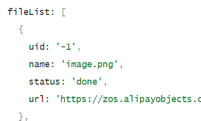

vo：服务提供方封装的返回数据

```java
package com.haoke.api.vo;
import lombok.Data;

@Data
public class PicUploadResult {
    // 文件唯一标识
    private String uid;
    // 文件名
    private String name;
    // 状态有：uploading done error removed
    private String status;
    // 服务端响应内容，如：'{"status": "success"}'
    private String response;
}
```

### 本地文件系统存储

#### 1. 编写Service

`PicUploadFileSystemService`

```java
package com.haoke.api.service;

@Service
public class PicUploadFileSystemService {
    // 允许上传的格式
    private static final String[] IMAGE_TYPE 
        = new String[]{ ".bmp", ".jpg",".jpeg", ".gif", ".png"};

    public PicUploadResult upload(MultipartFile uploadFile) {
        // 校验图片格式,属于图片，则允许上传
        boolean isLegal = false;
        for (String type : IMAGE_TYPE) {
            if(StringUtils.endsWithIgnoreCase(
                	uploadFile.getOriginalFilename(),
                    type)) {
                isLegal = true;
                break;
            }
        }
		
        // 封装Result对象，并且将文件的byte数组放置到result对象中
        PicUploadResult fileUploadResult = new PicUploadResult();
        
        //不允许上传，返回结果设置设为 error
        if (!isLegal) {
            fileUploadResult.setStatus("error");
            return fileUploadResult;
        }
        
        String fileName = uploadFile.getOriginalFilename();
        // 文件新路径
        String filePath = getFilePath(fileName);
        // 生成图片的绝对引用地址
        String picUrl = StringUtils.replace(
            StringUtils.substringAfter(
                filePath,"F:\\code\\haoke\\haoke-upload"),
     	        "\\", "/");
        fileUploadResult.setName("http://image.haoke.com" + picUrl);
        
        File newFile = new File(filePath);
        // 写文件到磁盘
        try {
            uploadFile.transferTo(newFile);
        } catch (IOException e) {
            e.printStackTrace();
            //上传失败
            fileUploadResult.setStatus("error");
            return fileUploadResult;
        } 
        fileUploadResult.setStatus("done");
        fileUploadResult.setUid(String.valueOf(System.currentTimeMillis()));
        return fileUploadResult;
    } 

    private String getFilePath(String sourceFileName) {
        String baseFolder = 
            "F:\\code\\haoke\\haoke-upload" + 
            File.separator + 
            "images";

        Date nowDate = new Date();
        // yyyy/MM/dd
        String fileFolder = baseFolder + 
            File.separator + 
            new DateTime(nowDate).toString("yyyy") + 
            File.separator + 
            new DateTime(nowDate).toString("MM") +
            File.separator + 
            new DateTime(nowDate).toString("dd");

        File file = new File(fileFolder);
        if (!file.isDirectory()) {
            // 如果目录不存在，则创建目录
            file.mkdirs();
        } 
        // 生成新的文件名
        String fileName = 
            new DateTime(nowDate).toString("yyyyMMddhhmmssSSSS") + 
            RandomUtils.nextInt(100, 9999) + 
            "." + 
            StringUtils.substringAfterLast(sourceFileName, ".");
        return fileFolder + File.separator + fileName;
    }
}
```

#### 2. 修改Controller中的引用

```java
package com.haoke.api.controller;

@RequestMapping("pic/upload")
@Controller
public class PicUploadController {
    @Autowired
    private PicUploadFileSystemService picUploadService;
    
    /**
    * @param uploadFile
    * @return
    * @throws Exception
    */
    @PostMapping
    @ResponseBody
    public PicUploadResult upload(@RequestParam("file") MultipartFile uploadFile)
        throws Exception {
        return this.picUploadService.upload(uploadFile);
    }
}
```

#### 3. 启动服务，测试接口


生成的链接是url链接，需要通过nginx进行访问映射

#### 4. 搭建nginx进行访问图片

##### 修改nginx配置文件

nginx目录/conf/nginx.conf

```
server {
        listen       80;
        server_name  image.haoke.com;

        #charset koi8-r;

        #access_log  logs/host.access.log  main;

        proxy_set_header X-Forwarded-Host $host;
        proxy_set_header X-Forwarded-Server $host;
        proxy_set_header X-Forwarded-For $proxy_add_x_forwarded_for;

        location / {
        	root  E:\idea\graduateProject\code\upload;
        }
}
```

##### 修改本机hosts环境

**没有修改C:\Windows\System32\drivers\etc\hosts的权限**

1.  打开C:\Windows\System32\drivers\etc\文件，找到hosts,然后分配所有权限。

2.  找到上面提的hosts文件，打开文件直接再保存原来路径下

3.  SwitchHosts!文件右击鼠标，点击管理员启动。

```conf
# 开发环境
127.0.0.1 manage.haoke.com
127.0.0.1 image.haoke.com
```


##### 启动nginx

```shell
cd nginx目录

start nginx.exe

# 停止nginx
nginx -s stop
```

#### 5. 访问链接，测试


### 腾讯云COS

1.  在腾讯云 [对象存储控制台](https://console.cloud.tencent.com/cos5) 开通腾讯云对象存储（COS）服务。
2.  在腾讯云 [对象存储控制台](https://console.cloud.tencent.com/cos5) 创建一个 Bucket。
3.  在访问管理控制台中的 [API 密钥管理](https://console.cloud.tencent.com/cam/capi) 页面里获取 APPID，并创建 SecretId、SecretKey。

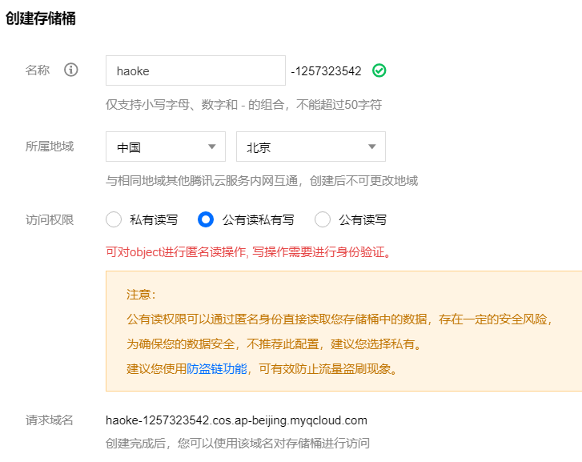

#### 1. 导入依赖

```xml
<!--导入腾讯云COS依赖-->
<dependency>
    <groupId>com.qcloud</groupId>
    <artifactId>cos_api</artifactId>
    <version>5.6.37</version>
</dependency>
<!--引入配置自动注入-->
<dependency>
    <groupId> org.springframework.boot </groupId>
    <artifactId> spring-boot-configuration-processor </artifactId>
    <optional> true </optional>
</dependency>
```

#### 2. 编写配置文件

```properties
# 子用户id
tencent.cos.appid=100018187662

#子用户key:id,key
tencent.cos.secret-id=AKIDlNkW6P8TLwNZXExxg9MIcaQMSKwHn32l
tencent.cos.secret-key=b3YEbhkX5MNK2VhfNULXZKG3cwzrW2HH

# 容器名
tencent.cos.bucket-name=haoke-1257323542

# 容器所属区
tencent.cos.region-id=ap-beijing

# 文件前缀
tencent.cos.base-url=https://haoke-1257323542.cos.ap-beijing.myqcloud.com
```

#### 3. CosConfig

```java
package com.haoke.api.config;

import com.qcloud.cos.COSClient;
import com.qcloud.cos.ClientConfig;
import com.qcloud.cos.auth.BasicCOSCredentials;
import com.qcloud.cos.auth.COSCredentials;
import com.qcloud.cos.region.Region;
import lombok.Data;
import org.springframework.boot.context.properties.ConfigurationProperties;
import org.springframework.context.annotation.Bean;
import org.springframework.context.annotation.Configuration;
import org.springframework.context.annotation.PropertySource;

@Data
@Configuration
@PropertySource(value = {"classpath:tencent.properties"})
@ConfigurationProperties(prefix = "tencent.cos")
public class CosConfig {
    private String appId;
    private String secretId;
    private String secretKey;
    private String bucketName;
    private String regionId;
    private String baseUrl;

    @Bean
    public COSClient cosClient() {
        //1. 初始化用户身份信息
        COSCredentials cred = new BasicCOSCredentials(this.secretId, this.secretKey);

        //2. 设置 bucket 的地域, COS 地域的简称请参照 https://cloud.tencent.com/document/product/436/6224
        ClientConfig clientConfig = new ClientConfig(new Region(this.regionId));

        //3. 生成cos客户端
        COSClient cosClient = new COSClient(cred,clientConfig);

        return  cosClient;
    }
}
```

#### 4. 编写Service

`PicUploadTencentService`

```java
package com.haoke.api.service;

@Service
public class PicUploadTencentService {

    // 允许上传的格式
    private static final String[] IMAGE_TYPE
            = new String[] {".bmp", ".jpg",".jpeg", ".gif", ".png"};

    @Autowired
    private COSClient cosClient;//COS客户端

    @Autowired
    private CosConfig cosConfig;

    public PicUploadResult upload(MultipartFile uploadFile) {
        // 校验图片格式
        boolean isLegal = false;
        for (String type : IMAGE_TYPE) {
            if (StringUtils.endsWithIgnoreCase(
                    uploadFile.getOriginalFilename(),type)) {
                //如果文件名的后缀为上述图片类型，则为合法文件，可以上传
                isLegal = true;
                break;
            }
        }

        // 封装Result对象，并且将文件的byte数组放置到result对象中
        PicUploadResult fileUploadResult = new PicUploadResult();
        if(!isLegal){
            fileUploadResult.setStatus("error");
            return fileUploadResult;
        }

        // 文件新路径
        String fileName = uploadFile.getOriginalFilename();
        String filePath = getFilePath(fileName);
        String[] filename = filePath.split("\\.");
        File localFile = null;

        // 以字节流上传到腾讯云COS
        try {
            localFile=File.createTempFile(filename[0], filename[1]);
            uploadFile.transferTo(localFile);
            localFile.deleteOnExit();

            cosClient.putObject(
                    cosConfig.getBucketName(),
                    filePath,
                    localFile
            );
        } catch (Exception e) {
            e.printStackTrace();
            //上传失败
            fileUploadResult.setStatus("error");
            return fileUploadResult;
        }

        cosClient.shutdown();
        //返回给umi的对象
        fileUploadResult.setStatus("done");
        fileUploadResult.setName(this.cosConfig.getBaseUrl() + filePath);
        fileUploadResult.setUid(String.valueOf(System.currentTimeMillis()));

        return fileUploadResult;
    }

    private String getFilePath(String fileName) {
        DateTime dateTime = new DateTime();

        return "images/" +
                dateTime.toString("yyyy")+
                "/" + dateTime.toString("MM") + "/" +
                dateTime.toString("dd") + "/" +
                System.currentTimeMillis() +
                RandomUtils.nextInt(100, 9999) + "." +
                StringUtils.substringAfterLast(fileName, ".");
    }
}
```

#### 5. Controller

```java
package com.haoke.api.controller;

@RequestMapping("pic/upload")
@Controller
public class PicUploadController {

    @Autowired
    private PicUploadTencentService picUploadTencentService;

    /*@Autowired
    private PicUploadFileSystemService picUploadService;
*/
    /**
     * @param uploadFile
     * @return
     * @throws Exception
     */
    @PostMapping
    @ResponseBody
    public PicUploadResult upload(@RequestParam("file") MultipartFile uploadFile)
            throws Exception {
        //return this.picUploadService.upload(uploadFile);

        return this.picUploadTencentService.upload(uploadFile);
    }
}
```

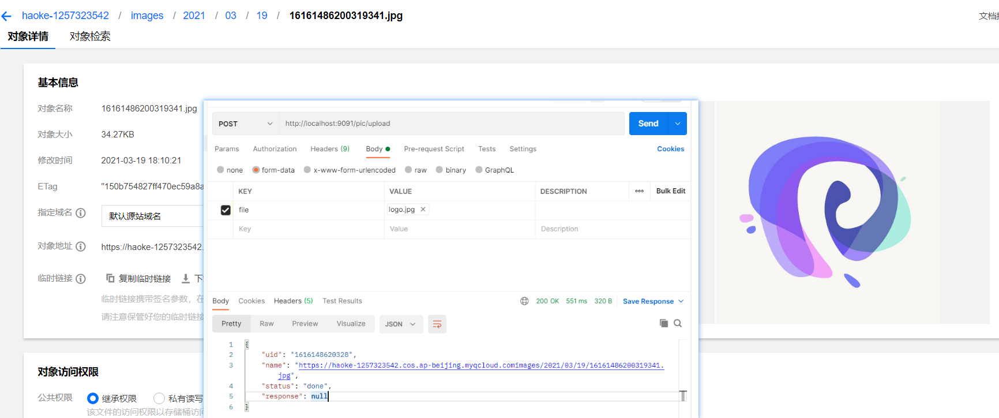

### 图像上传前后端整合

#### 1. 修改PicturesWall.js

```jsx
<Upload
    action="/haoke/pic/upload"
    listType="picture-card"
    fileList={fileList}
    onPreview={this.handlePreview}
    onChange={this.handleChange}
    >
```

#### 2. 修改AddResources.js

```js
handleFileList = (obj)=>{
    const pics = new Set();
    obj.forEach((v, k) => {
        if(v.response){
            pics.add(v.response.name);
        }
    });
    this.setState({
        pics
    })
}
```

#### 修改表单提交逻辑中的图片数据

```js
values.pic = [...this.state.pics].join(',');
```

#### 测试

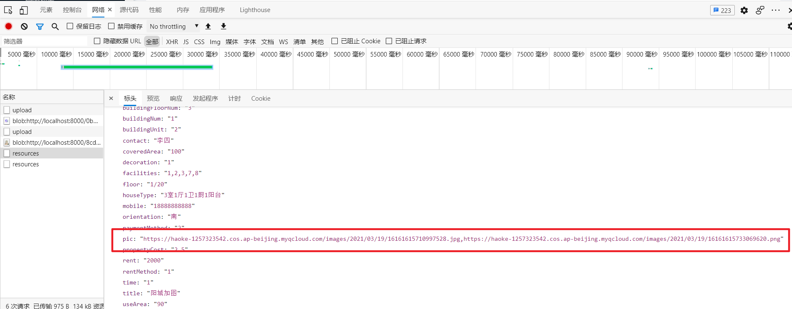


## 服务结构

后台服务系统采用SOA的架构思想，使用Dubbo作为服务治理框架进行搭建。


### 工程结构


#### 父工程

==haoke-manage==

```xml
<?xml version="1.0" encoding="UTF-8"?>
<project xmlns="http://maven.apache.org/POM/4.0.0"
         xmlns:xsi="http://www.w3.org/2001/XMLSchema-instance"
         xsi:schemaLocation="http://maven.apache.org/POM/4.0.0
         http://maven.apache.org/xsd/maven-4.0.0.xsd">
    <modelVersion>4.0.0</modelVersion>

    <groupId>com.haoke.manage</groupId>
    <artifactId>haoke-manage</artifactId>
    <packaging>pom</packaging>
    <version>1.0-SNAPSHOT</version>
    <modules>
        <module>haoke-manage-dubbo-server</module>
        <module>haoke-manage-api-server</module>
    </modules>

    <!--添加SpringBoot支持-->
    <parent>
        <artifactId>spring-boot-starter-parent</artifactId>
        <groupId>org.springframework.boot</groupId>
        <version>2.4.3</version>
    </parent>

    <dependencies>
        <!--springboot的测试支持-->
        <dependency>
            <groupId>org.springframework.boot</groupId>
            <artifactId>spring-boot-starter-test</artifactId>
            <version>2.4.3</version>
        </dependency>
        <dependency>
            <groupId>org.apache.commons</groupId>
            <artifactId>commons-lang3</artifactId>
        </dependency>

        <!--dubbo的springbboot支持-->
        <dependency>
            <groupId>com.alibaba.boot</groupId>
            <artifactId>dubbo-spring-boot-starter</artifactId>
            <version>0.2.0</version>
        </dependency>
        <!--dubbo框架-->
        <dependency>
            <groupId>com.alibaba</groupId>
            <artifactId>dubbo</artifactId>
            <version>2.6.4</version>
        </dependency>

        <!--zk依赖-->
        <dependency>
            <groupId>org.apache.zookeeper</groupId>
            <artifactId>zookeeper</artifactId>
            <version>3.4.13</version>
        </dependency>
        <dependency>
            <groupId>com.github.sgroschupf</groupId>
            <artifactId>zkclient</artifactId>
            <version>0.1</version>
        </dependency>
    </dependencies>

    <build>
        <plugins>
            <!--springboot的maven框架-->
            <plugin>
                <groupId>org.springframework.boot</groupId>
                <artifactId>spring-boot-maven-plugin</artifactId>
            </plugin>
        </plugins>
    </build>
</project>
```

#### 子工程

##### 服务提供方

==haoke-manage-dubbo-server==

```xml
<?xml version="1.0" encoding="UTF-8"?>
<project xmlns="http://maven.apache.org/POM/4.0.0"
         xmlns:xsi="http://www.w3.org/2001/XMLSchema-instance"
         xsi:schemaLocation="http://maven.apache.org/POM/4.0.0 http://maven.apache.org/xsd/maven-4.0.0.xsd">
    <parent>
        <artifactId>haoke-manage</artifactId>
        <groupId>com.haoke.manage</groupId>
        <version>1.0-SNAPSHOT</version>
    </parent>
    <modelVersion>4.0.0</modelVersion>

    <packaging>pom</packaging>
    <modules>
        <module>haoke-manage-dubbo-server-house-resources</module>
        <module>haoke-manage-dubbo-server-generator</module>
    </modules>

    <artifactId>haoke-manage-dubbo-server</artifactId>

    <dependencies>
        <dependency>
            <groupId>org.springframework.boot</groupId>
            <artifactId>spring-boot-starter</artifactId>
        </dependency>

        <!--lombok-->
        <dependency>
            <groupId>org.projectlombok</groupId>
            <artifactId>lombok</artifactId>
        </dependency>
    </dependencies>
</project>
```

##### 服务消费方

==haoke-manage-api-server==

```xml
<?xml version="1.0" encoding="UTF-8"?>
<project xmlns="http://maven.apache.org/POM/4.0.0"
         xmlns:xsi="http://www.w3.org/2001/XMLSchema-instance"
         xsi:schemaLocation="http://maven.apache.org/POM/4.0.0 http://maven.apache.org/xsd/maven-4.0.0.xsd">
    <parent>
        <artifactId>haoke-manage</artifactId>
        <groupId>com.haoke.manage</groupId>
        <version>1.0-SNAPSHOT</version>
    </parent>
    <modelVersion>4.0.0</modelVersion>

    <artifactId>haoke-manage-api-server</artifactId>

    <dependencies>
        <!--springboot的web支持-->
        <dependency>
            <groupId>org.springframework.boot</groupId>
            <artifactId>spring-boot-starter-web</artifactId>
        </dependency>
        <!--
            api模块———本模块，对外提供接口，作为dubbo的服务消费方
            interface模块————当前依赖，dubbo的服务提供方
        -->
        <dependency>
            <groupId>com.haoke.manage</groupId>
            <artifactId>haoke-manage-dubbo-server-house-resources-interface</artifactId>
            <version>1.0-SNAPSHOT</version>
        </dependency>
    </dependencies>
</project>
```

## 抽取common工程

分析：

-   多个dubbo服务，需要抽取公共的类、方法到common工程中
-   实现独立的dubbo服务，便于后期的扩展和维护

在dubbo服务提供方的工程中(`haoke-manage-dubbo-server`)，将BasePOJO、BaseServiceImpl、vo.PageInfo移至该工程；导入公有依赖

其他工程，依赖此工程，并将自己工程中的相关类删除


```xml
<?xml version="1.0" encoding="UTF-8"?>
<project xmlns="http://maven.apache.org/POM/4.0.0"
         xmlns:xsi="http://www.w3.org/2001/XMLSchema-instance"
         xsi:schemaLocation="http://maven.apache.org/POM/4.0.0 http://maven.apache.org/xsd/maven-4.0.0.xsd">
    <parent>
        <artifactId>haoke-manage-dubbo-server</artifactId>
        <groupId>com.haoke.manage</groupId>
        <version>1.0-SNAPSHOT</version>
    </parent>
    <modelVersion>4.0.0</modelVersion>

    <artifactId>haoke-manage-dubbo-server-common</artifactId>

    <dependencies>
        <dependency>
            <groupId>com.baomidou</groupId>
            <artifactId>mybatis-plus-boot-starter</artifactId>
            <version>3.4.2</version>
        </dependency>
        <dependency>
            <groupId>mysql</groupId>
            <artifactId>mysql-connector-java</artifactId>
            <version>8.0.16</version>
        </dependency>
        <dependency>
            <groupId>org.springframework.boot</groupId>
            <artifactId>spring-boot-starter-jdbc</artifactId>
        </dependency>
    </dependencies>
</project>
```

## 房源服务的构建

### 创建数据表

```sql
use haoke;

DROP TABLE IF EXISTS `TB_ESTATE`;

CREATE TABLE `TB_ESTATE` (
  `id` bigint NOT NULL AUTO_INCREMENT,
  `name` varchar(100) DEFAULT NULL COMMENT '楼盘名称',
  `province` varchar(10) DEFAULT NULL COMMENT '所在省',
  `city` varchar(10) DEFAULT NULL COMMENT '所在市',
  `area` varchar(10) DEFAULT NULL COMMENT '所在区',
  `address` varchar(100) DEFAULT NULL COMMENT '具体地址',
  `year` varchar(10) DEFAULT NULL COMMENT '建筑年代',
  `type` varchar(10) DEFAULT NULL COMMENT '建筑类型',
  `property_cost` varchar(10) DEFAULT NULL COMMENT '物业费',
  `property_company` varchar(20) DEFAULT NULL COMMENT '物业公司',
  `developers` varchar(20) DEFAULT NULL COMMENT '开发商',
  `created` datetime DEFAULT NULL COMMENT '创建时间',
  `updated` datetime DEFAULT NULL COMMENT '更新时间',
  PRIMARY KEY (`id`)
) ENGINE=InnoDB AUTO_INCREMENT=1006 DEFAULT CHARSET=utf8 COMMENT='楼盘表';

INSERT INTO `TB_ESTATE` VALUES 
(1001,'中远两湾城','上海市','上海市','普陀区','远景路97弄','2001','塔楼/板楼','1.5','上海中远物业管理发展有限公司','上海万业企业股份有限公司','2021-03-16 23:00:20','2021-03-16 23:00:20'),
(1002,'上海康城','上海市','上海市','闵行区','莘松路958弄','2001','塔楼/板楼','1.5','盛孚物业','闵行房地产','2021-03-16 23:00:20','2021-03-16 23:00:20'),
(1003,'保利西子湾','上海市','上海市','松江区','广富林路1188弄','2008','塔楼/板楼','1.75','上海保利物业管理','上海城乾房地产开发有限公司','2021-03-16 23:00:20','2021-03-16 23:00:20'),
(1004,'万科城市花园','上海市','上海市','松江区','广富林路1188弄','2002','塔楼/板楼','1.5','上海保利物业管理','上海城乾房地产开发有限公司','2021-03-16 23:00:20','2021-03-16 23:00:20'),
(1005,'上海阳城','上海市','上海市','闵行区','罗锦路888弄','2002','塔楼/板楼','1.5','上海莲阳物业管理有限公司','上海莲城房地产开发有限公司','2021-03-16 23:00:20','2021-03-16 23:00:20');


CREATE TABLE `TB_HOUSE_RESOURCES` (
  `id` bigint(20) NOT NULL AUTO_INCREMENT,
  `title` varchar(100) DEFAULT NULL COMMENT '房源标题',
  `estate_id` bigint(20) DEFAULT NULL COMMENT '楼盘id',
  `building_num` varchar(5) DEFAULT NULL COMMENT '楼号（栋）',
  `building_unit` varchar(5) DEFAULT NULL COMMENT '单元号',
  `building_floor_num` varchar(5) DEFAULT NULL COMMENT '门牌号',
  `rent` int(10) DEFAULT NULL COMMENT '租金',
  `rent_method` tinyint(1) DEFAULT NULL COMMENT '租赁方式，1-整租，2-合租',
  `payment_method` tinyint(1) DEFAULT NULL COMMENT '支付方式，1-付一押一，2-付三押一，3-付六押一，4-年付押一，5-其它',
  `house_type` varchar(255) DEFAULT NULL COMMENT '户型，如：2室1厅1卫',
  `covered_area` varchar(10) DEFAULT NULL COMMENT '建筑面积',
  `use_area` varchar(10) DEFAULT NULL COMMENT '使用面积',
  `floor` varchar(10) DEFAULT NULL COMMENT '楼层，如：8/26',
  `orientation` varchar(2) DEFAULT NULL COMMENT '朝向：东、南、西、北',
  `decoration` tinyint(1) DEFAULT NULL COMMENT '装修，1-精装，2-简装，3-毛坯',
  `facilities` varchar(50) DEFAULT NULL COMMENT '配套设施， 如：1,2,3',
  `pic` varchar(200) DEFAULT NULL COMMENT '图片，最多5张',
  `house_desc` varchar(200) DEFAULT NULL COMMENT '描述',
  `contact` varchar(10) DEFAULT NULL COMMENT '联系人',
  `mobile` varchar(11) DEFAULT NULL COMMENT '手机号',
  `time` tinyint(1) DEFAULT NULL COMMENT '看房时间，1-上午，2-中午，3-下午，4-晚上，5-全天',
  `property_cost` varchar(10) DEFAULT NULL COMMENT '物业费',
  `created` datetime DEFAULT NULL,
  `updated` datetime DEFAULT NULL,
  PRIMARY KEY (`id`)
) ENGINE=InnoDB AUTO_INCREMENT=1 DEFAULT CHARSET=utf8 COMMENT='房源表';
```

### POJO

#### BasePOJO

```java
package com.haoke.dubbo.server.pojo;

@Data
public abstract class BasePojo implements Serializable {
    private Date created;
    private Date updated;
}
```

#### 房源POJO

1.  [使用MybatisPlus逆向工程生成POJO](../../2-Java/3-Java框架/8-MybatisPlus.md#generator)

2.  将生成的entity放到com.haoke.dubbo.server.pojo下

    ```java
    package com.haoke.dubbo.server.pojo;
    
    import com.baomidou.mybatisplus.annotation.TableName;
    import lombok.Data;
    import lombok.EqualsAndHashCode;
    
    @Data
    @EqualsAndHashCode(callSuper = true)
    @TableName("TB_HOUSE_RESOURCES")
    public class HouseResources extends BasePojo {
        
        private static final long serialVersionUID = -2471649692631014216L;
        
        /**
         * 房源标题
         */
        private String title;
    
        /**
         * 楼盘id
         */
        @TableId(value = "ID", type = IdType.AUTO)
        private Long estateId;
    
        /**
         * 楼号（栋）
         */
        private String buildingNum;
    
        /**
         * 单元号
         */
        private String buildingUnit;
    
        /**
         * 门牌号
         */
        private String buildingFloorNum;
    
        /**
         * 租金
         */
        private Integer rent;
    
        /**
         * 租赁方式，1-整租，2-合租
         */
        private Integer rentMethod;
    
        /**
         * 支付方式，1-付一押一，2-付三押一，3-付六押一，4-年付押一，5-其它
         */
        private Integer paymentMethod;
    
        /**
         * 户型，如：2室1厅1卫
         */
        private String houseType;
    
        /**
         * 建筑面积
         */
        private String coveredArea;
    
        /**
         * 使用面积
         */
        private String useArea;
    
        /**
         * 楼层，如：8/26
         */
        private String floor;
    
        /**
         * 朝向：东、南、西、北
         */
        private String orientation;
    
        /**
         * 装修，1-精装，2-简装，3-毛坯
         */
        private Integer decoration;
    
        /**
         * 配套设施， 如：1,2,3
         */
        private String facilities;
    
        /**
         * 图片，最多5张
         */
        private String pic;
    
        /**
         * 描述
         */
        private String houseDesc;
    
        /**
         * 联系人
         */
        private String contact;
    
        /**
         * 手机号
         */
        private String mobile;
    
        /**
         * 看房时间，1-上午，2-中午，3-下午，4-晚上，5-全天
         */
        private Integer time;
    
        /**
         * 物业费
         */
        private String propertyCost;
    }
    ```

    

### 房源服务提供方项目结构


==haoke-manage-dubbo-server-house-resources==

```xml
<?xml version="1.0" encoding="UTF-8"?>
<project xmlns="http://maven.apache.org/POM/4.0.0"
         xmlns:xsi="http://www.w3.org/2001/XMLSchema-instance"
         xsi:schemaLocation="http://maven.apache.org/POM/4.0.0 http://maven.apache.org/xsd/maven-4.0.0.xsd">
    <parent>
        <artifactId>haoke-manage-dubbo-server</artifactId>
        <groupId>com.haoke.manage</groupId>
        <version>1.0-SNAPSHOT</version>
    </parent>
    <modelVersion>4.0.0</modelVersion>

    <artifactId>haoke-manage-dubbo-server-house-resources</artifactId>
    <packaging>pom</packaging>
    <!--spring接口与其实现模块-->
    <modules>
        <module>haoke-manage-dubbo-server-house-resources-interface</module>
        <module>haoke-manage-dubbo-server-house-resources-service</module>
    </modules>

    <dependencies>
        <dependency>
            <groupId>com.baomidou</groupId>
            <artifactId>mybatis-plus-boot-starter</artifactId>
            <version>3.4.2</version>
        </dependency>
        <dependency>
            <groupId>mysql</groupId>
            <artifactId>mysql-connector-java</artifactId>
            <version>8.0.16</version>
        </dependency>
    </dependencies>
</project>
```

#### 房源业务接口

==haoke-manage-dubbo-server-house-resources-interface==

-   对外提供的SDK包
-   只提供pojo实体类以及接口

```xml
<?xml version="1.0" encoding="UTF-8"?>
<project xmlns="http://maven.apache.org/POM/4.0.0"
         xmlns:xsi="http://www.w3.org/2001/XMLSchema-instance"
         xsi:schemaLocation="http://maven.apache.org/POM/4.0.0 http://maven.apache.org/xsd/maven-4.0.0.xsd">
    <parent>
        <artifactId>haoke-manage-dubbo-server-house-resources</artifactId>
        <groupId>com.haoke.manage</groupId>
        <version>1.0-SNAPSHOT</version>
    </parent>
    <modelVersion>4.0.0</modelVersion>

    <artifactId>haoke-manage-dubbo-server-house-resources-interface</artifactId>
</project>
```

#### 房源业务实现

==haoke-manage-server-house-resources-service==

-   房源服务的实现——Spring业务

```xml
<?xml version="1.0" encoding="UTF-8"?>
<project xmlns="http://maven.apache.org/POM/4.0.0"
         xmlns:xsi="http://www.w3.org/2001/XMLSchema-instance"
         xsi:schemaLocation="http://maven.apache.org/POM/4.0.0 http://maven.apache.org/xsd/maven-4.0.0.xsd">
    <parent>
        <artifactId>haoke-manage-dubbo-server-house-resources</artifactId>
        <groupId>com.haoke.manage</groupId>
        <version>1.0-SNAPSHOT</version>
    </parent>
    <modelVersion>4.0.0</modelVersion>

    <artifactId>haoke-manage-dubbo-server-house-resources-service</artifactId>

    <dependencies>
        <dependency>
            <groupId>org.springframework.boot</groupId>
            <artifactId>spring-boot-starter-jdbc</artifactId>
        </dependency>
        <dependency>
            <groupId>com.haoke.manage</groupId>
            <artifactId>haoke-manage-dubbo-server-house-resources-interface</artifactId>
            <version>1.0-SNAPSHOT</version>
        </dependency>
    </dependencies>
</project>
```

### 相关配置

==application.preperties==

```properties
# Spring boot application
spring.application.name = haoke-manage-dubbo-server-house-resources

# 数据库
spring.datasource.driver-class-name=com.mysql.cj.jdbc.Driver
spring.datasource.url=jdbc:mysql://82.157.25.25:4002/haoke?characterEncoding=utf8&useSSL=false&serverTimezone=UTC
spring.datasource.username=mycat
spring.datasource.password=mycat

# Dubbo配置
##服务的扫描包
dubbo.scan.basePackages = com.haoke.server.api
##服务名称
dubbo.application.name = dubbo-provider-house-resources
dubbo.service.version = 1.0.0
##协议以及端口
dubbo.protocol.name = dubbo
dubbo.protocol.port = 20880
##zk服务注册中心地址
dubbo.registry.address = zookeeper://8.140.130.91:2181
dubbo.registry.client = zkclient
```

### 新增房源

#### 定义服务提供方接口

==haoke-manage-dubbo-server-house-resources-interface==

```java
package com.haoke.server.api;
import com.haoke.server.pojo.HouseResources;

public interface ApiHouseResourcesService {
    /**
     * @param houseResources
     *
     * @return -1:输入的参数不符合要求，0：数据插入数据库失败，1：成功
     */
    int saveHouseResources(HouseResources houseResources);
}
```

#### 实现新增房源业务

>   创建SpringBoot应用，实现新增房源服务
>
>   1.  连接数据库——Dao层
>   2.  实现CRUD接口——Service层


##### Dao层

###### MybatisPlus配置类

```java
package com.haoke.server.config;

import org.mybatis.spring.annotation.MapperScan;
import org.springframework.context.annotation.Configuration;

//定义包扫描路径
@MapperScan("com.haoke.server.mapper")
@Configuration
public class MybatisPlusConfig {}
```

###### HouseResourcesMapper接口

```java
package com.haoke.server.mapper;

import com.baomidou.mybatisplus.core.mapper.BaseMapper;
import com.haoke.dubbo.server.pojo.HouseResources;

//BaseMapper是MybatisPlus提供的基本CRUD类
public interface HouseResourcesMapper extends BaseMapper<HouseResources> {}
```

##### Service层

>   此处实现的是spring的服务，为dubbo服务的具体实现细节，无需对外暴露，同时需要进行事务控制和其他判断逻辑

###### 定义接口

```java
package com.haoke.server.service;
import com.haoke.server.pojo.HouseResources;

public interface HouseResourcesService {
    /**
     *
     * @param houseResources
     * @return -1:输入的参数不符合要求，0：数据插入数据库失败，1：成功
     */
    int saveHouseResources(HouseResources houseResources);
}
```

###### 编写实现类

>   通用CRUD实现

```java
package com.haoke.server.service.impl;

import com.baomidou.mybatisplus.core.conditions.query.QueryWrapper;
import com.baomidou.mybatisplus.core.mapper.BaseMapper;
import com.baomidou.mybatisplus.core.metadata.IPage;
import com.baomidou.mybatisplus.extension.plugins.pagination.Page;
import com.haoke.dubbo.server.pojo.BasePojo;
import org.springframework.beans.factory.annotation.Autowired;

import java.util.Date;
import java.util.List;

public class BaseServiceImpl<T extends BasePojo>{

    @Autowired
    private BaseMapper<T> mapper;

    /**
     * 根据id查询数据
     * @param id
     * @return
     */
    public T queryById(Long id) {
        return this.mapper.selectById(id);
    }

    /**
     * 查询所有数据
     *
     * @return
     */
    public List<T> queryAll() {
        return this.mapper.selectList(null);
    }

    /**
     * 根据条件查询一条数据
     *
     * @param record
     * @return
     */
    public T queryOne(T record) {
        return this.mapper.selectOne(new QueryWrapper<>(record));
    }

    /**
     * 根据条件查询数据列表
     * @param record
     * @return
     */
    public List<T> queryListByWhere(T record) {
        return this.mapper.selectList(new QueryWrapper<>(record));
    }

    /**
     * 根据条件分页查询数据列表
     * @param record
     * @param page
     * @param rows
     * @return
     * */
    public IPage<T> queryPageListByWhere(T record, Integer page, Integer rows) {
    // 获取分页数据
        return this.mapper.selectPage(new Page<T>(page, rows), new QueryWrapper<>
                (record));
    }

    /**
     * 保存数据
     *
     * @param record
     * @return
     */
    public Integer save(T record) {
        record.setCreated(new Date());
        record.setUpdated(record.getCreated());
        return this.mapper.insert(record);
    }
    /**
     * 更新数据
     * @param record
     * @return
     */
    public Integer update(T record) {
        record.setUpdated(new Date());
        return this.mapper.updateById(record);
    }
    /**
     * 根据id删除数据
     * @param id
     * @return
     */
    public Integer deleteById(Long id) {
        return this.mapper.deleteById(id);
    }

    /**
     * 根据ids批量删除数据
     * @param ids
     * @return
     */
    public Integer deleteByIds(List<Long> ids) {
        return this.mapper.deleteBatchIds(ids);
    }

    /**
     * 根据条件删除数据
     * @param record
     * @return
     */
    public Integer deleteByWhere(T record){
        return this.mapper.delete(new QueryWrapper<>(record));
    }
}
```

>    房源相关实现类——HouseResourcesImpl

```java
package com.haoke.server.service.impl;

import com.alibaba.dubbo.common.utils.StringUtils;
import com.haoke.server.pojo.HouseResources;
import com.haoke.server.service.HouseResourcesService;
import org.springframework.stereotype.Service;
import org.springframework.transaction.annotation.Transactional;

@Transactional//这是Spring的服务
@Service//开启事务
public class HouseResourcesServiceImpl
        extends BaseServiceImpl
        implements HouseResourcesService {
    @Override
    public int saveHouseResources(HouseResources houseResources) {
        // 编写校验逻辑，如果校验不通过，返回-1
        if (StringUtils.isBlank(houseResources.getTitle())) {
            return -1;
        }

        //其他校验以及逻辑省略 ……

        return super.save(houseResources);
    }
}
```

#### 服务提供方实现

暴露新增房源的dubbo服务

```java
package com.haoke.server.api;

import com.alibaba.dubbo.config.annotation.Service;
import com.haoke.server.pojo.HouseResources;
import com.haoke.server.service.HouseResourcesService;
import org.springframework.beans.factory.annotation.Autowired;

//实现Dubbo，对外暴露服务
@Service(version = "${dubbo.service.version}")
public class ApiHoukeResourcesImpl implements ApiHouseResourcesService{

    @Autowired
    private HouseResourcesService resourcesService;

    @Override
    public int saveHouseResources(HouseResources houseResources) {
        return this.resourcesService.saveHouseResources(houseResources);
    }
}
```

#### Dubbo启动类

```java
package com.haoke.server;

import org.springframework.boot.WebApplicationType;
import org.springframework.boot.autoconfigure.SpringBootApplication;
import org.springframework.boot.builder.SpringApplicationBuilder;

@SpringBootApplication
public class DubboProvider {

    public static void main(String[] args) {
        new SpringApplicationBuilder(DubboProvider.class)
                .web(WebApplicationType.NONE)//不是web应用
                .run(args);
    }
}
```

##### 启用DubboAdmin

```shell
cd /opt/incubator-dubbo-ops/

mvn --projects dubbo-admin-server spring-boot:run
```

##### 查询dubbo服务提供方

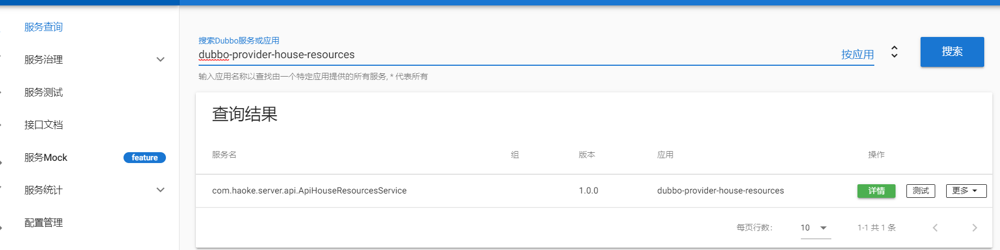


dubbo-provider-house-resources,端口为20880

#### 服务消费方

haoke-manage-api-server工程

-   为前端系统提供RESTful风格接口
-   dubbo的消费方


##### 添加依赖

因为dubbo是消费方，需要添加dubbo提供方提供的接口、pojo的依赖

```xml
<dependencies>
    <!--springboot的web支持-->
    <dependency>
        <groupId>org.springframework.boot</groupId>
        <artifactId>spring-boot-starter-web</artifactId>
    </dependency>
    <!--
		api模块———本模块，对外提供接口，作为dubbo的服务消费方
        interface模块————当前依赖，dubbo的服务提供方
	-->
    <dependency>
        <groupId>com.haoke.manage</groupId>
        <artifactId>haoke-manage-dubbo-server-house-resources-interface</artifactId>
        <version>1.0-SNAPSHOT</version>
    </dependency>
</dependencies>
```

##### 消费方配置文件

```properties
# Spring boot application
spring.application.name = haoke-manage-api-server
server.port = 9091

#logging.level.root=DEBUG

# 应用名称
dubbo.application.name = dubbo-consumer-haoke-manage

# zk注册中心  服务消费方从注册中心订阅服务
dubbo.registry.address = zookeeper://8.140.130.91:2181
dubbo.registry.client = zkclient

dubbo.service.version = 1.0.0
```

##### 服务消费方

==HouseResourceService用于调用dubbo服务==

```java
package com.haoke.api.service;

import com.alibaba.dubbo.config.annotation.Reference;
import com.haoke.server.api.ApiHouseResourcesService;
import com.haoke.server.pojo.HouseResources;
import org.springframework.stereotype.Service;

@Service//服务消费方
public class HouseResourceService {

    @Reference(version = "${dubbo.service.version}")
    private ApiHouseResourcesService apiHouseResourcesService;

    public boolean save(HouseResources houseResources){
        int result = this.apiHouseResourcesService.saveHouseResources(houseResources);

        return result==1;
    }
}
```

##### 控制层

```java
package com.haoke.api.controller;

import com.haoke.api.service.HouseResourceService;
import com.haoke.server.pojo.HouseResources;
import org.springframework.beans.factory.annotation.Autowired;
import org.springframework.http.HttpStatus;
import org.springframework.http.ResponseEntity;
import org.springframework.stereotype.Controller;
import org.springframework.web.bind.annotation.*;

@RequestMapping("house/resources")
@Controller
public class HouseResourcesController {

    @Autowired
    private HouseResourceService houseResourceService;

    /**
     * 新增房源
     *
     * @param houseResources json数据
     * @return
     */
    @PostMapping
    @ResponseBody
    public ResponseEntity<Void> save(@RequestBody HouseResources houseResources){
        try {
            boolean bool = this.houseResourceService.save(houseResources);
            if(bool){
                return ResponseEntity.status(HttpStatus.CREATED).build();
            }
        } catch (Exception e) {
            e.printStackTrace();
        }
        return ResponseEntity.status(HttpStatus.INTERNAL_SERVER_ERROR).build();
    }

    /**
     * test
     * @return
     */
    @GetMapping
    @ResponseBody
    public ResponseEntity<String> get(){
        System.out.println("get House Resources");
        return ResponseEntity.ok("ok");
    }
}
```

##### 测试程序

```java
package com.haoke.api;

import org.springframework.boot.SpringApplication;
import org.springframework.boot.autoconfigure.SpringBootApplication;

@SpringBootApplication(exclude = {DataSourceAutoConfiguration.class})
public class DubboApiApplication {
    public static void main(String[] args) {
        SpringApplication.run(DubboApiApplication.class, args);
    }
}
```

##### 测试接口

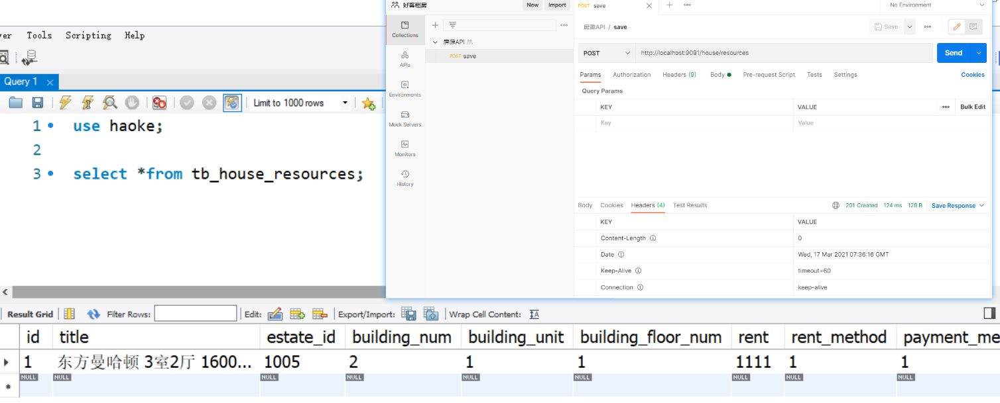

#### 新增接口前后端整合

>   基于 `antdesign-pro` ，其他React框架的前台类似

##### 增加model

新建 **models** 文件夹


```js
import { routerRedux } from 'dva/router';
import { message } from 'antd';
import { addHouseResource } from '@/services/haoke/haoke';

export default {
  namespace: 'house',

  state: {
  },

  effects: {
    *submitHouseForm({ payload }, { call }) {
      console.log("page model")
      yield call(addHouseResource, payload);
      message.success('提交成功');
    }
  },

  reducers: {

  },
};
```

##### 增加services

```js
import request from '@/utils/request';

export async function addHouseResource(params) {
  return request('/haoke/house/resources', {
    method: 'POST',
    body: params
  });
}
```

##### 修改表单提交地址

```jsx
handleSubmit = e => {
    const { dispatch, form } = this.props;
    e.preventDefault();
    form.validateFieldsAndScroll((err, values) => {
        if (!err) {
            if(values.facilities){
                values.facilities = values.facilities.join(",");
            }
            if(values.floor_1 && values.floor_2){
                values.floor = `${values.floor_1  }/${  values.floor_2}`;

            }

            values.houseType = `${values.houseType_1  }室${  values.houseType_2  }厅${
            values.houseType_3  }卫${  values.houseType_4  }厨${
            values.houseType_2  }阳台`;
            delete values.floor_1;
            delete values.floor_2;
            delete values.houseType_1;
            delete values.houseType_2;
            delete values.houseType_3;
            delete values.houseType_4;
            delete values.houseType_5;
            dispatch({
                type: 'house/submitHouseForm',
                payload: values,
            });
        }
    });
};
```

##### 通过反向代理解决跨域问题

https://umijs.org/zh-CN/config#proxy

```json
proxy: {
    '/haoke/': {
        target: 'http://127.0.0.1:9091',//目标地址
        changeOrigin: true,
        pathRewrite: { '^/haoke/': '' },//路径覆盖
    },
},
```

代理效果：

请求：http://localhost:8000/haoke/house/resources  

实际：http://127.0.0.1:9091/house/resources  

### 房源列表


-   PageInfo：返回给服务消费方的数据
-   ApiHouseResourcesService:暴露==Dubbo==服务提供方接口
-   ApiHaoKeResourcesImpl：==Dubbo==服务提供方的实现
-   HouseResourcesService：==spring==服务层定义
-   HouseResourcesServiceImpl：==spring==业务的实现
-   BaseServiceImpl：==Mybatisplus== 层访问数据库

#### 1. 定义dubbo服务

==haoke-manage-server-house-resources-dubbo-interface==

Dubbo服务提供方接口

```java
package com.haoke.server.api;

import com.haoke.server.pojo.HouseResources;
import com.haoke.server.vo.PageInfo;

public interface ApiHouseResourcesService {

    /**
     * @param houseResources
     *
     * @return -1:输入的参数不符合要求，0：数据插入数据库失败，1：成功
     */
    int saveHouseResources(HouseResources houseResources);

    /**
     * 分页查询房源列表
     *
     * @param page 当前页
     * @param pageSize 页面大小
     * @param queryCondition 查询条件
     * @return
     */
    PageInfo<HouseResources> queryHouseResourcesList(int page, int pageSize, HouseResources queryCondition);
}
```

#### 2. 实现dubbo服务

==haoke-manage-dubbo-server-house-resources-service==

##### 1. 定义数据模型

>   服务提供方封装返回的数据

```java
package com.haoke.server.vo;

import lombok.AllArgsConstructor;
import lombok.Data;
import java.util.Collections;
import java.util.List;

@Data
@AllArgsConstructor
public class PageInfo<T> implements java.io.Serializable{
    /**
     * 总条数
     */
    private Integer total;
    /**
     * 当前页
     */
    private Integer pageNum;
    /**
     * 一页显示的大小
     */
    private Integer pageSize;
    /**
     * 数据列表
     */
    private List<T> records = Collections.emptyList();
}
```

##### 2. 服务提供方实现

>    dubbo服务的实现实际上为调用Spring的服务层业务

```java
package com.haoke.server.api;

import com.alibaba.dubbo.config.annotation.Service;
import com.haoke.server.pojo.HouseResources;
import com.haoke.server.service.HouseResourcesService;
import com.haoke.server.vo.PageInfo;
import org.springframework.beans.factory.annotation.Autowired;

//实现Dubbo，对外暴露服务
@Service(version = "${dubbo.service.version}")
public class ApiHaokeResourcesImpl implements ApiHouseResourcesService{

    @Autowired
    private HouseResourcesService houseResourcesService;

    @Override
    public int saveHouseResources(HouseResources houseResources) {
        return this.houseResourcesService.saveHouseResources(houseResources);
    }

    @Override
    public PageInfo<HouseResources> queryHouseResourcesList(int page, int pageSize, HouseResources queryCondition) {
        return this.houseResourcesService.queryHouseResourcesList(page, pageSize, queryCondition);
    }
}
```

##### 3. 列表业务实现

###### Dao层

==mybatisplus从数据库获取数据==

```java
@Override
public PageInfo<HouseResources> queryHouseResourcesList(int page, int pageSize, HouseResources queryCondition) {
    QueryWrapper<HouseResources> queryWrapper = new QueryWrapper<HouseResources>(queryCondition);
    queryWrapper.orderByDesc("updated");//按更新时间降序排列

    IPage iPage = super.queryPageList(queryWrapper, page, pageSize);
    return new PageInfo<HouseResources>(Long.valueOf(iPage.getTotal()).intValue() , page, pageSize, iPage.getRecords());
}
```

###### Service层

>    spring的服务层实现查询列表业务

==spring服务层定义==

```java
package com.haoke.server.service;

import com.haoke.server.pojo.HouseResources;
import com.haoke.server.vo.PageInfo;

public interface HouseResourcesService {
    /**
     *
     * @param houseResources
     * @return -1:输入的参数不符合要求，0：数据插入数据库失败，1：成功
     */
    int saveHouseResources(HouseResources houseResources);

    public PageInfo<HouseResources> queryHouseResourcesList(int page, int pageSize, HouseResources queryCondition);
}
```

==spring服务层实现==

```java
package com.haoke.server.service.impl;

import com.alibaba.dubbo.common.utils.StringUtils;
import com.baomidou.mybatisplus.core.conditions.query.QueryWrapper;
import com.baomidou.mybatisplus.core.metadata.IPage;
import com.haoke.server.pojo.HouseResources;
import com.haoke.server.service.HouseResourcesService;
import com.haoke.server.vo.PageInfo;
import org.springframework.stereotype.Service;
import org.springframework.transaction.annotation.Transactional;

@Transactional//这是Spring的服务
@Service//开启事务
public class HouseResourcesServiceImpl
        extends BaseServiceImpl
        implements HouseResourcesService {
    @Override
    public int saveHouseResources(HouseResources houseResources) {
        // 编写校验逻辑，如果校验不通过，返回-1
        if (StringUtils.isBlank(houseResources.getTitle())) {
            return -1;
        }

        //其他校验以及逻辑省略 ……

        return super.save(houseResources);
    }

    @Override
    public PageInfo<HouseResources> queryHouseResourcesList(int page, int pageSize, HouseResources queryCondition) {
        QueryWrapper<Object> queryWrapper = new QueryWrapper<>(queryCondition);
        queryWrapper.orderByDesc("updated");
        IPage iPage = super.queryPageList(queryWrapper, page, pageSize);
        return new PageInfo<HouseResources>(Long.valueOf(iPage.getTotal()).intValue() , page, pageSize, iPage.getRecords());
    }
}
```

#### 3. Dubbo消费方

>    实现RESTful风格接口


-    TableResult：返回给前端的vo
-    Pagination：分页信息
-    HouseResourceService：调用服务提供方提供的接口
-    HouseResourcesController：服务消费方提供接口给前端调用

##### 1. 定义vo

```java
@Data
@AllArgsConstructor
public class TableResult<T> {
    private List<T> list;
    private Pagination pagination;
}

@Data
@AllArgsConstructor
public class Pagination {
    private Integer current;
    private Integer pageSize;
    private Integer total;
}
```

##### 2. 调用服务提供方

```java
public TableResult queryList(HouseResources houseResources, Integer currentPage, Integer pageSize) {
    PageInfo<HouseResources> pageInfo
        = this.apiHouseResourcesService.queryHouseResourcesList(currentPage, pageSize, houseResources);

    return new TableResult(
        pageInfo.getRecords(),
        new Pagination(currentPage, pageSize, pageInfo.getTotal()));
}
```

##### 3. 服务消费方提供给前端接口

```java
/**
 * 查询房源列表
 * @param houseResources
 * @param currentPage
 * @param pageSize
 * @return
 */
@GetMapping("/list")//完整请求路径是/house/resource/list
@ResponseBody
public ResponseEntity<TableResult> list(HouseResources houseResources,
                                        @RequestParam(name = "currentPage", defaultValue = "1") Integer currentPage,
                                        @RequestParam(name = "pageSize",defaultValue = "10") Integer pageSize) {

    return ResponseEntity.ok(this.houseResourceService.queryList(houseResources, currentPage, pageSize));
}
```

##### 4. 测试接口


#### 4. 前后端整合

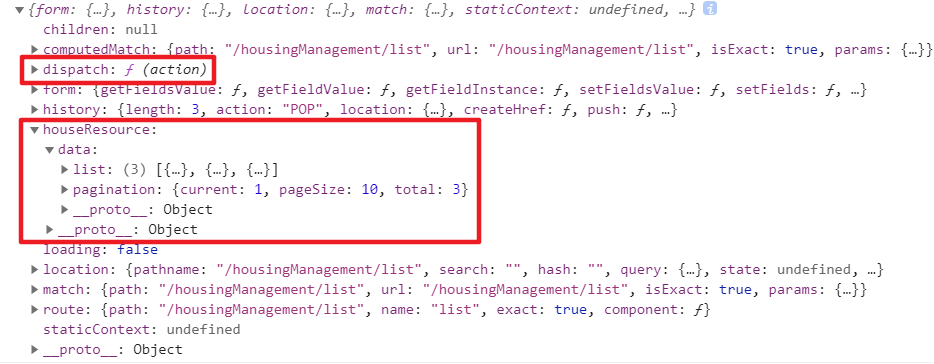


##### 1. 修改前端表结构

```js
columns = [
    {
        title: '房源编号',
        dataIndex: 'id',
    },
    {
        title: '房源信息',
        dataIndex: 'title',
    },
    {
        title: '图',
        dataIndex: 'pic',
        render : (text, record, index) => <ShowPics pics={text} />
    },
    {
        title: '楼栋',
        render : (text, record, index) => `${record.buildingFloorNum  }栋${record.buildingNum}单元${record.buildingUnit}号`
    },
    {
        title: '户型',
        dataIndex: 'houseType'
    },
    {
        title: '面积',
        dataIndex: 'useArea',
        render : (text, record, index) => `${text}平方`
    },
    {
        title: '楼层',
        dataIndex: 'floor'
    },
    {
        title: '操作',
        render: (text, record) => (
            <Fragment>
            <a onClick={() => this.handleUpdateModalVisible(true, record)}>查看</a>
    <Divider type="vertical" />
    <a href="">删除</a>
    </Fragment>
    ),
},
    ];
```

##### 2. 自定义图片展示组件

```jsx
import React from 'react';
import { Modal, Button, Carousel } from 'antd';

class ShowPics extends React.Component{
  info = () => {
    Modal.info({
      title: '',
      iconType:'false',
      width: '800px',
      okText: "ok",
      content: (
        <div style={{width:650, height: 400, lineHeight:400, textAlign:"center"}}>
          <Carousel autoplay>
            {
              this.props.pics.split(',').map((value,index) => <div>
                
              </div>)
            }
          </Carousel>
        </div>
      ),
      onOk() {},
    });
  };

  constructor(props){
      super(props);
      this.state={
        btnDisabled: !this.props.pics
    }
  }

  render() {
    return (
      <div>
        <Button disabled={this.state.btnDisabled} icon="picture" shape="circle" onClick={()=>{this.info()}} />
      </div>
    )
  }
}

export default ShowPics;
```

##### 3. model层

```jsx
import { queryResource } from '@/services/haoke/houseResource';

export default {
  namespace: 'houseResource',

  state: {
    data: {
      list: [],
      pagination: {},
    },
  },

  effects: {
    *fetch({ payload }, { call, put }) {
      console.log("houseResource fetch")

      const response = yield call(queryResource, payload);
      yield put({
        type: 'save',
        payload: response,
      });
    }
  },

  reducers: {
    save(state, action) {// state表示当前model的数据，action表示异步函数 put ，put()中的payload为封装了回调数据的属性
      return {
        ...state,
        data: action.payload,
      };
    },
  },
};
```

##### 4. 修改数据请求地址

```jsx
import request from '@/utils/request';
import { stringify } from 'qs';

export async function queryResource(params) {
  return request(`/haoke/house/resources/list?${stringify(params)}`);
}
```

## GraphQL

-   使用GraphQL开发房源接口
-   实现房源列表查询的接口

### 简介

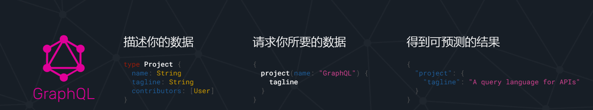

[官网地址](https://graphql.cn/)

一种用于前后端 **数据查询** 方式的规范

#### RESTful存在的问题

```shell
GET http://127.0.0.1/user/1 #查询
POST http://127.0.0.1/user #新增
PUT http://127.0.0.1/user #更新
DELETE http://127.0.0.1/user #删除
```

**场景一：**

只需某一对象的部分属性，但通过RESTful返回的是这个对象的所有属性

```json
#请求
GET http://127.0.0.1/user/1001
#响应：
{
    id : 1001,
    name : "张三",
    age : 20,
    address : "北京市",
    ……
}
```

**场景二：**

一个需求，要发起多次请求才能完成

```json
#查询用户信息
GET http://127.0.0.1/user/1001
#响应：
{
    id : 1001,
    name : "张三",
    age : 20,
    address : "北京市",
    ……
} 

#查询用户的身份证信息
GET http://127.0.0.1/card/8888
#响应：
{
    id : 8888,
    name : "张三",
    cardNumber : "999999999999999",
    address : "北京市",
    ……
}
```

#### GraphQL的优势

##### 1. 按需索取数据

当请求中只有name属性时，响应结果中只包含name属性，如果请求中添加appearsIn属性，那么结果中就会返回appearsIn的值

演示地址:https://graphql.cn/learn/schema/#type-system

##### 2. 一次查询多个数据


一次请求，不仅查询到了hero数据，而且还查询到了friends数据。节省了网络请求次数

##### 3. API的演进无需划分版本

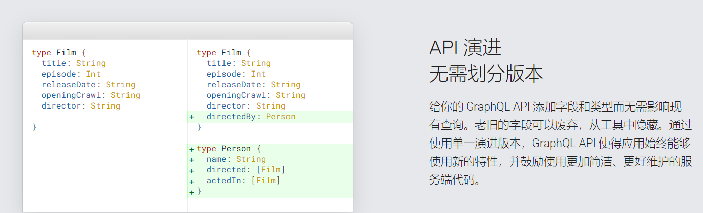

当API进行升级时，客户端可以不进行升级，可以等到后期一起升级，这样就大大减少了客户端和服务端的耦合度

#### GraphQL查询的规范

GraphQL定义了一套规范，用来描述语法定义  http://graphql.cn/learn/queries/  

>   规范 $\neq$ 实现

##### 字段 Fields

在GraphQL的查询中，请求结构中包含了所预期结果的结构，这个就是字段。并且响应的结构和请求结构基本一致，这是GraphQL的一个特性，这样就可以让请求发起者很清楚的知道自己想要什么。  

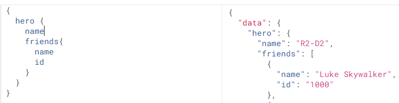

##### 参数Arguments

语法：(参数名:参数值)


##### 别名 Aliases

如果一次查询多个 `相同对象` ，但是 `值不同` ，这个时候就需要起别名了，否则json的语法就不能通过了 


##### 片段 Fragments

查询对的属性如果相同，可以采用片段的方式进行简化定义  


#### GraphQL的schema和类型规范

**Schema用于定义数据结构**

https://graphql.cn/learn/schema/

##### Schema定义结构

每一个 GraphQL 服务都有一个 `query` 类型，可能有一个 `mutation` 类型。这两个类型和常规对象类型无差，但是它们之所以特殊，是因为它们定义了每一个 GraphQL 查询的**入口**。

```
schema { #定义查询
	query: UserQuery
}

type UserQuery{# 定义查询的类型
	user(id:ID):User #指定对象以及参数类型
}

type User{# 定义对象
	id:ID! #!表示该属性必须不可为空
	name:String
	age:Int
}
```

###### 标量类型

-   Int ：有符号 32 位整数。
-   Float ：有符号双精度浮点值。
-   String ：UTF‐8 字符序列。
-   Boolean ： true 或者 false 。
-   ID ：ID 标量类型表示一个唯一标识符，通常用以重新获取对象或者作为缓存中的键  

GraphQL支持自定义类型，比如在graphql-java实现中增加了：Long、Byte等。  

###### 枚举类型

```
enum Episode{# 定义枚举
	NEWHOPE
	EMPIRE
	JEDI
}

type huma{
	id: ID!
	name: String!
	appearsIn: [Episode]! #使用枚举类型  表示一个 Episode 数组
	homePlanet: String
}
```

##### 接口 interface

一个接口是一个抽象类型，它包含某些字段，而对象类型必须包含这些字段，才能算实现了这个接口  

```
interface Character{# 定义接口
	id: ID!
	name: String!
	friends: [Character]
	appearsIn: [Episode]!
}

#实现接口
type Human implememts Character{
	id: ID!
	name: String!
	friends: [Character]!
	starship: [Startships]!
	
	totalCredits: Int
}
type Droid implements Character {
	id: ID!
	name: String!
	friends: [Character]
	appearsIn: [Episode]!
	
	primaryFunction: String
}
```

### GraphQL的Java实现

官方只是定义了规范并没有做实现，就需要有第三方来进行实现了

官网：https://www.graphql-java.com/


https://www.graphql-java.com/documentation/v16/getting-started/

graphQL并未发布到maven中央仓库中，需要添加第三方仓库，才能下载到依赖

>   Maven：若使用mirrors配置镜像，则第三方配置不会生效

#### 1. 导入依赖

```xml
<?xml version="1.0" encoding="UTF-8"?>
<project xmlns="http://maven.apache.org/POM/4.0.0"
         xmlns:xsi="http://www.w3.org/2001/XMLSchema-instance"
         xsi:schemaLocation="http://maven.apache.org/POM/4.0.0 http://maven.apache.org/xsd/maven-4.0.0.xsd">
    <modelVersion>4.0.0</modelVersion>
    <groupId>org.example</groupId>
    <artifactId>graphql</artifactId>
    <version>1.0-SNAPSHOT</version>

    <repositories>
        <repository>
            <snapshots>
                <enabled>false</enabled>
            </snapshots>
            <id>bintray-andimarek-graphql-java</id>
            <name>bintray</name>
            <url>https://dl.bintray.com/andimarek/graphql-java</url>
        </repository>
    </repositories>

    <dependencies>
        <dependency>
            <groupId>org.projectlombok</groupId>
            <artifactId>lombok</artifactId>
        </dependency>
        <dependency>
            <groupId>com.graphql-java</groupId>
            <artifactId>graphql-java</artifactId>
            <version>11.0</version>
        </dependency>
    </dependencies>
</project>
```

#### 2. 安装插件

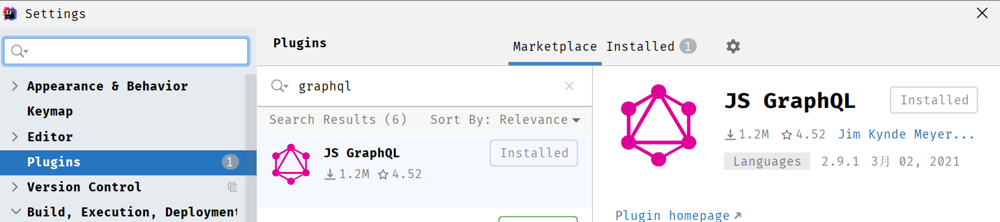


```
schema {
    query: UserQuery
}

type UserQuery{
    user(id:ID): User
}

type User{
    id: ID!
    name: String
    age: Int
}
```

#### Java API实现

##### 按需返回

```java
public class GraphQLDemo {
    public static void main(String[] args) {
        /**
         * 定义User对象类型
         * type User { #定义对象
         *  id:Long! # !表示该属性是非空项
         *  name:String
         *  age:Int
         * }
         * @return
         */
        GraphQLObjectType userType = newObject()
            .name("User")
            .field(newFieldDefinition().name("id").type(GraphQLLong))
            .field(newFieldDefinition().name("name").type(GraphQLString))
            .field(newFieldDefinition().name("age").type(GraphQLInt))
            .build();

        /**
         * 定义查询的类型
         * type UserQuery { #定义查询的类型
         *  user : User #指定对象
         * }
         * @return
         */
        GraphQLObjectType userQuery = newObject()
            .name("userQuery")
            .field(newFieldDefinition()
                   .name("user")
                   .type(userType)
                   .dataFetcher(new StaticDataFetcher(new User(1L,"张三",20)))
                  )
            .build();

        /**
         * 定义Schema
         * schema { #定义查询
         *  query: UserQuery
         * }
         * @return
         */
        GraphQLSchema graphQLSchema = GraphQLSchema.newSchema()
            .query(userQuery)
            .build();

        //构建GraphQL查询器
        GraphQL graphQL = GraphQL.newGraphQL(graphQLSchema).build();

        //查询结果
        String query = "{user{id,name}}";
        ExecutionResult executionResult = graphQL.execute(query);

        // 打印错误
        System.out.println("错误：" + executionResult.getErrors());
        // 打印数据
        System.out.println("结果：" +(Object) executionResult.toSpecification());
    }
}
```

##### 查询参数的设置


```java
public class GraphQLDemo {
    public static void main(String[] args) {
        /**
         * 定义User对象类型
         * type User { #定义对象
         *  id:Long! # !表示该属性是非空项
         *  name:String
         *  age:Int
         * }
         * @return
         */
        GraphQLObjectType userType = newObject()
            .name("User")
            .field(newFieldDefinition().name("id").type(GraphQLLong))
            .field(newFieldDefinition().name("name").type(GraphQLString))
            .field(newFieldDefinition().name("age").type(GraphQLInt))
            .build();

        /**
         * 定义查询的类型
         * type UserQuery { #定义查询的类型
         *  user : User #指定对象
         * }
         * @return
         */
        GraphQLObjectType userQuery = newObject()
            .name("userQuery")
            .field(newFieldDefinition()
                   .name("user")
                   .argument(GraphQLArgument.newArgument()
                            .name("id")
                             .type("GraphQLLong")
                            )
                   .type(userType)
                   .dataFetcher(
                       Environment->{
                            Long id = Environment.getArgument("id");
                            //查询数据库
                            //TODO
                            return new User(id,"张三",id.intValue()+10);
                        })
                  )
            .build();

        /**
         * 定义Schema
         * schema { #定义查询
         *  query: UserQuery
         * }
         * @return
         */
        GraphQLSchema graphQLSchema = GraphQLSchema.newSchema()
            .query(userQuery)
            .build();

        //构建GraphQL查询器
        GraphQL graphQL = GraphQL.newGraphQL(graphQLSchema).build();

        //查询结果
        String query = "{user(id:100){id,name,age}}";
        ExecutionResult executionResult = graphQL.execute(query);

        // 打印错误
        System.out.println("错误：" + executionResult.getErrors());
        // 打印数据
        System.out.println("结果：" +(Object) executionResult.toSpecification());
    }
}
```

#### 3. SDL构建Schema

>   SDL通过插件将GraphQL定义文件转换为java

```graphql
schema {
    query: UserQuery
}

type UserQuery{
    user(id:ID): User
}

type User{
    id: ID!
    name: String
    age: Int
    card: Card
}

type Card {
    cardNumber:String!
    userId: ID
}
```

```java
public class GraphQLSDLDemo {
    public static void main(String[] args) throws IOException {
        /* 1. 读取资源，进行解析 */
        //资源名
        String fileName = "user.graphql";
        /*
        <dependency>
            <groupId>org.apache.commons</groupId>
            <artifactId>commons-lang3</artifactId>
        </dependency>
        * */
        String fileContent = IOUtils.toString(GraphQLSDLDemo.class.getClassLoader().getResource(fileName),"UTF-8");
        TypeDefinitionRegistry tyRegistry = new SchemaParser().parse(fileContent);

        /* 2. 数据查询 */
        RuntimeWiring wiring = RuntimeWiring.newRuntimeWiring()
                .type("UserQuery",builder ->
                        builder.dataFetcher("user", Environment->{
                            Long id = Long.parseLong(Environment.getArgument("id"));
                            Card card = new Card("number_"+id,id);

                            return new User(id,"张三_"+id,id.intValue()+10,card);
                        })
                )
                .build();

        /* 3. 生成schema */
        GraphQLSchema graphQLSchema = new SchemaGenerator().makeExecutableSchema(tyRegistry,wiring);

        /* 4. 根据schema对象生成GraphQL对象 */
        GraphQL graphQL = GraphQL.newGraphQL(graphQLSchema).build();

        String query = "{user(id:100){id,name,age,card{cardNumber}}}";
        ExecutionResult executionResult = graphQL.execute(query);

        System.out.println(executionResult.toSpecification());
    }
}
```

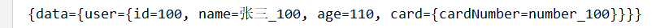

### id查询房源接口

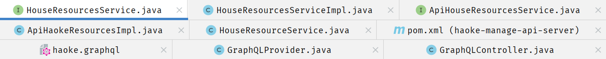

#### dubbo服务提供方

##### HouseResourcesService——Spring服务的Interface

```java
public HouseResources queryHouseResourcesById(Long id);
```

##### HouseResourcesServiceImpl——Spring服务的实现

```java
@Override
public HouseResources queryHouseResourcesById(Long id) {
    return (HouseResources) super.queryById(id);
}
```

##### ApiHouseResourcesService——dubbo服务提供方接口

```java
/*
    * 实现通过id查询 房源
    *
    * @Param id 房源id
    * @return
    * */
HouseResources queryHouseResourcesById(Long id);
```

##### ApiHaokeResourcesImpl——dubbo服务提供方实现

```java
@Override
public HouseResources queryHouseResourcesById(Long id) {
    return houseResourcesService.queryHouseResourcesById(id);
}
```

#### dubbo服务消费方

**HouseResourceService**

```java
    @Reference(version = "${dubbo.service.version}")
    private ApiHouseResourcesService apiHouseResourcesService;

	/*
    * 根据id查询房源数据
    *
    * @Param id
    * @Return
    * */
    public HouseResources queryHouseResourcesById(Long id){
        //调用dubbo服务查询数据

        return this.apiHouseResourcesService.queryHouseResourcesById(id);
    }
```

#### GraphQL接口

##### 导入依赖

```xml
<repositories>
    <repository>
        <snapshots>
            <enabled>false</enabled>
        </snapshots>
        <id>bintray-andimarek-graphql-java</id>
        <name>bintray</name>
        <url>https://dl.bintray.com/andimarek/graphql-java</url>
    </repository>
</repositories>
<!--导入graphql依赖-->
<dependency>
    <groupId>com.graphql-java</groupId>
    <artifactId>graphql-java</artifactId>
    <version>16.0</version>
</dependency>
```

##### GraphQL定义

==haoke.graphql==

```graphql
schema {
    query: HaokeQuery
}

type HaokeQuery{       
	# 通过Id查询房源信息
    HouseResources(id:ID): HouseResources
}

type HouseResources{
    id:ID!
    title:String
    estateId:ID
    buildingNum:String
    buildingUnit:String
    buildingFloorNum:String
    rent:Int
    rentMethod:Int
    paymentMethod:Int
    houseType:String
    coveredArea:String
    useArea:String
    floor:String
    orientation:String
    decoration:Int
    facilities:String
    pic:String
    houseDesc:String
    contact:String
    mobile:String
    time:Int
    propertyCost:String
}
```

##### GraphQL组件

==graphql —— Bean==

```java
@Component//将GraphQL对象注入IoC容器，并完成GraphQL的初始化
public class GraphQLProvider {
    private GraphQL graphQL;

    @Autowired
    private HouseResourceService houseResourceService;

    @PostConstruct//在IoC容器初始化时运行
    public void init() throws FileNotFoundException {
        //导入graphql脚本
        File file = ResourceUtils.getFile("classpath:haoke.graphql");

        //初始化graphql
        this.graphQL = GraphQL.newGraphQL(//schema { query: HaokeQuery}
                new SchemaGenerator().makeExecutableSchema(
                        new SchemaParser().parse(file),//TypeDefinitionRegistry
                        RuntimeWiring.newRuntimeWiring()//RuntimeWiring
                                .type("HaokeQuery",builder ->
                                        builder.dataFetcher("HouseResources", Environment->{
                                            Long id = Long.parseLong(Environment.getArgument("id"));

                                            return this.houseResourceService.queryHouseResourcesById(id);
                                        })
                                        )
                                .build()
                )
        ).build();
    }

    @Bean
    GraphQL graphQL(){
        return this.graphQL;
    }
}
```

##### 暴露接口

```java
@RequestMapping("graphql")
@Controller
public class GraphQLController {

    @Autowired
    private GraphQL graphQL;

    @GetMapping
    @ResponseBody
    public Map<String,Object> graphql(@RequestParam("query")String query){
        return this.graphQL.execute(query).toSpecification();
    }
}
```

#### 测试

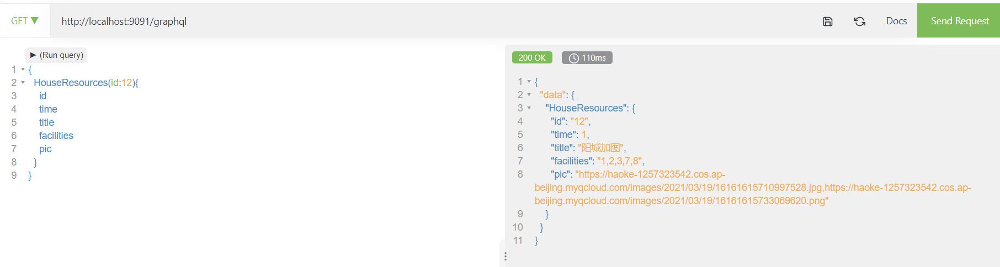

### GraphQL组件获取的优化

#### 问题

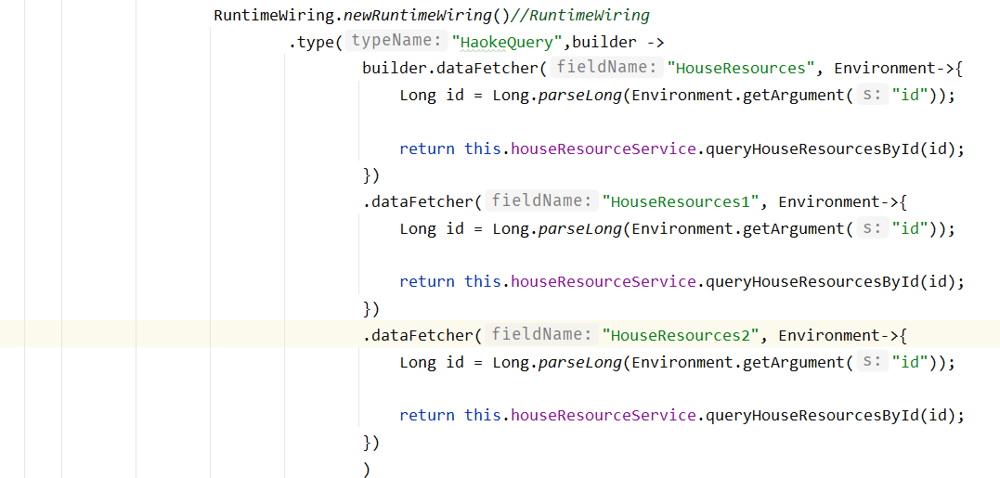

每当增加查询时，都需要修改该方法

>   改进思路

1.  编写接口
2.  所有实现查询的逻辑都实现该接口
3.  在GraphQLProvider中使用该接口的实现类进行处理
4.  以后新增查询逻辑只需增加实现类即可

#### 1. 编写MyDataFetcher接口

```java
package com.haoke.api.graphql;

import graphql.schema.DataFetchingEnvironment;

public interface MyDataFetcher {

    /**
     * 查询名称
     *
     * @return
     */
    String fieldName();

    /**
     * 具体实现数据查询的逻辑
     *
     * @param environment
     * @return
     */
    Object dataFetcher(DataFetchingEnvironment environment);
}
```

#### 2. 实现MyDataFetcher

```java
@Component
public class HouseResourcesDataFetcher implements MyDataFetcher {
    @Autowired
    HouseResourceService houseResourceService;

    @Override
    public String fieldName() {
        return "HouseResources";
    }

    @Override
    public Object dataFetcher(DataFetchingEnvironment environment) {
        Long id = Long.parseLong(environment.getArgument("id"));

        return this.houseResourceService.queryHouseResourcesById(id);
    }
}
```

#### 3. 修改GraphQLProvider

```java
this.graphQL = GraphQL.newGraphQL(
    new SchemaGenerator().makeExecutableSchema(
        new SchemaParser().parse(file),//TypeDefinitionRegistry
        RuntimeWiring.newRuntimeWiring()//RuntimeWiring
        .type("HaokeQuery",builder ->{
            for (MyDataFetcher myDataFetcher : myDataFetchers) {
                builder.dataFetcher(
                    myDataFetcher.fieldName(),
                    Environment->myDataFetcher.dataFetcher(Environment)
                 );
            }
            return builder;
        }
     )
     .build()
)
```

## 房源接口(GraphQL)

### 首页轮播广告

#### 1. 数据结构

请求地址：


响应：

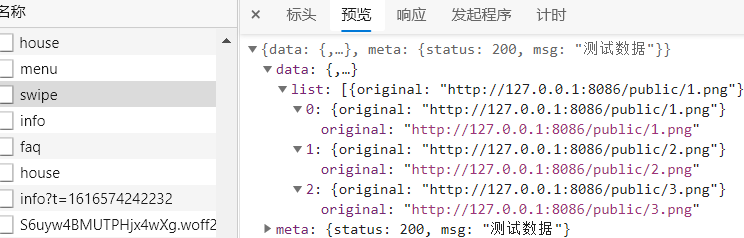

所以，数据只需要返回图片链接即可

#### 2. 数据表设计

```sql
use haoke;

CREATE TABLE `tb_ad` (
`id` bigint(20) NOT NULL AUTO_INCREMENT,
`type` int(10) DEFAULT NULL COMMENT '广告类型',
`title` varchar(100) DEFAULT NULL COMMENT '描述',
`url` varchar(200) DEFAULT NULL COMMENT '图片URL地址',
`created` datetime DEFAULT NULL,
`updated` datetime DEFAULT NULL,
PRIMARY KEY (`id`)
) ENGINE=InnoDB DEFAULT CHARSET=utf8 COMMENT='广告表';

INSERT INTO `tb_ad` (`id`, `type`, `title`, `url`, `created`, `updated`) VALUES (
'1','1', 'UniCity万科天空之城', 
'https://haoke-1257323542.cos.ap-beijing.myqcloud.com/ad-swipes/1.jpg', 
'2021-3-24 16:36:11','2021-3-24 16:36:16');
INSERT INTO `tb_ad` (`id`, `type`, `title`, `url`, `created`, `updated`) VALUES (
'2','1', '天和尚海庭前',
'https://haoke-1257323542.cos.ap-beijing.myqcloud.com/ad-swipes/2.jpg', 
'2021-3-24 16:36:43','2021-3-24 16:36:37');
INSERT INTO `tb_ad` (`id`, `type`, `title`, `url`, `created`, `updated`) VALUES (
'3', '1', '[奉贤 南桥] 光语著', 
'https://haoke-1257323542.cos.ap-beijing.myqcloud.com/ad-swipes/3.jpg', 
'2021-3-24 16:38:32','2021-3-24 16:38:26');
INSERT INTO `tb_ad` (`id`, `type`, `title`, `url`, `created`, `updated`) VALUES (
'4','1', '[上海周边 嘉兴] 融创海逸长洲', 
'https://haoke-1257323542.cos.ap-beijing.myqcloud.com/ad-swipes/4.jpg', 
'2021-3-24 16:39:10','2021-3-24 16:39:13');
```

#### 3. 实现查询接口

==dubbo服务提供方==

##### 1. 创建工程

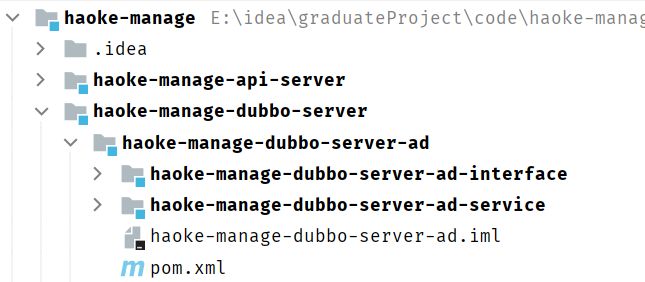

```xml
<!--haoke-manage-dubbo-server-ad-interface-->
<dependencies>
    <dependency>
        <groupId>com.haoke.manage</groupId>
        <artifactId>haoke-manage-dubbo-server-common</artifactId>
        <version>1.0-SNAPSHOT</version>
    </dependency>
</dependencies>
```

```xml
<!--haoke-manage-dubbo-server-ad-service-->
<dependencies>
    <dependency>
        <groupId>com.haoke.manage</groupId>
        <artifactId>haoke-manage-dubbo-server-ad-interface</artifactId>
        <version>1.0-SNAPSHOT</version>
    </dependency>
</dependencies>
```

##### 2.appplication.properties

```properties
# Spring boot application
spring.application.name = haoke-manage-dubbo-server-ad

# 数据库
spring.datasource.driver-class-name=com.mysql.cj.jdbc.Driver
spring.datasource.url=jdbc:mysql://8.140.130.91:3306/myhome\
  ?characterEncoding=utf8&useSSL=false&serverTimezone=UTC&autoReconnect=true&allowMultiQueries=true
spring.datasource.username=root
spring.datasource.password=root

# hikari设置
spring.datasource.hikari.maximum-pool-size=60
spring.datasource.hikari.idle-timeout=60000
spring.datasource.hikari.connection-timeout=60000
spring.datasource.hikari.validation-timeout=3000
spring.datasource.hikari.login-timeout=5
spring.datasource.hikari.max-lifetime=60000

# 服务的扫描包
dubbo.scan.basePackages = com.haoke.server.api

# 应用名称
dubbo.application.name = dubbo-provider-ad
dubbo.service.version = 1.0.0

# 协议以及端口
dubbo.protocol.name = dubbo
dubbo.protocol.port = 21880
# zk注册中心
dubbo.registry.address = zookeeper://8.140.130.91:2181
dubbo.registry.client = zkclient
```

##### 3.Dao层

###### POJO

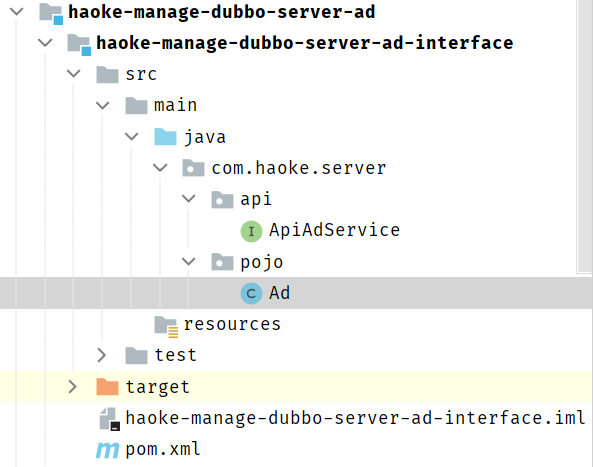

```java
@Data
@TableName("tb_ad")
public class Ad extends BasePojo{
    private static final long serialVersionUID = -493439243433085768L;
    
    @TableId(value = "id", type = IdType.AUTO)
    private Long id;

    //广告类型
    private Integer type;
    //描述
    private String title;
    //'图片URL地址
    private String url;
}
```

```java
package com.haoke.server.api;

import com.haoke.server.pojo.Ad;
import com.haoke.server.vo.PageInfo;

public interface ApiAdService {
    /**
     * 分页查询广告数据
     *
     * @param type 广告类型
     * @param page 页数
     * @param pageSize 每页显示的数据条数
     * @return
     */
    PageInfo<Ad> queryAdList(Integer type, Integer page, Integer pageSize);
}
```

###### AdMapper

```java
package com.haoke.server.mapper;

import com.baomidou.mybatisplus.core.mapper.BaseMapper;
import com.haoke.server.pojo.Ad;

public interface AdMapper extends BaseMapper<Ad> {}
```

###### MybatisPlusConfig

分页配置

```java
package com.haoke.server.config;

import com.baomidou.mybatisplus.annotation.DbType;
import com.baomidou.mybatisplus.extension.plugins.MybatisPlusInterceptor;
import com.baomidou.mybatisplus.extension.plugins.PaginationInterceptor;
import com.baomidou.mybatisplus.extension.plugins.inner.PaginationInnerInterceptor;
import org.mybatis.spring.annotation.MapperScan;
import org.springframework.context.annotation.Bean;
import org.springframework.context.annotation.Configuration;

@MapperScan("com.haoke.server.mapper")
@Configuration
public class MybatisPlusConfig {

    @Bean
    public MybatisPlusInterceptor mybatisPlusInterceptor() {
        MybatisPlusInterceptor interceptor = new MybatisPlusInterceptor();

        PaginationInnerInterceptor paginationInnerInterceptor = new PaginationInnerInterceptor();
        paginationInnerInterceptor.setDbType(DbType.MYSQL);

        interceptor.addInnerInterceptor(paginationInnerInterceptor);

        return interceptor;
    }
}
```

##### 4.Service层

实现业务

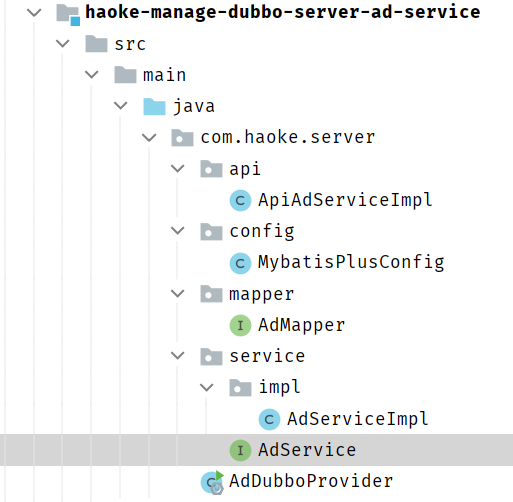

编写接口：

```java
package com.haoke.server.service;

import com.haoke.server.pojo.Ad;
import com.haoke.server.vo.PageInfo;

public interface AdService {
    PageInfo<Ad> queryAdList(Ad ad, Integer page, Integer pageSize);
}
```

实现接口：

```java
package com.haoke.server.service.impl;

import com.baomidou.mybatisplus.core.conditions.query.QueryWrapper;
import com.baomidou.mybatisplus.core.metadata.IPage;
import com.haoke.server.pojo.Ad;
import com.haoke.server.service.AdService;
import com.haoke.server.service.BaseServiceImpl;
import com.haoke.server.vo.PageInfo;
import org.springframework.stereotype.Service;

@Service
public class AdServiceImpl extends BaseServiceImpl implements AdService {
    @Override
    public PageInfo<Ad> queryAdList(Ad ad, Integer page, Integer pageSize) {
        QueryWrapper queryWrapper = new QueryWrapper();

        //排序
        queryWrapper.orderByDesc("updated");
        //按广告的类型查询
        queryWrapper.eq("type",ad.getType());

        IPage iPage = super.queryPageList(queryWrapper,page,pageSize);

        return new PageInfo<>(Long.valueOf(iPage.getTotal()).intValue(),page,pageSize,iPage.getRecords());
    }
}
```

##### 5.dubbo服务实现类

```java
package com.haoke.server.api;

import com.haoke.server.pojo.Ad;
import com.haoke.server.vo.PageInfo;

public interface ApiAdService {
    /**
     * 分页查询广告数据
     *
     * @param type 广告类型
     * @param page 页数
     * @param pageSize 每页显示的数据条数
     * @return
     */
    PageInfo<Ad> queryAdList(Integer type, Integer page, Integer pageSize);
}
```

```java
package com.haoke.server.api;

import com.alibaba.dubbo.config.annotation.Service;
import com.haoke.server.pojo.Ad;
import com.haoke.server.service.AdService;
import com.haoke.server.vo.PageInfo;
import org.springframework.beans.factory.annotation.Autowired;

@Service(version = "${dubbo.service.version}")
public class ApiAdServiceImpl implements ApiAdService{
    @Autowired
    private AdService adService;

    @Override
    public PageInfo<Ad> queryAdList(Integer type, Integer page, Integer pageSize) {
        Ad ad = new Ad();
        ad.setType(type);

        return this.adService.queryAdList(ad,page,pageSize);
    }
}
```

##### 6.编写启动类

```java
package com.haoke.server;

import org.springframework.boot.WebApplicationType;
import org.springframework.boot.autoconfigure.SpringBootApplication;
import org.springframework.boot.builder.SpringApplicationBuilder;

@SpringBootApplication
public class AdDubboProvider {

    public static void main(String[] args) {
        new SpringApplicationBuilder(AdDubboProvider.class)
                .web(WebApplicationType.NONE)//非web应用
                .run(args);
    }
}
```

#### 4.API实现(RESTful接口)

##### 1. 导入依赖

```xml
<!--ad依赖-->
<dependency>
    <groupId>com.haoke.manage</groupId>
    <artifactId>haoke-manage-dubbo-server-ad-interface</artifactId>
    <version>1.0-SNAPSHOT</version>
</dependency>
```

##### 2. 编写WebResult

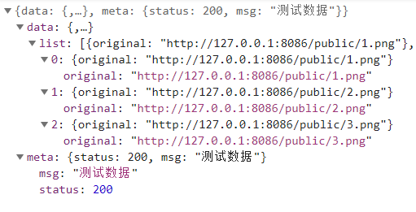

```java
package com.haoke.api.vo;

import com.fasterxml.jackson.annotation.JsonIgnore;
import lombok.AllArgsConstructor;
import lombok.Data;

import java.util.HashMap;
import java.util.List;
import java.util.Map;

@Data
@AllArgsConstructor
public class WebResult {

    @JsonIgnore
    private int status;
    @JsonIgnore
    private String msg;
    @JsonIgnore
    private List<?> list;

    @JsonIgnore
    public static WebResult ok(List<?> list) {
        return new WebResult(200, "成功", list);
    }

    @JsonIgnore
    public static WebResult ok(List<?> list, String msg) {
        return new WebResult(200, msg, list);
    }

    public Map<String, Object> getData() {
        HashMap<String, Object> data = new HashMap<String, Object>();
        data.put("list", this.list);
        return data;
    }

    public Map<String, Object> getMeta() {
        HashMap<String, Object> meta = new HashMap<String, Object>();
        meta.put("msg", this.msg);
        meta.put("status", this.status);
        return meta;
    }
}
```

##### 3.编写Service

```java
package com.haoke.api.service;

import com.alibaba.dubbo.config.annotation.Reference;
import com.haoke.api.vo.WebResult;
import com.haoke.server.api.ApiAdService;
import com.haoke.server.pojo.Ad;
import com.haoke.server.vo.PageInfo;
import org.springframework.stereotype.Service;

import java.util.ArrayList;
import java.util.HashMap;
import java.util.List;
import java.util.Map;

@Service
public class AdService {

    @Reference(version = "1.0.0")
    private ApiAdService apiAdService;

    public PageInfo<Ad> queryAdList(Integer type, Integer page, Integer pageSize) {

        return this.apiAdService.queryAdList(type, page, pageSize);
    }
}
```

##### 4.Controller

```java
package com.haoke.api.controller;

import com.haoke.api.service.AdService;
import com.haoke.api.vo.WebResult;
import com.haoke.server.pojo.Ad;
import com.haoke.server.vo.PageInfo;
import org.springframework.beans.factory.annotation.Autowired;
import org.springframework.web.bind.annotation.CrossOrigin;
import org.springframework.web.bind.annotation.GetMapping;
import org.springframework.web.bind.annotation.RequestMapping;
import org.springframework.web.bind.annotation.RestController;

import java.util.ArrayList;
import java.util.HashMap;
import java.util.List;
import java.util.Map;

@RequestMapping("ad")
@RestController
@CrossOrigin//允许跨域
public class AdController {
    @Autowired
    private AdService adService;

    /**
     * 首页广告位
     * @return
     */
    @GetMapping
    public WebResult queryIndexad(){
        PageInfo<Ad> pageInfo = this.adService.queryAdList(1,1,3);

        List<Ad> ads = pageInfo.getRecords();
        List<Map<String,Object>> data = new ArrayList<>();
        for (Ad ad : ads) {
            Map<String,Object> map = new HashMap<>();

            map.put("original",ad.getUrl());
            data.add(map);
        }

        return WebResult.ok(data);
    }
}
```

##### 测试


#### 5. 整合前端系统

修改home.js文件中请求地址

```js
let swipe = new Promise((resolve, reject) => {
    axios.get('http://127.0.0.1:9091/ad').then((data)=>{
        resolve(data.data.list);
    });
})
```


跨域问题：


#### 6. 广告的GraphQL接口

##### 1. 目标数据结构

```js
{
    "list": [
        {
            "original": "http://itcast-haoke.oss-cnqingdao.aliyuncs.com/images/2018/11/26/15432030275359146.jpg"
        },
        {
            "original": "http://itcast-haoke.oss-cnqingdao.aliyuncs.com/images/2018/11/26/15432029946721854.jpg"
        },
        {
            "original": "http://itcast-haoke.oss-cnqingdao.aliyuncs.com/images/2018/11/26/1543202958579877.jpg"
        }
    ]
}
```

##### 2. graphql定义语句

```graphql
type HaokeQuery{
    #分页查询房源信息-应用于前台房源信息
    HouseResourcesList(page:Int, pageSize:Int):TableResult
    # 通过Id查询房源信息
    HouseResources(id:ID): HouseResources

    #首页广告图-应用于前台首页
    IndexAdList: IndexAdResult
}

type IndexAdResult{
    list:[IndexAdResultData]
}

type IndexAdResultData{
    original: String
}
```

##### 3. 根据GraphQL结构编写VO

```java
package com.haoke.api.vo.ad.index;

import lombok.AllArgsConstructor;
import lombok.Data;
import lombok.NoArgsConstructor;

import java.util.List;

@Data
@AllArgsConstructor
@NoArgsConstructor
public class IndexAdResult {
    private List<IndexAdResultData> list;
}
```

```java
package com.haoke.api.vo.ad.index;

import lombok.AllArgsConstructor;
import lombok.Data;
import lombok.NoArgsConstructor;

@Data
@AllArgsConstructor
@NoArgsConstructor
public class IndexAdResultData {
    private String original;
}
```

##### 4. IndexAdDataFetcher

```java
package com.haoke.api.graphql.myDataFetcherImpl;

import com.haoke.api.graphql.MyDataFetcher;
import com.haoke.api.service.AdService;
import com.haoke.api.vo.WebResult;
import com.haoke.api.vo.ad.index.IndexAdResult;
import com.haoke.api.vo.ad.index.IndexAdResultData;
import com.haoke.server.pojo.Ad;
import com.haoke.server.vo.PageInfo;
import graphql.schema.DataFetchingEnvironment;
import org.springframework.beans.factory.annotation.Autowired;
import org.springframework.stereotype.Component;

import java.util.ArrayList;
import java.util.List;

@Component
public class IndexAdDataFetcher implements MyDataFetcher {

    @Autowired
    private AdService adService;

    @Override
    public String fieldName() {
        return "IndexAdList";
    }

    @Override
    public Object dataFetcher(DataFetchingEnvironment environment) {
        PageInfo<Ad> pageInfo = this.adService.queryAdList(1, 1, 3);

        List<Ad> ads = pageInfo.getRecords();

        List<IndexAdResultData> list = new ArrayList<>();
        for (Ad ad : ads) {
            list.add(new IndexAdResultData(ad.getUrl()));
        }

        return new IndexAdResult(list);
    }
}
```

##### 5. 测试

```graphql
{
 	IndexAdList{
    list{
      original
    }
  }
}
```


#### 7. GraphQL客户端


参考文档：https://www.apollographql.com/docs/react/get-started/

##### 1. 安装依赖

```shell
npm install @apollo/client graphql
```

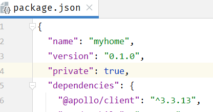

##### 2. 创建客户端

```js
import { ApolloClient, gql } from '@apollo/client';

const client = new ApolloClient({
  uri: 'http://127.0.0.1:9091/graphql',
});
```

##### 3. 定义查询

```js
//定义查询
const GET_INDEX_ADS = gql`
{
IndexAdList{
list{
original
}
}
}
`;

let swipe = new Promise((resolve, reject) => {
    client.query({query: GET_INDEX_ADS}).then(result =>
                                              resolve(result.data.IndexAdList.list));
})
```

##### 4. 测试

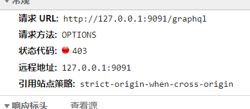

两个问题：

1.  GraphQL服务没有支持cross,Controller上标注@CrossOrigin
2.  Apollo Client发起的数据请求为POST请求，现在实现的GraphQL仅仅实现了GET请求处理

```java
package com.haoke.api.controller;

import com.fasterxml.jackson.databind.JsonNode;
import com.fasterxml.jackson.databind.ObjectMapper;
import graphql.GraphQL;
import org.springframework.beans.factory.annotation.Autowired;
import org.springframework.stereotype.Controller;
import org.springframework.web.bind.annotation.*;

import java.io.IOException;
import java.util.HashMap;
import java.util.Map;

@RequestMapping("graphql")
@Controller
@CrossOrigin//添加跨域
public class GraphQLController {

    @Autowired
    private GraphQL graphQL;

    private static final ObjectMapper MAPPER = new ObjectMapper();

    @GetMapping
    @ResponseBody
    public Map<String,Object> graphql(@RequestParam("query")String query){
        return this.graphQL.execute(query).toSpecification();
    }

    @PostMapping
    @ResponseBody
    public Map<String, Object> postGraphql(@RequestBody String json) throws IOException {

        try {
            JsonNode jsonNode = MAPPER.readTree(json);
            if(jsonNode.has("query")){
                String query = jsonNode.get("query").asText();
                return this.graphQL.execute(query).toSpecification();
            }
        }catch (IOException e){
            e.printStackTrace();
        }

    Map<String,Object> error = new HashMap<>();
        error.put("status",500);
        error.put("msg","查询出错");
        return error;
    }
}
```

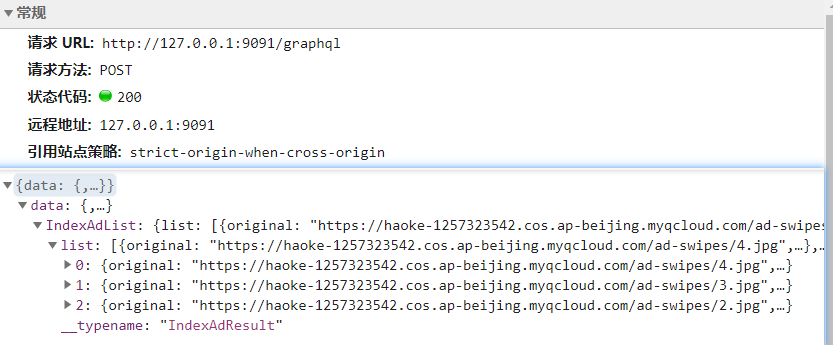

### 房源信息列表

#### 1. 查询语句定义

**haoke.graphql**

```
schema {
    query: HaokeQuery
}

type HaokeQuery{
    #分页查询房源信息-应用于前台房源信息
    HouseResourcesList(page:Int, pageSize:Int):TableResult
    # 通过Id查询房源信息
    HouseResources(id:ID): HouseResources

    #首页广告图-应用于前台首页
    IndexAdList: IndexAdResult
}

type HouseResources{
    id:ID!
    title:String
    estateId:ID
    buildingNum:String
    buildingUnit:String
    buildingFloorNum:String
    rent:Int
    rentMethod:Int
    paymentMethod:Int
    houseType:String
    coveredArea:String
    useArea:String
    floor:String
    orientation:String
    decoration:Int
    facilities:String
    pic:String
    houseDesc:String
    contact:String
    mobile:String
    time:Int
    propertyCost:String
}

type TableResult{
    list: [HouseResources]
    pagination: Pagination
}

type Pagination{
    current:Int
    pageSize:Int
    total:Int
}
```

#### 2.DataFetcher

**HouseResourcesListDataFetcher**

```java
@Component
public class HouseResourcesListDataFetcher implements MyDataFetcher {

    @Autowired
    HouseResourceService houseResourceService;

    @Override
    public String fieldName() {
        return "HouseResourcesList";
    }

    @Override
    public Object dataFetcher(DataFetchingEnvironment environment) {
        Integer page = environment.getArgument("page");
        if(page == null){
            page = 1;
        }

        Integer pageSize = environment.getArgument("pageSize");
        if(pageSize == null){
            pageSize = 5;
        }
        return this.houseResourceService.queryList(null, page, pageSize);
    }
}
```


#### 3.GraphQL参数

问题分析：上述 `首页轮播广告查询接口` 中的参数是固定的


实际应用中要实现根据前端的请求参数设置参数查询

https://graphql.cn/learn/queries/#variables

一种办法使直接将参数动态的设置到请求体(POST)或URL(GET)中，缺点就是可以直接通过修改查询字符串来自行获取数据。

GraphQL 拥有一级方法将动态值提取到查询之外，然后作为分离的字典传进去。这些动态值即称为**变量**。

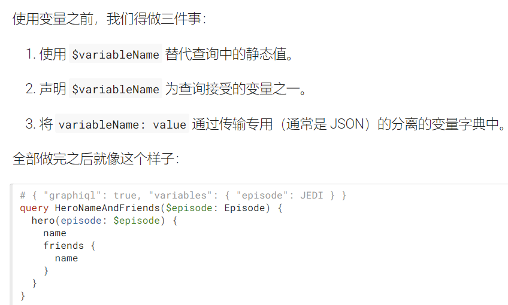

#### 前台系统发送的参数分析

```graphql
query hk($id:ID){
 	HouseResources(id:$id){
    id
    title
  }
}
```


GraphQL发送的数据如上，后端需处理请求并返回相应的数据

#### 4. 后端处理参数


由GraphQL的调用流程可知，传入到后端的GraphQL字符串最终会被构造成一个 `ExecutionInput` 对象


**GraphQLController**

```java
package com.haoke.api.controller;

@RequestMapping("graphql")
@Controller
@CrossOrigin//添加跨域
public class GraphQLController {

    @Autowired
    private GraphQL graphQL;

    private static final ObjectMapper MAPPER = new ObjectMapper();

    @GetMapping
    @ResponseBody
    public Map<String,Object> graphql(@RequestParam("query")String query,
                                      @RequestParam(value = "variables",required = false) String variablesJSON,
                                      @RequestParam(value = "operationName",required = false) String operationName){

        try {
            //反序列化，将JSON字符串转化为Map对象
            Map<String, Object> variables = MAPPER.readValue(variablesJSON, MAPPER.getTypeFactory().constructMapType(HashMap.class,String.class,Object.class));

            return this.executeGraphQLQuery(query,operationName,variables);
        } catch (JsonProcessingException e) {
            e.printStackTrace();
        }

        Map<String,Object> error = new HashMap<>();
        error.put("status",500);
        error.put("msg","查询出错");
        return error;
    }

    @PostMapping
    @ResponseBody
    public Map<String, Object> postGraphql(@RequestBody Map<String,Object> map) throws IOException {

        try{
            String query = (String) map.get("query");
            if(null == query){
                query = "";
            }
            String operationName = (String) map.get("operationName");
            if(null == operationName){
                operationName = "";
            }
            Map variables = (Map) map.get("variables");
            if(variables == null){
                variables = Collections.EMPTY_MAP;
            }

            return this.executeGraphQLQuery(query,operationName,variables);
        } catch (Exception e) {
            e.printStackTrace();
        }

        Map<String,Object> error = new HashMap<>();
        error.put("status",500);
        error.put("msg","查询出错");
        return error;
    }

    private Map<String, Object> executeGraphQLQuery(String query,String operationName,Map<String,Object> variables) {

        return this.graphQL.execute(
                ExecutionInput.newExecutionInput()
                        .query(query)
                        .variables(variables)
                        .operationName(operationName)
                        .build()
        ).toSpecification();
    }
}
```

#### 5. 查询字符串

```graphql
query HouseResourcesList($pageSize: Int, $page: Int) {
  HouseResourcesList(pageSize: $pageSize, page: $page) {
    list {
      id
      title
      pic
      title
      coveredArea
      orientation
      floor
      rent
    }
  }
}

{
	"pageSize":2,
	"page":1
}
```


#### 6. 改造list.js页面

```jsx
import React from 'react';
import { withRouter } from 'react-router';
import { Icon,Item } from 'semantic-ui-react';
import config from '../../common.js';
import { ApolloClient, gql , InMemoryCache} from '@apollo/client';

const client = new ApolloClient({
  uri: 'http://127.0.0.1:9091/graphql',
  cache: new InMemoryCache()
});

//定义查询
const QUERY_LIST = gql`
  query HouseResourcesList($pageSize: Int, $page: Int) {
    HouseResourcesList(pageSize: $pageSize, page: $page) {
      list {
        id
        title
        pic
        title
        coveredArea
        orientation
        floor
        rent
      }
    }
  }
`;

class HouseList extends React.Component {
  constructor(props) {
    super(props);
    this.state = {
      listData: [],
      typeName: '',
      type: null,
      loadFlag: false
    };
  }

  goBack = () => {
    console.log(this.props.history)
    this.props.history.goBack();
  }
  componentDidMount = () => {
    const {query} = this.props.location.state;
    this.setState({
      typeName: query.name,
      type: query.type
    })
    /*axios.post('/homes/list',{
      home_type: query.type
    }).then(ret=>{
      this.setState({
        listData: ret.data,
        loadFlag: true
      })
    })*/
    client.query({query:QUERY_LIST,variables:{"pageSize":2,"page":1}}).then(result=>{
      console.log(result)
      this.setState({
        listData: result.data.HouseResourcesList.list,
        loadFlag: true
      })
    })
  }
  render() {
    let list = null;
    if(this.state.loadFlag) {
      list = this.state.listData.map(item=>{
        return (
            <Item key={item.id}>
              <Item.Image src={item.pic.split(',')[0]}/>
              <Item.Content>
                <Item.Header>{item.title}</Item.Header>
                <Item.Meta>
                  <span className='cinema'>{item.coveredArea} ㎡/{item.orientation}/{item.floor}</span>
                </Item.Meta>
                <Item.Description>
                  上海
                </Item.Description>
                <Item.Description>{item.rent}</Item.Description>
              </Item.Content>
            </Item>
        )
      });
    }
    return ( 
      <div className = 'house-list' >
        <div className = "house-list-title">
          <Icon onClick={this.goBack} name = 'angle left' size = 'large'/>{this.state.typeName} 
        </div> 
        <div className = "house-list-content">
          <Item.Group divided unstackable>
            {list}
          </Item.Group>
        </div>
      </div>
    );
  }
}
export default withRouter(HouseList);
```


### 更新房源数据


#### 1. Controller

>   haoke-manage-api-server

```java
/**
 * 修改房源
 *
 * @param houseResources json数据
 * @return
 */
@PutMapping
@ResponseBody
public ResponseEntity<Void> update(@RequestBody HouseResources houseResources) {
    try {
        boolean bool = this.houseResourceService.update(houseResources);
        if (bool) {
            return ResponseEntity.status(HttpStatus.NO_CONTENT).build();
        }
    } catch (Exception e) {
        e.printStackTrace();
    }
    return ResponseEntity.status(HttpStatus.INTERNAL_SERVER_ERROR).build();
}
```

#### 2. Service

>   haoke-manage-api-server

```java
public boolean update(HouseResources houseResources) {
    return this.apiHouseResourcesService.updateHouseResources(houseResources);
}
```

#### 3. 修改dubbo服务

>   haoke-manage-dubbo-server-house-resources-interface

**ApiHouserResourcesService**

```java
/**
 * 修改房源
 *
 * @param houseResources
 * @return
 */
boolean updateHouseResources(HouseResources houseResources);
```

**实现类ApiHouseResourcesServiceImpl**

```java
/**
 * 修改房源
 *
 * @param houseResources
 * @return
 */
@Override
public boolean updateHouseResources(HouseResources houseResources) {
    return this.houseResourcesService.updateHouseResources(houseResources);
}
```

**修改业务Service:HouseResourcesServiceImpl**

```java
@Override
public boolean updateHouseResources(HouseResources houseResources) {
    return super.update(houseResources)==1;
}
```

**BaseServiceImpl**

```java
/**
  * 更新数据
  * @param record
  * @return
  */
public Integer update(T record) {
    record.setUpdated(new Date());
    return this.mapper.updateById(record);
}
```

#### 编写后台页面

##### 1. 修改房源列表页

```jsx
render: (text, record) => (
    <Fragment>
        <a onClick={() => this.handleUpdateModalVisible(true, record)}>查看</a>
        <Divider type="vertical" />
        {/* 弹窗组件 */}
        <EditResource record={record} reload={this.reload.bind(this)} />
        <Divider type="vertical" />
        <a href="">删除</a>
    </Fragment>
),
    
  reload(){// 刷新当前页面
    const { dispatch } = this.props;
    dispatch({
      type: 'houseResource/fetch'
    });
  }
```

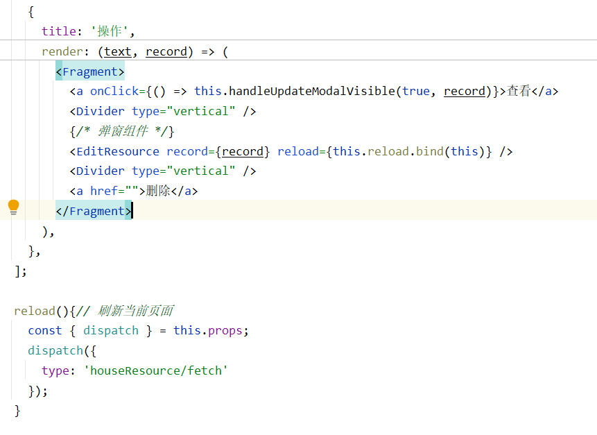

##### 2. EditResource.js

```jsx
import React from 'react';
import {Card, Checkbox, Form, Input, Modal, Select} from "antd";
import {connect} from "dva";
import PicturesWall from "../Utils/PicturesWall";

const FormItem = Form.Item;
const InputGroup = Input.Group;
const CheckboxGroup = Checkbox.Group;
const { TextArea } = Input;

const formItemLayout = {
  labelCol: {
    xs: { span: 24 },
    sm: { span: 7 },
  },
  wrapperCol: {
    xs: { span: 24 },
    sm: { span: 12 },
    md: { span: 10 },
  },
};

const paymentMethod = [
  "",
  "付一押一",
  "付三押一",
  "付六押一",
  "年付押一",
  "其他"
]

const decoration = [
  "",
  "精装",
  "简装",
  "毛坯"
]

const rentMethod = [
  "",
  "整租",
  "合租"
]

const time = [
  "",
  "上午",
  "中午",
  "下午",
  "晚上",
  "全天"
]

const facilities = [
  "",
  "水",
  "电",
  "煤气/天然气",
  "暖气",
  "有线电视",
  "宽带",
  "电梯",
  "车位/车库",
  "地下室/储藏室"
]

function isChinese(temp){
  const re=/^[\u3220-\uFA29]+$/;
  if (re.test(temp))
    return true ;
  return false;
}

@connect()
@Form.create()/* 只有标注了 @Form.create() Form中的元素才可被封装 */
class EditResource extends React.Component{

  constructor(props){
    super(props);
    console.log("====传来的信息=====")
    console.log(this.props.record)
    this.state={
      visible:false,
      pics:new Set()
    };
  }

  /* 显示编辑弹窗 */
  showModal = () => {
    this.setState({
      visible: true
    });
  };

  /* 隐藏编辑弹窗 */
  handleCancel = () => {
    this.setState({
      visible: false,
    });
  };

  handleSave = () => {

    const { dispatch, form, record } = this.props;
    form.validateFieldsAndScroll((err, values) => {

      if (!err) {
        // 房源id
        values.id = record.id;

        // 看房时间
        if(isChinese(values.time)){
          for (let i = 1; i < time.length; i++) {
            if(time[i]==values.time)
              values.time=i;
          }
        }

        // 支付方式
        if(isChinese(values.paymentMethod)){
          for (let i = 1; i < paymentMethod.length; i++) {
            if(paymentMethod[i]==values.paymentMethod)
              values.paymentMethod=i;
          }
        }

        // rentMethod
        if(isChinese(values.rentMethod)){
          for (let i = 1; i < rentMethod.length; i++) {
            if(rentMethod[i]==values.rentMethod)
              values.rentMethod=i;
          }
        }

        // decoration
        if(isChinese(values.decoration)){
          for (let i = 1; i < decoration.length; i++) {
            if(decoration[i]==values.decoration)
              values.decoration=i;
          }
        }

        if(values.floor_1 && values.floor_2){
          values.floor = `${values.floor_1  }/${  values.floor_2}`;
        }

        // 周边设施
        if(values.facilities){
          values.facilities = values.facilities.join(",");
        }

        // 楼栋信息
        values.buildingNum = record.buildingNum;
        values.buildingUnit = record.buildingUnit;
        values.buildingFloorNum = record.buildingFloorNum;
        delete values.building;

        // 照片
        if(this.state.pics.size > 0){
          values.pic = [...this.state.pics].join(',');
        }else{
          values.pic = record.pic;
        }


        console.log("====提交的信息=====")
        console.log(values)
        dispatch({
          type: 'house/updateHouseForm',
          payload: values,
        });

        setTimeout(()=>{
          this.handleCancel();
          this.props.reload();
        },500)

      }
    });

  };

  handleFileList = (obj)=>{
    const pics = new Set();
    obj.forEach((v, k) => {
      if(v.response){
        pics.add(v.response.name);
      }
      if(v.url){
        pics.add(v.url);
      }
    });

    this.setState({
      pics
    })
  }

  render(){

    const {record} = this.props;
    const {
      form: { getFieldDecorator }
    } = this.props;

    return (
      <React.Fragment>
        <a onClick={() => {this.showModal()}}>编辑</a>
        <Modal
          title="编辑"
          width={750}
          visible={this.state.visible}
          onOk={()=>{this.handleSave()}}
          onCancel={()=>{this.handleCancel()}}
          destroyOnClose
        >
          <div style={{ overflowY:'auto'}}>
            <Form hideRequiredMark style={{ marginTop: 8 }}>
              <Card bordered={false} title="出租信息">
                <FormItem {...formItemLayout} label="房源信息">
                  {getFieldDecorator('title',{initialValue:record.title  ,rules:[{ required: true, message:"此项为必填项" }]})(<Input style={{ width: '100%' }} disabled={false} />)}
                </FormItem>
                <FormItem {...formItemLayout} label="联系人">
                  {getFieldDecorator('contact',{initialValue:record.contact  ,rules:[{ required: true, message:"此项为必填项" }]})(<Input style={{ width: '100%' }} />)}
                </FormItem>
                <FormItem {...formItemLayout} label="联系方式">
                  {getFieldDecorator('mobile',{initialValue:record.mobile  ,rules:[{ required: true, message:"此项为必填项" }]})(<Input style={{ width: '100%' }} />)}
                </FormItem>
                <FormItem {...formItemLayout} label="看房时间">
                  {getFieldDecorator('time',{initialValue:time[record.time],rules:[{ required: true, message:"此项为必填项" }]})
                  (
                    <Select onSelect={record.time} style={{ width: '30%' }}>
                      <Option value="1">上午</Option>
                      <Option value="2">中午</Option>
                      <Option value="3">下午</Option>
                      <Option value="4">晚上</Option>
                      <Option value="5">全天</Option>
                    </Select>
                  )}
                </FormItem>
                <FormItem {...formItemLayout} label="租金">
                  <InputGroup compact>
                    {getFieldDecorator('rent',{initialValue:record.rent ,rules:[{ required: true, message:"此项为必填项" }]})(<Input style={{ width: '50%' }} addonAfter="元/月" />)}
                  </InputGroup>
                </FormItem>
                <FormItem {...formItemLayout} label="物业费">
                  <InputGroup compact>
                    {getFieldDecorator('propertyCost',{initialValue:record.propertyCost ,rules:[{ required: true, message:"此项为必填项" }]})(<Input style={{ width: '50%' }} addonAfter="元/月" />)}
                  </InputGroup>
                </FormItem>
                <FormItem {...formItemLayout} label="支付方式">
                  {getFieldDecorator('paymentMethod',{initialValue:paymentMethod[record.paymentMethod],rules:[{ required: true, message:"此项为必填项" }]})
                  (
                    <Select onSelect={record.paymentMethod} style={{ width: '50%' }}>
                      <Option value="1">付一押一</Option>
                      <Option value="2">付三押一</Option>
                      <Option value="3">付六押一</Option>
                      <Option value="4">年付押一</Option>
                      <Option value="5">其它</Option>
                    </Select>
                  )}
                </FormItem>
                <FormItem {...formItemLayout} label="租赁方式">
                  {getFieldDecorator('rentMethod',{initialValue:rentMethod[record.rentMethod],rules:[{ required: true, message:"此项为必填项" }]})
                  (
                    <Select style={{ width: '50%' }}>
                      <Option value="1">整租</Option>
                      <Option value="2">合租</Option>
                    </Select>
                  )}
                </FormItem>
              </Card>

              <Card bordered={false} title="房源信息">
                <FormItem {...formItemLayout} label="建筑面积">
                  <InputGroup compact>
                    {getFieldDecorator('coveredArea',{initialValue:record.coveredArea,rules:[{ required: true, message:"此项为必填项" }]})(<Input style={{ width: '40%' }} addonAfter="平米" />)}
                  </InputGroup>
                </FormItem>
                <FormItem {...formItemLayout} label="使用面积">
                  <InputGroup compact>
                    {getFieldDecorator('useArea',{initialValue:record.useArea,rules:[{ required: true, message:"此项为必填项" }]})(<Input style={{ width: '40%' }} addonAfter="平米" />)}
                  </InputGroup>
                </FormItem>
                <FormItem {...formItemLayout} label="楼栋">
                  <InputGroup compact>
                    {getFieldDecorator('building',{initialValue:`${record.buildingNum}栋${record.buildingUnit}单元${record.buildingFloorNum}号`,rules:[{ required: true, message:"此项为必填项" }]})(<Input disabled style={{ width: '55%' }} />)}
                  </InputGroup>
                </FormItem>
                <FormItem {...formItemLayout} label="楼层">
                  <InputGroup compact>
                    {getFieldDecorator('floor_1',{initialValue:record.floor.toString().split('/')[0],rules:[{ required: true, message:"此项为必填项" }]})(<Input disabled style={{ width: '45%' }} addonBefore="第" addonAfter="层" />)}
                    {getFieldDecorator('floor_2',{initialValue:record.floor.toString().split('/')[1],rules:[{ required: true, message:"此项为必填项" }]})(<Input disabled style={{ width: '45%'}} addonBefore="总" addonAfter="层" />)}
                  </InputGroup>
                </FormItem>
                <FormItem {...formItemLayout} label="朝向">
                  {getFieldDecorator('orientation',{initialValue:record.orientation,rules:[{ required: true, message:"此项为必填项"}]})
                  (
                    <Select disabled style={{ width: '20%' }}>
                      <Option value="南">南</Option>
                      <Option value="北">北</Option>
                      <Option value="东">东</Option>
                      <Option value="西">西</Option>
                    </Select>
                  )}
                </FormItem>
                <FormItem {...formItemLayout} label="户型">
                  <InputGroup compact>
                    {getFieldDecorator('houseType',{initialValue:record.houseType ,rules:[{ required: true, message:"此项为必填项" }]})(<Input disabled style={{ width: '55%' }} />)}
                  </InputGroup>
                </FormItem>
                <FormItem {...formItemLayout} label="装修">
                  {getFieldDecorator('decoration',{initialValue:decoration[record.decoration],rules:[{ required: true, message:"此项为必填项" }]})
                  (
                    <Select style={{ width: '35%' }}>
                      <Option value="1">精装</Option>
                      <Option value="2">简装</Option>
                      <Option value="3">毛坯</Option>
                    </Select>
                  )}
                </FormItem>
                <FormItem {...formItemLayout} label="配套设施">
                  {getFieldDecorator('facilities',{initialValue:record.facilities.split(','),rules:[{ required: true, message:"此项为必填项" }]})
                  (
                    <CheckboxGroup options={[
                      { label: '水', value: '1' },
                      { label: '电', value: '2' },
                      { label: '煤气/天然气', value: '3' },
                      { label: '暖气', value: '4' },
                      { label: '有线电视', value: '5' },
                      { label: '宽带', value: '6' },
                      { label: '电梯', value: '7' },
                      { label: '车位/车库', value: '8' },
                      { label: '地下室/储藏室', value: '9' }
                    ]}
                    />
                  )}
                </FormItem>
              </Card>

              <Card bordered={false} title="图片信息">
                <FormItem {...formItemLayout} label="房源描述">
                  {getFieldDecorator('houseDesc',{initialValue:record.houseDesc,rules:[{ required: false}]})
                  (
                    <TextArea autosize={{ minRows: 4, maxRows: 10 }} />
                  )}
                  <span>请勿填写联系方式或与房源无关信息以及图片、链接或名牌、优秀、顶级、全网首发、零距离、回报率等词汇。</span>
                </FormItem>
                <FormItem {...formItemLayout} label="上传室内图">
                  <PicturesWall value={record.pic} handleFileList={this.handleFileList.bind(this)} fileList={record.pic} />
                </FormItem>
              </Card>
            </Form>
          </div>

        </Modal>
      </React.Fragment>
    )
  }

}

export default EditResource;
```

##### 3. 修改提交逻辑

```js
import { routerRedux } from 'dva/router';
import { message } from 'antd';
import { addHouseResource,updateHouseResource } from '@/services/haoke/haoke';

export default {
  namespace: 'house',

  state: {
  },

  effects: {
    *submitHouseForm({ payload }, { call }) {
      console.log("page model")
      yield call(addHouseResource, payload);
      message.success('提交成功');
    },
    *updateHouseForm({ payload }, { call }) {
      console.log("uodateHouseForm")
      yield call(updateHouseResource, payload);
      message.success('提交成功');
    }
  },

  reducers: {}
};
```

##### 4. 修改service逻辑

```js
import request from '@/utils/request';

export async function addHouseResource(params) {
  return request('/haoke/house/resources', {
    method: 'POST',
    body: params
  });
}

export async function updateHouseResource(params) {
  console.log(params)
  return request('/haoke/house/resources', {
    method: 'PUT',
    body: params
  });
}
```

##### 5. 窗口销毁


关闭之后要销毁，否则影响下一项更新操作

## 一些配置

### HikariPool-1 - Connection is not available, request timed out after

JDBC超时，Hikari设置了最长请求时间为30s，涉及多线程问题，原因还不清楚

```yaml
spring:
  datasource:
  	hikari:
      maximum-pool-size: 60
      data-source-properties:
        setIdleTimeout: 60000
        setConnectionTimeout: 60000
        setValidationTimeout: 3000
        setLoginTimeout: 5
        setMaxLifetime: 60000
```


