# Python

## Python解释器

### 安装python环境

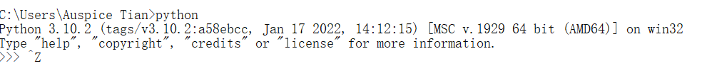

### 创建vscode-python文件夹

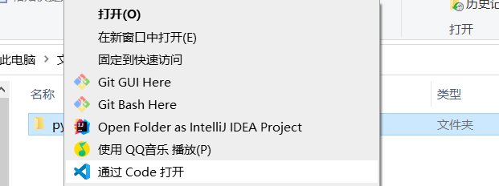

#### 裸配置

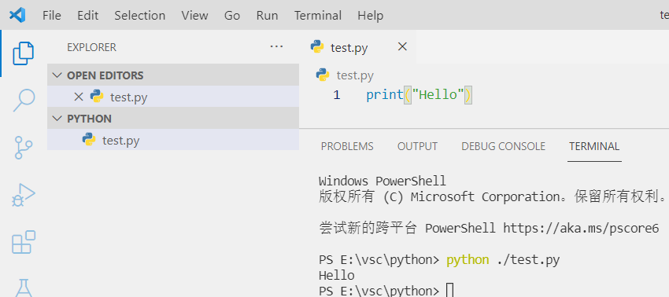

如图，与在命令行运行无区别

### 安装vscode-python插件

### code插件运行.py

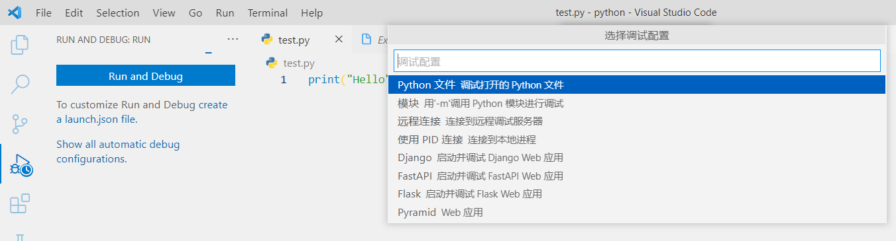

#### 添加配置文件

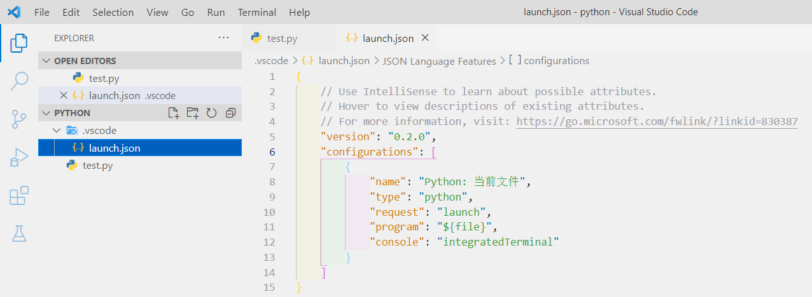

##### program

>   设置启动文件

```
"program": "${file}",
```

code宏定义：选中那个文件 *F5* 运行那个文件

#### code调试功能

-   设置断点后， *F5* 运行至断点处

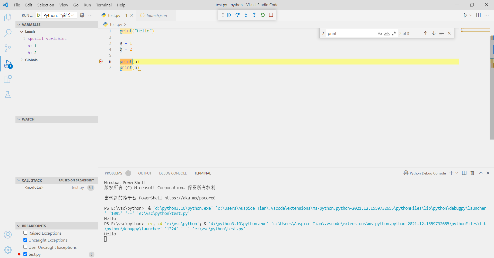

-   *F10* 从断点处逐行执行

    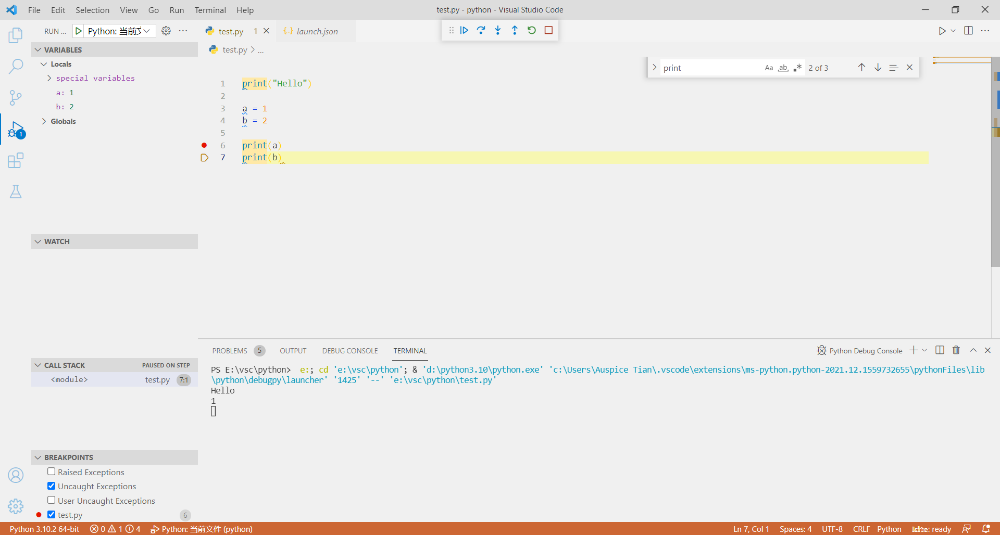

    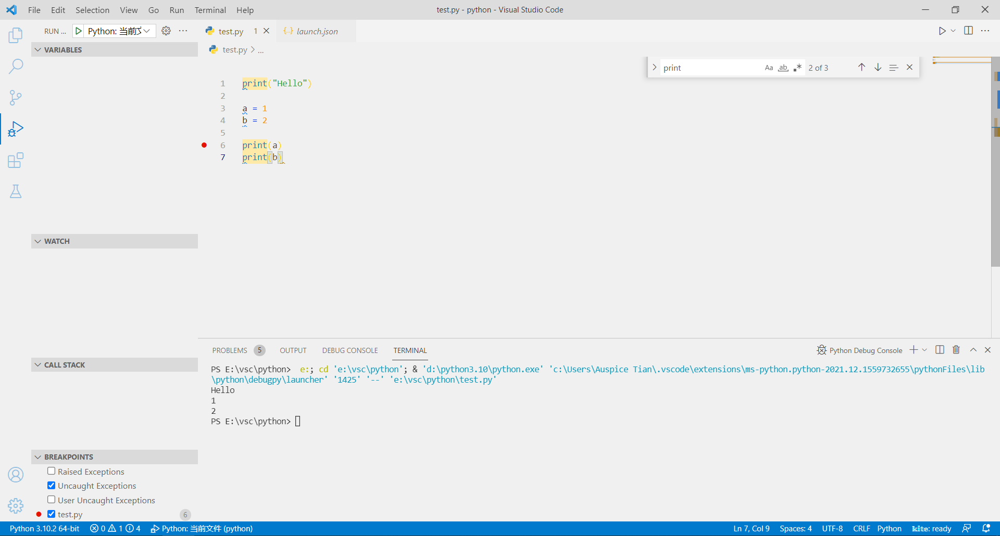

## 跨文件夹调用

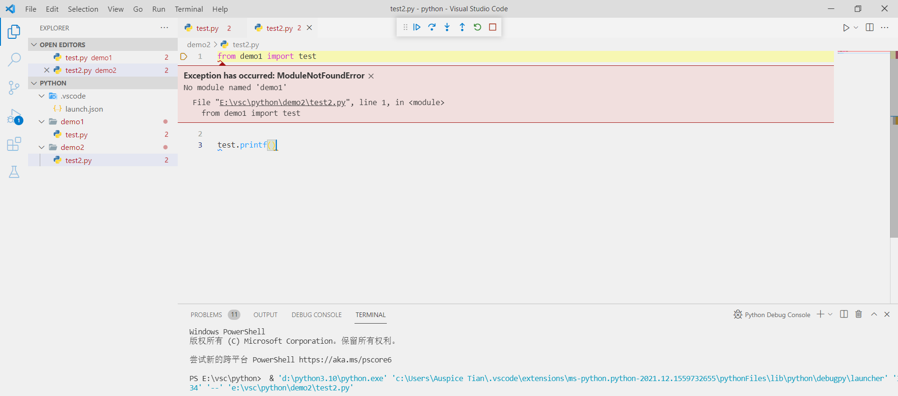

```python
import sys
sys.path.append("./") # 将当前文件夹添加到系统目录中
```

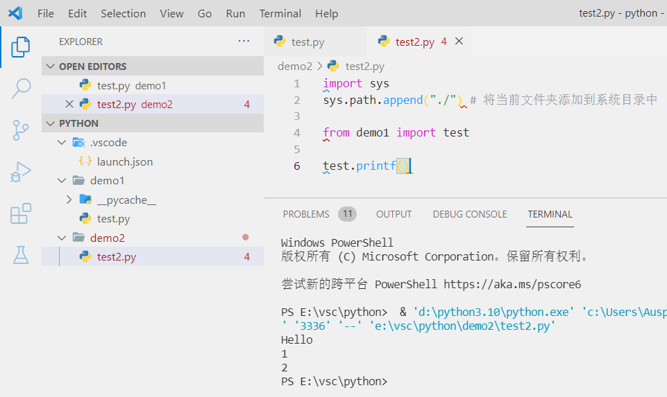

## conda管理python环境

### 查看已有环境

```shell
conda info -e
```

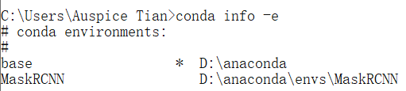

### 新建环境conda

```shell
conda create -n [env_name] python=3.xx
```

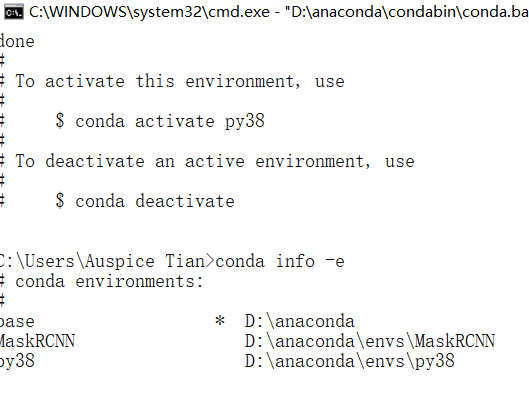

### 使用conda环境

```shell
conda activate [env_name]
```

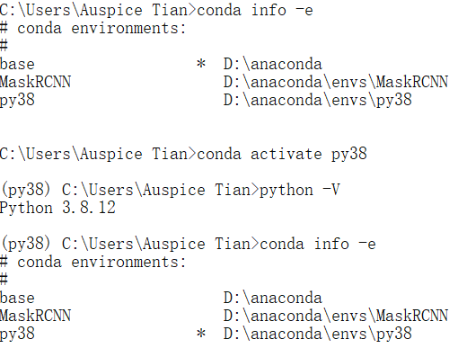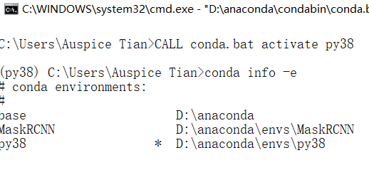


