# C++

## 单文件编译

### 1. 下载vsc扩展

### 2. 下载C++编译器

https://winlibs.com/

1.  查看版本

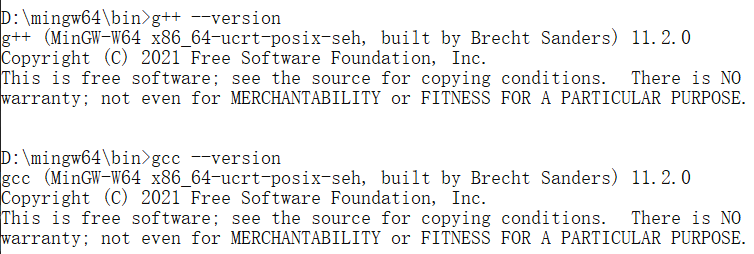

2.  配置环境变量


3.  编写程序，测试编译器

    ```c++
    # include<stdio.h>
    # include<windows.h>
    
    int main(){
        printf("hello\n");
    
        system("pause");
        return 0;
    }
    ```

    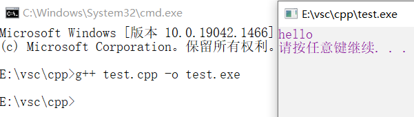

### 3. vsc使用自己下载的编译器

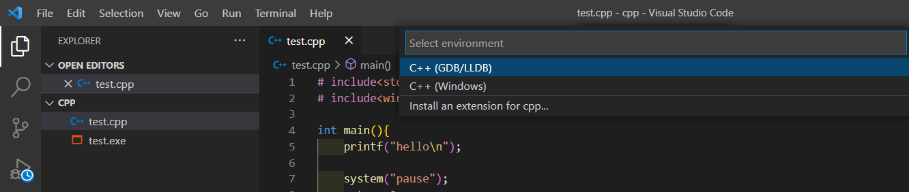

-   GDB为自己下载的编译器

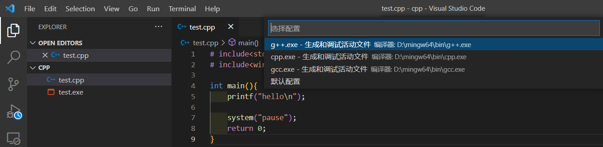

-   此时，生成 *launch.json* 和 *tasks.json* 两个配置文件

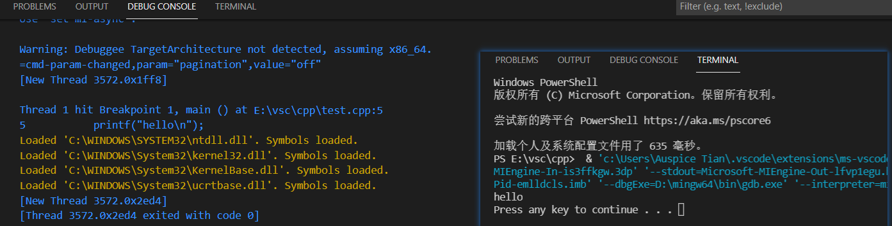

#### launch.json

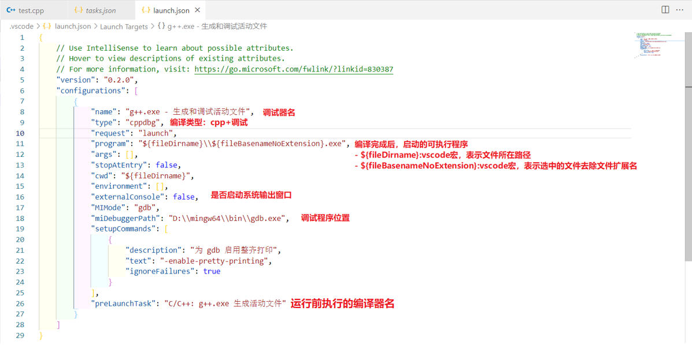

#### task.json

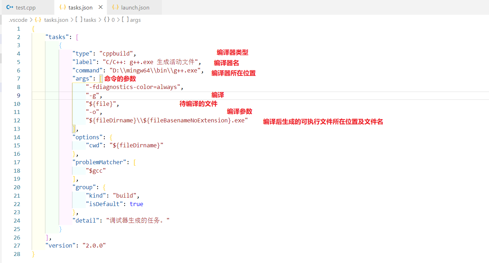

## 多文件编译

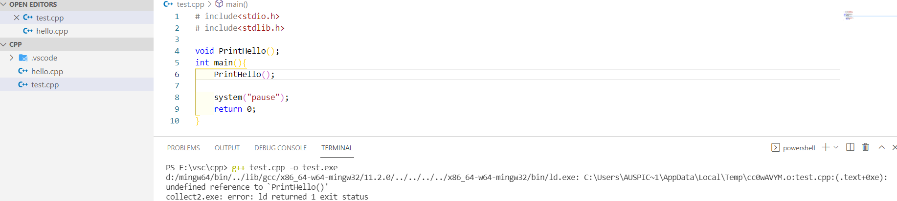

```shell
g++ test.cpp -o test.exe //用g++编译器将 test.cpp 链接成 test.exe
```

报错：没有找得到 `PrintHello()` 的定义

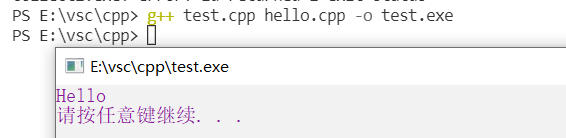

```c
g++ test.cpp hello.cpp -o test.exe //用g++编译器将test.cpp和hello.cpp链接成一个可执行文件
```

### 1. C/C++编译过程

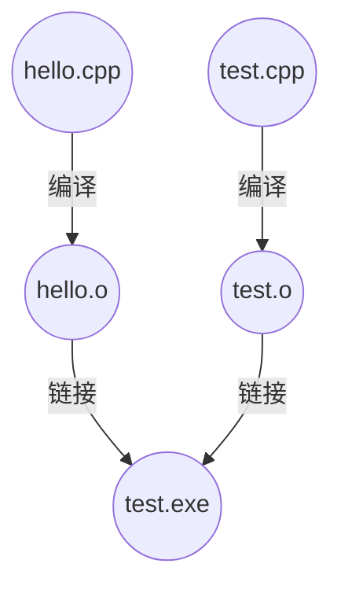

### 2. cmake构建工具

1.  [cmake下载地址](https://cmake.org/download/)

2.  vscode 安装 cmake 插件

    -   cmake：命令提示
    -   cmaketools：核心工具

3.  将cmake添加到环境变量或修改 cmaketools的配置文件

    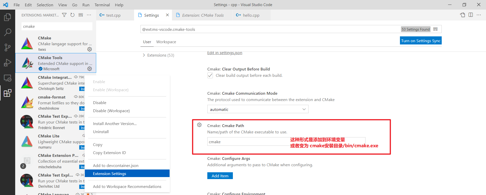

4.  目录下新建 `CMakeLists.txt` 

    ```
    project(#项目名)
    
    aux_source_directory(目录 定义为变量名)
    
    add_executable(#项目名 #目标目录)
    ```

    ```
    project(test)
    
    aux_source_directory(./src SRCS)
    
    add_executable(${PROJECT_NAME} ${SRCS})
    ```

5.  不再需要编译配置文件 task.json及删除launch.json文件中的 `      "preLaunchTask": "C/C++: g++.exe 生成活动文件"` 配置项

### 3. cmake构建项目

1.  选择 cmake 的编译器

    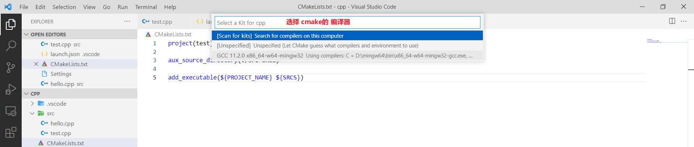

2.  使用cmake调试

    

    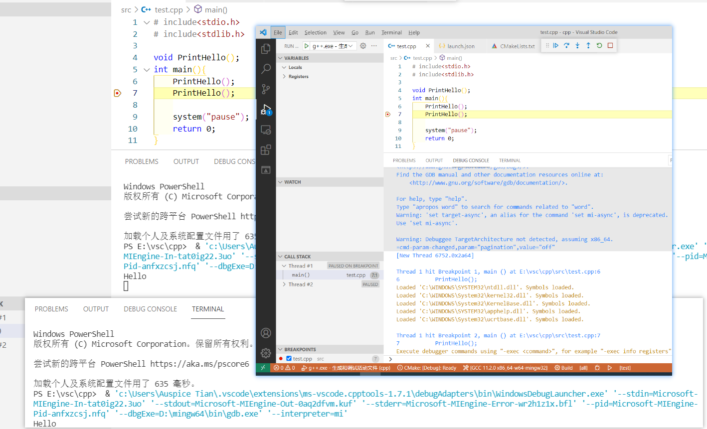

3.  修改配置文件，使 F5 调用cmake调试

    ```json
    {
        "configurations" : [
            ...
    	    "program":"${command:cmake.launchTargetPath}"
        	...
        ]
    }
    ```

    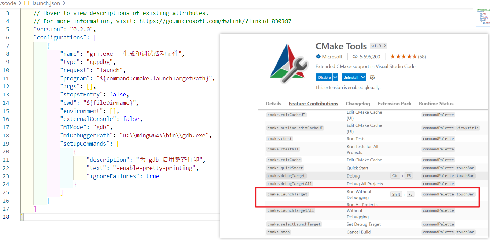

**注**

新增文件，需要变动重新保存一下CMakeLists.txt文件，刷新缓冲

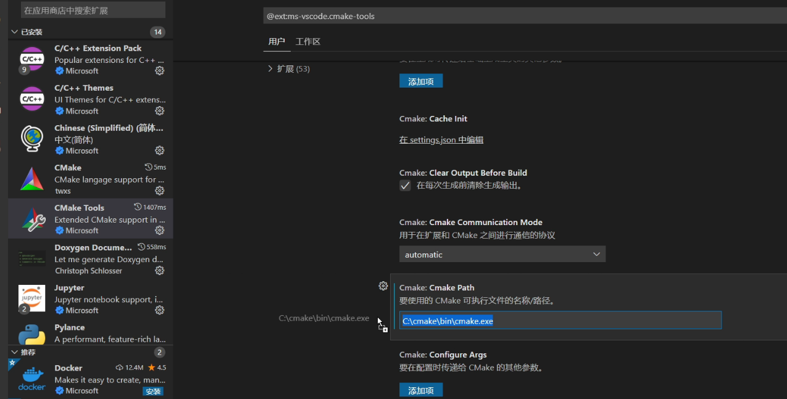