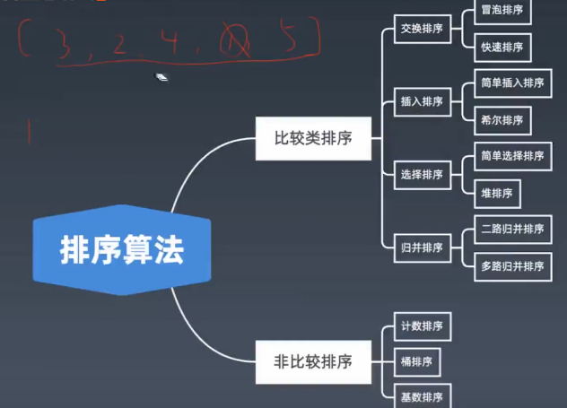

# 算法学习路线

## 1. 从代码能力练起

-   算法能力——有没有思路，会不会做，解法效率

-   代码能力——有思路，能不能把程序又快又对写出来

尽量不抄代码

避免单步调试，多练习输出调试和智商模拟调试

**分类刷题**

-   加深某一方面只是，更方便知识之间类比
-   有助于科学思维模式的形成

## 刷题方法

### 三刷

**一刷**：

小类别代表性题目

可以看题解，在复现

**二刷**：

复习代表性题目；

刷该分类更多题目；举一反三，尽量少的提示下完成

**三刷**：

综合性题目

独立实现+测试

### 五步

#### 1. 理解题面

-   想更多的例子和测试数据，有没有遗漏
-   提炼题目中关键信息、**变化信息**

#### 2. 部分实现

无论什么题目，尝试实现一个朴素解法

-   一般是搜索
-   锻炼代码能力

自己实现部分场景下的解法

-   尽量使自己解法更优，覆盖更多场景

#### 3. 有提示解答

#### 3. 有提示解答

前期想20min不会，看题解，中期想10min没思路，看提示在想10min

看提示 $$\neq$$ 看题解

-   题目类别，题解标题，时间复杂度，一个小结论

#### 4. 独立解答

独立求解，注意测试用例构造

#### 5. 写题解

-   尝试分析对比各种不同解法的优劣